cola Report for GDS1284
==================

**Date**: 2019-12-25 20:17:12 CET, **cola version**: 1.3.2

----------------------------------------------------------------

<style type='text/css'>

body, td, th {
   font-family: Arial,Helvetica,sans-serif;
   background-color: white;
   font-size: 13px;
  max-width: 800px;
  margin: auto;
  margin-left:210px;
  padding: 0px 10px 0px 10px;
  border-left: 1px solid #EEEEEE;
  line-height: 150%;
}

tt, code, pre {
   font-family: 'DejaVu Sans Mono', 'Droid Sans Mono', 'Lucida Console', Consolas, Monaco, 

monospace;
}

h1 {
   font-size:2.2em;
}

h2 {
   font-size:1.8em;
}

h3 {
   font-size:1.4em;
}

h4 {
   font-size:1.0em;
}

h5 {
   font-size:0.9em;
}

h6 {
   font-size:0.8em;
}

a {
  text-decoration: none;
  color: #0366d6;
}

a:hover {
  text-decoration: underline;
}

a:visited {
   color: #0366d6;
}

pre, img {
  max-width: 100%;
}
pre {
  overflow-x: auto;
}
pre code {
   display: block; padding: 0.5em;
}

code {
  font-size: 92%;
  border: 1px solid #ccc;
}

code[class] {
  background-color: #F8F8F8;
}

table, td, th {
  border: 1px solid #ccc;
}

blockquote {
   color:#666666;
   margin:0;
   padding-left: 1em;
   border-left: 0.5em #EEE solid;
}

hr {
   height: 0px;
   border-bottom: none;
   border-top-width: thin;
   border-top-style: dotted;
   border-top-color: #999999;
}

@media print {
   * {
      background: transparent !important;
      color: black !important;
      filter:none !important;
      -ms-filter: none !important;
   }

   body {
      font-size:12pt;
      max-width:100%;
   }

   a, a:visited {
      text-decoration: underline;
   }

   hr {
      visibility: hidden;
      page-break-before: always;
   }

   pre, blockquote {
      padding-right: 1em;
      page-break-inside: avoid;
   }

   tr, img {
      page-break-inside: avoid;
   }

   img {
      max-width: 100% !important;
   }

   @page :left {
      margin: 15mm 20mm 15mm 10mm;
   }

   @page :right {
      margin: 15mm 10mm 15mm 20mm;
   }

   p, h2, h3 {
      orphans: 3; widows: 3;
   }

   h2, h3 {
      page-break-after: avoid;
   }
}
</style>


## Summary


All available functions which can be applied to this `res_list` object:


```r
res_list
```

```
#> A 'ConsensusPartitionList' object with 24 methods.
#>   On a matrix with 21168 rows and 50 columns.
#>   Top rows are extracted by 'SD, CV, MAD, ATC' methods.
#>   Subgroups are detected by 'hclust, kmeans, skmeans, pam, mclust, NMF' method.
#>   Number of partitions are tried for k = 2, 3, 4, 5, 6.
#>   Performed in total 30000 partitions by row resampling.
#> 
#> Following methods can be applied to this 'ConsensusPartitionList' object:
#>  [1] "cola_report"           "collect_classes"       "collect_plots"         "collect_stats"        
#>  [5] "colnames"              "functional_enrichment" "get_anno_col"          "get_anno"             
#>  [9] "get_classes"           "get_matrix"            "get_membership"        "get_stats"            
#> [13] "is_best_k"             "is_stable_k"           "ncol"                  "nrow"                 
#> [17] "rownames"              "show"                  "suggest_best_k"        "test_to_known_factors"
#> [21] "top_rows_heatmap"      "top_rows_overlap"     
#> 
#> You can get result for a single method by, e.g. object["SD", "hclust"] or object["SD:hclust"]
#> or a subset of methods by object[c("SD", "CV")], c("hclust", "kmeans")]
```

The call of `run_all_consensus_partition_methods()` was:


```
#> run_all_consensus_partition_methods(data = mat, mc.cores = 4, anno = anno)
```

Dimension of the input matrix:


```r
mat = get_matrix(res_list)
dim(mat)
```

```
#> [1] 21168    50
```

### Density distribution

The density distribution for each sample is visualized as in one column in the
following heatmap. The clustering is based on the distance which is the
Kolmogorov-Smirnov statistic between two distributions.


```r
library(ComplexHeatmap)
densityHeatmap(mat, top_annotation = HeatmapAnnotation(df = get_anno(res_list), 
    col = get_anno_col(res_list)), ylab = "value", cluster_columns = TRUE, show_column_names = FALSE,
    mc.cores = 4)
```

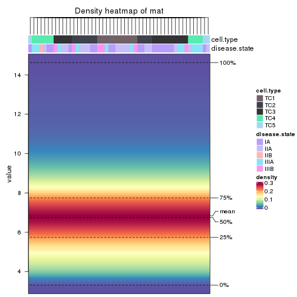


### Suggest the best k


Folowing table shows the best `k` (number of partitions) for each combination
of top-value methods and partition methods. Clicking on the method name in
the table goes to the section for a single combination of methods.

[The cola vignette](http://bioconductor.org/packages/devel/bioc/vignettes/cola/inst/doc/cola.html#toc_13)
explains the definition of the metrics used for determining the best
number of partitions.


```r
suggest_best_k(res_list)
```


|                            | The best k| 1-PAC| Mean silhouette| Concordance|   |Optional k |
|:---------------------------|----------:|-----:|---------------:|-----------:|:--|:----------|
|[CV:pam](#CV-pam)           |          2| 1.000|           0.977|       0.989|** |           |
|[MAD:hclust](#MAD-hclust)   |          2| 1.000|           0.942|       0.959|** |           |
|[ATC:skmeans](#ATC-skmeans) |          2| 1.000|           0.970|       0.989|** |           |
|[ATC:NMF](#ATC-NMF)         |          2| 0.999|           0.960|       0.981|** |           |
|[CV:NMF](#CV-NMF)           |          4| 0.958|           0.909|       0.960|** |           |
|[ATC:kmeans](#ATC-kmeans)   |          4| 0.957|           0.919|       0.946|** |2          |
|[SD:hclust](#SD-hclust)     |          2| 0.953|           0.939|       0.961|** |           |
|[ATC:pam](#ATC-pam)         |          6| 0.950|           0.927|       0.967|** |2,4        |
|[CV:skmeans](#CV-skmeans)   |          4| 0.926|           0.901|       0.952|*  |           |
|[SD:NMF](#SD-NMF)           |          4| 0.916|           0.907|       0.957|*  |           |
|[SD:mclust](#SD-mclust)     |          4| 0.909|           0.852|       0.944|*  |           |
|[MAD:NMF](#MAD-NMF)         |          3| 0.870|           0.889|       0.953|   |           |
|[ATC:mclust](#ATC-mclust)   |          4| 0.870|           0.899|       0.952|   |           |
|[MAD:mclust](#MAD-mclust)   |          4| 0.866|           0.828|       0.924|   |           |
|[MAD:pam](#MAD-pam)         |          5| 0.834|           0.836|       0.928|   |           |
|[CV:mclust](#CV-mclust)     |          4| 0.828|           0.774|       0.909|   |           |
|[MAD:skmeans](#MAD-skmeans) |          3| 0.799|           0.871|       0.942|   |           |
|[SD:pam](#SD-pam)           |          3| 0.771|           0.785|       0.921|   |           |
|[CV:kmeans](#CV-kmeans)     |          5| 0.726|           0.743|       0.811|   |           |
|[SD:skmeans](#SD-skmeans)   |          2| 0.710|           0.888|       0.944|   |           |
|[SD:kmeans](#SD-kmeans)     |          4| 0.684|           0.793|       0.860|   |           |
|[MAD:kmeans](#MAD-kmeans)   |          3| 0.648|           0.866|       0.907|   |           |
|[ATC:hclust](#ATC-hclust)   |          5| 0.604|           0.637|       0.849|   |           |
|[CV:hclust](#CV-hclust)     |          3| 0.393|           0.808|       0.845|   |           |

\*\*: 1-PAC > 0.95, \*: 1-PAC > 0.9


### CDF of consensus matrices

Cumulative distribution function curves of consensus matrix for all methods.


```r
collect_plots(res_list, fun = plot_ecdf)
```

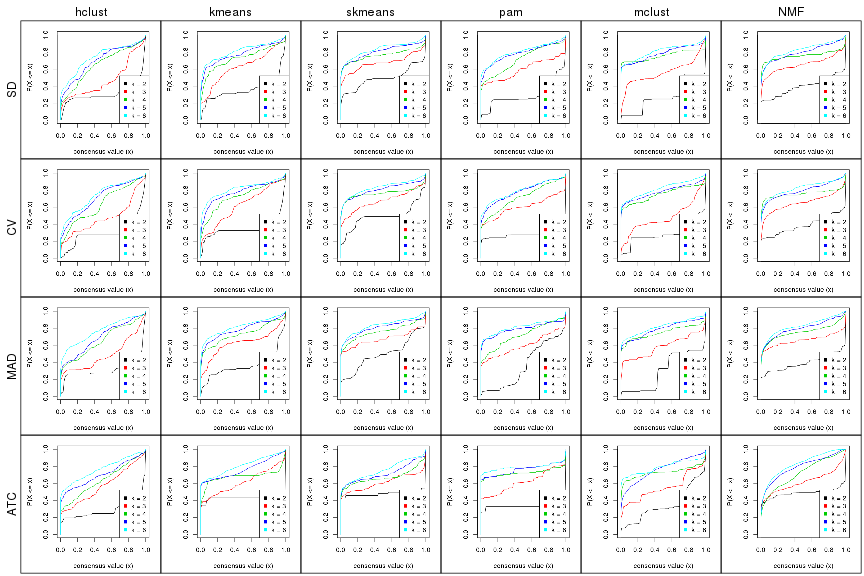


### Consensus heatmap

Consensus heatmaps for all methods. ([What is a consensus heatmap?](http://bioconductor.org/packages/devel/bioc/vignettes/cola/inst/doc/cola.html#toc_9))


<style type='text/css'>


.ui-helper-hidden {
	display: none;
}
.ui-helper-hidden-accessible {
	border: 0;
	clip: rect(0 0 0 0);
	height: 1px;
	margin: -1px;
	overflow: hidden;
	padding: 0;
	position: absolute;
	width: 1px;
}
.ui-helper-reset {
	margin: 0;
	padding: 0;
	border: 0;
	outline: 0;
	line-height: 1.3;
	text-decoration: none;
	font-size: 100%;
	list-style: none;
}
.ui-helper-clearfix:before,
.ui-helper-clearfix:after {
	content: "";
	display: table;
	border-collapse: collapse;
}
.ui-helper-clearfix:after {
	clear: both;
}
.ui-helper-zfix {
	width: 100%;
	height: 100%;
	top: 0;
	left: 0;
	position: absolute;
	opacity: 0;
	filter:Alpha(Opacity=0); 
}

.ui-front {
	z-index: 100;
}


.ui-state-disabled {
	cursor: default !important;
	pointer-events: none;
}


.ui-icon {
	display: inline-block;
	vertical-align: middle;
	margin-top: -.25em;
	position: relative;
	text-indent: -99999px;
	overflow: hidden;
	background-repeat: no-repeat;
}

.ui-widget-icon-block {
	left: 50%;
	margin-left: -8px;
	display: block;
}


.ui-widget-overlay {
	position: fixed;
	top: 0;
	left: 0;
	width: 100%;
	height: 100%;
}
.ui-accordion .ui-accordion-header {
	display: block;
	cursor: pointer;
	position: relative;
	margin: 2px 0 0 0;
	padding: .5em .5em .5em .7em;
	font-size: 100%;
}
.ui-accordion .ui-accordion-content {
	padding: 1em 2.2em;
	border-top: 0;
	overflow: auto;
}
.ui-autocomplete {
	position: absolute;
	top: 0;
	left: 0;
	cursor: default;
}
.ui-menu {
	list-style: none;
	padding: 0;
	margin: 0;
	display: block;
	outline: 0;
}
.ui-menu .ui-menu {
	position: absolute;
}
.ui-menu .ui-menu-item {
	margin: 0;
	cursor: pointer;
	
	list-style-image: url("data:image/gif;base64,R0lGODlhAQABAIAAAAAAAP///yH5BAEAAAAALAAAAAABAAEAAAIBRAA7");
}
.ui-menu .ui-menu-item-wrapper {
	position: relative;
	padding: 3px 1em 3px .4em;
}
.ui-menu .ui-menu-divider {
	margin: 5px 0;
	height: 0;
	font-size: 0;
	line-height: 0;
	border-width: 1px 0 0 0;
}
.ui-menu .ui-state-focus,
.ui-menu .ui-state-active {
	margin: -1px;
}


.ui-menu-icons {
	position: relative;
}
.ui-menu-icons .ui-menu-item-wrapper {
	padding-left: 2em;
}


.ui-menu .ui-icon {
	position: absolute;
	top: 0;
	bottom: 0;
	left: .2em;
	margin: auto 0;
}


.ui-menu .ui-menu-icon {
	left: auto;
	right: 0;
}
.ui-button {
	padding: .4em 1em;
	display: inline-block;
	position: relative;
	line-height: normal;
	margin-right: .1em;
	cursor: pointer;
	vertical-align: middle;
	text-align: center;
	-webkit-user-select: none;
	-moz-user-select: none;
	-ms-user-select: none;
	user-select: none;

	
	overflow: visible;
}

.ui-button,
.ui-button:link,
.ui-button:visited,
.ui-button:hover,
.ui-button:active {
	text-decoration: none;
}


.ui-button-icon-only {
	width: 2em;
	box-sizing: border-box;
	text-indent: -9999px;
	white-space: nowrap;
}


input.ui-button.ui-button-icon-only {
	text-indent: 0;
}


.ui-button-icon-only .ui-icon {
	position: absolute;
	top: 50%;
	left: 50%;
	margin-top: -8px;
	margin-left: -8px;
}

.ui-button.ui-icon-notext .ui-icon {
	padding: 0;
	width: 2.1em;
	height: 2.1em;
	text-indent: -9999px;
	white-space: nowrap;

}

input.ui-button.ui-icon-notext .ui-icon {
	width: auto;
	height: auto;
	text-indent: 0;
	white-space: normal;
	padding: .4em 1em;
}


input.ui-button::-moz-focus-inner,
button.ui-button::-moz-focus-inner {
	border: 0;
	padding: 0;
}
.ui-controlgroup {
	vertical-align: middle;
	display: inline-block;
}
.ui-controlgroup > .ui-controlgroup-item {
	float: left;
	margin-left: 0;
	margin-right: 0;
}
.ui-controlgroup > .ui-controlgroup-item:focus,
.ui-controlgroup > .ui-controlgroup-item.ui-visual-focus {
	z-index: 9999;
}
.ui-controlgroup-vertical > .ui-controlgroup-item {
	display: block;
	float: none;
	width: 100%;
	margin-top: 0;
	margin-bottom: 0;
	text-align: left;
}
.ui-controlgroup-vertical .ui-controlgroup-item {
	box-sizing: border-box;
}
.ui-controlgroup .ui-controlgroup-label {
	padding: .4em 1em;
}
.ui-controlgroup .ui-controlgroup-label span {
	font-size: 80%;
}
.ui-controlgroup-horizontal .ui-controlgroup-label + .ui-controlgroup-item {
	border-left: none;
}
.ui-controlgroup-vertical .ui-controlgroup-label + .ui-controlgroup-item {
	border-top: none;
}
.ui-controlgroup-horizontal .ui-controlgroup-label.ui-widget-content {
	border-right: none;
}
.ui-controlgroup-vertical .ui-controlgroup-label.ui-widget-content {
	border-bottom: none;
}


.ui-controlgroup-vertical .ui-spinner-input {

	
	width: 75%;
	width: calc( 100% - 2.4em );
}
.ui-controlgroup-vertical .ui-spinner .ui-spinner-up {
	border-top-style: solid;
}

.ui-checkboxradio-label .ui-icon-background {
	box-shadow: inset 1px 1px 1px #ccc;
	border-radius: .12em;
	border: none;
}
.ui-checkboxradio-radio-label .ui-icon-background {
	width: 16px;
	height: 16px;
	border-radius: 1em;
	overflow: visible;
	border: none;
}
.ui-checkboxradio-radio-label.ui-checkboxradio-checked .ui-icon,
.ui-checkboxradio-radio-label.ui-checkboxradio-checked:hover .ui-icon {
	background-image: none;
	width: 8px;
	height: 8px;
	border-width: 4px;
	border-style: solid;
}
.ui-checkboxradio-disabled {
	pointer-events: none;
}
.ui-datepicker {
	width: 17em;
	padding: .2em .2em 0;
	display: none;
}
.ui-datepicker .ui-datepicker-header {
	position: relative;
	padding: .2em 0;
}
.ui-datepicker .ui-datepicker-prev,
.ui-datepicker .ui-datepicker-next {
	position: absolute;
	top: 2px;
	width: 1.8em;
	height: 1.8em;
}
.ui-datepicker .ui-datepicker-prev-hover,
.ui-datepicker .ui-datepicker-next-hover {
	top: 1px;
}
.ui-datepicker .ui-datepicker-prev {
	left: 2px;
}
.ui-datepicker .ui-datepicker-next {
	right: 2px;
}
.ui-datepicker .ui-datepicker-prev-hover {
	left: 1px;
}
.ui-datepicker .ui-datepicker-next-hover {
	right: 1px;
}
.ui-datepicker .ui-datepicker-prev span,
.ui-datepicker .ui-datepicker-next span {
	display: block;
	position: absolute;
	left: 50%;
	margin-left: -8px;
	top: 50%;
	margin-top: -8px;
}
.ui-datepicker .ui-datepicker-title {
	margin: 0 2.3em;
	line-height: 1.8em;
	text-align: center;
}
.ui-datepicker .ui-datepicker-title select {
	font-size: 1em;
	margin: 1px 0;
}
.ui-datepicker select.ui-datepicker-month,
.ui-datepicker select.ui-datepicker-year {
	width: 45%;
}
.ui-datepicker table {
	width: 100%;
	font-size: .9em;
	border-collapse: collapse;
	margin: 0 0 .4em;
}
.ui-datepicker th {
	padding: .7em .3em;
	text-align: center;
	font-weight: bold;
	border: 0;
}
.ui-datepicker td {
	border: 0;
	padding: 1px;
}
.ui-datepicker td span,
.ui-datepicker td a {
	display: block;
	padding: .2em;
	text-align: right;
	text-decoration: none;
}
.ui-datepicker .ui-datepicker-buttonpane {
	background-image: none;
	margin: .7em 0 0 0;
	padding: 0 .2em;
	border-left: 0;
	border-right: 0;
	border-bottom: 0;
}
.ui-datepicker .ui-datepicker-buttonpane button {
	float: right;
	margin: .5em .2em .4em;
	cursor: pointer;
	padding: .2em .6em .3em .6em;
	width: auto;
	overflow: visible;
}
.ui-datepicker .ui-datepicker-buttonpane button.ui-datepicker-current {
	float: left;
}


.ui-datepicker.ui-datepicker-multi {
	width: auto;
}
.ui-datepicker-multi .ui-datepicker-group {
	float: left;
}
.ui-datepicker-multi .ui-datepicker-group table {
	width: 95%;
	margin: 0 auto .4em;
}
.ui-datepicker-multi-2 .ui-datepicker-group {
	width: 50%;
}
.ui-datepicker-multi-3 .ui-datepicker-group {
	width: 33.3%;
}
.ui-datepicker-multi-4 .ui-datepicker-group {
	width: 25%;
}
.ui-datepicker-multi .ui-datepicker-group-last .ui-datepicker-header,
.ui-datepicker-multi .ui-datepicker-group-middle .ui-datepicker-header {
	border-left-width: 0;
}
.ui-datepicker-multi .ui-datepicker-buttonpane {
	clear: left;
}
.ui-datepicker-row-break {
	clear: both;
	width: 100%;
	font-size: 0;
}


.ui-datepicker-rtl {
	direction: rtl;
}
.ui-datepicker-rtl .ui-datepicker-prev {
	right: 2px;
	left: auto;
}
.ui-datepicker-rtl .ui-datepicker-next {
	left: 2px;
	right: auto;
}
.ui-datepicker-rtl .ui-datepicker-prev:hover {
	right: 1px;
	left: auto;
}
.ui-datepicker-rtl .ui-datepicker-next:hover {
	left: 1px;
	right: auto;
}
.ui-datepicker-rtl .ui-datepicker-buttonpane {
	clear: right;
}
.ui-datepicker-rtl .ui-datepicker-buttonpane button {
	float: left;
}
.ui-datepicker-rtl .ui-datepicker-buttonpane button.ui-datepicker-current,
.ui-datepicker-rtl .ui-datepicker-group {
	float: right;
}
.ui-datepicker-rtl .ui-datepicker-group-last .ui-datepicker-header,
.ui-datepicker-rtl .ui-datepicker-group-middle .ui-datepicker-header {
	border-right-width: 0;
	border-left-width: 1px;
}


.ui-datepicker .ui-icon {
	display: block;
	text-indent: -99999px;
	overflow: hidden;
	background-repeat: no-repeat;
	left: .5em;
	top: .3em;
}
.ui-dialog {
	position: absolute;
	top: 0;
	left: 0;
	padding: .2em;
	outline: 0;
}
.ui-dialog .ui-dialog-titlebar {
	padding: .4em 1em;
	position: relative;
}
.ui-dialog .ui-dialog-title {
	float: left;
	margin: .1em 0;
	white-space: nowrap;
	width: 90%;
	overflow: hidden;
	text-overflow: ellipsis;
}
.ui-dialog .ui-dialog-titlebar-close {
	position: absolute;
	right: .3em;
	top: 50%;
	width: 20px;
	margin: -10px 0 0 0;
	padding: 1px;
	height: 20px;
}
.ui-dialog .ui-dialog-content {
	position: relative;
	border: 0;
	padding: .5em 1em;
	background: none;
	overflow: auto;
}
.ui-dialog .ui-dialog-buttonpane {
	text-align: left;
	border-width: 1px 0 0 0;
	background-image: none;
	margin-top: .5em;
	padding: .3em 1em .5em .4em;
}
.ui-dialog .ui-dialog-buttonpane .ui-dialog-buttonset {
	float: right;
}
.ui-dialog .ui-dialog-buttonpane button {
	margin: .5em .4em .5em 0;
	cursor: pointer;
}
.ui-dialog .ui-resizable-n {
	height: 2px;
	top: 0;
}
.ui-dialog .ui-resizable-e {
	width: 2px;
	right: 0;
}
.ui-dialog .ui-resizable-s {
	height: 2px;
	bottom: 0;
}
.ui-dialog .ui-resizable-w {
	width: 2px;
	left: 0;
}
.ui-dialog .ui-resizable-se,
.ui-dialog .ui-resizable-sw,
.ui-dialog .ui-resizable-ne,
.ui-dialog .ui-resizable-nw {
	width: 7px;
	height: 7px;
}
.ui-dialog .ui-resizable-se {
	right: 0;
	bottom: 0;
}
.ui-dialog .ui-resizable-sw {
	left: 0;
	bottom: 0;
}
.ui-dialog .ui-resizable-ne {
	right: 0;
	top: 0;
}
.ui-dialog .ui-resizable-nw {
	left: 0;
	top: 0;
}
.ui-draggable .ui-dialog-titlebar {
	cursor: move;
}
.ui-draggable-handle {
	-ms-touch-action: none;
	touch-action: none;
}
.ui-resizable {
	position: relative;
}
.ui-resizable-handle {
	position: absolute;
	font-size: 0.1px;
	display: block;
	-ms-touch-action: none;
	touch-action: none;
}
.ui-resizable-disabled .ui-resizable-handle,
.ui-resizable-autohide .ui-resizable-handle {
	display: none;
}
.ui-resizable-n {
	cursor: n-resize;
	height: 7px;
	width: 100%;
	top: -5px;
	left: 0;
}
.ui-resizable-s {
	cursor: s-resize;
	height: 7px;
	width: 100%;
	bottom: -5px;
	left: 0;
}
.ui-resizable-e {
	cursor: e-resize;
	width: 7px;
	right: -5px;
	top: 0;
	height: 100%;
}
.ui-resizable-w {
	cursor: w-resize;
	width: 7px;
	left: -5px;
	top: 0;
	height: 100%;
}
.ui-resizable-se {
	cursor: se-resize;
	width: 12px;
	height: 12px;
	right: 1px;
	bottom: 1px;
}
.ui-resizable-sw {
	cursor: sw-resize;
	width: 9px;
	height: 9px;
	left: -5px;
	bottom: -5px;
}
.ui-resizable-nw {
	cursor: nw-resize;
	width: 9px;
	height: 9px;
	left: -5px;
	top: -5px;
}
.ui-resizable-ne {
	cursor: ne-resize;
	width: 9px;
	height: 9px;
	right: -5px;
	top: -5px;
}
.ui-progressbar {
	height: 2em;
	text-align: left;
	overflow: hidden;
}
.ui-progressbar .ui-progressbar-value {
	margin: -1px;
	height: 100%;
}
.ui-progressbar .ui-progressbar-overlay {
	background: url("");
	height: 100%;
	filter: alpha(opacity=25); 
	opacity: 0.25;
}
.ui-progressbar-indeterminate .ui-progressbar-value {
	background-image: none;
}
.ui-selectable {
	-ms-touch-action: none;
	touch-action: none;
}
.ui-selectable-helper {
	position: absolute;
	z-index: 100;
	border: 1px dotted black;
}
.ui-selectmenu-menu {
	padding: 0;
	margin: 0;
	position: absolute;
	top: 0;
	left: 0;
	display: none;
}
.ui-selectmenu-menu .ui-menu {
	overflow: auto;
	overflow-x: hidden;
	padding-bottom: 1px;
}
.ui-selectmenu-menu .ui-menu .ui-selectmenu-optgroup {
	font-size: 1em;
	font-weight: bold;
	line-height: 1.5;
	padding: 2px 0.4em;
	margin: 0.5em 0 0 0;
	height: auto;
	border: 0;
}
.ui-selectmenu-open {
	display: block;
}
.ui-selectmenu-text {
	display: block;
	margin-right: 20px;
	overflow: hidden;
	text-overflow: ellipsis;
}
.ui-selectmenu-button.ui-button {
	text-align: left;
	white-space: nowrap;
	width: 14em;
}
.ui-selectmenu-icon.ui-icon {
	float: right;
	margin-top: 0;
}
.ui-slider {
	position: relative;
	text-align: left;
}
.ui-slider .ui-slider-handle {
	position: absolute;
	z-index: 2;
	width: 1.2em;
	height: 1.2em;
	cursor: default;
	-ms-touch-action: none;
	touch-action: none;
}
.ui-slider .ui-slider-range {
	position: absolute;
	z-index: 1;
	font-size: .7em;
	display: block;
	border: 0;
	background-position: 0 0;
}


.ui-slider.ui-state-disabled .ui-slider-handle,
.ui-slider.ui-state-disabled .ui-slider-range {
	filter: inherit;
}

.ui-slider-horizontal {
	height: .8em;
}
.ui-slider-horizontal .ui-slider-handle {
	top: -.3em;
	margin-left: -.6em;
}
.ui-slider-horizontal .ui-slider-range {
	top: 0;
	height: 100%;
}
.ui-slider-horizontal .ui-slider-range-min {
	left: 0;
}
.ui-slider-horizontal .ui-slider-range-max {
	right: 0;
}

.ui-slider-vertical {
	width: .8em;
	height: 100px;
}
.ui-slider-vertical .ui-slider-handle {
	left: -.3em;
	margin-left: 0;
	margin-bottom: -.6em;
}
.ui-slider-vertical .ui-slider-range {
	left: 0;
	width: 100%;
}
.ui-slider-vertical .ui-slider-range-min {
	bottom: 0;
}
.ui-slider-vertical .ui-slider-range-max {
	top: 0;
}
.ui-sortable-handle {
	-ms-touch-action: none;
	touch-action: none;
}
.ui-spinner {
	position: relative;
	display: inline-block;
	overflow: hidden;
	padding: 0;
	vertical-align: middle;
}
.ui-spinner-input {
	border: none;
	background: none;
	color: inherit;
	padding: .222em 0;
	margin: .2em 0;
	vertical-align: middle;
	margin-left: .4em;
	margin-right: 2em;
}
.ui-spinner-button {
	width: 1.6em;
	height: 50%;
	font-size: .5em;
	padding: 0;
	margin: 0;
	text-align: center;
	position: absolute;
	cursor: default;
	display: block;
	overflow: hidden;
	right: 0;
}

.ui-spinner a.ui-spinner-button {
	border-top-style: none;
	border-bottom-style: none;
	border-right-style: none;
}
.ui-spinner-up {
	top: 0;
}
.ui-spinner-down {
	bottom: 0;
}
.ui-tabs {
	position: relative;
	padding: .2em;
}
.ui-tabs .ui-tabs-nav {
	margin: 0;
	padding: .2em .2em 0;
}
.ui-tabs .ui-tabs-nav li {
	list-style: none;
	float: left;
	position: relative;
	top: 0;
	margin: 1px .2em 0 0;
	border-bottom-width: 0;
	padding: 0;
	white-space: nowrap;
}
.ui-tabs .ui-tabs-nav .ui-tabs-anchor {
	float: left;
	padding: .5em 1em;
	text-decoration: none;
}
.ui-tabs .ui-tabs-nav li.ui-tabs-active {
	margin-bottom: -1px;
	padding-bottom: 1px;
}
.ui-tabs .ui-tabs-nav li.ui-tabs-active .ui-tabs-anchor,
.ui-tabs .ui-tabs-nav li.ui-state-disabled .ui-tabs-anchor,
.ui-tabs .ui-tabs-nav li.ui-tabs-loading .ui-tabs-anchor {
	cursor: text;
}
.ui-tabs-collapsible .ui-tabs-nav li.ui-tabs-active .ui-tabs-anchor {
	cursor: pointer;
}
.ui-tabs .ui-tabs-panel {
	display: block;
	border-width: 0;
	padding: 1em 1.4em;
	background: none;
}
.ui-tooltip {
	padding: 8px;
	position: absolute;
	z-index: 9999;
	max-width: 300px;
}
body .ui-tooltip {
	border-width: 2px;
}

.ui-widget {
	font-family: Arial,Helvetica,sans-serif;
	font-size: 1em;
}
.ui-widget .ui-widget {
	font-size: 1em;
}
.ui-widget input,
.ui-widget select,
.ui-widget textarea,
.ui-widget button {
	font-family: Arial,Helvetica,sans-serif;
	font-size: 1em;
}
.ui-widget.ui-widget-content {
	border: 1px solid #c5c5c5;
}
.ui-widget-content {
	border: 1px solid #dddddd;
	background: #ffffff;
	color: #333333;
}
.ui-widget-content a {
	color: #333333;
}
.ui-widget-header {
	border: 1px solid #dddddd;
	background: #e9e9e9;
	color: #333333;
	font-weight: bold;
}
.ui-widget-header a {
	color: #333333;
}


.ui-state-default,
.ui-widget-content .ui-state-default,
.ui-widget-header .ui-state-default,
.ui-button,


html .ui-button.ui-state-disabled:hover,
html .ui-button.ui-state-disabled:active {
	border: 1px solid #c5c5c5;
	background: #f6f6f6;
	font-weight: normal;
	color: #454545;
}
.ui-state-default a,
.ui-state-default a:link,
.ui-state-default a:visited,
a.ui-button,
a:link.ui-button,
a:visited.ui-button,
.ui-button {
	color: #454545;
	text-decoration: none;
}
.ui-state-hover,
.ui-widget-content .ui-state-hover,
.ui-widget-header .ui-state-hover,
.ui-state-focus,
.ui-widget-content .ui-state-focus,
.ui-widget-header .ui-state-focus,
.ui-button:hover,
.ui-button:focus {
	border: 1px solid #cccccc;
	background: #ededed;
	font-weight: normal;
	color: #2b2b2b;
}
.ui-state-hover a,
.ui-state-hover a:hover,
.ui-state-hover a:link,
.ui-state-hover a:visited,
.ui-state-focus a,
.ui-state-focus a:hover,
.ui-state-focus a:link,
.ui-state-focus a:visited,
a.ui-button:hover,
a.ui-button:focus {
	color: #2b2b2b;
	text-decoration: none;
}

.ui-visual-focus {
	box-shadow: 0 0 3px 1px rgb(94, 158, 214);
}
.ui-state-active,
.ui-widget-content .ui-state-active,
.ui-widget-header .ui-state-active,
a.ui-button:active,
.ui-button:active,
.ui-button.ui-state-active:hover {
	border: 1px solid #003eff;
	background: #007fff;
	font-weight: normal;
	color: #ffffff;
}
.ui-icon-background,
.ui-state-active .ui-icon-background {
	border: #003eff;
	background-color: #ffffff;
}
.ui-state-active a,
.ui-state-active a:link,
.ui-state-active a:visited {
	color: #ffffff;
	text-decoration: none;
}


.ui-state-highlight,
.ui-widget-content .ui-state-highlight,
.ui-widget-header .ui-state-highlight {
	border: 1px solid #dad55e;
	background: #fffa90;
	color: #777620;
}
.ui-state-checked {
	border: 1px solid #dad55e;
	background: #fffa90;
}
.ui-state-highlight a,
.ui-widget-content .ui-state-highlight a,
.ui-widget-header .ui-state-highlight a {
	color: #777620;
}
.ui-state-error,
.ui-widget-content .ui-state-error,
.ui-widget-header .ui-state-error {
	border: 1px solid #f1a899;
	background: #fddfdf;
	color: #5f3f3f;
}
.ui-state-error a,
.ui-widget-content .ui-state-error a,
.ui-widget-header .ui-state-error a {
	color: #5f3f3f;
}
.ui-state-error-text,
.ui-widget-content .ui-state-error-text,
.ui-widget-header .ui-state-error-text {
	color: #5f3f3f;
}
.ui-priority-primary,
.ui-widget-content .ui-priority-primary,
.ui-widget-header .ui-priority-primary {
	font-weight: bold;
}
.ui-priority-secondary,
.ui-widget-content .ui-priority-secondary,
.ui-widget-header .ui-priority-secondary {
	opacity: .7;
	filter:Alpha(Opacity=70); 
	font-weight: normal;
}
.ui-state-disabled,
.ui-widget-content .ui-state-disabled,
.ui-widget-header .ui-state-disabled {
	opacity: .35;
	filter:Alpha(Opacity=35); 
	background-image: none;
}
.ui-state-disabled .ui-icon {
	filter:Alpha(Opacity=35); 
}


.ui-icon {
	width: 16px;
	height: 16px;
}
.ui-icon,
.ui-widget-content .ui-icon {
	background-image: url("images/ui-icons_444444_256x240.png");
}
.ui-widget-header .ui-icon {
	background-image: url("images/ui-icons_444444_256x240.png");
}
.ui-state-hover .ui-icon,
.ui-state-focus .ui-icon,
.ui-button:hover .ui-icon,
.ui-button:focus .ui-icon {
	background-image: url("images/ui-icons_555555_256x240.png");
}
.ui-state-active .ui-icon,
.ui-button:active .ui-icon {
	background-image: url("images/ui-icons_ffffff_256x240.png");
}
.ui-state-highlight .ui-icon,
.ui-button .ui-state-highlight.ui-icon {
	background-image: url("images/ui-icons_777620_256x240.png");
}
.ui-state-error .ui-icon,
.ui-state-error-text .ui-icon {
	background-image: url("images/ui-icons_cc0000_256x240.png");
}
.ui-button .ui-icon {
	background-image: url("images/ui-icons_777777_256x240.png");
}


.ui-icon-blank { background-position: 16px 16px; }
.ui-icon-caret-1-n { background-position: 0 0; }
.ui-icon-caret-1-ne { background-position: -16px 0; }
.ui-icon-caret-1-e { background-position: -32px 0; }
.ui-icon-caret-1-se { background-position: -48px 0; }
.ui-icon-caret-1-s { background-position: -65px 0; }
.ui-icon-caret-1-sw { background-position: -80px 0; }
.ui-icon-caret-1-w { background-position: -96px 0; }
.ui-icon-caret-1-nw { background-position: -112px 0; }
.ui-icon-caret-2-n-s { background-position: -128px 0; }
.ui-icon-caret-2-e-w { background-position: -144px 0; }
.ui-icon-triangle-1-n { background-position: 0 -16px; }
.ui-icon-triangle-1-ne { background-position: -16px -16px; }
.ui-icon-triangle-1-e { background-position: -32px -16px; }
.ui-icon-triangle-1-se { background-position: -48px -16px; }
.ui-icon-triangle-1-s { background-position: -65px -16px; }
.ui-icon-triangle-1-sw { background-position: -80px -16px; }
.ui-icon-triangle-1-w { background-position: -96px -16px; }
.ui-icon-triangle-1-nw { background-position: -112px -16px; }
.ui-icon-triangle-2-n-s { background-position: -128px -16px; }
.ui-icon-triangle-2-e-w { background-position: -144px -16px; }
.ui-icon-arrow-1-n { background-position: 0 -32px; }
.ui-icon-arrow-1-ne { background-position: -16px -32px; }
.ui-icon-arrow-1-e { background-position: -32px -32px; }
.ui-icon-arrow-1-se { background-position: -48px -32px; }
.ui-icon-arrow-1-s { background-position: -65px -32px; }
.ui-icon-arrow-1-sw { background-position: -80px -32px; }
.ui-icon-arrow-1-w { background-position: -96px -32px; }
.ui-icon-arrow-1-nw { background-position: -112px -32px; }
.ui-icon-arrow-2-n-s { background-position: -128px -32px; }
.ui-icon-arrow-2-ne-sw { background-position: -144px -32px; }
.ui-icon-arrow-2-e-w { background-position: -160px -32px; }
.ui-icon-arrow-2-se-nw { background-position: -176px -32px; }
.ui-icon-arrowstop-1-n { background-position: -192px -32px; }
.ui-icon-arrowstop-1-e { background-position: -208px -32px; }
.ui-icon-arrowstop-1-s { background-position: -224px -32px; }
.ui-icon-arrowstop-1-w { background-position: -240px -32px; }
.ui-icon-arrowthick-1-n { background-position: 1px -48px; }
.ui-icon-arrowthick-1-ne { background-position: -16px -48px; }
.ui-icon-arrowthick-1-e { background-position: -32px -48px; }
.ui-icon-arrowthick-1-se { background-position: -48px -48px; }
.ui-icon-arrowthick-1-s { background-position: -64px -48px; }
.ui-icon-arrowthick-1-sw { background-position: -80px -48px; }
.ui-icon-arrowthick-1-w { background-position: -96px -48px; }
.ui-icon-arrowthick-1-nw { background-position: -112px -48px; }
.ui-icon-arrowthick-2-n-s { background-position: -128px -48px; }
.ui-icon-arrowthick-2-ne-sw { background-position: -144px -48px; }
.ui-icon-arrowthick-2-e-w { background-position: -160px -48px; }
.ui-icon-arrowthick-2-se-nw { background-position: -176px -48px; }
.ui-icon-arrowthickstop-1-n { background-position: -192px -48px; }
.ui-icon-arrowthickstop-1-e { background-position: -208px -48px; }
.ui-icon-arrowthickstop-1-s { background-position: -224px -48px; }
.ui-icon-arrowthickstop-1-w { background-position: -240px -48px; }
.ui-icon-arrowreturnthick-1-w { background-position: 0 -64px; }
.ui-icon-arrowreturnthick-1-n { background-position: -16px -64px; }
.ui-icon-arrowreturnthick-1-e { background-position: -32px -64px; }
.ui-icon-arrowreturnthick-1-s { background-position: -48px -64px; }
.ui-icon-arrowreturn-1-w { background-position: -64px -64px; }
.ui-icon-arrowreturn-1-n { background-position: -80px -64px; }
.ui-icon-arrowreturn-1-e { background-position: -96px -64px; }
.ui-icon-arrowreturn-1-s { background-position: -112px -64px; }
.ui-icon-arrowrefresh-1-w { background-position: -128px -64px; }
.ui-icon-arrowrefresh-1-n { background-position: -144px -64px; }
.ui-icon-arrowrefresh-1-e { background-position: -160px -64px; }
.ui-icon-arrowrefresh-1-s { background-position: -176px -64px; }
.ui-icon-arrow-4 { background-position: 0 -80px; }
.ui-icon-arrow-4-diag { background-position: -16px -80px; }
.ui-icon-extlink { background-position: -32px -80px; }
.ui-icon-newwin { background-position: -48px -80px; }
.ui-icon-refresh { background-position: -64px -80px; }
.ui-icon-shuffle { background-position: -80px -80px; }
.ui-icon-transfer-e-w { background-position: -96px -80px; }
.ui-icon-transferthick-e-w { background-position: -112px -80px; }
.ui-icon-folder-collapsed { background-position: 0 -96px; }
.ui-icon-folder-open { background-position: -16px -96px; }
.ui-icon-document { background-position: -32px -96px; }
.ui-icon-document-b { background-position: -48px -96px; }
.ui-icon-note { background-position: -64px -96px; }
.ui-icon-mail-closed { background-position: -80px -96px; }
.ui-icon-mail-open { background-position: -96px -96px; }
.ui-icon-suitcase { background-position: -112px -96px; }
.ui-icon-comment { background-position: -128px -96px; }
.ui-icon-person { background-position: -144px -96px; }
.ui-icon-print { background-position: -160px -96px; }
.ui-icon-trash { background-position: -176px -96px; }
.ui-icon-locked { background-position: -192px -96px; }
.ui-icon-unlocked { background-position: -208px -96px; }
.ui-icon-bookmark { background-position: -224px -96px; }
.ui-icon-tag { background-position: -240px -96px; }
.ui-icon-home { background-position: 0 -112px; }
.ui-icon-flag { background-position: -16px -112px; }
.ui-icon-calendar { background-position: -32px -112px; }
.ui-icon-cart { background-position: -48px -112px; }
.ui-icon-pencil { background-position: -64px -112px; }
.ui-icon-clock { background-position: -80px -112px; }
.ui-icon-disk { background-position: -96px -112px; }
.ui-icon-calculator { background-position: -112px -112px; }
.ui-icon-zoomin { background-position: -128px -112px; }
.ui-icon-zoomout { background-position: -144px -112px; }
.ui-icon-search { background-position: -160px -112px; }
.ui-icon-wrench { background-position: -176px -112px; }
.ui-icon-gear { background-position: -192px -112px; }
.ui-icon-heart { background-position: -208px -112px; }
.ui-icon-star { background-position: -224px -112px; }
.ui-icon-link { background-position: -240px -112px; }
.ui-icon-cancel { background-position: 0 -128px; }
.ui-icon-plus { background-position: -16px -128px; }
.ui-icon-plusthick { background-position: -32px -128px; }
.ui-icon-minus { background-position: -48px -128px; }
.ui-icon-minusthick { background-position: -64px -128px; }
.ui-icon-close { background-position: -80px -128px; }
.ui-icon-closethick { background-position: -96px -128px; }
.ui-icon-key { background-position: -112px -128px; }
.ui-icon-lightbulb { background-position: -128px -128px; }
.ui-icon-scissors { background-position: -144px -128px; }
.ui-icon-clipboard { background-position: -160px -128px; }
.ui-icon-copy { background-position: -176px -128px; }
.ui-icon-contact { background-position: -192px -128px; }
.ui-icon-image { background-position: -208px -128px; }
.ui-icon-video { background-position: -224px -128px; }
.ui-icon-script { background-position: -240px -128px; }
.ui-icon-alert { background-position: 0 -144px; }
.ui-icon-info { background-position: -16px -144px; }
.ui-icon-notice { background-position: -32px -144px; }
.ui-icon-help { background-position: -48px -144px; }
.ui-icon-check { background-position: -64px -144px; }
.ui-icon-bullet { background-position: -80px -144px; }
.ui-icon-radio-on { background-position: -96px -144px; }
.ui-icon-radio-off { background-position: -112px -144px; }
.ui-icon-pin-w { background-position: -128px -144px; }
.ui-icon-pin-s { background-position: -144px -144px; }
.ui-icon-play { background-position: 0 -160px; }
.ui-icon-pause { background-position: -16px -160px; }
.ui-icon-seek-next { background-position: -32px -160px; }
.ui-icon-seek-prev { background-position: -48px -160px; }
.ui-icon-seek-end { background-position: -64px -160px; }
.ui-icon-seek-start { background-position: -80px -160px; }

.ui-icon-seek-first { background-position: -80px -160px; }
.ui-icon-stop { background-position: -96px -160px; }
.ui-icon-eject { background-position: -112px -160px; }
.ui-icon-volume-off { background-position: -128px -160px; }
.ui-icon-volume-on { background-position: -144px -160px; }
.ui-icon-power { background-position: 0 -176px; }
.ui-icon-signal-diag { background-position: -16px -176px; }
.ui-icon-signal { background-position: -32px -176px; }
.ui-icon-battery-0 { background-position: -48px -176px; }
.ui-icon-battery-1 { background-position: -64px -176px; }
.ui-icon-battery-2 { background-position: -80px -176px; }
.ui-icon-battery-3 { background-position: -96px -176px; }
.ui-icon-circle-plus { background-position: 0 -192px; }
.ui-icon-circle-minus { background-position: -16px -192px; }
.ui-icon-circle-close { background-position: -32px -192px; }
.ui-icon-circle-triangle-e { background-position: -48px -192px; }
.ui-icon-circle-triangle-s { background-position: -64px -192px; }
.ui-icon-circle-triangle-w { background-position: -80px -192px; }
.ui-icon-circle-triangle-n { background-position: -96px -192px; }
.ui-icon-circle-arrow-e { background-position: -112px -192px; }
.ui-icon-circle-arrow-s { background-position: -128px -192px; }
.ui-icon-circle-arrow-w { background-position: -144px -192px; }
.ui-icon-circle-arrow-n { background-position: -160px -192px; }
.ui-icon-circle-zoomin { background-position: -176px -192px; }
.ui-icon-circle-zoomout { background-position: -192px -192px; }
.ui-icon-circle-check { background-position: -208px -192px; }
.ui-icon-circlesmall-plus { background-position: 0 -208px; }
.ui-icon-circlesmall-minus { background-position: -16px -208px; }
.ui-icon-circlesmall-close { background-position: -32px -208px; }
.ui-icon-squaresmall-plus { background-position: -48px -208px; }
.ui-icon-squaresmall-minus { background-position: -64px -208px; }
.ui-icon-squaresmall-close { background-position: -80px -208px; }
.ui-icon-grip-dotted-vertical { background-position: 0 -224px; }
.ui-icon-grip-dotted-horizontal { background-position: -16px -224px; }
.ui-icon-grip-solid-vertical { background-position: -32px -224px; }
.ui-icon-grip-solid-horizontal { background-position: -48px -224px; }
.ui-icon-gripsmall-diagonal-se { background-position: -64px -224px; }
.ui-icon-grip-diagonal-se { background-position: -80px -224px; }


.ui-corner-all,
.ui-corner-top,
.ui-corner-left,
.ui-corner-tl {
	border-top-left-radius: 3px;
}
.ui-corner-all,
.ui-corner-top,
.ui-corner-right,
.ui-corner-tr {
	border-top-right-radius: 3px;
}
.ui-corner-all,
.ui-corner-bottom,
.ui-corner-left,
.ui-corner-bl {
	border-bottom-left-radius: 3px;
}
.ui-corner-all,
.ui-corner-bottom,
.ui-corner-right,
.ui-corner-br {
	border-bottom-right-radius: 3px;
}


.ui-widget-overlay {
	background: #aaaaaa;
	opacity: .3;
	filter: Alpha(Opacity=30); 
}
.ui-widget-shadow {
	-webkit-box-shadow: 0px 0px 5px #666666;
	box-shadow: 0px 0px 5px #666666;
} 
</style>
<script src='js/jquery-1.12.4.js'></script>
<script src='js/jquery-ui.js'></script>

<script>
$( function() {
	$( '#tabs-collect-consensus-heatmap' ).tabs();
} );
</script>
<div id='tabs-collect-consensus-heatmap'>
<ul>
<li><a href='#tab-collect-consensus-heatmap-1'>k = 2</a></li>
<li><a href='#tab-collect-consensus-heatmap-2'>k = 3</a></li>
<li><a href='#tab-collect-consensus-heatmap-3'>k = 4</a></li>
<li><a href='#tab-collect-consensus-heatmap-4'>k = 5</a></li>
<li><a href='#tab-collect-consensus-heatmap-5'>k = 6</a></li>
</ul>
<div id='tab-collect-consensus-heatmap-1'>
<pre><code class="r">collect_plots(res_list, k = 2, fun = consensus_heatmap, mc.cores = 4)
</code></pre>

<p>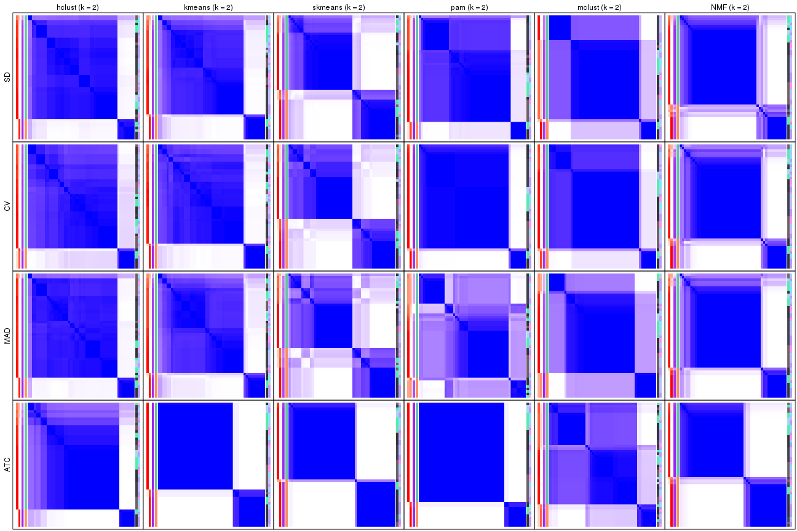</p>

</div>
<div id='tab-collect-consensus-heatmap-2'>
<pre><code class="r">collect_plots(res_list, k = 3, fun = consensus_heatmap, mc.cores = 4)
</code></pre>

<p>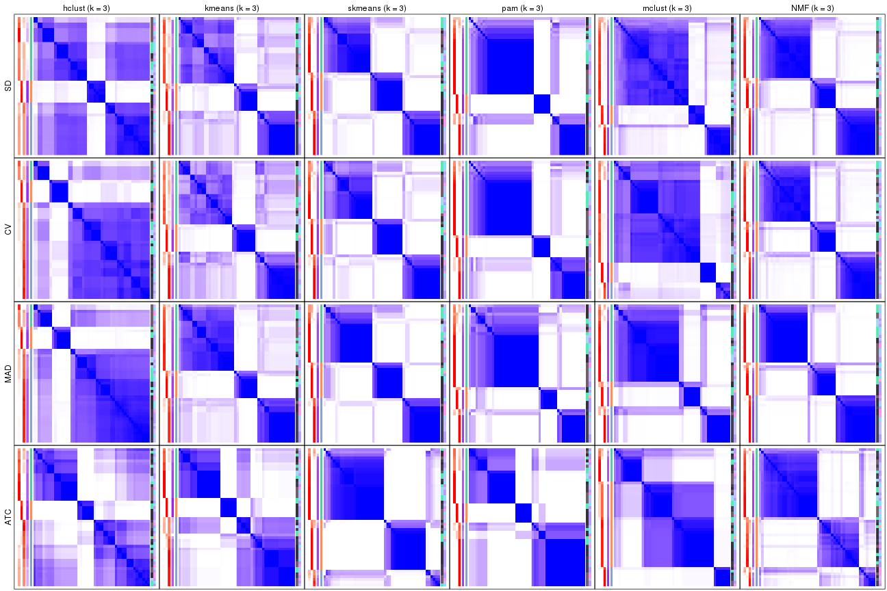</p>

</div>
<div id='tab-collect-consensus-heatmap-3'>
<pre><code class="r">collect_plots(res_list, k = 4, fun = consensus_heatmap, mc.cores = 4)
</code></pre>

<p>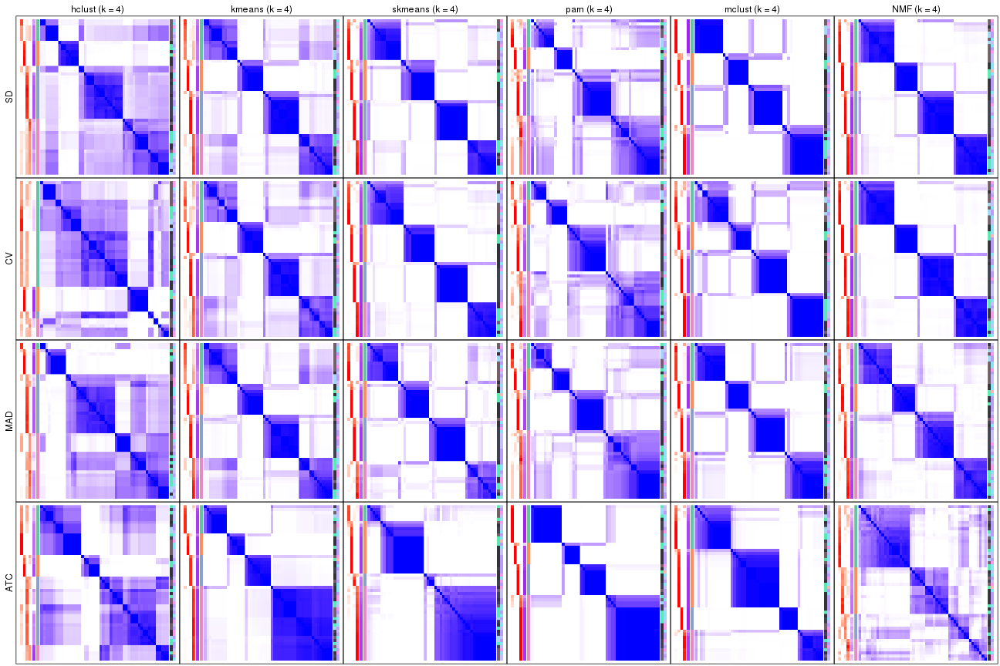</p>

</div>
<div id='tab-collect-consensus-heatmap-4'>
<pre><code class="r">collect_plots(res_list, k = 5, fun = consensus_heatmap, mc.cores = 4)
</code></pre>

<p>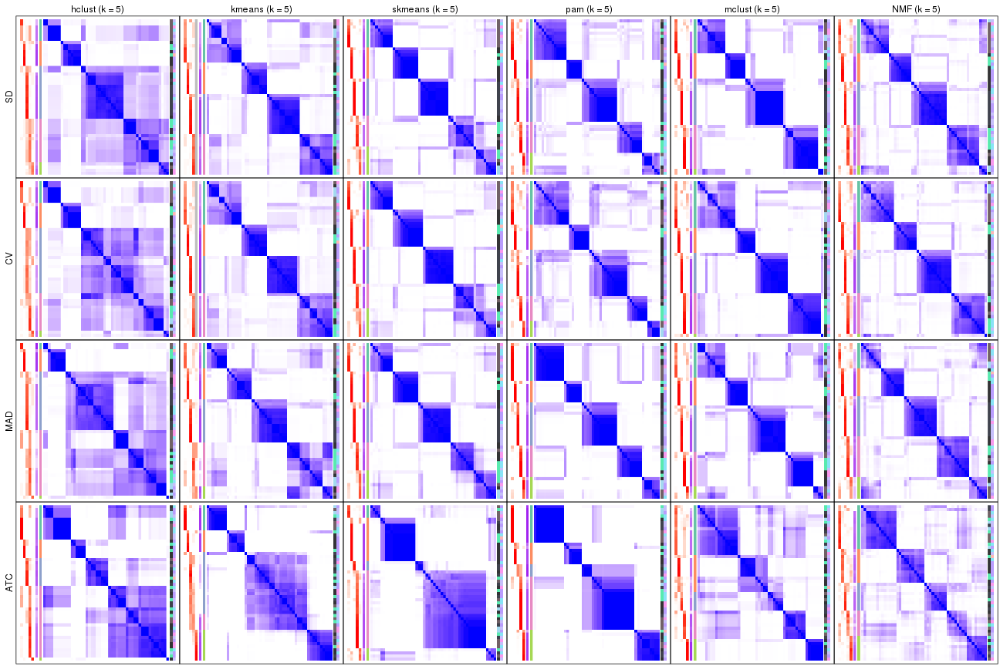</p>

</div>
<div id='tab-collect-consensus-heatmap-5'>
<pre><code class="r">collect_plots(res_list, k = 6, fun = consensus_heatmap, mc.cores = 4)
</code></pre>

<p>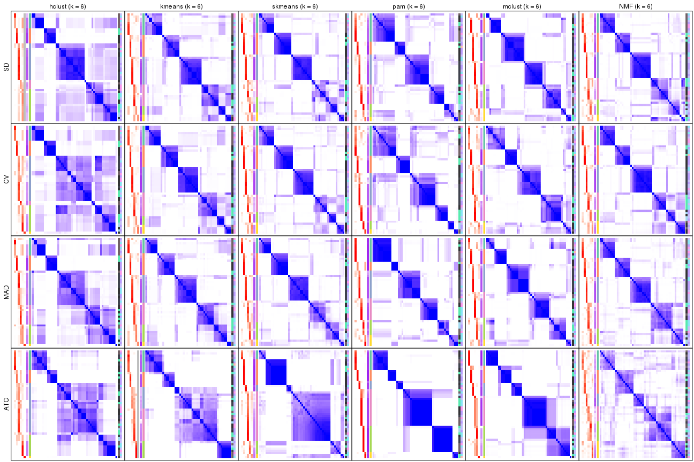</p>

</div>
</div>


### Membership heatmap

Membership heatmaps for all methods. ([What is a membership heatmap?](http://bioconductor.org/packages/devel/bioc/vignettes/cola/inst/doc/cola.html#toc_12))


<script>
$( function() {
	$( '#tabs-collect-membership-heatmap' ).tabs();
} );
</script>
<div id='tabs-collect-membership-heatmap'>
<ul>
<li><a href='#tab-collect-membership-heatmap-1'>k = 2</a></li>
<li><a href='#tab-collect-membership-heatmap-2'>k = 3</a></li>
<li><a href='#tab-collect-membership-heatmap-3'>k = 4</a></li>
<li><a href='#tab-collect-membership-heatmap-4'>k = 5</a></li>
<li><a href='#tab-collect-membership-heatmap-5'>k = 6</a></li>
</ul>
<div id='tab-collect-membership-heatmap-1'>
<pre><code class="r">collect_plots(res_list, k = 2, fun = membership_heatmap, mc.cores = 4)
</code></pre>

<p>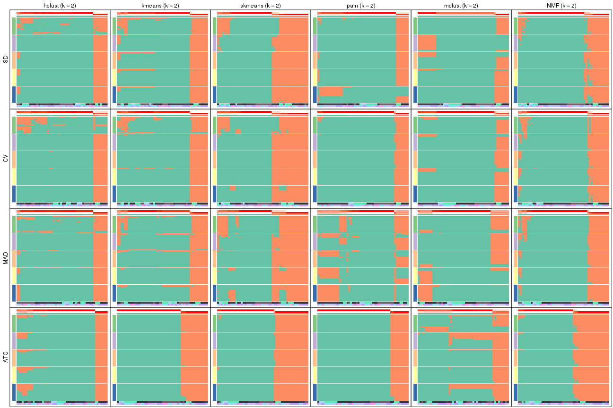</p>

</div>
<div id='tab-collect-membership-heatmap-2'>
<pre><code class="r">collect_plots(res_list, k = 3, fun = membership_heatmap, mc.cores = 4)
</code></pre>

<p>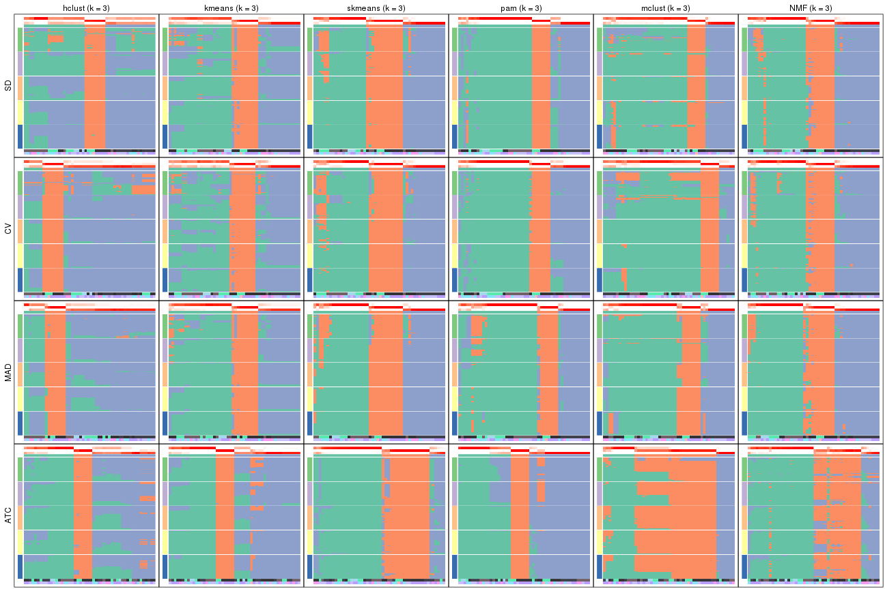</p>

</div>
<div id='tab-collect-membership-heatmap-3'>
<pre><code class="r">collect_plots(res_list, k = 4, fun = membership_heatmap, mc.cores = 4)
</code></pre>

<p>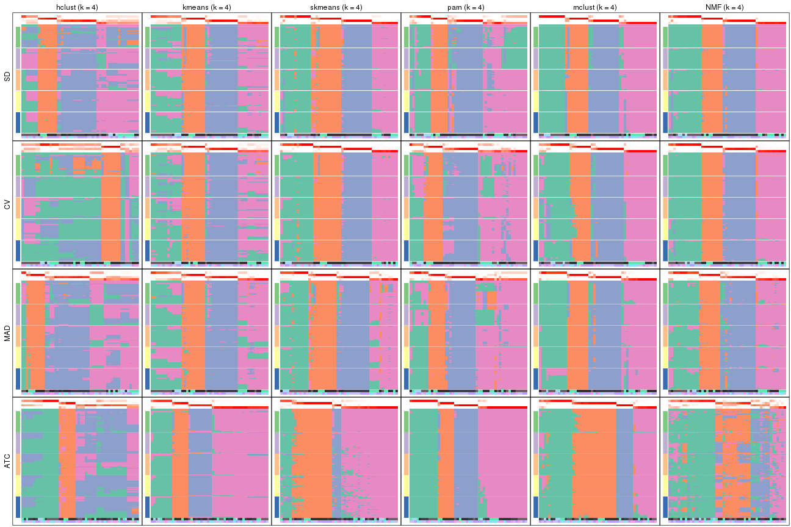</p>

</div>
<div id='tab-collect-membership-heatmap-4'>
<pre><code class="r">collect_plots(res_list, k = 5, fun = membership_heatmap, mc.cores = 4)
</code></pre>

<p>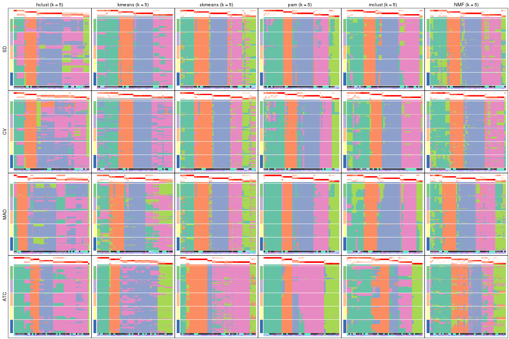</p>

</div>
<div id='tab-collect-membership-heatmap-5'>
<pre><code class="r">collect_plots(res_list, k = 6, fun = membership_heatmap, mc.cores = 4)
</code></pre>

<p>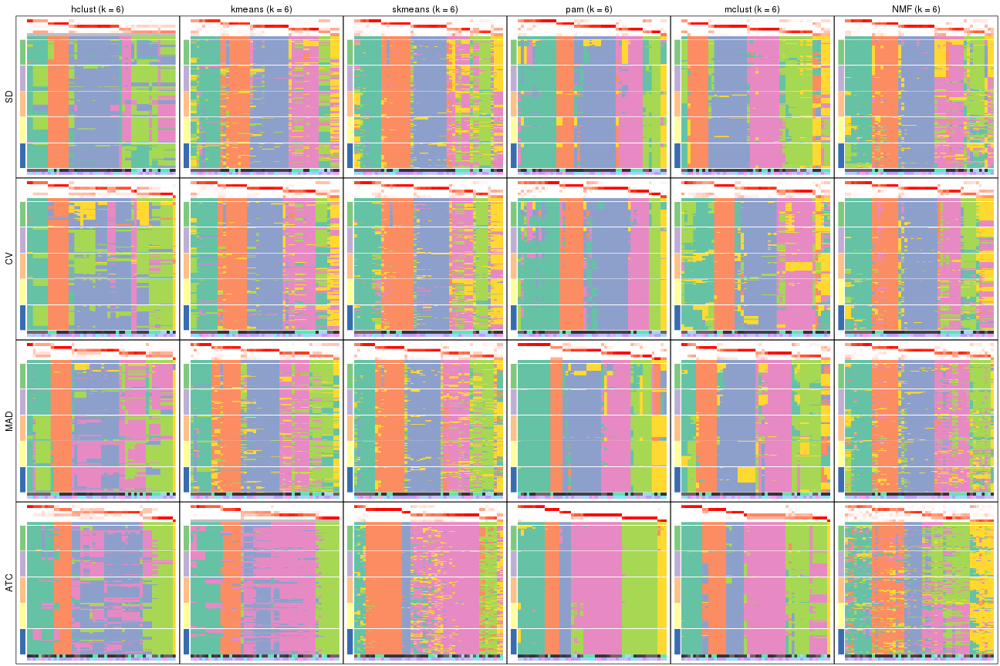</p>

</div>
</div>


### Signature heatmap

Signature heatmaps for all methods. ([What is a signature heatmap?](http://bioconductor.org/packages/devel/bioc/vignettes/cola/inst/doc/cola.html#toc_22))


Note in following heatmaps, rows are scaled.


<script>
$( function() {
	$( '#tabs-collect-get-signatures' ).tabs();
} );
</script>
<div id='tabs-collect-get-signatures'>
<ul>
<li><a href='#tab-collect-get-signatures-1'>k = 2</a></li>
<li><a href='#tab-collect-get-signatures-2'>k = 3</a></li>
<li><a href='#tab-collect-get-signatures-3'>k = 4</a></li>
<li><a href='#tab-collect-get-signatures-4'>k = 5</a></li>
<li><a href='#tab-collect-get-signatures-5'>k = 6</a></li>
</ul>
<div id='tab-collect-get-signatures-1'>
<pre><code class="r">collect_plots(res_list, k = 2, fun = get_signatures, mc.cores = 4)
</code></pre>

<p>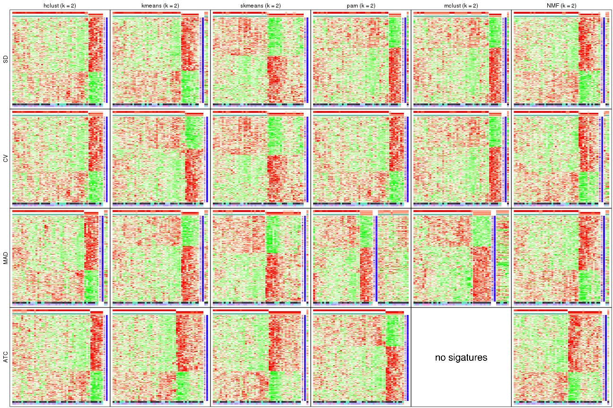</p>

</div>
<div id='tab-collect-get-signatures-2'>
<pre><code class="r">collect_plots(res_list, k = 3, fun = get_signatures, mc.cores = 4)
</code></pre>

<p>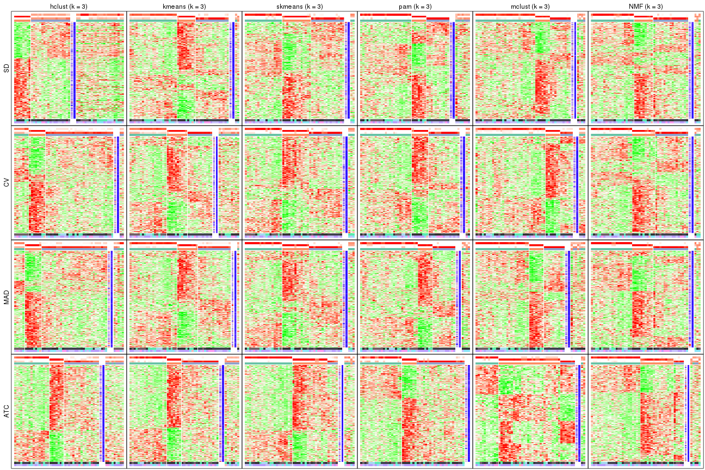</p>

</div>
<div id='tab-collect-get-signatures-3'>
<pre><code class="r">collect_plots(res_list, k = 4, fun = get_signatures, mc.cores = 4)
</code></pre>

<p>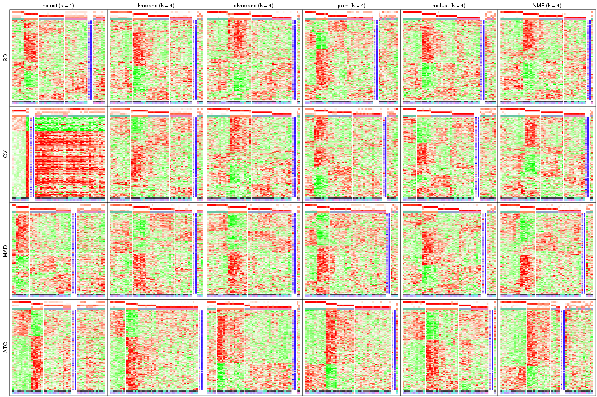</p>

</div>
<div id='tab-collect-get-signatures-4'>
<pre><code class="r">collect_plots(res_list, k = 5, fun = get_signatures, mc.cores = 4)
</code></pre>

<p>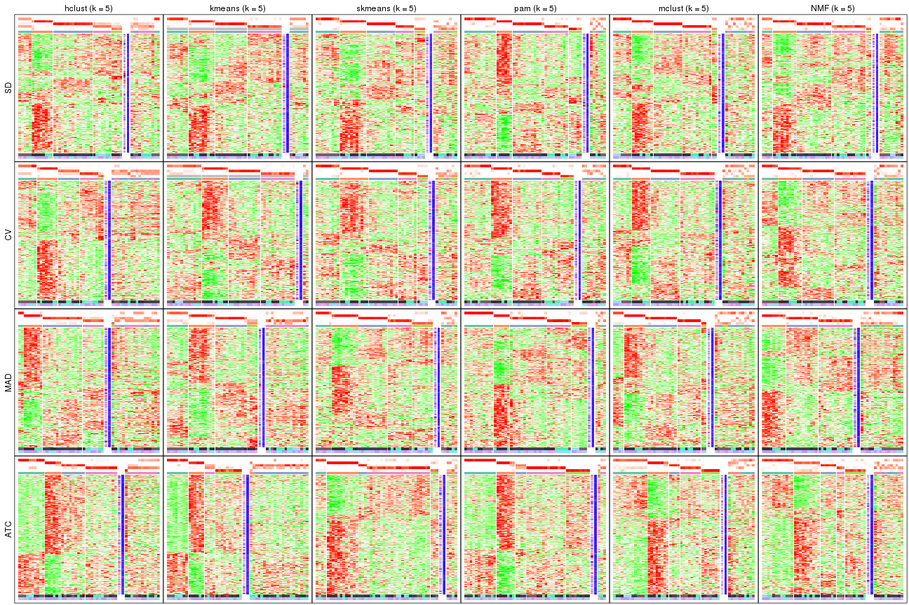</p>

</div>
<div id='tab-collect-get-signatures-5'>
<pre><code class="r">collect_plots(res_list, k = 6, fun = get_signatures, mc.cores = 4)
</code></pre>

<p>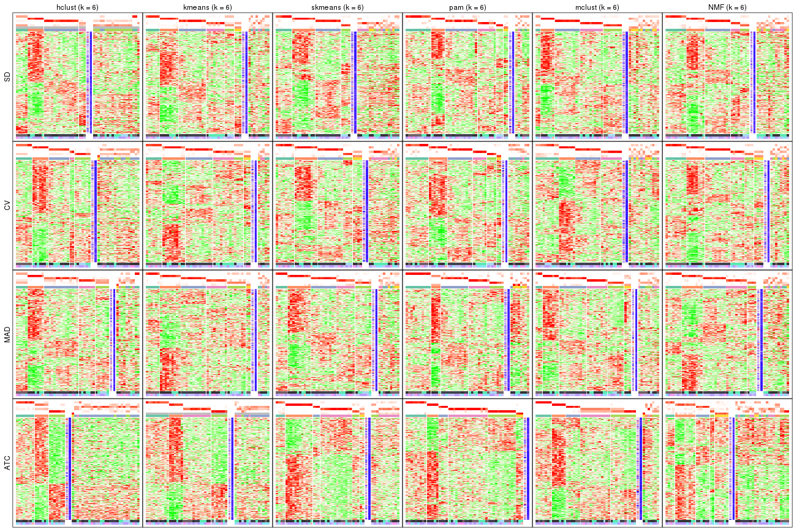</p>

</div>
</div>


### Statistics table

The statistics used for measuring the stability of consensus partitioning.
([How are they
defined?](http://bioconductor.org/packages/devel/bioc/vignettes/cola/inst/doc/cola.html#toc_13))


<script>
$( function() {
	$( '#tabs-get-stats-from-consensus-partition-list' ).tabs();
} );
</script>
<div id='tabs-get-stats-from-consensus-partition-list'>
<ul>
<li><a href='#tab-get-stats-from-consensus-partition-list-1'>k = 2</a></li>
<li><a href='#tab-get-stats-from-consensus-partition-list-2'>k = 3</a></li>
<li><a href='#tab-get-stats-from-consensus-partition-list-3'>k = 4</a></li>
<li><a href='#tab-get-stats-from-consensus-partition-list-4'>k = 5</a></li>
<li><a href='#tab-get-stats-from-consensus-partition-list-5'>k = 6</a></li>
</ul>
<div id='tab-get-stats-from-consensus-partition-list-1'>
<pre><code class="r">get_stats(res_list, k = 2)
</code></pre>

<pre><code>#&gt;             k 1-PAC mean_silhouette concordance area_increased  Rand Jaccard
#&gt; SD:NMF      2 0.761           0.892       0.952          0.396 0.589   0.589
#&gt; CV:NMF      2 0.802           0.880       0.952          0.388 0.628   0.628
#&gt; MAD:NMF     2 0.874           0.893       0.956          0.397 0.628   0.628
#&gt; ATC:NMF     2 0.999           0.960       0.981          0.485 0.510   0.510
#&gt; SD:skmeans  2 0.710           0.888       0.944          0.494 0.510   0.510
#&gt; CV:skmeans  2 0.664           0.906       0.947          0.493 0.510   0.510
#&gt; MAD:skmeans 2 0.451           0.814       0.912          0.496 0.510   0.510
#&gt; ATC:skmeans 2 1.000           0.970       0.989          0.478 0.519   0.519
#&gt; SD:mclust   2 0.537           0.848       0.897          0.280 0.726   0.726
#&gt; CV:mclust   2 0.630           0.936       0.953          0.269 0.726   0.726
#&gt; MAD:mclust  2 0.516           0.811       0.846          0.302 0.673   0.673
#&gt; ATC:mclust  2 0.481           0.855       0.879          0.340 0.699   0.699
#&gt; SD:kmeans   2 0.841           0.902       0.937          0.363 0.673   0.673
#&gt; CV:kmeans   2 0.848           0.946       0.958          0.350 0.673   0.673
#&gt; MAD:kmeans  2 0.746           0.894       0.927          0.364 0.673   0.673
#&gt; ATC:kmeans  2 1.000           0.992       0.995          0.425 0.571   0.571
#&gt; SD:pam      2 0.512           0.926       0.940          0.279 0.754   0.754
#&gt; CV:pam      2 1.000           0.977       0.989          0.272 0.726   0.726
#&gt; MAD:pam     2 0.409           0.562       0.789          0.363 0.726   0.726
#&gt; ATC:pam     2 1.000           0.996       0.998          0.324 0.673   0.673
#&gt; SD:hclust   2 0.953           0.939       0.961          0.307 0.726   0.726
#&gt; CV:hclust   2 0.602           0.931       0.929          0.291 0.726   0.726
#&gt; MAD:hclust  2 1.000           0.942       0.959          0.308 0.726   0.726
#&gt; ATC:hclust  2 0.767           0.895       0.945          0.305 0.754   0.754
</code></pre>

</div>
<div id='tab-get-stats-from-consensus-partition-list-2'>
<pre><code class="r">get_stats(res_list, k = 3)
</code></pre>

<pre><code>#&gt;             k 1-PAC mean_silhouette concordance area_increased  Rand Jaccard
#&gt; SD:NMF      3 0.759           0.845       0.933          0.655 0.664   0.471
#&gt; CV:NMF      3 0.784           0.857       0.932          0.689 0.691   0.517
#&gt; MAD:NMF     3 0.870           0.889       0.953          0.666 0.664   0.484
#&gt; ATC:NMF     3 0.697           0.774       0.890          0.275 0.829   0.680
#&gt; SD:skmeans  3 0.796           0.873       0.938          0.367 0.670   0.435
#&gt; CV:skmeans  3 0.673           0.827       0.917          0.366 0.648   0.411
#&gt; MAD:skmeans 3 0.799           0.871       0.942          0.360 0.648   0.411
#&gt; ATC:skmeans 3 0.822           0.802       0.920          0.279 0.875   0.761
#&gt; SD:mclust   3 0.739           0.842       0.907          1.016 0.691   0.588
#&gt; CV:mclust   3 0.512           0.837       0.885          0.796 0.789   0.720
#&gt; MAD:mclust  3 0.751           0.793       0.917          0.940 0.679   0.540
#&gt; ATC:mclust  3 0.654           0.805       0.898          0.619 0.708   0.595
#&gt; SD:kmeans   3 0.401           0.784       0.857          0.724 0.687   0.535
#&gt; CV:kmeans   3 0.433           0.666       0.820          0.772 0.681   0.526
#&gt; MAD:kmeans  3 0.648           0.866       0.907          0.723 0.687   0.535
#&gt; ATC:kmeans  3 0.642           0.769       0.898          0.451 0.593   0.404
#&gt; SD:pam      3 0.771           0.785       0.921          1.132 0.657   0.545
#&gt; CV:pam      3 0.730           0.857       0.938          1.221 0.669   0.544
#&gt; MAD:pam     3 0.705           0.810       0.919          0.646 0.706   0.595
#&gt; ATC:pam     3 0.651           0.831       0.920          0.893 0.607   0.456
#&gt; SD:hclust   3 0.415           0.509       0.696          0.551 0.643   0.508
#&gt; CV:hclust   3 0.393           0.808       0.845          0.640 0.800   0.724
#&gt; MAD:hclust  3 0.571           0.751       0.870          0.584 0.778   0.694
#&gt; ATC:hclust  3 0.436           0.657       0.832          0.886 0.628   0.506
</code></pre>

</div>
<div id='tab-get-stats-from-consensus-partition-list-3'>
<pre><code class="r">get_stats(res_list, k = 4)
</code></pre>

<pre><code>#&gt;             k 1-PAC mean_silhouette concordance area_increased  Rand Jaccard
#&gt; SD:NMF      4 0.916         0.90675       0.957         0.1556 0.811   0.512
#&gt; CV:NMF      4 0.958         0.90894       0.960         0.1593 0.811   0.512
#&gt; MAD:NMF     4 0.788         0.85132       0.916         0.1440 0.821   0.528
#&gt; ATC:NMF     4 0.530         0.56112       0.757         0.1701 0.843   0.620
#&gt; SD:skmeans  4 0.870         0.86462       0.939         0.1305 0.842   0.561
#&gt; CV:skmeans  4 0.926         0.90113       0.952         0.1333 0.833   0.548
#&gt; MAD:skmeans 4 0.749         0.81041       0.908         0.1290 0.856   0.595
#&gt; ATC:skmeans 4 0.774         0.84352       0.921         0.0991 0.932   0.835
#&gt; SD:mclust   4 0.909         0.85200       0.944         0.3374 0.706   0.415
#&gt; CV:mclust   4 0.828         0.77450       0.909         0.5541 0.567   0.306
#&gt; MAD:mclust  4 0.866         0.82815       0.924         0.2804 0.820   0.564
#&gt; ATC:mclust  4 0.870         0.89851       0.952         0.3215 0.778   0.528
#&gt; SD:kmeans   4 0.684         0.79268       0.860         0.1638 0.842   0.583
#&gt; CV:kmeans   4 0.572         0.74036       0.821         0.1691 0.835   0.565
#&gt; MAD:kmeans  4 0.685         0.76466       0.838         0.1700 0.842   0.583
#&gt; ATC:kmeans  4 0.957         0.91868       0.946         0.1068 0.701   0.399
#&gt; SD:pam      4 0.635         0.60729       0.804         0.2052 0.762   0.484
#&gt; CV:pam      4 0.588         0.67993       0.826         0.1851 0.897   0.740
#&gt; MAD:pam     4 0.639         0.73508       0.849         0.2012 0.841   0.640
#&gt; ATC:pam     4 0.945         0.92556       0.969         0.1777 0.731   0.419
#&gt; SD:hclust   4 0.428         0.66637       0.750         0.3751 0.767   0.468
#&gt; CV:hclust   4 0.400         0.00373       0.635         0.3396 0.718   0.567
#&gt; MAD:hclust  4 0.519         0.59243       0.763         0.3495 0.684   0.453
#&gt; ATC:hclust  4 0.436         0.52652       0.748         0.1119 0.837   0.619
</code></pre>

</div>
<div id='tab-get-stats-from-consensus-partition-list-4'>
<pre><code class="r">get_stats(res_list, k = 5)
</code></pre>

<pre><code>#&gt;             k 1-PAC mean_silhouette concordance area_increased  Rand Jaccard
#&gt; SD:NMF      5 0.760           0.670       0.827         0.0533 0.973   0.889
#&gt; CV:NMF      5 0.755           0.631       0.832         0.0493 0.989   0.956
#&gt; MAD:NMF     5 0.724           0.655       0.824         0.0573 0.933   0.735
#&gt; ATC:NMF     5 0.628           0.640       0.784         0.0954 0.807   0.423
#&gt; SD:skmeans  5 0.805           0.734       0.866         0.0570 0.873   0.539
#&gt; CV:skmeans  5 0.819           0.757       0.874         0.0564 0.915   0.668
#&gt; MAD:skmeans 5 0.810           0.771       0.878         0.0608 0.882   0.566
#&gt; ATC:skmeans 5 0.713           0.774       0.880         0.0675 0.938   0.833
#&gt; SD:mclust   5 0.806           0.713       0.878         0.0352 0.913   0.690
#&gt; CV:mclust   5 0.821           0.710       0.868         0.0420 0.950   0.811
#&gt; MAD:mclust  5 0.781           0.656       0.858         0.0506 0.904   0.652
#&gt; ATC:mclust  5 0.649           0.663       0.804         0.0470 0.896   0.641
#&gt; SD:kmeans   5 0.758           0.722       0.824         0.0701 0.979   0.915
#&gt; CV:kmeans   5 0.726           0.743       0.811         0.0747 0.958   0.840
#&gt; MAD:kmeans  5 0.718           0.520       0.725         0.0722 0.901   0.641
#&gt; ATC:kmeans  5 0.715           0.522       0.767         0.1207 0.900   0.693
#&gt; SD:pam      5 0.727           0.760       0.887         0.0967 0.867   0.563
#&gt; CV:pam      5 0.712           0.691       0.860         0.0947 0.851   0.546
#&gt; MAD:pam     5 0.834           0.836       0.928         0.1048 0.871   0.584
#&gt; ATC:pam     5 0.879           0.877       0.919         0.0535 0.944   0.801
#&gt; SD:hclust   5 0.502           0.656       0.717         0.0711 0.954   0.834
#&gt; CV:hclust   5 0.496           0.541       0.711         0.1123 0.614   0.326
#&gt; MAD:hclust  5 0.461           0.551       0.737         0.0555 0.994   0.983
#&gt; ATC:hclust  5 0.604           0.637       0.849         0.1033 0.802   0.506
</code></pre>

</div>
<div id='tab-get-stats-from-consensus-partition-list-5'>
<pre><code class="r">get_stats(res_list, k = 6)
</code></pre>

<pre><code>#&gt;             k 1-PAC mean_silhouette concordance area_increased  Rand Jaccard
#&gt; SD:NMF      6 0.760           0.597       0.775         0.0350 0.923   0.667
#&gt; CV:NMF      6 0.789           0.707       0.806         0.0360 0.915   0.647
#&gt; MAD:NMF     6 0.729           0.652       0.809         0.0344 0.927   0.676
#&gt; ATC:NMF     6 0.619           0.500       0.669         0.0440 0.914   0.607
#&gt; SD:skmeans  6 0.803           0.597       0.782         0.0329 0.962   0.807
#&gt; CV:skmeans  6 0.812           0.688       0.814         0.0334 0.940   0.714
#&gt; MAD:skmeans 6 0.801           0.686       0.827         0.0327 0.963   0.814
#&gt; ATC:skmeans 6 0.725           0.646       0.834         0.0557 0.936   0.812
#&gt; SD:mclust   6 0.796           0.636       0.825         0.0354 0.937   0.735
#&gt; CV:mclust   6 0.758           0.536       0.767         0.0492 0.930   0.722
#&gt; MAD:mclust  6 0.784           0.645       0.817         0.0383 0.944   0.752
#&gt; ATC:mclust  6 0.810           0.736       0.894         0.0372 0.886   0.565
#&gt; SD:kmeans   6 0.751           0.675       0.789         0.0429 0.943   0.760
#&gt; CV:kmeans   6 0.772           0.716       0.799         0.0473 0.931   0.713
#&gt; MAD:kmeans  6 0.766           0.699       0.807         0.0441 0.916   0.646
#&gt; ATC:kmeans  6 0.721           0.627       0.759         0.0563 0.878   0.564
#&gt; SD:pam      6 0.705           0.706       0.863         0.0251 0.987   0.936
#&gt; CV:pam      6 0.758           0.694       0.866         0.0174 0.990   0.954
#&gt; MAD:pam     6 0.784           0.791       0.885         0.0292 0.965   0.829
#&gt; ATC:pam     6 0.950           0.927       0.967         0.0385 0.983   0.924
#&gt; SD:hclust   6 0.587           0.578       0.722         0.0617 0.978   0.910
#&gt; CV:hclust   6 0.523           0.495       0.735         0.0429 0.862   0.585
#&gt; MAD:hclust  6 0.647           0.564       0.677         0.1105 0.817   0.484
#&gt; ATC:hclust  6 0.635           0.437       0.742         0.0915 0.956   0.858
</code></pre>

</div>
</div>

Following heatmap plots the partition for each combination of methods and the
lightness correspond to the silhouette scores for samples in each method. On
top the consensus subgroup is inferred from all methods by taking the mean
silhouette scores as weight.


<script>
$( function() {
	$( '#tabs-collect-stats-from-consensus-partition-list' ).tabs();
} );
</script>
<div id='tabs-collect-stats-from-consensus-partition-list'>
<ul>
<li><a href='#tab-collect-stats-from-consensus-partition-list-1'>k = 2</a></li>
<li><a href='#tab-collect-stats-from-consensus-partition-list-2'>k = 3</a></li>
<li><a href='#tab-collect-stats-from-consensus-partition-list-3'>k = 4</a></li>
<li><a href='#tab-collect-stats-from-consensus-partition-list-4'>k = 5</a></li>
<li><a href='#tab-collect-stats-from-consensus-partition-list-5'>k = 6</a></li>
</ul>
<div id='tab-collect-stats-from-consensus-partition-list-1'>
<pre><code class="r">collect_stats(res_list, k = 2)
</code></pre>

<p>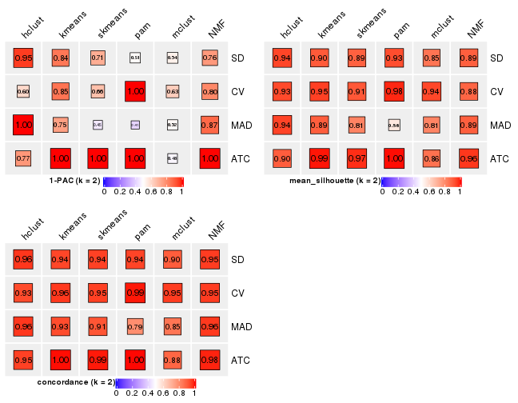</p>

</div>
<div id='tab-collect-stats-from-consensus-partition-list-2'>
<pre><code class="r">collect_stats(res_list, k = 3)
</code></pre>

<p>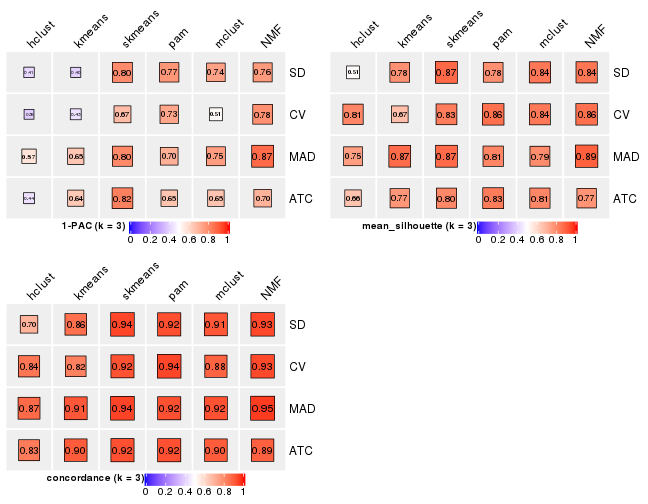</p>

</div>
<div id='tab-collect-stats-from-consensus-partition-list-3'>
<pre><code class="r">collect_stats(res_list, k = 4)
</code></pre>

<p>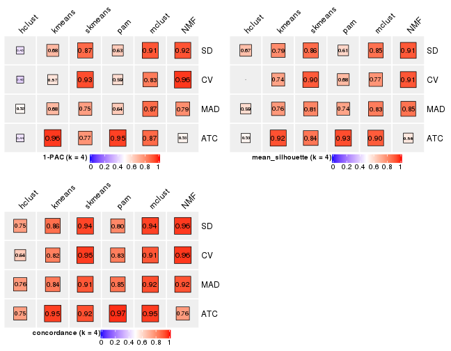</p>

</div>
<div id='tab-collect-stats-from-consensus-partition-list-4'>
<pre><code class="r">collect_stats(res_list, k = 5)
</code></pre>

<p>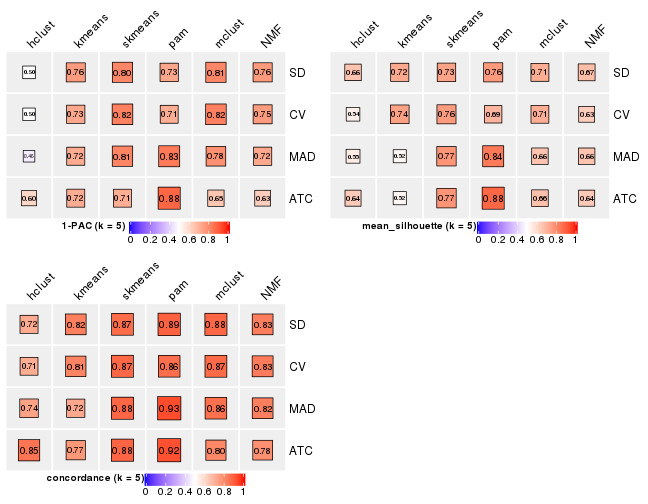</p>

</div>
<div id='tab-collect-stats-from-consensus-partition-list-5'>
<pre><code class="r">collect_stats(res_list, k = 6)
</code></pre>

<p>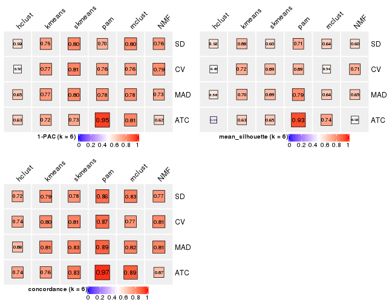</p>

</div>
</div>

### Partition from all methods


Collect partitions from all methods:


<script>
$( function() {
	$( '#tabs-collect-classes-from-consensus-partition-list' ).tabs();
} );
</script>
<div id='tabs-collect-classes-from-consensus-partition-list'>
<ul>
<li><a href='#tab-collect-classes-from-consensus-partition-list-1'>k = 2</a></li>
<li><a href='#tab-collect-classes-from-consensus-partition-list-2'>k = 3</a></li>
<li><a href='#tab-collect-classes-from-consensus-partition-list-3'>k = 4</a></li>
<li><a href='#tab-collect-classes-from-consensus-partition-list-4'>k = 5</a></li>
<li><a href='#tab-collect-classes-from-consensus-partition-list-5'>k = 6</a></li>
</ul>
<div id='tab-collect-classes-from-consensus-partition-list-1'>
<pre><code class="r">collect_classes(res_list, k = 2)
</code></pre>

<p>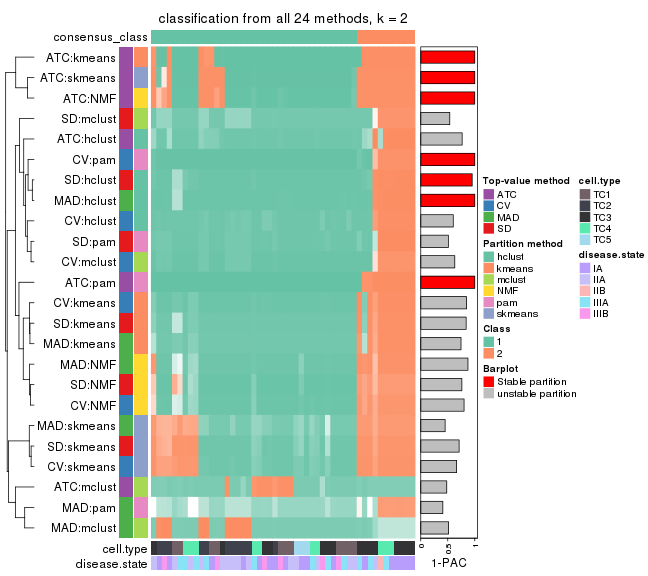</p>

</div>
<div id='tab-collect-classes-from-consensus-partition-list-2'>
<pre><code class="r">collect_classes(res_list, k = 3)
</code></pre>

<p>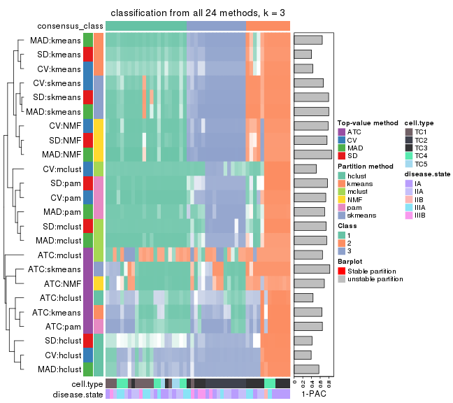</p>

</div>
<div id='tab-collect-classes-from-consensus-partition-list-3'>
<pre><code class="r">collect_classes(res_list, k = 4)
</code></pre>

<p>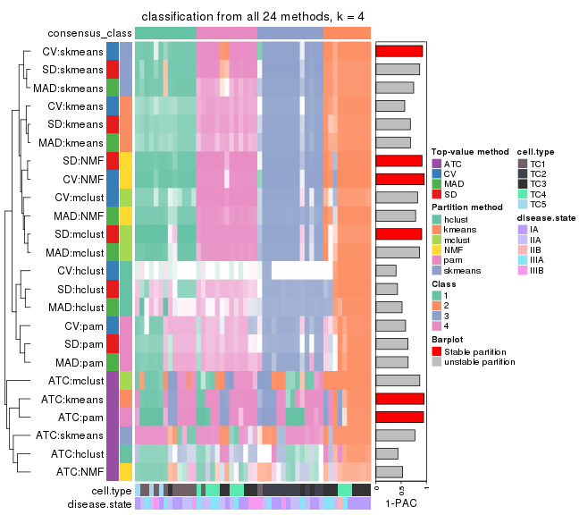</p>

</div>
<div id='tab-collect-classes-from-consensus-partition-list-4'>
<pre><code class="r">collect_classes(res_list, k = 5)
</code></pre>

<p>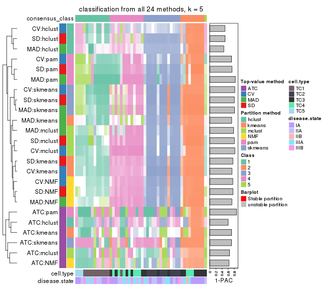</p>

</div>
<div id='tab-collect-classes-from-consensus-partition-list-5'>
<pre><code class="r">collect_classes(res_list, k = 6)
</code></pre>

<p>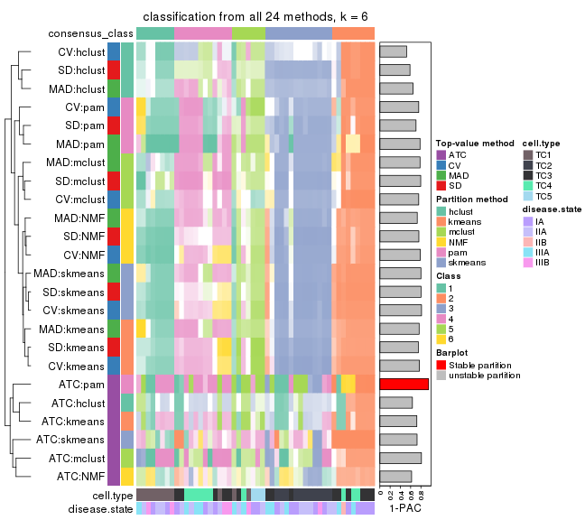</p>

</div>
</div>


### Top rows overlap


Overlap of top rows from different top-row methods:


<script>
$( function() {
	$( '#tabs-top-rows-overlap-by-euler' ).tabs();
} );
</script>
<div id='tabs-top-rows-overlap-by-euler'>
<ul>
<li><a href='#tab-top-rows-overlap-by-euler-1'>top_n = 1000</a></li>
<li><a href='#tab-top-rows-overlap-by-euler-2'>top_n = 2000</a></li>
<li><a href='#tab-top-rows-overlap-by-euler-3'>top_n = 3000</a></li>
<li><a href='#tab-top-rows-overlap-by-euler-4'>top_n = 4000</a></li>
<li><a href='#tab-top-rows-overlap-by-euler-5'>top_n = 5000</a></li>
</ul>
<div id='tab-top-rows-overlap-by-euler-1'>
<pre><code class="r">top_rows_overlap(res_list, top_n = 1000, method = &quot;euler&quot;)
</code></pre>

<p>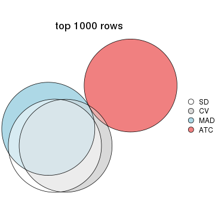</p>

</div>
<div id='tab-top-rows-overlap-by-euler-2'>
<pre><code class="r">top_rows_overlap(res_list, top_n = 2000, method = &quot;euler&quot;)
</code></pre>

<p>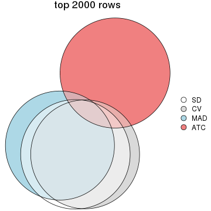</p>

</div>
<div id='tab-top-rows-overlap-by-euler-3'>
<pre><code class="r">top_rows_overlap(res_list, top_n = 3000, method = &quot;euler&quot;)
</code></pre>

<p>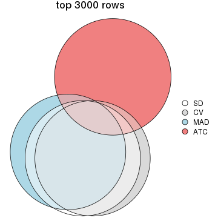</p>

</div>
<div id='tab-top-rows-overlap-by-euler-4'>
<pre><code class="r">top_rows_overlap(res_list, top_n = 4000, method = &quot;euler&quot;)
</code></pre>

<p>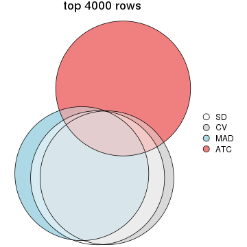</p>

</div>
<div id='tab-top-rows-overlap-by-euler-5'>
<pre><code class="r">top_rows_overlap(res_list, top_n = 5000, method = &quot;euler&quot;)
</code></pre>

<p>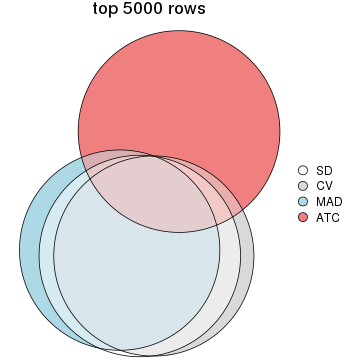</p>

</div>
</div>

Also visualize the correspondance of rankings between different top-row methods:


<script>
$( function() {
	$( '#tabs-top-rows-overlap-by-correspondance' ).tabs();
} );
</script>
<div id='tabs-top-rows-overlap-by-correspondance'>
<ul>
<li><a href='#tab-top-rows-overlap-by-correspondance-1'>top_n = 1000</a></li>
<li><a href='#tab-top-rows-overlap-by-correspondance-2'>top_n = 2000</a></li>
<li><a href='#tab-top-rows-overlap-by-correspondance-3'>top_n = 3000</a></li>
<li><a href='#tab-top-rows-overlap-by-correspondance-4'>top_n = 4000</a></li>
<li><a href='#tab-top-rows-overlap-by-correspondance-5'>top_n = 5000</a></li>
</ul>
<div id='tab-top-rows-overlap-by-correspondance-1'>
<pre><code class="r">top_rows_overlap(res_list, top_n = 1000, method = &quot;correspondance&quot;)
</code></pre>

<p>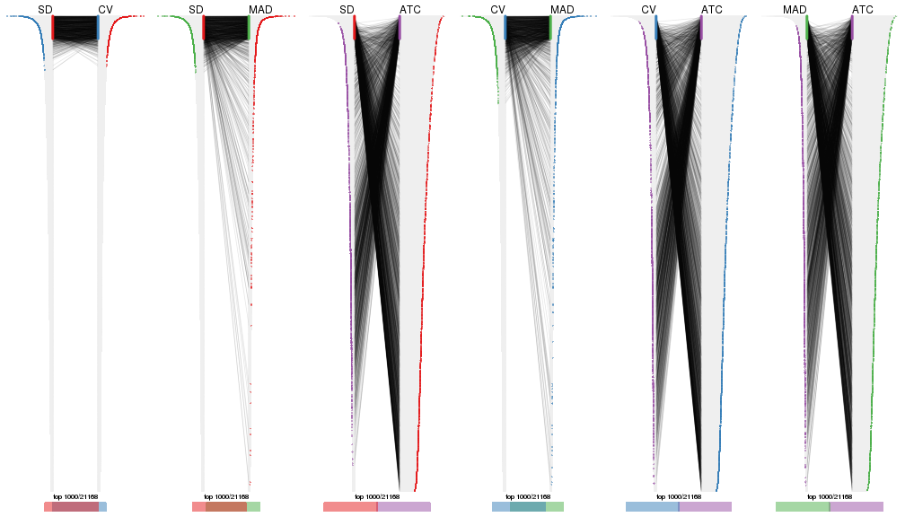</p>

</div>
<div id='tab-top-rows-overlap-by-correspondance-2'>
<pre><code class="r">top_rows_overlap(res_list, top_n = 2000, method = &quot;correspondance&quot;)
</code></pre>

<p>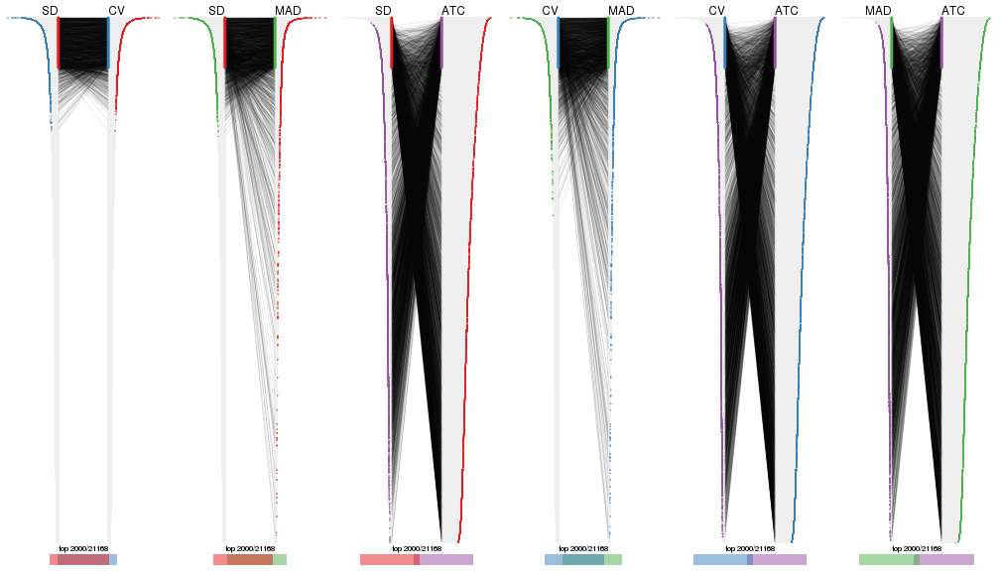</p>

</div>
<div id='tab-top-rows-overlap-by-correspondance-3'>
<pre><code class="r">top_rows_overlap(res_list, top_n = 3000, method = &quot;correspondance&quot;)
</code></pre>

<p>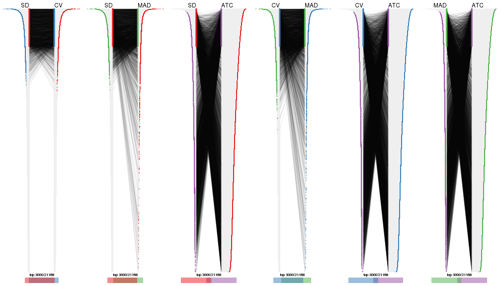</p>

</div>
<div id='tab-top-rows-overlap-by-correspondance-4'>
<pre><code class="r">top_rows_overlap(res_list, top_n = 4000, method = &quot;correspondance&quot;)
</code></pre>

<p>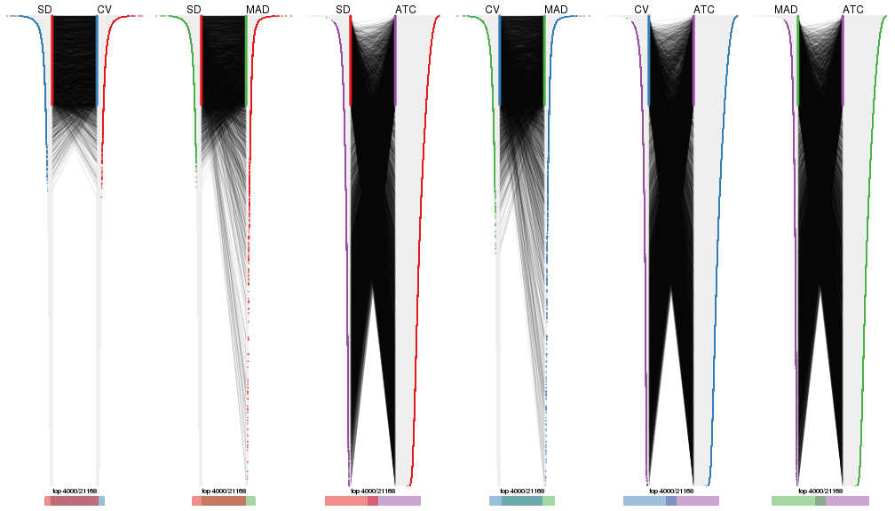</p>

</div>
<div id='tab-top-rows-overlap-by-correspondance-5'>
<pre><code class="r">top_rows_overlap(res_list, top_n = 5000, method = &quot;correspondance&quot;)
</code></pre>

<p>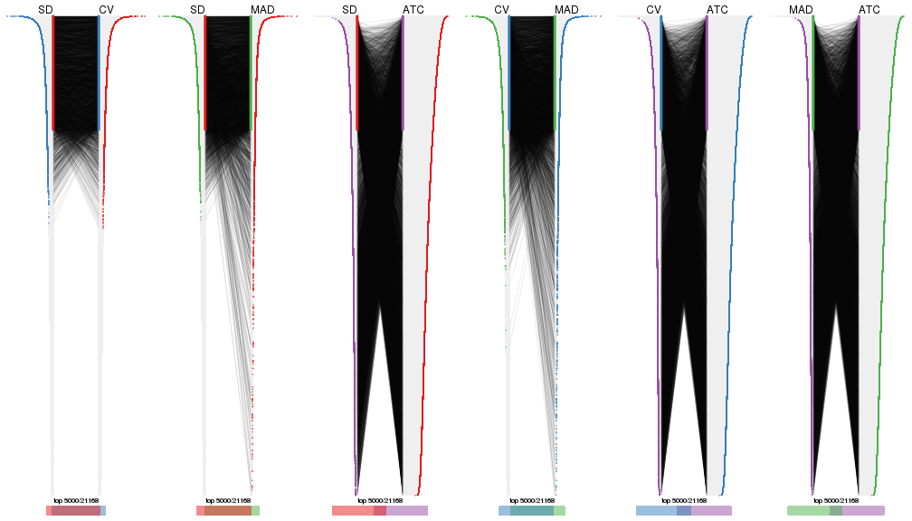</p>

</div>
</div>


Heatmaps of the top rows:


<script>
$( function() {
	$( '#tabs-top-rows-heatmap' ).tabs();
} );
</script>
<div id='tabs-top-rows-heatmap'>
<ul>
<li><a href='#tab-top-rows-heatmap-1'>top_n = 1000</a></li>
<li><a href='#tab-top-rows-heatmap-2'>top_n = 2000</a></li>
<li><a href='#tab-top-rows-heatmap-3'>top_n = 3000</a></li>
<li><a href='#tab-top-rows-heatmap-4'>top_n = 4000</a></li>
<li><a href='#tab-top-rows-heatmap-5'>top_n = 5000</a></li>
</ul>
<div id='tab-top-rows-heatmap-1'>
<pre><code class="r">top_rows_heatmap(res_list, top_n = 1000)
</code></pre>

<p>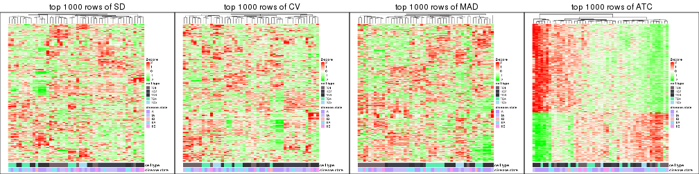</p>

</div>
<div id='tab-top-rows-heatmap-2'>
<pre><code class="r">top_rows_heatmap(res_list, top_n = 2000)
</code></pre>

<p>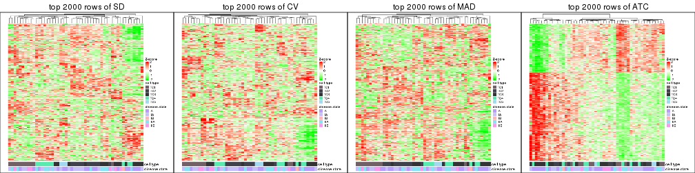</p>

</div>
<div id='tab-top-rows-heatmap-3'>
<pre><code class="r">top_rows_heatmap(res_list, top_n = 3000)
</code></pre>

<p>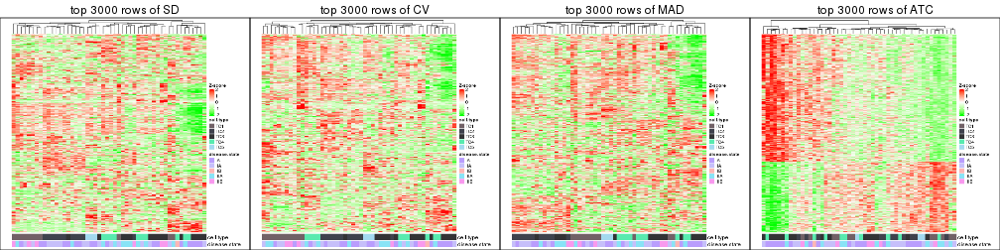</p>

</div>
<div id='tab-top-rows-heatmap-4'>
<pre><code class="r">top_rows_heatmap(res_list, top_n = 4000)
</code></pre>

<p>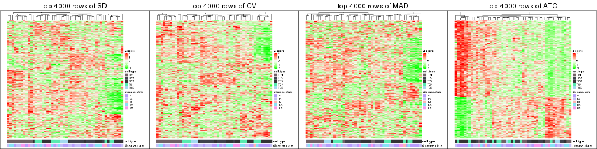</p>

</div>
<div id='tab-top-rows-heatmap-5'>
<pre><code class="r">top_rows_heatmap(res_list, top_n = 5000)
</code></pre>

<p>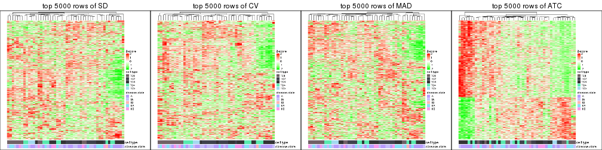</p>

</div>
</div>


### Test to known annotations


Test correlation between subgroups and known annotations. If the known
annotation is numeric, one-way ANOVA test is applied, and if the known
annotation is discrete, chi-squared contingency table test is applied.


<script>
$( function() {
	$( '#tabs-test-to-known-factors-from-consensus-partition-list' ).tabs();
} );
</script>
<div id='tabs-test-to-known-factors-from-consensus-partition-list'>
<ul>
<li><a href='#tab-test-to-known-factors-from-consensus-partition-list-1'>k = 2</a></li>
<li><a href='#tab-test-to-known-factors-from-consensus-partition-list-2'>k = 3</a></li>
<li><a href='#tab-test-to-known-factors-from-consensus-partition-list-3'>k = 4</a></li>
<li><a href='#tab-test-to-known-factors-from-consensus-partition-list-4'>k = 5</a></li>
<li><a href='#tab-test-to-known-factors-from-consensus-partition-list-5'>k = 6</a></li>
</ul>
<div id='tab-test-to-known-factors-from-consensus-partition-list-1'>
<pre><code class="r">test_to_known_factors(res_list, k = 2)
</code></pre>

<pre><code>#&gt;              n cell.type(p) disease.state(p) k
#&gt; SD:NMF      48     8.27e-03           0.1385 2
#&gt; CV:NMF      47     2.81e-03           0.0755 2
#&gt; MAD:NMF     48     1.48e-03           0.1385 2
#&gt; ATC:NMF     49     5.84e-02           0.4846 2
#&gt; SD:skmeans  50     5.89e-02           0.2584 2
#&gt; CV:skmeans  50     5.89e-02           0.2584 2
#&gt; MAD:skmeans 49     4.12e-02           0.2037 2
#&gt; ATC:skmeans 49     4.89e-02           0.4396 2
#&gt; SD:mclust   49     7.44e-02           0.0126 2
#&gt; CV:mclust   49     7.44e-02           0.0126 2
#&gt; MAD:mclust  43     1.17e-07           0.5715 2
#&gt; ATC:mclust  50     8.18e-01           0.6735 2
#&gt; SD:kmeans   48     1.32e-02           0.0832 2
#&gt; CV:kmeans   50     8.91e-03           0.0758 2
#&gt; MAD:kmeans  48     3.48e-03           0.0812 2
#&gt; ATC:kmeans  50     1.12e-01           0.0911 2
#&gt; SD:pam      49     7.44e-02           0.0126 2
#&gt; CV:pam      50     4.83e-02           0.0399 2
#&gt; MAD:pam     33     8.77e-02           0.0477 2
#&gt; ATC:pam     50     8.91e-03           0.0463 2
#&gt; SD:hclust   50     4.83e-02           0.0399 2
#&gt; CV:hclust   50     4.83e-02           0.0399 2
#&gt; MAD:hclust  48     6.42e-02           0.0514 2
#&gt; ATC:hclust  50     6.05e-02           0.2502 2
</code></pre>

</div>
<div id='tab-test-to-known-factors-from-consensus-partition-list-2'>
<pre><code class="r">test_to_known_factors(res_list, k = 3)
</code></pre>

<pre><code>#&gt;              n cell.type(p) disease.state(p) k
#&gt; SD:NMF      47     4.26e-07           0.2073 3
#&gt; CV:NMF      47     4.66e-08           0.2720 3
#&gt; MAD:NMF     47     2.45e-07           0.1993 3
#&gt; ATC:NMF     45     1.02e-01           0.1772 3
#&gt; SD:skmeans  48     4.29e-07           0.4437 3
#&gt; CV:skmeans  47     1.58e-07           0.3053 3
#&gt; MAD:skmeans 47     2.28e-07           0.3573 3
#&gt; ATC:skmeans 45     7.33e-02           0.2476 3
#&gt; SD:mclust   46     1.49e-08           0.0713 3
#&gt; CV:mclust   47     4.10e-06           0.1117 3
#&gt; MAD:mclust  43     2.73e-08           0.1180 3
#&gt; ATC:mclust  48     9.84e-01           0.5692 3
#&gt; SD:kmeans   48     3.04e-07           0.1950 3
#&gt; CV:kmeans   40     1.06e-09           0.3903 3
#&gt; MAD:kmeans  49     1.18e-07           0.2023 3
#&gt; ATC:kmeans  43     1.30e-01           0.3787 3
#&gt; SD:pam      43     7.68e-09           0.1041 3
#&gt; CV:pam      48     4.07e-07           0.0860 3
#&gt; MAD:pam     46     7.41e-09           0.0926 3
#&gt; ATC:pam     50     6.35e-02           0.5306 3
#&gt; SD:hclust   27     4.61e-03           0.2012 3
#&gt; CV:hclust   48     1.06e-06           0.2211 3
#&gt; MAD:hclust  45     8.32e-07           0.2816 3
#&gt; ATC:hclust  41     1.03e-01           0.3181 3
</code></pre>

</div>
<div id='tab-test-to-known-factors-from-consensus-partition-list-3'>
<pre><code class="r">test_to_known_factors(res_list, k = 4)
</code></pre>

<pre><code>#&gt;              n cell.type(p) disease.state(p) k
#&gt; SD:NMF      49     1.69e-11            0.358 4
#&gt; CV:NMF      48     4.26e-12            0.188 4
#&gt; MAD:NMF     46     4.95e-12            0.422 4
#&gt; ATC:NMF     34     1.49e-01            0.461 4
#&gt; SD:skmeans  48     7.57e-13            0.422 4
#&gt; CV:skmeans  48     8.06e-14            0.523 4
#&gt; MAD:skmeans 48     1.22e-10            0.431 4
#&gt; ATC:skmeans 48     4.64e-02            0.629 4
#&gt; SD:mclust   44     8.38e-12            0.357 4
#&gt; CV:mclust   41     8.64e-11            0.252 4
#&gt; MAD:mclust  45     2.52e-12            0.555 4
#&gt; ATC:mclust  49     2.74e-01            0.739 4
#&gt; SD:kmeans   47     2.68e-12            0.521 4
#&gt; CV:kmeans   47     2.14e-12            0.551 4
#&gt; MAD:kmeans  47     4.45e-10            0.623 4
#&gt; ATC:kmeans  50     8.12e-02            0.590 4
#&gt; SD:pam      39     2.42e-10            0.456 4
#&gt; CV:pam      44     7.27e-10            0.322 4
#&gt; MAD:pam     46     1.20e-09            0.345 4
#&gt; ATC:pam     49     2.08e-01            0.267 4
#&gt; SD:hclust   43     4.12e-12            0.477 4
#&gt; CV:hclust   10     6.74e-03            0.290 4
#&gt; MAD:hclust  34     1.87e-07            0.675 4
#&gt; ATC:hclust  34     1.81e-01            0.202 4
</code></pre>

</div>
<div id='tab-test-to-known-factors-from-consensus-partition-list-4'>
<pre><code class="r">test_to_known_factors(res_list, k = 5)
</code></pre>

<pre><code>#&gt;              n cell.type(p) disease.state(p) k
#&gt; SD:NMF      41     9.33e-12           0.5752 5
#&gt; CV:NMF      39     1.77e-11           0.2833 5
#&gt; MAD:NMF     34     1.04e-05           0.2632 5
#&gt; ATC:NMF     39     3.46e-04           0.5703 5
#&gt; SD:skmeans  41     1.55e-15           0.5776 5
#&gt; CV:skmeans  42     3.82e-16           0.5359 5
#&gt; MAD:skmeans 44     1.07e-12           0.7368 5
#&gt; ATC:skmeans 46     5.66e-02           0.6157 5
#&gt; SD:mclust   39     2.84e-10           0.5853 5
#&gt; CV:mclust   38     1.89e-10           0.3313 5
#&gt; MAD:mclust  35     5.81e-09           0.5575 5
#&gt; ATC:mclust  40     1.87e-01           0.5004 5
#&gt; SD:kmeans   43     4.16e-13           0.6082 5
#&gt; CV:kmeans   48     8.06e-13           0.5236 5
#&gt; MAD:kmeans  34     9.03e-10           0.2008 5
#&gt; ATC:kmeans  28     2.71e-02           0.5094 5
#&gt; SD:pam      44     2.56e-10           0.0343 5
#&gt; CV:pam      41     6.87e-11           0.0356 5
#&gt; MAD:pam     46     2.71e-09           0.0241 5
#&gt; ATC:pam     47     9.87e-02           0.7361 5
#&gt; SD:hclust   39     9.18e-10           0.3753 5
#&gt; CV:hclust   32     4.83e-05           0.3039 5
#&gt; MAD:hclust  32     6.79e-09           0.5367 5
#&gt; ATC:hclust  37     1.49e-01           0.3246 5
</code></pre>

</div>
<div id='tab-test-to-known-factors-from-consensus-partition-list-5'>
<pre><code class="r">test_to_known_factors(res_list, k = 6)
</code></pre>

<pre><code>#&gt;              n cell.type(p) disease.state(p) k
#&gt; SD:NMF      36     3.68e-13           0.3272 6
#&gt; CV:NMF      42     7.28e-19           0.1125 6
#&gt; MAD:NMF     39     2.49e-14           0.3235 6
#&gt; ATC:NMF     27     1.11e-03           0.5108 6
#&gt; SD:skmeans  32     2.67e-13           0.4664 6
#&gt; CV:skmeans  37     9.50e-14           0.4112 6
#&gt; MAD:skmeans 41     1.20e-12           0.6003 6
#&gt; ATC:skmeans 38     8.36e-02           0.7935 6
#&gt; SD:mclust   37     3.05e-09           0.4393 6
#&gt; CV:mclust   37     5.65e-11           0.2909 6
#&gt; MAD:mclust  41     6.64e-09           0.5243 6
#&gt; ATC:mclust  43     4.82e-01           0.1557 6
#&gt; SD:kmeans   41     3.19e-15           0.0876 6
#&gt; CV:kmeans   45     5.00e-17           0.1402 6
#&gt; MAD:kmeans  45     8.15e-12           0.8928 6
#&gt; ATC:kmeans  35     1.20e-01           0.2536 6
#&gt; SD:pam      44     6.34e-13           0.0622 6
#&gt; CV:pam      41     3.48e-12           0.1492 6
#&gt; MAD:pam     42     2.67e-09           0.0297 6
#&gt; ATC:pam     50     8.41e-02           0.1533 6
#&gt; SD:hclust   30     7.20e-07           0.0970 6
#&gt; CV:hclust   32     7.78e-05           0.1309 6
#&gt; MAD:hclust  40     4.06e-11           0.6248 6
#&gt; ATC:hclust  21     2.13e-02           0.1172 6
</code></pre>

</div>
</div>


 
## Results for each method


---------------------------------------------------


### SD:hclust**


The object with results only for a single top-value method and a single partition method 
can be extracted as:

```r
res = res_list["SD", "hclust"]
# you can also extract it by
# res = res_list["SD:hclust"]
```

A summary of `res` and all the functions that can be applied to it:

```r
res
```

```
#> A 'ConsensusPartition' object with k = 2, 3, 4, 5, 6.
#>   On a matrix with 21168 rows and 50 columns.
#>   Top rows (1000, 2000, 3000, 4000, 5000) are extracted by 'SD' method.
#>   Subgroups are detected by 'hclust' method.
#>   Performed in total 1250 partitions by row resampling.
#>   Best k for subgroups seems to be 2.
#> 
#> Following methods can be applied to this 'ConsensusPartition' object:
#>  [1] "cola_report"             "collect_classes"         "collect_plots"          
#>  [4] "collect_stats"           "colnames"                "compare_signatures"     
#>  [7] "consensus_heatmap"       "dimension_reduction"     "functional_enrichment"  
#> [10] "get_anno_col"            "get_anno"                "get_classes"            
#> [13] "get_consensus"           "get_matrix"              "get_membership"         
#> [16] "get_param"               "get_signatures"          "get_stats"              
#> [19] "is_best_k"               "is_stable_k"             "membership_heatmap"     
#> [22] "ncol"                    "nrow"                    "plot_ecdf"              
#> [25] "rownames"                "select_partition_number" "show"                   
#> [28] "suggest_best_k"          "test_to_known_factors"
```

`collect_plots()` function collects all the plots made from `res` for all `k` (number of partitions)
into one single page to provide an easy and fast comparison between different `k`.

```r
collect_plots(res)
```

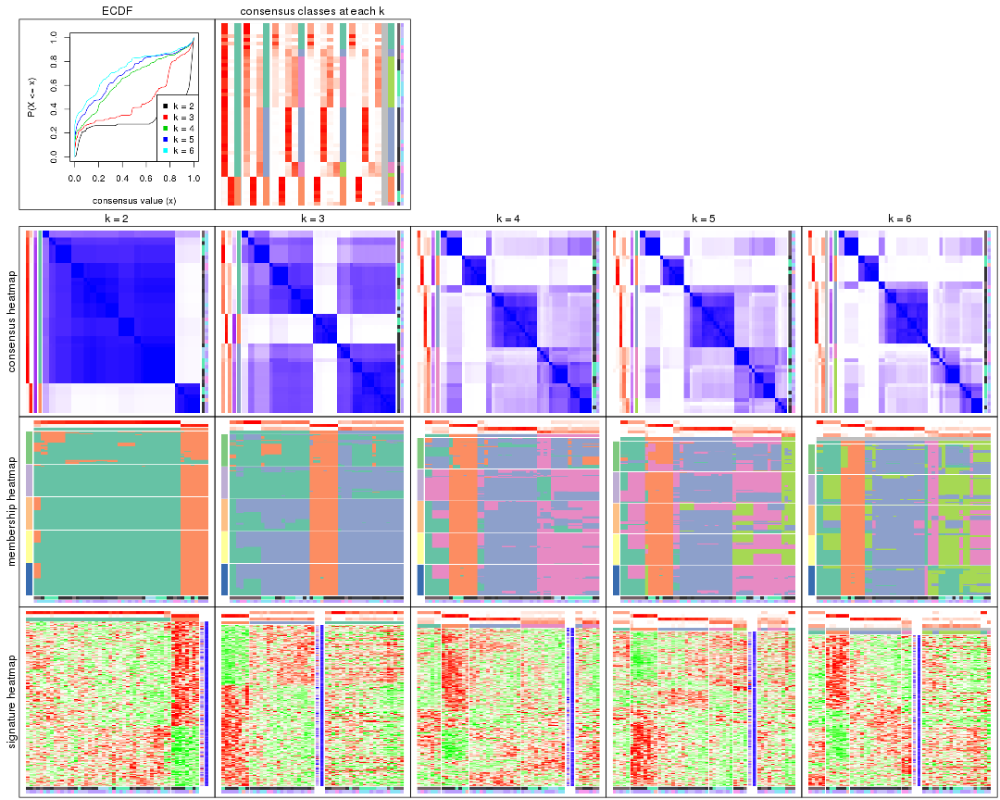

The plots are:

- The first row: a plot of the ECDF (empirical cumulative distribution
  function) curves of the consensus matrix for each `k` and the heatmap of
  predicted classes for each `k`.
- The second row: heatmaps of the consensus matrix for each `k`.
- The third row: heatmaps of the membership matrix for each `k`.
- The fouth row: heatmaps of the signatures for each `k`.

All the plots in panels can be made by individual functions and they are
plotted later in this section.

`select_partition_number()` produces several plots showing different
statistics for choosing "optimized" `k`. There are following statistics:

- ECDF curves of the consensus matrix for each `k`;
- 1-PAC. [The PAC
  score](https://en.wikipedia.org/wiki/Consensus_clustering#Over-interpretation_potential_of_consensus_clustering)
  measures the proportion of the ambiguous subgrouping.
- Mean silhouette score.
- Concordance. The mean probability of fiting the consensus class ids in all
  partitions.
- Area increased. Denote $A_k$ as the area under the ECDF curve for current
  `k`, the area increased is defined as $A_k - A_{k-1}$.
- Rand index. The percent of pairs of samples that are both in a same cluster
  or both are not in a same cluster in the partition of k and k-1.
- Jaccard index. The ratio of pairs of samples are both in a same cluster in
  the partition of k and k-1 and the pairs of samples are both in a same
  cluster in the partition k or k-1.

The detailed explanations of these statistics can be found in [the _cola_
vignette](http://bioconductor.org/packages/devel/bioc/vignettes/cola/inst/doc/cola.html#toc_13).

Generally speaking, lower PAC score, higher mean silhouette score or higher
concordance corresponds to better partition. Rand index and Jaccard index
measure how similar the current partition is compared to partition with `k-1`.
If they are too similar, we won't accept `k` is better than `k-1`.

```r
select_partition_number(res)
```

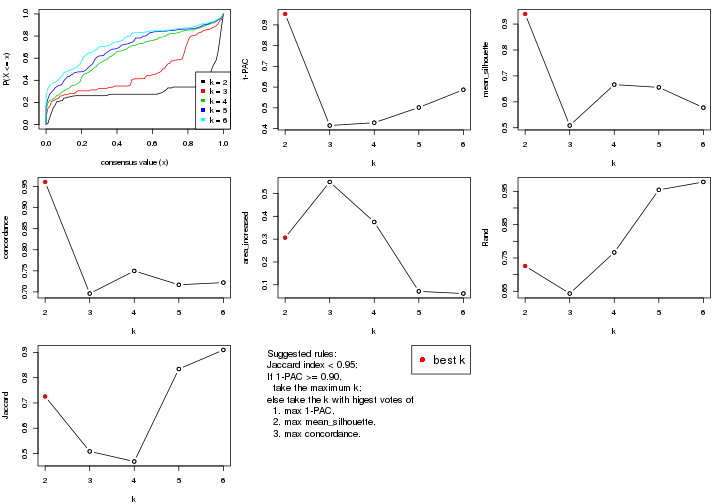

The numeric values for all these statistics can be obtained by `get_stats()`.

```r
get_stats(res)
```

```
#>   k 1-PAC mean_silhouette concordance area_increased  Rand Jaccard
#> 2 2 0.953           0.939       0.961         0.3067 0.726   0.726
#> 3 3 0.415           0.509       0.696         0.5506 0.643   0.508
#> 4 4 0.428           0.666       0.750         0.3751 0.767   0.468
#> 5 5 0.502           0.656       0.717         0.0711 0.954   0.834
#> 6 6 0.587           0.578       0.722         0.0617 0.978   0.910
```

`suggest_best_k()` suggests the best $k$ based on these statistics. The rules are as follows:

- All $k$ with Jaccard index larger than 0.95 are removed because increasing
  $k$ does not provide enough extra information. If all $k$ are removed, it is
  marked as no subgroup is detected.
- For all $k$ with 1-PAC score larger than 0.9, the maximal $k$ is taken as
  the best $k$, and other $k$ are marked as optional $k$.
- If it does not fit the second rule. The $k$ with the maximal vote of the
  highest 1-PAC score, highest mean silhouette, and highest concordance is
  taken as the best $k$.

```r
suggest_best_k(res)
```

```
#> [1] 2
```


Following shows the table of the partitions (You need to click the **show/hide
code output** link to see it). The membership matrix (columns with name `p*`)
is inferred by
[`clue::cl_consensus()`](https://www.rdocumentation.org/link/cl_consensus?package=clue)
function with the `SE` method. Basically the value in the membership matrix
represents the probability to belong to a certain group. The finall class
label for an item is determined with the group with highest probability it
belongs to.

In `get_classes()` function, the entropy is calculated from the membership
matrix and the silhouette score is calculated from the consensus matrix.


<script>
$( function() {
	$( '#tabs-SD-hclust-get-classes' ).tabs();
} );
</script>
<div id='tabs-SD-hclust-get-classes'>
<ul>
<li><a href='#tab-SD-hclust-get-classes-1'>k = 2</a></li>
<li><a href='#tab-SD-hclust-get-classes-2'>k = 3</a></li>
<li><a href='#tab-SD-hclust-get-classes-3'>k = 4</a></li>
<li><a href='#tab-SD-hclust-get-classes-4'>k = 5</a></li>
<li><a href='#tab-SD-hclust-get-classes-5'>k = 6</a></li>
</ul>

<div id='tab-SD-hclust-get-classes-1'>
<p><a id='tab-SD-hclust-get-classes-1-a' style='color:#0366d6' href='#'>show/hide code output</a></p>
<pre><code class="r">cbind(get_classes(res, k = 2), get_membership(res, k = 2))
</code></pre>

<pre><code>#&gt;          class entropy silhouette    p1    p2
#&gt; GSM63448     1  0.0938      0.959 0.988 0.012
#&gt; GSM63449     1  0.1633      0.952 0.976 0.024
#&gt; GSM63423     1  0.1633      0.952 0.976 0.024
#&gt; GSM63425     1  0.2043      0.955 0.968 0.032
#&gt; GSM63437     1  0.1633      0.952 0.976 0.024
#&gt; GSM63453     1  0.9000      0.542 0.684 0.316
#&gt; GSM63431     1  0.1633      0.952 0.976 0.024
#&gt; GSM63450     1  0.9000      0.542 0.684 0.316
#&gt; GSM63428     1  0.1633      0.952 0.976 0.024
#&gt; GSM63432     1  0.0938      0.959 0.988 0.012
#&gt; GSM63458     1  0.0000      0.959 1.000 0.000
#&gt; GSM63434     1  0.0938      0.958 0.988 0.012
#&gt; GSM63435     1  0.1843      0.957 0.972 0.028
#&gt; GSM63442     1  0.1184      0.957 0.984 0.016
#&gt; GSM63451     1  0.1184      0.958 0.984 0.016
#&gt; GSM63422     1  0.1843      0.957 0.972 0.028
#&gt; GSM63438     1  0.1414      0.956 0.980 0.020
#&gt; GSM63439     1  0.1414      0.956 0.980 0.020
#&gt; GSM63461     1  0.1414      0.956 0.980 0.020
#&gt; GSM63463     1  0.1843      0.957 0.972 0.028
#&gt; GSM63430     1  0.1843      0.957 0.972 0.028
#&gt; GSM63446     1  0.0000      0.959 1.000 0.000
#&gt; GSM63429     1  0.2043      0.955 0.968 0.032
#&gt; GSM63445     1  0.0938      0.958 0.988 0.012
#&gt; GSM63447     1  0.3431      0.927 0.936 0.064
#&gt; GSM63459     2  0.1843      0.989 0.028 0.972
#&gt; GSM63464     2  0.2043      0.989 0.032 0.968
#&gt; GSM63469     2  0.1843      0.989 0.028 0.972
#&gt; GSM63470     2  0.1843      0.989 0.028 0.972
#&gt; GSM63436     1  0.0000      0.959 1.000 0.000
#&gt; GSM63443     2  0.1843      0.973 0.028 0.972
#&gt; GSM63465     1  0.3431      0.927 0.936 0.064
#&gt; GSM63444     1  0.4939      0.891 0.892 0.108
#&gt; GSM63456     1  0.0376      0.959 0.996 0.004
#&gt; GSM63462     1  0.0000      0.959 1.000 0.000
#&gt; GSM63424     1  0.2043      0.955 0.968 0.032
#&gt; GSM63440     1  0.2043      0.955 0.968 0.032
#&gt; GSM63433     1  0.0000      0.959 1.000 0.000
#&gt; GSM63466     2  0.2778      0.981 0.048 0.952
#&gt; GSM63426     1  0.0000      0.959 1.000 0.000
#&gt; GSM63468     1  0.3431      0.927 0.936 0.064
#&gt; GSM63452     2  0.1843      0.989 0.028 0.972
#&gt; GSM63441     1  0.3431      0.927 0.936 0.064
#&gt; GSM63454     1  0.3431      0.927 0.936 0.064
#&gt; GSM63455     1  0.0000      0.959 1.000 0.000
#&gt; GSM63460     2  0.2778      0.981 0.048 0.952
#&gt; GSM63467     1  0.5178      0.882 0.884 0.116
#&gt; GSM63421     1  0.0000      0.959 1.000 0.000
#&gt; GSM63427     1  0.0000      0.959 1.000 0.000
#&gt; GSM63457     1  0.0000      0.959 1.000 0.000
</code></pre>

<script>
$('#tab-SD-hclust-get-classes-1-a').parent().next().next().hide();
$('#tab-SD-hclust-get-classes-1-a').click(function(){
  $('#tab-SD-hclust-get-classes-1-a').parent().next().next().toggle();
  return(false);
});
</script>
</div>

<div id='tab-SD-hclust-get-classes-2'>
<p><a id='tab-SD-hclust-get-classes-2-a' style='color:#0366d6' href='#'>show/hide code output</a></p>
<pre><code class="r">cbind(get_classes(res, k = 3), get_membership(res, k = 3))
</code></pre>

<pre><code>#&gt;          class entropy silhouette    p1    p2    p3
#&gt; GSM63448     1  0.4805     0.3048 0.812 0.012 0.176
#&gt; GSM63449     1  0.0000     0.4043 1.000 0.000 0.000
#&gt; GSM63423     1  0.0000     0.4043 1.000 0.000 0.000
#&gt; GSM63425     3  0.5722     0.5491 0.292 0.004 0.704
#&gt; GSM63437     1  0.0000     0.4043 1.000 0.000 0.000
#&gt; GSM63453     1  0.6937     0.1543 0.680 0.048 0.272
#&gt; GSM63431     1  0.0000     0.4043 1.000 0.000 0.000
#&gt; GSM63450     1  0.6937     0.1543 0.680 0.048 0.272
#&gt; GSM63428     1  0.0000     0.4043 1.000 0.000 0.000
#&gt; GSM63432     1  0.4915     0.2973 0.804 0.012 0.184
#&gt; GSM63458     1  0.5733     0.0617 0.676 0.000 0.324
#&gt; GSM63434     3  0.6302     0.8036 0.480 0.000 0.520
#&gt; GSM63435     3  0.6305     0.7904 0.484 0.000 0.516
#&gt; GSM63442     3  0.6302     0.8055 0.480 0.000 0.520
#&gt; GSM63451     3  0.6299     0.8066 0.476 0.000 0.524
#&gt; GSM63422     3  0.6307     0.7839 0.488 0.000 0.512
#&gt; GSM63438     3  0.6302     0.8004 0.480 0.000 0.520
#&gt; GSM63439     3  0.6295     0.8077 0.472 0.000 0.528
#&gt; GSM63461     3  0.6305     0.7969 0.484 0.000 0.516
#&gt; GSM63463     3  0.6302     0.7948 0.480 0.000 0.520
#&gt; GSM63430     3  0.6305     0.7904 0.484 0.000 0.516
#&gt; GSM63446     3  0.6518     0.7821 0.484 0.004 0.512
#&gt; GSM63429     3  0.6126     0.5890 0.352 0.004 0.644
#&gt; GSM63445     3  0.6302     0.8036 0.480 0.000 0.520
#&gt; GSM63447     1  0.7982    -0.0962 0.556 0.068 0.376
#&gt; GSM63459     2  0.0237     0.9843 0.004 0.996 0.000
#&gt; GSM63464     2  0.0661     0.9830 0.008 0.988 0.004
#&gt; GSM63469     2  0.0237     0.9843 0.004 0.996 0.000
#&gt; GSM63470     2  0.0237     0.9843 0.004 0.996 0.000
#&gt; GSM63436     1  0.5560     0.1860 0.700 0.000 0.300
#&gt; GSM63443     2  0.2063     0.9624 0.008 0.948 0.044
#&gt; GSM63465     1  0.7982    -0.0962 0.556 0.068 0.376
#&gt; GSM63444     3  0.8730     0.5917 0.388 0.112 0.500
#&gt; GSM63456     3  0.6678     0.7829 0.480 0.008 0.512
#&gt; GSM63462     3  0.6518     0.7821 0.484 0.004 0.512
#&gt; GSM63424     3  0.5722     0.5491 0.292 0.004 0.704
#&gt; GSM63440     3  0.5754     0.5623 0.296 0.004 0.700
#&gt; GSM63433     1  0.5760     0.0999 0.672 0.000 0.328
#&gt; GSM63466     2  0.1267     0.9737 0.024 0.972 0.004
#&gt; GSM63426     1  0.5760     0.0999 0.672 0.000 0.328
#&gt; GSM63468     1  0.7982    -0.0962 0.556 0.068 0.376
#&gt; GSM63452     2  0.0829     0.9821 0.004 0.984 0.012
#&gt; GSM63441     1  0.7982    -0.0962 0.556 0.068 0.376
#&gt; GSM63454     1  0.7982    -0.0962 0.556 0.068 0.376
#&gt; GSM63455     1  0.5760     0.0999 0.672 0.000 0.328
#&gt; GSM63460     2  0.1267     0.9737 0.024 0.972 0.004
#&gt; GSM63467     1  0.8590     0.0712 0.560 0.120 0.320
#&gt; GSM63421     1  0.5560     0.1860 0.700 0.000 0.300
#&gt; GSM63427     1  0.5560     0.1860 0.700 0.000 0.300
#&gt; GSM63457     1  0.5560     0.1860 0.700 0.000 0.300
</code></pre>

<script>
$('#tab-SD-hclust-get-classes-2-a').parent().next().next().hide();
$('#tab-SD-hclust-get-classes-2-a').click(function(){
  $('#tab-SD-hclust-get-classes-2-a').parent().next().next().toggle();
  return(false);
});
</script>
</div>

<div id='tab-SD-hclust-get-classes-3'>
<p><a id='tab-SD-hclust-get-classes-3-a' style='color:#0366d6' href='#'>show/hide code output</a></p>
<pre><code class="r">cbind(get_classes(res, k = 4), get_membership(res, k = 4))
</code></pre>

<pre><code>#&gt;          class entropy silhouette    p1    p2    p3    p4
#&gt; GSM63448     3  0.7850     -0.287 0.312 0.012 0.480 0.196
#&gt; GSM63449     1  0.7248      0.722 0.532 0.000 0.184 0.284
#&gt; GSM63423     1  0.7248      0.722 0.532 0.000 0.184 0.284
#&gt; GSM63425     4  0.2542      0.323 0.012 0.000 0.084 0.904
#&gt; GSM63437     1  0.7248      0.722 0.532 0.000 0.184 0.284
#&gt; GSM63453     1  0.3198      0.505 0.880 0.040 0.080 0.000
#&gt; GSM63431     1  0.7248      0.722 0.532 0.000 0.184 0.284
#&gt; GSM63450     1  0.3198      0.505 0.880 0.040 0.080 0.000
#&gt; GSM63428     1  0.7248      0.722 0.532 0.000 0.184 0.284
#&gt; GSM63432     3  0.7797     -0.253 0.304 0.012 0.492 0.192
#&gt; GSM63458     4  0.7098      0.413 0.192 0.000 0.244 0.564
#&gt; GSM63434     3  0.0376      0.840 0.004 0.000 0.992 0.004
#&gt; GSM63435     3  0.2002      0.830 0.020 0.000 0.936 0.044
#&gt; GSM63442     3  0.1118      0.838 0.000 0.000 0.964 0.036
#&gt; GSM63451     3  0.1004      0.840 0.004 0.000 0.972 0.024
#&gt; GSM63422     3  0.2089      0.828 0.020 0.000 0.932 0.048
#&gt; GSM63438     3  0.0657      0.841 0.004 0.000 0.984 0.012
#&gt; GSM63439     3  0.0000      0.841 0.000 0.000 1.000 0.000
#&gt; GSM63461     3  0.1398      0.835 0.004 0.000 0.956 0.040
#&gt; GSM63463     3  0.1798      0.834 0.016 0.000 0.944 0.040
#&gt; GSM63430     3  0.1297      0.838 0.020 0.000 0.964 0.016
#&gt; GSM63446     3  0.2530      0.789 0.008 0.008 0.912 0.072
#&gt; GSM63429     4  0.4137      0.472 0.012 0.000 0.208 0.780
#&gt; GSM63445     3  0.0376      0.840 0.004 0.000 0.992 0.004
#&gt; GSM63447     4  0.8086      0.621 0.124 0.060 0.284 0.532
#&gt; GSM63459     2  0.0000      0.974 0.000 1.000 0.000 0.000
#&gt; GSM63464     2  0.0376      0.971 0.000 0.992 0.004 0.004
#&gt; GSM63469     2  0.0000      0.974 0.000 1.000 0.000 0.000
#&gt; GSM63470     2  0.0000      0.974 0.000 1.000 0.000 0.000
#&gt; GSM63436     4  0.7282      0.503 0.160 0.000 0.348 0.492
#&gt; GSM63443     2  0.3182      0.895 0.096 0.876 0.028 0.000
#&gt; GSM63465     4  0.8086      0.621 0.124 0.060 0.284 0.532
#&gt; GSM63444     3  0.5191      0.647 0.032 0.104 0.792 0.072
#&gt; GSM63456     3  0.2660      0.787 0.008 0.012 0.908 0.072
#&gt; GSM63462     3  0.2530      0.789 0.008 0.008 0.912 0.072
#&gt; GSM63424     4  0.3428      0.357 0.012 0.000 0.144 0.844
#&gt; GSM63440     4  0.3978      0.408 0.012 0.000 0.192 0.796
#&gt; GSM63433     4  0.6915      0.578 0.140 0.000 0.296 0.564
#&gt; GSM63466     2  0.1339      0.961 0.024 0.964 0.004 0.008
#&gt; GSM63426     4  0.6896      0.577 0.140 0.000 0.292 0.568
#&gt; GSM63468     4  0.8086      0.621 0.124 0.060 0.284 0.532
#&gt; GSM63452     2  0.0469      0.971 0.012 0.988 0.000 0.000
#&gt; GSM63441     4  0.7987      0.622 0.124 0.060 0.264 0.552
#&gt; GSM63454     4  0.8086      0.621 0.124 0.060 0.284 0.532
#&gt; GSM63455     4  0.6856      0.574 0.140 0.000 0.284 0.576
#&gt; GSM63460     2  0.1339      0.961 0.024 0.964 0.004 0.008
#&gt; GSM63467     4  0.8232      0.524 0.156 0.108 0.160 0.576
#&gt; GSM63421     4  0.7282      0.503 0.160 0.000 0.348 0.492
#&gt; GSM63427     4  0.7282      0.503 0.160 0.000 0.348 0.492
#&gt; GSM63457     4  0.7282      0.503 0.160 0.000 0.348 0.492
</code></pre>

<script>
$('#tab-SD-hclust-get-classes-3-a').parent().next().next().hide();
$('#tab-SD-hclust-get-classes-3-a').click(function(){
  $('#tab-SD-hclust-get-classes-3-a').parent().next().next().toggle();
  return(false);
});
</script>
</div>

<div id='tab-SD-hclust-get-classes-4'>
<p><a id='tab-SD-hclust-get-classes-4-a' style='color:#0366d6' href='#'>show/hide code output</a></p>
<pre><code class="r">cbind(get_classes(res, k = 5), get_membership(res, k = 5))
</code></pre>

<pre><code>#&gt;          class entropy silhouette    p1    p2    p3    p4    p5
#&gt; GSM63448     3  0.6804     -0.235 0.204 0.012 0.472 0.312 0.000
#&gt; GSM63449     1  0.5775      0.707 0.472 0.000 0.088 0.440 0.000
#&gt; GSM63423     1  0.5775      0.707 0.472 0.000 0.088 0.440 0.000
#&gt; GSM63425     5  0.3983      0.674 0.000 0.000 0.000 0.340 0.660
#&gt; GSM63437     1  0.5775      0.707 0.472 0.000 0.088 0.440 0.000
#&gt; GSM63453     1  0.1954      0.401 0.932 0.032 0.008 0.028 0.000
#&gt; GSM63431     1  0.5775      0.707 0.472 0.000 0.088 0.440 0.000
#&gt; GSM63450     1  0.1954      0.401 0.932 0.032 0.008 0.028 0.000
#&gt; GSM63428     1  0.5775      0.707 0.472 0.000 0.088 0.440 0.000
#&gt; GSM63432     3  0.6728     -0.205 0.192 0.012 0.488 0.308 0.000
#&gt; GSM63458     4  0.7270      0.388 0.072 0.000 0.208 0.528 0.192
#&gt; GSM63434     3  0.0451      0.835 0.000 0.000 0.988 0.008 0.004
#&gt; GSM63435     3  0.1628      0.825 0.008 0.000 0.936 0.056 0.000
#&gt; GSM63442     3  0.1124      0.833 0.000 0.000 0.960 0.036 0.004
#&gt; GSM63451     3  0.0880      0.835 0.000 0.000 0.968 0.032 0.000
#&gt; GSM63422     3  0.1697      0.822 0.008 0.000 0.932 0.060 0.000
#&gt; GSM63438     3  0.0566      0.837 0.004 0.000 0.984 0.012 0.000
#&gt; GSM63439     3  0.0324      0.837 0.004 0.000 0.992 0.004 0.000
#&gt; GSM63461     3  0.1205      0.829 0.004 0.000 0.956 0.040 0.000
#&gt; GSM63463     3  0.1484      0.829 0.008 0.000 0.944 0.048 0.000
#&gt; GSM63430     3  0.1082      0.834 0.008 0.000 0.964 0.028 0.000
#&gt; GSM63446     3  0.2521      0.781 0.000 0.008 0.900 0.024 0.068
#&gt; GSM63429     5  0.6149      0.558 0.000 0.000 0.164 0.296 0.540
#&gt; GSM63445     3  0.0451      0.835 0.000 0.000 0.988 0.008 0.004
#&gt; GSM63447     4  0.7470      0.358 0.000 0.048 0.260 0.444 0.248
#&gt; GSM63459     2  0.0000      0.918 0.000 1.000 0.000 0.000 0.000
#&gt; GSM63464     2  0.0324      0.915 0.000 0.992 0.004 0.004 0.000
#&gt; GSM63469     2  0.0000      0.918 0.000 1.000 0.000 0.000 0.000
#&gt; GSM63470     2  0.0000      0.918 0.000 1.000 0.000 0.000 0.000
#&gt; GSM63436     4  0.3913      0.634 0.000 0.000 0.324 0.676 0.000
#&gt; GSM63443     2  0.7896      0.511 0.056 0.472 0.028 0.168 0.276
#&gt; GSM63465     4  0.7470      0.358 0.000 0.048 0.260 0.444 0.248
#&gt; GSM63444     3  0.4922      0.653 0.008 0.060 0.780 0.084 0.068
#&gt; GSM63456     3  0.2633      0.779 0.000 0.012 0.896 0.024 0.068
#&gt; GSM63462     3  0.2521      0.781 0.000 0.008 0.900 0.024 0.068
#&gt; GSM63424     5  0.4847      0.776 0.000 0.000 0.068 0.240 0.692
#&gt; GSM63440     5  0.5442      0.769 0.000 0.000 0.116 0.240 0.644
#&gt; GSM63433     4  0.4455      0.633 0.000 0.000 0.260 0.704 0.036
#&gt; GSM63466     2  0.1990      0.889 0.008 0.920 0.004 0.068 0.000
#&gt; GSM63426     4  0.4430      0.632 0.000 0.000 0.256 0.708 0.036
#&gt; GSM63468     4  0.7470      0.358 0.000 0.048 0.260 0.444 0.248
#&gt; GSM63452     2  0.0404      0.915 0.012 0.988 0.000 0.000 0.000
#&gt; GSM63441     4  0.7396      0.365 0.000 0.048 0.240 0.464 0.248
#&gt; GSM63454     4  0.7470      0.358 0.000 0.048 0.260 0.444 0.248
#&gt; GSM63455     4  0.4378      0.628 0.000 0.000 0.248 0.716 0.036
#&gt; GSM63460     2  0.1990      0.889 0.008 0.920 0.004 0.068 0.000
#&gt; GSM63467     4  0.4945      0.476 0.008 0.064 0.124 0.768 0.036
#&gt; GSM63421     4  0.3913      0.634 0.000 0.000 0.324 0.676 0.000
#&gt; GSM63427     4  0.3913      0.634 0.000 0.000 0.324 0.676 0.000
#&gt; GSM63457     4  0.3913      0.634 0.000 0.000 0.324 0.676 0.000
</code></pre>

<script>
$('#tab-SD-hclust-get-classes-4-a').parent().next().next().hide();
$('#tab-SD-hclust-get-classes-4-a').click(function(){
  $('#tab-SD-hclust-get-classes-4-a').parent().next().next().toggle();
  return(false);
});
</script>
</div>

<div id='tab-SD-hclust-get-classes-5'>
<p><a id='tab-SD-hclust-get-classes-5-a' style='color:#0366d6' href='#'>show/hide code output</a></p>
<pre><code class="r">cbind(get_classes(res, k = 6), get_membership(res, k = 6))
</code></pre>

<pre><code>#&gt;          class entropy silhouette    p1    p2    p3    p4    p5 p6
#&gt; GSM63448     3  0.5879     -0.160 0.208 0.000 0.448 0.000 0.344 NA
#&gt; GSM63449     1  0.5077      0.712 0.468 0.000 0.064 0.000 0.464 NA
#&gt; GSM63423     1  0.5077      0.712 0.468 0.000 0.064 0.000 0.464 NA
#&gt; GSM63425     4  0.5943      0.540 0.000 0.000 0.004 0.488 0.224 NA
#&gt; GSM63437     1  0.5077      0.712 0.468 0.000 0.064 0.000 0.464 NA
#&gt; GSM63453     1  0.0922      0.325 0.968 0.024 0.000 0.000 0.004 NA
#&gt; GSM63431     1  0.5077      0.712 0.468 0.000 0.064 0.000 0.464 NA
#&gt; GSM63450     1  0.0922      0.325 0.968 0.024 0.000 0.000 0.004 NA
#&gt; GSM63428     1  0.5077      0.712 0.468 0.000 0.064 0.000 0.464 NA
#&gt; GSM63432     3  0.5818     -0.133 0.196 0.000 0.464 0.000 0.340 NA
#&gt; GSM63458     5  0.6424      0.301 0.052 0.000 0.164 0.016 0.576 NA
#&gt; GSM63434     3  0.0547      0.835 0.000 0.000 0.980 0.000 0.020 NA
#&gt; GSM63435     3  0.1480      0.825 0.000 0.000 0.940 0.000 0.040 NA
#&gt; GSM63442     3  0.0865      0.834 0.000 0.000 0.964 0.000 0.036 NA
#&gt; GSM63451     3  0.0713      0.836 0.000 0.000 0.972 0.000 0.028 NA
#&gt; GSM63422     3  0.1549      0.823 0.000 0.000 0.936 0.000 0.044 NA
#&gt; GSM63438     3  0.0692      0.837 0.000 0.000 0.976 0.000 0.020 NA
#&gt; GSM63439     3  0.0260      0.837 0.000 0.000 0.992 0.000 0.008 NA
#&gt; GSM63461     3  0.1010      0.831 0.000 0.000 0.960 0.000 0.036 NA
#&gt; GSM63463     3  0.1320      0.830 0.000 0.000 0.948 0.000 0.036 NA
#&gt; GSM63430     3  0.1176      0.834 0.000 0.000 0.956 0.000 0.024 NA
#&gt; GSM63446     3  0.2313      0.777 0.000 0.004 0.884 0.000 0.100 NA
#&gt; GSM63429     5  0.7274     -0.377 0.000 0.000 0.132 0.296 0.392 NA
#&gt; GSM63445     3  0.0547      0.835 0.000 0.000 0.980 0.000 0.020 NA
#&gt; GSM63447     5  0.5096      0.315 0.000 0.000 0.216 0.000 0.628 NA
#&gt; GSM63459     2  0.0000      0.947 0.000 1.000 0.000 0.000 0.000 NA
#&gt; GSM63464     2  0.0291      0.944 0.000 0.992 0.004 0.000 0.004 NA
#&gt; GSM63469     2  0.0000      0.947 0.000 1.000 0.000 0.000 0.000 NA
#&gt; GSM63470     2  0.0000      0.947 0.000 1.000 0.000 0.000 0.000 NA
#&gt; GSM63436     5  0.5721      0.350 0.000 0.000 0.236 0.000 0.520 NA
#&gt; GSM63443     4  0.4465      0.114 0.000 0.000 0.028 0.512 0.000 NA
#&gt; GSM63465     5  0.5096      0.315 0.000 0.000 0.216 0.000 0.628 NA
#&gt; GSM63444     3  0.4204      0.657 0.016 0.012 0.760 0.000 0.176 NA
#&gt; GSM63456     3  0.2473      0.773 0.000 0.008 0.876 0.000 0.104 NA
#&gt; GSM63462     3  0.2361      0.775 0.000 0.004 0.880 0.000 0.104 NA
#&gt; GSM63424     4  0.6502      0.575 0.000 0.000 0.056 0.488 0.296 NA
#&gt; GSM63440     4  0.6977      0.520 0.000 0.000 0.104 0.440 0.296 NA
#&gt; GSM63433     5  0.5799      0.464 0.000 0.000 0.192 0.000 0.468 NA
#&gt; GSM63466     2  0.2878      0.872 0.016 0.860 0.000 0.000 0.100 NA
#&gt; GSM63426     5  0.5779      0.462 0.000 0.000 0.188 0.000 0.472 NA
#&gt; GSM63468     5  0.5096      0.315 0.000 0.000 0.216 0.000 0.628 NA
#&gt; GSM63452     2  0.0363      0.943 0.012 0.988 0.000 0.000 0.000 NA
#&gt; GSM63441     5  0.5148      0.309 0.000 0.000 0.196 0.000 0.624 NA
#&gt; GSM63454     5  0.5096      0.315 0.000 0.000 0.216 0.000 0.628 NA
#&gt; GSM63455     5  0.5758      0.425 0.000 0.000 0.184 0.000 0.476 NA
#&gt; GSM63460     2  0.2878      0.872 0.016 0.860 0.000 0.000 0.100 NA
#&gt; GSM63467     5  0.5604      0.353 0.016 0.004 0.088 0.000 0.536 NA
#&gt; GSM63421     5  0.5721      0.350 0.000 0.000 0.236 0.000 0.520 NA
#&gt; GSM63427     5  0.5721      0.350 0.000 0.000 0.236 0.000 0.520 NA
#&gt; GSM63457     5  0.5721      0.350 0.000 0.000 0.236 0.000 0.520 NA
</code></pre>

<script>
$('#tab-SD-hclust-get-classes-5-a').parent().next().next().hide();
$('#tab-SD-hclust-get-classes-5-a').click(function(){
  $('#tab-SD-hclust-get-classes-5-a').parent().next().next().toggle();
  return(false);
});
</script>
</div>
</div>

Heatmaps for the consensus matrix. It visualizes the probability of two
samples to be in a same group.


<script>
$( function() {
	$( '#tabs-SD-hclust-consensus-heatmap' ).tabs();
} );
</script>
<div id='tabs-SD-hclust-consensus-heatmap'>
<ul>
<li><a href='#tab-SD-hclust-consensus-heatmap-1'>k = 2</a></li>
<li><a href='#tab-SD-hclust-consensus-heatmap-2'>k = 3</a></li>
<li><a href='#tab-SD-hclust-consensus-heatmap-3'>k = 4</a></li>
<li><a href='#tab-SD-hclust-consensus-heatmap-4'>k = 5</a></li>
<li><a href='#tab-SD-hclust-consensus-heatmap-5'>k = 6</a></li>
</ul>
<div id='tab-SD-hclust-consensus-heatmap-1'>
<pre><code class="r">consensus_heatmap(res, k = 2)
</code></pre>

<p>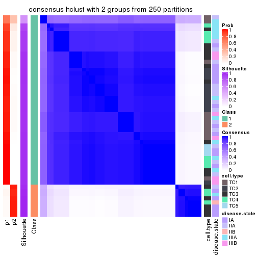</p>

</div>
<div id='tab-SD-hclust-consensus-heatmap-2'>
<pre><code class="r">consensus_heatmap(res, k = 3)
</code></pre>

<p>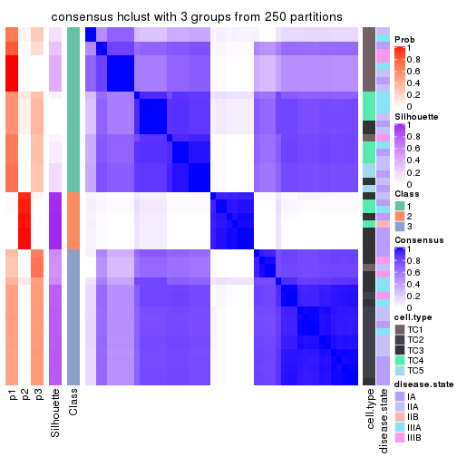</p>

</div>
<div id='tab-SD-hclust-consensus-heatmap-3'>
<pre><code class="r">consensus_heatmap(res, k = 4)
</code></pre>

<p>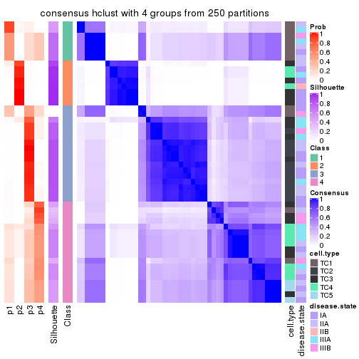</p>

</div>
<div id='tab-SD-hclust-consensus-heatmap-4'>
<pre><code class="r">consensus_heatmap(res, k = 5)
</code></pre>

<p>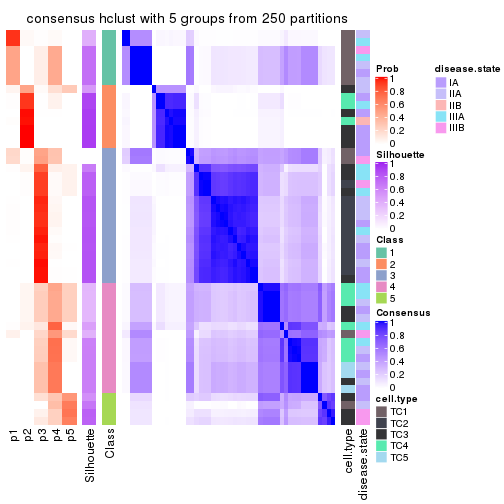</p>

</div>
<div id='tab-SD-hclust-consensus-heatmap-5'>
<pre><code class="r">consensus_heatmap(res, k = 6)
</code></pre>

<p>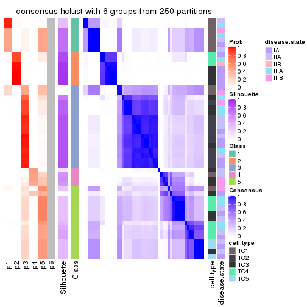</p>

</div>
</div>

Heatmaps for the membership of samples in all partitions to see how consistent they are:


<script>
$( function() {
	$( '#tabs-SD-hclust-membership-heatmap' ).tabs();
} );
</script>
<div id='tabs-SD-hclust-membership-heatmap'>
<ul>
<li><a href='#tab-SD-hclust-membership-heatmap-1'>k = 2</a></li>
<li><a href='#tab-SD-hclust-membership-heatmap-2'>k = 3</a></li>
<li><a href='#tab-SD-hclust-membership-heatmap-3'>k = 4</a></li>
<li><a href='#tab-SD-hclust-membership-heatmap-4'>k = 5</a></li>
<li><a href='#tab-SD-hclust-membership-heatmap-5'>k = 6</a></li>
</ul>
<div id='tab-SD-hclust-membership-heatmap-1'>
<pre><code class="r">membership_heatmap(res, k = 2)
</code></pre>

<p>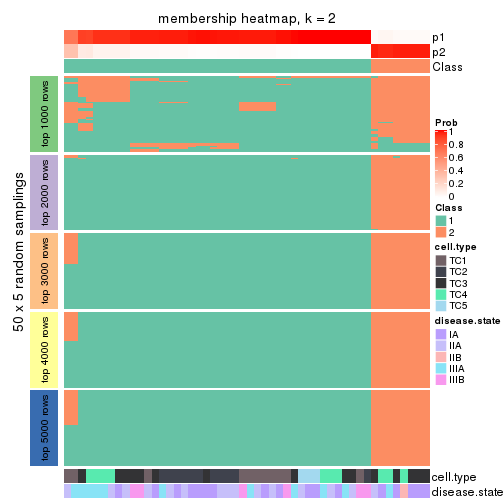</p>

</div>
<div id='tab-SD-hclust-membership-heatmap-2'>
<pre><code class="r">membership_heatmap(res, k = 3)
</code></pre>

<p>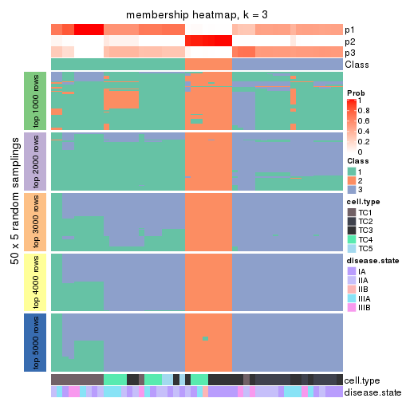</p>

</div>
<div id='tab-SD-hclust-membership-heatmap-3'>
<pre><code class="r">membership_heatmap(res, k = 4)
</code></pre>

<p>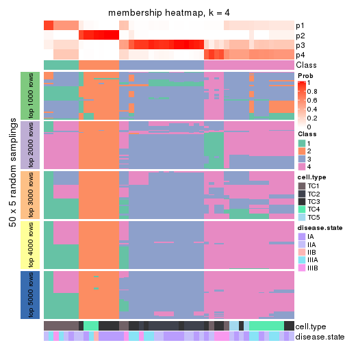</p>

</div>
<div id='tab-SD-hclust-membership-heatmap-4'>
<pre><code class="r">membership_heatmap(res, k = 5)
</code></pre>

<p>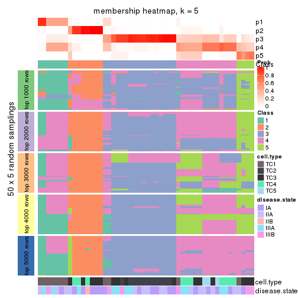</p>

</div>
<div id='tab-SD-hclust-membership-heatmap-5'>
<pre><code class="r">membership_heatmap(res, k = 6)
</code></pre>

<p>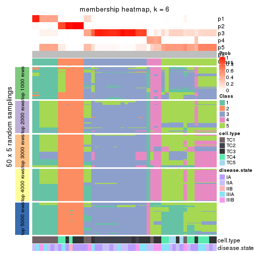</p>

</div>
</div>

As soon as we have had the classes for columns, we can look for signatures
which are significantly different between classes which can be candidate marks
for certain classes. Following are the heatmaps for signatures.


Signature heatmaps where rows are scaled:


<script>
$( function() {
	$( '#tabs-SD-hclust-get-signatures' ).tabs();
} );
</script>
<div id='tabs-SD-hclust-get-signatures'>
<ul>
<li><a href='#tab-SD-hclust-get-signatures-1'>k = 2</a></li>
<li><a href='#tab-SD-hclust-get-signatures-2'>k = 3</a></li>
<li><a href='#tab-SD-hclust-get-signatures-3'>k = 4</a></li>
<li><a href='#tab-SD-hclust-get-signatures-4'>k = 5</a></li>
<li><a href='#tab-SD-hclust-get-signatures-5'>k = 6</a></li>
</ul>
<div id='tab-SD-hclust-get-signatures-1'>
<pre><code class="r">get_signatures(res, k = 2)
</code></pre>

<p>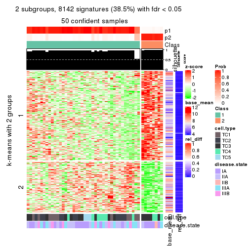</p>

</div>
<div id='tab-SD-hclust-get-signatures-2'>
<pre><code class="r">get_signatures(res, k = 3)
</code></pre>

<p>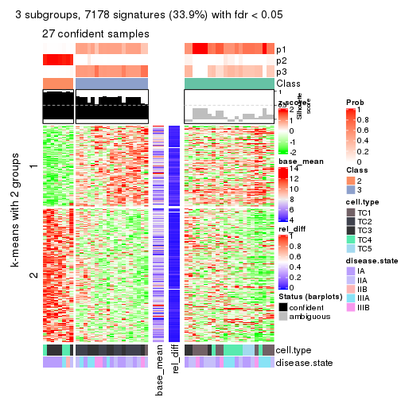</p>

</div>
<div id='tab-SD-hclust-get-signatures-3'>
<pre><code class="r">get_signatures(res, k = 4)
</code></pre>

<p>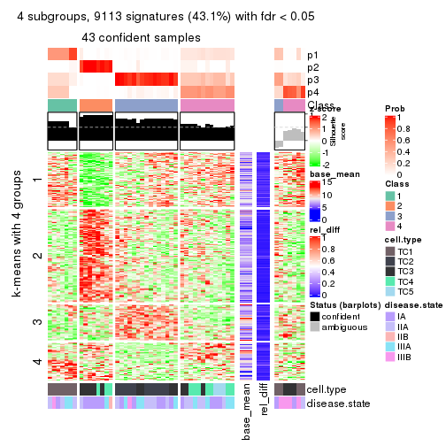</p>

</div>
<div id='tab-SD-hclust-get-signatures-4'>
<pre><code class="r">get_signatures(res, k = 5)
</code></pre>

<p>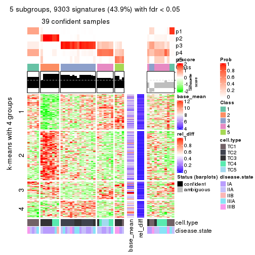</p>

</div>
<div id='tab-SD-hclust-get-signatures-5'>
<pre><code class="r">get_signatures(res, k = 6)
</code></pre>

<p>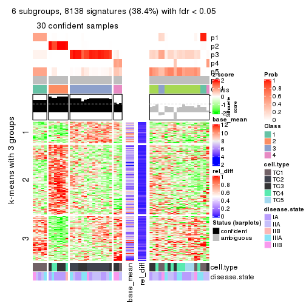</p>

</div>
</div>


Signature heatmaps where rows are not scaled:


<script>
$( function() {
	$( '#tabs-SD-hclust-get-signatures-no-scale' ).tabs();
} );
</script>
<div id='tabs-SD-hclust-get-signatures-no-scale'>
<ul>
<li><a href='#tab-SD-hclust-get-signatures-no-scale-1'>k = 2</a></li>
<li><a href='#tab-SD-hclust-get-signatures-no-scale-2'>k = 3</a></li>
<li><a href='#tab-SD-hclust-get-signatures-no-scale-3'>k = 4</a></li>
<li><a href='#tab-SD-hclust-get-signatures-no-scale-4'>k = 5</a></li>
<li><a href='#tab-SD-hclust-get-signatures-no-scale-5'>k = 6</a></li>
</ul>
<div id='tab-SD-hclust-get-signatures-no-scale-1'>
<pre><code class="r">get_signatures(res, k = 2, scale_rows = FALSE)
</code></pre>

<p>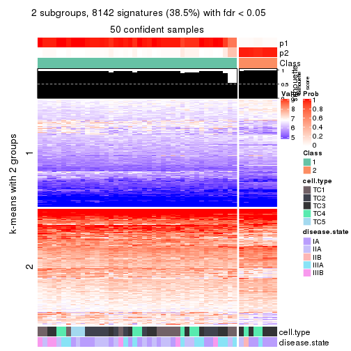</p>

</div>
<div id='tab-SD-hclust-get-signatures-no-scale-2'>
<pre><code class="r">get_signatures(res, k = 3, scale_rows = FALSE)
</code></pre>

<p>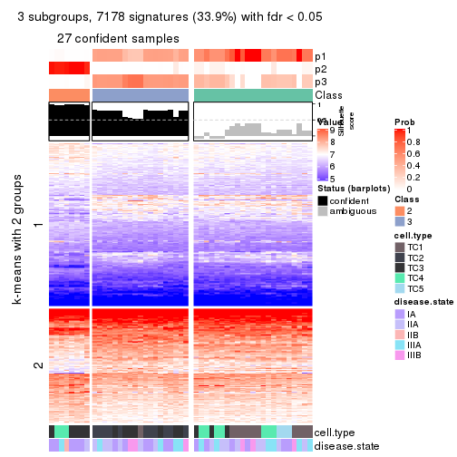</p>

</div>
<div id='tab-SD-hclust-get-signatures-no-scale-3'>
<pre><code class="r">get_signatures(res, k = 4, scale_rows = FALSE)
</code></pre>

<p>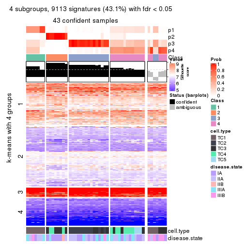</p>

</div>
<div id='tab-SD-hclust-get-signatures-no-scale-4'>
<pre><code class="r">get_signatures(res, k = 5, scale_rows = FALSE)
</code></pre>

<p>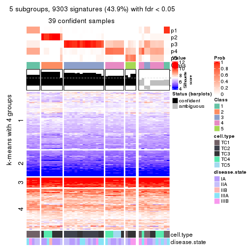</p>

</div>
<div id='tab-SD-hclust-get-signatures-no-scale-5'>
<pre><code class="r">get_signatures(res, k = 6, scale_rows = FALSE)
</code></pre>

<p>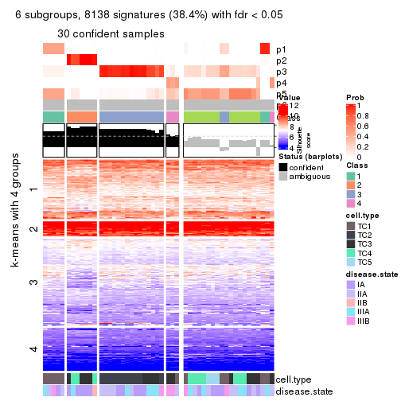</p>

</div>
</div>


Compare the overlap of signatures from different k:

```r
compare_signatures(res)
```

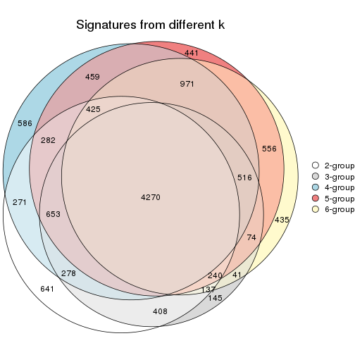

`get_signature()` returns a data frame invisibly. TO get the list of signatures, the function
call should be assigned to a variable explicitly. In following code, if `plot` argument is set
to `FALSE`, no heatmap is plotted while only the differential analysis is performed.

```r
# code only for demonstration
tb = get_signature(res, k = ..., plot = FALSE)
```

An example of the output of `tb` is:

```
#>   which_row         fdr    mean_1    mean_2 scaled_mean_1 scaled_mean_2 km
#> 1        38 0.042760348  8.373488  9.131774    -0.5533452     0.5164555  1
#> 2        40 0.018707592  7.106213  8.469186    -0.6173731     0.5762149  1
#> 3        55 0.019134737 10.221463 11.207825    -0.6159697     0.5749050  1
#> 4        59 0.006059896  5.921854  7.869574    -0.6899429     0.6439467  1
#> 5        60 0.018055526  8.928898 10.211722    -0.6204761     0.5791110  1
#> 6        98 0.009384629 15.714769 14.887706     0.6635654    -0.6193277  2
...
```

The columns in `tb` are:

1. `which_row`: row indices corresponding to the input matrix.
2. `fdr`: FDR for the differential test. 
3. `mean_x`: The mean value in group x.
4. `scaled_mean_x`: The mean value in group x after rows are scaled.
5. `km`: Row groups if k-means clustering is applied to rows.


UMAP plot which shows how samples are separated.


<script>
$( function() {
	$( '#tabs-SD-hclust-dimension-reduction' ).tabs();
} );
</script>
<div id='tabs-SD-hclust-dimension-reduction'>
<ul>
<li><a href='#tab-SD-hclust-dimension-reduction-1'>k = 2</a></li>
<li><a href='#tab-SD-hclust-dimension-reduction-2'>k = 3</a></li>
<li><a href='#tab-SD-hclust-dimension-reduction-3'>k = 4</a></li>
<li><a href='#tab-SD-hclust-dimension-reduction-4'>k = 5</a></li>
<li><a href='#tab-SD-hclust-dimension-reduction-5'>k = 6</a></li>
</ul>
<div id='tab-SD-hclust-dimension-reduction-1'>
<pre><code class="r">dimension_reduction(res, k = 2, method = &quot;UMAP&quot;)
</code></pre>

<p>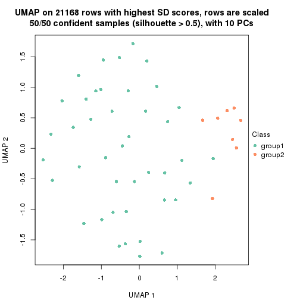</p>

</div>
<div id='tab-SD-hclust-dimension-reduction-2'>
<pre><code class="r">dimension_reduction(res, k = 3, method = &quot;UMAP&quot;)
</code></pre>

<p>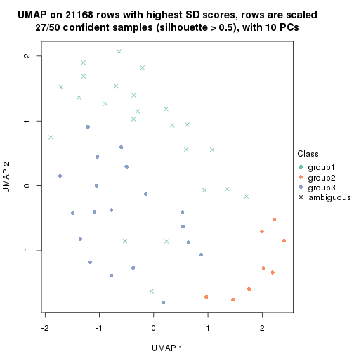</p>

</div>
<div id='tab-SD-hclust-dimension-reduction-3'>
<pre><code class="r">dimension_reduction(res, k = 4, method = &quot;UMAP&quot;)
</code></pre>

<p>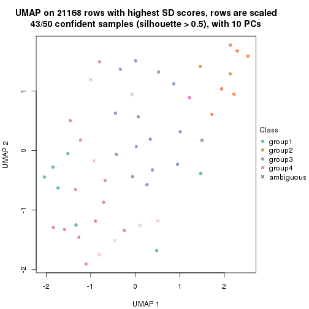</p>

</div>
<div id='tab-SD-hclust-dimension-reduction-4'>
<pre><code class="r">dimension_reduction(res, k = 5, method = &quot;UMAP&quot;)
</code></pre>

<p>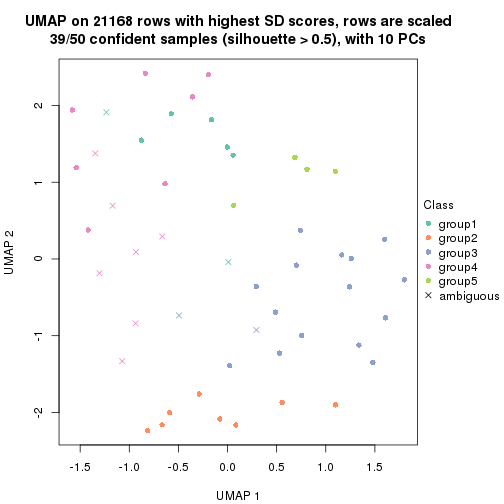</p>

</div>
<div id='tab-SD-hclust-dimension-reduction-5'>
<pre><code class="r">dimension_reduction(res, k = 6, method = &quot;UMAP&quot;)
</code></pre>

<p>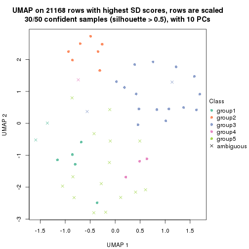</p>

</div>
</div>


Following heatmap shows how subgroups are split when increasing `k`:

```r
collect_classes(res)
```

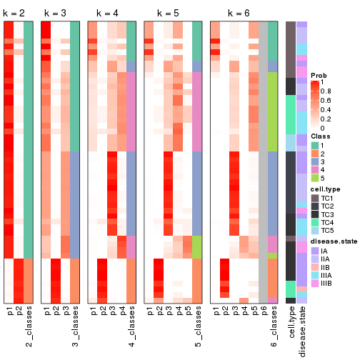


Test correlation between subgroups and known annotations. If the known
annotation is numeric, one-way ANOVA test is applied, and if the known
annotation is discrete, chi-squared contingency table test is applied.

```r
test_to_known_factors(res)
```

```
#>            n cell.type(p) disease.state(p) k
#> SD:hclust 50     4.83e-02           0.0399 2
#> SD:hclust 27     4.61e-03           0.2012 3
#> SD:hclust 43     4.12e-12           0.4770 4
#> SD:hclust 39     9.18e-10           0.3753 5
#> SD:hclust 30     7.20e-07           0.0970 6
```


If matrix rows can be associated to genes, consider to use `functional_enrichment(res,
...)` to perform function enrichment for the signature genes. See [this vignette](http://bioconductor.org/packages/devel/bioc/vignettes/cola/inst/doc/functional_enrichment.html) for more detailed explanations.


 

---------------------------------------------------


### SD:kmeans


The object with results only for a single top-value method and a single partition method 
can be extracted as:

```r
res = res_list["SD", "kmeans"]
# you can also extract it by
# res = res_list["SD:kmeans"]
```

A summary of `res` and all the functions that can be applied to it:

```r
res
```

```
#> A 'ConsensusPartition' object with k = 2, 3, 4, 5, 6.
#>   On a matrix with 21168 rows and 50 columns.
#>   Top rows (1000, 2000, 3000, 4000, 5000) are extracted by 'SD' method.
#>   Subgroups are detected by 'kmeans' method.
#>   Performed in total 1250 partitions by row resampling.
#>   Best k for subgroups seems to be 4.
#> 
#> Following methods can be applied to this 'ConsensusPartition' object:
#>  [1] "cola_report"             "collect_classes"         "collect_plots"          
#>  [4] "collect_stats"           "colnames"                "compare_signatures"     
#>  [7] "consensus_heatmap"       "dimension_reduction"     "functional_enrichment"  
#> [10] "get_anno_col"            "get_anno"                "get_classes"            
#> [13] "get_consensus"           "get_matrix"              "get_membership"         
#> [16] "get_param"               "get_signatures"          "get_stats"              
#> [19] "is_best_k"               "is_stable_k"             "membership_heatmap"     
#> [22] "ncol"                    "nrow"                    "plot_ecdf"              
#> [25] "rownames"                "select_partition_number" "show"                   
#> [28] "suggest_best_k"          "test_to_known_factors"
```

`collect_plots()` function collects all the plots made from `res` for all `k` (number of partitions)
into one single page to provide an easy and fast comparison between different `k`.

```r
collect_plots(res)
```

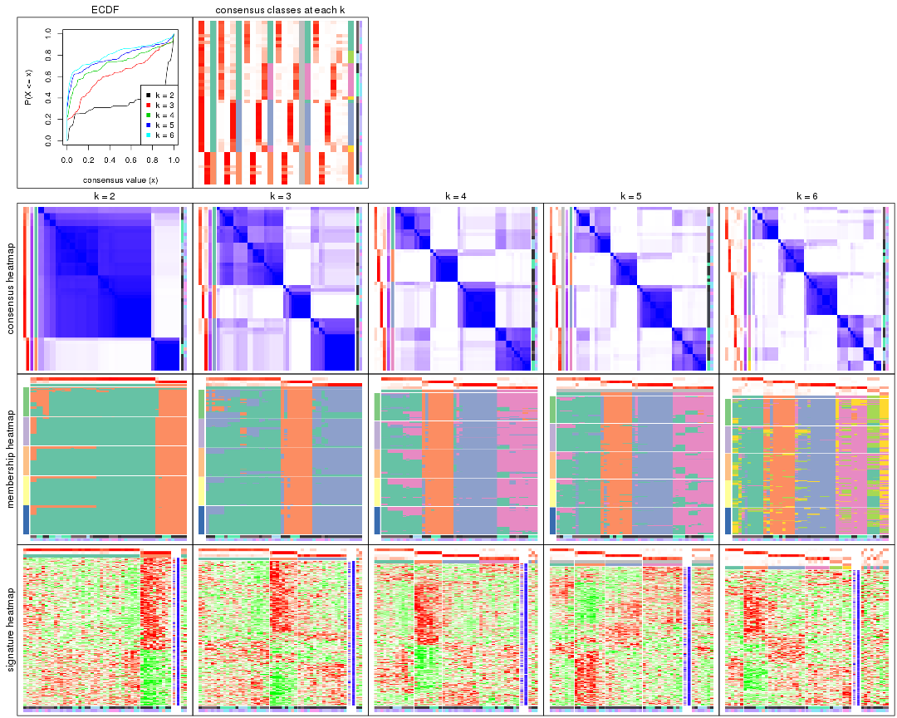

The plots are:

- The first row: a plot of the ECDF (empirical cumulative distribution
  function) curves of the consensus matrix for each `k` and the heatmap of
  predicted classes for each `k`.
- The second row: heatmaps of the consensus matrix for each `k`.
- The third row: heatmaps of the membership matrix for each `k`.
- The fouth row: heatmaps of the signatures for each `k`.

All the plots in panels can be made by individual functions and they are
plotted later in this section.

`select_partition_number()` produces several plots showing different
statistics for choosing "optimized" `k`. There are following statistics:

- ECDF curves of the consensus matrix for each `k`;
- 1-PAC. [The PAC
  score](https://en.wikipedia.org/wiki/Consensus_clustering#Over-interpretation_potential_of_consensus_clustering)
  measures the proportion of the ambiguous subgrouping.
- Mean silhouette score.
- Concordance. The mean probability of fiting the consensus class ids in all
  partitions.
- Area increased. Denote $A_k$ as the area under the ECDF curve for current
  `k`, the area increased is defined as $A_k - A_{k-1}$.
- Rand index. The percent of pairs of samples that are both in a same cluster
  or both are not in a same cluster in the partition of k and k-1.
- Jaccard index. The ratio of pairs of samples are both in a same cluster in
  the partition of k and k-1 and the pairs of samples are both in a same
  cluster in the partition k or k-1.

The detailed explanations of these statistics can be found in [the _cola_
vignette](http://bioconductor.org/packages/devel/bioc/vignettes/cola/inst/doc/cola.html#toc_13).

Generally speaking, lower PAC score, higher mean silhouette score or higher
concordance corresponds to better partition. Rand index and Jaccard index
measure how similar the current partition is compared to partition with `k-1`.
If they are too similar, we won't accept `k` is better than `k-1`.

```r
select_partition_number(res)
```

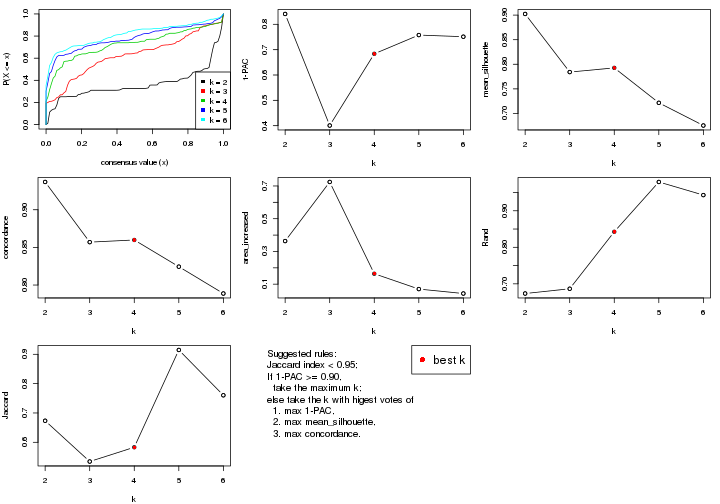

The numeric values for all these statistics can be obtained by `get_stats()`.

```r
get_stats(res)
```

```
#>   k 1-PAC mean_silhouette concordance area_increased  Rand Jaccard
#> 2 2 0.841           0.902       0.937         0.3635 0.673   0.673
#> 3 3 0.401           0.784       0.857         0.7245 0.687   0.535
#> 4 4 0.684           0.793       0.860         0.1638 0.842   0.583
#> 5 5 0.758           0.722       0.824         0.0701 0.979   0.915
#> 6 6 0.751           0.675       0.789         0.0429 0.943   0.760
```

`suggest_best_k()` suggests the best $k$ based on these statistics. The rules are as follows:

- All $k$ with Jaccard index larger than 0.95 are removed because increasing
  $k$ does not provide enough extra information. If all $k$ are removed, it is
  marked as no subgroup is detected.
- For all $k$ with 1-PAC score larger than 0.9, the maximal $k$ is taken as
  the best $k$, and other $k$ are marked as optional $k$.
- If it does not fit the second rule. The $k$ with the maximal vote of the
  highest 1-PAC score, highest mean silhouette, and highest concordance is
  taken as the best $k$.

```r
suggest_best_k(res)
```

```
#> [1] 4
```


Following shows the table of the partitions (You need to click the **show/hide
code output** link to see it). The membership matrix (columns with name `p*`)
is inferred by
[`clue::cl_consensus()`](https://www.rdocumentation.org/link/cl_consensus?package=clue)
function with the `SE` method. Basically the value in the membership matrix
represents the probability to belong to a certain group. The finall class
label for an item is determined with the group with highest probability it
belongs to.

In `get_classes()` function, the entropy is calculated from the membership
matrix and the silhouette score is calculated from the consensus matrix.


<script>
$( function() {
	$( '#tabs-SD-kmeans-get-classes' ).tabs();
} );
</script>
<div id='tabs-SD-kmeans-get-classes'>
<ul>
<li><a href='#tab-SD-kmeans-get-classes-1'>k = 2</a></li>
<li><a href='#tab-SD-kmeans-get-classes-2'>k = 3</a></li>
<li><a href='#tab-SD-kmeans-get-classes-3'>k = 4</a></li>
<li><a href='#tab-SD-kmeans-get-classes-4'>k = 5</a></li>
<li><a href='#tab-SD-kmeans-get-classes-5'>k = 6</a></li>
</ul>

<div id='tab-SD-kmeans-get-classes-1'>
<p><a id='tab-SD-kmeans-get-classes-1-a' style='color:#0366d6' href='#'>show/hide code output</a></p>
<pre><code class="r">cbind(get_classes(res, k = 2), get_membership(res, k = 2))
</code></pre>

<pre><code>#&gt;          class entropy silhouette    p1    p2
#&gt; GSM63448     1  0.2948      0.929 0.948 0.052
#&gt; GSM63449     1  0.3274      0.929 0.940 0.060
#&gt; GSM63423     1  0.3274      0.929 0.940 0.060
#&gt; GSM63425     1  0.0000      0.930 1.000 0.000
#&gt; GSM63437     1  0.3274      0.929 0.940 0.060
#&gt; GSM63453     1  0.9833      0.390 0.576 0.424
#&gt; GSM63431     1  0.3114      0.929 0.944 0.056
#&gt; GSM63450     1  0.9815      0.393 0.580 0.420
#&gt; GSM63428     1  0.3114      0.930 0.944 0.056
#&gt; GSM63432     1  0.0672      0.931 0.992 0.008
#&gt; GSM63458     1  0.0672      0.931 0.992 0.008
#&gt; GSM63434     1  0.0938      0.931 0.988 0.012
#&gt; GSM63435     1  0.0938      0.931 0.988 0.012
#&gt; GSM63442     1  0.0938      0.931 0.988 0.012
#&gt; GSM63451     1  0.0938      0.931 0.988 0.012
#&gt; GSM63422     1  0.0938      0.931 0.988 0.012
#&gt; GSM63438     1  0.0938      0.931 0.988 0.012
#&gt; GSM63439     1  0.0938      0.931 0.988 0.012
#&gt; GSM63461     1  0.0938      0.931 0.988 0.012
#&gt; GSM63463     1  0.0938      0.931 0.988 0.012
#&gt; GSM63430     1  0.0938      0.931 0.988 0.012
#&gt; GSM63446     1  0.0938      0.931 0.988 0.012
#&gt; GSM63429     1  0.1184      0.931 0.984 0.016
#&gt; GSM63445     1  0.0938      0.931 0.988 0.012
#&gt; GSM63447     1  0.7950      0.756 0.760 0.240
#&gt; GSM63459     2  0.0672      0.977 0.008 0.992
#&gt; GSM63464     2  0.0672      0.977 0.008 0.992
#&gt; GSM63469     2  0.0672      0.977 0.008 0.992
#&gt; GSM63470     2  0.0672      0.977 0.008 0.992
#&gt; GSM63436     1  0.3114      0.929 0.944 0.056
#&gt; GSM63443     2  0.6973      0.764 0.188 0.812
#&gt; GSM63465     1  0.8016      0.751 0.756 0.244
#&gt; GSM63444     2  0.0672      0.977 0.008 0.992
#&gt; GSM63456     2  0.1414      0.966 0.020 0.980
#&gt; GSM63462     1  0.1843      0.930 0.972 0.028
#&gt; GSM63424     1  0.0938      0.930 0.988 0.012
#&gt; GSM63440     1  0.0938      0.930 0.988 0.012
#&gt; GSM63433     1  0.3584      0.926 0.932 0.068
#&gt; GSM63466     2  0.0672      0.977 0.008 0.992
#&gt; GSM63426     1  0.3431      0.927 0.936 0.064
#&gt; GSM63468     1  0.6531      0.842 0.832 0.168
#&gt; GSM63452     2  0.0672      0.977 0.008 0.992
#&gt; GSM63441     1  0.3733      0.923 0.928 0.072
#&gt; GSM63454     1  0.6531      0.842 0.832 0.168
#&gt; GSM63455     1  0.3584      0.926 0.932 0.068
#&gt; GSM63460     2  0.0672      0.977 0.008 0.992
#&gt; GSM63467     1  0.3733      0.926 0.928 0.072
#&gt; GSM63421     1  0.3114      0.929 0.944 0.056
#&gt; GSM63427     1  0.3431      0.927 0.936 0.064
#&gt; GSM63457     1  0.3431      0.927 0.936 0.064
</code></pre>

<script>
$('#tab-SD-kmeans-get-classes-1-a').parent().next().next().hide();
$('#tab-SD-kmeans-get-classes-1-a').click(function(){
  $('#tab-SD-kmeans-get-classes-1-a').parent().next().next().toggle();
  return(false);
});
</script>
</div>

<div id='tab-SD-kmeans-get-classes-2'>
<p><a id='tab-SD-kmeans-get-classes-2-a' style='color:#0366d6' href='#'>show/hide code output</a></p>
<pre><code class="r">cbind(get_classes(res, k = 3), get_membership(res, k = 3))
</code></pre>

<pre><code>#&gt;          class entropy silhouette    p1    p2    p3
#&gt; GSM63448     1  0.4002      0.805 0.840 0.000 0.160
#&gt; GSM63449     1  0.4796      0.740 0.780 0.000 0.220
#&gt; GSM63423     1  0.4605      0.754 0.796 0.000 0.204
#&gt; GSM63425     1  0.4654      0.746 0.792 0.000 0.208
#&gt; GSM63437     1  0.4605      0.754 0.796 0.000 0.204
#&gt; GSM63453     1  0.5285      0.739 0.824 0.112 0.064
#&gt; GSM63431     1  0.3116      0.800 0.892 0.000 0.108
#&gt; GSM63450     1  0.5285      0.739 0.824 0.112 0.064
#&gt; GSM63428     1  0.4796      0.740 0.780 0.000 0.220
#&gt; GSM63432     3  0.4654      0.713 0.208 0.000 0.792
#&gt; GSM63458     1  0.3267      0.807 0.884 0.000 0.116
#&gt; GSM63434     3  0.0592      0.919 0.012 0.000 0.988
#&gt; GSM63435     3  0.0592      0.919 0.012 0.000 0.988
#&gt; GSM63442     3  0.0592      0.919 0.012 0.000 0.988
#&gt; GSM63451     3  0.0592      0.919 0.012 0.000 0.988
#&gt; GSM63422     3  0.0592      0.919 0.012 0.000 0.988
#&gt; GSM63438     3  0.0592      0.919 0.012 0.000 0.988
#&gt; GSM63439     3  0.0592      0.919 0.012 0.000 0.988
#&gt; GSM63461     3  0.0592      0.919 0.012 0.000 0.988
#&gt; GSM63463     3  0.0592      0.919 0.012 0.000 0.988
#&gt; GSM63430     3  0.0592      0.919 0.012 0.000 0.988
#&gt; GSM63446     3  0.0592      0.919 0.012 0.000 0.988
#&gt; GSM63429     1  0.5760      0.600 0.672 0.000 0.328
#&gt; GSM63445     3  0.3752      0.794 0.144 0.000 0.856
#&gt; GSM63447     1  0.7757      0.629 0.664 0.112 0.224
#&gt; GSM63459     2  0.0000      0.910 0.000 1.000 0.000
#&gt; GSM63464     2  0.0000      0.910 0.000 1.000 0.000
#&gt; GSM63469     2  0.0000      0.910 0.000 1.000 0.000
#&gt; GSM63470     2  0.0000      0.910 0.000 1.000 0.000
#&gt; GSM63436     1  0.4121      0.803 0.832 0.000 0.168
#&gt; GSM63443     2  0.5327      0.636 0.000 0.728 0.272
#&gt; GSM63465     1  0.8734      0.101 0.468 0.108 0.424
#&gt; GSM63444     2  0.2959      0.836 0.000 0.900 0.100
#&gt; GSM63456     2  0.6282      0.383 0.004 0.612 0.384
#&gt; GSM63462     3  0.5967      0.696 0.216 0.032 0.752
#&gt; GSM63424     3  0.4842      0.712 0.224 0.000 0.776
#&gt; GSM63440     3  0.4842      0.712 0.224 0.000 0.776
#&gt; GSM63433     1  0.3038      0.795 0.896 0.000 0.104
#&gt; GSM63466     2  0.0000      0.910 0.000 1.000 0.000
#&gt; GSM63426     1  0.3038      0.795 0.896 0.000 0.104
#&gt; GSM63468     1  0.6999      0.636 0.680 0.052 0.268
#&gt; GSM63452     2  0.0237      0.908 0.004 0.996 0.000
#&gt; GSM63441     1  0.6839      0.637 0.684 0.044 0.272
#&gt; GSM63454     1  0.6999      0.636 0.680 0.052 0.268
#&gt; GSM63455     1  0.3038      0.795 0.896 0.000 0.104
#&gt; GSM63460     2  0.0000      0.910 0.000 1.000 0.000
#&gt; GSM63467     1  0.4209      0.784 0.856 0.016 0.128
#&gt; GSM63421     1  0.3192      0.807 0.888 0.000 0.112
#&gt; GSM63427     1  0.3192      0.807 0.888 0.000 0.112
#&gt; GSM63457     1  0.3192      0.807 0.888 0.000 0.112
</code></pre>

<script>
$('#tab-SD-kmeans-get-classes-2-a').parent().next().next().hide();
$('#tab-SD-kmeans-get-classes-2-a').click(function(){
  $('#tab-SD-kmeans-get-classes-2-a').parent().next().next().toggle();
  return(false);
});
</script>
</div>

<div id='tab-SD-kmeans-get-classes-3'>
<p><a id='tab-SD-kmeans-get-classes-3-a' style='color:#0366d6' href='#'>show/hide code output</a></p>
<pre><code class="r">cbind(get_classes(res, k = 4), get_membership(res, k = 4))
</code></pre>

<pre><code>#&gt;          class entropy silhouette    p1    p2    p3    p4
#&gt; GSM63448     1  0.6483      0.666 0.584 0.000 0.092 0.324
#&gt; GSM63449     1  0.4992      0.769 0.772 0.000 0.096 0.132
#&gt; GSM63423     1  0.4992      0.769 0.772 0.000 0.096 0.132
#&gt; GSM63425     4  0.2300      0.831 0.028 0.000 0.048 0.924
#&gt; GSM63437     1  0.4992      0.769 0.772 0.000 0.096 0.132
#&gt; GSM63453     1  0.2489      0.683 0.912 0.000 0.020 0.068
#&gt; GSM63431     1  0.3913      0.768 0.824 0.000 0.028 0.148
#&gt; GSM63450     1  0.2670      0.679 0.904 0.000 0.024 0.072
#&gt; GSM63428     1  0.4992      0.769 0.772 0.000 0.096 0.132
#&gt; GSM63432     3  0.5436      0.404 0.356 0.000 0.620 0.024
#&gt; GSM63458     1  0.5364      0.710 0.652 0.000 0.028 0.320
#&gt; GSM63434     3  0.0188      0.927 0.004 0.000 0.996 0.000
#&gt; GSM63435     3  0.0376      0.928 0.004 0.000 0.992 0.004
#&gt; GSM63442     3  0.0376      0.928 0.004 0.000 0.992 0.004
#&gt; GSM63451     3  0.0188      0.927 0.004 0.000 0.996 0.000
#&gt; GSM63422     3  0.0376      0.928 0.004 0.000 0.992 0.004
#&gt; GSM63438     3  0.0376      0.928 0.004 0.000 0.992 0.004
#&gt; GSM63439     3  0.0188      0.926 0.000 0.000 0.996 0.004
#&gt; GSM63461     3  0.0376      0.928 0.004 0.000 0.992 0.004
#&gt; GSM63463     3  0.0188      0.927 0.004 0.000 0.996 0.000
#&gt; GSM63430     3  0.0188      0.926 0.000 0.000 0.996 0.004
#&gt; GSM63446     3  0.0000      0.926 0.000 0.000 1.000 0.000
#&gt; GSM63429     4  0.2142      0.832 0.016 0.000 0.056 0.928
#&gt; GSM63445     3  0.2759      0.859 0.044 0.000 0.904 0.052
#&gt; GSM63447     4  0.3501      0.831 0.044 0.040 0.032 0.884
#&gt; GSM63459     2  0.0000      0.918 0.000 1.000 0.000 0.000
#&gt; GSM63464     2  0.0000      0.918 0.000 1.000 0.000 0.000
#&gt; GSM63469     2  0.0000      0.918 0.000 1.000 0.000 0.000
#&gt; GSM63470     2  0.0000      0.918 0.000 1.000 0.000 0.000
#&gt; GSM63436     1  0.5220      0.663 0.632 0.000 0.016 0.352
#&gt; GSM63443     2  0.4795      0.582 0.012 0.696 0.292 0.000
#&gt; GSM63465     4  0.4003      0.817 0.028 0.036 0.080 0.856
#&gt; GSM63444     2  0.1059      0.904 0.000 0.972 0.012 0.016
#&gt; GSM63456     2  0.5542      0.480 0.012 0.644 0.328 0.016
#&gt; GSM63462     3  0.5655      0.425 0.028 0.008 0.648 0.316
#&gt; GSM63424     4  0.3450      0.749 0.008 0.000 0.156 0.836
#&gt; GSM63440     4  0.3450      0.749 0.008 0.000 0.156 0.836
#&gt; GSM63433     4  0.4464      0.686 0.208 0.000 0.024 0.768
#&gt; GSM63466     2  0.0000      0.918 0.000 1.000 0.000 0.000
#&gt; GSM63426     4  0.4464      0.686 0.208 0.000 0.024 0.768
#&gt; GSM63468     4  0.2762      0.844 0.028 0.012 0.048 0.912
#&gt; GSM63452     2  0.0469      0.913 0.012 0.988 0.000 0.000
#&gt; GSM63441     4  0.2814      0.843 0.032 0.008 0.052 0.908
#&gt; GSM63454     4  0.2762      0.844 0.028 0.012 0.048 0.912
#&gt; GSM63455     4  0.4426      0.688 0.204 0.000 0.024 0.772
#&gt; GSM63460     2  0.0000      0.918 0.000 1.000 0.000 0.000
#&gt; GSM63467     4  0.4998      0.717 0.192 0.008 0.040 0.760
#&gt; GSM63421     1  0.5127      0.667 0.632 0.000 0.012 0.356
#&gt; GSM63427     1  0.5127      0.667 0.632 0.000 0.012 0.356
#&gt; GSM63457     1  0.5127      0.667 0.632 0.000 0.012 0.356
</code></pre>

<script>
$('#tab-SD-kmeans-get-classes-3-a').parent().next().next().hide();
$('#tab-SD-kmeans-get-classes-3-a').click(function(){
  $('#tab-SD-kmeans-get-classes-3-a').parent().next().next().toggle();
  return(false);
});
</script>
</div>

<div id='tab-SD-kmeans-get-classes-4'>
<p><a id='tab-SD-kmeans-get-classes-4-a' style='color:#0366d6' href='#'>show/hide code output</a></p>
<pre><code class="r">cbind(get_classes(res, k = 5), get_membership(res, k = 5))
</code></pre>

<pre><code>#&gt;          class entropy silhouette    p1    p2    p3    p4 p5
#&gt; GSM63448     1  0.4808     0.6103 0.748 0.000 0.052 0.172 NA
#&gt; GSM63449     1  0.1907     0.6839 0.928 0.000 0.044 0.028 NA
#&gt; GSM63423     1  0.1907     0.6839 0.928 0.000 0.044 0.028 NA
#&gt; GSM63425     4  0.4202     0.7103 0.012 0.000 0.016 0.744 NA
#&gt; GSM63437     1  0.1907     0.6839 0.928 0.000 0.044 0.028 NA
#&gt; GSM63453     1  0.4763     0.5272 0.616 0.000 0.004 0.020 NA
#&gt; GSM63431     1  0.1329     0.6779 0.956 0.000 0.004 0.032 NA
#&gt; GSM63450     1  0.4763     0.5272 0.616 0.000 0.004 0.020 NA
#&gt; GSM63428     1  0.1907     0.6839 0.928 0.000 0.044 0.028 NA
#&gt; GSM63432     1  0.4816    -0.0574 0.500 0.000 0.484 0.008 NA
#&gt; GSM63458     1  0.6080     0.4756 0.572 0.000 0.000 0.200 NA
#&gt; GSM63434     3  0.1197     0.9128 0.000 0.000 0.952 0.000 NA
#&gt; GSM63435     3  0.0613     0.9253 0.008 0.000 0.984 0.004 NA
#&gt; GSM63442     3  0.0613     0.9253 0.008 0.000 0.984 0.004 NA
#&gt; GSM63451     3  0.1121     0.9132 0.000 0.000 0.956 0.000 NA
#&gt; GSM63422     3  0.0613     0.9253 0.008 0.000 0.984 0.004 NA
#&gt; GSM63438     3  0.0162     0.9268 0.000 0.000 0.996 0.004 NA
#&gt; GSM63439     3  0.0566     0.9250 0.000 0.000 0.984 0.004 NA
#&gt; GSM63461     3  0.0324     0.9260 0.004 0.000 0.992 0.004 NA
#&gt; GSM63463     3  0.0162     0.9268 0.000 0.000 0.996 0.004 NA
#&gt; GSM63430     3  0.0451     0.9258 0.000 0.000 0.988 0.004 NA
#&gt; GSM63446     3  0.1430     0.9070 0.000 0.000 0.944 0.004 NA
#&gt; GSM63429     4  0.3351     0.7505 0.004 0.000 0.020 0.828 NA
#&gt; GSM63445     3  0.4012     0.7765 0.044 0.000 0.820 0.032 NA
#&gt; GSM63447     4  0.2896     0.7820 0.036 0.040 0.012 0.896 NA
#&gt; GSM63459     2  0.0880     0.8953 0.000 0.968 0.000 0.000 NA
#&gt; GSM63464     2  0.0290     0.8948 0.000 0.992 0.000 0.000 NA
#&gt; GSM63469     2  0.0880     0.8953 0.000 0.968 0.000 0.000 NA
#&gt; GSM63470     2  0.0880     0.8953 0.000 0.968 0.000 0.000 NA
#&gt; GSM63436     1  0.6315     0.4864 0.528 0.000 0.000 0.212 NA
#&gt; GSM63443     2  0.5144     0.5252 0.000 0.640 0.292 0.000 NA
#&gt; GSM63465     4  0.3675     0.7674 0.032 0.036 0.020 0.860 NA
#&gt; GSM63444     2  0.2378     0.8588 0.000 0.908 0.012 0.016 NA
#&gt; GSM63456     2  0.5727     0.5890 0.000 0.648 0.232 0.016 NA
#&gt; GSM63462     3  0.6565     0.2527 0.020 0.000 0.516 0.328 NA
#&gt; GSM63424     4  0.4509     0.6921 0.000 0.000 0.048 0.716 NA
#&gt; GSM63440     4  0.4481     0.6939 0.000 0.000 0.048 0.720 NA
#&gt; GSM63433     4  0.5273     0.5897 0.156 0.000 0.000 0.680 NA
#&gt; GSM63466     2  0.0000     0.8956 0.000 1.000 0.000 0.000 NA
#&gt; GSM63426     4  0.5273     0.5897 0.156 0.000 0.000 0.680 NA
#&gt; GSM63468     4  0.1708     0.7879 0.032 0.004 0.016 0.944 NA
#&gt; GSM63452     2  0.1410     0.8853 0.000 0.940 0.000 0.000 NA
#&gt; GSM63441     4  0.1568     0.7876 0.036 0.000 0.020 0.944 NA
#&gt; GSM63454     4  0.1708     0.7879 0.032 0.004 0.016 0.944 NA
#&gt; GSM63455     4  0.5271     0.5950 0.152 0.000 0.000 0.680 NA
#&gt; GSM63460     2  0.0162     0.8954 0.000 0.996 0.000 0.000 NA
#&gt; GSM63467     4  0.4380     0.6975 0.120 0.004 0.008 0.788 NA
#&gt; GSM63421     1  0.6312     0.4895 0.524 0.000 0.000 0.200 NA
#&gt; GSM63427     1  0.6312     0.4895 0.524 0.000 0.000 0.200 NA
#&gt; GSM63457     1  0.6312     0.4895 0.524 0.000 0.000 0.200 NA
</code></pre>

<script>
$('#tab-SD-kmeans-get-classes-4-a').parent().next().next().hide();
$('#tab-SD-kmeans-get-classes-4-a').click(function(){
  $('#tab-SD-kmeans-get-classes-4-a').parent().next().next().toggle();
  return(false);
});
</script>
</div>

<div id='tab-SD-kmeans-get-classes-5'>
<p><a id='tab-SD-kmeans-get-classes-5-a' style='color:#0366d6' href='#'>show/hide code output</a></p>
<pre><code class="r">cbind(get_classes(res, k = 6), get_membership(res, k = 6))
</code></pre>

<pre><code>#&gt;          class entropy silhouette    p1    p2    p3    p4    p5    p6
#&gt; GSM63448     1  0.3608     0.5532 0.820 0.000 0.032 0.120 0.012 0.016
#&gt; GSM63449     1  0.1245     0.6578 0.952 0.000 0.032 0.016 0.000 0.000
#&gt; GSM63423     1  0.1245     0.6578 0.952 0.000 0.032 0.016 0.000 0.000
#&gt; GSM63425     6  0.4374     0.8551 0.004 0.000 0.000 0.448 0.016 0.532
#&gt; GSM63437     1  0.1245     0.6578 0.952 0.000 0.032 0.016 0.000 0.000
#&gt; GSM63453     1  0.5880     0.3766 0.488 0.000 0.000 0.012 0.352 0.148
#&gt; GSM63431     1  0.1594     0.5915 0.932 0.000 0.000 0.016 0.052 0.000
#&gt; GSM63450     1  0.5880     0.3766 0.488 0.000 0.000 0.012 0.352 0.148
#&gt; GSM63428     1  0.1245     0.6578 0.952 0.000 0.032 0.016 0.000 0.000
#&gt; GSM63432     1  0.4505     0.3768 0.620 0.000 0.348 0.008 0.008 0.016
#&gt; GSM63458     1  0.7044    -0.2629 0.472 0.000 0.004 0.112 0.252 0.160
#&gt; GSM63434     3  0.2547     0.8662 0.000 0.000 0.880 0.004 0.036 0.080
#&gt; GSM63435     3  0.0363     0.8973 0.000 0.000 0.988 0.000 0.000 0.012
#&gt; GSM63442     3  0.0363     0.8973 0.000 0.000 0.988 0.000 0.000 0.012
#&gt; GSM63451     3  0.2231     0.8678 0.000 0.000 0.900 0.004 0.028 0.068
#&gt; GSM63422     3  0.0363     0.8973 0.000 0.000 0.988 0.000 0.000 0.012
#&gt; GSM63438     3  0.0551     0.8977 0.000 0.000 0.984 0.004 0.008 0.004
#&gt; GSM63439     3  0.0964     0.8950 0.000 0.000 0.968 0.004 0.012 0.016
#&gt; GSM63461     3  0.0146     0.8987 0.000 0.000 0.996 0.004 0.000 0.000
#&gt; GSM63463     3  0.0146     0.8987 0.000 0.000 0.996 0.004 0.000 0.000
#&gt; GSM63430     3  0.0862     0.8954 0.000 0.000 0.972 0.004 0.008 0.016
#&gt; GSM63446     3  0.3174     0.8293 0.000 0.000 0.840 0.012 0.040 0.108
#&gt; GSM63429     4  0.3620    -0.4585 0.000 0.000 0.000 0.648 0.000 0.352
#&gt; GSM63445     3  0.3919     0.7585 0.008 0.000 0.792 0.016 0.140 0.044
#&gt; GSM63447     4  0.2325     0.5222 0.000 0.044 0.000 0.900 0.008 0.048
#&gt; GSM63459     2  0.1572     0.8307 0.000 0.936 0.000 0.000 0.036 0.028
#&gt; GSM63464     2  0.1003     0.8291 0.000 0.964 0.000 0.000 0.016 0.020
#&gt; GSM63469     2  0.1572     0.8307 0.000 0.936 0.000 0.000 0.036 0.028
#&gt; GSM63470     2  0.1572     0.8307 0.000 0.936 0.000 0.000 0.036 0.028
#&gt; GSM63436     5  0.5898     0.9592 0.324 0.000 0.000 0.148 0.512 0.016
#&gt; GSM63443     2  0.6285     0.4341 0.000 0.540 0.272 0.004 0.048 0.136
#&gt; GSM63465     4  0.4030     0.3722 0.000 0.044 0.004 0.800 0.052 0.100
#&gt; GSM63444     2  0.5038     0.6923 0.000 0.728 0.016 0.056 0.060 0.140
#&gt; GSM63456     2  0.7131     0.4352 0.000 0.496 0.232 0.020 0.092 0.160
#&gt; GSM63462     3  0.7143     0.0928 0.000 0.004 0.404 0.336 0.116 0.140
#&gt; GSM63424     6  0.4279     0.9246 0.000 0.000 0.012 0.436 0.004 0.548
#&gt; GSM63440     6  0.4284     0.9275 0.000 0.000 0.012 0.440 0.004 0.544
#&gt; GSM63433     4  0.4746     0.5637 0.040 0.000 0.004 0.696 0.228 0.032
#&gt; GSM63466     2  0.0551     0.8313 0.000 0.984 0.000 0.004 0.004 0.008
#&gt; GSM63426     4  0.4746     0.5637 0.040 0.000 0.004 0.696 0.228 0.032
#&gt; GSM63468     4  0.0146     0.6180 0.004 0.000 0.000 0.996 0.000 0.000
#&gt; GSM63452     2  0.2164     0.8194 0.000 0.900 0.000 0.000 0.068 0.032
#&gt; GSM63441     4  0.0405     0.6134 0.004 0.000 0.000 0.988 0.000 0.008
#&gt; GSM63454     4  0.0291     0.6182 0.004 0.000 0.000 0.992 0.000 0.004
#&gt; GSM63455     4  0.4813     0.5600 0.040 0.000 0.004 0.692 0.228 0.036
#&gt; GSM63460     2  0.1148     0.8280 0.000 0.960 0.000 0.004 0.016 0.020
#&gt; GSM63467     4  0.3428     0.6150 0.028 0.004 0.000 0.840 0.084 0.044
#&gt; GSM63421     5  0.5532     0.9756 0.332 0.000 0.000 0.132 0.532 0.004
#&gt; GSM63427     5  0.5719     0.9710 0.320 0.000 0.000 0.136 0.532 0.012
#&gt; GSM63457     5  0.5532     0.9756 0.332 0.000 0.000 0.132 0.532 0.004
</code></pre>

<script>
$('#tab-SD-kmeans-get-classes-5-a').parent().next().next().hide();
$('#tab-SD-kmeans-get-classes-5-a').click(function(){
  $('#tab-SD-kmeans-get-classes-5-a').parent().next().next().toggle();
  return(false);
});
</script>
</div>
</div>

Heatmaps for the consensus matrix. It visualizes the probability of two
samples to be in a same group.


<script>
$( function() {
	$( '#tabs-SD-kmeans-consensus-heatmap' ).tabs();
} );
</script>
<div id='tabs-SD-kmeans-consensus-heatmap'>
<ul>
<li><a href='#tab-SD-kmeans-consensus-heatmap-1'>k = 2</a></li>
<li><a href='#tab-SD-kmeans-consensus-heatmap-2'>k = 3</a></li>
<li><a href='#tab-SD-kmeans-consensus-heatmap-3'>k = 4</a></li>
<li><a href='#tab-SD-kmeans-consensus-heatmap-4'>k = 5</a></li>
<li><a href='#tab-SD-kmeans-consensus-heatmap-5'>k = 6</a></li>
</ul>
<div id='tab-SD-kmeans-consensus-heatmap-1'>
<pre><code class="r">consensus_heatmap(res, k = 2)
</code></pre>

<p>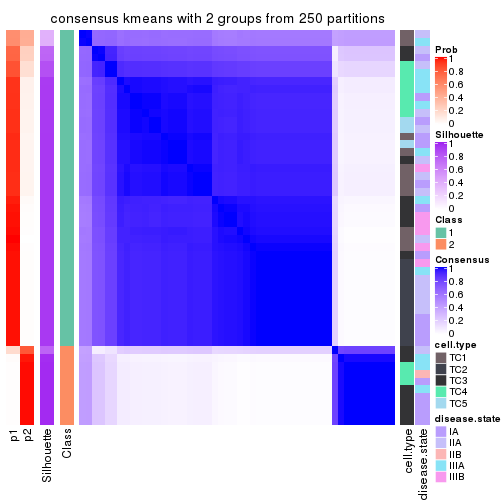</p>

</div>
<div id='tab-SD-kmeans-consensus-heatmap-2'>
<pre><code class="r">consensus_heatmap(res, k = 3)
</code></pre>

<p>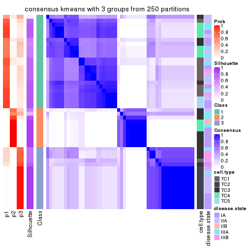</p>

</div>
<div id='tab-SD-kmeans-consensus-heatmap-3'>
<pre><code class="r">consensus_heatmap(res, k = 4)
</code></pre>

<p>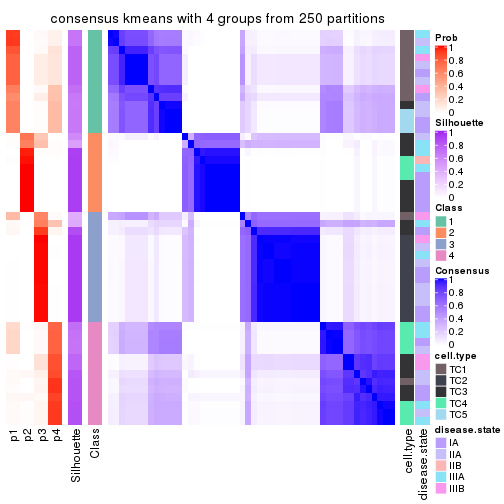</p>

</div>
<div id='tab-SD-kmeans-consensus-heatmap-4'>
<pre><code class="r">consensus_heatmap(res, k = 5)
</code></pre>

<p>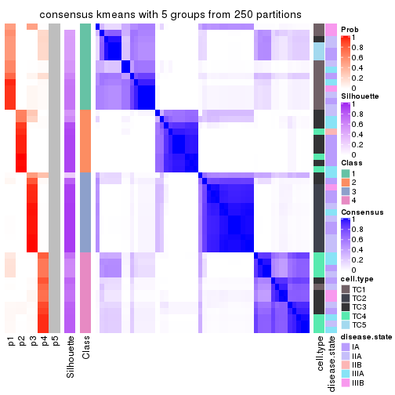</p>

</div>
<div id='tab-SD-kmeans-consensus-heatmap-5'>
<pre><code class="r">consensus_heatmap(res, k = 6)
</code></pre>

<p>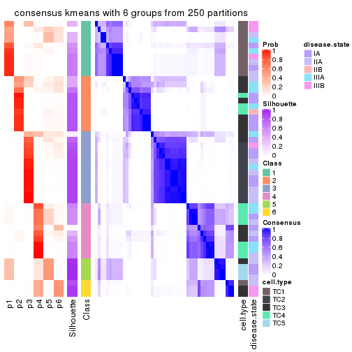</p>

</div>
</div>

Heatmaps for the membership of samples in all partitions to see how consistent they are:


<script>
$( function() {
	$( '#tabs-SD-kmeans-membership-heatmap' ).tabs();
} );
</script>
<div id='tabs-SD-kmeans-membership-heatmap'>
<ul>
<li><a href='#tab-SD-kmeans-membership-heatmap-1'>k = 2</a></li>
<li><a href='#tab-SD-kmeans-membership-heatmap-2'>k = 3</a></li>
<li><a href='#tab-SD-kmeans-membership-heatmap-3'>k = 4</a></li>
<li><a href='#tab-SD-kmeans-membership-heatmap-4'>k = 5</a></li>
<li><a href='#tab-SD-kmeans-membership-heatmap-5'>k = 6</a></li>
</ul>
<div id='tab-SD-kmeans-membership-heatmap-1'>
<pre><code class="r">membership_heatmap(res, k = 2)
</code></pre>

<p>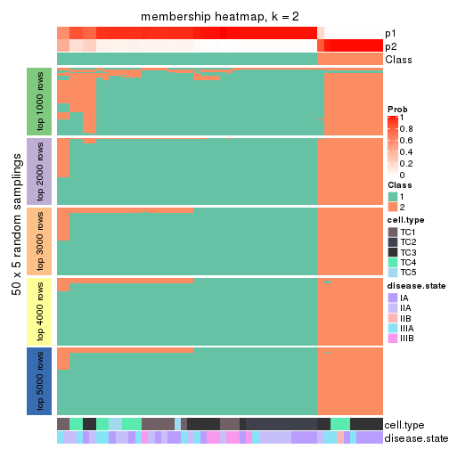</p>

</div>
<div id='tab-SD-kmeans-membership-heatmap-2'>
<pre><code class="r">membership_heatmap(res, k = 3)
</code></pre>

<p>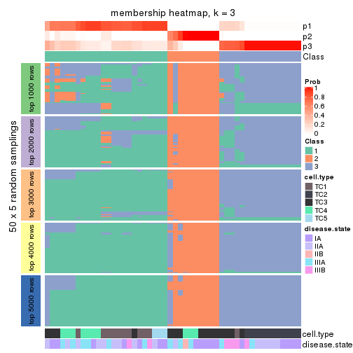</p>

</div>
<div id='tab-SD-kmeans-membership-heatmap-3'>
<pre><code class="r">membership_heatmap(res, k = 4)
</code></pre>

<p>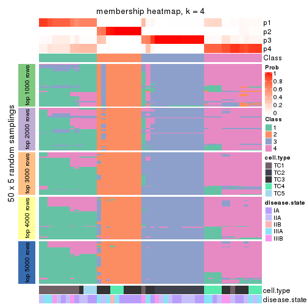</p>

</div>
<div id='tab-SD-kmeans-membership-heatmap-4'>
<pre><code class="r">membership_heatmap(res, k = 5)
</code></pre>

<p>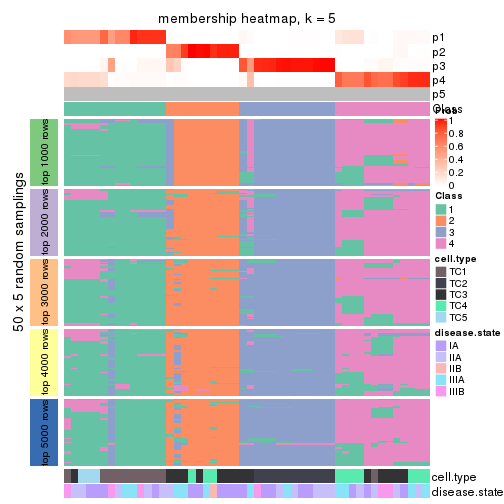</p>

</div>
<div id='tab-SD-kmeans-membership-heatmap-5'>
<pre><code class="r">membership_heatmap(res, k = 6)
</code></pre>

<p>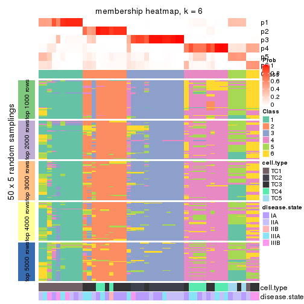</p>

</div>
</div>

As soon as we have had the classes for columns, we can look for signatures
which are significantly different between classes which can be candidate marks
for certain classes. Following are the heatmaps for signatures.


Signature heatmaps where rows are scaled:


<script>
$( function() {
	$( '#tabs-SD-kmeans-get-signatures' ).tabs();
} );
</script>
<div id='tabs-SD-kmeans-get-signatures'>
<ul>
<li><a href='#tab-SD-kmeans-get-signatures-1'>k = 2</a></li>
<li><a href='#tab-SD-kmeans-get-signatures-2'>k = 3</a></li>
<li><a href='#tab-SD-kmeans-get-signatures-3'>k = 4</a></li>
<li><a href='#tab-SD-kmeans-get-signatures-4'>k = 5</a></li>
<li><a href='#tab-SD-kmeans-get-signatures-5'>k = 6</a></li>
</ul>
<div id='tab-SD-kmeans-get-signatures-1'>
<pre><code class="r">get_signatures(res, k = 2)
</code></pre>

<p>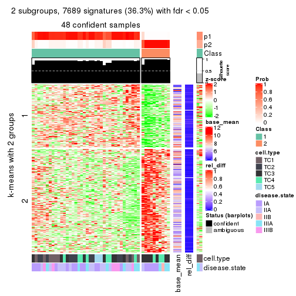</p>

</div>
<div id='tab-SD-kmeans-get-signatures-2'>
<pre><code class="r">get_signatures(res, k = 3)
</code></pre>

<p>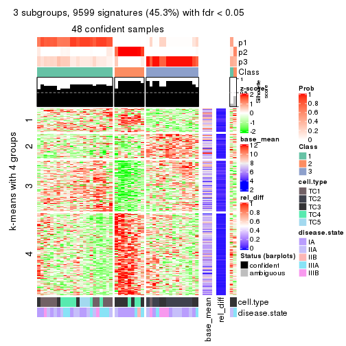</p>

</div>
<div id='tab-SD-kmeans-get-signatures-3'>
<pre><code class="r">get_signatures(res, k = 4)
</code></pre>

<p>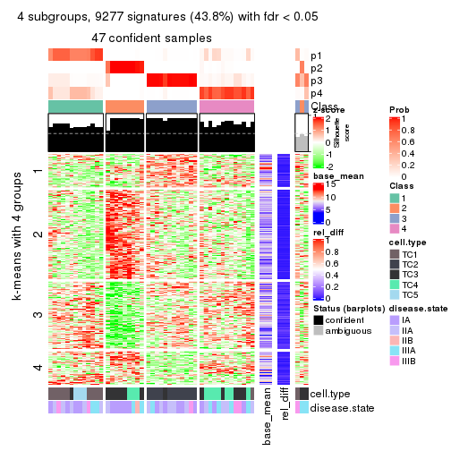</p>

</div>
<div id='tab-SD-kmeans-get-signatures-4'>
<pre><code class="r">get_signatures(res, k = 5)
</code></pre>

<p>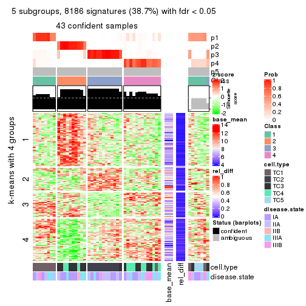</p>

</div>
<div id='tab-SD-kmeans-get-signatures-5'>
<pre><code class="r">get_signatures(res, k = 6)
</code></pre>

<p>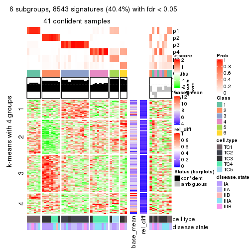</p>

</div>
</div>


Signature heatmaps where rows are not scaled:


<script>
$( function() {
	$( '#tabs-SD-kmeans-get-signatures-no-scale' ).tabs();
} );
</script>
<div id='tabs-SD-kmeans-get-signatures-no-scale'>
<ul>
<li><a href='#tab-SD-kmeans-get-signatures-no-scale-1'>k = 2</a></li>
<li><a href='#tab-SD-kmeans-get-signatures-no-scale-2'>k = 3</a></li>
<li><a href='#tab-SD-kmeans-get-signatures-no-scale-3'>k = 4</a></li>
<li><a href='#tab-SD-kmeans-get-signatures-no-scale-4'>k = 5</a></li>
<li><a href='#tab-SD-kmeans-get-signatures-no-scale-5'>k = 6</a></li>
</ul>
<div id='tab-SD-kmeans-get-signatures-no-scale-1'>
<pre><code class="r">get_signatures(res, k = 2, scale_rows = FALSE)
</code></pre>

<p>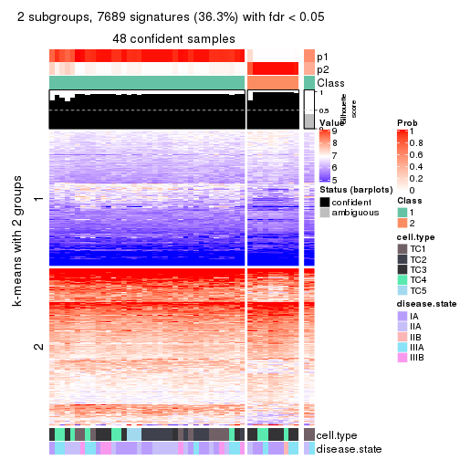</p>

</div>
<div id='tab-SD-kmeans-get-signatures-no-scale-2'>
<pre><code class="r">get_signatures(res, k = 3, scale_rows = FALSE)
</code></pre>

<p>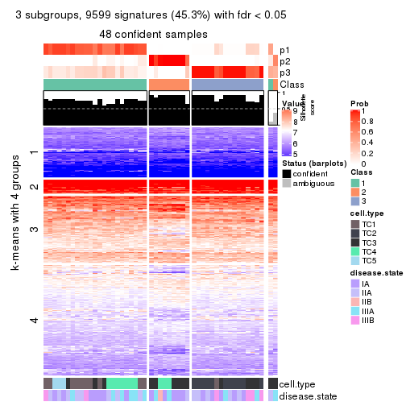</p>

</div>
<div id='tab-SD-kmeans-get-signatures-no-scale-3'>
<pre><code class="r">get_signatures(res, k = 4, scale_rows = FALSE)
</code></pre>

<p>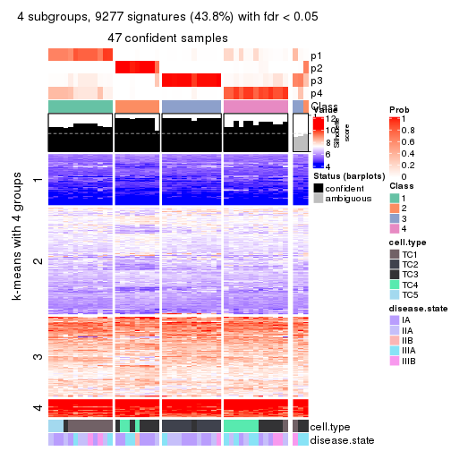</p>

</div>
<div id='tab-SD-kmeans-get-signatures-no-scale-4'>
<pre><code class="r">get_signatures(res, k = 5, scale_rows = FALSE)
</code></pre>

<p>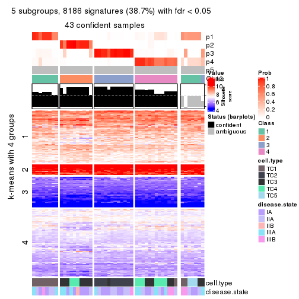</p>

</div>
<div id='tab-SD-kmeans-get-signatures-no-scale-5'>
<pre><code class="r">get_signatures(res, k = 6, scale_rows = FALSE)
</code></pre>

<p>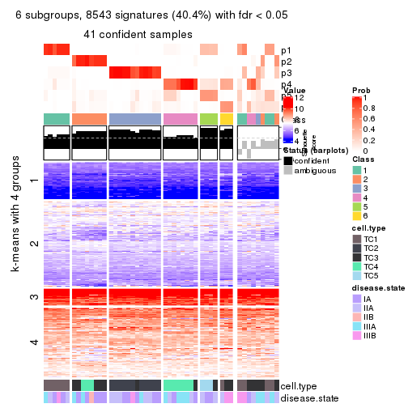</p>

</div>
</div>


Compare the overlap of signatures from different k:

```r
compare_signatures(res)
```

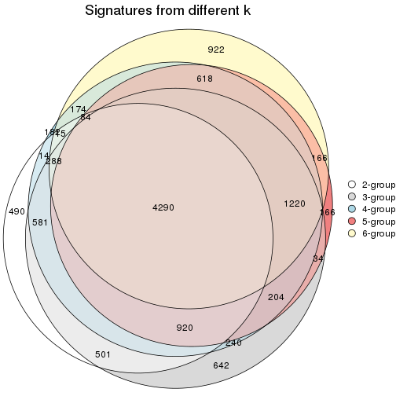

`get_signature()` returns a data frame invisibly. TO get the list of signatures, the function
call should be assigned to a variable explicitly. In following code, if `plot` argument is set
to `FALSE`, no heatmap is plotted while only the differential analysis is performed.

```r
# code only for demonstration
tb = get_signature(res, k = ..., plot = FALSE)
```

An example of the output of `tb` is:

```
#>   which_row         fdr    mean_1    mean_2 scaled_mean_1 scaled_mean_2 km
#> 1        38 0.042760348  8.373488  9.131774    -0.5533452     0.5164555  1
#> 2        40 0.018707592  7.106213  8.469186    -0.6173731     0.5762149  1
#> 3        55 0.019134737 10.221463 11.207825    -0.6159697     0.5749050  1
#> 4        59 0.006059896  5.921854  7.869574    -0.6899429     0.6439467  1
#> 5        60 0.018055526  8.928898 10.211722    -0.6204761     0.5791110  1
#> 6        98 0.009384629 15.714769 14.887706     0.6635654    -0.6193277  2
...
```

The columns in `tb` are:

1. `which_row`: row indices corresponding to the input matrix.
2. `fdr`: FDR for the differential test. 
3. `mean_x`: The mean value in group x.
4. `scaled_mean_x`: The mean value in group x after rows are scaled.
5. `km`: Row groups if k-means clustering is applied to rows.


UMAP plot which shows how samples are separated.


<script>
$( function() {
	$( '#tabs-SD-kmeans-dimension-reduction' ).tabs();
} );
</script>
<div id='tabs-SD-kmeans-dimension-reduction'>
<ul>
<li><a href='#tab-SD-kmeans-dimension-reduction-1'>k = 2</a></li>
<li><a href='#tab-SD-kmeans-dimension-reduction-2'>k = 3</a></li>
<li><a href='#tab-SD-kmeans-dimension-reduction-3'>k = 4</a></li>
<li><a href='#tab-SD-kmeans-dimension-reduction-4'>k = 5</a></li>
<li><a href='#tab-SD-kmeans-dimension-reduction-5'>k = 6</a></li>
</ul>
<div id='tab-SD-kmeans-dimension-reduction-1'>
<pre><code class="r">dimension_reduction(res, k = 2, method = &quot;UMAP&quot;)
</code></pre>

<p>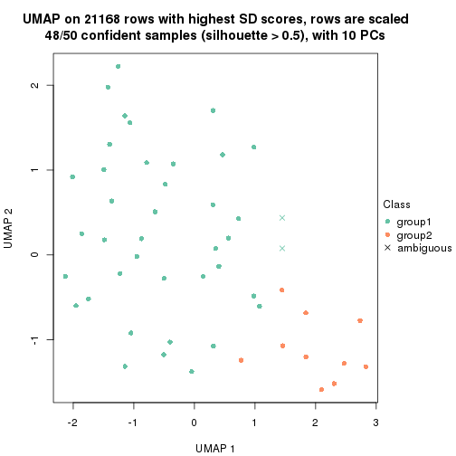</p>

</div>
<div id='tab-SD-kmeans-dimension-reduction-2'>
<pre><code class="r">dimension_reduction(res, k = 3, method = &quot;UMAP&quot;)
</code></pre>

<p>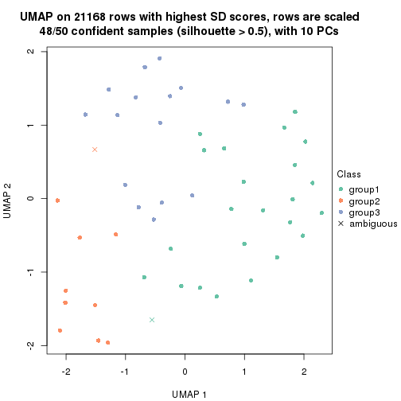</p>

</div>
<div id='tab-SD-kmeans-dimension-reduction-3'>
<pre><code class="r">dimension_reduction(res, k = 4, method = &quot;UMAP&quot;)
</code></pre>

<p>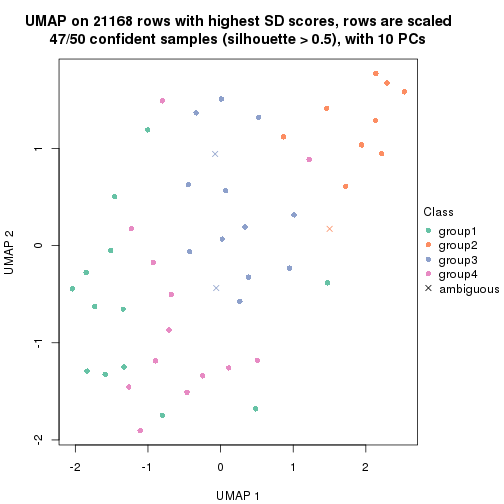</p>

</div>
<div id='tab-SD-kmeans-dimension-reduction-4'>
<pre><code class="r">dimension_reduction(res, k = 5, method = &quot;UMAP&quot;)
</code></pre>

<p>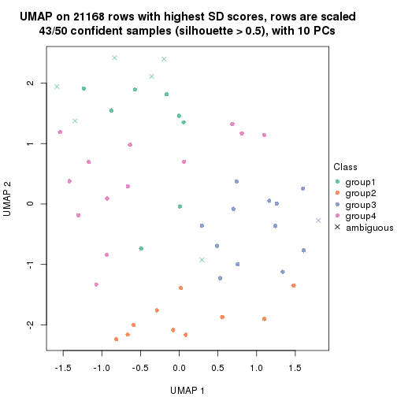</p>

</div>
<div id='tab-SD-kmeans-dimension-reduction-5'>
<pre><code class="r">dimension_reduction(res, k = 6, method = &quot;UMAP&quot;)
</code></pre>

<p>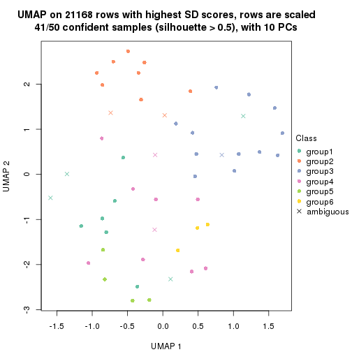</p>

</div>
</div>


Following heatmap shows how subgroups are split when increasing `k`:

```r
collect_classes(res)
```

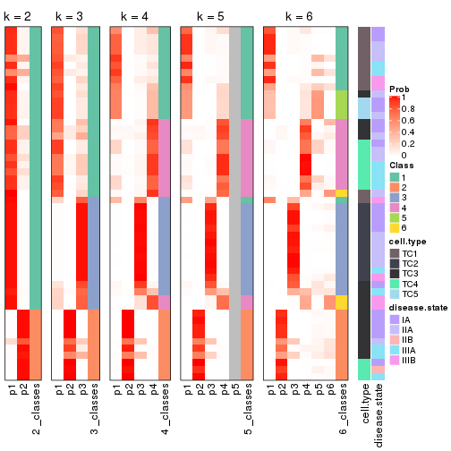


Test correlation between subgroups and known annotations. If the known
annotation is numeric, one-way ANOVA test is applied, and if the known
annotation is discrete, chi-squared contingency table test is applied.

```r
test_to_known_factors(res)
```

```
#>            n cell.type(p) disease.state(p) k
#> SD:kmeans 48     1.32e-02           0.0832 2
#> SD:kmeans 48     3.04e-07           0.1950 3
#> SD:kmeans 47     2.68e-12           0.5208 4
#> SD:kmeans 43     4.16e-13           0.6082 5
#> SD:kmeans 41     3.19e-15           0.0876 6
```


If matrix rows can be associated to genes, consider to use `functional_enrichment(res,
...)` to perform function enrichment for the signature genes. See [this vignette](http://bioconductor.org/packages/devel/bioc/vignettes/cola/inst/doc/functional_enrichment.html) for more detailed explanations.


 

---------------------------------------------------


### SD:skmeans


The object with results only for a single top-value method and a single partition method 
can be extracted as:

```r
res = res_list["SD", "skmeans"]
# you can also extract it by
# res = res_list["SD:skmeans"]
```

A summary of `res` and all the functions that can be applied to it:

```r
res
```

```
#> A 'ConsensusPartition' object with k = 2, 3, 4, 5, 6.
#>   On a matrix with 21168 rows and 50 columns.
#>   Top rows (1000, 2000, 3000, 4000, 5000) are extracted by 'SD' method.
#>   Subgroups are detected by 'skmeans' method.
#>   Performed in total 1250 partitions by row resampling.
#>   Best k for subgroups seems to be 2.
#> 
#> Following methods can be applied to this 'ConsensusPartition' object:
#>  [1] "cola_report"             "collect_classes"         "collect_plots"          
#>  [4] "collect_stats"           "colnames"                "compare_signatures"     
#>  [7] "consensus_heatmap"       "dimension_reduction"     "functional_enrichment"  
#> [10] "get_anno_col"            "get_anno"                "get_classes"            
#> [13] "get_consensus"           "get_matrix"              "get_membership"         
#> [16] "get_param"               "get_signatures"          "get_stats"              
#> [19] "is_best_k"               "is_stable_k"             "membership_heatmap"     
#> [22] "ncol"                    "nrow"                    "plot_ecdf"              
#> [25] "rownames"                "select_partition_number" "show"                   
#> [28] "suggest_best_k"          "test_to_known_factors"
```

`collect_plots()` function collects all the plots made from `res` for all `k` (number of partitions)
into one single page to provide an easy and fast comparison between different `k`.

```r
collect_plots(res)
```

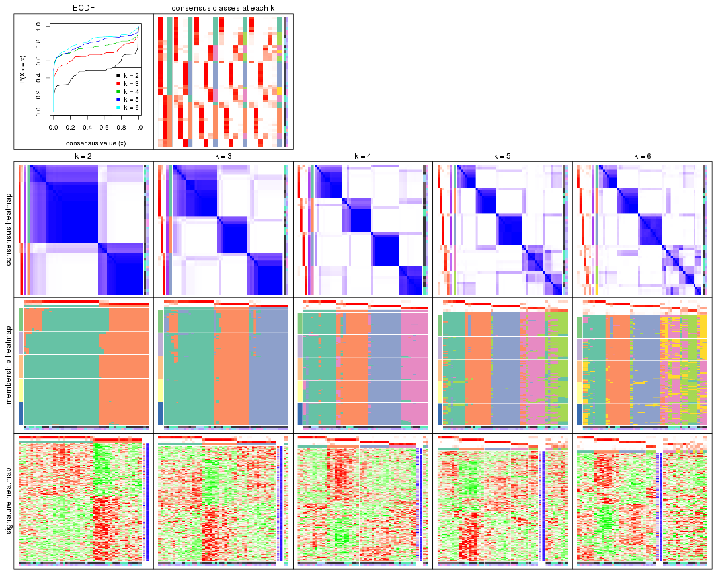

The plots are:

- The first row: a plot of the ECDF (empirical cumulative distribution
  function) curves of the consensus matrix for each `k` and the heatmap of
  predicted classes for each `k`.
- The second row: heatmaps of the consensus matrix for each `k`.
- The third row: heatmaps of the membership matrix for each `k`.
- The fouth row: heatmaps of the signatures for each `k`.

All the plots in panels can be made by individual functions and they are
plotted later in this section.

`select_partition_number()` produces several plots showing different
statistics for choosing "optimized" `k`. There are following statistics:

- ECDF curves of the consensus matrix for each `k`;
- 1-PAC. [The PAC
  score](https://en.wikipedia.org/wiki/Consensus_clustering#Over-interpretation_potential_of_consensus_clustering)
  measures the proportion of the ambiguous subgrouping.
- Mean silhouette score.
- Concordance. The mean probability of fiting the consensus class ids in all
  partitions.
- Area increased. Denote $A_k$ as the area under the ECDF curve for current
  `k`, the area increased is defined as $A_k - A_{k-1}$.
- Rand index. The percent of pairs of samples that are both in a same cluster
  or both are not in a same cluster in the partition of k and k-1.
- Jaccard index. The ratio of pairs of samples are both in a same cluster in
  the partition of k and k-1 and the pairs of samples are both in a same
  cluster in the partition k or k-1.

The detailed explanations of these statistics can be found in [the _cola_
vignette](http://bioconductor.org/packages/devel/bioc/vignettes/cola/inst/doc/cola.html#toc_13).

Generally speaking, lower PAC score, higher mean silhouette score or higher
concordance corresponds to better partition. Rand index and Jaccard index
measure how similar the current partition is compared to partition with `k-1`.
If they are too similar, we won't accept `k` is better than `k-1`.

```r
select_partition_number(res)
```

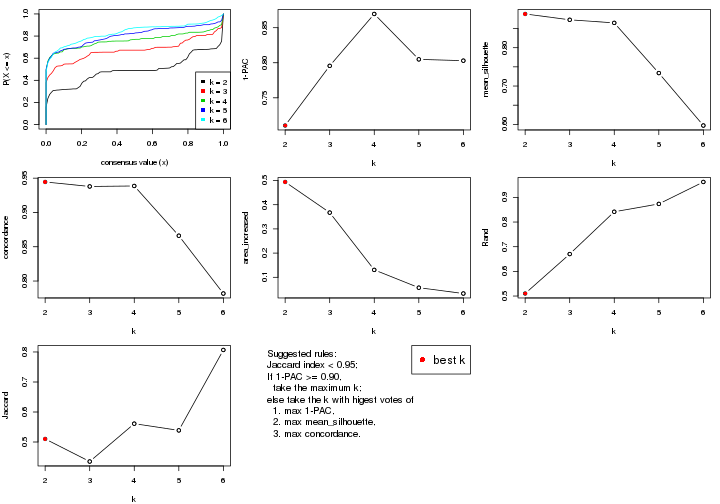

The numeric values for all these statistics can be obtained by `get_stats()`.

```r
get_stats(res)
```

```
#>   k 1-PAC mean_silhouette concordance area_increased  Rand Jaccard
#> 2 2 0.710           0.888       0.944         0.4939 0.510   0.510
#> 3 3 0.796           0.873       0.938         0.3673 0.670   0.435
#> 4 4 0.870           0.865       0.939         0.1305 0.842   0.561
#> 5 5 0.805           0.734       0.866         0.0570 0.873   0.539
#> 6 6 0.803           0.597       0.782         0.0329 0.962   0.807
```

`suggest_best_k()` suggests the best $k$ based on these statistics. The rules are as follows:

- All $k$ with Jaccard index larger than 0.95 are removed because increasing
  $k$ does not provide enough extra information. If all $k$ are removed, it is
  marked as no subgroup is detected.
- For all $k$ with 1-PAC score larger than 0.9, the maximal $k$ is taken as
  the best $k$, and other $k$ are marked as optional $k$.
- If it does not fit the second rule. The $k$ with the maximal vote of the
  highest 1-PAC score, highest mean silhouette, and highest concordance is
  taken as the best $k$.

```r
suggest_best_k(res)
```

```
#> [1] 2
```


Following shows the table of the partitions (You need to click the **show/hide
code output** link to see it). The membership matrix (columns with name `p*`)
is inferred by
[`clue::cl_consensus()`](https://www.rdocumentation.org/link/cl_consensus?package=clue)
function with the `SE` method. Basically the value in the membership matrix
represents the probability to belong to a certain group. The finall class
label for an item is determined with the group with highest probability it
belongs to.

In `get_classes()` function, the entropy is calculated from the membership
matrix and the silhouette score is calculated from the consensus matrix.


<script>
$( function() {
	$( '#tabs-SD-skmeans-get-classes' ).tabs();
} );
</script>
<div id='tabs-SD-skmeans-get-classes'>
<ul>
<li><a href='#tab-SD-skmeans-get-classes-1'>k = 2</a></li>
<li><a href='#tab-SD-skmeans-get-classes-2'>k = 3</a></li>
<li><a href='#tab-SD-skmeans-get-classes-3'>k = 4</a></li>
<li><a href='#tab-SD-skmeans-get-classes-4'>k = 5</a></li>
<li><a href='#tab-SD-skmeans-get-classes-5'>k = 6</a></li>
</ul>

<div id='tab-SD-skmeans-get-classes-1'>
<p><a id='tab-SD-skmeans-get-classes-1-a' style='color:#0366d6' href='#'>show/hide code output</a></p>
<pre><code class="r">cbind(get_classes(res, k = 2), get_membership(res, k = 2))
</code></pre>

<pre><code>#&gt;          class entropy silhouette    p1    p2
#&gt; GSM63448     1  0.0000      0.936 1.000 0.000
#&gt; GSM63449     1  0.0000      0.936 1.000 0.000
#&gt; GSM63423     1  0.0000      0.936 1.000 0.000
#&gt; GSM63425     1  0.0000      0.936 1.000 0.000
#&gt; GSM63437     1  0.0000      0.936 1.000 0.000
#&gt; GSM63453     2  0.0938      0.935 0.012 0.988
#&gt; GSM63431     1  0.0000      0.936 1.000 0.000
#&gt; GSM63450     2  0.0000      0.939 0.000 1.000
#&gt; GSM63428     1  0.0000      0.936 1.000 0.000
#&gt; GSM63432     1  0.0000      0.936 1.000 0.000
#&gt; GSM63458     1  0.0000      0.936 1.000 0.000
#&gt; GSM63434     2  0.8813      0.638 0.300 0.700
#&gt; GSM63435     1  0.0000      0.936 1.000 0.000
#&gt; GSM63442     1  0.0000      0.936 1.000 0.000
#&gt; GSM63451     2  0.7745      0.737 0.228 0.772
#&gt; GSM63422     1  0.0000      0.936 1.000 0.000
#&gt; GSM63438     1  0.0000      0.936 1.000 0.000
#&gt; GSM63439     1  0.0376      0.934 0.996 0.004
#&gt; GSM63461     1  0.0000      0.936 1.000 0.000
#&gt; GSM63463     1  0.0672      0.932 0.992 0.008
#&gt; GSM63430     1  0.0376      0.934 0.996 0.004
#&gt; GSM63446     2  0.8499      0.676 0.276 0.724
#&gt; GSM63429     1  0.2043      0.918 0.968 0.032
#&gt; GSM63445     1  0.0000      0.936 1.000 0.000
#&gt; GSM63447     2  0.0000      0.939 0.000 1.000
#&gt; GSM63459     2  0.0000      0.939 0.000 1.000
#&gt; GSM63464     2  0.0000      0.939 0.000 1.000
#&gt; GSM63469     2  0.0000      0.939 0.000 1.000
#&gt; GSM63470     2  0.0000      0.939 0.000 1.000
#&gt; GSM63436     1  0.0000      0.936 1.000 0.000
#&gt; GSM63443     2  0.7219      0.767 0.200 0.800
#&gt; GSM63465     2  0.0000      0.939 0.000 1.000
#&gt; GSM63444     2  0.0000      0.939 0.000 1.000
#&gt; GSM63456     2  0.0000      0.939 0.000 1.000
#&gt; GSM63462     1  0.9522      0.506 0.628 0.372
#&gt; GSM63424     1  0.0672      0.933 0.992 0.008
#&gt; GSM63440     1  0.0672      0.933 0.992 0.008
#&gt; GSM63433     1  0.7219      0.781 0.800 0.200
#&gt; GSM63466     2  0.0000      0.939 0.000 1.000
#&gt; GSM63426     1  0.6712      0.805 0.824 0.176
#&gt; GSM63468     2  0.1184      0.931 0.016 0.984
#&gt; GSM63452     2  0.0000      0.939 0.000 1.000
#&gt; GSM63441     1  0.7883      0.738 0.764 0.236
#&gt; GSM63454     2  0.0672      0.936 0.008 0.992
#&gt; GSM63455     1  0.7299      0.776 0.796 0.204
#&gt; GSM63460     2  0.0000      0.939 0.000 1.000
#&gt; GSM63467     2  0.1633      0.925 0.024 0.976
#&gt; GSM63421     1  0.0376      0.934 0.996 0.004
#&gt; GSM63427     1  0.8386      0.693 0.732 0.268
#&gt; GSM63457     1  0.6973      0.792 0.812 0.188
</code></pre>

<script>
$('#tab-SD-skmeans-get-classes-1-a').parent().next().next().hide();
$('#tab-SD-skmeans-get-classes-1-a').click(function(){
  $('#tab-SD-skmeans-get-classes-1-a').parent().next().next().toggle();
  return(false);
});
</script>
</div>

<div id='tab-SD-skmeans-get-classes-2'>
<p><a id='tab-SD-skmeans-get-classes-2-a' style='color:#0366d6' href='#'>show/hide code output</a></p>
<pre><code class="r">cbind(get_classes(res, k = 3), get_membership(res, k = 3))
</code></pre>

<pre><code>#&gt;          class entropy silhouette    p1    p2    p3
#&gt; GSM63448     1  0.0424      0.901 0.992 0.000 0.008
#&gt; GSM63449     1  0.1643      0.888 0.956 0.000 0.044
#&gt; GSM63423     1  0.1529      0.890 0.960 0.000 0.040
#&gt; GSM63425     1  0.3879      0.798 0.848 0.000 0.152
#&gt; GSM63437     1  0.1529      0.890 0.960 0.000 0.040
#&gt; GSM63453     2  0.5138      0.665 0.252 0.748 0.000
#&gt; GSM63431     1  0.0237      0.902 0.996 0.000 0.004
#&gt; GSM63450     2  0.2796      0.872 0.092 0.908 0.000
#&gt; GSM63428     1  0.1643      0.888 0.956 0.000 0.044
#&gt; GSM63432     3  0.4796      0.739 0.220 0.000 0.780
#&gt; GSM63458     1  0.0000      0.902 1.000 0.000 0.000
#&gt; GSM63434     3  0.0000      0.947 0.000 0.000 1.000
#&gt; GSM63435     3  0.0000      0.947 0.000 0.000 1.000
#&gt; GSM63442     3  0.0000      0.947 0.000 0.000 1.000
#&gt; GSM63451     3  0.0000      0.947 0.000 0.000 1.000
#&gt; GSM63422     3  0.0000      0.947 0.000 0.000 1.000
#&gt; GSM63438     3  0.0000      0.947 0.000 0.000 1.000
#&gt; GSM63439     3  0.0000      0.947 0.000 0.000 1.000
#&gt; GSM63461     3  0.0000      0.947 0.000 0.000 1.000
#&gt; GSM63463     3  0.0000      0.947 0.000 0.000 1.000
#&gt; GSM63430     3  0.0000      0.947 0.000 0.000 1.000
#&gt; GSM63446     3  0.0000      0.947 0.000 0.000 1.000
#&gt; GSM63429     1  0.5053      0.776 0.812 0.024 0.164
#&gt; GSM63445     3  0.4235      0.798 0.176 0.000 0.824
#&gt; GSM63447     2  0.0237      0.948 0.004 0.996 0.000
#&gt; GSM63459     2  0.0000      0.951 0.000 1.000 0.000
#&gt; GSM63464     2  0.0000      0.951 0.000 1.000 0.000
#&gt; GSM63469     2  0.0000      0.951 0.000 1.000 0.000
#&gt; GSM63470     2  0.0000      0.951 0.000 1.000 0.000
#&gt; GSM63436     1  0.0592      0.899 0.988 0.000 0.012
#&gt; GSM63443     2  0.4931      0.690 0.000 0.768 0.232
#&gt; GSM63465     2  0.0000      0.951 0.000 1.000 0.000
#&gt; GSM63444     2  0.0000      0.951 0.000 1.000 0.000
#&gt; GSM63456     2  0.0000      0.951 0.000 1.000 0.000
#&gt; GSM63462     3  0.5578      0.674 0.012 0.240 0.748
#&gt; GSM63424     3  0.2063      0.916 0.044 0.008 0.948
#&gt; GSM63440     3  0.1964      0.912 0.056 0.000 0.944
#&gt; GSM63433     1  0.0000      0.902 1.000 0.000 0.000
#&gt; GSM63466     2  0.0000      0.951 0.000 1.000 0.000
#&gt; GSM63426     1  0.0000      0.902 1.000 0.000 0.000
#&gt; GSM63468     1  0.6095      0.457 0.608 0.392 0.000
#&gt; GSM63452     2  0.0000      0.951 0.000 1.000 0.000
#&gt; GSM63441     1  0.4399      0.767 0.812 0.188 0.000
#&gt; GSM63454     1  0.6154      0.422 0.592 0.408 0.000
#&gt; GSM63455     1  0.0000      0.902 1.000 0.000 0.000
#&gt; GSM63460     2  0.0000      0.951 0.000 1.000 0.000
#&gt; GSM63467     1  0.5098      0.700 0.752 0.248 0.000
#&gt; GSM63421     1  0.0000      0.902 1.000 0.000 0.000
#&gt; GSM63427     1  0.0000      0.902 1.000 0.000 0.000
#&gt; GSM63457     1  0.0000      0.902 1.000 0.000 0.000
</code></pre>

<script>
$('#tab-SD-skmeans-get-classes-2-a').parent().next().next().hide();
$('#tab-SD-skmeans-get-classes-2-a').click(function(){
  $('#tab-SD-skmeans-get-classes-2-a').parent().next().next().toggle();
  return(false);
});
</script>
</div>

<div id='tab-SD-skmeans-get-classes-3'>
<p><a id='tab-SD-skmeans-get-classes-3-a' style='color:#0366d6' href='#'>show/hide code output</a></p>
<pre><code class="r">cbind(get_classes(res, k = 4), get_membership(res, k = 4))
</code></pre>

<pre><code>#&gt;          class entropy silhouette    p1    p2    p3    p4
#&gt; GSM63448     1  0.0188      0.900 0.996 0.000 0.000 0.004
#&gt; GSM63449     1  0.0000      0.901 1.000 0.000 0.000 0.000
#&gt; GSM63423     1  0.0000      0.901 1.000 0.000 0.000 0.000
#&gt; GSM63425     4  0.0524      0.954 0.004 0.000 0.008 0.988
#&gt; GSM63437     1  0.0000      0.901 1.000 0.000 0.000 0.000
#&gt; GSM63453     1  0.4134      0.599 0.740 0.260 0.000 0.000
#&gt; GSM63431     1  0.0000      0.901 1.000 0.000 0.000 0.000
#&gt; GSM63450     2  0.4535      0.543 0.292 0.704 0.000 0.004
#&gt; GSM63428     1  0.0000      0.901 1.000 0.000 0.000 0.000
#&gt; GSM63432     1  0.4989      0.097 0.528 0.000 0.472 0.000
#&gt; GSM63458     1  0.3801      0.682 0.780 0.000 0.000 0.220
#&gt; GSM63434     3  0.0000      0.964 0.000 0.000 1.000 0.000
#&gt; GSM63435     3  0.0000      0.964 0.000 0.000 1.000 0.000
#&gt; GSM63442     3  0.0000      0.964 0.000 0.000 1.000 0.000
#&gt; GSM63451     3  0.0000      0.964 0.000 0.000 1.000 0.000
#&gt; GSM63422     3  0.0000      0.964 0.000 0.000 1.000 0.000
#&gt; GSM63438     3  0.0000      0.964 0.000 0.000 1.000 0.000
#&gt; GSM63439     3  0.0000      0.964 0.000 0.000 1.000 0.000
#&gt; GSM63461     3  0.0000      0.964 0.000 0.000 1.000 0.000
#&gt; GSM63463     3  0.0000      0.964 0.000 0.000 1.000 0.000
#&gt; GSM63430     3  0.0000      0.964 0.000 0.000 1.000 0.000
#&gt; GSM63446     3  0.0000      0.964 0.000 0.000 1.000 0.000
#&gt; GSM63429     4  0.0000      0.955 0.000 0.000 0.000 1.000
#&gt; GSM63445     3  0.1576      0.917 0.048 0.000 0.948 0.004
#&gt; GSM63447     2  0.4643      0.513 0.000 0.656 0.000 0.344
#&gt; GSM63459     2  0.0000      0.902 0.000 1.000 0.000 0.000
#&gt; GSM63464     2  0.0000      0.902 0.000 1.000 0.000 0.000
#&gt; GSM63469     2  0.0000      0.902 0.000 1.000 0.000 0.000
#&gt; GSM63470     2  0.0000      0.902 0.000 1.000 0.000 0.000
#&gt; GSM63436     1  0.1706      0.885 0.948 0.000 0.016 0.036
#&gt; GSM63443     2  0.3610      0.719 0.000 0.800 0.200 0.000
#&gt; GSM63465     2  0.4222      0.639 0.000 0.728 0.000 0.272
#&gt; GSM63444     2  0.0000      0.902 0.000 1.000 0.000 0.000
#&gt; GSM63456     2  0.0000      0.902 0.000 1.000 0.000 0.000
#&gt; GSM63462     3  0.6648      0.468 0.008 0.096 0.612 0.284
#&gt; GSM63424     4  0.1022      0.939 0.000 0.000 0.032 0.968
#&gt; GSM63440     4  0.0336      0.954 0.000 0.000 0.008 0.992
#&gt; GSM63433     4  0.2216      0.919 0.092 0.000 0.000 0.908
#&gt; GSM63466     2  0.0000      0.902 0.000 1.000 0.000 0.000
#&gt; GSM63426     4  0.2345      0.911 0.100 0.000 0.000 0.900
#&gt; GSM63468     4  0.0188      0.955 0.000 0.004 0.000 0.996
#&gt; GSM63452     2  0.0000      0.902 0.000 1.000 0.000 0.000
#&gt; GSM63441     4  0.0188      0.955 0.000 0.004 0.000 0.996
#&gt; GSM63454     4  0.0188      0.955 0.000 0.004 0.000 0.996
#&gt; GSM63455     4  0.1940      0.930 0.076 0.000 0.000 0.924
#&gt; GSM63460     2  0.0000      0.902 0.000 1.000 0.000 0.000
#&gt; GSM63467     4  0.2053      0.932 0.072 0.004 0.000 0.924
#&gt; GSM63421     1  0.0921      0.895 0.972 0.000 0.000 0.028
#&gt; GSM63427     1  0.1510      0.890 0.956 0.016 0.000 0.028
#&gt; GSM63457     1  0.0921      0.895 0.972 0.000 0.000 0.028
</code></pre>

<script>
$('#tab-SD-skmeans-get-classes-3-a').parent().next().next().hide();
$('#tab-SD-skmeans-get-classes-3-a').click(function(){
  $('#tab-SD-skmeans-get-classes-3-a').parent().next().next().toggle();
  return(false);
});
</script>
</div>

<div id='tab-SD-skmeans-get-classes-4'>
<p><a id='tab-SD-skmeans-get-classes-4-a' style='color:#0366d6' href='#'>show/hide code output</a></p>
<pre><code class="r">cbind(get_classes(res, k = 5), get_membership(res, k = 5))
</code></pre>

<pre><code>#&gt;          class entropy silhouette    p1    p2    p3    p4    p5
#&gt; GSM63448     1  0.1399     0.8192 0.952 0.000 0.000 0.020 0.028
#&gt; GSM63449     1  0.0000     0.8385 1.000 0.000 0.000 0.000 0.000
#&gt; GSM63423     1  0.0000     0.8385 1.000 0.000 0.000 0.000 0.000
#&gt; GSM63425     4  0.1717     0.7334 0.008 0.000 0.004 0.936 0.052
#&gt; GSM63437     1  0.0000     0.8385 1.000 0.000 0.000 0.000 0.000
#&gt; GSM63453     1  0.5073     0.6548 0.688 0.100 0.000 0.000 0.212
#&gt; GSM63431     1  0.2230     0.7529 0.884 0.000 0.000 0.000 0.116
#&gt; GSM63450     1  0.5701     0.5306 0.604 0.272 0.000 0.000 0.124
#&gt; GSM63428     1  0.0000     0.8385 1.000 0.000 0.000 0.000 0.000
#&gt; GSM63432     1  0.3177     0.6434 0.792 0.000 0.208 0.000 0.000
#&gt; GSM63458     5  0.6069     0.3650 0.340 0.000 0.000 0.136 0.524
#&gt; GSM63434     3  0.0162     0.9528 0.000 0.000 0.996 0.000 0.004
#&gt; GSM63435     3  0.0000     0.9534 0.000 0.000 1.000 0.000 0.000
#&gt; GSM63442     3  0.0162     0.9511 0.000 0.000 0.996 0.000 0.004
#&gt; GSM63451     3  0.0162     0.9528 0.000 0.000 0.996 0.000 0.004
#&gt; GSM63422     3  0.0000     0.9534 0.000 0.000 1.000 0.000 0.000
#&gt; GSM63438     3  0.0000     0.9534 0.000 0.000 1.000 0.000 0.000
#&gt; GSM63439     3  0.0162     0.9528 0.000 0.000 0.996 0.000 0.004
#&gt; GSM63461     3  0.0000     0.9534 0.000 0.000 1.000 0.000 0.000
#&gt; GSM63463     3  0.0000     0.9534 0.000 0.000 1.000 0.000 0.000
#&gt; GSM63430     3  0.0451     0.9483 0.000 0.000 0.988 0.008 0.004
#&gt; GSM63446     3  0.0451     0.9482 0.000 0.000 0.988 0.008 0.004
#&gt; GSM63429     4  0.0963     0.7439 0.000 0.000 0.000 0.964 0.036
#&gt; GSM63445     3  0.5496     0.2035 0.032 0.000 0.548 0.020 0.400
#&gt; GSM63447     4  0.5242     0.2023 0.004 0.444 0.000 0.516 0.036
#&gt; GSM63459     2  0.0000     0.9560 0.000 1.000 0.000 0.000 0.000
#&gt; GSM63464     2  0.0000     0.9560 0.000 1.000 0.000 0.000 0.000
#&gt; GSM63469     2  0.0000     0.9560 0.000 1.000 0.000 0.000 0.000
#&gt; GSM63470     2  0.0000     0.9560 0.000 1.000 0.000 0.000 0.000
#&gt; GSM63436     5  0.3882     0.6160 0.224 0.000 0.000 0.020 0.756
#&gt; GSM63443     2  0.3274     0.6993 0.000 0.780 0.220 0.000 0.000
#&gt; GSM63465     4  0.4298     0.4296 0.000 0.352 0.000 0.640 0.008
#&gt; GSM63444     2  0.0162     0.9540 0.000 0.996 0.000 0.000 0.004
#&gt; GSM63456     2  0.1732     0.9034 0.000 0.920 0.000 0.000 0.080
#&gt; GSM63462     5  0.8099     0.0651 0.016 0.076 0.360 0.176 0.372
#&gt; GSM63424     4  0.1461     0.7293 0.004 0.000 0.028 0.952 0.016
#&gt; GSM63440     4  0.0798     0.7432 0.000 0.000 0.008 0.976 0.016
#&gt; GSM63433     5  0.4193     0.4530 0.012 0.000 0.000 0.304 0.684
#&gt; GSM63466     2  0.0000     0.9560 0.000 1.000 0.000 0.000 0.000
#&gt; GSM63426     5  0.4442     0.4850 0.028 0.000 0.000 0.284 0.688
#&gt; GSM63468     4  0.2179     0.7328 0.000 0.000 0.000 0.888 0.112
#&gt; GSM63452     2  0.0963     0.9360 0.000 0.964 0.000 0.000 0.036
#&gt; GSM63441     4  0.2230     0.7318 0.000 0.000 0.000 0.884 0.116
#&gt; GSM63454     4  0.2074     0.7359 0.000 0.000 0.000 0.896 0.104
#&gt; GSM63455     5  0.4108     0.4458 0.008 0.000 0.000 0.308 0.684
#&gt; GSM63460     2  0.0000     0.9560 0.000 1.000 0.000 0.000 0.000
#&gt; GSM63467     4  0.6056    -0.0739 0.036 0.036 0.004 0.472 0.452
#&gt; GSM63421     5  0.3274     0.6263 0.220 0.000 0.000 0.000 0.780
#&gt; GSM63427     5  0.3266     0.6342 0.200 0.000 0.000 0.004 0.796
#&gt; GSM63457     5  0.3210     0.6302 0.212 0.000 0.000 0.000 0.788
</code></pre>

<script>
$('#tab-SD-skmeans-get-classes-4-a').parent().next().next().hide();
$('#tab-SD-skmeans-get-classes-4-a').click(function(){
  $('#tab-SD-skmeans-get-classes-4-a').parent().next().next().toggle();
  return(false);
});
</script>
</div>

<div id='tab-SD-skmeans-get-classes-5'>
<p><a id='tab-SD-skmeans-get-classes-5-a' style='color:#0366d6' href='#'>show/hide code output</a></p>
<pre><code class="r">cbind(get_classes(res, k = 6), get_membership(res, k = 6))
</code></pre>

<pre><code>#&gt;          class entropy silhouette    p1    p2    p3    p4    p5    p6
#&gt; GSM63448     1  0.2103     0.7574 0.912 0.000 0.000 0.020 0.012 0.056
#&gt; GSM63449     1  0.0146     0.7911 0.996 0.000 0.000 0.000 0.004 0.000
#&gt; GSM63423     1  0.0146     0.7911 0.996 0.000 0.000 0.000 0.004 0.000
#&gt; GSM63425     6  0.4811     0.3746 0.008 0.000 0.000 0.448 0.036 0.508
#&gt; GSM63437     1  0.0146     0.7911 0.996 0.000 0.000 0.000 0.004 0.000
#&gt; GSM63453     1  0.7283     0.4301 0.448 0.076 0.000 0.028 0.156 0.292
#&gt; GSM63431     1  0.3456     0.6422 0.788 0.000 0.000 0.000 0.172 0.040
#&gt; GSM63450     1  0.7517     0.4179 0.432 0.140 0.000 0.032 0.108 0.288
#&gt; GSM63428     1  0.0146     0.7911 0.996 0.000 0.000 0.000 0.004 0.000
#&gt; GSM63432     1  0.3529     0.6514 0.788 0.000 0.172 0.000 0.004 0.036
#&gt; GSM63458     5  0.6934     0.3060 0.220 0.000 0.004 0.060 0.436 0.280
#&gt; GSM63434     3  0.1075     0.9078 0.000 0.000 0.952 0.000 0.000 0.048
#&gt; GSM63435     3  0.1074     0.9072 0.000 0.000 0.960 0.000 0.012 0.028
#&gt; GSM63442     3  0.1225     0.9061 0.000 0.000 0.952 0.000 0.012 0.036
#&gt; GSM63451     3  0.1010     0.9090 0.000 0.000 0.960 0.000 0.004 0.036
#&gt; GSM63422     3  0.1151     0.9071 0.000 0.000 0.956 0.000 0.012 0.032
#&gt; GSM63438     3  0.0405     0.9140 0.000 0.000 0.988 0.000 0.004 0.008
#&gt; GSM63439     3  0.1010     0.9077 0.000 0.000 0.960 0.000 0.004 0.036
#&gt; GSM63461     3  0.0520     0.9137 0.000 0.000 0.984 0.000 0.008 0.008
#&gt; GSM63463     3  0.0260     0.9139 0.000 0.000 0.992 0.000 0.000 0.008
#&gt; GSM63430     3  0.1010     0.9091 0.000 0.000 0.960 0.000 0.004 0.036
#&gt; GSM63446     3  0.2165     0.8596 0.000 0.000 0.884 0.000 0.008 0.108
#&gt; GSM63429     4  0.3993    -0.5567 0.000 0.000 0.000 0.520 0.004 0.476
#&gt; GSM63445     3  0.6540     0.0524 0.036 0.000 0.432 0.004 0.360 0.168
#&gt; GSM63447     4  0.5935     0.1021 0.000 0.408 0.000 0.460 0.032 0.100
#&gt; GSM63459     2  0.0000     0.9288 0.000 1.000 0.000 0.000 0.000 0.000
#&gt; GSM63464     2  0.0000     0.9288 0.000 1.000 0.000 0.000 0.000 0.000
#&gt; GSM63469     2  0.0000     0.9288 0.000 1.000 0.000 0.000 0.000 0.000
#&gt; GSM63470     2  0.0000     0.9288 0.000 1.000 0.000 0.000 0.000 0.000
#&gt; GSM63436     5  0.2579     0.6718 0.088 0.000 0.000 0.004 0.876 0.032
#&gt; GSM63443     2  0.3213     0.6844 0.000 0.784 0.204 0.000 0.004 0.008
#&gt; GSM63465     4  0.5448     0.0413 0.000 0.352 0.000 0.516 0.000 0.132
#&gt; GSM63444     2  0.0891     0.9194 0.000 0.968 0.000 0.008 0.000 0.024
#&gt; GSM63456     2  0.3387     0.7773 0.000 0.796 0.000 0.000 0.040 0.164
#&gt; GSM63462     6  0.8352    -0.0161 0.012 0.048 0.256 0.140 0.176 0.368
#&gt; GSM63424     6  0.4783     0.4467 0.000 0.000 0.024 0.440 0.016 0.520
#&gt; GSM63440     6  0.4325     0.4346 0.000 0.000 0.008 0.480 0.008 0.504
#&gt; GSM63433     5  0.5577     0.2093 0.004 0.000 0.000 0.424 0.452 0.120
#&gt; GSM63466     2  0.0260     0.9273 0.000 0.992 0.000 0.008 0.000 0.000
#&gt; GSM63426     5  0.5687     0.2014 0.004 0.000 0.000 0.420 0.440 0.136
#&gt; GSM63468     4  0.0713     0.2994 0.000 0.000 0.000 0.972 0.000 0.028
#&gt; GSM63452     2  0.2069     0.8766 0.004 0.908 0.000 0.000 0.020 0.068
#&gt; GSM63441     4  0.0777     0.2955 0.000 0.000 0.000 0.972 0.004 0.024
#&gt; GSM63454     4  0.0458     0.3011 0.000 0.000 0.000 0.984 0.000 0.016
#&gt; GSM63455     4  0.5535    -0.3481 0.000 0.000 0.000 0.440 0.428 0.132
#&gt; GSM63460     2  0.0405     0.9269 0.000 0.988 0.000 0.008 0.000 0.004
#&gt; GSM63467     4  0.6619     0.1208 0.044 0.028 0.004 0.576 0.176 0.172
#&gt; GSM63421     5  0.1674     0.6894 0.068 0.000 0.000 0.004 0.924 0.004
#&gt; GSM63427     5  0.1411     0.6895 0.060 0.000 0.000 0.004 0.936 0.000
#&gt; GSM63457     5  0.1829     0.6902 0.064 0.000 0.000 0.004 0.920 0.012
</code></pre>

<script>
$('#tab-SD-skmeans-get-classes-5-a').parent().next().next().hide();
$('#tab-SD-skmeans-get-classes-5-a').click(function(){
  $('#tab-SD-skmeans-get-classes-5-a').parent().next().next().toggle();
  return(false);
});
</script>
</div>
</div>

Heatmaps for the consensus matrix. It visualizes the probability of two
samples to be in a same group.


<script>
$( function() {
	$( '#tabs-SD-skmeans-consensus-heatmap' ).tabs();
} );
</script>
<div id='tabs-SD-skmeans-consensus-heatmap'>
<ul>
<li><a href='#tab-SD-skmeans-consensus-heatmap-1'>k = 2</a></li>
<li><a href='#tab-SD-skmeans-consensus-heatmap-2'>k = 3</a></li>
<li><a href='#tab-SD-skmeans-consensus-heatmap-3'>k = 4</a></li>
<li><a href='#tab-SD-skmeans-consensus-heatmap-4'>k = 5</a></li>
<li><a href='#tab-SD-skmeans-consensus-heatmap-5'>k = 6</a></li>
</ul>
<div id='tab-SD-skmeans-consensus-heatmap-1'>
<pre><code class="r">consensus_heatmap(res, k = 2)
</code></pre>

<p>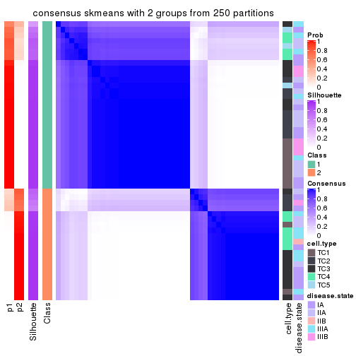</p>

</div>
<div id='tab-SD-skmeans-consensus-heatmap-2'>
<pre><code class="r">consensus_heatmap(res, k = 3)
</code></pre>

<p>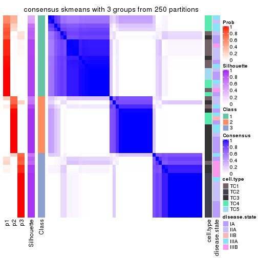</p>

</div>
<div id='tab-SD-skmeans-consensus-heatmap-3'>
<pre><code class="r">consensus_heatmap(res, k = 4)
</code></pre>

<p>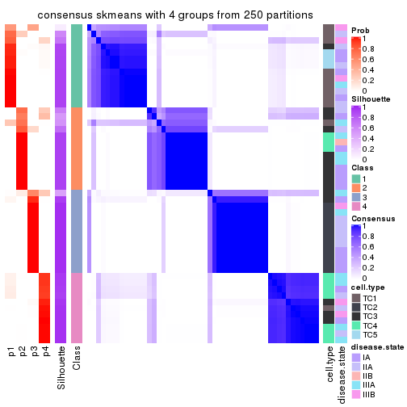</p>

</div>
<div id='tab-SD-skmeans-consensus-heatmap-4'>
<pre><code class="r">consensus_heatmap(res, k = 5)
</code></pre>

<p>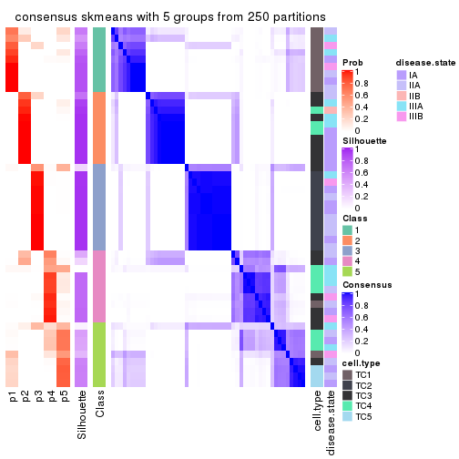</p>

</div>
<div id='tab-SD-skmeans-consensus-heatmap-5'>
<pre><code class="r">consensus_heatmap(res, k = 6)
</code></pre>

<p>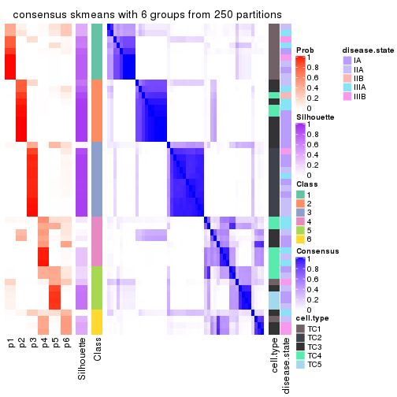</p>

</div>
</div>

Heatmaps for the membership of samples in all partitions to see how consistent they are:


<script>
$( function() {
	$( '#tabs-SD-skmeans-membership-heatmap' ).tabs();
} );
</script>
<div id='tabs-SD-skmeans-membership-heatmap'>
<ul>
<li><a href='#tab-SD-skmeans-membership-heatmap-1'>k = 2</a></li>
<li><a href='#tab-SD-skmeans-membership-heatmap-2'>k = 3</a></li>
<li><a href='#tab-SD-skmeans-membership-heatmap-3'>k = 4</a></li>
<li><a href='#tab-SD-skmeans-membership-heatmap-4'>k = 5</a></li>
<li><a href='#tab-SD-skmeans-membership-heatmap-5'>k = 6</a></li>
</ul>
<div id='tab-SD-skmeans-membership-heatmap-1'>
<pre><code class="r">membership_heatmap(res, k = 2)
</code></pre>

<p>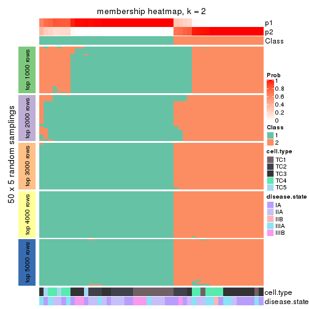</p>

</div>
<div id='tab-SD-skmeans-membership-heatmap-2'>
<pre><code class="r">membership_heatmap(res, k = 3)
</code></pre>

<p>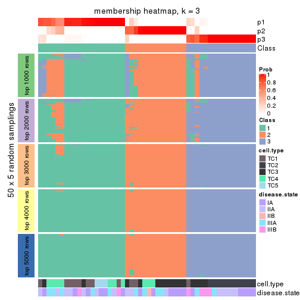</p>

</div>
<div id='tab-SD-skmeans-membership-heatmap-3'>
<pre><code class="r">membership_heatmap(res, k = 4)
</code></pre>

<p>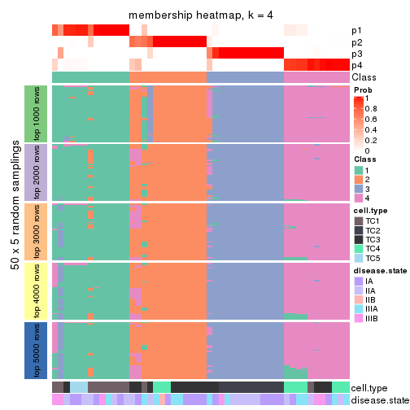</p>

</div>
<div id='tab-SD-skmeans-membership-heatmap-4'>
<pre><code class="r">membership_heatmap(res, k = 5)
</code></pre>

<p>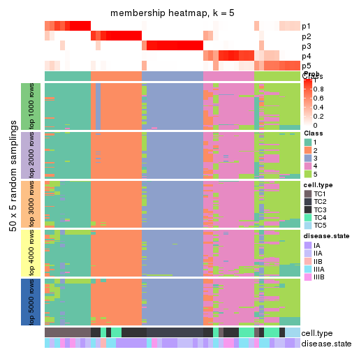</p>

</div>
<div id='tab-SD-skmeans-membership-heatmap-5'>
<pre><code class="r">membership_heatmap(res, k = 6)
</code></pre>

<p>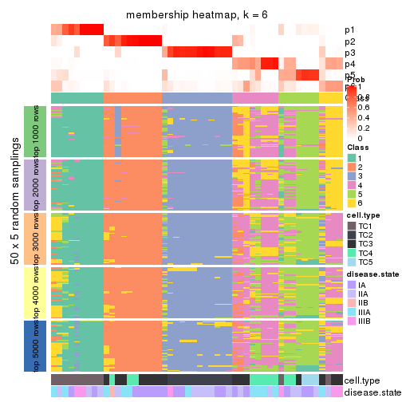</p>

</div>
</div>

As soon as we have had the classes for columns, we can look for signatures
which are significantly different between classes which can be candidate marks
for certain classes. Following are the heatmaps for signatures.


Signature heatmaps where rows are scaled:


<script>
$( function() {
	$( '#tabs-SD-skmeans-get-signatures' ).tabs();
} );
</script>
<div id='tabs-SD-skmeans-get-signatures'>
<ul>
<li><a href='#tab-SD-skmeans-get-signatures-1'>k = 2</a></li>
<li><a href='#tab-SD-skmeans-get-signatures-2'>k = 3</a></li>
<li><a href='#tab-SD-skmeans-get-signatures-3'>k = 4</a></li>
<li><a href='#tab-SD-skmeans-get-signatures-4'>k = 5</a></li>
<li><a href='#tab-SD-skmeans-get-signatures-5'>k = 6</a></li>
</ul>
<div id='tab-SD-skmeans-get-signatures-1'>
<pre><code class="r">get_signatures(res, k = 2)
</code></pre>

<p>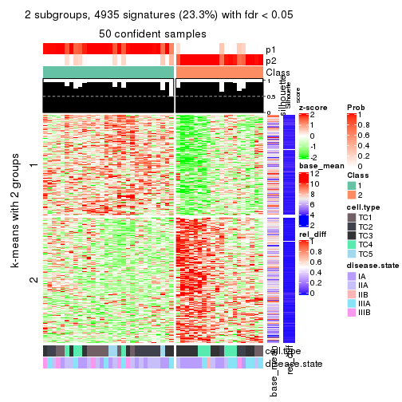</p>

</div>
<div id='tab-SD-skmeans-get-signatures-2'>
<pre><code class="r">get_signatures(res, k = 3)
</code></pre>

<p>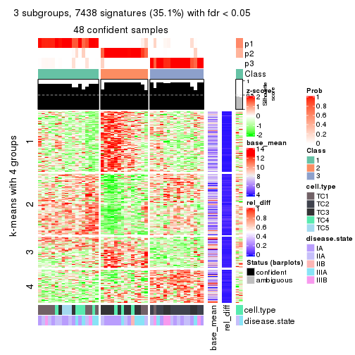</p>

</div>
<div id='tab-SD-skmeans-get-signatures-3'>
<pre><code class="r">get_signatures(res, k = 4)
</code></pre>

<p>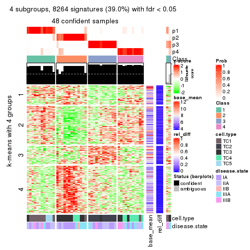</p>

</div>
<div id='tab-SD-skmeans-get-signatures-4'>
<pre><code class="r">get_signatures(res, k = 5)
</code></pre>

<p>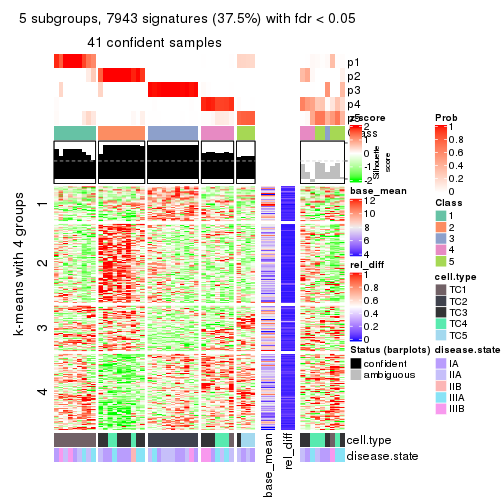</p>

</div>
<div id='tab-SD-skmeans-get-signatures-5'>
<pre><code class="r">get_signatures(res, k = 6)
</code></pre>

<p>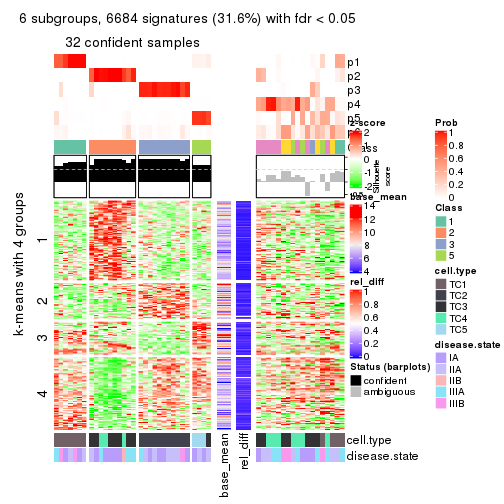</p>

</div>
</div>


Signature heatmaps where rows are not scaled:


<script>
$( function() {
	$( '#tabs-SD-skmeans-get-signatures-no-scale' ).tabs();
} );
</script>
<div id='tabs-SD-skmeans-get-signatures-no-scale'>
<ul>
<li><a href='#tab-SD-skmeans-get-signatures-no-scale-1'>k = 2</a></li>
<li><a href='#tab-SD-skmeans-get-signatures-no-scale-2'>k = 3</a></li>
<li><a href='#tab-SD-skmeans-get-signatures-no-scale-3'>k = 4</a></li>
<li><a href='#tab-SD-skmeans-get-signatures-no-scale-4'>k = 5</a></li>
<li><a href='#tab-SD-skmeans-get-signatures-no-scale-5'>k = 6</a></li>
</ul>
<div id='tab-SD-skmeans-get-signatures-no-scale-1'>
<pre><code class="r">get_signatures(res, k = 2, scale_rows = FALSE)
</code></pre>

<p>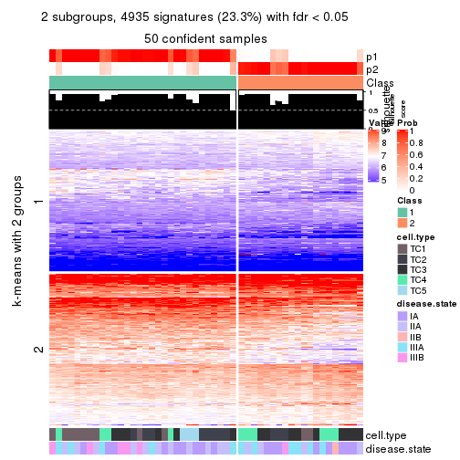</p>

</div>
<div id='tab-SD-skmeans-get-signatures-no-scale-2'>
<pre><code class="r">get_signatures(res, k = 3, scale_rows = FALSE)
</code></pre>

<p>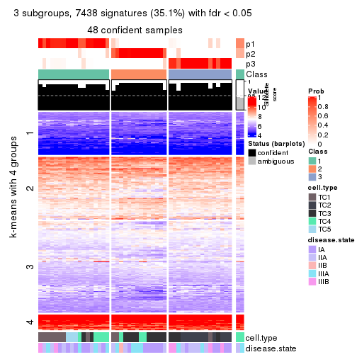</p>

</div>
<div id='tab-SD-skmeans-get-signatures-no-scale-3'>
<pre><code class="r">get_signatures(res, k = 4, scale_rows = FALSE)
</code></pre>

<p>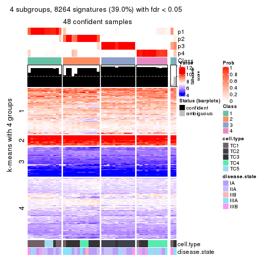</p>

</div>
<div id='tab-SD-skmeans-get-signatures-no-scale-4'>
<pre><code class="r">get_signatures(res, k = 5, scale_rows = FALSE)
</code></pre>

<p>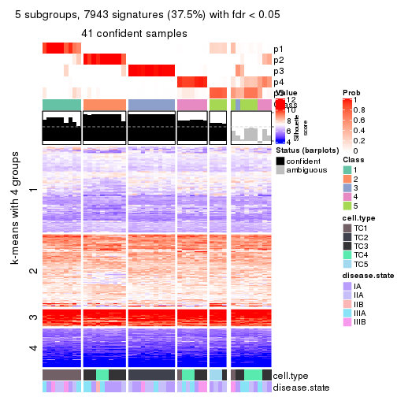</p>

</div>
<div id='tab-SD-skmeans-get-signatures-no-scale-5'>
<pre><code class="r">get_signatures(res, k = 6, scale_rows = FALSE)
</code></pre>

<p>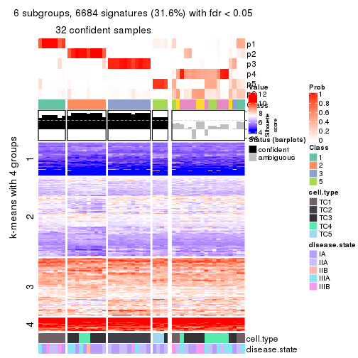</p>

</div>
</div>


Compare the overlap of signatures from different k:

```r
compare_signatures(res)
```

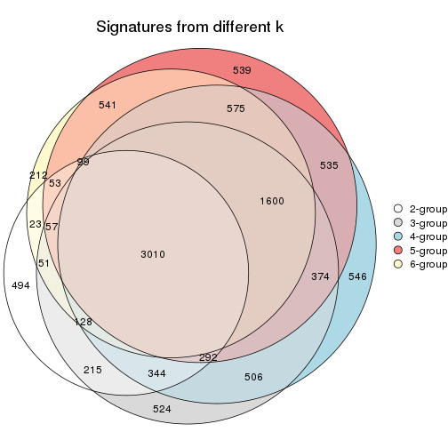

`get_signature()` returns a data frame invisibly. TO get the list of signatures, the function
call should be assigned to a variable explicitly. In following code, if `plot` argument is set
to `FALSE`, no heatmap is plotted while only the differential analysis is performed.

```r
# code only for demonstration
tb = get_signature(res, k = ..., plot = FALSE)
```

An example of the output of `tb` is:

```
#>   which_row         fdr    mean_1    mean_2 scaled_mean_1 scaled_mean_2 km
#> 1        38 0.042760348  8.373488  9.131774    -0.5533452     0.5164555  1
#> 2        40 0.018707592  7.106213  8.469186    -0.6173731     0.5762149  1
#> 3        55 0.019134737 10.221463 11.207825    -0.6159697     0.5749050  1
#> 4        59 0.006059896  5.921854  7.869574    -0.6899429     0.6439467  1
#> 5        60 0.018055526  8.928898 10.211722    -0.6204761     0.5791110  1
#> 6        98 0.009384629 15.714769 14.887706     0.6635654    -0.6193277  2
...
```

The columns in `tb` are:

1. `which_row`: row indices corresponding to the input matrix.
2. `fdr`: FDR for the differential test. 
3. `mean_x`: The mean value in group x.
4. `scaled_mean_x`: The mean value in group x after rows are scaled.
5. `km`: Row groups if k-means clustering is applied to rows.


UMAP plot which shows how samples are separated.


<script>
$( function() {
	$( '#tabs-SD-skmeans-dimension-reduction' ).tabs();
} );
</script>
<div id='tabs-SD-skmeans-dimension-reduction'>
<ul>
<li><a href='#tab-SD-skmeans-dimension-reduction-1'>k = 2</a></li>
<li><a href='#tab-SD-skmeans-dimension-reduction-2'>k = 3</a></li>
<li><a href='#tab-SD-skmeans-dimension-reduction-3'>k = 4</a></li>
<li><a href='#tab-SD-skmeans-dimension-reduction-4'>k = 5</a></li>
<li><a href='#tab-SD-skmeans-dimension-reduction-5'>k = 6</a></li>
</ul>
<div id='tab-SD-skmeans-dimension-reduction-1'>
<pre><code class="r">dimension_reduction(res, k = 2, method = &quot;UMAP&quot;)
</code></pre>

<p>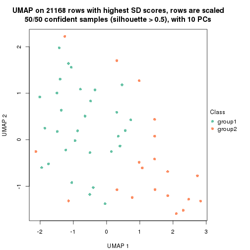</p>

</div>
<div id='tab-SD-skmeans-dimension-reduction-2'>
<pre><code class="r">dimension_reduction(res, k = 3, method = &quot;UMAP&quot;)
</code></pre>

<p>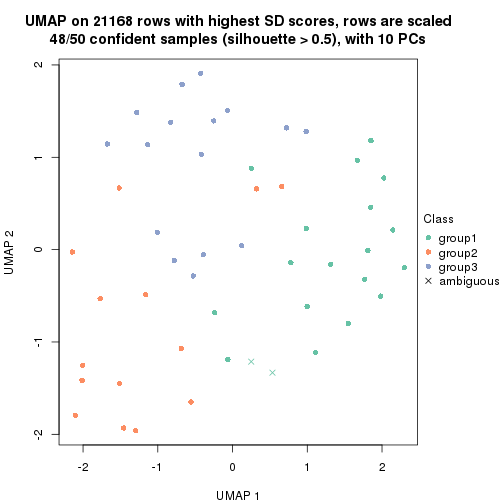</p>

</div>
<div id='tab-SD-skmeans-dimension-reduction-3'>
<pre><code class="r">dimension_reduction(res, k = 4, method = &quot;UMAP&quot;)
</code></pre>

<p>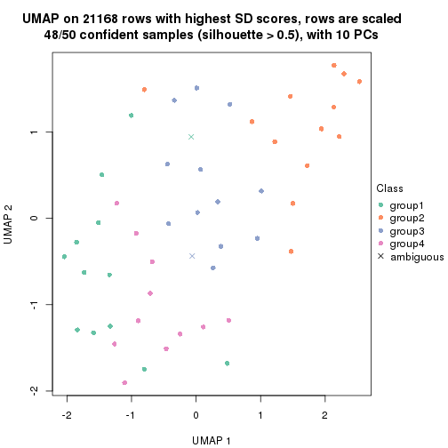</p>

</div>
<div id='tab-SD-skmeans-dimension-reduction-4'>
<pre><code class="r">dimension_reduction(res, k = 5, method = &quot;UMAP&quot;)
</code></pre>

<p>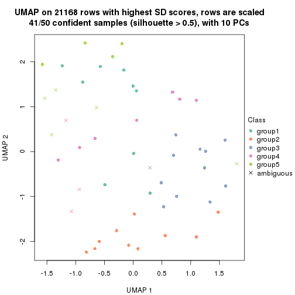</p>

</div>
<div id='tab-SD-skmeans-dimension-reduction-5'>
<pre><code class="r">dimension_reduction(res, k = 6, method = &quot;UMAP&quot;)
</code></pre>

<p>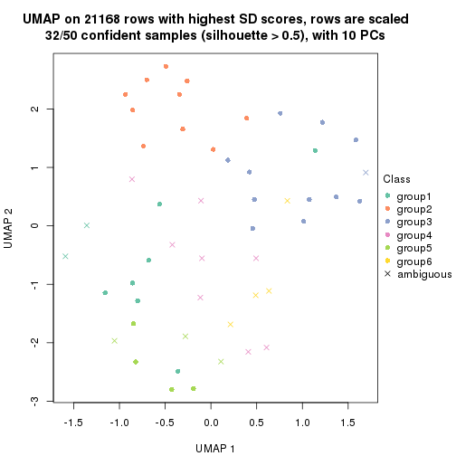</p>

</div>
</div>


Following heatmap shows how subgroups are split when increasing `k`:

```r
collect_classes(res)
```

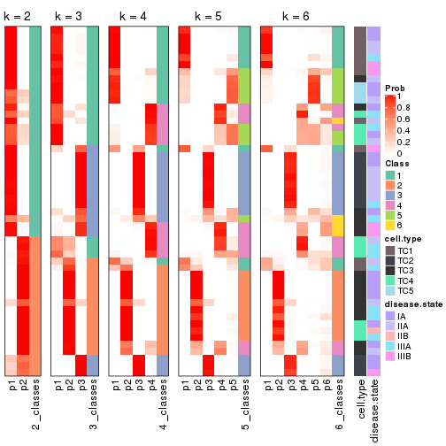


Test correlation between subgroups and known annotations. If the known
annotation is numeric, one-way ANOVA test is applied, and if the known
annotation is discrete, chi-squared contingency table test is applied.

```r
test_to_known_factors(res)
```

```
#>             n cell.type(p) disease.state(p) k
#> SD:skmeans 50     5.89e-02            0.258 2
#> SD:skmeans 48     4.29e-07            0.444 3
#> SD:skmeans 48     7.57e-13            0.422 4
#> SD:skmeans 41     1.55e-15            0.578 5
#> SD:skmeans 32     2.67e-13            0.466 6
```


If matrix rows can be associated to genes, consider to use `functional_enrichment(res,
...)` to perform function enrichment for the signature genes. See [this vignette](http://bioconductor.org/packages/devel/bioc/vignettes/cola/inst/doc/functional_enrichment.html) for more detailed explanations.


 

---------------------------------------------------


### SD:pam


The object with results only for a single top-value method and a single partition method 
can be extracted as:

```r
res = res_list["SD", "pam"]
# you can also extract it by
# res = res_list["SD:pam"]
```

A summary of `res` and all the functions that can be applied to it:

```r
res
```

```
#> A 'ConsensusPartition' object with k = 2, 3, 4, 5, 6.
#>   On a matrix with 21168 rows and 50 columns.
#>   Top rows (1000, 2000, 3000, 4000, 5000) are extracted by 'SD' method.
#>   Subgroups are detected by 'pam' method.
#>   Performed in total 1250 partitions by row resampling.
#>   Best k for subgroups seems to be 3.
#> 
#> Following methods can be applied to this 'ConsensusPartition' object:
#>  [1] "cola_report"             "collect_classes"         "collect_plots"          
#>  [4] "collect_stats"           "colnames"                "compare_signatures"     
#>  [7] "consensus_heatmap"       "dimension_reduction"     "functional_enrichment"  
#> [10] "get_anno_col"            "get_anno"                "get_classes"            
#> [13] "get_consensus"           "get_matrix"              "get_membership"         
#> [16] "get_param"               "get_signatures"          "get_stats"              
#> [19] "is_best_k"               "is_stable_k"             "membership_heatmap"     
#> [22] "ncol"                    "nrow"                    "plot_ecdf"              
#> [25] "rownames"                "select_partition_number" "show"                   
#> [28] "suggest_best_k"          "test_to_known_factors"
```

`collect_plots()` function collects all the plots made from `res` for all `k` (number of partitions)
into one single page to provide an easy and fast comparison between different `k`.

```r
collect_plots(res)
```

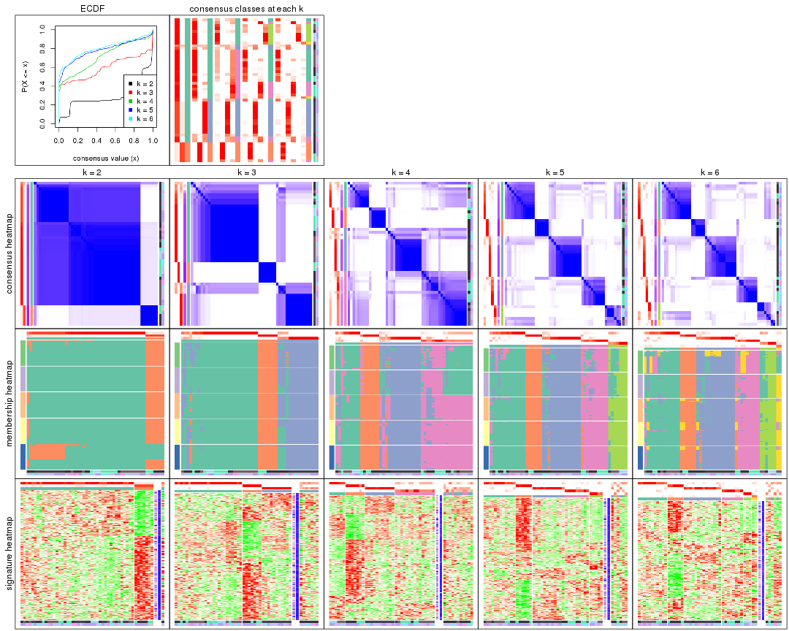

The plots are:

- The first row: a plot of the ECDF (empirical cumulative distribution
  function) curves of the consensus matrix for each `k` and the heatmap of
  predicted classes for each `k`.
- The second row: heatmaps of the consensus matrix for each `k`.
- The third row: heatmaps of the membership matrix for each `k`.
- The fouth row: heatmaps of the signatures for each `k`.

All the plots in panels can be made by individual functions and they are
plotted later in this section.

`select_partition_number()` produces several plots showing different
statistics for choosing "optimized" `k`. There are following statistics:

- ECDF curves of the consensus matrix for each `k`;
- 1-PAC. [The PAC
  score](https://en.wikipedia.org/wiki/Consensus_clustering#Over-interpretation_potential_of_consensus_clustering)
  measures the proportion of the ambiguous subgrouping.
- Mean silhouette score.
- Concordance. The mean probability of fiting the consensus class ids in all
  partitions.
- Area increased. Denote $A_k$ as the area under the ECDF curve for current
  `k`, the area increased is defined as $A_k - A_{k-1}$.
- Rand index. The percent of pairs of samples that are both in a same cluster
  or both are not in a same cluster in the partition of k and k-1.
- Jaccard index. The ratio of pairs of samples are both in a same cluster in
  the partition of k and k-1 and the pairs of samples are both in a same
  cluster in the partition k or k-1.

The detailed explanations of these statistics can be found in [the _cola_
vignette](http://bioconductor.org/packages/devel/bioc/vignettes/cola/inst/doc/cola.html#toc_13).

Generally speaking, lower PAC score, higher mean silhouette score or higher
concordance corresponds to better partition. Rand index and Jaccard index
measure how similar the current partition is compared to partition with `k-1`.
If they are too similar, we won't accept `k` is better than `k-1`.

```r
select_partition_number(res)
```

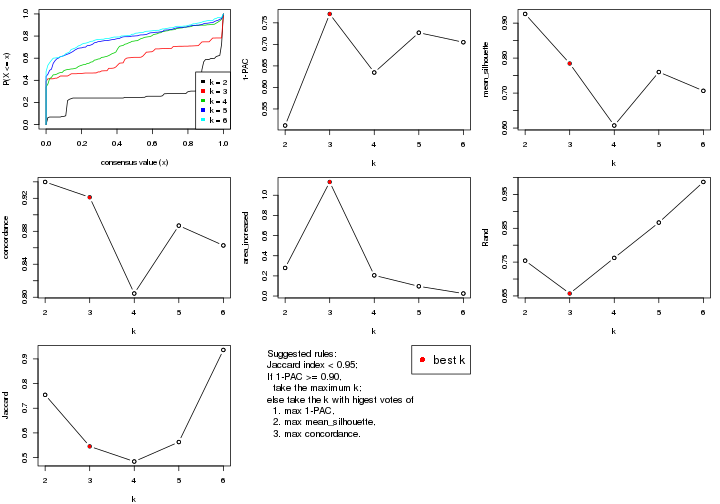

The numeric values for all these statistics can be obtained by `get_stats()`.

```r
get_stats(res)
```

```
#>   k 1-PAC mean_silhouette concordance area_increased  Rand Jaccard
#> 2 2 0.512           0.926       0.940         0.2788 0.754   0.754
#> 3 3 0.771           0.785       0.921         1.1318 0.657   0.545
#> 4 4 0.635           0.607       0.804         0.2052 0.762   0.484
#> 5 5 0.727           0.760       0.887         0.0967 0.867   0.563
#> 6 6 0.705           0.706       0.863         0.0251 0.987   0.936
```

`suggest_best_k()` suggests the best $k$ based on these statistics. The rules are as follows:

- All $k$ with Jaccard index larger than 0.95 are removed because increasing
  $k$ does not provide enough extra information. If all $k$ are removed, it is
  marked as no subgroup is detected.
- For all $k$ with 1-PAC score larger than 0.9, the maximal $k$ is taken as
  the best $k$, and other $k$ are marked as optional $k$.
- If it does not fit the second rule. The $k$ with the maximal vote of the
  highest 1-PAC score, highest mean silhouette, and highest concordance is
  taken as the best $k$.

```r
suggest_best_k(res)
```

```
#> [1] 3
```


Following shows the table of the partitions (You need to click the **show/hide
code output** link to see it). The membership matrix (columns with name `p*`)
is inferred by
[`clue::cl_consensus()`](https://www.rdocumentation.org/link/cl_consensus?package=clue)
function with the `SE` method. Basically the value in the membership matrix
represents the probability to belong to a certain group. The finall class
label for an item is determined with the group with highest probability it
belongs to.

In `get_classes()` function, the entropy is calculated from the membership
matrix and the silhouette score is calculated from the consensus matrix.


<script>
$( function() {
	$( '#tabs-SD-pam-get-classes' ).tabs();
} );
</script>
<div id='tabs-SD-pam-get-classes'>
<ul>
<li><a href='#tab-SD-pam-get-classes-1'>k = 2</a></li>
<li><a href='#tab-SD-pam-get-classes-2'>k = 3</a></li>
<li><a href='#tab-SD-pam-get-classes-3'>k = 4</a></li>
<li><a href='#tab-SD-pam-get-classes-4'>k = 5</a></li>
<li><a href='#tab-SD-pam-get-classes-5'>k = 6</a></li>
</ul>

<div id='tab-SD-pam-get-classes-1'>
<p><a id='tab-SD-pam-get-classes-1-a' style='color:#0366d6' href='#'>show/hide code output</a></p>
<pre><code class="r">cbind(get_classes(res, k = 2), get_membership(res, k = 2))
</code></pre>

<pre><code>#&gt;          class entropy silhouette    p1    p2
#&gt; GSM63448     1  0.0000      0.944 1.000 0.000
#&gt; GSM63449     1  0.0000      0.944 1.000 0.000
#&gt; GSM63423     1  0.0000      0.944 1.000 0.000
#&gt; GSM63425     1  0.0000      0.944 1.000 0.000
#&gt; GSM63437     1  0.0000      0.944 1.000 0.000
#&gt; GSM63453     1  0.0000      0.944 1.000 0.000
#&gt; GSM63431     1  0.0000      0.944 1.000 0.000
#&gt; GSM63450     1  0.0672      0.943 0.992 0.008
#&gt; GSM63428     1  0.0000      0.944 1.000 0.000
#&gt; GSM63432     1  0.0938      0.942 0.988 0.012
#&gt; GSM63458     1  0.0000      0.944 1.000 0.000
#&gt; GSM63434     1  0.5408      0.894 0.876 0.124
#&gt; GSM63435     1  0.5408      0.894 0.876 0.124
#&gt; GSM63442     1  0.5408      0.894 0.876 0.124
#&gt; GSM63451     1  0.5408      0.894 0.876 0.124
#&gt; GSM63422     1  0.5408      0.894 0.876 0.124
#&gt; GSM63438     1  0.5408      0.894 0.876 0.124
#&gt; GSM63439     1  0.5408      0.894 0.876 0.124
#&gt; GSM63461     1  0.5408      0.894 0.876 0.124
#&gt; GSM63463     1  0.5408      0.894 0.876 0.124
#&gt; GSM63430     1  0.5408      0.894 0.876 0.124
#&gt; GSM63446     1  0.5408      0.894 0.876 0.124
#&gt; GSM63429     1  0.0000      0.944 1.000 0.000
#&gt; GSM63445     1  0.1184      0.941 0.984 0.016
#&gt; GSM63447     1  0.0938      0.938 0.988 0.012
#&gt; GSM63459     2  0.5294      1.000 0.120 0.880
#&gt; GSM63464     2  0.5294      1.000 0.120 0.880
#&gt; GSM63469     2  0.5294      1.000 0.120 0.880
#&gt; GSM63470     2  0.5294      1.000 0.120 0.880
#&gt; GSM63436     1  0.0376      0.943 0.996 0.004
#&gt; GSM63443     1  0.9248      0.404 0.660 0.340
#&gt; GSM63465     1  0.2778      0.923 0.952 0.048
#&gt; GSM63444     1  0.0672      0.943 0.992 0.008
#&gt; GSM63456     1  0.7299      0.829 0.796 0.204
#&gt; GSM63462     1  0.5059      0.898 0.888 0.112
#&gt; GSM63424     1  0.1414      0.941 0.980 0.020
#&gt; GSM63440     1  0.1184      0.941 0.984 0.016
#&gt; GSM63433     1  0.0000      0.944 1.000 0.000
#&gt; GSM63466     2  0.5294      1.000 0.120 0.880
#&gt; GSM63426     1  0.0000      0.944 1.000 0.000
#&gt; GSM63468     1  0.0000      0.944 1.000 0.000
#&gt; GSM63452     2  0.5294      1.000 0.120 0.880
#&gt; GSM63441     1  0.0000      0.944 1.000 0.000
#&gt; GSM63454     1  0.0376      0.943 0.996 0.004
#&gt; GSM63455     1  0.0000      0.944 1.000 0.000
#&gt; GSM63460     2  0.5294      1.000 0.120 0.880
#&gt; GSM63467     1  0.0000      0.944 1.000 0.000
#&gt; GSM63421     1  0.0000      0.944 1.000 0.000
#&gt; GSM63427     1  0.0000      0.944 1.000 0.000
#&gt; GSM63457     1  0.0000      0.944 1.000 0.000
</code></pre>

<script>
$('#tab-SD-pam-get-classes-1-a').parent().next().next().hide();
$('#tab-SD-pam-get-classes-1-a').click(function(){
  $('#tab-SD-pam-get-classes-1-a').parent().next().next().toggle();
  return(false);
});
</script>
</div>

<div id='tab-SD-pam-get-classes-2'>
<p><a id='tab-SD-pam-get-classes-2-a' style='color:#0366d6' href='#'>show/hide code output</a></p>
<pre><code class="r">cbind(get_classes(res, k = 3), get_membership(res, k = 3))
</code></pre>

<pre><code>#&gt;          class entropy silhouette    p1    p2    p3
#&gt; GSM63448     1  0.0000     0.9066 1.000 0.000 0.000
#&gt; GSM63449     1  0.0000     0.9066 1.000 0.000 0.000
#&gt; GSM63423     1  0.0000     0.9066 1.000 0.000 0.000
#&gt; GSM63425     1  0.0000     0.9066 1.000 0.000 0.000
#&gt; GSM63437     1  0.0000     0.9066 1.000 0.000 0.000
#&gt; GSM63453     1  0.0000     0.9066 1.000 0.000 0.000
#&gt; GSM63431     1  0.0000     0.9066 1.000 0.000 0.000
#&gt; GSM63450     1  0.2261     0.8507 0.932 0.000 0.068
#&gt; GSM63428     1  0.0000     0.9066 1.000 0.000 0.000
#&gt; GSM63432     1  0.5465     0.5094 0.712 0.000 0.288
#&gt; GSM63458     1  0.0000     0.9066 1.000 0.000 0.000
#&gt; GSM63434     3  0.0237     0.8241 0.004 0.000 0.996
#&gt; GSM63435     3  0.0000     0.8267 0.000 0.000 1.000
#&gt; GSM63442     3  0.0000     0.8267 0.000 0.000 1.000
#&gt; GSM63451     3  0.0000     0.8267 0.000 0.000 1.000
#&gt; GSM63422     3  0.0000     0.8267 0.000 0.000 1.000
#&gt; GSM63438     3  0.0000     0.8267 0.000 0.000 1.000
#&gt; GSM63439     3  0.0000     0.8267 0.000 0.000 1.000
#&gt; GSM63461     3  0.0000     0.8267 0.000 0.000 1.000
#&gt; GSM63463     3  0.0000     0.8267 0.000 0.000 1.000
#&gt; GSM63430     3  0.0000     0.8267 0.000 0.000 1.000
#&gt; GSM63446     3  0.0000     0.8267 0.000 0.000 1.000
#&gt; GSM63429     1  0.0000     0.9066 1.000 0.000 0.000
#&gt; GSM63445     3  0.6252     0.2398 0.444 0.000 0.556
#&gt; GSM63447     1  0.0000     0.9066 1.000 0.000 0.000
#&gt; GSM63459     2  0.0000     1.0000 0.000 1.000 0.000
#&gt; GSM63464     2  0.0000     1.0000 0.000 1.000 0.000
#&gt; GSM63469     2  0.0000     1.0000 0.000 1.000 0.000
#&gt; GSM63470     2  0.0000     1.0000 0.000 1.000 0.000
#&gt; GSM63436     1  0.2356     0.8531 0.928 0.000 0.072
#&gt; GSM63443     1  0.9987    -0.1313 0.348 0.344 0.308
#&gt; GSM63465     1  0.6267     0.0392 0.548 0.000 0.452
#&gt; GSM63444     1  0.3482     0.7943 0.872 0.000 0.128
#&gt; GSM63456     3  0.7671     0.1970 0.408 0.048 0.544
#&gt; GSM63462     1  0.6095     0.2847 0.608 0.000 0.392
#&gt; GSM63424     3  0.6126     0.3470 0.400 0.000 0.600
#&gt; GSM63440     3  0.6252     0.2450 0.444 0.000 0.556
#&gt; GSM63433     1  0.0000     0.9066 1.000 0.000 0.000
#&gt; GSM63466     2  0.0000     1.0000 0.000 1.000 0.000
#&gt; GSM63426     1  0.0000     0.9066 1.000 0.000 0.000
#&gt; GSM63468     1  0.0000     0.9066 1.000 0.000 0.000
#&gt; GSM63452     2  0.0000     1.0000 0.000 1.000 0.000
#&gt; GSM63441     1  0.3551     0.7801 0.868 0.000 0.132
#&gt; GSM63454     1  0.0237     0.9040 0.996 0.000 0.004
#&gt; GSM63455     1  0.0000     0.9066 1.000 0.000 0.000
#&gt; GSM63460     2  0.0000     1.0000 0.000 1.000 0.000
#&gt; GSM63467     1  0.0000     0.9066 1.000 0.000 0.000
#&gt; GSM63421     1  0.0000     0.9066 1.000 0.000 0.000
#&gt; GSM63427     1  0.0000     0.9066 1.000 0.000 0.000
#&gt; GSM63457     1  0.0000     0.9066 1.000 0.000 0.000
</code></pre>

<script>
$('#tab-SD-pam-get-classes-2-a').parent().next().next().hide();
$('#tab-SD-pam-get-classes-2-a').click(function(){
  $('#tab-SD-pam-get-classes-2-a').parent().next().next().toggle();
  return(false);
});
</script>
</div>

<div id='tab-SD-pam-get-classes-3'>
<p><a id='tab-SD-pam-get-classes-3-a' style='color:#0366d6' href='#'>show/hide code output</a></p>
<pre><code class="r">cbind(get_classes(res, k = 4), get_membership(res, k = 4))
</code></pre>

<pre><code>#&gt;          class entropy silhouette    p1    p2    p3    p4
#&gt; GSM63448     4  0.4855     0.6154 0.400 0.000 0.000 0.600
#&gt; GSM63449     4  0.4855     0.6154 0.400 0.000 0.000 0.600
#&gt; GSM63423     4  0.4855     0.6154 0.400 0.000 0.000 0.600
#&gt; GSM63425     4  0.5189     0.6254 0.372 0.000 0.012 0.616
#&gt; GSM63437     4  0.4855     0.6154 0.400 0.000 0.000 0.600
#&gt; GSM63453     1  0.2216     0.6927 0.908 0.000 0.000 0.092
#&gt; GSM63431     1  0.1867     0.6835 0.928 0.000 0.000 0.072
#&gt; GSM63450     4  0.4022     0.5200 0.096 0.000 0.068 0.836
#&gt; GSM63428     4  0.4855     0.6154 0.400 0.000 0.000 0.600
#&gt; GSM63432     1  0.7847    -0.3481 0.384 0.000 0.268 0.348
#&gt; GSM63458     1  0.0469     0.7341 0.988 0.000 0.000 0.012
#&gt; GSM63434     3  0.0524     0.8188 0.008 0.000 0.988 0.004
#&gt; GSM63435     3  0.0000     0.8247 0.000 0.000 1.000 0.000
#&gt; GSM63442     3  0.0000     0.8247 0.000 0.000 1.000 0.000
#&gt; GSM63451     3  0.0000     0.8247 0.000 0.000 1.000 0.000
#&gt; GSM63422     3  0.0000     0.8247 0.000 0.000 1.000 0.000
#&gt; GSM63438     3  0.0000     0.8247 0.000 0.000 1.000 0.000
#&gt; GSM63439     3  0.0817     0.8104 0.024 0.000 0.976 0.000
#&gt; GSM63461     3  0.1211     0.7979 0.040 0.000 0.960 0.000
#&gt; GSM63463     3  0.0000     0.8247 0.000 0.000 1.000 0.000
#&gt; GSM63430     3  0.0000     0.8247 0.000 0.000 1.000 0.000
#&gt; GSM63446     3  0.0000     0.8247 0.000 0.000 1.000 0.000
#&gt; GSM63429     4  0.5127     0.6265 0.356 0.000 0.012 0.632
#&gt; GSM63445     3  0.7442    -0.1787 0.184 0.000 0.476 0.340
#&gt; GSM63447     4  0.4991     0.6200 0.388 0.004 0.000 0.608
#&gt; GSM63459     2  0.0000     0.9490 0.000 1.000 0.000 0.000
#&gt; GSM63464     2  0.0188     0.9460 0.000 0.996 0.004 0.000
#&gt; GSM63469     2  0.0000     0.9490 0.000 1.000 0.000 0.000
#&gt; GSM63470     2  0.0000     0.9490 0.000 1.000 0.000 0.000
#&gt; GSM63436     1  0.6019     0.3565 0.672 0.000 0.100 0.228
#&gt; GSM63443     3  0.8945     0.0450 0.092 0.356 0.400 0.152
#&gt; GSM63465     4  0.3311     0.4240 0.000 0.000 0.172 0.828
#&gt; GSM63444     4  0.7002     0.4587 0.164 0.000 0.268 0.568
#&gt; GSM63456     3  0.6863     0.4510 0.108 0.032 0.656 0.204
#&gt; GSM63462     3  0.7734    -0.0909 0.284 0.000 0.444 0.272
#&gt; GSM63424     4  0.5865     0.1198 0.036 0.000 0.412 0.552
#&gt; GSM63440     4  0.6285     0.1555 0.060 0.000 0.412 0.528
#&gt; GSM63433     4  0.4679     0.6253 0.352 0.000 0.000 0.648
#&gt; GSM63466     2  0.0000     0.9490 0.000 1.000 0.000 0.000
#&gt; GSM63426     4  0.3873     0.6121 0.228 0.000 0.000 0.772
#&gt; GSM63468     4  0.0000     0.5345 0.000 0.000 0.000 1.000
#&gt; GSM63452     2  0.0000     0.9490 0.000 1.000 0.000 0.000
#&gt; GSM63441     4  0.0469     0.5291 0.000 0.000 0.012 0.988
#&gt; GSM63454     4  0.0000     0.5345 0.000 0.000 0.000 1.000
#&gt; GSM63455     1  0.4888     0.3607 0.588 0.000 0.000 0.412
#&gt; GSM63460     2  0.4477     0.6582 0.000 0.688 0.000 0.312
#&gt; GSM63467     4  0.3808     0.6058 0.176 0.000 0.012 0.812
#&gt; GSM63421     1  0.0000     0.7387 1.000 0.000 0.000 0.000
#&gt; GSM63427     1  0.0000     0.7387 1.000 0.000 0.000 0.000
#&gt; GSM63457     1  0.0000     0.7387 1.000 0.000 0.000 0.000
</code></pre>

<script>
$('#tab-SD-pam-get-classes-3-a').parent().next().next().hide();
$('#tab-SD-pam-get-classes-3-a').click(function(){
  $('#tab-SD-pam-get-classes-3-a').parent().next().next().toggle();
  return(false);
});
</script>
</div>

<div id='tab-SD-pam-get-classes-4'>
<p><a id='tab-SD-pam-get-classes-4-a' style='color:#0366d6' href='#'>show/hide code output</a></p>
<pre><code class="r">cbind(get_classes(res, k = 5), get_membership(res, k = 5))
</code></pre>

<pre><code>#&gt;          class entropy silhouette    p1    p2    p3    p4    p5
#&gt; GSM63448     1  0.0510      0.815 0.984 0.000 0.016 0.000 0.000
#&gt; GSM63449     1  0.0000      0.814 1.000 0.000 0.000 0.000 0.000
#&gt; GSM63423     1  0.0000      0.814 1.000 0.000 0.000 0.000 0.000
#&gt; GSM63425     1  0.5077      0.296 0.568 0.000 0.040 0.392 0.000
#&gt; GSM63437     1  0.0000      0.814 1.000 0.000 0.000 0.000 0.000
#&gt; GSM63453     5  0.4028      0.696 0.176 0.000 0.000 0.048 0.776
#&gt; GSM63431     5  0.4304      0.393 0.484 0.000 0.000 0.000 0.516
#&gt; GSM63450     4  0.2629      0.770 0.136 0.000 0.004 0.860 0.000
#&gt; GSM63428     1  0.0000      0.814 1.000 0.000 0.000 0.000 0.000
#&gt; GSM63432     1  0.2074      0.768 0.896 0.000 0.104 0.000 0.000
#&gt; GSM63458     5  0.4045      0.593 0.356 0.000 0.000 0.000 0.644
#&gt; GSM63434     3  0.0794      0.881 0.028 0.000 0.972 0.000 0.000
#&gt; GSM63435     3  0.0000      0.896 0.000 0.000 1.000 0.000 0.000
#&gt; GSM63442     3  0.0000      0.896 0.000 0.000 1.000 0.000 0.000
#&gt; GSM63451     3  0.0000      0.896 0.000 0.000 1.000 0.000 0.000
#&gt; GSM63422     3  0.0000      0.896 0.000 0.000 1.000 0.000 0.000
#&gt; GSM63438     3  0.0000      0.896 0.000 0.000 1.000 0.000 0.000
#&gt; GSM63439     3  0.1121      0.870 0.044 0.000 0.956 0.000 0.000
#&gt; GSM63461     3  0.1410      0.857 0.060 0.000 0.940 0.000 0.000
#&gt; GSM63463     3  0.0000      0.896 0.000 0.000 1.000 0.000 0.000
#&gt; GSM63430     3  0.0000      0.896 0.000 0.000 1.000 0.000 0.000
#&gt; GSM63446     3  0.0000      0.896 0.000 0.000 1.000 0.000 0.000
#&gt; GSM63429     1  0.2616      0.798 0.888 0.000 0.036 0.076 0.000
#&gt; GSM63445     1  0.3752      0.577 0.708 0.000 0.292 0.000 0.000
#&gt; GSM63447     1  0.1626      0.811 0.940 0.016 0.000 0.044 0.000
#&gt; GSM63459     2  0.0000      0.994 0.000 1.000 0.000 0.000 0.000
#&gt; GSM63464     2  0.0771      0.971 0.020 0.976 0.004 0.000 0.000
#&gt; GSM63469     2  0.0000      0.994 0.000 1.000 0.000 0.000 0.000
#&gt; GSM63470     2  0.0000      0.994 0.000 1.000 0.000 0.000 0.000
#&gt; GSM63436     5  0.4597      0.314 0.424 0.000 0.012 0.000 0.564
#&gt; GSM63443     3  0.5993      0.442 0.164 0.260 0.576 0.000 0.000
#&gt; GSM63465     4  0.1043      0.829 0.000 0.000 0.040 0.960 0.000
#&gt; GSM63444     1  0.3992      0.582 0.720 0.012 0.268 0.000 0.000
#&gt; GSM63456     3  0.5652      0.562 0.244 0.044 0.660 0.052 0.000
#&gt; GSM63462     3  0.4642      0.490 0.308 0.000 0.660 0.032 0.000
#&gt; GSM63424     4  0.4584      0.658 0.056 0.000 0.228 0.716 0.000
#&gt; GSM63440     4  0.3731      0.745 0.040 0.000 0.160 0.800 0.000
#&gt; GSM63433     1  0.2230      0.782 0.884 0.000 0.000 0.116 0.000
#&gt; GSM63466     2  0.0000      0.994 0.000 1.000 0.000 0.000 0.000
#&gt; GSM63426     1  0.3143      0.710 0.796 0.000 0.000 0.204 0.000
#&gt; GSM63468     4  0.0000      0.836 0.000 0.000 0.000 1.000 0.000
#&gt; GSM63452     2  0.0000      0.994 0.000 1.000 0.000 0.000 0.000
#&gt; GSM63441     4  0.0000      0.836 0.000 0.000 0.000 1.000 0.000
#&gt; GSM63454     4  0.0000      0.836 0.000 0.000 0.000 1.000 0.000
#&gt; GSM63455     4  0.0000      0.836 0.000 0.000 0.000 1.000 0.000
#&gt; GSM63460     4  0.4249      0.195 0.000 0.432 0.000 0.568 0.000
#&gt; GSM63467     4  0.3531      0.732 0.148 0.000 0.036 0.816 0.000
#&gt; GSM63421     5  0.0000      0.711 0.000 0.000 0.000 0.000 1.000
#&gt; GSM63427     5  0.0000      0.711 0.000 0.000 0.000 0.000 1.000
#&gt; GSM63457     5  0.0000      0.711 0.000 0.000 0.000 0.000 1.000
</code></pre>

<script>
$('#tab-SD-pam-get-classes-4-a').parent().next().next().hide();
$('#tab-SD-pam-get-classes-4-a').click(function(){
  $('#tab-SD-pam-get-classes-4-a').parent().next().next().toggle();
  return(false);
});
</script>
</div>

<div id='tab-SD-pam-get-classes-5'>
<p><a id='tab-SD-pam-get-classes-5-a' style='color:#0366d6' href='#'>show/hide code output</a></p>
<pre><code class="r">cbind(get_classes(res, k = 6), get_membership(res, k = 6))
</code></pre>

<pre><code>#&gt;          class entropy silhouette    p1    p2    p3    p4    p5    p6
#&gt; GSM63448     1  0.0146      0.778 0.996 0.000 0.000 0.000 0.000 0.004
#&gt; GSM63449     1  0.0000      0.778 1.000 0.000 0.000 0.000 0.000 0.000
#&gt; GSM63423     1  0.0000      0.778 1.000 0.000 0.000 0.000 0.000 0.000
#&gt; GSM63425     1  0.5611      0.182 0.484 0.000 0.000 0.364 0.000 0.152
#&gt; GSM63437     1  0.0000      0.778 1.000 0.000 0.000 0.000 0.000 0.000
#&gt; GSM63453     6  0.4932      0.753 0.176 0.000 0.000 0.016 0.120 0.688
#&gt; GSM63431     5  0.3866      0.332 0.484 0.000 0.000 0.000 0.516 0.000
#&gt; GSM63450     6  0.4669      0.779 0.164 0.000 0.000 0.148 0.000 0.688
#&gt; GSM63428     1  0.0000      0.778 1.000 0.000 0.000 0.000 0.000 0.000
#&gt; GSM63432     1  0.1913      0.729 0.908 0.000 0.080 0.000 0.000 0.012
#&gt; GSM63458     5  0.3634      0.432 0.356 0.000 0.000 0.000 0.644 0.000
#&gt; GSM63434     3  0.1421      0.856 0.028 0.000 0.944 0.000 0.000 0.028
#&gt; GSM63435     3  0.1007      0.859 0.000 0.000 0.956 0.000 0.000 0.044
#&gt; GSM63442     3  0.0000      0.864 0.000 0.000 1.000 0.000 0.000 0.000
#&gt; GSM63451     3  0.0000      0.864 0.000 0.000 1.000 0.000 0.000 0.000
#&gt; GSM63422     3  0.0000      0.864 0.000 0.000 1.000 0.000 0.000 0.000
#&gt; GSM63438     3  0.1141      0.857 0.000 0.000 0.948 0.000 0.000 0.052
#&gt; GSM63439     3  0.2971      0.779 0.104 0.000 0.844 0.000 0.000 0.052
#&gt; GSM63461     3  0.3356      0.735 0.140 0.000 0.808 0.000 0.000 0.052
#&gt; GSM63463     3  0.0000      0.864 0.000 0.000 1.000 0.000 0.000 0.000
#&gt; GSM63430     3  0.1141      0.857 0.000 0.000 0.948 0.000 0.000 0.052
#&gt; GSM63446     3  0.0000      0.864 0.000 0.000 1.000 0.000 0.000 0.000
#&gt; GSM63429     1  0.2950      0.708 0.828 0.000 0.000 0.024 0.000 0.148
#&gt; GSM63445     1  0.3950      0.571 0.720 0.000 0.240 0.000 0.000 0.040
#&gt; GSM63447     1  0.0937      0.773 0.960 0.000 0.000 0.040 0.000 0.000
#&gt; GSM63459     2  0.0000      0.947 0.000 1.000 0.000 0.000 0.000 0.000
#&gt; GSM63464     2  0.2333      0.890 0.004 0.872 0.004 0.000 0.000 0.120
#&gt; GSM63469     2  0.0000      0.947 0.000 1.000 0.000 0.000 0.000 0.000
#&gt; GSM63470     2  0.0000      0.947 0.000 1.000 0.000 0.000 0.000 0.000
#&gt; GSM63436     5  0.4205      0.306 0.420 0.000 0.016 0.000 0.564 0.000
#&gt; GSM63443     3  0.4979      0.505 0.136 0.224 0.640 0.000 0.000 0.000
#&gt; GSM63465     4  0.0891      0.795 0.000 0.000 0.008 0.968 0.000 0.024
#&gt; GSM63444     1  0.5303      0.336 0.548 0.000 0.332 0.000 0.000 0.120
#&gt; GSM63456     3  0.5441      0.528 0.196 0.004 0.652 0.028 0.000 0.120
#&gt; GSM63462     3  0.3803      0.590 0.252 0.000 0.724 0.020 0.004 0.000
#&gt; GSM63424     4  0.4737      0.570 0.000 0.000 0.132 0.676 0.000 0.192
#&gt; GSM63440     4  0.4085      0.641 0.000 0.000 0.072 0.736 0.000 0.192
#&gt; GSM63433     1  0.2562      0.700 0.828 0.000 0.000 0.172 0.000 0.000
#&gt; GSM63466     2  0.2048      0.894 0.000 0.880 0.000 0.000 0.000 0.120
#&gt; GSM63426     1  0.2883      0.669 0.788 0.000 0.000 0.212 0.000 0.000
#&gt; GSM63468     4  0.0000      0.804 0.000 0.000 0.000 1.000 0.000 0.000
#&gt; GSM63452     2  0.0146      0.947 0.000 0.996 0.000 0.000 0.000 0.004
#&gt; GSM63441     4  0.0000      0.804 0.000 0.000 0.000 1.000 0.000 0.000
#&gt; GSM63454     4  0.0000      0.804 0.000 0.000 0.000 1.000 0.000 0.000
#&gt; GSM63455     4  0.0146      0.803 0.000 0.000 0.000 0.996 0.004 0.000
#&gt; GSM63460     4  0.5400      0.057 0.000 0.376 0.000 0.504 0.000 0.120
#&gt; GSM63467     4  0.2149      0.711 0.104 0.000 0.004 0.888 0.000 0.004
#&gt; GSM63421     5  0.0000      0.572 0.000 0.000 0.000 0.000 1.000 0.000
#&gt; GSM63427     5  0.0000      0.572 0.000 0.000 0.000 0.000 1.000 0.000
#&gt; GSM63457     5  0.0000      0.572 0.000 0.000 0.000 0.000 1.000 0.000
</code></pre>

<script>
$('#tab-SD-pam-get-classes-5-a').parent().next().next().hide();
$('#tab-SD-pam-get-classes-5-a').click(function(){
  $('#tab-SD-pam-get-classes-5-a').parent().next().next().toggle();
  return(false);
});
</script>
</div>
</div>

Heatmaps for the consensus matrix. It visualizes the probability of two
samples to be in a same group.


<script>
$( function() {
	$( '#tabs-SD-pam-consensus-heatmap' ).tabs();
} );
</script>
<div id='tabs-SD-pam-consensus-heatmap'>
<ul>
<li><a href='#tab-SD-pam-consensus-heatmap-1'>k = 2</a></li>
<li><a href='#tab-SD-pam-consensus-heatmap-2'>k = 3</a></li>
<li><a href='#tab-SD-pam-consensus-heatmap-3'>k = 4</a></li>
<li><a href='#tab-SD-pam-consensus-heatmap-4'>k = 5</a></li>
<li><a href='#tab-SD-pam-consensus-heatmap-5'>k = 6</a></li>
</ul>
<div id='tab-SD-pam-consensus-heatmap-1'>
<pre><code class="r">consensus_heatmap(res, k = 2)
</code></pre>

<p>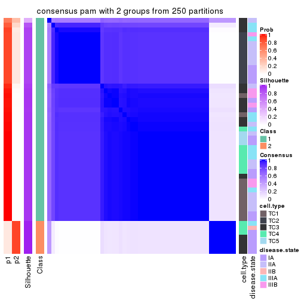</p>

</div>
<div id='tab-SD-pam-consensus-heatmap-2'>
<pre><code class="r">consensus_heatmap(res, k = 3)
</code></pre>

<p>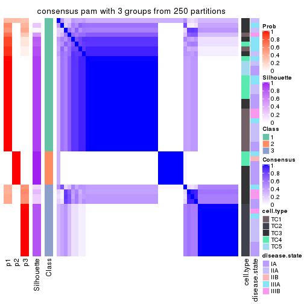</p>

</div>
<div id='tab-SD-pam-consensus-heatmap-3'>
<pre><code class="r">consensus_heatmap(res, k = 4)
</code></pre>

<p>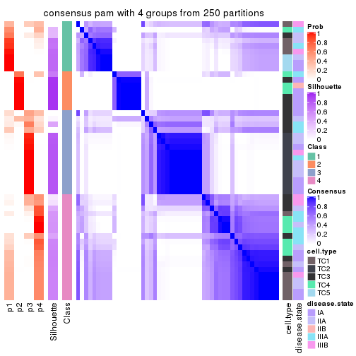</p>

</div>
<div id='tab-SD-pam-consensus-heatmap-4'>
<pre><code class="r">consensus_heatmap(res, k = 5)
</code></pre>

<p>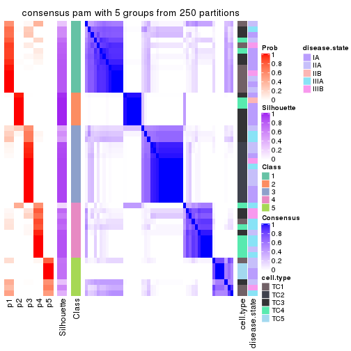</p>

</div>
<div id='tab-SD-pam-consensus-heatmap-5'>
<pre><code class="r">consensus_heatmap(res, k = 6)
</code></pre>

<p>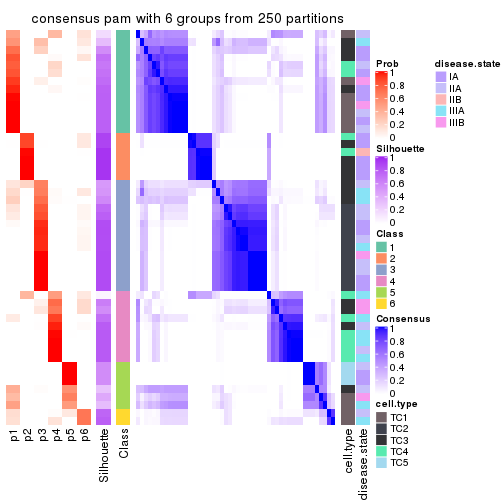</p>

</div>
</div>

Heatmaps for the membership of samples in all partitions to see how consistent they are:


<script>
$( function() {
	$( '#tabs-SD-pam-membership-heatmap' ).tabs();
} );
</script>
<div id='tabs-SD-pam-membership-heatmap'>
<ul>
<li><a href='#tab-SD-pam-membership-heatmap-1'>k = 2</a></li>
<li><a href='#tab-SD-pam-membership-heatmap-2'>k = 3</a></li>
<li><a href='#tab-SD-pam-membership-heatmap-3'>k = 4</a></li>
<li><a href='#tab-SD-pam-membership-heatmap-4'>k = 5</a></li>
<li><a href='#tab-SD-pam-membership-heatmap-5'>k = 6</a></li>
</ul>
<div id='tab-SD-pam-membership-heatmap-1'>
<pre><code class="r">membership_heatmap(res, k = 2)
</code></pre>

<p>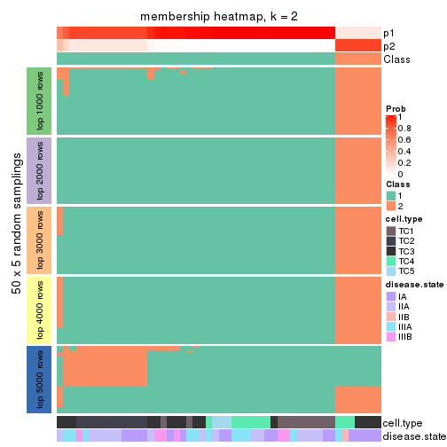</p>

</div>
<div id='tab-SD-pam-membership-heatmap-2'>
<pre><code class="r">membership_heatmap(res, k = 3)
</code></pre>

<p>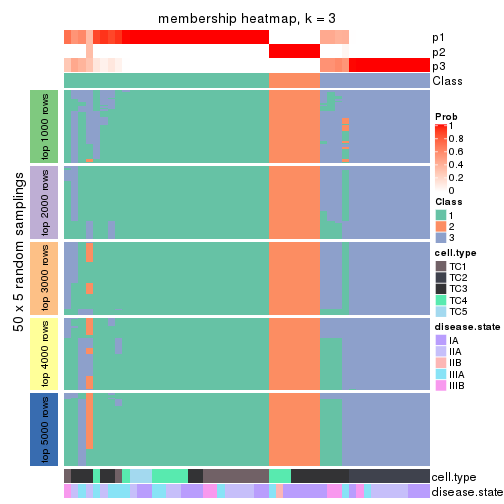</p>

</div>
<div id='tab-SD-pam-membership-heatmap-3'>
<pre><code class="r">membership_heatmap(res, k = 4)
</code></pre>

<p>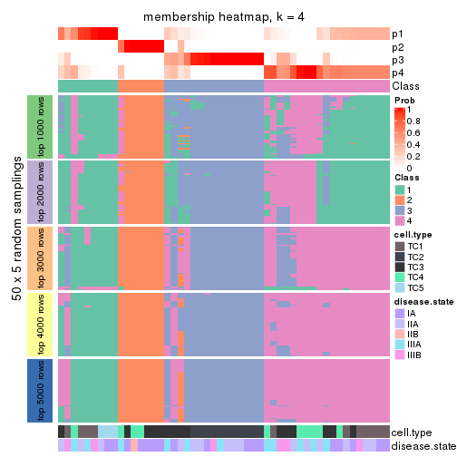</p>

</div>
<div id='tab-SD-pam-membership-heatmap-4'>
<pre><code class="r">membership_heatmap(res, k = 5)
</code></pre>

<p>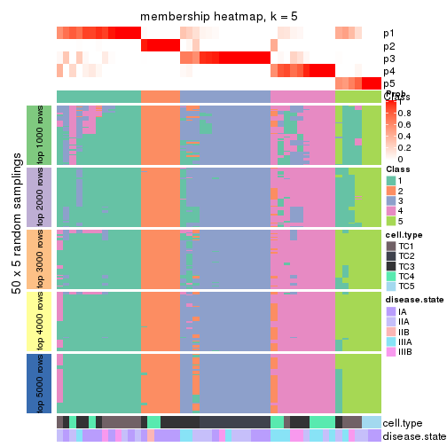</p>

</div>
<div id='tab-SD-pam-membership-heatmap-5'>
<pre><code class="r">membership_heatmap(res, k = 6)
</code></pre>

<p>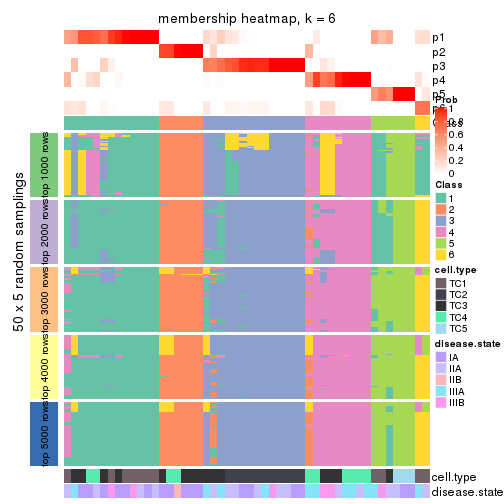</p>

</div>
</div>

As soon as we have had the classes for columns, we can look for signatures
which are significantly different between classes which can be candidate marks
for certain classes. Following are the heatmaps for signatures.


Signature heatmaps where rows are scaled:


<script>
$( function() {
	$( '#tabs-SD-pam-get-signatures' ).tabs();
} );
</script>
<div id='tabs-SD-pam-get-signatures'>
<ul>
<li><a href='#tab-SD-pam-get-signatures-1'>k = 2</a></li>
<li><a href='#tab-SD-pam-get-signatures-2'>k = 3</a></li>
<li><a href='#tab-SD-pam-get-signatures-3'>k = 4</a></li>
<li><a href='#tab-SD-pam-get-signatures-4'>k = 5</a></li>
<li><a href='#tab-SD-pam-get-signatures-5'>k = 6</a></li>
</ul>
<div id='tab-SD-pam-get-signatures-1'>
<pre><code class="r">get_signatures(res, k = 2)
</code></pre>

<p>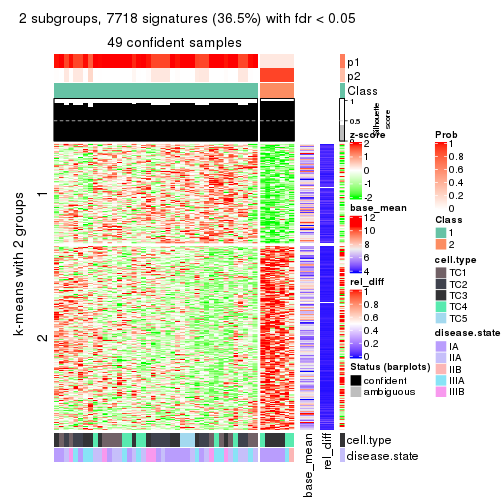</p>

</div>
<div id='tab-SD-pam-get-signatures-2'>
<pre><code class="r">get_signatures(res, k = 3)
</code></pre>

<p>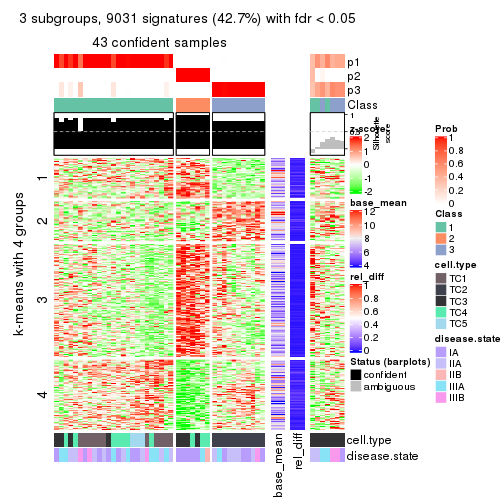</p>

</div>
<div id='tab-SD-pam-get-signatures-3'>
<pre><code class="r">get_signatures(res, k = 4)
</code></pre>

<p>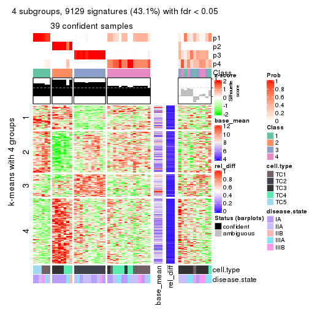</p>

</div>
<div id='tab-SD-pam-get-signatures-4'>
<pre><code class="r">get_signatures(res, k = 5)
</code></pre>

<p>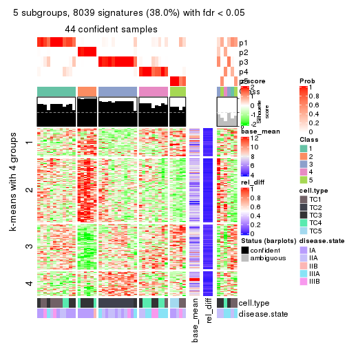</p>

</div>
<div id='tab-SD-pam-get-signatures-5'>
<pre><code class="r">get_signatures(res, k = 6)
</code></pre>

<p>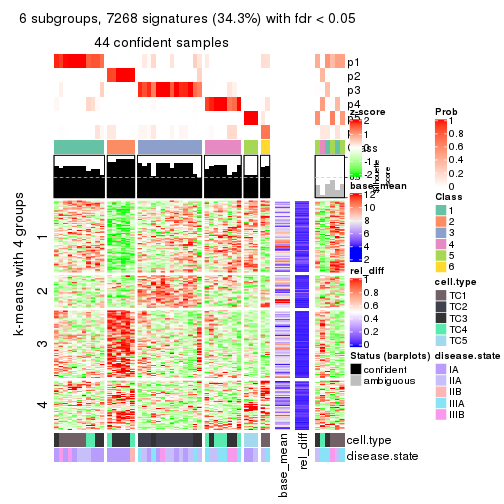</p>

</div>
</div>


Signature heatmaps where rows are not scaled:


<script>
$( function() {
	$( '#tabs-SD-pam-get-signatures-no-scale' ).tabs();
} );
</script>
<div id='tabs-SD-pam-get-signatures-no-scale'>
<ul>
<li><a href='#tab-SD-pam-get-signatures-no-scale-1'>k = 2</a></li>
<li><a href='#tab-SD-pam-get-signatures-no-scale-2'>k = 3</a></li>
<li><a href='#tab-SD-pam-get-signatures-no-scale-3'>k = 4</a></li>
<li><a href='#tab-SD-pam-get-signatures-no-scale-4'>k = 5</a></li>
<li><a href='#tab-SD-pam-get-signatures-no-scale-5'>k = 6</a></li>
</ul>
<div id='tab-SD-pam-get-signatures-no-scale-1'>
<pre><code class="r">get_signatures(res, k = 2, scale_rows = FALSE)
</code></pre>

<p>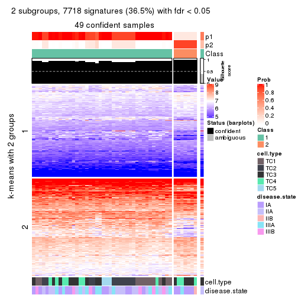</p>

</div>
<div id='tab-SD-pam-get-signatures-no-scale-2'>
<pre><code class="r">get_signatures(res, k = 3, scale_rows = FALSE)
</code></pre>

<p>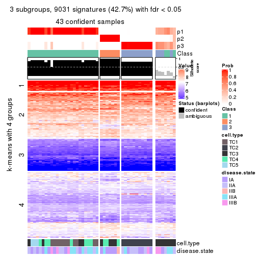</p>

</div>
<div id='tab-SD-pam-get-signatures-no-scale-3'>
<pre><code class="r">get_signatures(res, k = 4, scale_rows = FALSE)
</code></pre>

<p>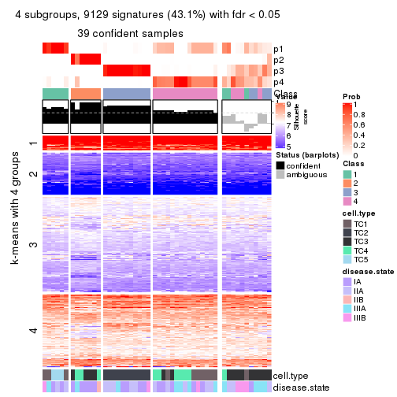</p>

</div>
<div id='tab-SD-pam-get-signatures-no-scale-4'>
<pre><code class="r">get_signatures(res, k = 5, scale_rows = FALSE)
</code></pre>

<p>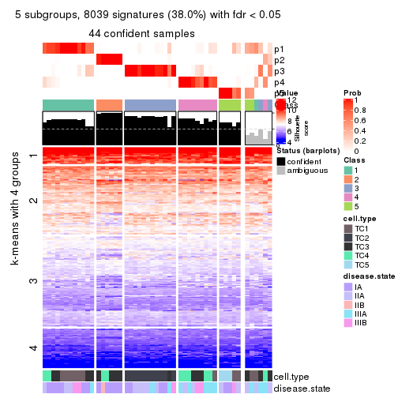</p>

</div>
<div id='tab-SD-pam-get-signatures-no-scale-5'>
<pre><code class="r">get_signatures(res, k = 6, scale_rows = FALSE)
</code></pre>

<p>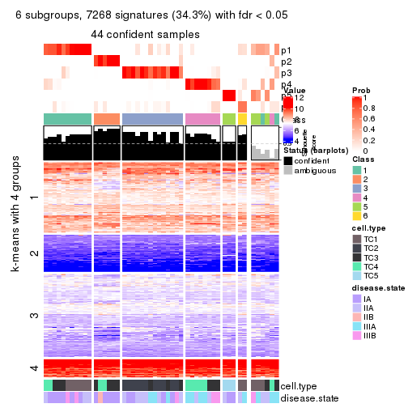</p>

</div>
</div>


Compare the overlap of signatures from different k:

```r
compare_signatures(res)
```

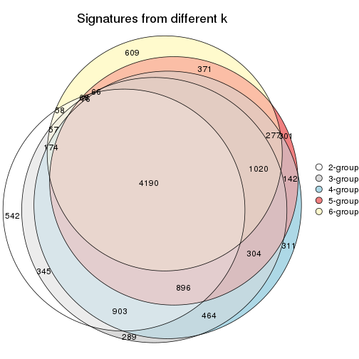

`get_signature()` returns a data frame invisibly. TO get the list of signatures, the function
call should be assigned to a variable explicitly. In following code, if `plot` argument is set
to `FALSE`, no heatmap is plotted while only the differential analysis is performed.

```r
# code only for demonstration
tb = get_signature(res, k = ..., plot = FALSE)
```

An example of the output of `tb` is:

```
#>   which_row         fdr    mean_1    mean_2 scaled_mean_1 scaled_mean_2 km
#> 1        38 0.042760348  8.373488  9.131774    -0.5533452     0.5164555  1
#> 2        40 0.018707592  7.106213  8.469186    -0.6173731     0.5762149  1
#> 3        55 0.019134737 10.221463 11.207825    -0.6159697     0.5749050  1
#> 4        59 0.006059896  5.921854  7.869574    -0.6899429     0.6439467  1
#> 5        60 0.018055526  8.928898 10.211722    -0.6204761     0.5791110  1
#> 6        98 0.009384629 15.714769 14.887706     0.6635654    -0.6193277  2
...
```

The columns in `tb` are:

1. `which_row`: row indices corresponding to the input matrix.
2. `fdr`: FDR for the differential test. 
3. `mean_x`: The mean value in group x.
4. `scaled_mean_x`: The mean value in group x after rows are scaled.
5. `km`: Row groups if k-means clustering is applied to rows.


UMAP plot which shows how samples are separated.


<script>
$( function() {
	$( '#tabs-SD-pam-dimension-reduction' ).tabs();
} );
</script>
<div id='tabs-SD-pam-dimension-reduction'>
<ul>
<li><a href='#tab-SD-pam-dimension-reduction-1'>k = 2</a></li>
<li><a href='#tab-SD-pam-dimension-reduction-2'>k = 3</a></li>
<li><a href='#tab-SD-pam-dimension-reduction-3'>k = 4</a></li>
<li><a href='#tab-SD-pam-dimension-reduction-4'>k = 5</a></li>
<li><a href='#tab-SD-pam-dimension-reduction-5'>k = 6</a></li>
</ul>
<div id='tab-SD-pam-dimension-reduction-1'>
<pre><code class="r">dimension_reduction(res, k = 2, method = &quot;UMAP&quot;)
</code></pre>

<p>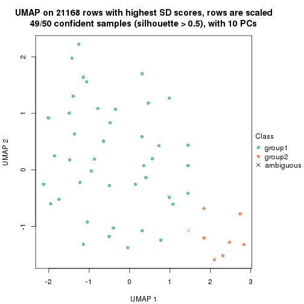</p>

</div>
<div id='tab-SD-pam-dimension-reduction-2'>
<pre><code class="r">dimension_reduction(res, k = 3, method = &quot;UMAP&quot;)
</code></pre>

<p>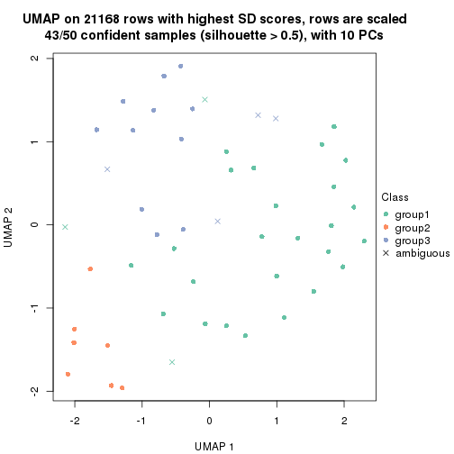</p>

</div>
<div id='tab-SD-pam-dimension-reduction-3'>
<pre><code class="r">dimension_reduction(res, k = 4, method = &quot;UMAP&quot;)
</code></pre>

<p>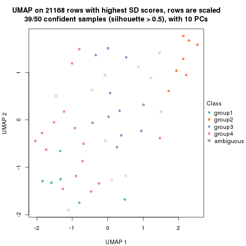</p>

</div>
<div id='tab-SD-pam-dimension-reduction-4'>
<pre><code class="r">dimension_reduction(res, k = 5, method = &quot;UMAP&quot;)
</code></pre>

<p>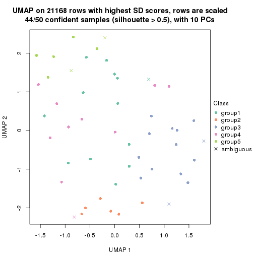</p>

</div>
<div id='tab-SD-pam-dimension-reduction-5'>
<pre><code class="r">dimension_reduction(res, k = 6, method = &quot;UMAP&quot;)
</code></pre>

<p>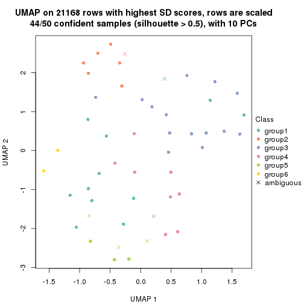</p>

</div>
</div>


Following heatmap shows how subgroups are split when increasing `k`:

```r
collect_classes(res)
```

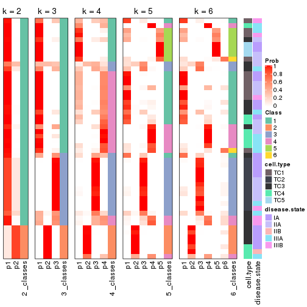


Test correlation between subgroups and known annotations. If the known
annotation is numeric, one-way ANOVA test is applied, and if the known
annotation is discrete, chi-squared contingency table test is applied.

```r
test_to_known_factors(res)
```

```
#>         n cell.type(p) disease.state(p) k
#> SD:pam 49     7.44e-02           0.0126 2
#> SD:pam 43     7.68e-09           0.1041 3
#> SD:pam 39     2.42e-10           0.4563 4
#> SD:pam 44     2.56e-10           0.0343 5
#> SD:pam 44     6.34e-13           0.0622 6
```


If matrix rows can be associated to genes, consider to use `functional_enrichment(res,
...)` to perform function enrichment for the signature genes. See [this vignette](http://bioconductor.org/packages/devel/bioc/vignettes/cola/inst/doc/functional_enrichment.html) for more detailed explanations.


 

---------------------------------------------------


### SD:mclust*


The object with results only for a single top-value method and a single partition method 
can be extracted as:

```r
res = res_list["SD", "mclust"]
# you can also extract it by
# res = res_list["SD:mclust"]
```

A summary of `res` and all the functions that can be applied to it:

```r
res
```

```
#> A 'ConsensusPartition' object with k = 2, 3, 4, 5, 6.
#>   On a matrix with 21168 rows and 50 columns.
#>   Top rows (1000, 2000, 3000, 4000, 5000) are extracted by 'SD' method.
#>   Subgroups are detected by 'mclust' method.
#>   Performed in total 1250 partitions by row resampling.
#>   Best k for subgroups seems to be 4.
#> 
#> Following methods can be applied to this 'ConsensusPartition' object:
#>  [1] "cola_report"             "collect_classes"         "collect_plots"          
#>  [4] "collect_stats"           "colnames"                "compare_signatures"     
#>  [7] "consensus_heatmap"       "dimension_reduction"     "functional_enrichment"  
#> [10] "get_anno_col"            "get_anno"                "get_classes"            
#> [13] "get_consensus"           "get_matrix"              "get_membership"         
#> [16] "get_param"               "get_signatures"          "get_stats"              
#> [19] "is_best_k"               "is_stable_k"             "membership_heatmap"     
#> [22] "ncol"                    "nrow"                    "plot_ecdf"              
#> [25] "rownames"                "select_partition_number" "show"                   
#> [28] "suggest_best_k"          "test_to_known_factors"
```

`collect_plots()` function collects all the plots made from `res` for all `k` (number of partitions)
into one single page to provide an easy and fast comparison between different `k`.

```r
collect_plots(res)
```

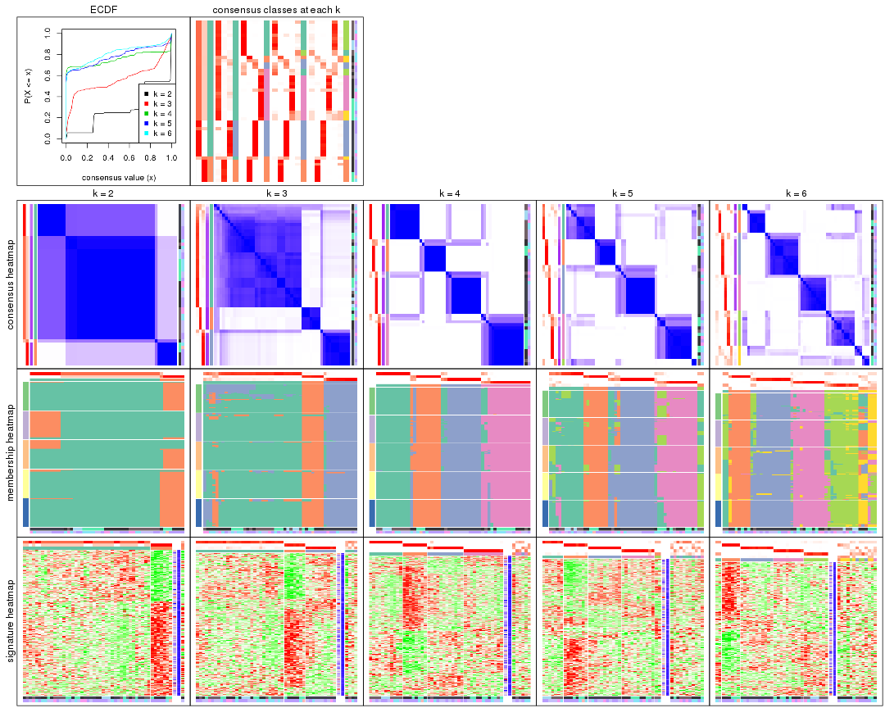

The plots are:

- The first row: a plot of the ECDF (empirical cumulative distribution
  function) curves of the consensus matrix for each `k` and the heatmap of
  predicted classes for each `k`.
- The second row: heatmaps of the consensus matrix for each `k`.
- The third row: heatmaps of the membership matrix for each `k`.
- The fouth row: heatmaps of the signatures for each `k`.

All the plots in panels can be made by individual functions and they are
plotted later in this section.

`select_partition_number()` produces several plots showing different
statistics for choosing "optimized" `k`. There are following statistics:

- ECDF curves of the consensus matrix for each `k`;
- 1-PAC. [The PAC
  score](https://en.wikipedia.org/wiki/Consensus_clustering#Over-interpretation_potential_of_consensus_clustering)
  measures the proportion of the ambiguous subgrouping.
- Mean silhouette score.
- Concordance. The mean probability of fiting the consensus class ids in all
  partitions.
- Area increased. Denote $A_k$ as the area under the ECDF curve for current
  `k`, the area increased is defined as $A_k - A_{k-1}$.
- Rand index. The percent of pairs of samples that are both in a same cluster
  or both are not in a same cluster in the partition of k and k-1.
- Jaccard index. The ratio of pairs of samples are both in a same cluster in
  the partition of k and k-1 and the pairs of samples are both in a same
  cluster in the partition k or k-1.

The detailed explanations of these statistics can be found in [the _cola_
vignette](http://bioconductor.org/packages/devel/bioc/vignettes/cola/inst/doc/cola.html#toc_13).

Generally speaking, lower PAC score, higher mean silhouette score or higher
concordance corresponds to better partition. Rand index and Jaccard index
measure how similar the current partition is compared to partition with `k-1`.
If they are too similar, we won't accept `k` is better than `k-1`.

```r
select_partition_number(res)
```

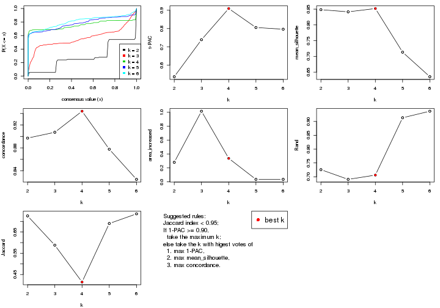

The numeric values for all these statistics can be obtained by `get_stats()`.

```r
get_stats(res)
```

```
#>   k 1-PAC mean_silhouette concordance area_increased  Rand Jaccard
#> 2 2 0.537           0.848       0.897         0.2805 0.726   0.726
#> 3 3 0.739           0.842       0.907         1.0156 0.691   0.588
#> 4 4 0.909           0.852       0.944         0.3374 0.706   0.415
#> 5 5 0.806           0.713       0.878         0.0352 0.913   0.690
#> 6 6 0.796           0.636       0.825         0.0354 0.937   0.735
```

`suggest_best_k()` suggests the best $k$ based on these statistics. The rules are as follows:

- All $k$ with Jaccard index larger than 0.95 are removed because increasing
  $k$ does not provide enough extra information. If all $k$ are removed, it is
  marked as no subgroup is detected.
- For all $k$ with 1-PAC score larger than 0.9, the maximal $k$ is taken as
  the best $k$, and other $k$ are marked as optional $k$.
- If it does not fit the second rule. The $k$ with the maximal vote of the
  highest 1-PAC score, highest mean silhouette, and highest concordance is
  taken as the best $k$.

```r
suggest_best_k(res)
```

```
#> [1] 4
```


Following shows the table of the partitions (You need to click the **show/hide
code output** link to see it). The membership matrix (columns with name `p*`)
is inferred by
[`clue::cl_consensus()`](https://www.rdocumentation.org/link/cl_consensus?package=clue)
function with the `SE` method. Basically the value in the membership matrix
represents the probability to belong to a certain group. The finall class
label for an item is determined with the group with highest probability it
belongs to.

In `get_classes()` function, the entropy is calculated from the membership
matrix and the silhouette score is calculated from the consensus matrix.


<script>
$( function() {
	$( '#tabs-SD-mclust-get-classes' ).tabs();
} );
</script>
<div id='tabs-SD-mclust-get-classes'>
<ul>
<li><a href='#tab-SD-mclust-get-classes-1'>k = 2</a></li>
<li><a href='#tab-SD-mclust-get-classes-2'>k = 3</a></li>
<li><a href='#tab-SD-mclust-get-classes-3'>k = 4</a></li>
<li><a href='#tab-SD-mclust-get-classes-4'>k = 5</a></li>
<li><a href='#tab-SD-mclust-get-classes-5'>k = 6</a></li>
</ul>

<div id='tab-SD-mclust-get-classes-1'>
<p><a id='tab-SD-mclust-get-classes-1-a' style='color:#0366d6' href='#'>show/hide code output</a></p>
<pre><code class="r">cbind(get_classes(res, k = 2), get_membership(res, k = 2))
</code></pre>

<pre><code>#&gt;          class entropy silhouette    p1    p2
#&gt; GSM63448     1  0.8267      0.905 0.740 0.260
#&gt; GSM63449     1  0.8267      0.905 0.740 0.260
#&gt; GSM63423     1  0.8267      0.905 0.740 0.260
#&gt; GSM63425     1  0.8267      0.905 0.740 0.260
#&gt; GSM63437     1  0.8267      0.905 0.740 0.260
#&gt; GSM63453     1  0.8267      0.905 0.740 0.260
#&gt; GSM63431     1  0.8267      0.905 0.740 0.260
#&gt; GSM63450     1  0.8267      0.905 0.740 0.260
#&gt; GSM63428     1  0.8267      0.905 0.740 0.260
#&gt; GSM63432     1  0.8386      0.899 0.732 0.268
#&gt; GSM63458     1  0.8267      0.905 0.740 0.260
#&gt; GSM63434     1  0.0672      0.686 0.992 0.008
#&gt; GSM63435     1  0.0672      0.686 0.992 0.008
#&gt; GSM63442     1  0.8327      0.897 0.736 0.264
#&gt; GSM63451     1  0.0672      0.686 0.992 0.008
#&gt; GSM63422     1  0.0672      0.686 0.992 0.008
#&gt; GSM63438     1  0.0672      0.686 0.992 0.008
#&gt; GSM63439     1  0.0672      0.686 0.992 0.008
#&gt; GSM63461     1  0.0672      0.686 0.992 0.008
#&gt; GSM63463     1  0.0672      0.686 0.992 0.008
#&gt; GSM63430     1  0.0672      0.686 0.992 0.008
#&gt; GSM63446     1  0.0672      0.686 0.992 0.008
#&gt; GSM63429     1  0.8267      0.905 0.740 0.260
#&gt; GSM63445     1  0.8267      0.905 0.740 0.260
#&gt; GSM63447     1  0.8267      0.905 0.740 0.260
#&gt; GSM63459     2  0.0000      0.931 0.000 1.000
#&gt; GSM63464     2  0.0000      0.931 0.000 1.000
#&gt; GSM63469     2  0.0000      0.931 0.000 1.000
#&gt; GSM63470     2  0.0000      0.931 0.000 1.000
#&gt; GSM63436     1  0.8267      0.905 0.740 0.260
#&gt; GSM63443     2  0.9323      0.108 0.348 0.652
#&gt; GSM63465     1  0.8267      0.905 0.740 0.260
#&gt; GSM63444     1  0.8386      0.899 0.732 0.268
#&gt; GSM63456     1  0.8386      0.899 0.732 0.268
#&gt; GSM63462     1  0.8267      0.905 0.740 0.260
#&gt; GSM63424     1  0.8267      0.905 0.740 0.260
#&gt; GSM63440     1  0.8267      0.905 0.740 0.260
#&gt; GSM63433     1  0.8267      0.905 0.740 0.260
#&gt; GSM63466     2  0.0000      0.931 0.000 1.000
#&gt; GSM63426     1  0.8267      0.905 0.740 0.260
#&gt; GSM63468     1  0.8267      0.905 0.740 0.260
#&gt; GSM63452     2  0.0000      0.931 0.000 1.000
#&gt; GSM63441     1  0.8267      0.905 0.740 0.260
#&gt; GSM63454     1  0.8267      0.905 0.740 0.260
#&gt; GSM63455     1  0.8267      0.905 0.740 0.260
#&gt; GSM63460     2  0.0000      0.931 0.000 1.000
#&gt; GSM63467     1  0.8267      0.905 0.740 0.260
#&gt; GSM63421     1  0.8267      0.905 0.740 0.260
#&gt; GSM63427     1  0.8267      0.905 0.740 0.260
#&gt; GSM63457     1  0.8267      0.905 0.740 0.260
</code></pre>

<script>
$('#tab-SD-mclust-get-classes-1-a').parent().next().next().hide();
$('#tab-SD-mclust-get-classes-1-a').click(function(){
  $('#tab-SD-mclust-get-classes-1-a').parent().next().next().toggle();
  return(false);
});
</script>
</div>

<div id='tab-SD-mclust-get-classes-2'>
<p><a id='tab-SD-mclust-get-classes-2-a' style='color:#0366d6' href='#'>show/hide code output</a></p>
<pre><code class="r">cbind(get_classes(res, k = 3), get_membership(res, k = 3))
</code></pre>

<pre><code>#&gt;          class entropy silhouette    p1    p2    p3
#&gt; GSM63448     1  0.3134     0.8885 0.916 0.032 0.052
#&gt; GSM63449     1  0.2356     0.8759 0.928 0.000 0.072
#&gt; GSM63423     1  0.2527     0.8825 0.936 0.020 0.044
#&gt; GSM63425     1  0.3276     0.8754 0.908 0.024 0.068
#&gt; GSM63437     1  0.2527     0.8825 0.936 0.020 0.044
#&gt; GSM63453     1  0.2200     0.8840 0.940 0.004 0.056
#&gt; GSM63431     1  0.2031     0.8834 0.952 0.032 0.016
#&gt; GSM63450     1  0.2200     0.8840 0.940 0.004 0.056
#&gt; GSM63428     1  0.2261     0.8776 0.932 0.000 0.068
#&gt; GSM63432     1  0.6095     0.3880 0.608 0.000 0.392
#&gt; GSM63458     1  0.1525     0.8840 0.964 0.032 0.004
#&gt; GSM63434     3  0.0848     0.9214 0.008 0.008 0.984
#&gt; GSM63435     3  0.0000     0.9244 0.000 0.000 1.000
#&gt; GSM63442     3  0.6180     0.0677 0.416 0.000 0.584
#&gt; GSM63451     3  0.0661     0.9236 0.004 0.008 0.988
#&gt; GSM63422     3  0.0000     0.9244 0.000 0.000 1.000
#&gt; GSM63438     3  0.0000     0.9244 0.000 0.000 1.000
#&gt; GSM63439     3  0.0424     0.9241 0.000 0.008 0.992
#&gt; GSM63461     3  0.0000     0.9244 0.000 0.000 1.000
#&gt; GSM63463     3  0.0424     0.9241 0.000 0.008 0.992
#&gt; GSM63430     3  0.0424     0.9241 0.000 0.008 0.992
#&gt; GSM63446     3  0.1950     0.8860 0.040 0.008 0.952
#&gt; GSM63429     1  0.3276     0.8754 0.908 0.024 0.068
#&gt; GSM63445     1  0.2878     0.8788 0.904 0.000 0.096
#&gt; GSM63447     1  0.3112     0.8793 0.916 0.028 0.056
#&gt; GSM63459     2  0.0892     0.9775 0.020 0.980 0.000
#&gt; GSM63464     2  0.0892     0.9775 0.020 0.980 0.000
#&gt; GSM63469     2  0.0892     0.9775 0.020 0.980 0.000
#&gt; GSM63470     2  0.1860     0.9718 0.052 0.948 0.000
#&gt; GSM63436     1  0.2176     0.8880 0.948 0.032 0.020
#&gt; GSM63443     1  0.9370     0.1143 0.416 0.416 0.168
#&gt; GSM63465     1  0.2998     0.8784 0.916 0.016 0.068
#&gt; GSM63444     1  0.7757     0.3900 0.540 0.408 0.052
#&gt; GSM63456     1  0.7697     0.6168 0.644 0.084 0.272
#&gt; GSM63462     1  0.3590     0.8827 0.896 0.028 0.076
#&gt; GSM63424     1  0.5816     0.7294 0.752 0.024 0.224
#&gt; GSM63440     1  0.4618     0.8350 0.840 0.024 0.136
#&gt; GSM63433     1  0.1031     0.8816 0.976 0.024 0.000
#&gt; GSM63466     2  0.1860     0.9718 0.052 0.948 0.000
#&gt; GSM63426     1  0.1031     0.8816 0.976 0.024 0.000
#&gt; GSM63468     1  0.2982     0.8796 0.920 0.024 0.056
#&gt; GSM63452     2  0.1315     0.9736 0.020 0.972 0.008
#&gt; GSM63441     1  0.3181     0.8770 0.912 0.024 0.064
#&gt; GSM63454     1  0.3181     0.8770 0.912 0.024 0.064
#&gt; GSM63455     1  0.1031     0.8816 0.976 0.024 0.000
#&gt; GSM63460     2  0.1860     0.9718 0.052 0.948 0.000
#&gt; GSM63467     1  0.2301     0.8831 0.936 0.004 0.060
#&gt; GSM63421     1  0.1525     0.8838 0.964 0.032 0.004
#&gt; GSM63427     1  0.1877     0.8838 0.956 0.032 0.012
#&gt; GSM63457     1  0.1289     0.8834 0.968 0.032 0.000
</code></pre>

<script>
$('#tab-SD-mclust-get-classes-2-a').parent().next().next().hide();
$('#tab-SD-mclust-get-classes-2-a').click(function(){
  $('#tab-SD-mclust-get-classes-2-a').parent().next().next().toggle();
  return(false);
});
</script>
</div>

<div id='tab-SD-mclust-get-classes-3'>
<p><a id='tab-SD-mclust-get-classes-3-a' style='color:#0366d6' href='#'>show/hide code output</a></p>
<pre><code class="r">cbind(get_classes(res, k = 4), get_membership(res, k = 4))
</code></pre>

<pre><code>#&gt;          class entropy silhouette    p1    p2    p3    p4
#&gt; GSM63448     4  0.4877      0.498 0.328 0.000 0.008 0.664
#&gt; GSM63449     1  0.0336      0.991 0.992 0.000 0.008 0.000
#&gt; GSM63423     1  0.0000      0.998 1.000 0.000 0.000 0.000
#&gt; GSM63425     4  0.0000      0.911 0.000 0.000 0.000 1.000
#&gt; GSM63437     1  0.0000      0.998 1.000 0.000 0.000 0.000
#&gt; GSM63453     1  0.0000      0.998 1.000 0.000 0.000 0.000
#&gt; GSM63431     1  0.0000      0.998 1.000 0.000 0.000 0.000
#&gt; GSM63450     1  0.0000      0.998 1.000 0.000 0.000 0.000
#&gt; GSM63428     1  0.0336      0.991 0.992 0.000 0.008 0.000
#&gt; GSM63432     3  0.4250      0.619 0.276 0.000 0.724 0.000
#&gt; GSM63458     1  0.0000      0.998 1.000 0.000 0.000 0.000
#&gt; GSM63434     3  0.0000      0.931 0.000 0.000 1.000 0.000
#&gt; GSM63435     3  0.0000      0.931 0.000 0.000 1.000 0.000
#&gt; GSM63442     3  0.0000      0.931 0.000 0.000 1.000 0.000
#&gt; GSM63451     3  0.0000      0.931 0.000 0.000 1.000 0.000
#&gt; GSM63422     3  0.0000      0.931 0.000 0.000 1.000 0.000
#&gt; GSM63438     3  0.0000      0.931 0.000 0.000 1.000 0.000
#&gt; GSM63439     3  0.0000      0.931 0.000 0.000 1.000 0.000
#&gt; GSM63461     3  0.0000      0.931 0.000 0.000 1.000 0.000
#&gt; GSM63463     3  0.0000      0.931 0.000 0.000 1.000 0.000
#&gt; GSM63430     3  0.0000      0.931 0.000 0.000 1.000 0.000
#&gt; GSM63446     3  0.0000      0.931 0.000 0.000 1.000 0.000
#&gt; GSM63429     4  0.0000      0.911 0.000 0.000 0.000 1.000
#&gt; GSM63445     3  0.4843      0.377 0.396 0.000 0.604 0.000
#&gt; GSM63447     4  0.0336      0.906 0.000 0.008 0.000 0.992
#&gt; GSM63459     2  0.0000      0.893 0.000 1.000 0.000 0.000
#&gt; GSM63464     2  0.0000      0.893 0.000 1.000 0.000 0.000
#&gt; GSM63469     2  0.0000      0.893 0.000 1.000 0.000 0.000
#&gt; GSM63470     2  0.0000      0.893 0.000 1.000 0.000 0.000
#&gt; GSM63436     4  0.4989      0.140 0.472 0.000 0.000 0.528
#&gt; GSM63443     2  0.4916      0.315 0.000 0.576 0.424 0.000
#&gt; GSM63465     4  0.0000      0.911 0.000 0.000 0.000 1.000
#&gt; GSM63444     2  0.0000      0.893 0.000 1.000 0.000 0.000
#&gt; GSM63456     2  0.5163      0.052 0.004 0.516 0.480 0.000
#&gt; GSM63462     4  0.5130      0.438 0.016 0.000 0.332 0.652
#&gt; GSM63424     4  0.0000      0.911 0.000 0.000 0.000 1.000
#&gt; GSM63440     4  0.0000      0.911 0.000 0.000 0.000 1.000
#&gt; GSM63433     4  0.0000      0.911 0.000 0.000 0.000 1.000
#&gt; GSM63466     2  0.0000      0.893 0.000 1.000 0.000 0.000
#&gt; GSM63426     4  0.0000      0.911 0.000 0.000 0.000 1.000
#&gt; GSM63468     4  0.0000      0.911 0.000 0.000 0.000 1.000
#&gt; GSM63452     2  0.0000      0.893 0.000 1.000 0.000 0.000
#&gt; GSM63441     4  0.0000      0.911 0.000 0.000 0.000 1.000
#&gt; GSM63454     4  0.0000      0.911 0.000 0.000 0.000 1.000
#&gt; GSM63455     4  0.1118      0.886 0.036 0.000 0.000 0.964
#&gt; GSM63460     2  0.0000      0.893 0.000 1.000 0.000 0.000
#&gt; GSM63467     4  0.0000      0.911 0.000 0.000 0.000 1.000
#&gt; GSM63421     1  0.0000      0.998 1.000 0.000 0.000 0.000
#&gt; GSM63427     1  0.0000      0.998 1.000 0.000 0.000 0.000
#&gt; GSM63457     1  0.0000      0.998 1.000 0.000 0.000 0.000
</code></pre>

<script>
$('#tab-SD-mclust-get-classes-3-a').parent().next().next().hide();
$('#tab-SD-mclust-get-classes-3-a').click(function(){
  $('#tab-SD-mclust-get-classes-3-a').parent().next().next().toggle();
  return(false);
});
</script>
</div>

<div id='tab-SD-mclust-get-classes-4'>
<p><a id='tab-SD-mclust-get-classes-4-a' style='color:#0366d6' href='#'>show/hide code output</a></p>
<pre><code class="r">cbind(get_classes(res, k = 5), get_membership(res, k = 5))
</code></pre>

<pre><code>#&gt;          class entropy silhouette    p1    p2    p3    p4    p5
#&gt; GSM63448     1  0.4642     0.2546 0.660 0.000 0.000 0.308 0.032
#&gt; GSM63449     1  0.4045    -0.3594 0.644 0.000 0.000 0.000 0.356
#&gt; GSM63423     1  0.0290     0.6927 0.992 0.000 0.000 0.000 0.008
#&gt; GSM63425     4  0.0404     0.8554 0.000 0.000 0.000 0.988 0.012
#&gt; GSM63437     1  0.0162     0.6947 0.996 0.000 0.000 0.000 0.004
#&gt; GSM63453     5  0.4210     1.0000 0.412 0.000 0.000 0.000 0.588
#&gt; GSM63431     1  0.0404     0.6991 0.988 0.000 0.000 0.000 0.012
#&gt; GSM63450     5  0.4210     1.0000 0.412 0.000 0.000 0.000 0.588
#&gt; GSM63428     1  0.5251    -0.0443 0.680 0.000 0.136 0.000 0.184
#&gt; GSM63432     3  0.3999     0.3946 0.344 0.000 0.656 0.000 0.000
#&gt; GSM63458     1  0.1831     0.6791 0.920 0.000 0.000 0.004 0.076
#&gt; GSM63434     3  0.0000     0.8611 0.000 0.000 1.000 0.000 0.000
#&gt; GSM63435     3  0.0000     0.8611 0.000 0.000 1.000 0.000 0.000
#&gt; GSM63442     3  0.0000     0.8611 0.000 0.000 1.000 0.000 0.000
#&gt; GSM63451     3  0.0000     0.8611 0.000 0.000 1.000 0.000 0.000
#&gt; GSM63422     3  0.0000     0.8611 0.000 0.000 1.000 0.000 0.000
#&gt; GSM63438     3  0.0000     0.8611 0.000 0.000 1.000 0.000 0.000
#&gt; GSM63439     3  0.0000     0.8611 0.000 0.000 1.000 0.000 0.000
#&gt; GSM63461     3  0.0000     0.8611 0.000 0.000 1.000 0.000 0.000
#&gt; GSM63463     3  0.0000     0.8611 0.000 0.000 1.000 0.000 0.000
#&gt; GSM63430     3  0.0000     0.8611 0.000 0.000 1.000 0.000 0.000
#&gt; GSM63446     3  0.0000     0.8611 0.000 0.000 1.000 0.000 0.000
#&gt; GSM63429     4  0.0162     0.8573 0.000 0.000 0.000 0.996 0.004
#&gt; GSM63445     3  0.4826     0.0583 0.472 0.000 0.508 0.000 0.020
#&gt; GSM63447     4  0.1493     0.8297 0.000 0.028 0.000 0.948 0.024
#&gt; GSM63459     2  0.0000     0.9728 0.000 1.000 0.000 0.000 0.000
#&gt; GSM63464     2  0.1671     0.9308 0.000 0.924 0.000 0.000 0.076
#&gt; GSM63469     2  0.0000     0.9728 0.000 1.000 0.000 0.000 0.000
#&gt; GSM63470     2  0.0000     0.9728 0.000 1.000 0.000 0.000 0.000
#&gt; GSM63436     1  0.4125     0.4687 0.772 0.000 0.000 0.172 0.056
#&gt; GSM63443     3  0.6682     0.2956 0.036 0.316 0.528 0.000 0.120
#&gt; GSM63465     4  0.0000     0.8577 0.000 0.000 0.000 1.000 0.000
#&gt; GSM63444     2  0.2674     0.8814 0.004 0.856 0.000 0.000 0.140
#&gt; GSM63456     3  0.6006     0.3757 0.000 0.300 0.556 0.000 0.144
#&gt; GSM63462     4  0.7023     0.0745 0.308 0.000 0.260 0.420 0.012
#&gt; GSM63424     4  0.0162     0.8573 0.000 0.000 0.000 0.996 0.004
#&gt; GSM63440     4  0.0162     0.8573 0.000 0.000 0.000 0.996 0.004
#&gt; GSM63433     4  0.4612     0.6709 0.056 0.000 0.000 0.712 0.232
#&gt; GSM63466     2  0.0000     0.9728 0.000 1.000 0.000 0.000 0.000
#&gt; GSM63426     4  0.6153     0.4908 0.208 0.000 0.000 0.560 0.232
#&gt; GSM63468     4  0.0000     0.8577 0.000 0.000 0.000 1.000 0.000
#&gt; GSM63452     2  0.0000     0.9728 0.000 1.000 0.000 0.000 0.000
#&gt; GSM63441     4  0.0000     0.8577 0.000 0.000 0.000 1.000 0.000
#&gt; GSM63454     4  0.0000     0.8577 0.000 0.000 0.000 1.000 0.000
#&gt; GSM63455     4  0.6177     0.4841 0.212 0.000 0.000 0.556 0.232
#&gt; GSM63460     2  0.0000     0.9728 0.000 1.000 0.000 0.000 0.000
#&gt; GSM63467     4  0.0162     0.8564 0.004 0.000 0.000 0.996 0.000
#&gt; GSM63421     1  0.1478     0.6900 0.936 0.000 0.000 0.000 0.064
#&gt; GSM63427     1  0.0162     0.6970 0.996 0.000 0.000 0.000 0.004
#&gt; GSM63457     1  0.1544     0.6888 0.932 0.000 0.000 0.000 0.068
</code></pre>

<script>
$('#tab-SD-mclust-get-classes-4-a').parent().next().next().hide();
$('#tab-SD-mclust-get-classes-4-a').click(function(){
  $('#tab-SD-mclust-get-classes-4-a').parent().next().next().toggle();
  return(false);
});
</script>
</div>

<div id='tab-SD-mclust-get-classes-5'>
<p><a id='tab-SD-mclust-get-classes-5-a' style='color:#0366d6' href='#'>show/hide code output</a></p>
<pre><code class="r">cbind(get_classes(res, k = 6), get_membership(res, k = 6))
</code></pre>

<pre><code>#&gt;          class entropy silhouette    p1    p2    p3    p4    p5    p6
#&gt; GSM63448     5  0.6232   -0.03784 0.240 0.000 0.000 0.372 0.380 0.008
#&gt; GSM63449     5  0.3081    0.05723 0.220 0.000 0.000 0.000 0.776 0.004
#&gt; GSM63423     5  0.0713    0.60226 0.028 0.000 0.000 0.000 0.972 0.000
#&gt; GSM63425     4  0.2201    0.81602 0.048 0.000 0.000 0.900 0.000 0.052
#&gt; GSM63437     5  0.0713    0.60226 0.028 0.000 0.000 0.000 0.972 0.000
#&gt; GSM63453     1  0.3860    0.98381 0.528 0.000 0.000 0.000 0.472 0.000
#&gt; GSM63431     5  0.1297    0.61122 0.012 0.000 0.000 0.000 0.948 0.040
#&gt; GSM63450     1  0.3864    0.98376 0.520 0.000 0.000 0.000 0.480 0.000
#&gt; GSM63428     5  0.2062    0.50991 0.088 0.000 0.008 0.000 0.900 0.004
#&gt; GSM63432     3  0.4738    0.29188 0.036 0.000 0.596 0.000 0.356 0.012
#&gt; GSM63458     5  0.3361    0.53377 0.108 0.000 0.000 0.000 0.816 0.076
#&gt; GSM63434     3  0.0260    0.89035 0.000 0.000 0.992 0.000 0.000 0.008
#&gt; GSM63435     3  0.0937    0.88560 0.000 0.000 0.960 0.000 0.000 0.040
#&gt; GSM63442     3  0.1313    0.88034 0.000 0.000 0.952 0.004 0.016 0.028
#&gt; GSM63451     3  0.0363    0.88912 0.000 0.000 0.988 0.000 0.000 0.012
#&gt; GSM63422     3  0.0937    0.88560 0.000 0.000 0.960 0.000 0.000 0.040
#&gt; GSM63438     3  0.0363    0.89096 0.000 0.000 0.988 0.000 0.000 0.012
#&gt; GSM63439     3  0.0146    0.89099 0.000 0.000 0.996 0.000 0.000 0.004
#&gt; GSM63461     3  0.0937    0.88560 0.000 0.000 0.960 0.000 0.000 0.040
#&gt; GSM63463     3  0.0632    0.88905 0.000 0.000 0.976 0.000 0.000 0.024
#&gt; GSM63430     3  0.0146    0.89099 0.000 0.000 0.996 0.000 0.000 0.004
#&gt; GSM63446     3  0.0260    0.89035 0.000 0.000 0.992 0.000 0.000 0.008
#&gt; GSM63429     4  0.0146    0.89467 0.004 0.000 0.000 0.996 0.000 0.000
#&gt; GSM63445     3  0.6007   -0.00942 0.180 0.000 0.440 0.000 0.372 0.008
#&gt; GSM63447     4  0.2186    0.83647 0.008 0.036 0.000 0.908 0.000 0.048
#&gt; GSM63459     2  0.0000    0.91549 0.000 1.000 0.000 0.000 0.000 0.000
#&gt; GSM63464     2  0.3756    0.35043 0.000 0.600 0.000 0.000 0.000 0.400
#&gt; GSM63469     2  0.0146    0.91509 0.000 0.996 0.000 0.000 0.000 0.004
#&gt; GSM63470     2  0.0146    0.91615 0.000 0.996 0.000 0.004 0.000 0.000
#&gt; GSM63436     5  0.5805    0.14666 0.264 0.000 0.000 0.176 0.548 0.012
#&gt; GSM63443     6  0.6444    0.10808 0.004 0.228 0.208 0.000 0.040 0.520
#&gt; GSM63465     4  0.0547    0.88885 0.000 0.000 0.000 0.980 0.000 0.020
#&gt; GSM63444     6  0.3955   -0.24661 0.000 0.436 0.000 0.004 0.000 0.560
#&gt; GSM63456     6  0.5945    0.06156 0.004 0.272 0.132 0.004 0.020 0.568
#&gt; GSM63462     4  0.8038   -0.01007 0.172 0.000 0.272 0.348 0.176 0.032
#&gt; GSM63424     4  0.0291    0.89403 0.004 0.000 0.000 0.992 0.000 0.004
#&gt; GSM63440     4  0.0436    0.89265 0.004 0.000 0.004 0.988 0.000 0.004
#&gt; GSM63433     6  0.7099    0.07625 0.184 0.000 0.000 0.356 0.096 0.364
#&gt; GSM63466     2  0.0146    0.91615 0.000 0.996 0.000 0.004 0.000 0.000
#&gt; GSM63426     6  0.7405    0.15955 0.184 0.000 0.000 0.152 0.300 0.364
#&gt; GSM63468     4  0.0146    0.89444 0.004 0.000 0.000 0.996 0.000 0.000
#&gt; GSM63452     2  0.0146    0.91509 0.000 0.996 0.000 0.000 0.000 0.004
#&gt; GSM63441     4  0.0146    0.89467 0.004 0.000 0.000 0.996 0.000 0.000
#&gt; GSM63454     4  0.0000    0.89468 0.000 0.000 0.000 1.000 0.000 0.000
#&gt; GSM63455     6  0.7373    0.14861 0.184 0.000 0.000 0.144 0.308 0.364
#&gt; GSM63460     2  0.0146    0.91615 0.000 0.996 0.000 0.004 0.000 0.000
#&gt; GSM63467     4  0.1341    0.87438 0.028 0.000 0.000 0.948 0.000 0.024
#&gt; GSM63421     5  0.2308    0.60260 0.068 0.000 0.000 0.000 0.892 0.040
#&gt; GSM63427     5  0.0891    0.60817 0.024 0.000 0.000 0.000 0.968 0.008
#&gt; GSM63457     5  0.2376    0.60084 0.068 0.000 0.000 0.000 0.888 0.044
</code></pre>

<script>
$('#tab-SD-mclust-get-classes-5-a').parent().next().next().hide();
$('#tab-SD-mclust-get-classes-5-a').click(function(){
  $('#tab-SD-mclust-get-classes-5-a').parent().next().next().toggle();
  return(false);
});
</script>
</div>
</div>

Heatmaps for the consensus matrix. It visualizes the probability of two
samples to be in a same group.


<script>
$( function() {
	$( '#tabs-SD-mclust-consensus-heatmap' ).tabs();
} );
</script>
<div id='tabs-SD-mclust-consensus-heatmap'>
<ul>
<li><a href='#tab-SD-mclust-consensus-heatmap-1'>k = 2</a></li>
<li><a href='#tab-SD-mclust-consensus-heatmap-2'>k = 3</a></li>
<li><a href='#tab-SD-mclust-consensus-heatmap-3'>k = 4</a></li>
<li><a href='#tab-SD-mclust-consensus-heatmap-4'>k = 5</a></li>
<li><a href='#tab-SD-mclust-consensus-heatmap-5'>k = 6</a></li>
</ul>
<div id='tab-SD-mclust-consensus-heatmap-1'>
<pre><code class="r">consensus_heatmap(res, k = 2)
</code></pre>

<p>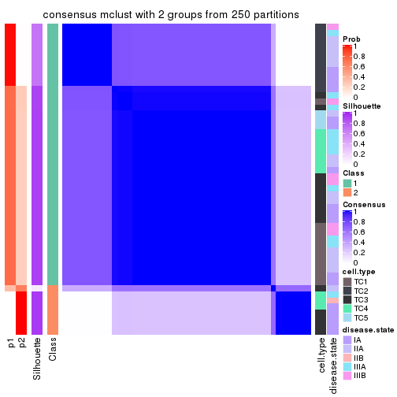</p>

</div>
<div id='tab-SD-mclust-consensus-heatmap-2'>
<pre><code class="r">consensus_heatmap(res, k = 3)
</code></pre>

<p>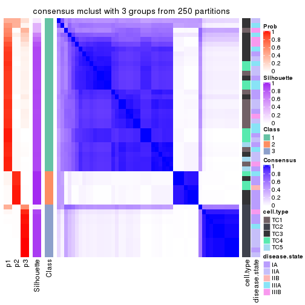</p>

</div>
<div id='tab-SD-mclust-consensus-heatmap-3'>
<pre><code class="r">consensus_heatmap(res, k = 4)
</code></pre>

<p>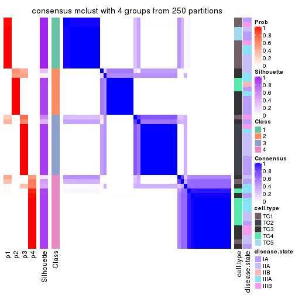</p>

</div>
<div id='tab-SD-mclust-consensus-heatmap-4'>
<pre><code class="r">consensus_heatmap(res, k = 5)
</code></pre>

<p>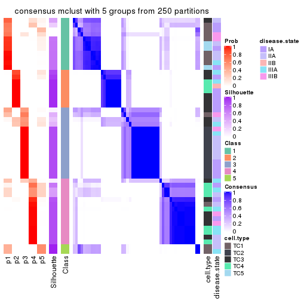</p>

</div>
<div id='tab-SD-mclust-consensus-heatmap-5'>
<pre><code class="r">consensus_heatmap(res, k = 6)
</code></pre>

<p>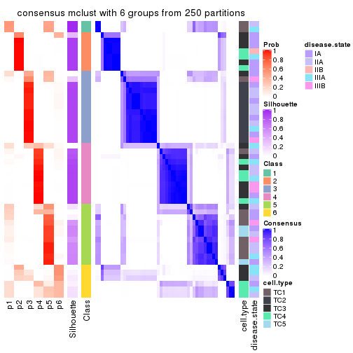</p>

</div>
</div>

Heatmaps for the membership of samples in all partitions to see how consistent they are:


<script>
$( function() {
	$( '#tabs-SD-mclust-membership-heatmap' ).tabs();
} );
</script>
<div id='tabs-SD-mclust-membership-heatmap'>
<ul>
<li><a href='#tab-SD-mclust-membership-heatmap-1'>k = 2</a></li>
<li><a href='#tab-SD-mclust-membership-heatmap-2'>k = 3</a></li>
<li><a href='#tab-SD-mclust-membership-heatmap-3'>k = 4</a></li>
<li><a href='#tab-SD-mclust-membership-heatmap-4'>k = 5</a></li>
<li><a href='#tab-SD-mclust-membership-heatmap-5'>k = 6</a></li>
</ul>
<div id='tab-SD-mclust-membership-heatmap-1'>
<pre><code class="r">membership_heatmap(res, k = 2)
</code></pre>

<p>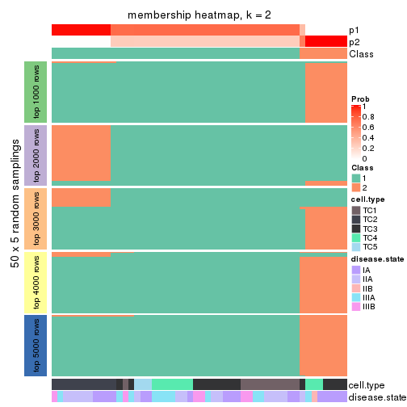</p>

</div>
<div id='tab-SD-mclust-membership-heatmap-2'>
<pre><code class="r">membership_heatmap(res, k = 3)
</code></pre>

<p>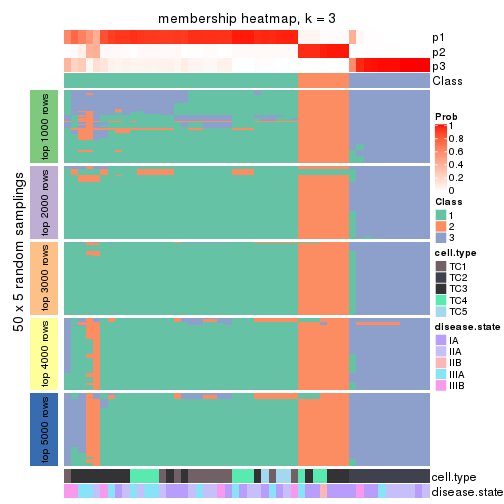</p>

</div>
<div id='tab-SD-mclust-membership-heatmap-3'>
<pre><code class="r">membership_heatmap(res, k = 4)
</code></pre>

<p>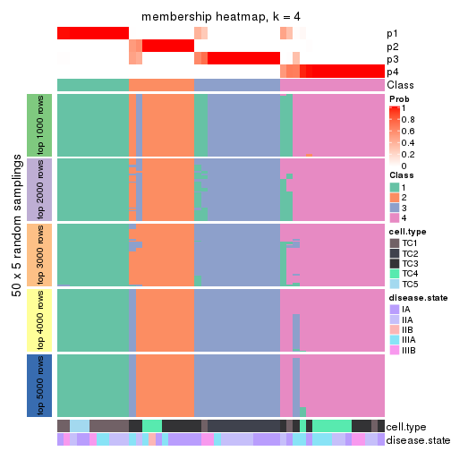</p>

</div>
<div id='tab-SD-mclust-membership-heatmap-4'>
<pre><code class="r">membership_heatmap(res, k = 5)
</code></pre>

<p>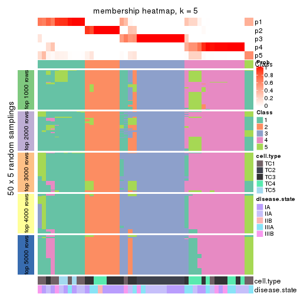</p>

</div>
<div id='tab-SD-mclust-membership-heatmap-5'>
<pre><code class="r">membership_heatmap(res, k = 6)
</code></pre>

<p>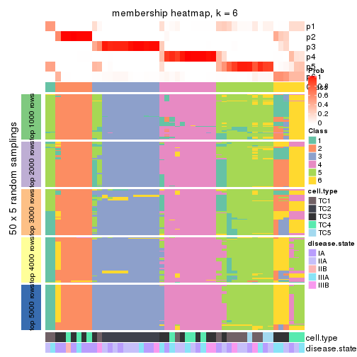</p>

</div>
</div>

As soon as we have had the classes for columns, we can look for signatures
which are significantly different between classes which can be candidate marks
for certain classes. Following are the heatmaps for signatures.


Signature heatmaps where rows are scaled:


<script>
$( function() {
	$( '#tabs-SD-mclust-get-signatures' ).tabs();
} );
</script>
<div id='tabs-SD-mclust-get-signatures'>
<ul>
<li><a href='#tab-SD-mclust-get-signatures-1'>k = 2</a></li>
<li><a href='#tab-SD-mclust-get-signatures-2'>k = 3</a></li>
<li><a href='#tab-SD-mclust-get-signatures-3'>k = 4</a></li>
<li><a href='#tab-SD-mclust-get-signatures-4'>k = 5</a></li>
<li><a href='#tab-SD-mclust-get-signatures-5'>k = 6</a></li>
</ul>
<div id='tab-SD-mclust-get-signatures-1'>
<pre><code class="r">get_signatures(res, k = 2)
</code></pre>

<p>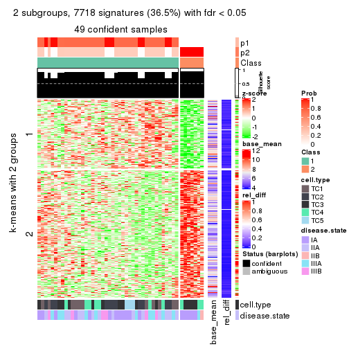</p>

</div>
<div id='tab-SD-mclust-get-signatures-2'>
<pre><code class="r">get_signatures(res, k = 3)
</code></pre>

<p>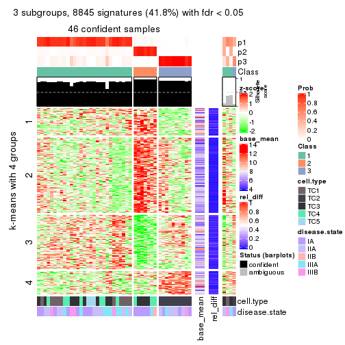</p>

</div>
<div id='tab-SD-mclust-get-signatures-3'>
<pre><code class="r">get_signatures(res, k = 4)
</code></pre>

<p>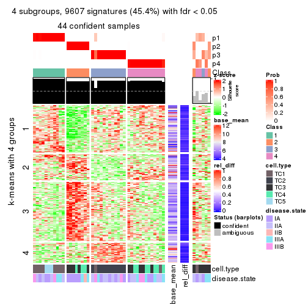</p>

</div>
<div id='tab-SD-mclust-get-signatures-4'>
<pre><code class="r">get_signatures(res, k = 5)
</code></pre>

<p>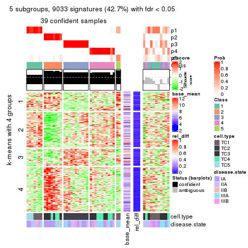</p>

</div>
<div id='tab-SD-mclust-get-signatures-5'>
<pre><code class="r">get_signatures(res, k = 6)
</code></pre>

<p>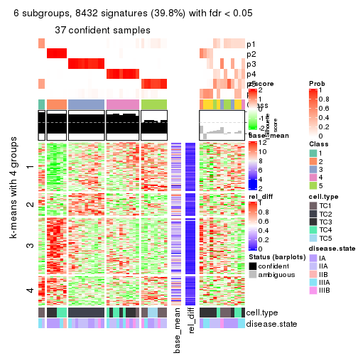</p>

</div>
</div>


Signature heatmaps where rows are not scaled:


<script>
$( function() {
	$( '#tabs-SD-mclust-get-signatures-no-scale' ).tabs();
} );
</script>
<div id='tabs-SD-mclust-get-signatures-no-scale'>
<ul>
<li><a href='#tab-SD-mclust-get-signatures-no-scale-1'>k = 2</a></li>
<li><a href='#tab-SD-mclust-get-signatures-no-scale-2'>k = 3</a></li>
<li><a href='#tab-SD-mclust-get-signatures-no-scale-3'>k = 4</a></li>
<li><a href='#tab-SD-mclust-get-signatures-no-scale-4'>k = 5</a></li>
<li><a href='#tab-SD-mclust-get-signatures-no-scale-5'>k = 6</a></li>
</ul>
<div id='tab-SD-mclust-get-signatures-no-scale-1'>
<pre><code class="r">get_signatures(res, k = 2, scale_rows = FALSE)
</code></pre>

<p>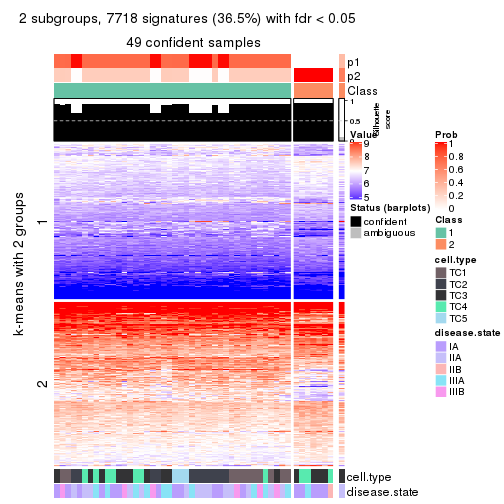</p>

</div>
<div id='tab-SD-mclust-get-signatures-no-scale-2'>
<pre><code class="r">get_signatures(res, k = 3, scale_rows = FALSE)
</code></pre>

<p>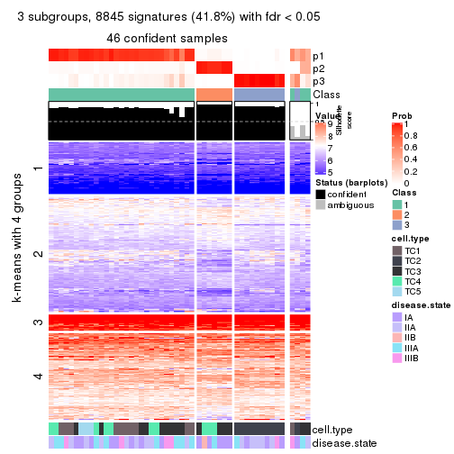</p>

</div>
<div id='tab-SD-mclust-get-signatures-no-scale-3'>
<pre><code class="r">get_signatures(res, k = 4, scale_rows = FALSE)
</code></pre>

<p>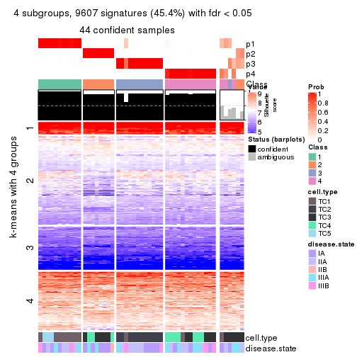</p>

</div>
<div id='tab-SD-mclust-get-signatures-no-scale-4'>
<pre><code class="r">get_signatures(res, k = 5, scale_rows = FALSE)
</code></pre>

<p>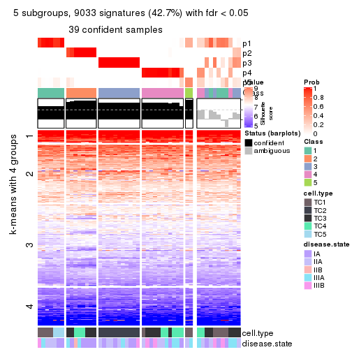</p>

</div>
<div id='tab-SD-mclust-get-signatures-no-scale-5'>
<pre><code class="r">get_signatures(res, k = 6, scale_rows = FALSE)
</code></pre>

<p>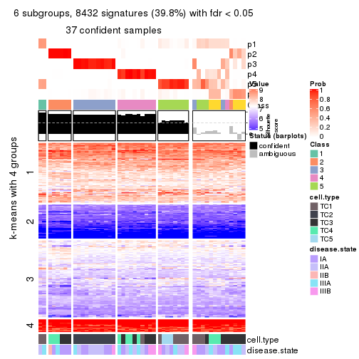</p>

</div>
</div>


Compare the overlap of signatures from different k:

```r
compare_signatures(res)
```

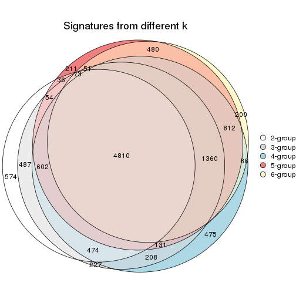

`get_signature()` returns a data frame invisibly. TO get the list of signatures, the function
call should be assigned to a variable explicitly. In following code, if `plot` argument is set
to `FALSE`, no heatmap is plotted while only the differential analysis is performed.

```r
# code only for demonstration
tb = get_signature(res, k = ..., plot = FALSE)
```

An example of the output of `tb` is:

```
#>   which_row         fdr    mean_1    mean_2 scaled_mean_1 scaled_mean_2 km
#> 1        38 0.042760348  8.373488  9.131774    -0.5533452     0.5164555  1
#> 2        40 0.018707592  7.106213  8.469186    -0.6173731     0.5762149  1
#> 3        55 0.019134737 10.221463 11.207825    -0.6159697     0.5749050  1
#> 4        59 0.006059896  5.921854  7.869574    -0.6899429     0.6439467  1
#> 5        60 0.018055526  8.928898 10.211722    -0.6204761     0.5791110  1
#> 6        98 0.009384629 15.714769 14.887706     0.6635654    -0.6193277  2
...
```

The columns in `tb` are:

1. `which_row`: row indices corresponding to the input matrix.
2. `fdr`: FDR for the differential test. 
3. `mean_x`: The mean value in group x.
4. `scaled_mean_x`: The mean value in group x after rows are scaled.
5. `km`: Row groups if k-means clustering is applied to rows.


UMAP plot which shows how samples are separated.


<script>
$( function() {
	$( '#tabs-SD-mclust-dimension-reduction' ).tabs();
} );
</script>
<div id='tabs-SD-mclust-dimension-reduction'>
<ul>
<li><a href='#tab-SD-mclust-dimension-reduction-1'>k = 2</a></li>
<li><a href='#tab-SD-mclust-dimension-reduction-2'>k = 3</a></li>
<li><a href='#tab-SD-mclust-dimension-reduction-3'>k = 4</a></li>
<li><a href='#tab-SD-mclust-dimension-reduction-4'>k = 5</a></li>
<li><a href='#tab-SD-mclust-dimension-reduction-5'>k = 6</a></li>
</ul>
<div id='tab-SD-mclust-dimension-reduction-1'>
<pre><code class="r">dimension_reduction(res, k = 2, method = &quot;UMAP&quot;)
</code></pre>

<p>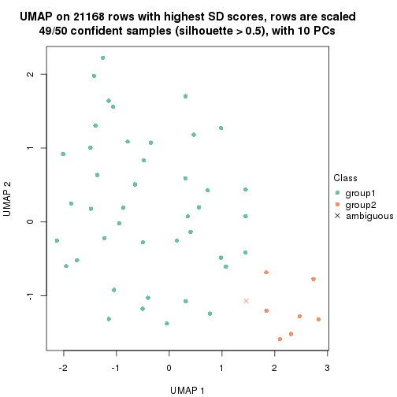</p>

</div>
<div id='tab-SD-mclust-dimension-reduction-2'>
<pre><code class="r">dimension_reduction(res, k = 3, method = &quot;UMAP&quot;)
</code></pre>

<p>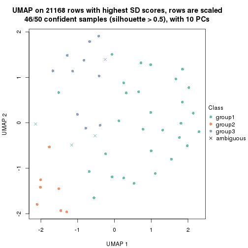</p>

</div>
<div id='tab-SD-mclust-dimension-reduction-3'>
<pre><code class="r">dimension_reduction(res, k = 4, method = &quot;UMAP&quot;)
</code></pre>

<p>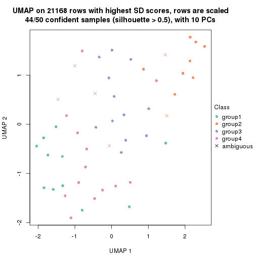</p>

</div>
<div id='tab-SD-mclust-dimension-reduction-4'>
<pre><code class="r">dimension_reduction(res, k = 5, method = &quot;UMAP&quot;)
</code></pre>

<p>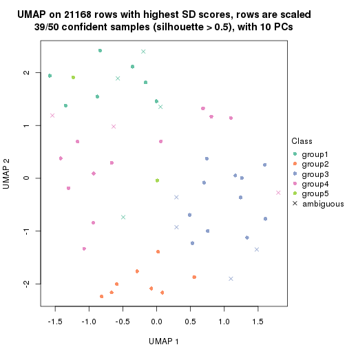</p>

</div>
<div id='tab-SD-mclust-dimension-reduction-5'>
<pre><code class="r">dimension_reduction(res, k = 6, method = &quot;UMAP&quot;)
</code></pre>

<p>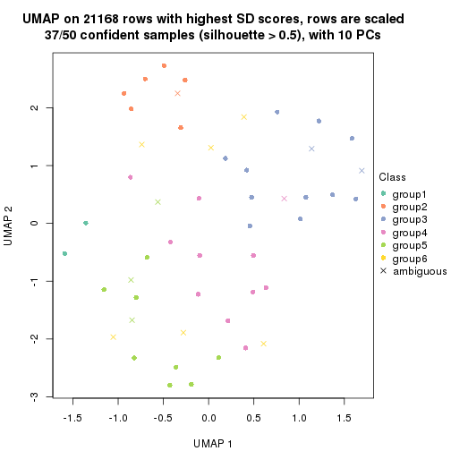</p>

</div>
</div>


Following heatmap shows how subgroups are split when increasing `k`:

```r
collect_classes(res)
```

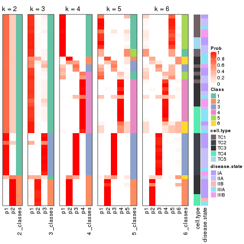


Test correlation between subgroups and known annotations. If the known
annotation is numeric, one-way ANOVA test is applied, and if the known
annotation is discrete, chi-squared contingency table test is applied.

```r
test_to_known_factors(res)
```

```
#>            n cell.type(p) disease.state(p) k
#> SD:mclust 49     7.44e-02           0.0126 2
#> SD:mclust 46     1.49e-08           0.0713 3
#> SD:mclust 44     8.38e-12           0.3573 4
#> SD:mclust 39     2.84e-10           0.5853 5
#> SD:mclust 37     3.05e-09           0.4393 6
```


If matrix rows can be associated to genes, consider to use `functional_enrichment(res,
...)` to perform function enrichment for the signature genes. See [this vignette](http://bioconductor.org/packages/devel/bioc/vignettes/cola/inst/doc/functional_enrichment.html) for more detailed explanations.


 

---------------------------------------------------


### SD:NMF*


The object with results only for a single top-value method and a single partition method 
can be extracted as:

```r
res = res_list["SD", "NMF"]
# you can also extract it by
# res = res_list["SD:NMF"]
```

A summary of `res` and all the functions that can be applied to it:

```r
res
```

```
#> A 'ConsensusPartition' object with k = 2, 3, 4, 5, 6.
#>   On a matrix with 21168 rows and 50 columns.
#>   Top rows (1000, 2000, 3000, 4000, 5000) are extracted by 'SD' method.
#>   Subgroups are detected by 'NMF' method.
#>   Performed in total 1250 partitions by row resampling.
#>   Best k for subgroups seems to be 4.
#> 
#> Following methods can be applied to this 'ConsensusPartition' object:
#>  [1] "cola_report"             "collect_classes"         "collect_plots"          
#>  [4] "collect_stats"           "colnames"                "compare_signatures"     
#>  [7] "consensus_heatmap"       "dimension_reduction"     "functional_enrichment"  
#> [10] "get_anno_col"            "get_anno"                "get_classes"            
#> [13] "get_consensus"           "get_matrix"              "get_membership"         
#> [16] "get_param"               "get_signatures"          "get_stats"              
#> [19] "is_best_k"               "is_stable_k"             "membership_heatmap"     
#> [22] "ncol"                    "nrow"                    "plot_ecdf"              
#> [25] "rownames"                "select_partition_number" "show"                   
#> [28] "suggest_best_k"          "test_to_known_factors"
```

`collect_plots()` function collects all the plots made from `res` for all `k` (number of partitions)
into one single page to provide an easy and fast comparison between different `k`.

```r
collect_plots(res)
```

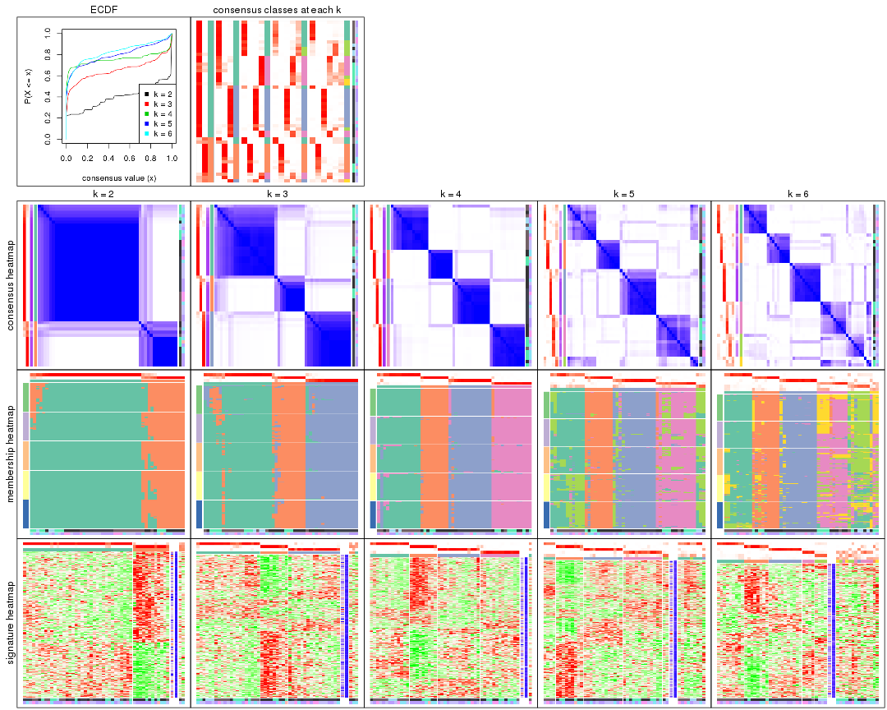

The plots are:

- The first row: a plot of the ECDF (empirical cumulative distribution
  function) curves of the consensus matrix for each `k` and the heatmap of
  predicted classes for each `k`.
- The second row: heatmaps of the consensus matrix for each `k`.
- The third row: heatmaps of the membership matrix for each `k`.
- The fouth row: heatmaps of the signatures for each `k`.

All the plots in panels can be made by individual functions and they are
plotted later in this section.

`select_partition_number()` produces several plots showing different
statistics for choosing "optimized" `k`. There are following statistics:

- ECDF curves of the consensus matrix for each `k`;
- 1-PAC. [The PAC
  score](https://en.wikipedia.org/wiki/Consensus_clustering#Over-interpretation_potential_of_consensus_clustering)
  measures the proportion of the ambiguous subgrouping.
- Mean silhouette score.
- Concordance. The mean probability of fiting the consensus class ids in all
  partitions.
- Area increased. Denote $A_k$ as the area under the ECDF curve for current
  `k`, the area increased is defined as $A_k - A_{k-1}$.
- Rand index. The percent of pairs of samples that are both in a same cluster
  or both are not in a same cluster in the partition of k and k-1.
- Jaccard index. The ratio of pairs of samples are both in a same cluster in
  the partition of k and k-1 and the pairs of samples are both in a same
  cluster in the partition k or k-1.

The detailed explanations of these statistics can be found in [the _cola_
vignette](http://bioconductor.org/packages/devel/bioc/vignettes/cola/inst/doc/cola.html#toc_13).

Generally speaking, lower PAC score, higher mean silhouette score or higher
concordance corresponds to better partition. Rand index and Jaccard index
measure how similar the current partition is compared to partition with `k-1`.
If they are too similar, we won't accept `k` is better than `k-1`.

```r
select_partition_number(res)
```

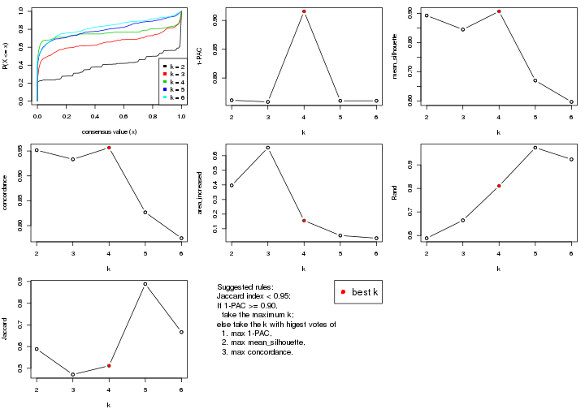

The numeric values for all these statistics can be obtained by `get_stats()`.

```r
get_stats(res)
```

```
#>   k 1-PAC mean_silhouette concordance area_increased  Rand Jaccard
#> 2 2 0.761           0.892       0.952         0.3965 0.589   0.589
#> 3 3 0.759           0.845       0.933         0.6549 0.664   0.471
#> 4 4 0.916           0.907       0.957         0.1556 0.811   0.512
#> 5 5 0.760           0.670       0.827         0.0533 0.973   0.889
#> 6 6 0.760           0.597       0.775         0.0350 0.923   0.667
```

`suggest_best_k()` suggests the best $k$ based on these statistics. The rules are as follows:

- All $k$ with Jaccard index larger than 0.95 are removed because increasing
  $k$ does not provide enough extra information. If all $k$ are removed, it is
  marked as no subgroup is detected.
- For all $k$ with 1-PAC score larger than 0.9, the maximal $k$ is taken as
  the best $k$, and other $k$ are marked as optional $k$.
- If it does not fit the second rule. The $k$ with the maximal vote of the
  highest 1-PAC score, highest mean silhouette, and highest concordance is
  taken as the best $k$.

```r
suggest_best_k(res)
```

```
#> [1] 4
```


Following shows the table of the partitions (You need to click the **show/hide
code output** link to see it). The membership matrix (columns with name `p*`)
is inferred by
[`clue::cl_consensus()`](https://www.rdocumentation.org/link/cl_consensus?package=clue)
function with the `SE` method. Basically the value in the membership matrix
represents the probability to belong to a certain group. The finall class
label for an item is determined with the group with highest probability it
belongs to.

In `get_classes()` function, the entropy is calculated from the membership
matrix and the silhouette score is calculated from the consensus matrix.


<script>
$( function() {
	$( '#tabs-SD-NMF-get-classes' ).tabs();
} );
</script>
<div id='tabs-SD-NMF-get-classes'>
<ul>
<li><a href='#tab-SD-NMF-get-classes-1'>k = 2</a></li>
<li><a href='#tab-SD-NMF-get-classes-2'>k = 3</a></li>
<li><a href='#tab-SD-NMF-get-classes-3'>k = 4</a></li>
<li><a href='#tab-SD-NMF-get-classes-4'>k = 5</a></li>
<li><a href='#tab-SD-NMF-get-classes-5'>k = 6</a></li>
</ul>

<div id='tab-SD-NMF-get-classes-1'>
<p><a id='tab-SD-NMF-get-classes-1-a' style='color:#0366d6' href='#'>show/hide code output</a></p>
<pre><code class="r">cbind(get_classes(res, k = 2), get_membership(res, k = 2))
</code></pre>

<pre><code>#&gt;          class entropy silhouette    p1    p2
#&gt; GSM63448     1   0.000      0.971 1.000 0.000
#&gt; GSM63449     1   0.000      0.971 1.000 0.000
#&gt; GSM63423     1   0.000      0.971 1.000 0.000
#&gt; GSM63425     1   0.000      0.971 1.000 0.000
#&gt; GSM63437     1   0.000      0.971 1.000 0.000
#&gt; GSM63453     2   0.808      0.698 0.248 0.752
#&gt; GSM63431     1   0.000      0.971 1.000 0.000
#&gt; GSM63450     2   0.992      0.331 0.448 0.552
#&gt; GSM63428     1   0.000      0.971 1.000 0.000
#&gt; GSM63432     1   0.000      0.971 1.000 0.000
#&gt; GSM63458     1   0.000      0.971 1.000 0.000
#&gt; GSM63434     1   0.000      0.971 1.000 0.000
#&gt; GSM63435     1   0.000      0.971 1.000 0.000
#&gt; GSM63442     1   0.000      0.971 1.000 0.000
#&gt; GSM63451     1   0.000      0.971 1.000 0.000
#&gt; GSM63422     1   0.000      0.971 1.000 0.000
#&gt; GSM63438     1   0.000      0.971 1.000 0.000
#&gt; GSM63439     1   0.000      0.971 1.000 0.000
#&gt; GSM63461     1   0.000      0.971 1.000 0.000
#&gt; GSM63463     1   0.000      0.971 1.000 0.000
#&gt; GSM63430     1   0.000      0.971 1.000 0.000
#&gt; GSM63446     1   0.000      0.971 1.000 0.000
#&gt; GSM63429     1   0.000      0.971 1.000 0.000
#&gt; GSM63445     1   0.000      0.971 1.000 0.000
#&gt; GSM63447     2   0.644      0.777 0.164 0.836
#&gt; GSM63459     2   0.000      0.876 0.000 1.000
#&gt; GSM63464     2   0.000      0.876 0.000 1.000
#&gt; GSM63469     2   0.000      0.876 0.000 1.000
#&gt; GSM63470     2   0.000      0.876 0.000 1.000
#&gt; GSM63436     1   0.000      0.971 1.000 0.000
#&gt; GSM63443     2   0.900      0.596 0.316 0.684
#&gt; GSM63465     2   0.949      0.477 0.368 0.632
#&gt; GSM63444     2   0.000      0.876 0.000 1.000
#&gt; GSM63456     2   0.000      0.876 0.000 1.000
#&gt; GSM63462     1   0.118      0.958 0.984 0.016
#&gt; GSM63424     1   0.000      0.971 1.000 0.000
#&gt; GSM63440     1   0.000      0.971 1.000 0.000
#&gt; GSM63433     1   0.000      0.971 1.000 0.000
#&gt; GSM63466     2   0.000      0.876 0.000 1.000
#&gt; GSM63426     1   0.000      0.971 1.000 0.000
#&gt; GSM63468     1   0.876      0.545 0.704 0.296
#&gt; GSM63452     2   0.000      0.876 0.000 1.000
#&gt; GSM63441     1   0.615      0.800 0.848 0.152
#&gt; GSM63454     1   0.808      0.644 0.752 0.248
#&gt; GSM63455     1   0.000      0.971 1.000 0.000
#&gt; GSM63460     2   0.000      0.876 0.000 1.000
#&gt; GSM63467     1   0.224      0.939 0.964 0.036
#&gt; GSM63421     1   0.000      0.971 1.000 0.000
#&gt; GSM63427     1   0.541      0.838 0.876 0.124
#&gt; GSM63457     1   0.000      0.971 1.000 0.000
</code></pre>

<script>
$('#tab-SD-NMF-get-classes-1-a').parent().next().next().hide();
$('#tab-SD-NMF-get-classes-1-a').click(function(){
  $('#tab-SD-NMF-get-classes-1-a').parent().next().next().toggle();
  return(false);
});
</script>
</div>

<div id='tab-SD-NMF-get-classes-2'>
<p><a id='tab-SD-NMF-get-classes-2-a' style='color:#0366d6' href='#'>show/hide code output</a></p>
<pre><code class="r">cbind(get_classes(res, k = 3), get_membership(res, k = 3))
</code></pre>

<pre><code>#&gt;          class entropy silhouette    p1    p2    p3
#&gt; GSM63448     1  0.0424     0.9125 0.992 0.000 0.008
#&gt; GSM63449     1  0.0892     0.9079 0.980 0.000 0.020
#&gt; GSM63423     1  0.0592     0.9115 0.988 0.000 0.012
#&gt; GSM63425     1  0.2878     0.8526 0.904 0.000 0.096
#&gt; GSM63437     1  0.0424     0.9125 0.992 0.000 0.008
#&gt; GSM63453     1  0.1267     0.9030 0.972 0.024 0.004
#&gt; GSM63431     1  0.0237     0.9129 0.996 0.000 0.004
#&gt; GSM63450     1  0.6505     0.0777 0.528 0.468 0.004
#&gt; GSM63428     1  0.0424     0.9125 0.992 0.000 0.008
#&gt; GSM63432     3  0.5178     0.6782 0.256 0.000 0.744
#&gt; GSM63458     1  0.0000     0.9126 1.000 0.000 0.000
#&gt; GSM63434     3  0.0000     0.9576 0.000 0.000 1.000
#&gt; GSM63435     3  0.0000     0.9576 0.000 0.000 1.000
#&gt; GSM63442     3  0.0237     0.9565 0.004 0.000 0.996
#&gt; GSM63451     3  0.0000     0.9576 0.000 0.000 1.000
#&gt; GSM63422     3  0.0237     0.9565 0.004 0.000 0.996
#&gt; GSM63438     3  0.0000     0.9576 0.000 0.000 1.000
#&gt; GSM63439     3  0.0000     0.9576 0.000 0.000 1.000
#&gt; GSM63461     3  0.0237     0.9565 0.004 0.000 0.996
#&gt; GSM63463     3  0.0000     0.9576 0.000 0.000 1.000
#&gt; GSM63430     3  0.0000     0.9576 0.000 0.000 1.000
#&gt; GSM63446     3  0.0000     0.9576 0.000 0.000 1.000
#&gt; GSM63429     1  0.3816     0.8032 0.852 0.000 0.148
#&gt; GSM63445     3  0.1753     0.9289 0.048 0.000 0.952
#&gt; GSM63447     2  0.6204     0.1090 0.424 0.576 0.000
#&gt; GSM63459     2  0.0000     0.8865 0.000 1.000 0.000
#&gt; GSM63464     2  0.0000     0.8865 0.000 1.000 0.000
#&gt; GSM63469     2  0.0000     0.8865 0.000 1.000 0.000
#&gt; GSM63470     2  0.0000     0.8865 0.000 1.000 0.000
#&gt; GSM63436     1  0.0237     0.9129 0.996 0.000 0.004
#&gt; GSM63443     3  0.1585     0.9367 0.008 0.028 0.964
#&gt; GSM63465     2  0.1950     0.8639 0.008 0.952 0.040
#&gt; GSM63444     2  0.3551     0.7862 0.000 0.868 0.132
#&gt; GSM63456     2  0.6260     0.1828 0.000 0.552 0.448
#&gt; GSM63462     3  0.3678     0.8713 0.028 0.080 0.892
#&gt; GSM63424     3  0.3340     0.8520 0.120 0.000 0.880
#&gt; GSM63440     3  0.0747     0.9498 0.016 0.000 0.984
#&gt; GSM63433     1  0.0237     0.9125 0.996 0.000 0.004
#&gt; GSM63466     2  0.0000     0.8865 0.000 1.000 0.000
#&gt; GSM63426     1  0.0237     0.9125 0.996 0.000 0.004
#&gt; GSM63468     1  0.4399     0.7632 0.812 0.188 0.000
#&gt; GSM63452     2  0.0000     0.8865 0.000 1.000 0.000
#&gt; GSM63441     1  0.3846     0.8365 0.876 0.108 0.016
#&gt; GSM63454     1  0.5986     0.6158 0.704 0.284 0.012
#&gt; GSM63455     1  0.0475     0.9118 0.992 0.004 0.004
#&gt; GSM63460     2  0.0000     0.8865 0.000 1.000 0.000
#&gt; GSM63467     1  0.6438     0.7117 0.748 0.188 0.064
#&gt; GSM63421     1  0.0000     0.9126 1.000 0.000 0.000
#&gt; GSM63427     1  0.0237     0.9126 0.996 0.004 0.000
#&gt; GSM63457     1  0.0000     0.9126 1.000 0.000 0.000
</code></pre>

<script>
$('#tab-SD-NMF-get-classes-2-a').parent().next().next().hide();
$('#tab-SD-NMF-get-classes-2-a').click(function(){
  $('#tab-SD-NMF-get-classes-2-a').parent().next().next().toggle();
  return(false);
});
</script>
</div>

<div id='tab-SD-NMF-get-classes-3'>
<p><a id='tab-SD-NMF-get-classes-3-a' style='color:#0366d6' href='#'>show/hide code output</a></p>
<pre><code class="r">cbind(get_classes(res, k = 4), get_membership(res, k = 4))
</code></pre>

<pre><code>#&gt;          class entropy silhouette    p1    p2    p3    p4
#&gt; GSM63448     1  0.3837      0.730 0.776 0.000 0.000 0.224
#&gt; GSM63449     1  0.0188      0.916 0.996 0.000 0.004 0.000
#&gt; GSM63423     1  0.0336      0.920 0.992 0.000 0.000 0.008
#&gt; GSM63425     4  0.0188      0.965 0.004 0.000 0.000 0.996
#&gt; GSM63437     1  0.0336      0.920 0.992 0.000 0.000 0.008
#&gt; GSM63453     1  0.0188      0.919 0.996 0.000 0.000 0.004
#&gt; GSM63431     1  0.0921      0.918 0.972 0.000 0.000 0.028
#&gt; GSM63450     1  0.0336      0.917 0.992 0.008 0.000 0.000
#&gt; GSM63428     1  0.0188      0.916 0.996 0.000 0.004 0.000
#&gt; GSM63432     1  0.4981      0.117 0.536 0.000 0.464 0.000
#&gt; GSM63458     1  0.2469      0.869 0.892 0.000 0.000 0.108
#&gt; GSM63434     3  0.0000      0.952 0.000 0.000 1.000 0.000
#&gt; GSM63435     3  0.0188      0.951 0.004 0.000 0.996 0.000
#&gt; GSM63442     3  0.0469      0.947 0.012 0.000 0.988 0.000
#&gt; GSM63451     3  0.0000      0.952 0.000 0.000 1.000 0.000
#&gt; GSM63422     3  0.0000      0.952 0.000 0.000 1.000 0.000
#&gt; GSM63438     3  0.0336      0.950 0.000 0.000 0.992 0.008
#&gt; GSM63439     3  0.0336      0.950 0.000 0.000 0.992 0.008
#&gt; GSM63461     3  0.0000      0.952 0.000 0.000 1.000 0.000
#&gt; GSM63463     3  0.0000      0.952 0.000 0.000 1.000 0.000
#&gt; GSM63430     3  0.0000      0.952 0.000 0.000 1.000 0.000
#&gt; GSM63446     3  0.0188      0.951 0.000 0.000 0.996 0.004
#&gt; GSM63429     4  0.0000      0.965 0.000 0.000 0.000 1.000
#&gt; GSM63445     3  0.1302      0.920 0.044 0.000 0.956 0.000
#&gt; GSM63447     4  0.4428      0.622 0.004 0.276 0.000 0.720
#&gt; GSM63459     2  0.0000      0.982 0.000 1.000 0.000 0.000
#&gt; GSM63464     2  0.0000      0.982 0.000 1.000 0.000 0.000
#&gt; GSM63469     2  0.0000      0.982 0.000 1.000 0.000 0.000
#&gt; GSM63470     2  0.0000      0.982 0.000 1.000 0.000 0.000
#&gt; GSM63436     1  0.2345      0.876 0.900 0.000 0.000 0.100
#&gt; GSM63443     3  0.4248      0.694 0.012 0.220 0.768 0.000
#&gt; GSM63465     4  0.1297      0.947 0.000 0.020 0.016 0.964
#&gt; GSM63444     2  0.0188      0.979 0.000 0.996 0.004 0.000
#&gt; GSM63456     2  0.2760      0.846 0.000 0.872 0.128 0.000
#&gt; GSM63462     3  0.4797      0.635 0.000 0.020 0.720 0.260
#&gt; GSM63424     4  0.0592      0.957 0.000 0.000 0.016 0.984
#&gt; GSM63440     4  0.0592      0.957 0.000 0.000 0.016 0.984
#&gt; GSM63433     4  0.0707      0.956 0.020 0.000 0.000 0.980
#&gt; GSM63466     2  0.0000      0.982 0.000 1.000 0.000 0.000
#&gt; GSM63426     4  0.0592      0.959 0.016 0.000 0.000 0.984
#&gt; GSM63468     4  0.0000      0.965 0.000 0.000 0.000 1.000
#&gt; GSM63452     2  0.0188      0.980 0.004 0.996 0.000 0.000
#&gt; GSM63441     4  0.0000      0.965 0.000 0.000 0.000 1.000
#&gt; GSM63454     4  0.0188      0.965 0.000 0.004 0.000 0.996
#&gt; GSM63455     4  0.0336      0.963 0.008 0.000 0.000 0.992
#&gt; GSM63460     2  0.0000      0.982 0.000 1.000 0.000 0.000
#&gt; GSM63467     4  0.0524      0.963 0.004 0.008 0.000 0.988
#&gt; GSM63421     1  0.0707      0.920 0.980 0.000 0.000 0.020
#&gt; GSM63427     1  0.0592      0.920 0.984 0.000 0.000 0.016
#&gt; GSM63457     1  0.0921      0.918 0.972 0.000 0.000 0.028
</code></pre>

<script>
$('#tab-SD-NMF-get-classes-3-a').parent().next().next().hide();
$('#tab-SD-NMF-get-classes-3-a').click(function(){
  $('#tab-SD-NMF-get-classes-3-a').parent().next().next().toggle();
  return(false);
});
</script>
</div>

<div id='tab-SD-NMF-get-classes-4'>
<p><a id='tab-SD-NMF-get-classes-4-a' style='color:#0366d6' href='#'>show/hide code output</a></p>
<pre><code class="r">cbind(get_classes(res, k = 5), get_membership(res, k = 5))
</code></pre>

<pre><code>#&gt;          class entropy silhouette    p1    p2    p3    p4    p5
#&gt; GSM63448     1  0.5958     0.3289 0.548 0.000 0.004 0.108 0.340
#&gt; GSM63449     1  0.4288     0.5182 0.664 0.000 0.012 0.000 0.324
#&gt; GSM63423     1  0.4118     0.5092 0.660 0.000 0.004 0.000 0.336
#&gt; GSM63425     4  0.2463     0.8085 0.004 0.000 0.008 0.888 0.100
#&gt; GSM63437     1  0.3706     0.5268 0.756 0.000 0.004 0.004 0.236
#&gt; GSM63453     1  0.1211     0.4551 0.960 0.016 0.000 0.000 0.024
#&gt; GSM63431     1  0.2574     0.4852 0.876 0.000 0.000 0.012 0.112
#&gt; GSM63450     1  0.1471     0.4558 0.952 0.024 0.000 0.004 0.020
#&gt; GSM63428     1  0.4066     0.5176 0.672 0.000 0.004 0.000 0.324
#&gt; GSM63432     1  0.5983     0.3427 0.588 0.000 0.212 0.000 0.200
#&gt; GSM63458     1  0.5004    -0.0974 0.672 0.000 0.000 0.072 0.256
#&gt; GSM63434     3  0.0404     0.8869 0.000 0.000 0.988 0.000 0.012
#&gt; GSM63435     3  0.0290     0.8879 0.000 0.000 0.992 0.000 0.008
#&gt; GSM63442     3  0.0579     0.8872 0.008 0.000 0.984 0.000 0.008
#&gt; GSM63451     3  0.0000     0.8884 0.000 0.000 1.000 0.000 0.000
#&gt; GSM63422     3  0.0451     0.8886 0.004 0.000 0.988 0.000 0.008
#&gt; GSM63438     3  0.0162     0.8883 0.000 0.000 0.996 0.004 0.000
#&gt; GSM63439     3  0.0566     0.8859 0.000 0.000 0.984 0.004 0.012
#&gt; GSM63461     3  0.0854     0.8845 0.004 0.000 0.976 0.008 0.012
#&gt; GSM63463     3  0.0324     0.8880 0.004 0.000 0.992 0.000 0.004
#&gt; GSM63430     3  0.2127     0.8330 0.000 0.000 0.892 0.000 0.108
#&gt; GSM63446     3  0.0992     0.8790 0.000 0.000 0.968 0.008 0.024
#&gt; GSM63429     4  0.2305     0.8116 0.000 0.000 0.012 0.896 0.092
#&gt; GSM63445     3  0.4456     0.5340 0.020 0.000 0.660 0.000 0.320
#&gt; GSM63447     4  0.4925     0.5177 0.000 0.324 0.000 0.632 0.044
#&gt; GSM63459     2  0.0162     0.9172 0.004 0.996 0.000 0.000 0.000
#&gt; GSM63464     2  0.0162     0.9167 0.000 0.996 0.000 0.000 0.004
#&gt; GSM63469     2  0.0000     0.9173 0.000 1.000 0.000 0.000 0.000
#&gt; GSM63470     2  0.0162     0.9172 0.004 0.996 0.000 0.000 0.000
#&gt; GSM63436     5  0.4417     0.6396 0.148 0.000 0.000 0.092 0.760
#&gt; GSM63443     3  0.6134     0.2080 0.032 0.056 0.472 0.000 0.440
#&gt; GSM63465     4  0.5326     0.7139 0.000 0.112 0.056 0.736 0.096
#&gt; GSM63444     2  0.0794     0.9075 0.000 0.972 0.028 0.000 0.000
#&gt; GSM63456     2  0.5250     0.5394 0.048 0.656 0.280 0.000 0.016
#&gt; GSM63462     3  0.6798     0.5112 0.060 0.012 0.612 0.200 0.116
#&gt; GSM63424     4  0.3558     0.7812 0.000 0.000 0.064 0.828 0.108
#&gt; GSM63440     4  0.3237     0.7913 0.000 0.000 0.048 0.848 0.104
#&gt; GSM63433     4  0.4067     0.5988 0.008 0.000 0.000 0.692 0.300
#&gt; GSM63466     2  0.1310     0.9042 0.000 0.956 0.000 0.024 0.020
#&gt; GSM63426     4  0.4269     0.5879 0.016 0.000 0.000 0.684 0.300
#&gt; GSM63468     4  0.0609     0.8186 0.000 0.000 0.000 0.980 0.020
#&gt; GSM63452     2  0.2249     0.8623 0.096 0.896 0.000 0.000 0.008
#&gt; GSM63441     4  0.0510     0.8191 0.000 0.000 0.000 0.984 0.016
#&gt; GSM63454     4  0.0898     0.8182 0.000 0.008 0.000 0.972 0.020
#&gt; GSM63455     4  0.3419     0.7220 0.016 0.000 0.000 0.804 0.180
#&gt; GSM63460     2  0.2110     0.8727 0.000 0.912 0.000 0.072 0.016
#&gt; GSM63467     4  0.2054     0.8047 0.004 0.008 0.000 0.916 0.072
#&gt; GSM63421     5  0.4897     0.3871 0.460 0.000 0.000 0.024 0.516
#&gt; GSM63427     5  0.4348     0.6710 0.216 0.008 0.000 0.032 0.744
#&gt; GSM63457     1  0.5232    -0.5361 0.500 0.000 0.000 0.044 0.456
</code></pre>

<script>
$('#tab-SD-NMF-get-classes-4-a').parent().next().next().hide();
$('#tab-SD-NMF-get-classes-4-a').click(function(){
  $('#tab-SD-NMF-get-classes-4-a').parent().next().next().toggle();
  return(false);
});
</script>
</div>

<div id='tab-SD-NMF-get-classes-5'>
<p><a id='tab-SD-NMF-get-classes-5-a' style='color:#0366d6' href='#'>show/hide code output</a></p>
<pre><code class="r">cbind(get_classes(res, k = 6), get_membership(res, k = 6))
</code></pre>

<pre><code>#&gt;          class entropy silhouette    p1    p2    p3    p4    p5    p6
#&gt; GSM63448     1  0.2484     0.8271 0.896 0.000 0.000 0.044 0.036 0.024
#&gt; GSM63449     1  0.0725     0.8665 0.976 0.000 0.000 0.000 0.012 0.012
#&gt; GSM63423     1  0.0914     0.8654 0.968 0.000 0.000 0.000 0.016 0.016
#&gt; GSM63425     4  0.1116     0.5379 0.008 0.000 0.000 0.960 0.028 0.004
#&gt; GSM63437     1  0.1074     0.8647 0.960 0.000 0.000 0.000 0.028 0.012
#&gt; GSM63453     1  0.5188     0.6761 0.660 0.016 0.000 0.000 0.172 0.152
#&gt; GSM63431     1  0.2113     0.8470 0.908 0.000 0.000 0.004 0.060 0.028
#&gt; GSM63450     1  0.5356     0.6748 0.656 0.028 0.000 0.000 0.156 0.160
#&gt; GSM63428     1  0.0260     0.8685 0.992 0.000 0.000 0.000 0.008 0.000
#&gt; GSM63432     1  0.1801     0.8334 0.924 0.000 0.056 0.000 0.016 0.004
#&gt; GSM63458     5  0.7043     0.0850 0.312 0.000 0.000 0.276 0.348 0.064
#&gt; GSM63434     3  0.0436     0.9219 0.004 0.000 0.988 0.000 0.004 0.004
#&gt; GSM63435     3  0.0363     0.9205 0.000 0.000 0.988 0.000 0.000 0.012
#&gt; GSM63442     3  0.0909     0.9157 0.000 0.000 0.968 0.000 0.012 0.020
#&gt; GSM63451     3  0.0000     0.9225 0.000 0.000 1.000 0.000 0.000 0.000
#&gt; GSM63422     3  0.0790     0.9109 0.000 0.000 0.968 0.000 0.000 0.032
#&gt; GSM63438     3  0.0551     0.9224 0.000 0.000 0.984 0.008 0.004 0.004
#&gt; GSM63439     3  0.0858     0.9133 0.000 0.000 0.968 0.028 0.004 0.000
#&gt; GSM63461     3  0.0291     0.9222 0.000 0.000 0.992 0.004 0.000 0.004
#&gt; GSM63463     3  0.0000     0.9225 0.000 0.000 1.000 0.000 0.000 0.000
#&gt; GSM63430     3  0.3804     0.7228 0.024 0.000 0.776 0.000 0.024 0.176
#&gt; GSM63446     3  0.0858     0.9122 0.000 0.000 0.968 0.028 0.000 0.004
#&gt; GSM63429     4  0.1845     0.5349 0.000 0.000 0.000 0.920 0.052 0.028
#&gt; GSM63445     5  0.4637     0.3408 0.008 0.000 0.316 0.012 0.640 0.024
#&gt; GSM63447     4  0.5750     0.2901 0.000 0.316 0.000 0.560 0.048 0.076
#&gt; GSM63459     2  0.0000     0.8482 0.000 1.000 0.000 0.000 0.000 0.000
#&gt; GSM63464     2  0.0363     0.8470 0.000 0.988 0.000 0.000 0.000 0.012
#&gt; GSM63469     2  0.0146     0.8480 0.000 0.996 0.000 0.000 0.000 0.004
#&gt; GSM63470     2  0.0000     0.8482 0.000 1.000 0.000 0.000 0.000 0.000
#&gt; GSM63436     5  0.4565     0.6209 0.100 0.004 0.000 0.092 0.760 0.044
#&gt; GSM63443     6  0.7646    -0.2900 0.112 0.052 0.364 0.000 0.104 0.368
#&gt; GSM63465     4  0.4147     0.4366 0.000 0.132 0.060 0.776 0.000 0.032
#&gt; GSM63444     2  0.3140     0.7882 0.000 0.844 0.092 0.008 0.000 0.056
#&gt; GSM63456     2  0.4123     0.7224 0.000 0.772 0.124 0.000 0.016 0.088
#&gt; GSM63462     3  0.6028     0.3823 0.000 0.008 0.580 0.028 0.152 0.232
#&gt; GSM63424     4  0.1434     0.5293 0.000 0.000 0.048 0.940 0.012 0.000
#&gt; GSM63440     4  0.1007     0.5347 0.000 0.000 0.044 0.956 0.000 0.000
#&gt; GSM63433     6  0.6099    -0.2204 0.000 0.000 0.000 0.316 0.300 0.384
#&gt; GSM63466     2  0.3221     0.7475 0.000 0.792 0.000 0.020 0.000 0.188
#&gt; GSM63426     5  0.5889    -0.0337 0.000 0.000 0.000 0.264 0.476 0.260
#&gt; GSM63468     4  0.4499     0.2111 0.000 0.000 0.000 0.540 0.032 0.428
#&gt; GSM63452     2  0.3068     0.7749 0.000 0.840 0.000 0.000 0.072 0.088
#&gt; GSM63441     4  0.4417     0.2308 0.000 0.000 0.000 0.556 0.028 0.416
#&gt; GSM63454     4  0.4529     0.1708 0.000 0.004 0.000 0.512 0.024 0.460
#&gt; GSM63455     4  0.6005    -0.0811 0.000 0.000 0.000 0.384 0.236 0.380
#&gt; GSM63460     2  0.4491     0.4220 0.000 0.576 0.000 0.036 0.000 0.388
#&gt; GSM63467     6  0.4980    -0.4092 0.000 0.008 0.000 0.452 0.048 0.492
#&gt; GSM63421     5  0.3717     0.6416 0.148 0.000 0.000 0.072 0.780 0.000
#&gt; GSM63427     5  0.3901     0.6263 0.096 0.008 0.000 0.044 0.812 0.040
#&gt; GSM63457     5  0.3919     0.6401 0.116 0.000 0.000 0.072 0.792 0.020
</code></pre>

<script>
$('#tab-SD-NMF-get-classes-5-a').parent().next().next().hide();
$('#tab-SD-NMF-get-classes-5-a').click(function(){
  $('#tab-SD-NMF-get-classes-5-a').parent().next().next().toggle();
  return(false);
});
</script>
</div>
</div>

Heatmaps for the consensus matrix. It visualizes the probability of two
samples to be in a same group.


<script>
$( function() {
	$( '#tabs-SD-NMF-consensus-heatmap' ).tabs();
} );
</script>
<div id='tabs-SD-NMF-consensus-heatmap'>
<ul>
<li><a href='#tab-SD-NMF-consensus-heatmap-1'>k = 2</a></li>
<li><a href='#tab-SD-NMF-consensus-heatmap-2'>k = 3</a></li>
<li><a href='#tab-SD-NMF-consensus-heatmap-3'>k = 4</a></li>
<li><a href='#tab-SD-NMF-consensus-heatmap-4'>k = 5</a></li>
<li><a href='#tab-SD-NMF-consensus-heatmap-5'>k = 6</a></li>
</ul>
<div id='tab-SD-NMF-consensus-heatmap-1'>
<pre><code class="r">consensus_heatmap(res, k = 2)
</code></pre>

<p>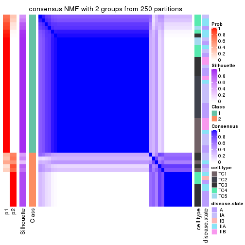</p>

</div>
<div id='tab-SD-NMF-consensus-heatmap-2'>
<pre><code class="r">consensus_heatmap(res, k = 3)
</code></pre>

<p>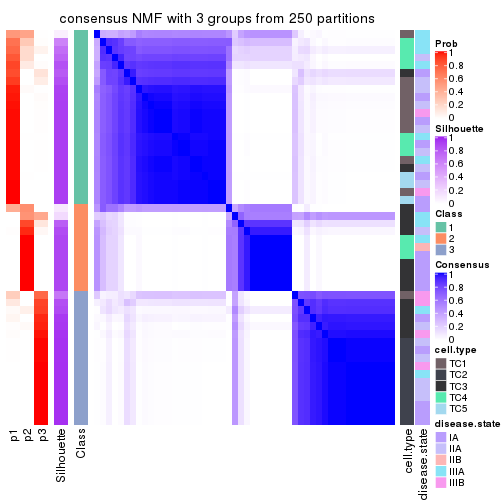</p>

</div>
<div id='tab-SD-NMF-consensus-heatmap-3'>
<pre><code class="r">consensus_heatmap(res, k = 4)
</code></pre>

<p>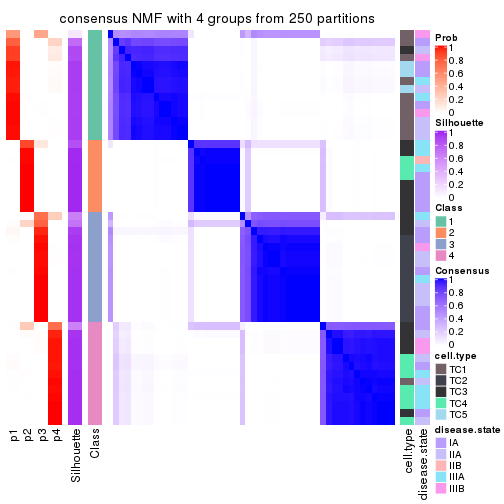</p>

</div>
<div id='tab-SD-NMF-consensus-heatmap-4'>
<pre><code class="r">consensus_heatmap(res, k = 5)
</code></pre>

<p>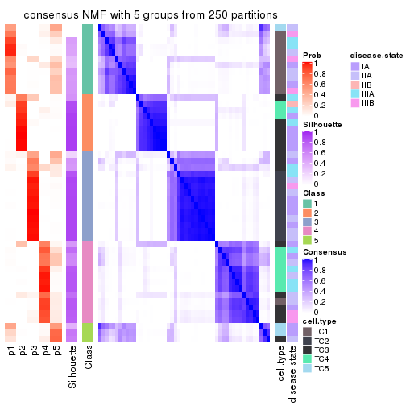</p>

</div>
<div id='tab-SD-NMF-consensus-heatmap-5'>
<pre><code class="r">consensus_heatmap(res, k = 6)
</code></pre>

<p>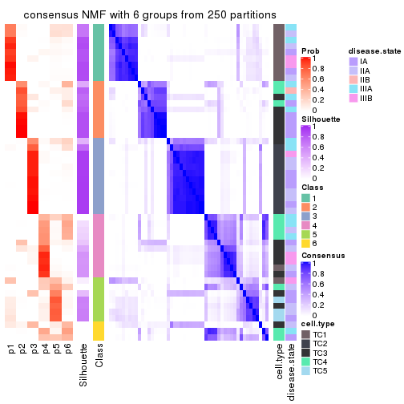</p>

</div>
</div>

Heatmaps for the membership of samples in all partitions to see how consistent they are:


<script>
$( function() {
	$( '#tabs-SD-NMF-membership-heatmap' ).tabs();
} );
</script>
<div id='tabs-SD-NMF-membership-heatmap'>
<ul>
<li><a href='#tab-SD-NMF-membership-heatmap-1'>k = 2</a></li>
<li><a href='#tab-SD-NMF-membership-heatmap-2'>k = 3</a></li>
<li><a href='#tab-SD-NMF-membership-heatmap-3'>k = 4</a></li>
<li><a href='#tab-SD-NMF-membership-heatmap-4'>k = 5</a></li>
<li><a href='#tab-SD-NMF-membership-heatmap-5'>k = 6</a></li>
</ul>
<div id='tab-SD-NMF-membership-heatmap-1'>
<pre><code class="r">membership_heatmap(res, k = 2)
</code></pre>

<p>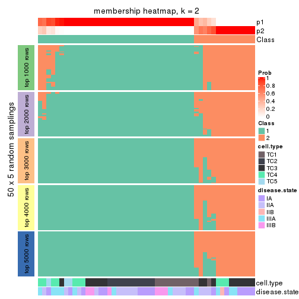</p>

</div>
<div id='tab-SD-NMF-membership-heatmap-2'>
<pre><code class="r">membership_heatmap(res, k = 3)
</code></pre>

<p>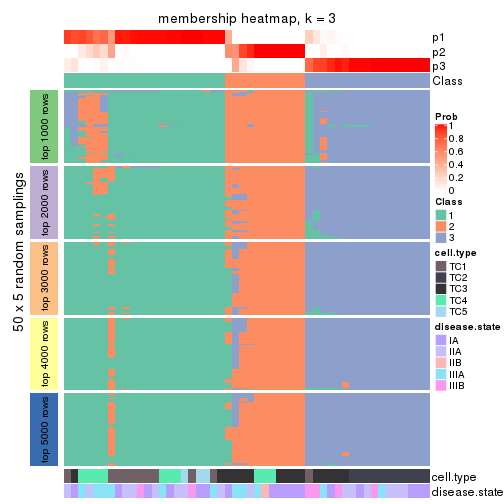</p>

</div>
<div id='tab-SD-NMF-membership-heatmap-3'>
<pre><code class="r">membership_heatmap(res, k = 4)
</code></pre>

<p>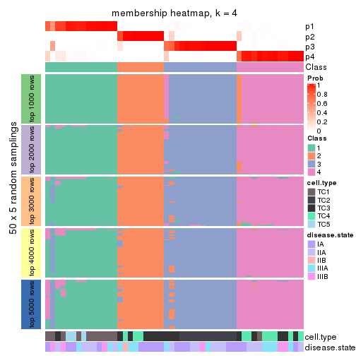</p>

</div>
<div id='tab-SD-NMF-membership-heatmap-4'>
<pre><code class="r">membership_heatmap(res, k = 5)
</code></pre>

<p>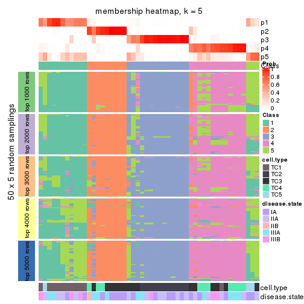</p>

</div>
<div id='tab-SD-NMF-membership-heatmap-5'>
<pre><code class="r">membership_heatmap(res, k = 6)
</code></pre>

<p>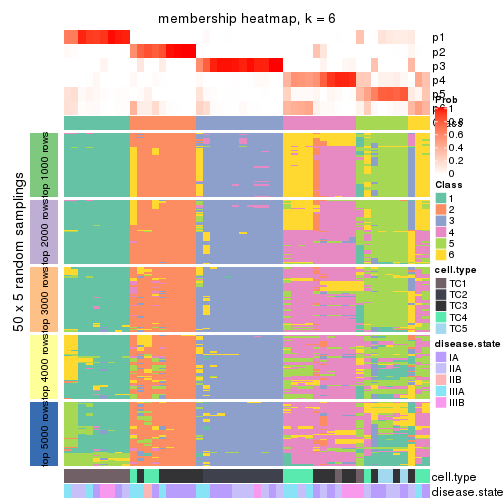</p>

</div>
</div>

As soon as we have had the classes for columns, we can look for signatures
which are significantly different between classes which can be candidate marks
for certain classes. Following are the heatmaps for signatures.


Signature heatmaps where rows are scaled:


<script>
$( function() {
	$( '#tabs-SD-NMF-get-signatures' ).tabs();
} );
</script>
<div id='tabs-SD-NMF-get-signatures'>
<ul>
<li><a href='#tab-SD-NMF-get-signatures-1'>k = 2</a></li>
<li><a href='#tab-SD-NMF-get-signatures-2'>k = 3</a></li>
<li><a href='#tab-SD-NMF-get-signatures-3'>k = 4</a></li>
<li><a href='#tab-SD-NMF-get-signatures-4'>k = 5</a></li>
<li><a href='#tab-SD-NMF-get-signatures-5'>k = 6</a></li>
</ul>
<div id='tab-SD-NMF-get-signatures-1'>
<pre><code class="r">get_signatures(res, k = 2)
</code></pre>

<p>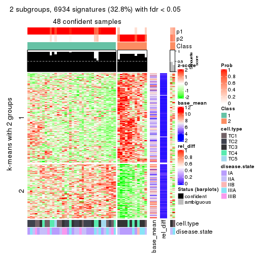</p>

</div>
<div id='tab-SD-NMF-get-signatures-2'>
<pre><code class="r">get_signatures(res, k = 3)
</code></pre>

<p>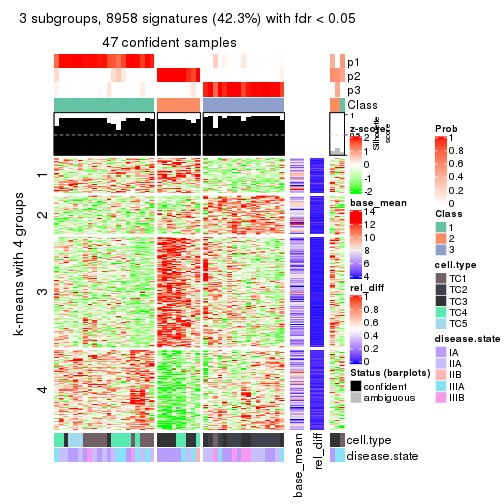</p>

</div>
<div id='tab-SD-NMF-get-signatures-3'>
<pre><code class="r">get_signatures(res, k = 4)
</code></pre>

<p>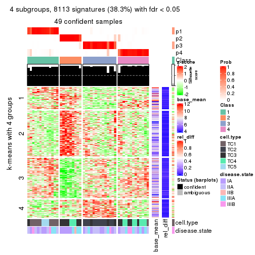</p>

</div>
<div id='tab-SD-NMF-get-signatures-4'>
<pre><code class="r">get_signatures(res, k = 5)
</code></pre>

<p>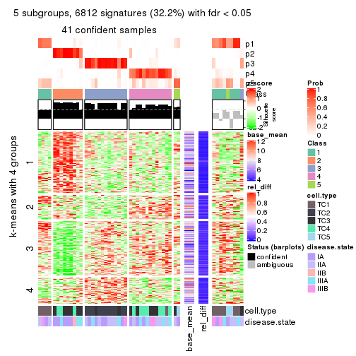</p>

</div>
<div id='tab-SD-NMF-get-signatures-5'>
<pre><code class="r">get_signatures(res, k = 6)
</code></pre>

<p>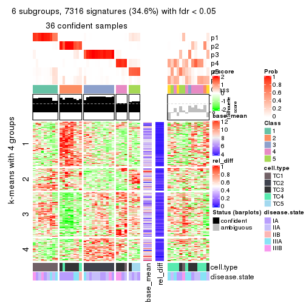</p>

</div>
</div>


Signature heatmaps where rows are not scaled:


<script>
$( function() {
	$( '#tabs-SD-NMF-get-signatures-no-scale' ).tabs();
} );
</script>
<div id='tabs-SD-NMF-get-signatures-no-scale'>
<ul>
<li><a href='#tab-SD-NMF-get-signatures-no-scale-1'>k = 2</a></li>
<li><a href='#tab-SD-NMF-get-signatures-no-scale-2'>k = 3</a></li>
<li><a href='#tab-SD-NMF-get-signatures-no-scale-3'>k = 4</a></li>
<li><a href='#tab-SD-NMF-get-signatures-no-scale-4'>k = 5</a></li>
<li><a href='#tab-SD-NMF-get-signatures-no-scale-5'>k = 6</a></li>
</ul>
<div id='tab-SD-NMF-get-signatures-no-scale-1'>
<pre><code class="r">get_signatures(res, k = 2, scale_rows = FALSE)
</code></pre>

<p>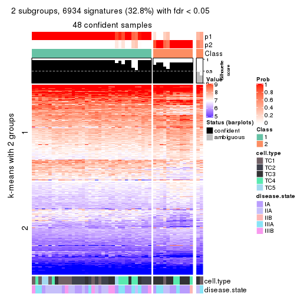</p>

</div>
<div id='tab-SD-NMF-get-signatures-no-scale-2'>
<pre><code class="r">get_signatures(res, k = 3, scale_rows = FALSE)
</code></pre>

<p>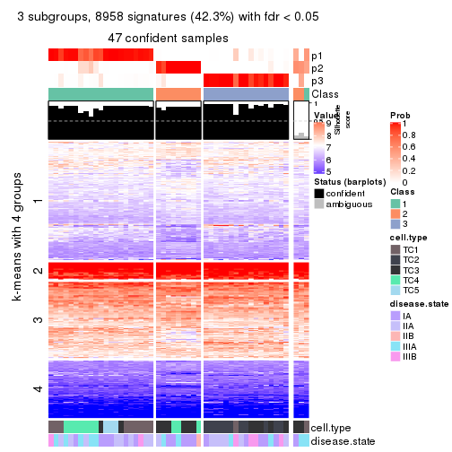</p>

</div>
<div id='tab-SD-NMF-get-signatures-no-scale-3'>
<pre><code class="r">get_signatures(res, k = 4, scale_rows = FALSE)
</code></pre>

<p>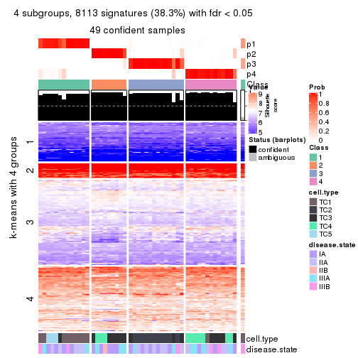</p>

</div>
<div id='tab-SD-NMF-get-signatures-no-scale-4'>
<pre><code class="r">get_signatures(res, k = 5, scale_rows = FALSE)
</code></pre>

<p>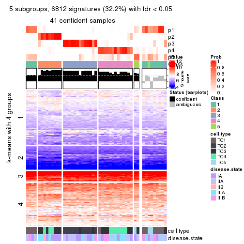</p>

</div>
<div id='tab-SD-NMF-get-signatures-no-scale-5'>
<pre><code class="r">get_signatures(res, k = 6, scale_rows = FALSE)
</code></pre>

<p>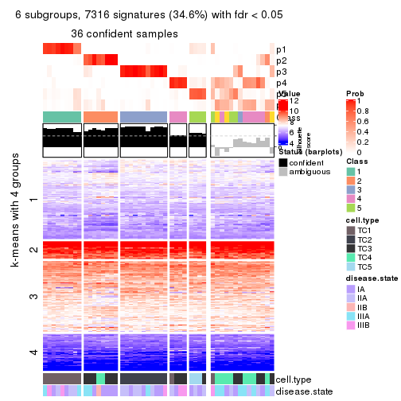</p>

</div>
</div>


Compare the overlap of signatures from different k:

```r
compare_signatures(res)
```

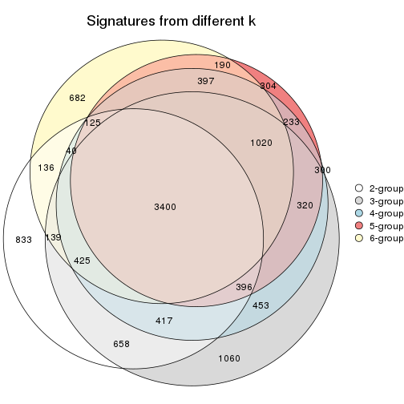

`get_signature()` returns a data frame invisibly. TO get the list of signatures, the function
call should be assigned to a variable explicitly. In following code, if `plot` argument is set
to `FALSE`, no heatmap is plotted while only the differential analysis is performed.

```r
# code only for demonstration
tb = get_signature(res, k = ..., plot = FALSE)
```

An example of the output of `tb` is:

```
#>   which_row         fdr    mean_1    mean_2 scaled_mean_1 scaled_mean_2 km
#> 1        38 0.042760348  8.373488  9.131774    -0.5533452     0.5164555  1
#> 2        40 0.018707592  7.106213  8.469186    -0.6173731     0.5762149  1
#> 3        55 0.019134737 10.221463 11.207825    -0.6159697     0.5749050  1
#> 4        59 0.006059896  5.921854  7.869574    -0.6899429     0.6439467  1
#> 5        60 0.018055526  8.928898 10.211722    -0.6204761     0.5791110  1
#> 6        98 0.009384629 15.714769 14.887706     0.6635654    -0.6193277  2
...
```

The columns in `tb` are:

1. `which_row`: row indices corresponding to the input matrix.
2. `fdr`: FDR for the differential test. 
3. `mean_x`: The mean value in group x.
4. `scaled_mean_x`: The mean value in group x after rows are scaled.
5. `km`: Row groups if k-means clustering is applied to rows.


UMAP plot which shows how samples are separated.


<script>
$( function() {
	$( '#tabs-SD-NMF-dimension-reduction' ).tabs();
} );
</script>
<div id='tabs-SD-NMF-dimension-reduction'>
<ul>
<li><a href='#tab-SD-NMF-dimension-reduction-1'>k = 2</a></li>
<li><a href='#tab-SD-NMF-dimension-reduction-2'>k = 3</a></li>
<li><a href='#tab-SD-NMF-dimension-reduction-3'>k = 4</a></li>
<li><a href='#tab-SD-NMF-dimension-reduction-4'>k = 5</a></li>
<li><a href='#tab-SD-NMF-dimension-reduction-5'>k = 6</a></li>
</ul>
<div id='tab-SD-NMF-dimension-reduction-1'>
<pre><code class="r">dimension_reduction(res, k = 2, method = &quot;UMAP&quot;)
</code></pre>

<p>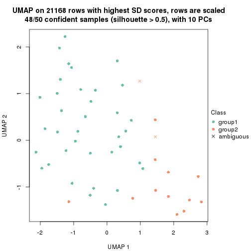</p>

</div>
<div id='tab-SD-NMF-dimension-reduction-2'>
<pre><code class="r">dimension_reduction(res, k = 3, method = &quot;UMAP&quot;)
</code></pre>

<p>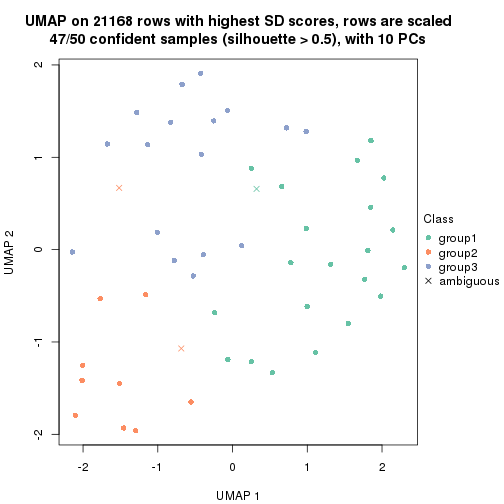</p>

</div>
<div id='tab-SD-NMF-dimension-reduction-3'>
<pre><code class="r">dimension_reduction(res, k = 4, method = &quot;UMAP&quot;)
</code></pre>

<p>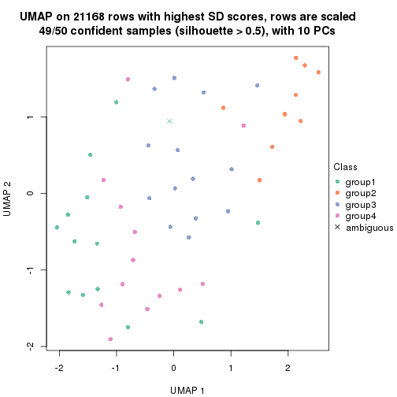</p>

</div>
<div id='tab-SD-NMF-dimension-reduction-4'>
<pre><code class="r">dimension_reduction(res, k = 5, method = &quot;UMAP&quot;)
</code></pre>

<p>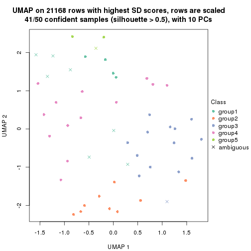</p>

</div>
<div id='tab-SD-NMF-dimension-reduction-5'>
<pre><code class="r">dimension_reduction(res, k = 6, method = &quot;UMAP&quot;)
</code></pre>

<p>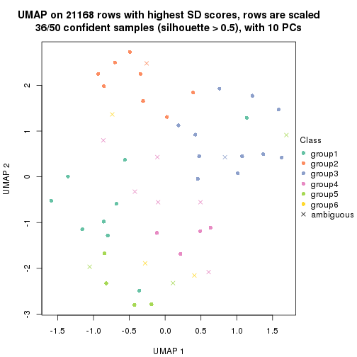</p>

</div>
</div>


Following heatmap shows how subgroups are split when increasing `k`:

```r
collect_classes(res)
```

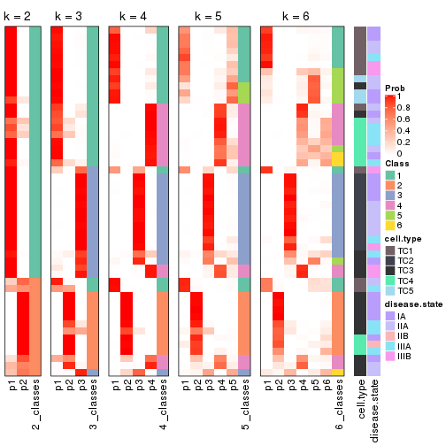


Test correlation between subgroups and known annotations. If the known
annotation is numeric, one-way ANOVA test is applied, and if the known
annotation is discrete, chi-squared contingency table test is applied.

```r
test_to_known_factors(res)
```

```
#>         n cell.type(p) disease.state(p) k
#> SD:NMF 48     8.27e-03            0.138 2
#> SD:NMF 47     4.26e-07            0.207 3
#> SD:NMF 49     1.69e-11            0.358 4
#> SD:NMF 41     9.33e-12            0.575 5
#> SD:NMF 36     3.68e-13            0.327 6
```


If matrix rows can be associated to genes, consider to use `functional_enrichment(res,
...)` to perform function enrichment for the signature genes. See [this vignette](http://bioconductor.org/packages/devel/bioc/vignettes/cola/inst/doc/functional_enrichment.html) for more detailed explanations.


 

---------------------------------------------------


### CV:hclust


The object with results only for a single top-value method and a single partition method 
can be extracted as:

```r
res = res_list["CV", "hclust"]
# you can also extract it by
# res = res_list["CV:hclust"]
```

A summary of `res` and all the functions that can be applied to it:

```r
res
```

```
#> A 'ConsensusPartition' object with k = 2, 3, 4, 5, 6.
#>   On a matrix with 21168 rows and 50 columns.
#>   Top rows (1000, 2000, 3000, 4000, 5000) are extracted by 'CV' method.
#>   Subgroups are detected by 'hclust' method.
#>   Performed in total 1250 partitions by row resampling.
#>   Best k for subgroups seems to be 3.
#> 
#> Following methods can be applied to this 'ConsensusPartition' object:
#>  [1] "cola_report"             "collect_classes"         "collect_plots"          
#>  [4] "collect_stats"           "colnames"                "compare_signatures"     
#>  [7] "consensus_heatmap"       "dimension_reduction"     "functional_enrichment"  
#> [10] "get_anno_col"            "get_anno"                "get_classes"            
#> [13] "get_consensus"           "get_matrix"              "get_membership"         
#> [16] "get_param"               "get_signatures"          "get_stats"              
#> [19] "is_best_k"               "is_stable_k"             "membership_heatmap"     
#> [22] "ncol"                    "nrow"                    "plot_ecdf"              
#> [25] "rownames"                "select_partition_number" "show"                   
#> [28] "suggest_best_k"          "test_to_known_factors"
```

`collect_plots()` function collects all the plots made from `res` for all `k` (number of partitions)
into one single page to provide an easy and fast comparison between different `k`.

```r
collect_plots(res)
```

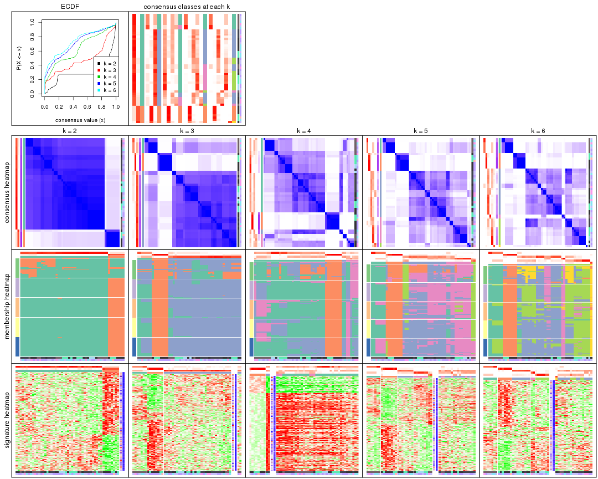

The plots are:

- The first row: a plot of the ECDF (empirical cumulative distribution
  function) curves of the consensus matrix for each `k` and the heatmap of
  predicted classes for each `k`.
- The second row: heatmaps of the consensus matrix for each `k`.
- The third row: heatmaps of the membership matrix for each `k`.
- The fouth row: heatmaps of the signatures for each `k`.

All the plots in panels can be made by individual functions and they are
plotted later in this section.

`select_partition_number()` produces several plots showing different
statistics for choosing "optimized" `k`. There are following statistics:

- ECDF curves of the consensus matrix for each `k`;
- 1-PAC. [The PAC
  score](https://en.wikipedia.org/wiki/Consensus_clustering#Over-interpretation_potential_of_consensus_clustering)
  measures the proportion of the ambiguous subgrouping.
- Mean silhouette score.
- Concordance. The mean probability of fiting the consensus class ids in all
  partitions.
- Area increased. Denote $A_k$ as the area under the ECDF curve for current
  `k`, the area increased is defined as $A_k - A_{k-1}$.
- Rand index. The percent of pairs of samples that are both in a same cluster
  or both are not in a same cluster in the partition of k and k-1.
- Jaccard index. The ratio of pairs of samples are both in a same cluster in
  the partition of k and k-1 and the pairs of samples are both in a same
  cluster in the partition k or k-1.

The detailed explanations of these statistics can be found in [the _cola_
vignette](http://bioconductor.org/packages/devel/bioc/vignettes/cola/inst/doc/cola.html#toc_13).

Generally speaking, lower PAC score, higher mean silhouette score or higher
concordance corresponds to better partition. Rand index and Jaccard index
measure how similar the current partition is compared to partition with `k-1`.
If they are too similar, we won't accept `k` is better than `k-1`.

```r
select_partition_number(res)
```

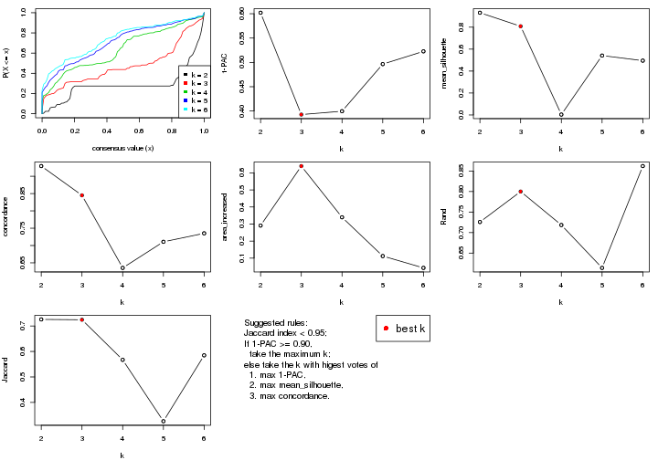

The numeric values for all these statistics can be obtained by `get_stats()`.

```r
get_stats(res)
```

```
#>   k 1-PAC mean_silhouette concordance area_increased  Rand Jaccard
#> 2 2 0.602         0.93141       0.929         0.2911 0.726   0.726
#> 3 3 0.393         0.80831       0.845         0.6397 0.800   0.724
#> 4 4 0.400         0.00373       0.635         0.3396 0.718   0.567
#> 5 5 0.496         0.54116       0.711         0.1123 0.614   0.326
#> 6 6 0.523         0.49498       0.735         0.0429 0.862   0.585
```

`suggest_best_k()` suggests the best $k$ based on these statistics. The rules are as follows:

- All $k$ with Jaccard index larger than 0.95 are removed because increasing
  $k$ does not provide enough extra information. If all $k$ are removed, it is
  marked as no subgroup is detected.
- For all $k$ with 1-PAC score larger than 0.9, the maximal $k$ is taken as
  the best $k$, and other $k$ are marked as optional $k$.
- If it does not fit the second rule. The $k$ with the maximal vote of the
  highest 1-PAC score, highest mean silhouette, and highest concordance is
  taken as the best $k$.

```r
suggest_best_k(res)
```

```
#> [1] 3
```


Following shows the table of the partitions (You need to click the **show/hide
code output** link to see it). The membership matrix (columns with name `p*`)
is inferred by
[`clue::cl_consensus()`](https://www.rdocumentation.org/link/cl_consensus?package=clue)
function with the `SE` method. Basically the value in the membership matrix
represents the probability to belong to a certain group. The finall class
label for an item is determined with the group with highest probability it
belongs to.

In `get_classes()` function, the entropy is calculated from the membership
matrix and the silhouette score is calculated from the consensus matrix.


<script>
$( function() {
	$( '#tabs-CV-hclust-get-classes' ).tabs();
} );
</script>
<div id='tabs-CV-hclust-get-classes'>
<ul>
<li><a href='#tab-CV-hclust-get-classes-1'>k = 2</a></li>
<li><a href='#tab-CV-hclust-get-classes-2'>k = 3</a></li>
<li><a href='#tab-CV-hclust-get-classes-3'>k = 4</a></li>
<li><a href='#tab-CV-hclust-get-classes-4'>k = 5</a></li>
<li><a href='#tab-CV-hclust-get-classes-5'>k = 6</a></li>
</ul>

<div id='tab-CV-hclust-get-classes-1'>
<p><a id='tab-CV-hclust-get-classes-1-a' style='color:#0366d6' href='#'>show/hide code output</a></p>
<pre><code class="r">cbind(get_classes(res, k = 2), get_membership(res, k = 2))
</code></pre>

<pre><code>#&gt;          class entropy silhouette    p1    p2
#&gt; GSM63448     1  0.2778      0.939 0.952 0.048
#&gt; GSM63449     1  0.0938      0.944 0.988 0.012
#&gt; GSM63423     1  0.0938      0.944 0.988 0.012
#&gt; GSM63425     1  0.6712      0.850 0.824 0.176
#&gt; GSM63437     1  0.0938      0.944 0.988 0.012
#&gt; GSM63453     1  0.2043      0.933 0.968 0.032
#&gt; GSM63431     1  0.0938      0.944 0.988 0.012
#&gt; GSM63450     1  0.2043      0.933 0.968 0.032
#&gt; GSM63428     1  0.0938      0.944 0.988 0.012
#&gt; GSM63432     1  0.2778      0.939 0.952 0.048
#&gt; GSM63458     1  0.2043      0.937 0.968 0.032
#&gt; GSM63434     1  0.2236      0.938 0.964 0.036
#&gt; GSM63435     1  0.5629      0.886 0.868 0.132
#&gt; GSM63442     1  0.4298      0.917 0.912 0.088
#&gt; GSM63451     1  0.3114      0.931 0.944 0.056
#&gt; GSM63422     1  0.5629      0.886 0.868 0.132
#&gt; GSM63438     1  0.4298      0.917 0.912 0.088
#&gt; GSM63439     1  0.4298      0.917 0.912 0.088
#&gt; GSM63461     1  0.4298      0.917 0.912 0.088
#&gt; GSM63463     1  0.5519      0.889 0.872 0.128
#&gt; GSM63430     1  0.5629      0.886 0.868 0.132
#&gt; GSM63446     1  0.0000      0.945 1.000 0.000
#&gt; GSM63429     1  0.6623      0.854 0.828 0.172
#&gt; GSM63445     1  0.3431      0.929 0.936 0.064
#&gt; GSM63447     1  0.0938      0.943 0.988 0.012
#&gt; GSM63459     2  0.6531      0.979 0.168 0.832
#&gt; GSM63464     2  0.6531      0.979 0.168 0.832
#&gt; GSM63469     2  0.6531      0.979 0.168 0.832
#&gt; GSM63470     2  0.6531      0.979 0.168 0.832
#&gt; GSM63436     1  0.0938      0.944 0.988 0.012
#&gt; GSM63443     2  0.2778      0.855 0.048 0.952
#&gt; GSM63465     1  0.0938      0.943 0.988 0.012
#&gt; GSM63444     1  0.1184      0.942 0.984 0.016
#&gt; GSM63456     1  0.0000      0.945 1.000 0.000
#&gt; GSM63462     1  0.0000      0.945 1.000 0.000
#&gt; GSM63424     1  0.6623      0.854 0.828 0.172
#&gt; GSM63440     1  0.6623      0.854 0.828 0.172
#&gt; GSM63433     1  0.0376      0.945 0.996 0.004
#&gt; GSM63466     2  0.6531      0.979 0.168 0.832
#&gt; GSM63426     1  0.0376      0.945 0.996 0.004
#&gt; GSM63468     1  0.1184      0.942 0.984 0.016
#&gt; GSM63452     2  0.6531      0.979 0.168 0.832
#&gt; GSM63441     1  0.0938      0.943 0.988 0.012
#&gt; GSM63454     1  0.1184      0.942 0.984 0.016
#&gt; GSM63455     1  0.0376      0.945 0.996 0.004
#&gt; GSM63460     2  0.6531      0.979 0.168 0.832
#&gt; GSM63467     1  0.1414      0.941 0.980 0.020
#&gt; GSM63421     1  0.0938      0.944 0.988 0.012
#&gt; GSM63427     1  0.0938      0.944 0.988 0.012
#&gt; GSM63457     1  0.0938      0.944 0.988 0.012
</code></pre>

<script>
$('#tab-CV-hclust-get-classes-1-a').parent().next().next().hide();
$('#tab-CV-hclust-get-classes-1-a').click(function(){
  $('#tab-CV-hclust-get-classes-1-a').parent().next().next().toggle();
  return(false);
});
</script>
</div>

<div id='tab-CV-hclust-get-classes-2'>
<p><a id='tab-CV-hclust-get-classes-2-a' style='color:#0366d6' href='#'>show/hide code output</a></p>
<pre><code class="r">cbind(get_classes(res, k = 3), get_membership(res, k = 3))
</code></pre>

<pre><code>#&gt;          class entropy silhouette    p1    p2    p3
#&gt; GSM63448     3  0.7164      0.384 0.256 0.064 0.680
#&gt; GSM63449     1  0.6498      0.826 0.596 0.008 0.396
#&gt; GSM63423     1  0.6498      0.826 0.596 0.008 0.396
#&gt; GSM63425     3  0.4228      0.741 0.148 0.008 0.844
#&gt; GSM63437     1  0.6498      0.826 0.596 0.008 0.396
#&gt; GSM63453     1  0.4326      0.618 0.844 0.012 0.144
#&gt; GSM63431     1  0.6498      0.826 0.596 0.008 0.396
#&gt; GSM63450     1  0.4326      0.618 0.844 0.012 0.144
#&gt; GSM63428     1  0.6498      0.826 0.596 0.008 0.396
#&gt; GSM63432     3  0.7164      0.384 0.256 0.064 0.680
#&gt; GSM63458     3  0.4178      0.776 0.172 0.000 0.828
#&gt; GSM63434     3  0.1529      0.845 0.000 0.040 0.960
#&gt; GSM63435     3  0.2400      0.825 0.064 0.004 0.932
#&gt; GSM63442     3  0.0892      0.839 0.020 0.000 0.980
#&gt; GSM63451     3  0.0892      0.846 0.000 0.020 0.980
#&gt; GSM63422     3  0.2400      0.825 0.064 0.004 0.932
#&gt; GSM63438     3  0.1031      0.839 0.024 0.000 0.976
#&gt; GSM63439     3  0.0592      0.840 0.012 0.000 0.988
#&gt; GSM63461     3  0.1031      0.839 0.024 0.000 0.976
#&gt; GSM63463     3  0.2301      0.827 0.060 0.004 0.936
#&gt; GSM63430     3  0.2200      0.825 0.056 0.004 0.940
#&gt; GSM63446     3  0.2682      0.837 0.004 0.076 0.920
#&gt; GSM63429     3  0.4164      0.751 0.144 0.008 0.848
#&gt; GSM63445     3  0.1482      0.845 0.012 0.020 0.968
#&gt; GSM63447     3  0.4059      0.813 0.012 0.128 0.860
#&gt; GSM63459     2  0.0424      0.976 0.000 0.992 0.008
#&gt; GSM63464     2  0.0424      0.976 0.000 0.992 0.008
#&gt; GSM63469     2  0.0424      0.976 0.000 0.992 0.008
#&gt; GSM63470     2  0.0424      0.976 0.000 0.992 0.008
#&gt; GSM63436     3  0.3965      0.779 0.132 0.008 0.860
#&gt; GSM63443     2  0.4920      0.816 0.052 0.840 0.108
#&gt; GSM63465     3  0.4059      0.813 0.012 0.128 0.860
#&gt; GSM63444     3  0.3500      0.823 0.004 0.116 0.880
#&gt; GSM63456     3  0.2682      0.837 0.004 0.076 0.920
#&gt; GSM63462     3  0.2866      0.838 0.008 0.076 0.916
#&gt; GSM63424     3  0.4164      0.744 0.144 0.008 0.848
#&gt; GSM63440     3  0.4164      0.744 0.144 0.008 0.848
#&gt; GSM63433     3  0.3482      0.789 0.128 0.000 0.872
#&gt; GSM63466     2  0.0424      0.976 0.000 0.992 0.008
#&gt; GSM63426     3  0.3482      0.789 0.128 0.000 0.872
#&gt; GSM63468     3  0.4209      0.813 0.016 0.128 0.856
#&gt; GSM63452     2  0.0424      0.976 0.000 0.992 0.008
#&gt; GSM63441     3  0.4059      0.813 0.012 0.128 0.860
#&gt; GSM63454     3  0.4209      0.813 0.016 0.128 0.856
#&gt; GSM63455     3  0.3551      0.788 0.132 0.000 0.868
#&gt; GSM63460     2  0.0424      0.976 0.000 0.992 0.008
#&gt; GSM63467     3  0.5276      0.803 0.052 0.128 0.820
#&gt; GSM63421     3  0.3965      0.779 0.132 0.008 0.860
#&gt; GSM63427     3  0.3965      0.779 0.132 0.008 0.860
#&gt; GSM63457     3  0.3965      0.779 0.132 0.008 0.860
</code></pre>

<script>
$('#tab-CV-hclust-get-classes-2-a').parent().next().next().hide();
$('#tab-CV-hclust-get-classes-2-a').click(function(){
  $('#tab-CV-hclust-get-classes-2-a').parent().next().next().toggle();
  return(false);
});
</script>
</div>

<div id='tab-CV-hclust-get-classes-3'>
<p><a id='tab-CV-hclust-get-classes-3-a' style='color:#0366d6' href='#'>show/hide code output</a></p>
<pre><code class="r">cbind(get_classes(res, k = 4), get_membership(res, k = 4))
</code></pre>

<pre><code>#&gt;          class entropy silhouette    p1    p2    p3    p4
#&gt; GSM63448     1  0.7869     0.1436 0.564 0.064 0.264 0.108
#&gt; GSM63449     1  0.7307    -0.1842 0.444 0.000 0.404 0.152
#&gt; GSM63423     1  0.7307    -0.1842 0.444 0.000 0.404 0.152
#&gt; GSM63425     4  0.5769     0.2398 0.376 0.000 0.036 0.588
#&gt; GSM63437     1  0.7307    -0.1842 0.444 0.000 0.404 0.152
#&gt; GSM63453     4  0.7662     0.2630 0.180 0.004 0.404 0.412
#&gt; GSM63431     1  0.7307    -0.1842 0.444 0.000 0.404 0.152
#&gt; GSM63450     4  0.7662     0.2630 0.180 0.004 0.404 0.412
#&gt; GSM63428     1  0.7307    -0.1842 0.444 0.000 0.404 0.152
#&gt; GSM63432     1  0.7869     0.1436 0.564 0.064 0.264 0.108
#&gt; GSM63458     1  0.6299    -0.2725 0.520 0.000 0.060 0.420
#&gt; GSM63434     1  0.6060    -0.7605 0.516 0.044 0.440 0.000
#&gt; GSM63435     1  0.4933    -0.6270 0.568 0.000 0.432 0.000
#&gt; GSM63442     1  0.4978    -0.6176 0.612 0.004 0.384 0.000
#&gt; GSM63451     1  0.5685    -0.8042 0.516 0.024 0.460 0.000
#&gt; GSM63422     1  0.4933    -0.6270 0.568 0.000 0.432 0.000
#&gt; GSM63438     1  0.5088    -0.7221 0.572 0.004 0.424 0.000
#&gt; GSM63439     3  0.5168     0.8359 0.496 0.004 0.500 0.000
#&gt; GSM63461     1  0.4964    -0.6087 0.616 0.004 0.380 0.000
#&gt; GSM63463     1  0.4925    -0.6255 0.572 0.000 0.428 0.000
#&gt; GSM63430     3  0.4967     0.8406 0.452 0.000 0.548 0.000
#&gt; GSM63446     1  0.6602    -0.6322 0.484 0.080 0.436 0.000
#&gt; GSM63429     4  0.7902    -0.0776 0.328 0.000 0.304 0.368
#&gt; GSM63445     1  0.5668    -0.8127 0.532 0.024 0.444 0.000
#&gt; GSM63447     1  0.7487    -0.4589 0.472 0.128 0.388 0.012
#&gt; GSM63459     2  0.0000     0.9716 0.000 1.000 0.000 0.000
#&gt; GSM63464     2  0.0000     0.9716 0.000 1.000 0.000 0.000
#&gt; GSM63469     2  0.0000     0.9716 0.000 1.000 0.000 0.000
#&gt; GSM63470     2  0.0000     0.9716 0.000 1.000 0.000 0.000
#&gt; GSM63436     1  0.0672     0.2323 0.984 0.000 0.008 0.008
#&gt; GSM63443     2  0.3450     0.8067 0.008 0.836 0.156 0.000
#&gt; GSM63465     1  0.7481    -0.4566 0.476 0.128 0.384 0.012
#&gt; GSM63444     1  0.7009    -0.5795 0.444 0.116 0.440 0.000
#&gt; GSM63456     1  0.6602    -0.6322 0.484 0.080 0.436 0.000
#&gt; GSM63462     1  0.6554    -0.6402 0.520 0.080 0.400 0.000
#&gt; GSM63424     4  0.7733     0.0674 0.232 0.000 0.356 0.412
#&gt; GSM63440     4  0.7733     0.0674 0.232 0.000 0.356 0.412
#&gt; GSM63433     1  0.2965     0.2530 0.892 0.000 0.036 0.072
#&gt; GSM63466     2  0.0376     0.9674 0.004 0.992 0.004 0.000
#&gt; GSM63426     1  0.2965     0.2530 0.892 0.000 0.036 0.072
#&gt; GSM63468     1  0.7475    -0.4498 0.480 0.128 0.380 0.012
#&gt; GSM63452     2  0.0000     0.9716 0.000 1.000 0.000 0.000
#&gt; GSM63441     1  0.7380    -0.4014 0.520 0.128 0.340 0.012
#&gt; GSM63454     1  0.7475    -0.4498 0.480 0.128 0.380 0.012
#&gt; GSM63455     1  0.2635     0.2585 0.904 0.000 0.020 0.076
#&gt; GSM63460     2  0.0376     0.9674 0.004 0.992 0.004 0.000
#&gt; GSM63467     1  0.5295     0.2063 0.776 0.128 0.020 0.076
#&gt; GSM63421     1  0.0672     0.2323 0.984 0.000 0.008 0.008
#&gt; GSM63427     1  0.0672     0.2323 0.984 0.000 0.008 0.008
#&gt; GSM63457     1  0.0672     0.2323 0.984 0.000 0.008 0.008
</code></pre>

<script>
$('#tab-CV-hclust-get-classes-3-a').parent().next().next().hide();
$('#tab-CV-hclust-get-classes-3-a').click(function(){
  $('#tab-CV-hclust-get-classes-3-a').parent().next().next().toggle();
  return(false);
});
</script>
</div>

<div id='tab-CV-hclust-get-classes-4'>
<p><a id='tab-CV-hclust-get-classes-4-a' style='color:#0366d6' href='#'>show/hide code output</a></p>
<pre><code class="r">cbind(get_classes(res, k = 5), get_membership(res, k = 5))
</code></pre>

<pre><code>#&gt;          class entropy silhouette    p1    p2    p3    p4    p5
#&gt; GSM63448     4  0.7554     0.2004 0.232 0.048 0.320 0.400 0.000
#&gt; GSM63449     1  0.3796     0.8331 0.700 0.000 0.000 0.300 0.000
#&gt; GSM63423     1  0.3796     0.8331 0.700 0.000 0.000 0.300 0.000
#&gt; GSM63425     5  0.2813     0.7621 0.000 0.000 0.000 0.168 0.832
#&gt; GSM63437     1  0.3796     0.8331 0.700 0.000 0.000 0.300 0.000
#&gt; GSM63453     1  0.0486     0.5717 0.988 0.004 0.004 0.004 0.000
#&gt; GSM63431     1  0.3796     0.8331 0.700 0.000 0.000 0.300 0.000
#&gt; GSM63450     1  0.0486     0.5717 0.988 0.004 0.004 0.004 0.000
#&gt; GSM63428     1  0.3796     0.8331 0.700 0.000 0.000 0.300 0.000
#&gt; GSM63432     4  0.7554     0.2004 0.232 0.048 0.320 0.400 0.000
#&gt; GSM63458     5  0.4902     0.7429 0.048 0.000 0.000 0.304 0.648
#&gt; GSM63434     3  0.5077     0.4932 0.000 0.040 0.568 0.392 0.000
#&gt; GSM63435     3  0.4559     0.2564 0.008 0.000 0.512 0.480 0.000
#&gt; GSM63442     4  0.4306    -0.3428 0.000 0.000 0.492 0.508 0.000
#&gt; GSM63451     3  0.4856     0.4864 0.004 0.020 0.584 0.392 0.000
#&gt; GSM63422     3  0.4559     0.2564 0.008 0.000 0.512 0.480 0.000
#&gt; GSM63438     3  0.4291     0.3490 0.000 0.000 0.536 0.464 0.000
#&gt; GSM63439     3  0.4138     0.4689 0.000 0.000 0.616 0.384 0.000
#&gt; GSM63461     4  0.4305    -0.3352 0.000 0.000 0.488 0.512 0.000
#&gt; GSM63463     3  0.4560     0.2546 0.008 0.000 0.508 0.484 0.000
#&gt; GSM63430     3  0.4313     0.4538 0.008 0.000 0.636 0.356 0.000
#&gt; GSM63446     3  0.4479     0.5724 0.000 0.072 0.744 0.184 0.000
#&gt; GSM63429     3  0.6214     0.1812 0.000 0.000 0.476 0.144 0.380
#&gt; GSM63445     3  0.4767     0.4392 0.000 0.020 0.560 0.420 0.000
#&gt; GSM63447     3  0.4964     0.5328 0.000 0.096 0.700 0.204 0.000
#&gt; GSM63459     2  0.0000     0.9313 0.000 1.000 0.000 0.000 0.000
#&gt; GSM63464     2  0.0000     0.9313 0.000 1.000 0.000 0.000 0.000
#&gt; GSM63469     2  0.0000     0.9313 0.000 1.000 0.000 0.000 0.000
#&gt; GSM63470     2  0.0000     0.9313 0.000 1.000 0.000 0.000 0.000
#&gt; GSM63436     4  0.1493     0.6412 0.028 0.000 0.024 0.948 0.000
#&gt; GSM63443     2  0.6507     0.5299 0.008 0.608 0.192 0.024 0.168
#&gt; GSM63465     3  0.4994     0.5322 0.000 0.096 0.696 0.208 0.000
#&gt; GSM63444     3  0.4280     0.5638 0.000 0.088 0.772 0.140 0.000
#&gt; GSM63456     3  0.4479     0.5724 0.000 0.072 0.744 0.184 0.000
#&gt; GSM63462     3  0.4795     0.5621 0.000 0.072 0.704 0.224 0.000
#&gt; GSM63424     3  0.4744     0.0989 0.000 0.000 0.508 0.016 0.476
#&gt; GSM63440     3  0.4744     0.0989 0.000 0.000 0.508 0.016 0.476
#&gt; GSM63433     4  0.3223     0.5881 0.016 0.000 0.052 0.868 0.064
#&gt; GSM63466     2  0.1121     0.9079 0.000 0.956 0.044 0.000 0.000
#&gt; GSM63426     4  0.3223     0.5881 0.016 0.000 0.052 0.868 0.064
#&gt; GSM63468     3  0.5024     0.5299 0.000 0.096 0.692 0.212 0.000
#&gt; GSM63452     2  0.0000     0.9313 0.000 1.000 0.000 0.000 0.000
#&gt; GSM63441     3  0.5289     0.4812 0.000 0.096 0.652 0.252 0.000
#&gt; GSM63454     3  0.5024     0.5299 0.000 0.096 0.692 0.212 0.000
#&gt; GSM63455     4  0.2857     0.5682 0.020 0.000 0.028 0.888 0.064
#&gt; GSM63460     2  0.1121     0.9079 0.000 0.956 0.044 0.000 0.000
#&gt; GSM63467     4  0.5089     0.4972 0.004 0.092 0.076 0.764 0.064
#&gt; GSM63421     4  0.1493     0.6412 0.028 0.000 0.024 0.948 0.000
#&gt; GSM63427     4  0.1493     0.6412 0.028 0.000 0.024 0.948 0.000
#&gt; GSM63457     4  0.1493     0.6412 0.028 0.000 0.024 0.948 0.000
</code></pre>

<script>
$('#tab-CV-hclust-get-classes-4-a').parent().next().next().hide();
$('#tab-CV-hclust-get-classes-4-a').click(function(){
  $('#tab-CV-hclust-get-classes-4-a').parent().next().next().toggle();
  return(false);
});
</script>
</div>

<div id='tab-CV-hclust-get-classes-5'>
<p><a id='tab-CV-hclust-get-classes-5-a' style='color:#0366d6' href='#'>show/hide code output</a></p>
<pre><code class="r">cbind(get_classes(res, k = 6), get_membership(res, k = 6))
</code></pre>

<pre><code>#&gt;          class entropy silhouette    p1    p2    p3    p4    p5    p6
#&gt; GSM63448     3  0.7043     0.0225 0.232 0.012 0.388 0.000 0.324 0.044
#&gt; GSM63449     1  0.3330     0.8561 0.716 0.000 0.000 0.000 0.284 0.000
#&gt; GSM63423     1  0.3330     0.8561 0.716 0.000 0.000 0.000 0.284 0.000
#&gt; GSM63425     4  0.0146     0.6889 0.000 0.000 0.000 0.996 0.004 0.000
#&gt; GSM63437     1  0.3330     0.8561 0.716 0.000 0.000 0.000 0.284 0.000
#&gt; GSM63453     1  0.0717     0.5736 0.976 0.008 0.000 0.000 0.000 0.016
#&gt; GSM63431     1  0.3330     0.8561 0.716 0.000 0.000 0.000 0.284 0.000
#&gt; GSM63450     1  0.0717     0.5736 0.976 0.008 0.000 0.000 0.000 0.016
#&gt; GSM63428     1  0.3330     0.8561 0.716 0.000 0.000 0.000 0.284 0.000
#&gt; GSM63432     3  0.7043     0.0225 0.232 0.012 0.388 0.000 0.324 0.044
#&gt; GSM63458     4  0.4542     0.6747 0.036 0.008 0.028 0.788 0.088 0.052
#&gt; GSM63434     3  0.4150     0.3465 0.000 0.000 0.652 0.000 0.320 0.028
#&gt; GSM63435     5  0.5779     0.0020 0.004 0.000 0.400 0.000 0.444 0.152
#&gt; GSM63442     3  0.5390    -0.0526 0.004 0.000 0.452 0.000 0.448 0.096
#&gt; GSM63451     3  0.4538     0.3233 0.000 0.000 0.624 0.000 0.324 0.052
#&gt; GSM63422     5  0.5779     0.0020 0.004 0.000 0.400 0.000 0.444 0.152
#&gt; GSM63438     3  0.5359     0.1087 0.004 0.000 0.500 0.000 0.400 0.096
#&gt; GSM63439     3  0.5057     0.2859 0.000 0.000 0.580 0.000 0.324 0.096
#&gt; GSM63461     5  0.5390    -0.0649 0.004 0.000 0.448 0.000 0.452 0.096
#&gt; GSM63463     5  0.5755     0.0018 0.004 0.000 0.400 0.000 0.448 0.148
#&gt; GSM63430     3  0.5515     0.2428 0.000 0.000 0.528 0.000 0.320 0.152
#&gt; GSM63446     3  0.2307     0.5482 0.000 0.012 0.900 0.000 0.064 0.024
#&gt; GSM63429     3  0.5484     0.2552 0.000 0.000 0.480 0.392 0.128 0.000
#&gt; GSM63445     3  0.4856     0.2503 0.000 0.000 0.572 0.000 0.360 0.068
#&gt; GSM63447     3  0.2838     0.5418 0.000 0.028 0.852 0.000 0.116 0.004
#&gt; GSM63459     2  0.0363     0.9492 0.000 0.988 0.012 0.000 0.000 0.000
#&gt; GSM63464     2  0.0363     0.9492 0.000 0.988 0.012 0.000 0.000 0.000
#&gt; GSM63469     2  0.0363     0.9492 0.000 0.988 0.012 0.000 0.000 0.000
#&gt; GSM63470     2  0.0363     0.9492 0.000 0.988 0.012 0.000 0.000 0.000
#&gt; GSM63436     5  0.0363     0.6128 0.000 0.000 0.012 0.000 0.988 0.000
#&gt; GSM63443     6  0.2070     0.0000 0.000 0.092 0.012 0.000 0.000 0.896
#&gt; GSM63465     3  0.2882     0.5408 0.000 0.028 0.848 0.000 0.120 0.004
#&gt; GSM63444     3  0.2042     0.5471 0.000 0.024 0.920 0.000 0.032 0.024
#&gt; GSM63456     3  0.2307     0.5482 0.000 0.012 0.900 0.000 0.064 0.024
#&gt; GSM63462     3  0.2833     0.5378 0.000 0.012 0.860 0.000 0.104 0.024
#&gt; GSM63424     3  0.3997     0.1184 0.000 0.000 0.508 0.488 0.004 0.000
#&gt; GSM63440     3  0.3997     0.1184 0.000 0.000 0.508 0.488 0.004 0.000
#&gt; GSM63433     5  0.4513     0.5673 0.000 0.008 0.108 0.072 0.768 0.044
#&gt; GSM63466     2  0.2118     0.8695 0.000 0.888 0.104 0.000 0.000 0.008
#&gt; GSM63426     5  0.4513     0.5673 0.000 0.008 0.108 0.072 0.768 0.044
#&gt; GSM63468     3  0.2926     0.5394 0.000 0.028 0.844 0.000 0.124 0.004
#&gt; GSM63452     2  0.0363     0.9492 0.000 0.988 0.012 0.000 0.000 0.000
#&gt; GSM63441     3  0.3555     0.5107 0.000 0.028 0.804 0.012 0.152 0.004
#&gt; GSM63454     3  0.2926     0.5394 0.000 0.028 0.844 0.000 0.124 0.004
#&gt; GSM63455     5  0.4232     0.5593 0.000 0.008 0.084 0.072 0.792 0.044
#&gt; GSM63460     2  0.2118     0.8695 0.000 0.888 0.104 0.000 0.000 0.008
#&gt; GSM63467     5  0.5255     0.4914 0.000 0.032 0.172 0.072 0.700 0.024
#&gt; GSM63421     5  0.0363     0.6128 0.000 0.000 0.012 0.000 0.988 0.000
#&gt; GSM63427     5  0.0363     0.6128 0.000 0.000 0.012 0.000 0.988 0.000
#&gt; GSM63457     5  0.0363     0.6128 0.000 0.000 0.012 0.000 0.988 0.000
</code></pre>

<script>
$('#tab-CV-hclust-get-classes-5-a').parent().next().next().hide();
$('#tab-CV-hclust-get-classes-5-a').click(function(){
  $('#tab-CV-hclust-get-classes-5-a').parent().next().next().toggle();
  return(false);
});
</script>
</div>
</div>

Heatmaps for the consensus matrix. It visualizes the probability of two
samples to be in a same group.


<script>
$( function() {
	$( '#tabs-CV-hclust-consensus-heatmap' ).tabs();
} );
</script>
<div id='tabs-CV-hclust-consensus-heatmap'>
<ul>
<li><a href='#tab-CV-hclust-consensus-heatmap-1'>k = 2</a></li>
<li><a href='#tab-CV-hclust-consensus-heatmap-2'>k = 3</a></li>
<li><a href='#tab-CV-hclust-consensus-heatmap-3'>k = 4</a></li>
<li><a href='#tab-CV-hclust-consensus-heatmap-4'>k = 5</a></li>
<li><a href='#tab-CV-hclust-consensus-heatmap-5'>k = 6</a></li>
</ul>
<div id='tab-CV-hclust-consensus-heatmap-1'>
<pre><code class="r">consensus_heatmap(res, k = 2)
</code></pre>

<p>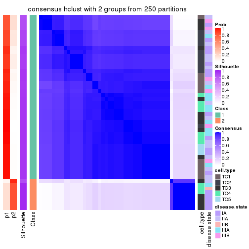</p>

</div>
<div id='tab-CV-hclust-consensus-heatmap-2'>
<pre><code class="r">consensus_heatmap(res, k = 3)
</code></pre>

<p>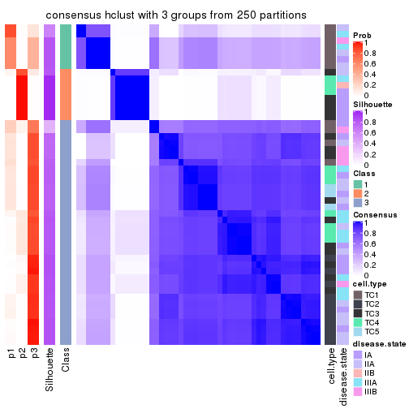</p>

</div>
<div id='tab-CV-hclust-consensus-heatmap-3'>
<pre><code class="r">consensus_heatmap(res, k = 4)
</code></pre>

<p>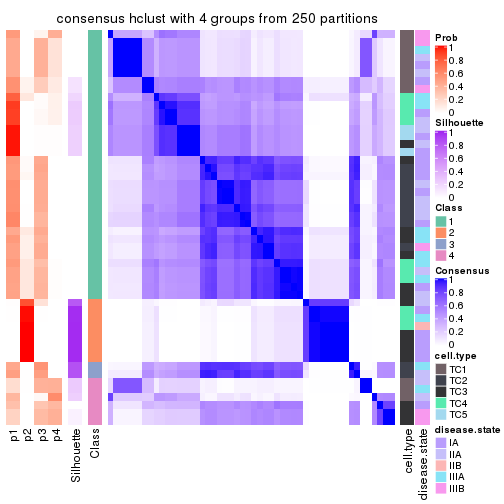</p>

</div>
<div id='tab-CV-hclust-consensus-heatmap-4'>
<pre><code class="r">consensus_heatmap(res, k = 5)
</code></pre>

<p>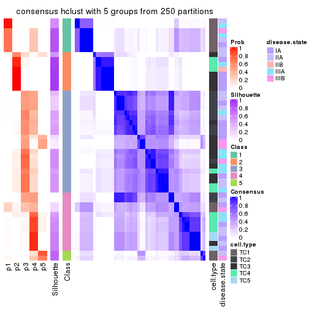</p>

</div>
<div id='tab-CV-hclust-consensus-heatmap-5'>
<pre><code class="r">consensus_heatmap(res, k = 6)
</code></pre>

<p>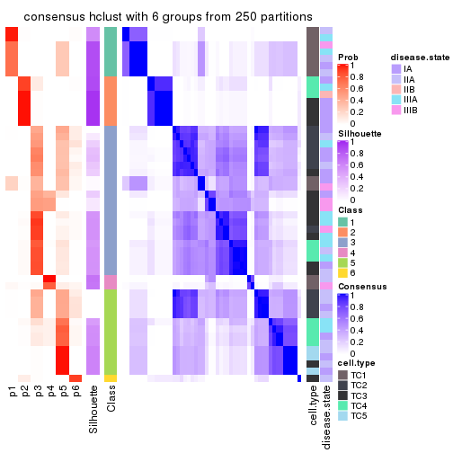</p>

</div>
</div>

Heatmaps for the membership of samples in all partitions to see how consistent they are:


<script>
$( function() {
	$( '#tabs-CV-hclust-membership-heatmap' ).tabs();
} );
</script>
<div id='tabs-CV-hclust-membership-heatmap'>
<ul>
<li><a href='#tab-CV-hclust-membership-heatmap-1'>k = 2</a></li>
<li><a href='#tab-CV-hclust-membership-heatmap-2'>k = 3</a></li>
<li><a href='#tab-CV-hclust-membership-heatmap-3'>k = 4</a></li>
<li><a href='#tab-CV-hclust-membership-heatmap-4'>k = 5</a></li>
<li><a href='#tab-CV-hclust-membership-heatmap-5'>k = 6</a></li>
</ul>
<div id='tab-CV-hclust-membership-heatmap-1'>
<pre><code class="r">membership_heatmap(res, k = 2)
</code></pre>

<p>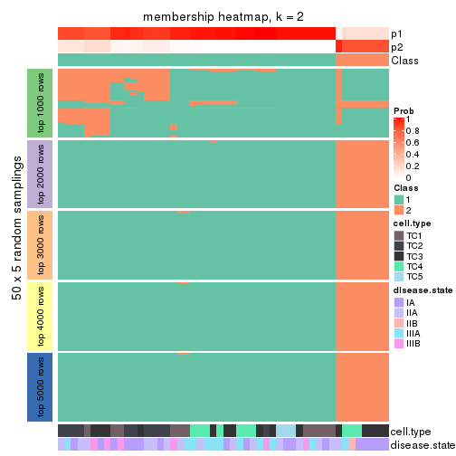</p>

</div>
<div id='tab-CV-hclust-membership-heatmap-2'>
<pre><code class="r">membership_heatmap(res, k = 3)
</code></pre>

<p>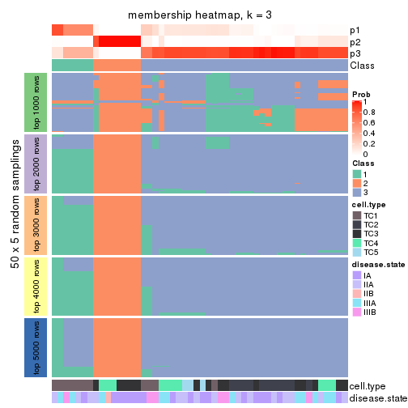</p>

</div>
<div id='tab-CV-hclust-membership-heatmap-3'>
<pre><code class="r">membership_heatmap(res, k = 4)
</code></pre>

<p>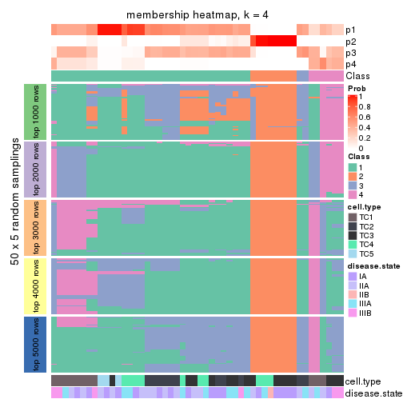</p>

</div>
<div id='tab-CV-hclust-membership-heatmap-4'>
<pre><code class="r">membership_heatmap(res, k = 5)
</code></pre>

<p>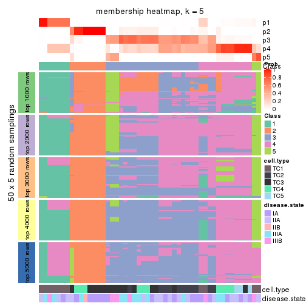</p>

</div>
<div id='tab-CV-hclust-membership-heatmap-5'>
<pre><code class="r">membership_heatmap(res, k = 6)
</code></pre>

<p>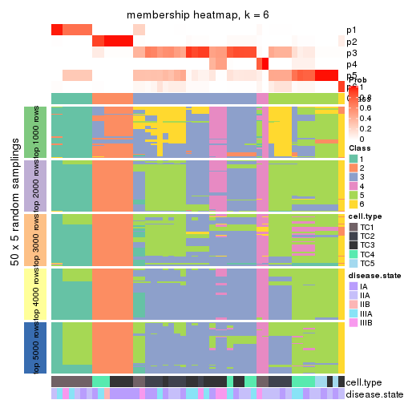</p>

</div>
</div>

As soon as we have had the classes for columns, we can look for signatures
which are significantly different between classes which can be candidate marks
for certain classes. Following are the heatmaps for signatures.


Signature heatmaps where rows are scaled:


<script>
$( function() {
	$( '#tabs-CV-hclust-get-signatures' ).tabs();
} );
</script>
<div id='tabs-CV-hclust-get-signatures'>
<ul>
<li><a href='#tab-CV-hclust-get-signatures-1'>k = 2</a></li>
<li><a href='#tab-CV-hclust-get-signatures-2'>k = 3</a></li>
<li><a href='#tab-CV-hclust-get-signatures-3'>k = 4</a></li>
<li><a href='#tab-CV-hclust-get-signatures-4'>k = 5</a></li>
<li><a href='#tab-CV-hclust-get-signatures-5'>k = 6</a></li>
</ul>
<div id='tab-CV-hclust-get-signatures-1'>
<pre><code class="r">get_signatures(res, k = 2)
</code></pre>

<p>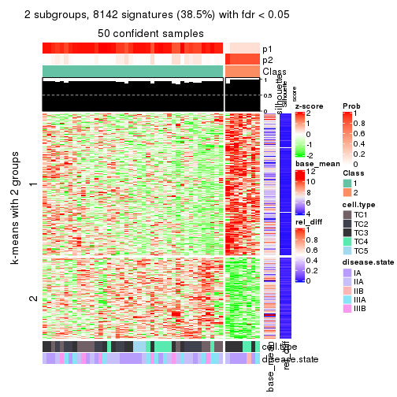</p>

</div>
<div id='tab-CV-hclust-get-signatures-2'>
<pre><code class="r">get_signatures(res, k = 3)
</code></pre>

<p>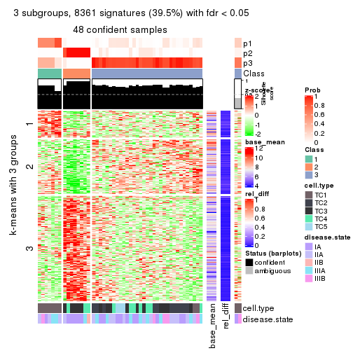</p>

</div>
<div id='tab-CV-hclust-get-signatures-3'>
<pre><code class="r">get_signatures(res, k = 4)
</code></pre>

<p>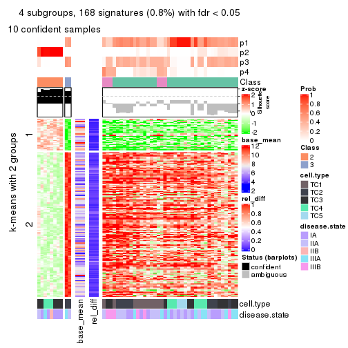</p>

</div>
<div id='tab-CV-hclust-get-signatures-4'>
<pre><code class="r">get_signatures(res, k = 5)
</code></pre>

<p>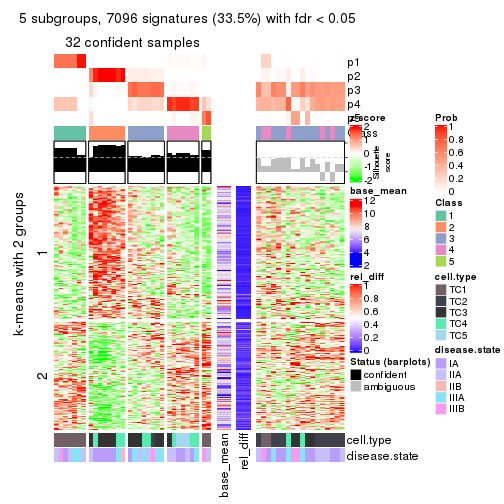</p>

</div>
<div id='tab-CV-hclust-get-signatures-5'>
<pre><code class="r">get_signatures(res, k = 6)
</code></pre>

<p>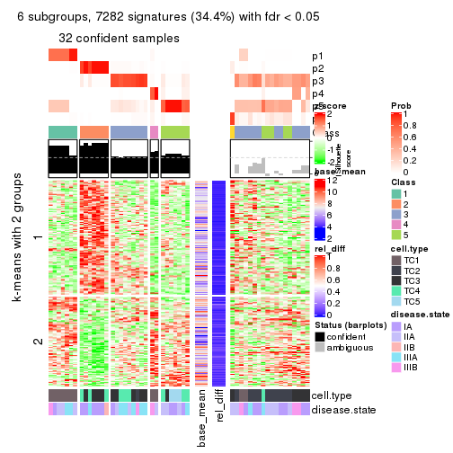</p>

</div>
</div>


Signature heatmaps where rows are not scaled:


<script>
$( function() {
	$( '#tabs-CV-hclust-get-signatures-no-scale' ).tabs();
} );
</script>
<div id='tabs-CV-hclust-get-signatures-no-scale'>
<ul>
<li><a href='#tab-CV-hclust-get-signatures-no-scale-1'>k = 2</a></li>
<li><a href='#tab-CV-hclust-get-signatures-no-scale-2'>k = 3</a></li>
<li><a href='#tab-CV-hclust-get-signatures-no-scale-3'>k = 4</a></li>
<li><a href='#tab-CV-hclust-get-signatures-no-scale-4'>k = 5</a></li>
<li><a href='#tab-CV-hclust-get-signatures-no-scale-5'>k = 6</a></li>
</ul>
<div id='tab-CV-hclust-get-signatures-no-scale-1'>
<pre><code class="r">get_signatures(res, k = 2, scale_rows = FALSE)
</code></pre>

<p>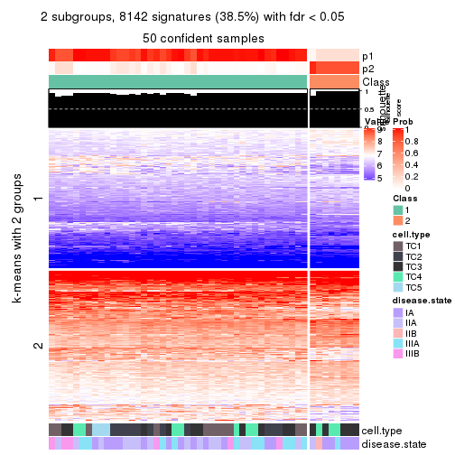</p>

</div>
<div id='tab-CV-hclust-get-signatures-no-scale-2'>
<pre><code class="r">get_signatures(res, k = 3, scale_rows = FALSE)
</code></pre>

<p>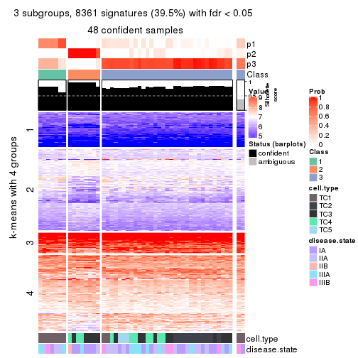</p>

</div>
<div id='tab-CV-hclust-get-signatures-no-scale-3'>
<pre><code class="r">get_signatures(res, k = 4, scale_rows = FALSE)
</code></pre>

<p>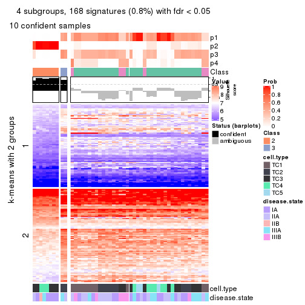</p>

</div>
<div id='tab-CV-hclust-get-signatures-no-scale-4'>
<pre><code class="r">get_signatures(res, k = 5, scale_rows = FALSE)
</code></pre>

<p>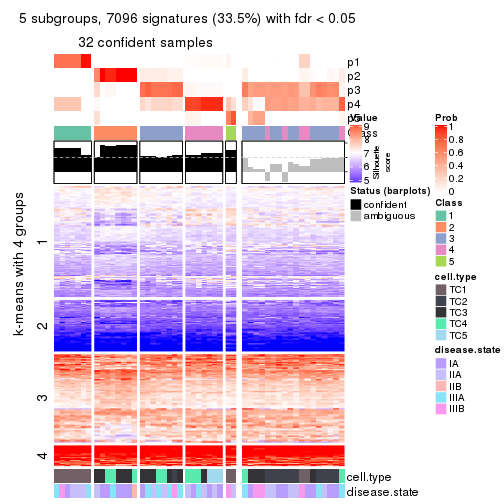</p>

</div>
<div id='tab-CV-hclust-get-signatures-no-scale-5'>
<pre><code class="r">get_signatures(res, k = 6, scale_rows = FALSE)
</code></pre>

<p>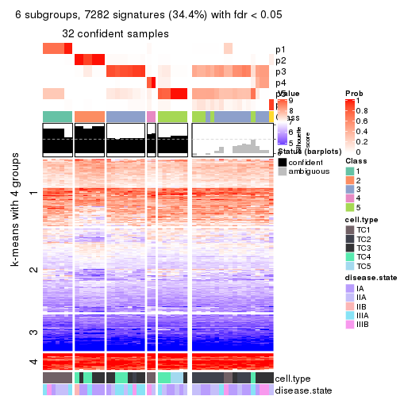</p>

</div>
</div>


Compare the overlap of signatures from different k:

```r
compare_signatures(res)
```

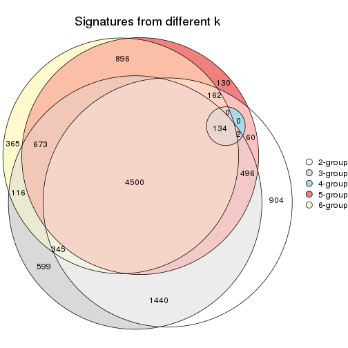

`get_signature()` returns a data frame invisibly. TO get the list of signatures, the function
call should be assigned to a variable explicitly. In following code, if `plot` argument is set
to `FALSE`, no heatmap is plotted while only the differential analysis is performed.

```r
# code only for demonstration
tb = get_signature(res, k = ..., plot = FALSE)
```

An example of the output of `tb` is:

```
#>   which_row         fdr    mean_1    mean_2 scaled_mean_1 scaled_mean_2 km
#> 1        38 0.042760348  8.373488  9.131774    -0.5533452     0.5164555  1
#> 2        40 0.018707592  7.106213  8.469186    -0.6173731     0.5762149  1
#> 3        55 0.019134737 10.221463 11.207825    -0.6159697     0.5749050  1
#> 4        59 0.006059896  5.921854  7.869574    -0.6899429     0.6439467  1
#> 5        60 0.018055526  8.928898 10.211722    -0.6204761     0.5791110  1
#> 6        98 0.009384629 15.714769 14.887706     0.6635654    -0.6193277  2
...
```

The columns in `tb` are:

1. `which_row`: row indices corresponding to the input matrix.
2. `fdr`: FDR for the differential test. 
3. `mean_x`: The mean value in group x.
4. `scaled_mean_x`: The mean value in group x after rows are scaled.
5. `km`: Row groups if k-means clustering is applied to rows.


UMAP plot which shows how samples are separated.


<script>
$( function() {
	$( '#tabs-CV-hclust-dimension-reduction' ).tabs();
} );
</script>
<div id='tabs-CV-hclust-dimension-reduction'>
<ul>
<li><a href='#tab-CV-hclust-dimension-reduction-1'>k = 2</a></li>
<li><a href='#tab-CV-hclust-dimension-reduction-2'>k = 3</a></li>
<li><a href='#tab-CV-hclust-dimension-reduction-3'>k = 4</a></li>
<li><a href='#tab-CV-hclust-dimension-reduction-4'>k = 5</a></li>
<li><a href='#tab-CV-hclust-dimension-reduction-5'>k = 6</a></li>
</ul>
<div id='tab-CV-hclust-dimension-reduction-1'>
<pre><code class="r">dimension_reduction(res, k = 2, method = &quot;UMAP&quot;)
</code></pre>

<p>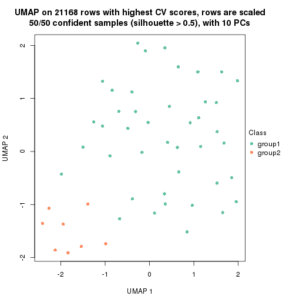</p>

</div>
<div id='tab-CV-hclust-dimension-reduction-2'>
<pre><code class="r">dimension_reduction(res, k = 3, method = &quot;UMAP&quot;)
</code></pre>

<p>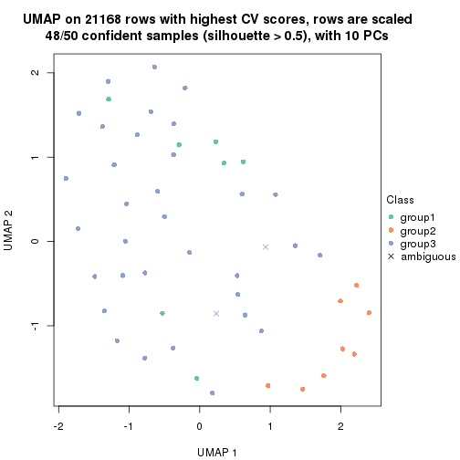</p>

</div>
<div id='tab-CV-hclust-dimension-reduction-3'>
<pre><code class="r">dimension_reduction(res, k = 4, method = &quot;UMAP&quot;)
</code></pre>

<p>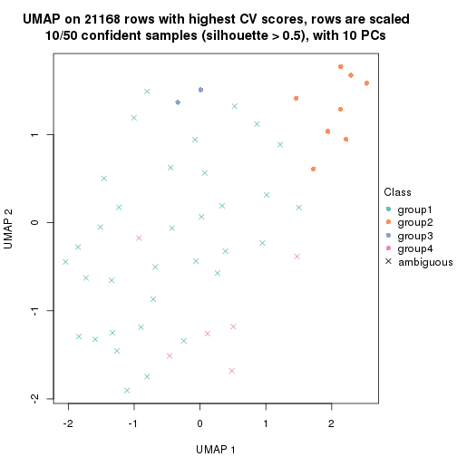</p>

</div>
<div id='tab-CV-hclust-dimension-reduction-4'>
<pre><code class="r">dimension_reduction(res, k = 5, method = &quot;UMAP&quot;)
</code></pre>

<p>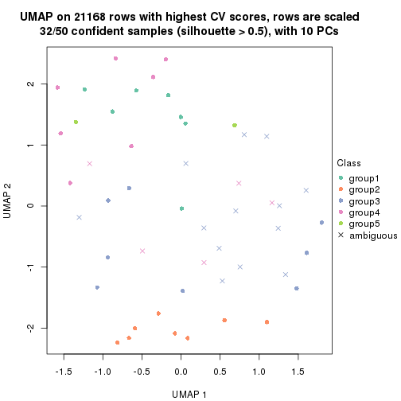</p>

</div>
<div id='tab-CV-hclust-dimension-reduction-5'>
<pre><code class="r">dimension_reduction(res, k = 6, method = &quot;UMAP&quot;)
</code></pre>

<p>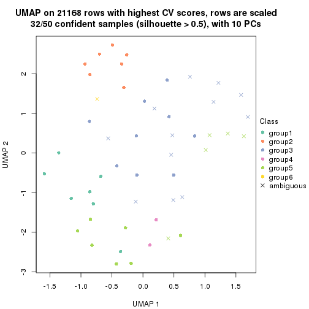</p>

</div>
</div>


Following heatmap shows how subgroups are split when increasing `k`:

```r
collect_classes(res)
```

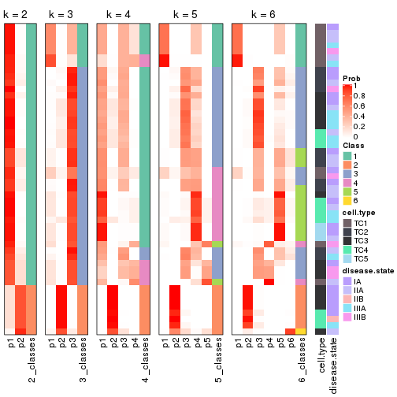


Test correlation between subgroups and known annotations. If the known
annotation is numeric, one-way ANOVA test is applied, and if the known
annotation is discrete, chi-squared contingency table test is applied.

```r
test_to_known_factors(res)
```

```
#>            n cell.type(p) disease.state(p) k
#> CV:hclust 50     4.83e-02           0.0399 2
#> CV:hclust 48     1.06e-06           0.2211 3
#> CV:hclust 10     6.74e-03           0.2898 4
#> CV:hclust 32     4.83e-05           0.3039 5
#> CV:hclust 32     7.78e-05           0.1309 6
```


If matrix rows can be associated to genes, consider to use `functional_enrichment(res,
...)` to perform function enrichment for the signature genes. See [this vignette](http://bioconductor.org/packages/devel/bioc/vignettes/cola/inst/doc/functional_enrichment.html) for more detailed explanations.


 

---------------------------------------------------


### CV:kmeans


The object with results only for a single top-value method and a single partition method 
can be extracted as:

```r
res = res_list["CV", "kmeans"]
# you can also extract it by
# res = res_list["CV:kmeans"]
```

A summary of `res` and all the functions that can be applied to it:

```r
res
```

```
#> A 'ConsensusPartition' object with k = 2, 3, 4, 5, 6.
#>   On a matrix with 21168 rows and 50 columns.
#>   Top rows (1000, 2000, 3000, 4000, 5000) are extracted by 'CV' method.
#>   Subgroups are detected by 'kmeans' method.
#>   Performed in total 1250 partitions by row resampling.
#>   Best k for subgroups seems to be 5.
#> 
#> Following methods can be applied to this 'ConsensusPartition' object:
#>  [1] "cola_report"             "collect_classes"         "collect_plots"          
#>  [4] "collect_stats"           "colnames"                "compare_signatures"     
#>  [7] "consensus_heatmap"       "dimension_reduction"     "functional_enrichment"  
#> [10] "get_anno_col"            "get_anno"                "get_classes"            
#> [13] "get_consensus"           "get_matrix"              "get_membership"         
#> [16] "get_param"               "get_signatures"          "get_stats"              
#> [19] "is_best_k"               "is_stable_k"             "membership_heatmap"     
#> [22] "ncol"                    "nrow"                    "plot_ecdf"              
#> [25] "rownames"                "select_partition_number" "show"                   
#> [28] "suggest_best_k"          "test_to_known_factors"
```

`collect_plots()` function collects all the plots made from `res` for all `k` (number of partitions)
into one single page to provide an easy and fast comparison between different `k`.

```r
collect_plots(res)
```

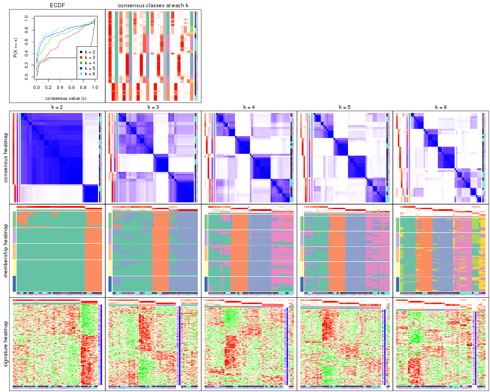

The plots are:

- The first row: a plot of the ECDF (empirical cumulative distribution
  function) curves of the consensus matrix for each `k` and the heatmap of
  predicted classes for each `k`.
- The second row: heatmaps of the consensus matrix for each `k`.
- The third row: heatmaps of the membership matrix for each `k`.
- The fouth row: heatmaps of the signatures for each `k`.

All the plots in panels can be made by individual functions and they are
plotted later in this section.

`select_partition_number()` produces several plots showing different
statistics for choosing "optimized" `k`. There are following statistics:

- ECDF curves of the consensus matrix for each `k`;
- 1-PAC. [The PAC
  score](https://en.wikipedia.org/wiki/Consensus_clustering#Over-interpretation_potential_of_consensus_clustering)
  measures the proportion of the ambiguous subgrouping.
- Mean silhouette score.
- Concordance. The mean probability of fiting the consensus class ids in all
  partitions.
- Area increased. Denote $A_k$ as the area under the ECDF curve for current
  `k`, the area increased is defined as $A_k - A_{k-1}$.
- Rand index. The percent of pairs of samples that are both in a same cluster
  or both are not in a same cluster in the partition of k and k-1.
- Jaccard index. The ratio of pairs of samples are both in a same cluster in
  the partition of k and k-1 and the pairs of samples are both in a same
  cluster in the partition k or k-1.

The detailed explanations of these statistics can be found in [the _cola_
vignette](http://bioconductor.org/packages/devel/bioc/vignettes/cola/inst/doc/cola.html#toc_13).

Generally speaking, lower PAC score, higher mean silhouette score or higher
concordance corresponds to better partition. Rand index and Jaccard index
measure how similar the current partition is compared to partition with `k-1`.
If they are too similar, we won't accept `k` is better than `k-1`.

```r
select_partition_number(res)
```

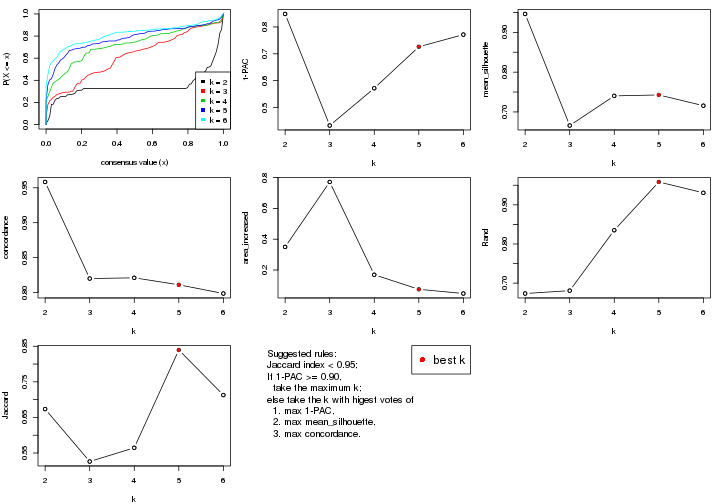

The numeric values for all these statistics can be obtained by `get_stats()`.

```r
get_stats(res)
```

```
#>   k 1-PAC mean_silhouette concordance area_increased  Rand Jaccard
#> 2 2 0.848           0.946       0.958         0.3499 0.673   0.673
#> 3 3 0.433           0.666       0.820         0.7717 0.681   0.526
#> 4 4 0.572           0.740       0.821         0.1691 0.835   0.565
#> 5 5 0.726           0.743       0.811         0.0747 0.958   0.840
#> 6 6 0.772           0.716       0.799         0.0473 0.931   0.713
```

`suggest_best_k()` suggests the best $k$ based on these statistics. The rules are as follows:

- All $k$ with Jaccard index larger than 0.95 are removed because increasing
  $k$ does not provide enough extra information. If all $k$ are removed, it is
  marked as no subgroup is detected.
- For all $k$ with 1-PAC score larger than 0.9, the maximal $k$ is taken as
  the best $k$, and other $k$ are marked as optional $k$.
- If it does not fit the second rule. The $k$ with the maximal vote of the
  highest 1-PAC score, highest mean silhouette, and highest concordance is
  taken as the best $k$.

```r
suggest_best_k(res)
```

```
#> [1] 5
```


Following shows the table of the partitions (You need to click the **show/hide
code output** link to see it). The membership matrix (columns with name `p*`)
is inferred by
[`clue::cl_consensus()`](https://www.rdocumentation.org/link/cl_consensus?package=clue)
function with the `SE` method. Basically the value in the membership matrix
represents the probability to belong to a certain group. The finall class
label for an item is determined with the group with highest probability it
belongs to.

In `get_classes()` function, the entropy is calculated from the membership
matrix and the silhouette score is calculated from the consensus matrix.


<script>
$( function() {
	$( '#tabs-CV-kmeans-get-classes' ).tabs();
} );
</script>
<div id='tabs-CV-kmeans-get-classes'>
<ul>
<li><a href='#tab-CV-kmeans-get-classes-1'>k = 2</a></li>
<li><a href='#tab-CV-kmeans-get-classes-2'>k = 3</a></li>
<li><a href='#tab-CV-kmeans-get-classes-3'>k = 4</a></li>
<li><a href='#tab-CV-kmeans-get-classes-4'>k = 5</a></li>
<li><a href='#tab-CV-kmeans-get-classes-5'>k = 6</a></li>
</ul>

<div id='tab-CV-kmeans-get-classes-1'>
<p><a id='tab-CV-kmeans-get-classes-1-a' style='color:#0366d6' href='#'>show/hide code output</a></p>
<pre><code class="r">cbind(get_classes(res, k = 2), get_membership(res, k = 2))
</code></pre>

<pre><code>#&gt;          class entropy silhouette    p1    p2
#&gt; GSM63448     1  0.1633      0.960 0.976 0.024
#&gt; GSM63449     1  0.1633      0.960 0.976 0.024
#&gt; GSM63423     1  0.1633      0.960 0.976 0.024
#&gt; GSM63425     1  0.0376      0.956 0.996 0.004
#&gt; GSM63437     1  0.1633      0.960 0.976 0.024
#&gt; GSM63453     1  0.5059      0.902 0.888 0.112
#&gt; GSM63431     1  0.0376      0.957 0.996 0.004
#&gt; GSM63450     1  0.5059      0.902 0.888 0.112
#&gt; GSM63428     1  0.1633      0.960 0.976 0.024
#&gt; GSM63432     1  0.1414      0.960 0.980 0.020
#&gt; GSM63458     1  0.0376      0.956 0.996 0.004
#&gt; GSM63434     1  0.2603      0.955 0.956 0.044
#&gt; GSM63435     1  0.1414      0.960 0.980 0.020
#&gt; GSM63442     1  0.1414      0.960 0.980 0.020
#&gt; GSM63451     1  0.2603      0.955 0.956 0.044
#&gt; GSM63422     1  0.1184      0.960 0.984 0.016
#&gt; GSM63438     1  0.1414      0.960 0.980 0.020
#&gt; GSM63439     1  0.1414      0.960 0.980 0.020
#&gt; GSM63461     1  0.1414      0.960 0.980 0.020
#&gt; GSM63463     1  0.1414      0.960 0.980 0.020
#&gt; GSM63430     1  0.1414      0.960 0.980 0.020
#&gt; GSM63446     1  0.2948      0.952 0.948 0.052
#&gt; GSM63429     1  0.2948      0.946 0.948 0.052
#&gt; GSM63445     1  0.1414      0.960 0.980 0.020
#&gt; GSM63447     1  0.7376      0.813 0.792 0.208
#&gt; GSM63459     2  0.0376      0.983 0.004 0.996
#&gt; GSM63464     2  0.0376      0.983 0.004 0.996
#&gt; GSM63469     2  0.0376      0.983 0.004 0.996
#&gt; GSM63470     2  0.0376      0.983 0.004 0.996
#&gt; GSM63436     1  0.0376      0.957 0.996 0.004
#&gt; GSM63443     2  0.6048      0.833 0.148 0.852
#&gt; GSM63465     1  0.7376      0.813 0.792 0.208
#&gt; GSM63444     2  0.0376      0.983 0.004 0.996
#&gt; GSM63456     2  0.0376      0.983 0.004 0.996
#&gt; GSM63462     1  0.3584      0.946 0.932 0.068
#&gt; GSM63424     1  0.2948      0.946 0.948 0.052
#&gt; GSM63440     1  0.2948      0.946 0.948 0.052
#&gt; GSM63433     1  0.1414      0.956 0.980 0.020
#&gt; GSM63466     2  0.0376      0.983 0.004 0.996
#&gt; GSM63426     1  0.1184      0.957 0.984 0.016
#&gt; GSM63468     1  0.6343      0.851 0.840 0.160
#&gt; GSM63452     2  0.0672      0.980 0.008 0.992
#&gt; GSM63441     1  0.3879      0.929 0.924 0.076
#&gt; GSM63454     1  0.6343      0.851 0.840 0.160
#&gt; GSM63455     1  0.1414      0.956 0.980 0.020
#&gt; GSM63460     2  0.0376      0.983 0.004 0.996
#&gt; GSM63467     1  0.3114      0.953 0.944 0.056
#&gt; GSM63421     1  0.0376      0.957 0.996 0.004
#&gt; GSM63427     1  0.0672      0.958 0.992 0.008
#&gt; GSM63457     1  0.0672      0.958 0.992 0.008
</code></pre>

<script>
$('#tab-CV-kmeans-get-classes-1-a').parent().next().next().hide();
$('#tab-CV-kmeans-get-classes-1-a').click(function(){
  $('#tab-CV-kmeans-get-classes-1-a').parent().next().next().toggle();
  return(false);
});
</script>
</div>

<div id='tab-CV-kmeans-get-classes-2'>
<p><a id='tab-CV-kmeans-get-classes-2-a' style='color:#0366d6' href='#'>show/hide code output</a></p>
<pre><code class="r">cbind(get_classes(res, k = 3), get_membership(res, k = 3))
</code></pre>

<pre><code>#&gt;          class entropy silhouette    p1    p2    p3
#&gt; GSM63448     1  0.6062      0.597 0.616 0.000 0.384
#&gt; GSM63449     1  0.6062      0.524 0.616 0.000 0.384
#&gt; GSM63423     1  0.5948      0.559 0.640 0.000 0.360
#&gt; GSM63425     1  0.4834      0.653 0.792 0.004 0.204
#&gt; GSM63437     1  0.5948      0.559 0.640 0.000 0.360
#&gt; GSM63453     1  0.5921      0.610 0.756 0.032 0.212
#&gt; GSM63431     1  0.4504      0.684 0.804 0.000 0.196
#&gt; GSM63450     1  0.5921      0.610 0.756 0.032 0.212
#&gt; GSM63428     1  0.6062      0.524 0.616 0.000 0.384
#&gt; GSM63432     3  0.5291      0.450 0.268 0.000 0.732
#&gt; GSM63458     1  0.2625      0.678 0.916 0.000 0.084
#&gt; GSM63434     3  0.0237      0.825 0.004 0.000 0.996
#&gt; GSM63435     3  0.0424      0.824 0.008 0.000 0.992
#&gt; GSM63442     3  0.0424      0.824 0.008 0.000 0.992
#&gt; GSM63451     3  0.0237      0.825 0.004 0.000 0.996
#&gt; GSM63422     3  0.0237      0.823 0.004 0.000 0.996
#&gt; GSM63438     3  0.0237      0.825 0.004 0.000 0.996
#&gt; GSM63439     3  0.0237      0.825 0.004 0.000 0.996
#&gt; GSM63461     3  0.0237      0.823 0.004 0.000 0.996
#&gt; GSM63463     3  0.0424      0.824 0.008 0.000 0.992
#&gt; GSM63430     3  0.0237      0.825 0.004 0.000 0.996
#&gt; GSM63446     3  0.0237      0.821 0.000 0.004 0.996
#&gt; GSM63429     1  0.6888      0.243 0.552 0.016 0.432
#&gt; GSM63445     3  0.2448      0.756 0.076 0.000 0.924
#&gt; GSM63447     1  0.9201      0.256 0.488 0.160 0.352
#&gt; GSM63459     2  0.0237      0.949 0.000 0.996 0.004
#&gt; GSM63464     2  0.0237      0.949 0.000 0.996 0.004
#&gt; GSM63469     2  0.0237      0.949 0.000 0.996 0.004
#&gt; GSM63470     2  0.0237      0.949 0.000 0.996 0.004
#&gt; GSM63436     1  0.5178      0.684 0.744 0.000 0.256
#&gt; GSM63443     2  0.5115      0.714 0.004 0.768 0.228
#&gt; GSM63465     3  0.9302     -0.102 0.416 0.160 0.424
#&gt; GSM63444     2  0.0747      0.941 0.000 0.984 0.016
#&gt; GSM63456     2  0.4504      0.757 0.000 0.804 0.196
#&gt; GSM63462     3  0.6161      0.423 0.288 0.016 0.696
#&gt; GSM63424     3  0.6608      0.339 0.356 0.016 0.628
#&gt; GSM63440     3  0.6608      0.339 0.356 0.016 0.628
#&gt; GSM63433     1  0.4002      0.675 0.840 0.000 0.160
#&gt; GSM63466     2  0.0237      0.949 0.000 0.996 0.004
#&gt; GSM63426     1  0.4002      0.675 0.840 0.000 0.160
#&gt; GSM63468     1  0.7726      0.360 0.572 0.056 0.372
#&gt; GSM63452     2  0.0237      0.949 0.000 0.996 0.004
#&gt; GSM63441     1  0.7671      0.345 0.568 0.052 0.380
#&gt; GSM63454     1  0.7756      0.346 0.564 0.056 0.380
#&gt; GSM63455     1  0.3941      0.676 0.844 0.000 0.156
#&gt; GSM63460     2  0.0237      0.949 0.000 0.996 0.004
#&gt; GSM63467     1  0.5774      0.627 0.748 0.020 0.232
#&gt; GSM63421     1  0.4062      0.695 0.836 0.000 0.164
#&gt; GSM63427     1  0.4062      0.695 0.836 0.000 0.164
#&gt; GSM63457     1  0.4062      0.695 0.836 0.000 0.164
</code></pre>

<script>
$('#tab-CV-kmeans-get-classes-2-a').parent().next().next().hide();
$('#tab-CV-kmeans-get-classes-2-a').click(function(){
  $('#tab-CV-kmeans-get-classes-2-a').parent().next().next().toggle();
  return(false);
});
</script>
</div>

<div id='tab-CV-kmeans-get-classes-3'>
<p><a id='tab-CV-kmeans-get-classes-3-a' style='color:#0366d6' href='#'>show/hide code output</a></p>
<pre><code class="r">cbind(get_classes(res, k = 4), get_membership(res, k = 4))
</code></pre>

<pre><code>#&gt;          class entropy silhouette    p1    p2    p3    p4
#&gt; GSM63448     1  0.7705     0.5181 0.444 0.000 0.244 0.312
#&gt; GSM63449     1  0.6313     0.6805 0.652 0.000 0.220 0.128
#&gt; GSM63423     1  0.6313     0.6805 0.652 0.000 0.220 0.128
#&gt; GSM63425     4  0.3745     0.7367 0.088 0.000 0.060 0.852
#&gt; GSM63437     1  0.6313     0.6805 0.652 0.000 0.220 0.128
#&gt; GSM63453     1  0.2853     0.6109 0.900 0.008 0.016 0.076
#&gt; GSM63431     1  0.4446     0.6733 0.776 0.000 0.028 0.196
#&gt; GSM63450     1  0.2853     0.6109 0.900 0.008 0.016 0.076
#&gt; GSM63428     1  0.6313     0.6805 0.652 0.000 0.220 0.128
#&gt; GSM63432     3  0.5500    -0.0756 0.464 0.000 0.520 0.016
#&gt; GSM63458     1  0.5294     0.3813 0.508 0.000 0.008 0.484
#&gt; GSM63434     3  0.0779     0.8944 0.004 0.000 0.980 0.016
#&gt; GSM63435     3  0.0188     0.8978 0.000 0.000 0.996 0.004
#&gt; GSM63442     3  0.0188     0.8978 0.000 0.000 0.996 0.004
#&gt; GSM63451     3  0.0779     0.8944 0.004 0.000 0.980 0.016
#&gt; GSM63422     3  0.0188     0.8978 0.000 0.000 0.996 0.004
#&gt; GSM63438     3  0.0000     0.8987 0.000 0.000 1.000 0.000
#&gt; GSM63439     3  0.0469     0.8963 0.000 0.000 0.988 0.012
#&gt; GSM63461     3  0.0000     0.8987 0.000 0.000 1.000 0.000
#&gt; GSM63463     3  0.0000     0.8987 0.000 0.000 1.000 0.000
#&gt; GSM63430     3  0.0188     0.8984 0.000 0.000 0.996 0.004
#&gt; GSM63446     3  0.0779     0.8944 0.004 0.000 0.980 0.016
#&gt; GSM63429     4  0.4388     0.7661 0.060 0.000 0.132 0.808
#&gt; GSM63445     3  0.1833     0.8534 0.024 0.000 0.944 0.032
#&gt; GSM63447     4  0.6222     0.7781 0.056 0.088 0.124 0.732
#&gt; GSM63459     2  0.0336     0.9434 0.000 0.992 0.000 0.008
#&gt; GSM63464     2  0.0000     0.9430 0.000 1.000 0.000 0.000
#&gt; GSM63469     2  0.0336     0.9434 0.000 0.992 0.000 0.008
#&gt; GSM63470     2  0.0336     0.9434 0.000 0.992 0.000 0.008
#&gt; GSM63436     1  0.6592     0.5667 0.524 0.000 0.084 0.392
#&gt; GSM63443     2  0.4710     0.6539 0.008 0.732 0.252 0.008
#&gt; GSM63465     4  0.6341     0.7734 0.056 0.080 0.144 0.720
#&gt; GSM63444     2  0.1697     0.9180 0.004 0.952 0.016 0.028
#&gt; GSM63456     2  0.3695     0.8387 0.008 0.856 0.108 0.028
#&gt; GSM63462     3  0.5827    -0.1015 0.032 0.000 0.532 0.436
#&gt; GSM63424     4  0.4831     0.7136 0.040 0.000 0.208 0.752
#&gt; GSM63440     4  0.4831     0.7136 0.040 0.000 0.208 0.752
#&gt; GSM63433     4  0.4139     0.6602 0.176 0.000 0.024 0.800
#&gt; GSM63466     2  0.0000     0.9430 0.000 1.000 0.000 0.000
#&gt; GSM63426     4  0.4139     0.6602 0.176 0.000 0.024 0.800
#&gt; GSM63468     4  0.5086     0.8078 0.064 0.020 0.128 0.788
#&gt; GSM63452     2  0.0336     0.9434 0.000 0.992 0.000 0.008
#&gt; GSM63441     4  0.4959     0.8077 0.060 0.020 0.124 0.796
#&gt; GSM63454     4  0.5086     0.8078 0.064 0.020 0.128 0.788
#&gt; GSM63455     4  0.4225     0.6608 0.184 0.000 0.024 0.792
#&gt; GSM63460     2  0.0000     0.9430 0.000 1.000 0.000 0.000
#&gt; GSM63467     4  0.4483     0.7765 0.088 0.000 0.104 0.808
#&gt; GSM63421     1  0.5805     0.5734 0.576 0.000 0.036 0.388
#&gt; GSM63427     1  0.5805     0.5734 0.576 0.000 0.036 0.388
#&gt; GSM63457     1  0.5723     0.5689 0.580 0.000 0.032 0.388
</code></pre>

<script>
$('#tab-CV-kmeans-get-classes-3-a').parent().next().next().hide();
$('#tab-CV-kmeans-get-classes-3-a').click(function(){
  $('#tab-CV-kmeans-get-classes-3-a').parent().next().next().toggle();
  return(false);
});
</script>
</div>

<div id='tab-CV-kmeans-get-classes-4'>
<p><a id='tab-CV-kmeans-get-classes-4-a' style='color:#0366d6' href='#'>show/hide code output</a></p>
<pre><code class="r">cbind(get_classes(res, k = 5), get_membership(res, k = 5))
</code></pre>

<pre><code>#&gt;          class entropy silhouette    p1    p2    p3    p4 p5
#&gt; GSM63448     1  0.5753      0.614 0.652 0.000 0.116 0.216 NA
#&gt; GSM63449     1  0.3767      0.691 0.812 0.000 0.120 0.068 NA
#&gt; GSM63423     1  0.3767      0.691 0.812 0.000 0.120 0.068 NA
#&gt; GSM63425     4  0.5076      0.597 0.024 0.000 0.012 0.600 NA
#&gt; GSM63437     1  0.3767      0.691 0.812 0.000 0.120 0.068 NA
#&gt; GSM63453     1  0.4703      0.547 0.684 0.000 0.004 0.036 NA
#&gt; GSM63431     1  0.2795      0.674 0.884 0.000 0.008 0.080 NA
#&gt; GSM63450     1  0.4703      0.547 0.684 0.000 0.004 0.036 NA
#&gt; GSM63428     1  0.3767      0.691 0.812 0.000 0.120 0.068 NA
#&gt; GSM63432     1  0.4483      0.504 0.672 0.000 0.308 0.012 NA
#&gt; GSM63458     1  0.6934      0.189 0.416 0.000 0.008 0.252 NA
#&gt; GSM63434     3  0.1628      0.953 0.000 0.000 0.936 0.008 NA
#&gt; GSM63435     3  0.0854      0.971 0.004 0.000 0.976 0.008 NA
#&gt; GSM63442     3  0.0613      0.972 0.004 0.000 0.984 0.008 NA
#&gt; GSM63451     3  0.1484      0.955 0.000 0.000 0.944 0.008 NA
#&gt; GSM63422     3  0.0566      0.968 0.004 0.000 0.984 0.000 NA
#&gt; GSM63438     3  0.0451      0.972 0.004 0.000 0.988 0.008 NA
#&gt; GSM63439     3  0.0898      0.969 0.000 0.000 0.972 0.008 NA
#&gt; GSM63461     3  0.0324      0.970 0.004 0.000 0.992 0.000 NA
#&gt; GSM63463     3  0.0613      0.972 0.004 0.000 0.984 0.008 NA
#&gt; GSM63430     3  0.1153      0.969 0.004 0.000 0.964 0.008 NA
#&gt; GSM63446     3  0.1270      0.951 0.000 0.000 0.948 0.000 NA
#&gt; GSM63429     4  0.4478      0.667 0.008 0.000 0.020 0.700 NA
#&gt; GSM63445     3  0.2067      0.931 0.004 0.000 0.924 0.028 NA
#&gt; GSM63447     4  0.3840      0.719 0.012 0.080 0.036 0.844 NA
#&gt; GSM63459     2  0.0404      0.926 0.000 0.988 0.000 0.000 NA
#&gt; GSM63464     2  0.0000      0.926 0.000 1.000 0.000 0.000 NA
#&gt; GSM63469     2  0.0404      0.926 0.000 0.988 0.000 0.000 NA
#&gt; GSM63470     2  0.0404      0.926 0.000 0.988 0.000 0.000 NA
#&gt; GSM63436     1  0.6552      0.501 0.508 0.000 0.004 0.248 NA
#&gt; GSM63443     2  0.5561      0.584 0.004 0.652 0.252 0.008 NA
#&gt; GSM63465     4  0.4395      0.710 0.012 0.072 0.044 0.816 NA
#&gt; GSM63444     2  0.2606      0.879 0.000 0.900 0.012 0.032 NA
#&gt; GSM63456     2  0.4204      0.804 0.000 0.808 0.104 0.028 NA
#&gt; GSM63462     4  0.5946      0.145 0.008 0.004 0.440 0.480 NA
#&gt; GSM63424     4  0.5215      0.599 0.000 0.000 0.052 0.576 NA
#&gt; GSM63440     4  0.5204      0.600 0.000 0.000 0.052 0.580 NA
#&gt; GSM63433     4  0.4323      0.647 0.076 0.004 0.008 0.792 NA
#&gt; GSM63466     2  0.0290      0.925 0.000 0.992 0.000 0.000 NA
#&gt; GSM63426     4  0.4323      0.647 0.076 0.004 0.008 0.792 NA
#&gt; GSM63468     4  0.1651      0.741 0.012 0.008 0.036 0.944 NA
#&gt; GSM63452     2  0.0162      0.926 0.000 0.996 0.000 0.000 NA
#&gt; GSM63441     4  0.1686      0.742 0.012 0.004 0.036 0.944 NA
#&gt; GSM63454     4  0.1812      0.741 0.012 0.008 0.036 0.940 NA
#&gt; GSM63455     4  0.4615      0.634 0.084 0.004 0.008 0.768 NA
#&gt; GSM63460     2  0.0290      0.925 0.000 0.992 0.000 0.000 NA
#&gt; GSM63467     4  0.3251      0.722 0.036 0.004 0.048 0.876 NA
#&gt; GSM63421     1  0.6429      0.529 0.532 0.000 0.004 0.216 NA
#&gt; GSM63427     1  0.6447      0.526 0.528 0.000 0.004 0.216 NA
#&gt; GSM63457     1  0.6429      0.529 0.532 0.000 0.004 0.216 NA
</code></pre>

<script>
$('#tab-CV-kmeans-get-classes-4-a').parent().next().next().hide();
$('#tab-CV-kmeans-get-classes-4-a').click(function(){
  $('#tab-CV-kmeans-get-classes-4-a').parent().next().next().toggle();
  return(false);
});
</script>
</div>

<div id='tab-CV-kmeans-get-classes-5'>
<p><a id='tab-CV-kmeans-get-classes-5-a' style='color:#0366d6' href='#'>show/hide code output</a></p>
<pre><code class="r">cbind(get_classes(res, k = 6), get_membership(res, k = 6))
</code></pre>

<pre><code>#&gt;          class entropy silhouette    p1    p2    p3    p4    p5    p6
#&gt; GSM63448     1  0.3194     0.6728 0.848 0.000 0.064 0.076 0.008 0.004
#&gt; GSM63449     1  0.1950     0.7318 0.912 0.000 0.064 0.024 0.000 0.000
#&gt; GSM63423     1  0.1950     0.7318 0.912 0.000 0.064 0.024 0.000 0.000
#&gt; GSM63425     6  0.4181     0.6573 0.012 0.000 0.004 0.312 0.008 0.664
#&gt; GSM63437     1  0.1950     0.7318 0.912 0.000 0.064 0.024 0.000 0.000
#&gt; GSM63453     1  0.5568     0.2825 0.468 0.000 0.000 0.004 0.408 0.120
#&gt; GSM63431     1  0.2165     0.5700 0.884 0.000 0.000 0.008 0.108 0.000
#&gt; GSM63450     1  0.5568     0.2825 0.468 0.000 0.000 0.004 0.408 0.120
#&gt; GSM63428     1  0.1950     0.7318 0.912 0.000 0.064 0.024 0.000 0.000
#&gt; GSM63432     1  0.3043     0.6603 0.832 0.000 0.140 0.020 0.008 0.000
#&gt; GSM63458     6  0.7163    -0.0989 0.292 0.000 0.000 0.088 0.240 0.380
#&gt; GSM63434     3  0.2630     0.8883 0.000 0.000 0.872 0.000 0.064 0.064
#&gt; GSM63435     3  0.0810     0.9412 0.004 0.000 0.976 0.004 0.008 0.008
#&gt; GSM63442     3  0.0436     0.9425 0.004 0.000 0.988 0.004 0.000 0.004
#&gt; GSM63451     3  0.2568     0.8860 0.000 0.000 0.876 0.000 0.056 0.068
#&gt; GSM63422     3  0.0810     0.9412 0.004 0.000 0.976 0.004 0.008 0.008
#&gt; GSM63438     3  0.0291     0.9427 0.004 0.000 0.992 0.000 0.004 0.000
#&gt; GSM63439     3  0.0622     0.9400 0.000 0.000 0.980 0.000 0.012 0.008
#&gt; GSM63461     3  0.0146     0.9430 0.004 0.000 0.996 0.000 0.000 0.000
#&gt; GSM63463     3  0.0405     0.9429 0.000 0.000 0.988 0.000 0.004 0.008
#&gt; GSM63430     3  0.0862     0.9407 0.004 0.000 0.972 0.000 0.016 0.008
#&gt; GSM63446     3  0.3045     0.8598 0.000 0.000 0.840 0.000 0.060 0.100
#&gt; GSM63429     4  0.4298    -0.2535 0.004 0.000 0.008 0.564 0.004 0.420
#&gt; GSM63445     3  0.2987     0.8444 0.008 0.000 0.864 0.020 0.088 0.020
#&gt; GSM63447     4  0.3096     0.5868 0.000 0.076 0.012 0.860 0.008 0.044
#&gt; GSM63459     2  0.0508     0.8867 0.000 0.984 0.000 0.004 0.000 0.012
#&gt; GSM63464     2  0.0603     0.8862 0.000 0.980 0.000 0.004 0.000 0.016
#&gt; GSM63469     2  0.0508     0.8867 0.000 0.984 0.000 0.004 0.000 0.012
#&gt; GSM63470     2  0.0508     0.8867 0.000 0.984 0.000 0.004 0.000 0.012
#&gt; GSM63436     5  0.6225     0.8665 0.332 0.000 0.016 0.160 0.484 0.008
#&gt; GSM63443     2  0.5459     0.5619 0.000 0.636 0.236 0.000 0.052 0.076
#&gt; GSM63465     4  0.4404     0.5234 0.000 0.072 0.016 0.784 0.040 0.088
#&gt; GSM63444     2  0.4522     0.7640 0.000 0.764 0.008 0.040 0.068 0.120
#&gt; GSM63456     2  0.5742     0.6797 0.000 0.680 0.104 0.024 0.068 0.124
#&gt; GSM63462     4  0.6432     0.2633 0.000 0.000 0.308 0.504 0.096 0.092
#&gt; GSM63424     6  0.3955     0.6751 0.004 0.000 0.008 0.340 0.000 0.648
#&gt; GSM63440     6  0.3955     0.6751 0.004 0.000 0.008 0.340 0.000 0.648
#&gt; GSM63433     4  0.4331     0.5897 0.032 0.000 0.000 0.740 0.188 0.040
#&gt; GSM63466     2  0.0551     0.8869 0.000 0.984 0.000 0.004 0.004 0.008
#&gt; GSM63426     4  0.4331     0.5897 0.032 0.000 0.000 0.740 0.188 0.040
#&gt; GSM63468     4  0.0508     0.6661 0.004 0.000 0.012 0.984 0.000 0.000
#&gt; GSM63452     2  0.0405     0.8876 0.000 0.988 0.000 0.000 0.004 0.008
#&gt; GSM63441     4  0.0508     0.6661 0.004 0.000 0.012 0.984 0.000 0.000
#&gt; GSM63454     4  0.0508     0.6661 0.004 0.000 0.012 0.984 0.000 0.000
#&gt; GSM63455     4  0.4523     0.5656 0.020 0.000 0.000 0.712 0.212 0.056
#&gt; GSM63460     2  0.0922     0.8839 0.000 0.968 0.000 0.004 0.004 0.024
#&gt; GSM63467     4  0.2958     0.6577 0.024 0.000 0.016 0.876 0.024 0.060
#&gt; GSM63421     5  0.5490     0.9567 0.328 0.000 0.000 0.116 0.548 0.008
#&gt; GSM63427     5  0.5490     0.9567 0.328 0.000 0.000 0.116 0.548 0.008
#&gt; GSM63457     5  0.5490     0.9567 0.328 0.000 0.000 0.116 0.548 0.008
</code></pre>

<script>
$('#tab-CV-kmeans-get-classes-5-a').parent().next().next().hide();
$('#tab-CV-kmeans-get-classes-5-a').click(function(){
  $('#tab-CV-kmeans-get-classes-5-a').parent().next().next().toggle();
  return(false);
});
</script>
</div>
</div>

Heatmaps for the consensus matrix. It visualizes the probability of two
samples to be in a same group.


<script>
$( function() {
	$( '#tabs-CV-kmeans-consensus-heatmap' ).tabs();
} );
</script>
<div id='tabs-CV-kmeans-consensus-heatmap'>
<ul>
<li><a href='#tab-CV-kmeans-consensus-heatmap-1'>k = 2</a></li>
<li><a href='#tab-CV-kmeans-consensus-heatmap-2'>k = 3</a></li>
<li><a href='#tab-CV-kmeans-consensus-heatmap-3'>k = 4</a></li>
<li><a href='#tab-CV-kmeans-consensus-heatmap-4'>k = 5</a></li>
<li><a href='#tab-CV-kmeans-consensus-heatmap-5'>k = 6</a></li>
</ul>
<div id='tab-CV-kmeans-consensus-heatmap-1'>
<pre><code class="r">consensus_heatmap(res, k = 2)
</code></pre>

<p>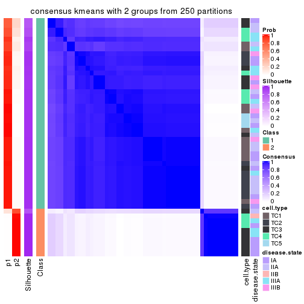</p>

</div>
<div id='tab-CV-kmeans-consensus-heatmap-2'>
<pre><code class="r">consensus_heatmap(res, k = 3)
</code></pre>

<p>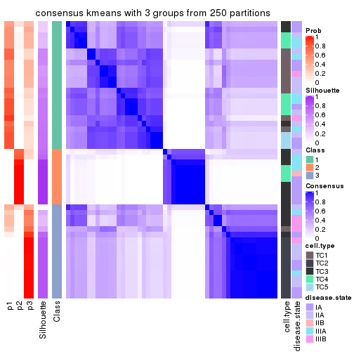</p>

</div>
<div id='tab-CV-kmeans-consensus-heatmap-3'>
<pre><code class="r">consensus_heatmap(res, k = 4)
</code></pre>

<p>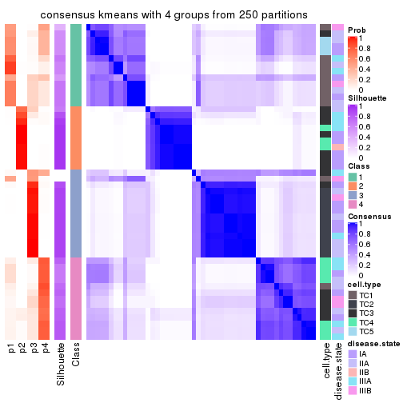</p>

</div>
<div id='tab-CV-kmeans-consensus-heatmap-4'>
<pre><code class="r">consensus_heatmap(res, k = 5)
</code></pre>

<p>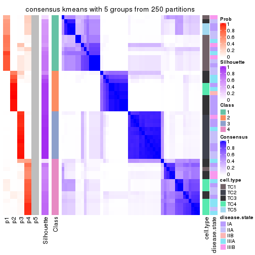</p>

</div>
<div id='tab-CV-kmeans-consensus-heatmap-5'>
<pre><code class="r">consensus_heatmap(res, k = 6)
</code></pre>

<p>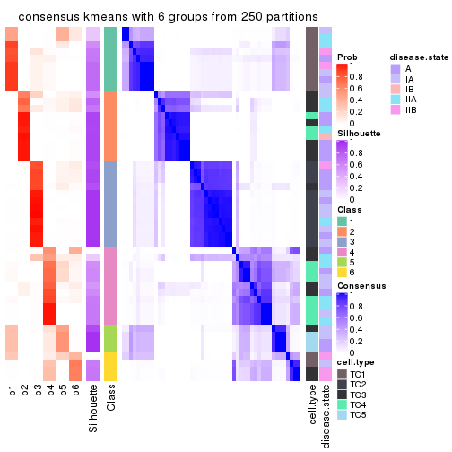</p>

</div>
</div>

Heatmaps for the membership of samples in all partitions to see how consistent they are:


<script>
$( function() {
	$( '#tabs-CV-kmeans-membership-heatmap' ).tabs();
} );
</script>
<div id='tabs-CV-kmeans-membership-heatmap'>
<ul>
<li><a href='#tab-CV-kmeans-membership-heatmap-1'>k = 2</a></li>
<li><a href='#tab-CV-kmeans-membership-heatmap-2'>k = 3</a></li>
<li><a href='#tab-CV-kmeans-membership-heatmap-3'>k = 4</a></li>
<li><a href='#tab-CV-kmeans-membership-heatmap-4'>k = 5</a></li>
<li><a href='#tab-CV-kmeans-membership-heatmap-5'>k = 6</a></li>
</ul>
<div id='tab-CV-kmeans-membership-heatmap-1'>
<pre><code class="r">membership_heatmap(res, k = 2)
</code></pre>

<p>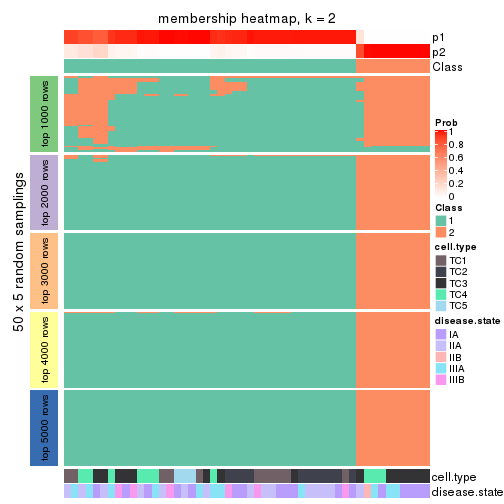</p>

</div>
<div id='tab-CV-kmeans-membership-heatmap-2'>
<pre><code class="r">membership_heatmap(res, k = 3)
</code></pre>

<p>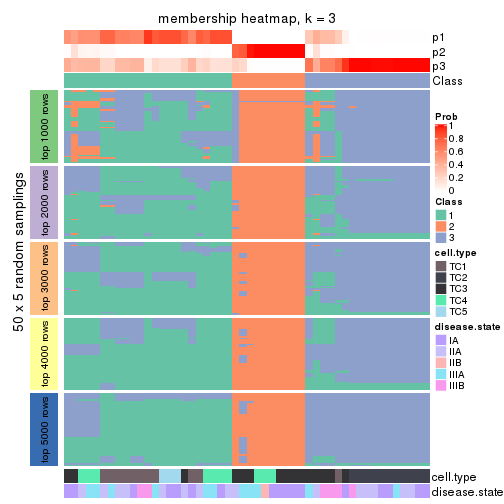</p>

</div>
<div id='tab-CV-kmeans-membership-heatmap-3'>
<pre><code class="r">membership_heatmap(res, k = 4)
</code></pre>

<p>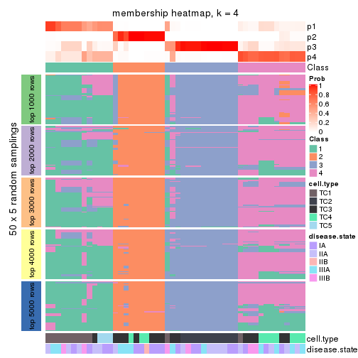</p>

</div>
<div id='tab-CV-kmeans-membership-heatmap-4'>
<pre><code class="r">membership_heatmap(res, k = 5)
</code></pre>

<p>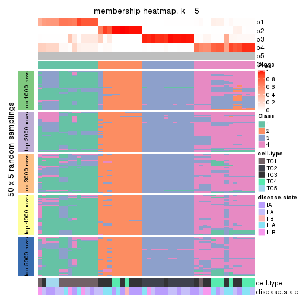</p>

</div>
<div id='tab-CV-kmeans-membership-heatmap-5'>
<pre><code class="r">membership_heatmap(res, k = 6)
</code></pre>

<p>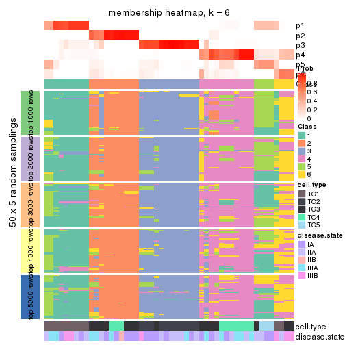</p>

</div>
</div>

As soon as we have had the classes for columns, we can look for signatures
which are significantly different between classes which can be candidate marks
for certain classes. Following are the heatmaps for signatures.


Signature heatmaps where rows are scaled:


<script>
$( function() {
	$( '#tabs-CV-kmeans-get-signatures' ).tabs();
} );
</script>
<div id='tabs-CV-kmeans-get-signatures'>
<ul>
<li><a href='#tab-CV-kmeans-get-signatures-1'>k = 2</a></li>
<li><a href='#tab-CV-kmeans-get-signatures-2'>k = 3</a></li>
<li><a href='#tab-CV-kmeans-get-signatures-3'>k = 4</a></li>
<li><a href='#tab-CV-kmeans-get-signatures-4'>k = 5</a></li>
<li><a href='#tab-CV-kmeans-get-signatures-5'>k = 6</a></li>
</ul>
<div id='tab-CV-kmeans-get-signatures-1'>
<pre><code class="r">get_signatures(res, k = 2)
</code></pre>

<p>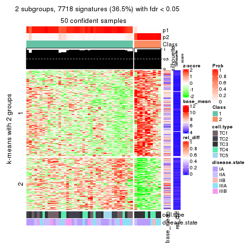</p>

</div>
<div id='tab-CV-kmeans-get-signatures-2'>
<pre><code class="r">get_signatures(res, k = 3)
</code></pre>

<p>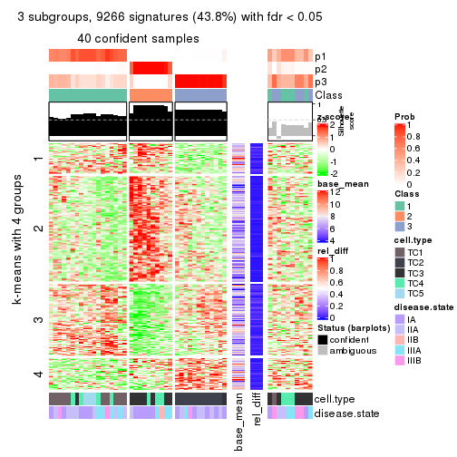</p>

</div>
<div id='tab-CV-kmeans-get-signatures-3'>
<pre><code class="r">get_signatures(res, k = 4)
</code></pre>

<p>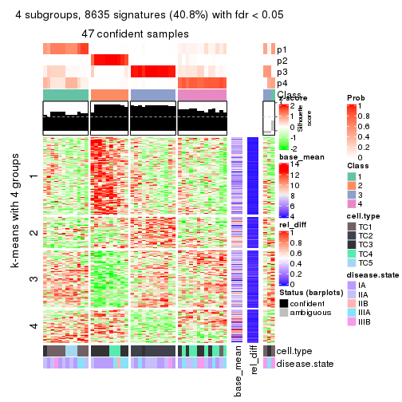</p>

</div>
<div id='tab-CV-kmeans-get-signatures-4'>
<pre><code class="r">get_signatures(res, k = 5)
</code></pre>

<p>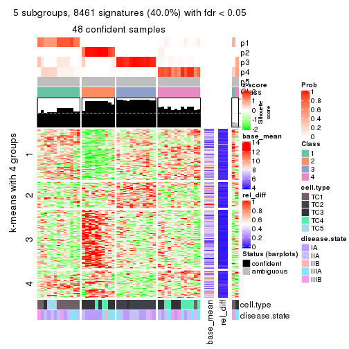</p>

</div>
<div id='tab-CV-kmeans-get-signatures-5'>
<pre><code class="r">get_signatures(res, k = 6)
</code></pre>

<p>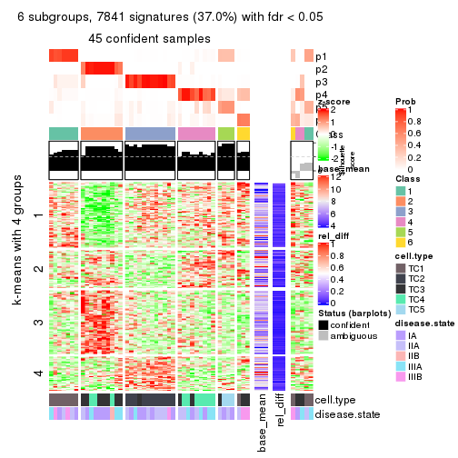</p>

</div>
</div>


Signature heatmaps where rows are not scaled:


<script>
$( function() {
	$( '#tabs-CV-kmeans-get-signatures-no-scale' ).tabs();
} );
</script>
<div id='tabs-CV-kmeans-get-signatures-no-scale'>
<ul>
<li><a href='#tab-CV-kmeans-get-signatures-no-scale-1'>k = 2</a></li>
<li><a href='#tab-CV-kmeans-get-signatures-no-scale-2'>k = 3</a></li>
<li><a href='#tab-CV-kmeans-get-signatures-no-scale-3'>k = 4</a></li>
<li><a href='#tab-CV-kmeans-get-signatures-no-scale-4'>k = 5</a></li>
<li><a href='#tab-CV-kmeans-get-signatures-no-scale-5'>k = 6</a></li>
</ul>
<div id='tab-CV-kmeans-get-signatures-no-scale-1'>
<pre><code class="r">get_signatures(res, k = 2, scale_rows = FALSE)
</code></pre>

<p>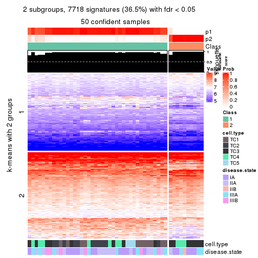</p>

</div>
<div id='tab-CV-kmeans-get-signatures-no-scale-2'>
<pre><code class="r">get_signatures(res, k = 3, scale_rows = FALSE)
</code></pre>

<p>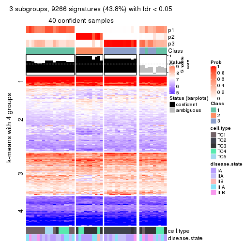</p>

</div>
<div id='tab-CV-kmeans-get-signatures-no-scale-3'>
<pre><code class="r">get_signatures(res, k = 4, scale_rows = FALSE)
</code></pre>

<p>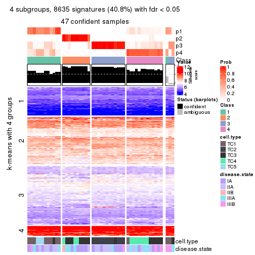</p>

</div>
<div id='tab-CV-kmeans-get-signatures-no-scale-4'>
<pre><code class="r">get_signatures(res, k = 5, scale_rows = FALSE)
</code></pre>

<p>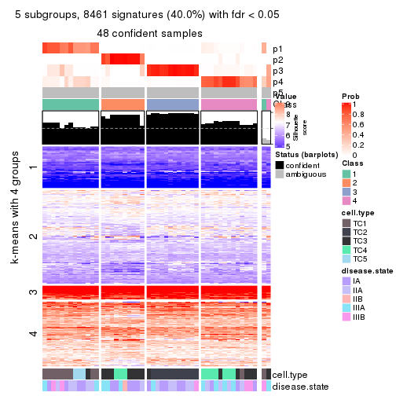</p>

</div>
<div id='tab-CV-kmeans-get-signatures-no-scale-5'>
<pre><code class="r">get_signatures(res, k = 6, scale_rows = FALSE)
</code></pre>

<p>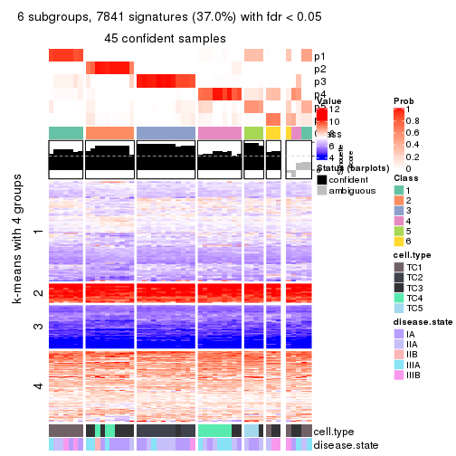</p>

</div>
</div>


Compare the overlap of signatures from different k:

```r
compare_signatures(res)
```

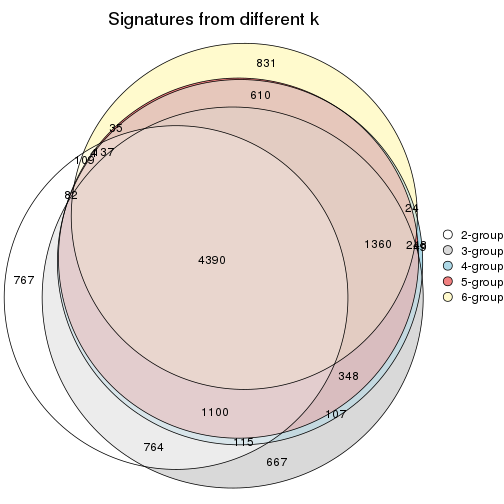

`get_signature()` returns a data frame invisibly. TO get the list of signatures, the function
call should be assigned to a variable explicitly. In following code, if `plot` argument is set
to `FALSE`, no heatmap is plotted while only the differential analysis is performed.

```r
# code only for demonstration
tb = get_signature(res, k = ..., plot = FALSE)
```

An example of the output of `tb` is:

```
#>   which_row         fdr    mean_1    mean_2 scaled_mean_1 scaled_mean_2 km
#> 1        38 0.042760348  8.373488  9.131774    -0.5533452     0.5164555  1
#> 2        40 0.018707592  7.106213  8.469186    -0.6173731     0.5762149  1
#> 3        55 0.019134737 10.221463 11.207825    -0.6159697     0.5749050  1
#> 4        59 0.006059896  5.921854  7.869574    -0.6899429     0.6439467  1
#> 5        60 0.018055526  8.928898 10.211722    -0.6204761     0.5791110  1
#> 6        98 0.009384629 15.714769 14.887706     0.6635654    -0.6193277  2
...
```

The columns in `tb` are:

1. `which_row`: row indices corresponding to the input matrix.
2. `fdr`: FDR for the differential test. 
3. `mean_x`: The mean value in group x.
4. `scaled_mean_x`: The mean value in group x after rows are scaled.
5. `km`: Row groups if k-means clustering is applied to rows.


UMAP plot which shows how samples are separated.


<script>
$( function() {
	$( '#tabs-CV-kmeans-dimension-reduction' ).tabs();
} );
</script>
<div id='tabs-CV-kmeans-dimension-reduction'>
<ul>
<li><a href='#tab-CV-kmeans-dimension-reduction-1'>k = 2</a></li>
<li><a href='#tab-CV-kmeans-dimension-reduction-2'>k = 3</a></li>
<li><a href='#tab-CV-kmeans-dimension-reduction-3'>k = 4</a></li>
<li><a href='#tab-CV-kmeans-dimension-reduction-4'>k = 5</a></li>
<li><a href='#tab-CV-kmeans-dimension-reduction-5'>k = 6</a></li>
</ul>
<div id='tab-CV-kmeans-dimension-reduction-1'>
<pre><code class="r">dimension_reduction(res, k = 2, method = &quot;UMAP&quot;)
</code></pre>

<p>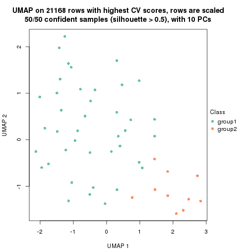</p>

</div>
<div id='tab-CV-kmeans-dimension-reduction-2'>
<pre><code class="r">dimension_reduction(res, k = 3, method = &quot;UMAP&quot;)
</code></pre>

<p>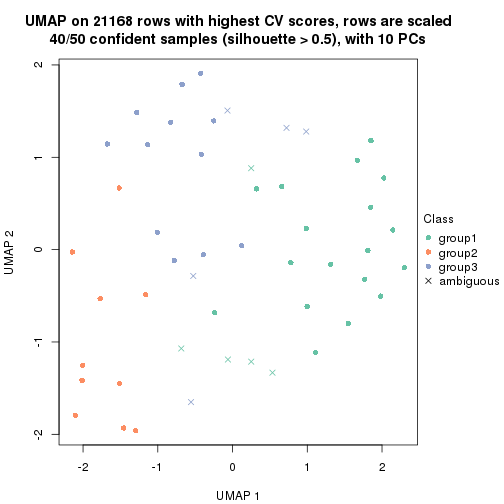</p>

</div>
<div id='tab-CV-kmeans-dimension-reduction-3'>
<pre><code class="r">dimension_reduction(res, k = 4, method = &quot;UMAP&quot;)
</code></pre>

<p>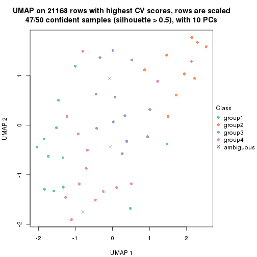</p>

</div>
<div id='tab-CV-kmeans-dimension-reduction-4'>
<pre><code class="r">dimension_reduction(res, k = 5, method = &quot;UMAP&quot;)
</code></pre>

<p>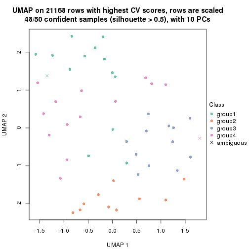</p>

</div>
<div id='tab-CV-kmeans-dimension-reduction-5'>
<pre><code class="r">dimension_reduction(res, k = 6, method = &quot;UMAP&quot;)
</code></pre>

<p>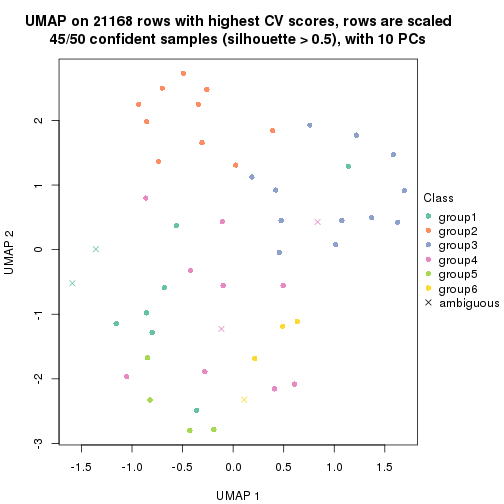</p>

</div>
</div>


Following heatmap shows how subgroups are split when increasing `k`:

```r
collect_classes(res)
```

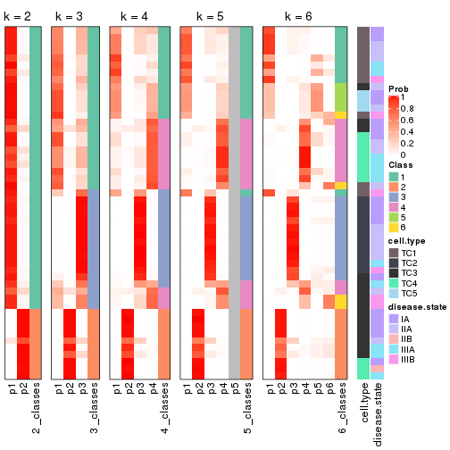


Test correlation between subgroups and known annotations. If the known
annotation is numeric, one-way ANOVA test is applied, and if the known
annotation is discrete, chi-squared contingency table test is applied.

```r
test_to_known_factors(res)
```

```
#>            n cell.type(p) disease.state(p) k
#> CV:kmeans 50     8.91e-03           0.0758 2
#> CV:kmeans 40     1.06e-09           0.3903 3
#> CV:kmeans 47     2.14e-12           0.5510 4
#> CV:kmeans 48     8.06e-13           0.5236 5
#> CV:kmeans 45     5.00e-17           0.1402 6
```


If matrix rows can be associated to genes, consider to use `functional_enrichment(res,
...)` to perform function enrichment for the signature genes. See [this vignette](http://bioconductor.org/packages/devel/bioc/vignettes/cola/inst/doc/functional_enrichment.html) for more detailed explanations.


 

---------------------------------------------------


### CV:skmeans*


The object with results only for a single top-value method and a single partition method 
can be extracted as:

```r
res = res_list["CV", "skmeans"]
# you can also extract it by
# res = res_list["CV:skmeans"]
```

A summary of `res` and all the functions that can be applied to it:

```r
res
```

```
#> A 'ConsensusPartition' object with k = 2, 3, 4, 5, 6.
#>   On a matrix with 21168 rows and 50 columns.
#>   Top rows (1000, 2000, 3000, 4000, 5000) are extracted by 'CV' method.
#>   Subgroups are detected by 'skmeans' method.
#>   Performed in total 1250 partitions by row resampling.
#>   Best k for subgroups seems to be 4.
#> 
#> Following methods can be applied to this 'ConsensusPartition' object:
#>  [1] "cola_report"             "collect_classes"         "collect_plots"          
#>  [4] "collect_stats"           "colnames"                "compare_signatures"     
#>  [7] "consensus_heatmap"       "dimension_reduction"     "functional_enrichment"  
#> [10] "get_anno_col"            "get_anno"                "get_classes"            
#> [13] "get_consensus"           "get_matrix"              "get_membership"         
#> [16] "get_param"               "get_signatures"          "get_stats"              
#> [19] "is_best_k"               "is_stable_k"             "membership_heatmap"     
#> [22] "ncol"                    "nrow"                    "plot_ecdf"              
#> [25] "rownames"                "select_partition_number" "show"                   
#> [28] "suggest_best_k"          "test_to_known_factors"
```

`collect_plots()` function collects all the plots made from `res` for all `k` (number of partitions)
into one single page to provide an easy and fast comparison between different `k`.

```r
collect_plots(res)
```

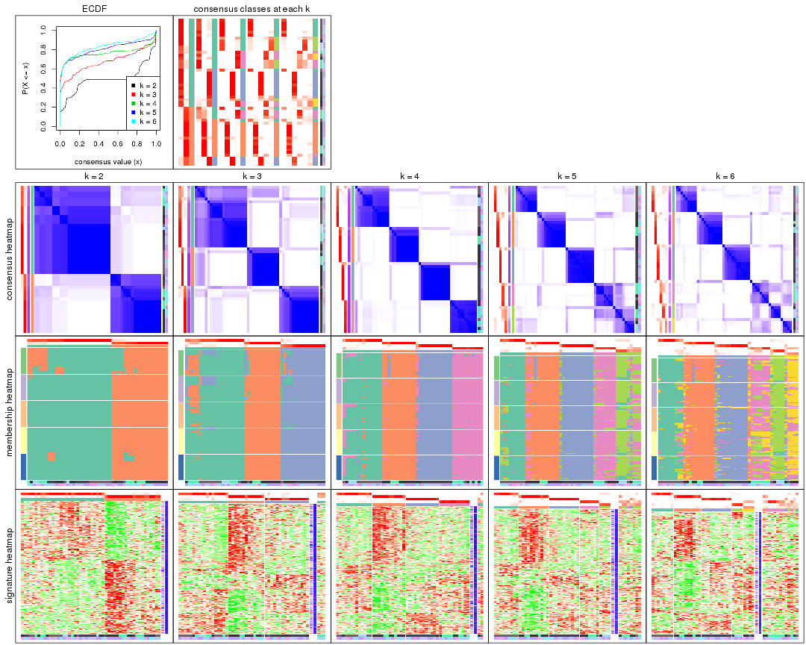

The plots are:

- The first row: a plot of the ECDF (empirical cumulative distribution
  function) curves of the consensus matrix for each `k` and the heatmap of
  predicted classes for each `k`.
- The second row: heatmaps of the consensus matrix for each `k`.
- The third row: heatmaps of the membership matrix for each `k`.
- The fouth row: heatmaps of the signatures for each `k`.

All the plots in panels can be made by individual functions and they are
plotted later in this section.

`select_partition_number()` produces several plots showing different
statistics for choosing "optimized" `k`. There are following statistics:

- ECDF curves of the consensus matrix for each `k`;
- 1-PAC. [The PAC
  score](https://en.wikipedia.org/wiki/Consensus_clustering#Over-interpretation_potential_of_consensus_clustering)
  measures the proportion of the ambiguous subgrouping.
- Mean silhouette score.
- Concordance. The mean probability of fiting the consensus class ids in all
  partitions.
- Area increased. Denote $A_k$ as the area under the ECDF curve for current
  `k`, the area increased is defined as $A_k - A_{k-1}$.
- Rand index. The percent of pairs of samples that are both in a same cluster
  or both are not in a same cluster in the partition of k and k-1.
- Jaccard index. The ratio of pairs of samples are both in a same cluster in
  the partition of k and k-1 and the pairs of samples are both in a same
  cluster in the partition k or k-1.

The detailed explanations of these statistics can be found in [the _cola_
vignette](http://bioconductor.org/packages/devel/bioc/vignettes/cola/inst/doc/cola.html#toc_13).

Generally speaking, lower PAC score, higher mean silhouette score or higher
concordance corresponds to better partition. Rand index and Jaccard index
measure how similar the current partition is compared to partition with `k-1`.
If they are too similar, we won't accept `k` is better than `k-1`.

```r
select_partition_number(res)
```

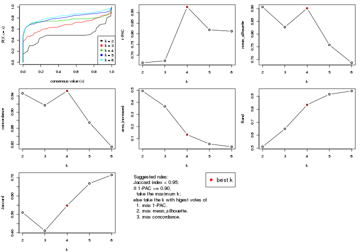

The numeric values for all these statistics can be obtained by `get_stats()`.

```r
get_stats(res)
```

```
#>   k 1-PAC mean_silhouette concordance area_increased  Rand Jaccard
#> 2 2 0.664           0.906       0.947         0.4933 0.510   0.510
#> 3 3 0.673           0.827       0.917         0.3659 0.648   0.411
#> 4 4 0.926           0.901       0.952         0.1333 0.833   0.548
#> 5 5 0.819           0.757       0.874         0.0564 0.915   0.668
#> 6 6 0.812           0.688       0.814         0.0334 0.940   0.714
```

`suggest_best_k()` suggests the best $k$ based on these statistics. The rules are as follows:

- All $k$ with Jaccard index larger than 0.95 are removed because increasing
  $k$ does not provide enough extra information. If all $k$ are removed, it is
  marked as no subgroup is detected.
- For all $k$ with 1-PAC score larger than 0.9, the maximal $k$ is taken as
  the best $k$, and other $k$ are marked as optional $k$.
- If it does not fit the second rule. The $k$ with the maximal vote of the
  highest 1-PAC score, highest mean silhouette, and highest concordance is
  taken as the best $k$.

```r
suggest_best_k(res)
```

```
#> [1] 4
```


Following shows the table of the partitions (You need to click the **show/hide
code output** link to see it). The membership matrix (columns with name `p*`)
is inferred by
[`clue::cl_consensus()`](https://www.rdocumentation.org/link/cl_consensus?package=clue)
function with the `SE` method. Basically the value in the membership matrix
represents the probability to belong to a certain group. The finall class
label for an item is determined with the group with highest probability it
belongs to.

In `get_classes()` function, the entropy is calculated from the membership
matrix and the silhouette score is calculated from the consensus matrix.


<script>
$( function() {
	$( '#tabs-CV-skmeans-get-classes' ).tabs();
} );
</script>
<div id='tabs-CV-skmeans-get-classes'>
<ul>
<li><a href='#tab-CV-skmeans-get-classes-1'>k = 2</a></li>
<li><a href='#tab-CV-skmeans-get-classes-2'>k = 3</a></li>
<li><a href='#tab-CV-skmeans-get-classes-3'>k = 4</a></li>
<li><a href='#tab-CV-skmeans-get-classes-4'>k = 5</a></li>
<li><a href='#tab-CV-skmeans-get-classes-5'>k = 6</a></li>
</ul>

<div id='tab-CV-skmeans-get-classes-1'>
<p><a id='tab-CV-skmeans-get-classes-1-a' style='color:#0366d6' href='#'>show/hide code output</a></p>
<pre><code class="r">cbind(get_classes(res, k = 2), get_membership(res, k = 2))
</code></pre>

<pre><code>#&gt;          class entropy silhouette    p1    p2
#&gt; GSM63448     1  0.0000      0.940 1.000 0.000
#&gt; GSM63449     1  0.0000      0.940 1.000 0.000
#&gt; GSM63423     1  0.0000      0.940 1.000 0.000
#&gt; GSM63425     1  0.0376      0.938 0.996 0.004
#&gt; GSM63437     1  0.0000      0.940 1.000 0.000
#&gt; GSM63453     2  0.5408      0.869 0.124 0.876
#&gt; GSM63431     1  0.0000      0.940 1.000 0.000
#&gt; GSM63450     2  0.2423      0.923 0.040 0.960
#&gt; GSM63428     1  0.0000      0.940 1.000 0.000
#&gt; GSM63432     1  0.0000      0.940 1.000 0.000
#&gt; GSM63458     1  0.0000      0.940 1.000 0.000
#&gt; GSM63434     2  0.6801      0.817 0.180 0.820
#&gt; GSM63435     1  0.0000      0.940 1.000 0.000
#&gt; GSM63442     1  0.0000      0.940 1.000 0.000
#&gt; GSM63451     2  0.6712      0.820 0.176 0.824
#&gt; GSM63422     1  0.0000      0.940 1.000 0.000
#&gt; GSM63438     1  0.0000      0.940 1.000 0.000
#&gt; GSM63439     1  0.3431      0.901 0.936 0.064
#&gt; GSM63461     1  0.0000      0.940 1.000 0.000
#&gt; GSM63463     1  0.3431      0.901 0.936 0.064
#&gt; GSM63430     1  0.3431      0.901 0.936 0.064
#&gt; GSM63446     2  0.6801      0.816 0.180 0.820
#&gt; GSM63429     1  0.3431      0.915 0.936 0.064
#&gt; GSM63445     1  0.0000      0.940 1.000 0.000
#&gt; GSM63447     2  0.0000      0.940 0.000 1.000
#&gt; GSM63459     2  0.0000      0.940 0.000 1.000
#&gt; GSM63464     2  0.0000      0.940 0.000 1.000
#&gt; GSM63469     2  0.0000      0.940 0.000 1.000
#&gt; GSM63470     2  0.0000      0.940 0.000 1.000
#&gt; GSM63436     1  0.0000      0.940 1.000 0.000
#&gt; GSM63443     2  0.6887      0.814 0.184 0.816
#&gt; GSM63465     2  0.0000      0.940 0.000 1.000
#&gt; GSM63444     2  0.0000      0.940 0.000 1.000
#&gt; GSM63456     2  0.0000      0.940 0.000 1.000
#&gt; GSM63462     1  0.7674      0.778 0.776 0.224
#&gt; GSM63424     1  0.3114      0.918 0.944 0.056
#&gt; GSM63440     1  0.3114      0.918 0.944 0.056
#&gt; GSM63433     1  0.6712      0.826 0.824 0.176
#&gt; GSM63466     2  0.0000      0.940 0.000 1.000
#&gt; GSM63426     1  0.6438      0.838 0.836 0.164
#&gt; GSM63468     2  0.3431      0.906 0.064 0.936
#&gt; GSM63452     2  0.0000      0.940 0.000 1.000
#&gt; GSM63441     1  0.7528      0.788 0.784 0.216
#&gt; GSM63454     2  0.2948      0.915 0.052 0.948
#&gt; GSM63455     1  0.6712      0.826 0.824 0.176
#&gt; GSM63460     2  0.0000      0.940 0.000 1.000
#&gt; GSM63467     2  0.3114      0.913 0.056 0.944
#&gt; GSM63421     1  0.0000      0.940 1.000 0.000
#&gt; GSM63427     1  0.5946      0.850 0.856 0.144
#&gt; GSM63457     1  0.5946      0.850 0.856 0.144
</code></pre>

<script>
$('#tab-CV-skmeans-get-classes-1-a').parent().next().next().hide();
$('#tab-CV-skmeans-get-classes-1-a').click(function(){
  $('#tab-CV-skmeans-get-classes-1-a').parent().next().next().toggle();
  return(false);
});
</script>
</div>

<div id='tab-CV-skmeans-get-classes-2'>
<p><a id='tab-CV-skmeans-get-classes-2-a' style='color:#0366d6' href='#'>show/hide code output</a></p>
<pre><code class="r">cbind(get_classes(res, k = 3), get_membership(res, k = 3))
</code></pre>

<pre><code>#&gt;          class entropy silhouette    p1    p2    p3
#&gt; GSM63448     1  0.2959      0.812 0.900 0.000 0.100
#&gt; GSM63449     1  0.3482      0.795 0.872 0.000 0.128
#&gt; GSM63423     1  0.3412      0.798 0.876 0.000 0.124
#&gt; GSM63425     1  0.1529      0.835 0.960 0.000 0.040
#&gt; GSM63437     1  0.3340      0.801 0.880 0.000 0.120
#&gt; GSM63453     1  0.4654      0.699 0.792 0.208 0.000
#&gt; GSM63431     1  0.0592      0.847 0.988 0.000 0.012
#&gt; GSM63450     2  0.4452      0.716 0.192 0.808 0.000
#&gt; GSM63428     1  0.3482      0.795 0.872 0.000 0.128
#&gt; GSM63432     3  0.5733      0.501 0.324 0.000 0.676
#&gt; GSM63458     1  0.0000      0.849 1.000 0.000 0.000
#&gt; GSM63434     3  0.0000      0.933 0.000 0.000 1.000
#&gt; GSM63435     3  0.0000      0.933 0.000 0.000 1.000
#&gt; GSM63442     3  0.0000      0.933 0.000 0.000 1.000
#&gt; GSM63451     3  0.0237      0.931 0.000 0.004 0.996
#&gt; GSM63422     3  0.0000      0.933 0.000 0.000 1.000
#&gt; GSM63438     3  0.0000      0.933 0.000 0.000 1.000
#&gt; GSM63439     3  0.0000      0.933 0.000 0.000 1.000
#&gt; GSM63461     3  0.0000      0.933 0.000 0.000 1.000
#&gt; GSM63463     3  0.0000      0.933 0.000 0.000 1.000
#&gt; GSM63430     3  0.0000      0.933 0.000 0.000 1.000
#&gt; GSM63446     3  0.0000      0.933 0.000 0.000 1.000
#&gt; GSM63429     1  0.6872      0.536 0.680 0.044 0.276
#&gt; GSM63445     3  0.1753      0.901 0.048 0.000 0.952
#&gt; GSM63447     2  0.0000      0.960 0.000 1.000 0.000
#&gt; GSM63459     2  0.0000      0.960 0.000 1.000 0.000
#&gt; GSM63464     2  0.0000      0.960 0.000 1.000 0.000
#&gt; GSM63469     2  0.0000      0.960 0.000 1.000 0.000
#&gt; GSM63470     2  0.0000      0.960 0.000 1.000 0.000
#&gt; GSM63436     1  0.0000      0.849 1.000 0.000 0.000
#&gt; GSM63443     2  0.4750      0.718 0.000 0.784 0.216
#&gt; GSM63465     2  0.0237      0.956 0.004 0.996 0.000
#&gt; GSM63444     2  0.0000      0.960 0.000 1.000 0.000
#&gt; GSM63456     2  0.0000      0.960 0.000 1.000 0.000
#&gt; GSM63462     3  0.6544      0.725 0.084 0.164 0.752
#&gt; GSM63424     3  0.4960      0.809 0.128 0.040 0.832
#&gt; GSM63440     3  0.4413      0.799 0.160 0.008 0.832
#&gt; GSM63433     1  0.0000      0.849 1.000 0.000 0.000
#&gt; GSM63466     2  0.0000      0.960 0.000 1.000 0.000
#&gt; GSM63426     1  0.0000      0.849 1.000 0.000 0.000
#&gt; GSM63468     1  0.6192      0.372 0.580 0.420 0.000
#&gt; GSM63452     2  0.0000      0.960 0.000 1.000 0.000
#&gt; GSM63441     1  0.6096      0.602 0.704 0.280 0.016
#&gt; GSM63454     1  0.6252      0.313 0.556 0.444 0.000
#&gt; GSM63455     1  0.0000      0.849 1.000 0.000 0.000
#&gt; GSM63460     2  0.0000      0.960 0.000 1.000 0.000
#&gt; GSM63467     1  0.7156      0.380 0.572 0.400 0.028
#&gt; GSM63421     1  0.0000      0.849 1.000 0.000 0.000
#&gt; GSM63427     1  0.0424      0.848 0.992 0.008 0.000
#&gt; GSM63457     1  0.0000      0.849 1.000 0.000 0.000
</code></pre>

<script>
$('#tab-CV-skmeans-get-classes-2-a').parent().next().next().hide();
$('#tab-CV-skmeans-get-classes-2-a').click(function(){
  $('#tab-CV-skmeans-get-classes-2-a').parent().next().next().toggle();
  return(false);
});
</script>
</div>

<div id='tab-CV-skmeans-get-classes-3'>
<p><a id='tab-CV-skmeans-get-classes-3-a' style='color:#0366d6' href='#'>show/hide code output</a></p>
<pre><code class="r">cbind(get_classes(res, k = 4), get_membership(res, k = 4))
</code></pre>

<pre><code>#&gt;          class entropy silhouette    p1    p2    p3    p4
#&gt; GSM63448     1  0.0921      0.894 0.972 0.000 0.000 0.028
#&gt; GSM63449     1  0.0000      0.898 1.000 0.000 0.000 0.000
#&gt; GSM63423     1  0.0000      0.898 1.000 0.000 0.000 0.000
#&gt; GSM63425     4  0.0817      0.970 0.024 0.000 0.000 0.976
#&gt; GSM63437     1  0.0000      0.898 1.000 0.000 0.000 0.000
#&gt; GSM63453     1  0.0921      0.890 0.972 0.028 0.000 0.000
#&gt; GSM63431     1  0.0000      0.898 1.000 0.000 0.000 0.000
#&gt; GSM63450     1  0.3942      0.672 0.764 0.236 0.000 0.000
#&gt; GSM63428     1  0.0000      0.898 1.000 0.000 0.000 0.000
#&gt; GSM63432     1  0.2868      0.803 0.864 0.000 0.136 0.000
#&gt; GSM63458     1  0.4972      0.206 0.544 0.000 0.000 0.456
#&gt; GSM63434     3  0.0000      0.959 0.000 0.000 1.000 0.000
#&gt; GSM63435     3  0.0000      0.959 0.000 0.000 1.000 0.000
#&gt; GSM63442     3  0.0000      0.959 0.000 0.000 1.000 0.000
#&gt; GSM63451     3  0.0000      0.959 0.000 0.000 1.000 0.000
#&gt; GSM63422     3  0.0000      0.959 0.000 0.000 1.000 0.000
#&gt; GSM63438     3  0.0000      0.959 0.000 0.000 1.000 0.000
#&gt; GSM63439     3  0.0000      0.959 0.000 0.000 1.000 0.000
#&gt; GSM63461     3  0.0000      0.959 0.000 0.000 1.000 0.000
#&gt; GSM63463     3  0.0000      0.959 0.000 0.000 1.000 0.000
#&gt; GSM63430     3  0.0000      0.959 0.000 0.000 1.000 0.000
#&gt; GSM63446     3  0.0000      0.959 0.000 0.000 1.000 0.000
#&gt; GSM63429     4  0.0000      0.977 0.000 0.000 0.000 1.000
#&gt; GSM63445     3  0.1174      0.935 0.020 0.000 0.968 0.012
#&gt; GSM63447     2  0.1743      0.928 0.004 0.940 0.000 0.056
#&gt; GSM63459     2  0.0000      0.968 0.000 1.000 0.000 0.000
#&gt; GSM63464     2  0.0000      0.968 0.000 1.000 0.000 0.000
#&gt; GSM63469     2  0.0000      0.968 0.000 1.000 0.000 0.000
#&gt; GSM63470     2  0.0000      0.968 0.000 1.000 0.000 0.000
#&gt; GSM63436     1  0.2928      0.862 0.880 0.000 0.012 0.108
#&gt; GSM63443     2  0.3610      0.750 0.000 0.800 0.200 0.000
#&gt; GSM63465     2  0.2149      0.901 0.000 0.912 0.000 0.088
#&gt; GSM63444     2  0.0000      0.968 0.000 1.000 0.000 0.000
#&gt; GSM63456     2  0.0000      0.968 0.000 1.000 0.000 0.000
#&gt; GSM63462     3  0.6407      0.180 0.000 0.068 0.520 0.412
#&gt; GSM63424     4  0.1677      0.952 0.000 0.012 0.040 0.948
#&gt; GSM63440     4  0.1118      0.961 0.000 0.000 0.036 0.964
#&gt; GSM63433     4  0.0707      0.972 0.020 0.000 0.000 0.980
#&gt; GSM63466     2  0.0000      0.968 0.000 1.000 0.000 0.000
#&gt; GSM63426     4  0.0921      0.967 0.028 0.000 0.000 0.972
#&gt; GSM63468     4  0.0188      0.977 0.000 0.004 0.000 0.996
#&gt; GSM63452     2  0.0000      0.968 0.000 1.000 0.000 0.000
#&gt; GSM63441     4  0.0000      0.977 0.000 0.000 0.000 1.000
#&gt; GSM63454     4  0.0469      0.974 0.000 0.012 0.000 0.988
#&gt; GSM63455     4  0.0469      0.975 0.012 0.000 0.000 0.988
#&gt; GSM63460     2  0.0000      0.968 0.000 1.000 0.000 0.000
#&gt; GSM63467     4  0.1640      0.964 0.012 0.020 0.012 0.956
#&gt; GSM63421     1  0.2216      0.876 0.908 0.000 0.000 0.092
#&gt; GSM63427     1  0.2546      0.874 0.900 0.008 0.000 0.092
#&gt; GSM63457     1  0.2216      0.876 0.908 0.000 0.000 0.092
</code></pre>

<script>
$('#tab-CV-skmeans-get-classes-3-a').parent().next().next().hide();
$('#tab-CV-skmeans-get-classes-3-a').click(function(){
  $('#tab-CV-skmeans-get-classes-3-a').parent().next().next().toggle();
  return(false);
});
</script>
</div>

<div id='tab-CV-skmeans-get-classes-4'>
<p><a id='tab-CV-skmeans-get-classes-4-a' style='color:#0366d6' href='#'>show/hide code output</a></p>
<pre><code class="r">cbind(get_classes(res, k = 5), get_membership(res, k = 5))
</code></pre>

<pre><code>#&gt;          class entropy silhouette    p1    p2    p3    p4    p5
#&gt; GSM63448     1  0.1485      0.881 0.948 0.000 0.000 0.020 0.032
#&gt; GSM63449     1  0.0162      0.900 0.996 0.000 0.000 0.000 0.004
#&gt; GSM63423     1  0.0162      0.900 0.996 0.000 0.000 0.000 0.004
#&gt; GSM63425     4  0.1956      0.825 0.008 0.000 0.000 0.916 0.076
#&gt; GSM63437     1  0.0162      0.900 0.996 0.000 0.000 0.000 0.004
#&gt; GSM63453     1  0.3821      0.759 0.764 0.020 0.000 0.000 0.216
#&gt; GSM63431     1  0.2516      0.817 0.860 0.000 0.000 0.000 0.140
#&gt; GSM63450     1  0.4970      0.700 0.712 0.140 0.000 0.000 0.148
#&gt; GSM63428     1  0.0162      0.900 0.996 0.000 0.000 0.000 0.004
#&gt; GSM63432     1  0.1430      0.864 0.944 0.000 0.052 0.000 0.004
#&gt; GSM63458     5  0.6033      0.466 0.200 0.000 0.000 0.220 0.580
#&gt; GSM63434     3  0.0404      0.950 0.000 0.000 0.988 0.000 0.012
#&gt; GSM63435     3  0.0162      0.952 0.000 0.000 0.996 0.000 0.004
#&gt; GSM63442     3  0.0290      0.951 0.000 0.000 0.992 0.000 0.008
#&gt; GSM63451     3  0.0290      0.950 0.000 0.000 0.992 0.000 0.008
#&gt; GSM63422     3  0.0162      0.952 0.000 0.000 0.996 0.000 0.004
#&gt; GSM63438     3  0.0000      0.952 0.000 0.000 1.000 0.000 0.000
#&gt; GSM63439     3  0.0162      0.952 0.000 0.000 0.996 0.000 0.004
#&gt; GSM63461     3  0.0162      0.952 0.000 0.000 0.996 0.000 0.004
#&gt; GSM63463     3  0.0000      0.952 0.000 0.000 1.000 0.000 0.000
#&gt; GSM63430     3  0.0290      0.951 0.000 0.000 0.992 0.000 0.008
#&gt; GSM63446     3  0.0898      0.937 0.000 0.000 0.972 0.008 0.020
#&gt; GSM63429     4  0.1043      0.843 0.000 0.000 0.000 0.960 0.040
#&gt; GSM63445     3  0.5244      0.280 0.024 0.000 0.568 0.016 0.392
#&gt; GSM63447     2  0.4360      0.572 0.000 0.680 0.000 0.300 0.020
#&gt; GSM63459     2  0.0000      0.898 0.000 1.000 0.000 0.000 0.000
#&gt; GSM63464     2  0.0000      0.898 0.000 1.000 0.000 0.000 0.000
#&gt; GSM63469     2  0.0000      0.898 0.000 1.000 0.000 0.000 0.000
#&gt; GSM63470     2  0.0000      0.898 0.000 1.000 0.000 0.000 0.000
#&gt; GSM63436     5  0.3734      0.594 0.168 0.000 0.000 0.036 0.796
#&gt; GSM63443     2  0.3333      0.694 0.000 0.788 0.208 0.000 0.004
#&gt; GSM63465     2  0.4510      0.320 0.000 0.560 0.000 0.432 0.008
#&gt; GSM63444     2  0.0510      0.893 0.000 0.984 0.000 0.000 0.016
#&gt; GSM63456     2  0.1569      0.872 0.004 0.944 0.000 0.008 0.044
#&gt; GSM63462     5  0.7435      0.181 0.008 0.024 0.292 0.248 0.428
#&gt; GSM63424     4  0.2139      0.813 0.000 0.000 0.032 0.916 0.052
#&gt; GSM63440     4  0.1331      0.840 0.000 0.000 0.008 0.952 0.040
#&gt; GSM63433     5  0.4249      0.265 0.000 0.000 0.000 0.432 0.568
#&gt; GSM63466     2  0.0000      0.898 0.000 1.000 0.000 0.000 0.000
#&gt; GSM63426     5  0.4533      0.238 0.008 0.000 0.000 0.448 0.544
#&gt; GSM63468     4  0.1892      0.836 0.000 0.004 0.000 0.916 0.080
#&gt; GSM63452     2  0.0404      0.894 0.000 0.988 0.000 0.000 0.012
#&gt; GSM63441     4  0.1608      0.840 0.000 0.000 0.000 0.928 0.072
#&gt; GSM63454     4  0.1831      0.837 0.000 0.004 0.000 0.920 0.076
#&gt; GSM63455     5  0.4268      0.241 0.000 0.000 0.000 0.444 0.556
#&gt; GSM63460     2  0.0000      0.898 0.000 1.000 0.000 0.000 0.000
#&gt; GSM63467     4  0.6703      0.237 0.036 0.076 0.020 0.564 0.304
#&gt; GSM63421     5  0.2848      0.606 0.156 0.000 0.000 0.004 0.840
#&gt; GSM63427     5  0.2719      0.611 0.144 0.000 0.000 0.004 0.852
#&gt; GSM63457     5  0.2674      0.613 0.140 0.000 0.000 0.004 0.856
</code></pre>

<script>
$('#tab-CV-skmeans-get-classes-4-a').parent().next().next().hide();
$('#tab-CV-skmeans-get-classes-4-a').click(function(){
  $('#tab-CV-skmeans-get-classes-4-a').parent().next().next().toggle();
  return(false);
});
</script>
</div>

<div id='tab-CV-skmeans-get-classes-5'>
<p><a id='tab-CV-skmeans-get-classes-5-a' style='color:#0366d6' href='#'>show/hide code output</a></p>
<pre><code class="r">cbind(get_classes(res, k = 6), get_membership(res, k = 6))
</code></pre>

<pre><code>#&gt;          class entropy silhouette    p1    p2    p3    p4    p5    p6
#&gt; GSM63448     1  0.2736     0.7712 0.880 0.004 0.000 0.016 0.028 0.072
#&gt; GSM63449     1  0.0291     0.8251 0.992 0.000 0.000 0.000 0.004 0.004
#&gt; GSM63423     1  0.0405     0.8249 0.988 0.000 0.000 0.000 0.008 0.004
#&gt; GSM63425     6  0.4676     0.5777 0.004 0.000 0.000 0.416 0.036 0.544
#&gt; GSM63437     1  0.0260     0.8255 0.992 0.000 0.000 0.000 0.008 0.000
#&gt; GSM63453     1  0.6226     0.4912 0.548 0.012 0.000 0.020 0.224 0.196
#&gt; GSM63431     1  0.3388     0.7033 0.792 0.000 0.000 0.000 0.172 0.036
#&gt; GSM63450     1  0.6812     0.5197 0.552 0.080 0.000 0.024 0.144 0.200
#&gt; GSM63428     1  0.0260     0.8255 0.992 0.000 0.000 0.000 0.008 0.000
#&gt; GSM63432     1  0.2577     0.7677 0.884 0.000 0.072 0.000 0.012 0.032
#&gt; GSM63458     5  0.7312     0.2045 0.168 0.000 0.004 0.128 0.408 0.292
#&gt; GSM63434     3  0.2361     0.8751 0.000 0.004 0.880 0.000 0.012 0.104
#&gt; GSM63435     3  0.0405     0.9082 0.000 0.000 0.988 0.000 0.004 0.008
#&gt; GSM63442     3  0.0622     0.9080 0.000 0.000 0.980 0.000 0.008 0.012
#&gt; GSM63451     3  0.1866     0.8856 0.000 0.000 0.908 0.000 0.008 0.084
#&gt; GSM63422     3  0.0508     0.9075 0.000 0.000 0.984 0.000 0.004 0.012
#&gt; GSM63438     3  0.0000     0.9091 0.000 0.000 1.000 0.000 0.000 0.000
#&gt; GSM63439     3  0.1701     0.8923 0.000 0.000 0.920 0.000 0.008 0.072
#&gt; GSM63461     3  0.0260     0.9088 0.000 0.000 0.992 0.000 0.000 0.008
#&gt; GSM63463     3  0.0146     0.9090 0.000 0.000 0.996 0.000 0.000 0.004
#&gt; GSM63430     3  0.1265     0.9003 0.000 0.000 0.948 0.000 0.008 0.044
#&gt; GSM63446     3  0.3243     0.7811 0.000 0.004 0.780 0.000 0.008 0.208
#&gt; GSM63429     6  0.4322     0.5972 0.000 0.000 0.000 0.452 0.020 0.528
#&gt; GSM63445     3  0.6258     0.3225 0.016 0.000 0.548 0.032 0.280 0.124
#&gt; GSM63447     2  0.5605     0.3744 0.000 0.588 0.000 0.288 0.036 0.088
#&gt; GSM63459     2  0.0000     0.8988 0.000 1.000 0.000 0.000 0.000 0.000
#&gt; GSM63464     2  0.0000     0.8988 0.000 1.000 0.000 0.000 0.000 0.000
#&gt; GSM63469     2  0.0000     0.8988 0.000 1.000 0.000 0.000 0.000 0.000
#&gt; GSM63470     2  0.0000     0.8988 0.000 1.000 0.000 0.000 0.000 0.000
#&gt; GSM63436     5  0.2728     0.7822 0.100 0.000 0.000 0.000 0.860 0.040
#&gt; GSM63443     2  0.3460     0.7152 0.000 0.796 0.168 0.000 0.008 0.028
#&gt; GSM63465     4  0.5871    -0.0990 0.000 0.408 0.000 0.420 0.004 0.168
#&gt; GSM63444     2  0.1340     0.8835 0.000 0.948 0.000 0.008 0.004 0.040
#&gt; GSM63456     2  0.3376     0.7733 0.004 0.792 0.000 0.000 0.024 0.180
#&gt; GSM63462     6  0.8062     0.0148 0.000 0.036 0.280 0.184 0.156 0.344
#&gt; GSM63424     6  0.4358     0.6354 0.000 0.000 0.020 0.352 0.008 0.620
#&gt; GSM63440     6  0.4284     0.6469 0.000 0.000 0.012 0.384 0.008 0.596
#&gt; GSM63433     4  0.5064     0.4006 0.004 0.000 0.000 0.552 0.372 0.072
#&gt; GSM63466     2  0.0260     0.8977 0.000 0.992 0.000 0.008 0.000 0.000
#&gt; GSM63426     4  0.5225     0.3608 0.004 0.000 0.000 0.524 0.388 0.084
#&gt; GSM63468     4  0.0806     0.4198 0.000 0.000 0.000 0.972 0.008 0.020
#&gt; GSM63452     2  0.1969     0.8633 0.004 0.920 0.000 0.004 0.020 0.052
#&gt; GSM63441     4  0.1334     0.4027 0.000 0.000 0.000 0.948 0.020 0.032
#&gt; GSM63454     4  0.0937     0.3919 0.000 0.000 0.000 0.960 0.000 0.040
#&gt; GSM63455     4  0.5035     0.4607 0.000 0.000 0.000 0.600 0.296 0.104
#&gt; GSM63460     2  0.0260     0.8977 0.000 0.992 0.000 0.008 0.000 0.000
#&gt; GSM63467     4  0.5199     0.4654 0.028 0.028 0.004 0.724 0.084 0.132
#&gt; GSM63421     5  0.1615     0.8209 0.064 0.000 0.000 0.004 0.928 0.004
#&gt; GSM63427     5  0.1152     0.8139 0.044 0.000 0.000 0.004 0.952 0.000
#&gt; GSM63457     5  0.1493     0.8208 0.056 0.000 0.000 0.004 0.936 0.004
</code></pre>

<script>
$('#tab-CV-skmeans-get-classes-5-a').parent().next().next().hide();
$('#tab-CV-skmeans-get-classes-5-a').click(function(){
  $('#tab-CV-skmeans-get-classes-5-a').parent().next().next().toggle();
  return(false);
});
</script>
</div>
</div>

Heatmaps for the consensus matrix. It visualizes the probability of two
samples to be in a same group.


<script>
$( function() {
	$( '#tabs-CV-skmeans-consensus-heatmap' ).tabs();
} );
</script>
<div id='tabs-CV-skmeans-consensus-heatmap'>
<ul>
<li><a href='#tab-CV-skmeans-consensus-heatmap-1'>k = 2</a></li>
<li><a href='#tab-CV-skmeans-consensus-heatmap-2'>k = 3</a></li>
<li><a href='#tab-CV-skmeans-consensus-heatmap-3'>k = 4</a></li>
<li><a href='#tab-CV-skmeans-consensus-heatmap-4'>k = 5</a></li>
<li><a href='#tab-CV-skmeans-consensus-heatmap-5'>k = 6</a></li>
</ul>
<div id='tab-CV-skmeans-consensus-heatmap-1'>
<pre><code class="r">consensus_heatmap(res, k = 2)
</code></pre>

<p>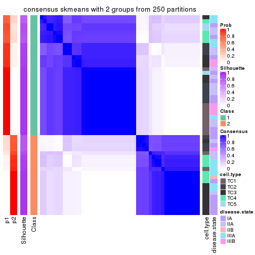</p>

</div>
<div id='tab-CV-skmeans-consensus-heatmap-2'>
<pre><code class="r">consensus_heatmap(res, k = 3)
</code></pre>

<p>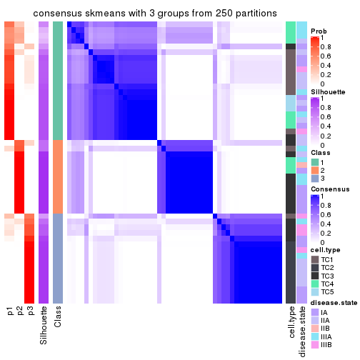</p>

</div>
<div id='tab-CV-skmeans-consensus-heatmap-3'>
<pre><code class="r">consensus_heatmap(res, k = 4)
</code></pre>

<p>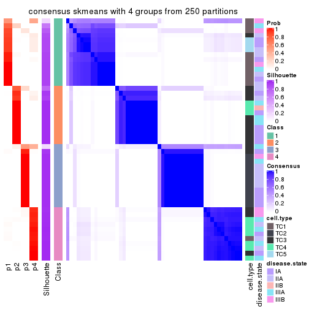</p>

</div>
<div id='tab-CV-skmeans-consensus-heatmap-4'>
<pre><code class="r">consensus_heatmap(res, k = 5)
</code></pre>

<p>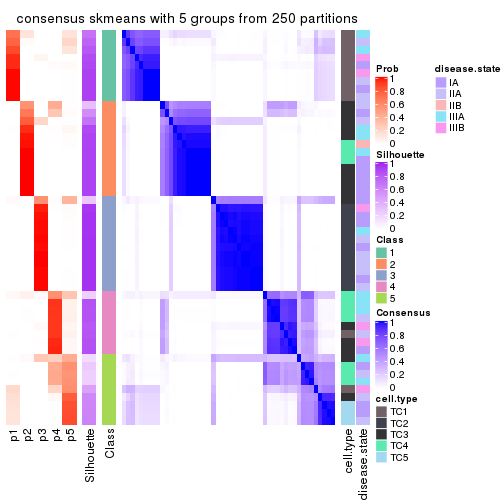</p>

</div>
<div id='tab-CV-skmeans-consensus-heatmap-5'>
<pre><code class="r">consensus_heatmap(res, k = 6)
</code></pre>

<p>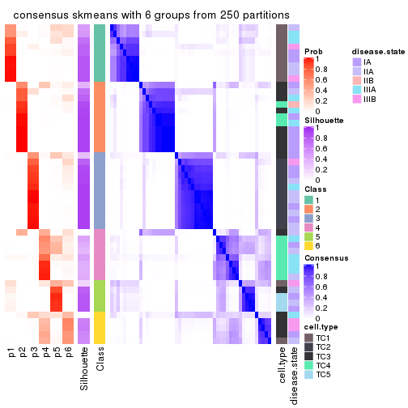</p>

</div>
</div>

Heatmaps for the membership of samples in all partitions to see how consistent they are:


<script>
$( function() {
	$( '#tabs-CV-skmeans-membership-heatmap' ).tabs();
} );
</script>
<div id='tabs-CV-skmeans-membership-heatmap'>
<ul>
<li><a href='#tab-CV-skmeans-membership-heatmap-1'>k = 2</a></li>
<li><a href='#tab-CV-skmeans-membership-heatmap-2'>k = 3</a></li>
<li><a href='#tab-CV-skmeans-membership-heatmap-3'>k = 4</a></li>
<li><a href='#tab-CV-skmeans-membership-heatmap-4'>k = 5</a></li>
<li><a href='#tab-CV-skmeans-membership-heatmap-5'>k = 6</a></li>
</ul>
<div id='tab-CV-skmeans-membership-heatmap-1'>
<pre><code class="r">membership_heatmap(res, k = 2)
</code></pre>

<p>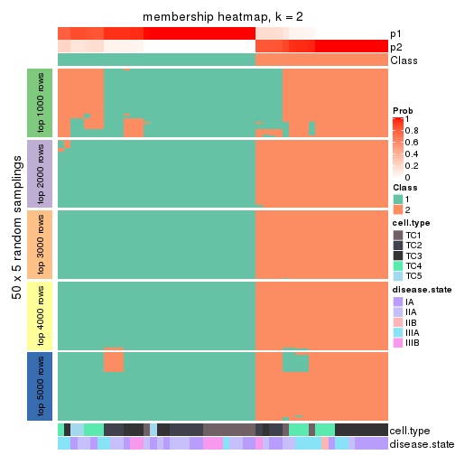</p>

</div>
<div id='tab-CV-skmeans-membership-heatmap-2'>
<pre><code class="r">membership_heatmap(res, k = 3)
</code></pre>

<p>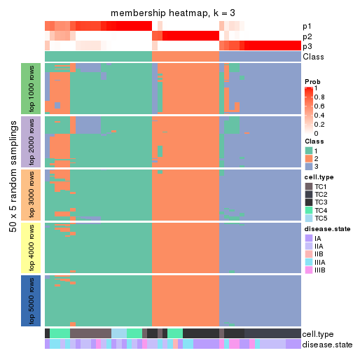</p>

</div>
<div id='tab-CV-skmeans-membership-heatmap-3'>
<pre><code class="r">membership_heatmap(res, k = 4)
</code></pre>

<p>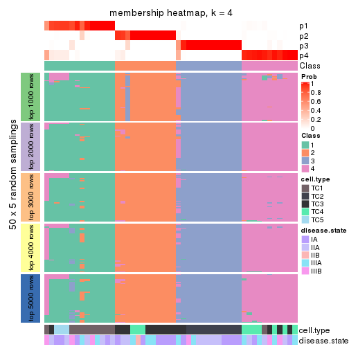</p>

</div>
<div id='tab-CV-skmeans-membership-heatmap-4'>
<pre><code class="r">membership_heatmap(res, k = 5)
</code></pre>

<p>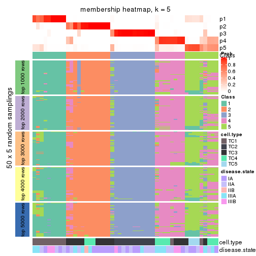</p>

</div>
<div id='tab-CV-skmeans-membership-heatmap-5'>
<pre><code class="r">membership_heatmap(res, k = 6)
</code></pre>

<p>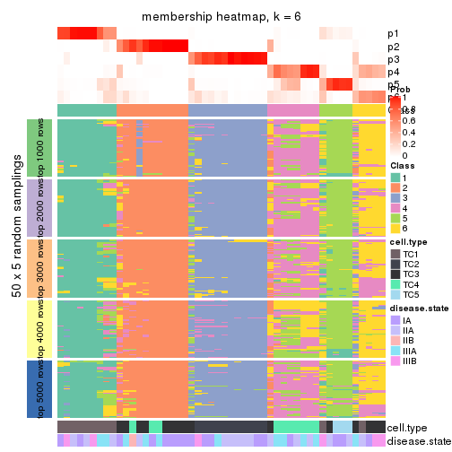</p>

</div>
</div>

As soon as we have had the classes for columns, we can look for signatures
which are significantly different between classes which can be candidate marks
for certain classes. Following are the heatmaps for signatures.


Signature heatmaps where rows are scaled:


<script>
$( function() {
	$( '#tabs-CV-skmeans-get-signatures' ).tabs();
} );
</script>
<div id='tabs-CV-skmeans-get-signatures'>
<ul>
<li><a href='#tab-CV-skmeans-get-signatures-1'>k = 2</a></li>
<li><a href='#tab-CV-skmeans-get-signatures-2'>k = 3</a></li>
<li><a href='#tab-CV-skmeans-get-signatures-3'>k = 4</a></li>
<li><a href='#tab-CV-skmeans-get-signatures-4'>k = 5</a></li>
<li><a href='#tab-CV-skmeans-get-signatures-5'>k = 6</a></li>
</ul>
<div id='tab-CV-skmeans-get-signatures-1'>
<pre><code class="r">get_signatures(res, k = 2)
</code></pre>

<p>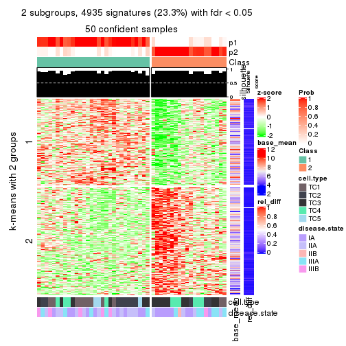</p>

</div>
<div id='tab-CV-skmeans-get-signatures-2'>
<pre><code class="r">get_signatures(res, k = 3)
</code></pre>

<p>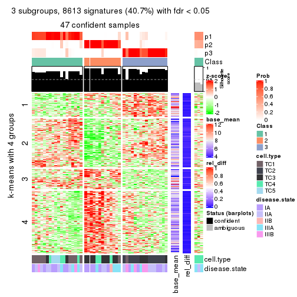</p>

</div>
<div id='tab-CV-skmeans-get-signatures-3'>
<pre><code class="r">get_signatures(res, k = 4)
</code></pre>

<p>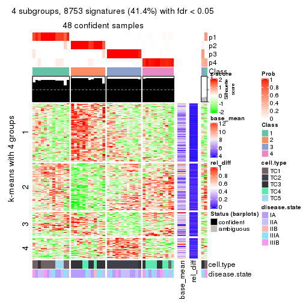</p>

</div>
<div id='tab-CV-skmeans-get-signatures-4'>
<pre><code class="r">get_signatures(res, k = 5)
</code></pre>

<p>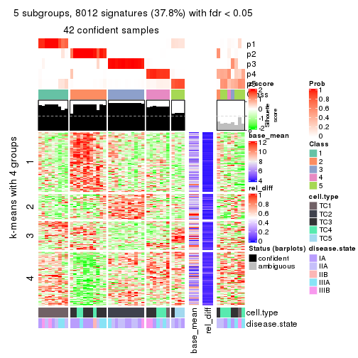</p>

</div>
<div id='tab-CV-skmeans-get-signatures-5'>
<pre><code class="r">get_signatures(res, k = 6)
</code></pre>

<p>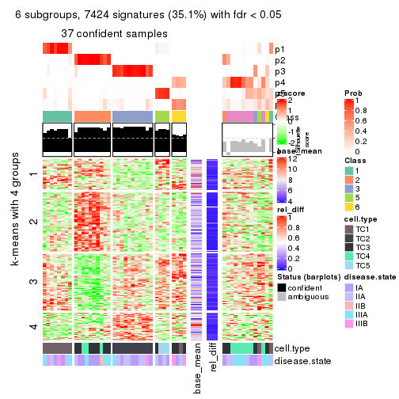</p>

</div>
</div>


Signature heatmaps where rows are not scaled:


<script>
$( function() {
	$( '#tabs-CV-skmeans-get-signatures-no-scale' ).tabs();
} );
</script>
<div id='tabs-CV-skmeans-get-signatures-no-scale'>
<ul>
<li><a href='#tab-CV-skmeans-get-signatures-no-scale-1'>k = 2</a></li>
<li><a href='#tab-CV-skmeans-get-signatures-no-scale-2'>k = 3</a></li>
<li><a href='#tab-CV-skmeans-get-signatures-no-scale-3'>k = 4</a></li>
<li><a href='#tab-CV-skmeans-get-signatures-no-scale-4'>k = 5</a></li>
<li><a href='#tab-CV-skmeans-get-signatures-no-scale-5'>k = 6</a></li>
</ul>
<div id='tab-CV-skmeans-get-signatures-no-scale-1'>
<pre><code class="r">get_signatures(res, k = 2, scale_rows = FALSE)
</code></pre>

<p>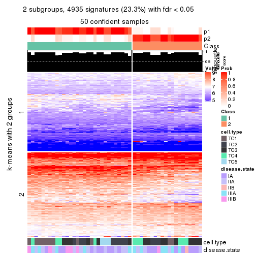</p>

</div>
<div id='tab-CV-skmeans-get-signatures-no-scale-2'>
<pre><code class="r">get_signatures(res, k = 3, scale_rows = FALSE)
</code></pre>

<p>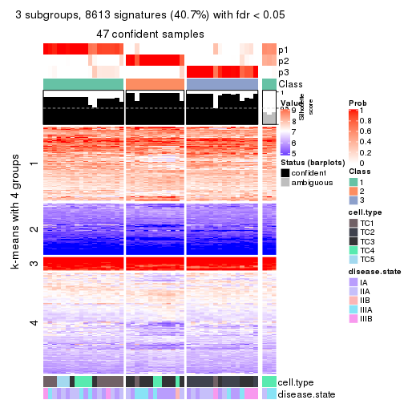</p>

</div>
<div id='tab-CV-skmeans-get-signatures-no-scale-3'>
<pre><code class="r">get_signatures(res, k = 4, scale_rows = FALSE)
</code></pre>

<p>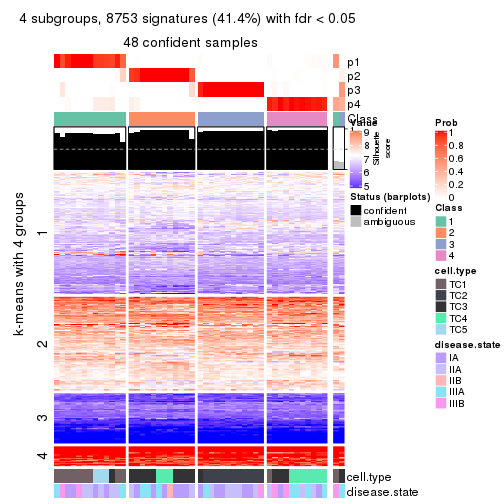</p>

</div>
<div id='tab-CV-skmeans-get-signatures-no-scale-4'>
<pre><code class="r">get_signatures(res, k = 5, scale_rows = FALSE)
</code></pre>

<p>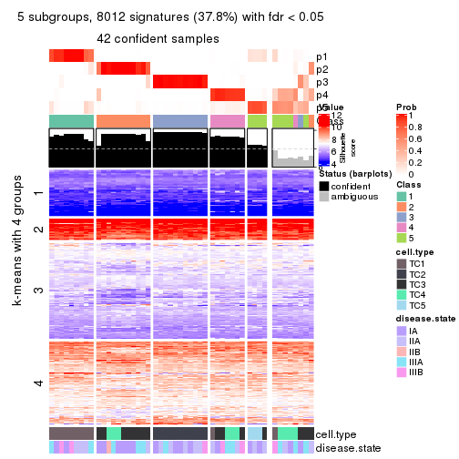</p>

</div>
<div id='tab-CV-skmeans-get-signatures-no-scale-5'>
<pre><code class="r">get_signatures(res, k = 6, scale_rows = FALSE)
</code></pre>

<p>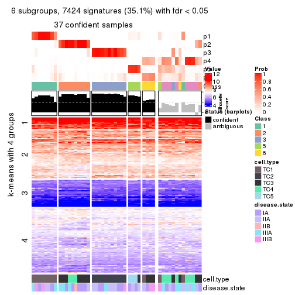</p>

</div>
</div>


Compare the overlap of signatures from different k:

```r
compare_signatures(res)
```

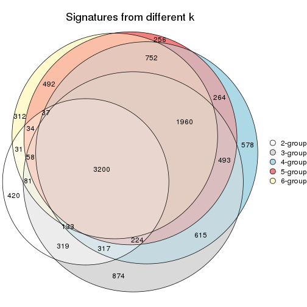

`get_signature()` returns a data frame invisibly. TO get the list of signatures, the function
call should be assigned to a variable explicitly. In following code, if `plot` argument is set
to `FALSE`, no heatmap is plotted while only the differential analysis is performed.

```r
# code only for demonstration
tb = get_signature(res, k = ..., plot = FALSE)
```

An example of the output of `tb` is:

```
#>   which_row         fdr    mean_1    mean_2 scaled_mean_1 scaled_mean_2 km
#> 1        38 0.042760348  8.373488  9.131774    -0.5533452     0.5164555  1
#> 2        40 0.018707592  7.106213  8.469186    -0.6173731     0.5762149  1
#> 3        55 0.019134737 10.221463 11.207825    -0.6159697     0.5749050  1
#> 4        59 0.006059896  5.921854  7.869574    -0.6899429     0.6439467  1
#> 5        60 0.018055526  8.928898 10.211722    -0.6204761     0.5791110  1
#> 6        98 0.009384629 15.714769 14.887706     0.6635654    -0.6193277  2
...
```

The columns in `tb` are:

1. `which_row`: row indices corresponding to the input matrix.
2. `fdr`: FDR for the differential test. 
3. `mean_x`: The mean value in group x.
4. `scaled_mean_x`: The mean value in group x after rows are scaled.
5. `km`: Row groups if k-means clustering is applied to rows.


UMAP plot which shows how samples are separated.


<script>
$( function() {
	$( '#tabs-CV-skmeans-dimension-reduction' ).tabs();
} );
</script>
<div id='tabs-CV-skmeans-dimension-reduction'>
<ul>
<li><a href='#tab-CV-skmeans-dimension-reduction-1'>k = 2</a></li>
<li><a href='#tab-CV-skmeans-dimension-reduction-2'>k = 3</a></li>
<li><a href='#tab-CV-skmeans-dimension-reduction-3'>k = 4</a></li>
<li><a href='#tab-CV-skmeans-dimension-reduction-4'>k = 5</a></li>
<li><a href='#tab-CV-skmeans-dimension-reduction-5'>k = 6</a></li>
</ul>
<div id='tab-CV-skmeans-dimension-reduction-1'>
<pre><code class="r">dimension_reduction(res, k = 2, method = &quot;UMAP&quot;)
</code></pre>

<p>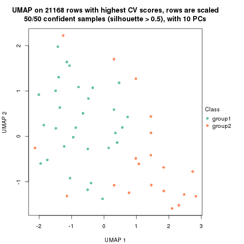</p>

</div>
<div id='tab-CV-skmeans-dimension-reduction-2'>
<pre><code class="r">dimension_reduction(res, k = 3, method = &quot;UMAP&quot;)
</code></pre>

<p>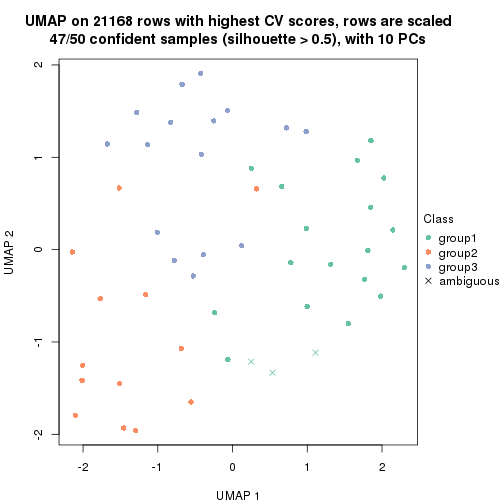</p>

</div>
<div id='tab-CV-skmeans-dimension-reduction-3'>
<pre><code class="r">dimension_reduction(res, k = 4, method = &quot;UMAP&quot;)
</code></pre>

<p>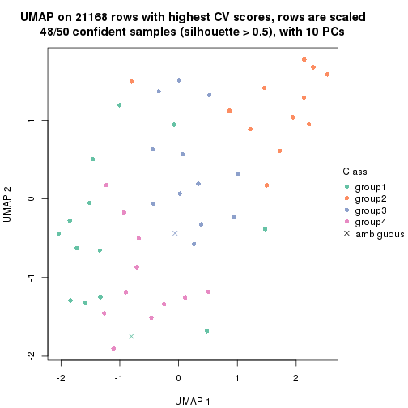</p>

</div>
<div id='tab-CV-skmeans-dimension-reduction-4'>
<pre><code class="r">dimension_reduction(res, k = 5, method = &quot;UMAP&quot;)
</code></pre>

<p>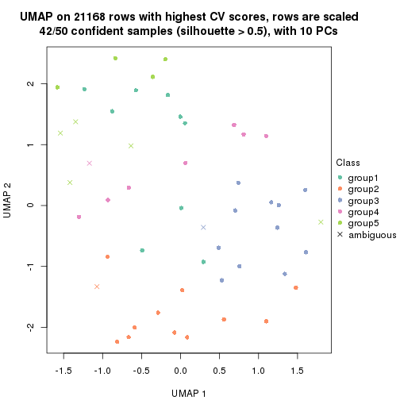</p>

</div>
<div id='tab-CV-skmeans-dimension-reduction-5'>
<pre><code class="r">dimension_reduction(res, k = 6, method = &quot;UMAP&quot;)
</code></pre>

<p>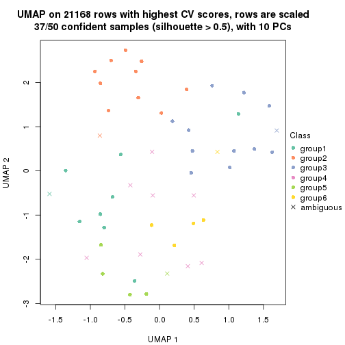</p>

</div>
</div>


Following heatmap shows how subgroups are split when increasing `k`:

```r
collect_classes(res)
```

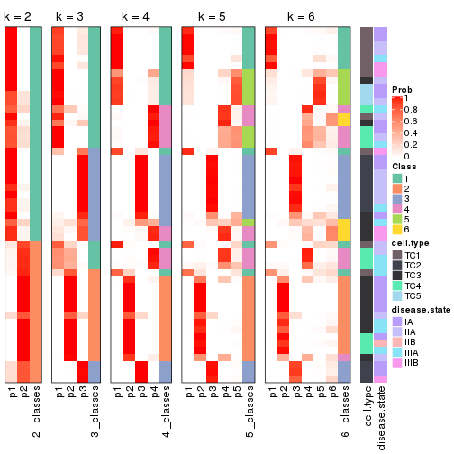


Test correlation between subgroups and known annotations. If the known
annotation is numeric, one-way ANOVA test is applied, and if the known
annotation is discrete, chi-squared contingency table test is applied.

```r
test_to_known_factors(res)
```

```
#>             n cell.type(p) disease.state(p) k
#> CV:skmeans 50     5.89e-02            0.258 2
#> CV:skmeans 47     1.58e-07            0.305 3
#> CV:skmeans 48     8.06e-14            0.523 4
#> CV:skmeans 42     3.82e-16            0.536 5
#> CV:skmeans 37     9.50e-14            0.411 6
```


If matrix rows can be associated to genes, consider to use `functional_enrichment(res,
...)` to perform function enrichment for the signature genes. See [this vignette](http://bioconductor.org/packages/devel/bioc/vignettes/cola/inst/doc/functional_enrichment.html) for more detailed explanations.


 

---------------------------------------------------


### CV:pam**


The object with results only for a single top-value method and a single partition method 
can be extracted as:

```r
res = res_list["CV", "pam"]
# you can also extract it by
# res = res_list["CV:pam"]
```

A summary of `res` and all the functions that can be applied to it:

```r
res
```

```
#> A 'ConsensusPartition' object with k = 2, 3, 4, 5, 6.
#>   On a matrix with 21168 rows and 50 columns.
#>   Top rows (1000, 2000, 3000, 4000, 5000) are extracted by 'CV' method.
#>   Subgroups are detected by 'pam' method.
#>   Performed in total 1250 partitions by row resampling.
#>   Best k for subgroups seems to be 2.
#> 
#> Following methods can be applied to this 'ConsensusPartition' object:
#>  [1] "cola_report"             "collect_classes"         "collect_plots"          
#>  [4] "collect_stats"           "colnames"                "compare_signatures"     
#>  [7] "consensus_heatmap"       "dimension_reduction"     "functional_enrichment"  
#> [10] "get_anno_col"            "get_anno"                "get_classes"            
#> [13] "get_consensus"           "get_matrix"              "get_membership"         
#> [16] "get_param"               "get_signatures"          "get_stats"              
#> [19] "is_best_k"               "is_stable_k"             "membership_heatmap"     
#> [22] "ncol"                    "nrow"                    "plot_ecdf"              
#> [25] "rownames"                "select_partition_number" "show"                   
#> [28] "suggest_best_k"          "test_to_known_factors"
```

`collect_plots()` function collects all the plots made from `res` for all `k` (number of partitions)
into one single page to provide an easy and fast comparison between different `k`.

```r
collect_plots(res)
```

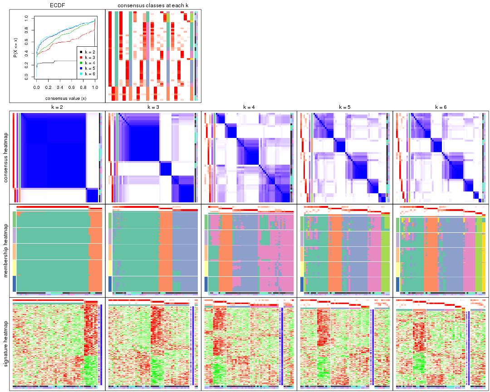

The plots are:

- The first row: a plot of the ECDF (empirical cumulative distribution
  function) curves of the consensus matrix for each `k` and the heatmap of
  predicted classes for each `k`.
- The second row: heatmaps of the consensus matrix for each `k`.
- The third row: heatmaps of the membership matrix for each `k`.
- The fouth row: heatmaps of the signatures for each `k`.

All the plots in panels can be made by individual functions and they are
plotted later in this section.

`select_partition_number()` produces several plots showing different
statistics for choosing "optimized" `k`. There are following statistics:

- ECDF curves of the consensus matrix for each `k`;
- 1-PAC. [The PAC
  score](https://en.wikipedia.org/wiki/Consensus_clustering#Over-interpretation_potential_of_consensus_clustering)
  measures the proportion of the ambiguous subgrouping.
- Mean silhouette score.
- Concordance. The mean probability of fiting the consensus class ids in all
  partitions.
- Area increased. Denote $A_k$ as the area under the ECDF curve for current
  `k`, the area increased is defined as $A_k - A_{k-1}$.
- Rand index. The percent of pairs of samples that are both in a same cluster
  or both are not in a same cluster in the partition of k and k-1.
- Jaccard index. The ratio of pairs of samples are both in a same cluster in
  the partition of k and k-1 and the pairs of samples are both in a same
  cluster in the partition k or k-1.

The detailed explanations of these statistics can be found in [the _cola_
vignette](http://bioconductor.org/packages/devel/bioc/vignettes/cola/inst/doc/cola.html#toc_13).

Generally speaking, lower PAC score, higher mean silhouette score or higher
concordance corresponds to better partition. Rand index and Jaccard index
measure how similar the current partition is compared to partition with `k-1`.
If they are too similar, we won't accept `k` is better than `k-1`.

```r
select_partition_number(res)
```

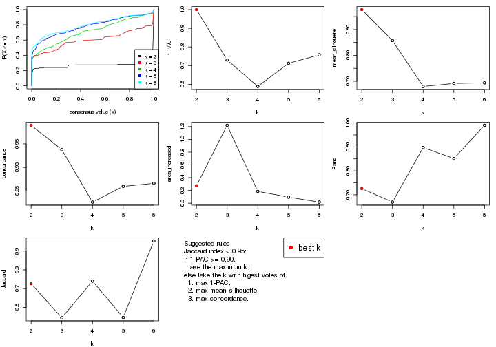

The numeric values for all these statistics can be obtained by `get_stats()`.

```r
get_stats(res)
```

```
#>   k 1-PAC mean_silhouette concordance area_increased  Rand Jaccard
#> 2 2 1.000           0.977       0.989         0.2716 0.726   0.726
#> 3 3 0.730           0.857       0.938         1.2205 0.669   0.544
#> 4 4 0.588           0.680       0.826         0.1851 0.897   0.740
#> 5 5 0.712           0.691       0.860         0.0947 0.851   0.546
#> 6 6 0.758           0.694       0.866         0.0174 0.990   0.954
```

`suggest_best_k()` suggests the best $k$ based on these statistics. The rules are as follows:

- All $k$ with Jaccard index larger than 0.95 are removed because increasing
  $k$ does not provide enough extra information. If all $k$ are removed, it is
  marked as no subgroup is detected.
- For all $k$ with 1-PAC score larger than 0.9, the maximal $k$ is taken as
  the best $k$, and other $k$ are marked as optional $k$.
- If it does not fit the second rule. The $k$ with the maximal vote of the
  highest 1-PAC score, highest mean silhouette, and highest concordance is
  taken as the best $k$.

```r
suggest_best_k(res)
```

```
#> [1] 2
```


Following shows the table of the partitions (You need to click the **show/hide
code output** link to see it). The membership matrix (columns with name `p*`)
is inferred by
[`clue::cl_consensus()`](https://www.rdocumentation.org/link/cl_consensus?package=clue)
function with the `SE` method. Basically the value in the membership matrix
represents the probability to belong to a certain group. The finall class
label for an item is determined with the group with highest probability it
belongs to.

In `get_classes()` function, the entropy is calculated from the membership
matrix and the silhouette score is calculated from the consensus matrix.


<script>
$( function() {
	$( '#tabs-CV-pam-get-classes' ).tabs();
} );
</script>
<div id='tabs-CV-pam-get-classes'>
<ul>
<li><a href='#tab-CV-pam-get-classes-1'>k = 2</a></li>
<li><a href='#tab-CV-pam-get-classes-2'>k = 3</a></li>
<li><a href='#tab-CV-pam-get-classes-3'>k = 4</a></li>
<li><a href='#tab-CV-pam-get-classes-4'>k = 5</a></li>
<li><a href='#tab-CV-pam-get-classes-5'>k = 6</a></li>
</ul>

<div id='tab-CV-pam-get-classes-1'>
<p><a id='tab-CV-pam-get-classes-1-a' style='color:#0366d6' href='#'>show/hide code output</a></p>
<pre><code class="r">cbind(get_classes(res, k = 2), get_membership(res, k = 2))
</code></pre>

<pre><code>#&gt;          class entropy silhouette    p1    p2
#&gt; GSM63448     1  0.0000      0.994 1.000 0.000
#&gt; GSM63449     1  0.0000      0.994 1.000 0.000
#&gt; GSM63423     1  0.0000      0.994 1.000 0.000
#&gt; GSM63425     1  0.0000      0.994 1.000 0.000
#&gt; GSM63437     1  0.0000      0.994 1.000 0.000
#&gt; GSM63453     1  0.0000      0.994 1.000 0.000
#&gt; GSM63431     1  0.0000      0.994 1.000 0.000
#&gt; GSM63450     1  0.0000      0.994 1.000 0.000
#&gt; GSM63428     1  0.0000      0.994 1.000 0.000
#&gt; GSM63432     1  0.0000      0.994 1.000 0.000
#&gt; GSM63458     1  0.0000      0.994 1.000 0.000
#&gt; GSM63434     1  0.0376      0.993 0.996 0.004
#&gt; GSM63435     1  0.0376      0.993 0.996 0.004
#&gt; GSM63442     1  0.0376      0.993 0.996 0.004
#&gt; GSM63451     1  0.0376      0.993 0.996 0.004
#&gt; GSM63422     1  0.0376      0.993 0.996 0.004
#&gt; GSM63438     1  0.0376      0.993 0.996 0.004
#&gt; GSM63439     1  0.0376      0.993 0.996 0.004
#&gt; GSM63461     1  0.0376      0.993 0.996 0.004
#&gt; GSM63463     1  0.0376      0.993 0.996 0.004
#&gt; GSM63430     1  0.0376      0.993 0.996 0.004
#&gt; GSM63446     1  0.0376      0.993 0.996 0.004
#&gt; GSM63429     1  0.0000      0.994 1.000 0.000
#&gt; GSM63445     1  0.0376      0.993 0.996 0.004
#&gt; GSM63447     1  0.1633      0.974 0.976 0.024
#&gt; GSM63459     2  0.0000      0.957 0.000 1.000
#&gt; GSM63464     2  0.0000      0.957 0.000 1.000
#&gt; GSM63469     2  0.0000      0.957 0.000 1.000
#&gt; GSM63470     2  0.0000      0.957 0.000 1.000
#&gt; GSM63436     1  0.0000      0.994 1.000 0.000
#&gt; GSM63443     2  0.8763      0.573 0.296 0.704
#&gt; GSM63465     1  0.2948      0.947 0.948 0.052
#&gt; GSM63444     1  0.0376      0.993 0.996 0.004
#&gt; GSM63456     1  0.4431      0.902 0.908 0.092
#&gt; GSM63462     1  0.0000      0.994 1.000 0.000
#&gt; GSM63424     1  0.0938      0.987 0.988 0.012
#&gt; GSM63440     1  0.0000      0.994 1.000 0.000
#&gt; GSM63433     1  0.0000      0.994 1.000 0.000
#&gt; GSM63466     2  0.0000      0.957 0.000 1.000
#&gt; GSM63426     1  0.0000      0.994 1.000 0.000
#&gt; GSM63468     1  0.0000      0.994 1.000 0.000
#&gt; GSM63452     2  0.0000      0.957 0.000 1.000
#&gt; GSM63441     1  0.0000      0.994 1.000 0.000
#&gt; GSM63454     1  0.0000      0.994 1.000 0.000
#&gt; GSM63455     1  0.0000      0.994 1.000 0.000
#&gt; GSM63460     2  0.0000      0.957 0.000 1.000
#&gt; GSM63467     1  0.0000      0.994 1.000 0.000
#&gt; GSM63421     1  0.0000      0.994 1.000 0.000
#&gt; GSM63427     1  0.0000      0.994 1.000 0.000
#&gt; GSM63457     1  0.0000      0.994 1.000 0.000
</code></pre>

<script>
$('#tab-CV-pam-get-classes-1-a').parent().next().next().hide();
$('#tab-CV-pam-get-classes-1-a').click(function(){
  $('#tab-CV-pam-get-classes-1-a').parent().next().next().toggle();
  return(false);
});
</script>
</div>

<div id='tab-CV-pam-get-classes-2'>
<p><a id='tab-CV-pam-get-classes-2-a' style='color:#0366d6' href='#'>show/hide code output</a></p>
<pre><code class="r">cbind(get_classes(res, k = 3), get_membership(res, k = 3))
</code></pre>

<pre><code>#&gt;          class entropy silhouette    p1    p2    p3
#&gt; GSM63448     1  0.0000      0.928 1.000 0.000 0.000
#&gt; GSM63449     1  0.0000      0.928 1.000 0.000 0.000
#&gt; GSM63423     1  0.0000      0.928 1.000 0.000 0.000
#&gt; GSM63425     1  0.0000      0.928 1.000 0.000 0.000
#&gt; GSM63437     1  0.0000      0.928 1.000 0.000 0.000
#&gt; GSM63453     1  0.0000      0.928 1.000 0.000 0.000
#&gt; GSM63431     1  0.0000      0.928 1.000 0.000 0.000
#&gt; GSM63450     1  0.2356      0.872 0.928 0.000 0.072
#&gt; GSM63428     1  0.0000      0.928 1.000 0.000 0.000
#&gt; GSM63432     1  0.6192      0.190 0.580 0.000 0.420
#&gt; GSM63458     1  0.0000      0.928 1.000 0.000 0.000
#&gt; GSM63434     3  0.4178      0.801 0.172 0.000 0.828
#&gt; GSM63435     3  0.0000      0.891 0.000 0.000 1.000
#&gt; GSM63442     3  0.0000      0.891 0.000 0.000 1.000
#&gt; GSM63451     3  0.0000      0.891 0.000 0.000 1.000
#&gt; GSM63422     3  0.0747      0.882 0.016 0.000 0.984
#&gt; GSM63438     3  0.0000      0.891 0.000 0.000 1.000
#&gt; GSM63439     3  0.0000      0.891 0.000 0.000 1.000
#&gt; GSM63461     3  0.0000      0.891 0.000 0.000 1.000
#&gt; GSM63463     3  0.0000      0.891 0.000 0.000 1.000
#&gt; GSM63430     3  0.0000      0.891 0.000 0.000 1.000
#&gt; GSM63446     3  0.0000      0.891 0.000 0.000 1.000
#&gt; GSM63429     1  0.0000      0.928 1.000 0.000 0.000
#&gt; GSM63445     3  0.4842      0.764 0.224 0.000 0.776
#&gt; GSM63447     1  0.0592      0.920 0.988 0.012 0.000
#&gt; GSM63459     2  0.0000      0.951 0.000 1.000 0.000
#&gt; GSM63464     2  0.0000      0.951 0.000 1.000 0.000
#&gt; GSM63469     2  0.0000      0.951 0.000 1.000 0.000
#&gt; GSM63470     2  0.0000      0.951 0.000 1.000 0.000
#&gt; GSM63436     1  0.2959      0.848 0.900 0.000 0.100
#&gt; GSM63443     2  0.7128      0.606 0.252 0.684 0.064
#&gt; GSM63465     3  0.5291      0.702 0.268 0.000 0.732
#&gt; GSM63444     1  0.3816      0.792 0.852 0.000 0.148
#&gt; GSM63456     1  0.7589      0.380 0.588 0.052 0.360
#&gt; GSM63462     1  0.5058      0.675 0.756 0.000 0.244
#&gt; GSM63424     3  0.4702      0.774 0.212 0.000 0.788
#&gt; GSM63440     3  0.4842      0.764 0.224 0.000 0.776
#&gt; GSM63433     1  0.0000      0.928 1.000 0.000 0.000
#&gt; GSM63466     2  0.0000      0.951 0.000 1.000 0.000
#&gt; GSM63426     1  0.0000      0.928 1.000 0.000 0.000
#&gt; GSM63468     1  0.0000      0.928 1.000 0.000 0.000
#&gt; GSM63452     2  0.0000      0.951 0.000 1.000 0.000
#&gt; GSM63441     1  0.5363      0.587 0.724 0.000 0.276
#&gt; GSM63454     1  0.0000      0.928 1.000 0.000 0.000
#&gt; GSM63455     1  0.0000      0.928 1.000 0.000 0.000
#&gt; GSM63460     2  0.0000      0.951 0.000 1.000 0.000
#&gt; GSM63467     1  0.0000      0.928 1.000 0.000 0.000
#&gt; GSM63421     1  0.0000      0.928 1.000 0.000 0.000
#&gt; GSM63427     1  0.0000      0.928 1.000 0.000 0.000
#&gt; GSM63457     1  0.0000      0.928 1.000 0.000 0.000
</code></pre>

<script>
$('#tab-CV-pam-get-classes-2-a').parent().next().next().hide();
$('#tab-CV-pam-get-classes-2-a').click(function(){
  $('#tab-CV-pam-get-classes-2-a').parent().next().next().toggle();
  return(false);
});
</script>
</div>

<div id='tab-CV-pam-get-classes-3'>
<p><a id='tab-CV-pam-get-classes-3-a' style='color:#0366d6' href='#'>show/hide code output</a></p>
<pre><code class="r">cbind(get_classes(res, k = 4), get_membership(res, k = 4))
</code></pre>

<pre><code>#&gt;          class entropy silhouette    p1    p2    p3    p4
#&gt; GSM63448     4  0.0000      0.657 0.000 0.000 0.000 1.000
#&gt; GSM63449     4  0.0000      0.657 0.000 0.000 0.000 1.000
#&gt; GSM63423     4  0.0000      0.657 0.000 0.000 0.000 1.000
#&gt; GSM63425     4  0.3088      0.682 0.052 0.000 0.060 0.888
#&gt; GSM63437     4  0.0000      0.657 0.000 0.000 0.000 1.000
#&gt; GSM63453     1  0.4500      0.774 0.684 0.000 0.000 0.316
#&gt; GSM63431     4  0.4761     -0.368 0.372 0.000 0.000 0.628
#&gt; GSM63450     4  0.5499      0.557 0.216 0.000 0.072 0.712
#&gt; GSM63428     4  0.0000      0.657 0.000 0.000 0.000 1.000
#&gt; GSM63432     4  0.4817      0.193 0.000 0.000 0.388 0.612
#&gt; GSM63458     1  0.4888      0.832 0.588 0.000 0.000 0.412
#&gt; GSM63434     3  0.3400      0.741 0.000 0.000 0.820 0.180
#&gt; GSM63435     3  0.0000      0.858 0.000 0.000 1.000 0.000
#&gt; GSM63442     3  0.0000      0.858 0.000 0.000 1.000 0.000
#&gt; GSM63451     3  0.0000      0.858 0.000 0.000 1.000 0.000
#&gt; GSM63422     3  0.0188      0.857 0.000 0.000 0.996 0.004
#&gt; GSM63438     3  0.0336      0.856 0.000 0.000 0.992 0.008
#&gt; GSM63439     3  0.1118      0.843 0.000 0.000 0.964 0.036
#&gt; GSM63461     3  0.2011      0.809 0.000 0.000 0.920 0.080
#&gt; GSM63463     3  0.0000      0.858 0.000 0.000 1.000 0.000
#&gt; GSM63430     3  0.0000      0.858 0.000 0.000 1.000 0.000
#&gt; GSM63446     3  0.0000      0.858 0.000 0.000 1.000 0.000
#&gt; GSM63429     4  0.3156      0.680 0.048 0.000 0.068 0.884
#&gt; GSM63445     3  0.4072      0.671 0.000 0.000 0.748 0.252
#&gt; GSM63447     4  0.1576      0.662 0.004 0.048 0.000 0.948
#&gt; GSM63459     2  0.0000      0.926 0.000 1.000 0.000 0.000
#&gt; GSM63464     2  0.0000      0.926 0.000 1.000 0.000 0.000
#&gt; GSM63469     2  0.0000      0.926 0.000 1.000 0.000 0.000
#&gt; GSM63470     2  0.0000      0.926 0.000 1.000 0.000 0.000
#&gt; GSM63436     4  0.2976      0.663 0.008 0.000 0.120 0.872
#&gt; GSM63443     2  0.5719      0.604 0.000 0.712 0.112 0.176
#&gt; GSM63465     3  0.7731      0.182 0.332 0.000 0.428 0.240
#&gt; GSM63444     4  0.4250      0.539 0.000 0.000 0.276 0.724
#&gt; GSM63456     4  0.6574      0.319 0.000 0.084 0.384 0.532
#&gt; GSM63462     4  0.5343      0.430 0.028 0.000 0.316 0.656
#&gt; GSM63424     3  0.5426      0.656 0.060 0.000 0.708 0.232
#&gt; GSM63440     3  0.5964      0.610 0.096 0.000 0.676 0.228
#&gt; GSM63433     4  0.2589      0.670 0.116 0.000 0.000 0.884
#&gt; GSM63466     2  0.0000      0.926 0.000 1.000 0.000 0.000
#&gt; GSM63426     4  0.4008      0.631 0.244 0.000 0.000 0.756
#&gt; GSM63468     4  0.4866      0.539 0.404 0.000 0.000 0.596
#&gt; GSM63452     2  0.0000      0.926 0.000 1.000 0.000 0.000
#&gt; GSM63441     4  0.5398      0.531 0.404 0.000 0.016 0.580
#&gt; GSM63454     4  0.4866      0.539 0.404 0.000 0.000 0.596
#&gt; GSM63455     1  0.0336      0.460 0.992 0.000 0.000 0.008
#&gt; GSM63460     2  0.3610      0.764 0.200 0.800 0.000 0.000
#&gt; GSM63467     4  0.4746      0.564 0.368 0.000 0.000 0.632
#&gt; GSM63421     1  0.4866      0.839 0.596 0.000 0.000 0.404
#&gt; GSM63427     1  0.4855      0.838 0.600 0.000 0.000 0.400
#&gt; GSM63457     1  0.4866      0.839 0.596 0.000 0.000 0.404
</code></pre>

<script>
$('#tab-CV-pam-get-classes-3-a').parent().next().next().hide();
$('#tab-CV-pam-get-classes-3-a').click(function(){
  $('#tab-CV-pam-get-classes-3-a').parent().next().next().toggle();
  return(false);
});
</script>
</div>

<div id='tab-CV-pam-get-classes-4'>
<p><a id='tab-CV-pam-get-classes-4-a' style='color:#0366d6' href='#'>show/hide code output</a></p>
<pre><code class="r">cbind(get_classes(res, k = 5), get_membership(res, k = 5))
</code></pre>

<pre><code>#&gt;          class entropy silhouette    p1    p2    p3    p4    p5
#&gt; GSM63448     1  0.1121     0.7357 0.956 0.000 0.044 0.000 0.000
#&gt; GSM63449     1  0.0000     0.7351 1.000 0.000 0.000 0.000 0.000
#&gt; GSM63423     1  0.0000     0.7351 1.000 0.000 0.000 0.000 0.000
#&gt; GSM63425     1  0.6251     0.2847 0.500 0.000 0.068 0.400 0.032
#&gt; GSM63437     1  0.0000     0.7351 1.000 0.000 0.000 0.000 0.000
#&gt; GSM63453     5  0.3388     0.8317 0.200 0.000 0.000 0.008 0.792
#&gt; GSM63431     1  0.4074     0.0858 0.636 0.000 0.000 0.000 0.364
#&gt; GSM63450     4  0.3550     0.6533 0.236 0.000 0.004 0.760 0.000
#&gt; GSM63428     1  0.0000     0.7351 1.000 0.000 0.000 0.000 0.000
#&gt; GSM63432     1  0.3999     0.3692 0.656 0.000 0.344 0.000 0.000
#&gt; GSM63458     5  0.3003     0.8440 0.188 0.000 0.000 0.000 0.812
#&gt; GSM63434     3  0.3684     0.5088 0.280 0.000 0.720 0.000 0.000
#&gt; GSM63435     3  0.0000     0.8048 0.000 0.000 1.000 0.000 0.000
#&gt; GSM63442     3  0.0290     0.8029 0.008 0.000 0.992 0.000 0.000
#&gt; GSM63451     3  0.0000     0.8048 0.000 0.000 1.000 0.000 0.000
#&gt; GSM63422     3  0.0162     0.8042 0.004 0.000 0.996 0.000 0.000
#&gt; GSM63438     3  0.0290     0.8030 0.008 0.000 0.992 0.000 0.000
#&gt; GSM63439     3  0.1121     0.7844 0.044 0.000 0.956 0.000 0.000
#&gt; GSM63461     3  0.1851     0.7529 0.088 0.000 0.912 0.000 0.000
#&gt; GSM63463     3  0.0000     0.8048 0.000 0.000 1.000 0.000 0.000
#&gt; GSM63430     3  0.0000     0.8048 0.000 0.000 1.000 0.000 0.000
#&gt; GSM63446     3  0.0000     0.8048 0.000 0.000 1.000 0.000 0.000
#&gt; GSM63429     1  0.5325     0.6883 0.724 0.000 0.116 0.128 0.032
#&gt; GSM63445     3  0.4171     0.2781 0.396 0.000 0.604 0.000 0.000
#&gt; GSM63447     1  0.3946     0.7179 0.804 0.048 0.008 0.140 0.000
#&gt; GSM63459     2  0.0000     0.9230 0.000 1.000 0.000 0.000 0.000
#&gt; GSM63464     2  0.0000     0.9230 0.000 1.000 0.000 0.000 0.000
#&gt; GSM63469     2  0.0000     0.9230 0.000 1.000 0.000 0.000 0.000
#&gt; GSM63470     2  0.0000     0.9230 0.000 1.000 0.000 0.000 0.000
#&gt; GSM63436     1  0.4393     0.6626 0.756 0.000 0.076 0.000 0.168
#&gt; GSM63443     2  0.4819     0.6518 0.112 0.724 0.164 0.000 0.000
#&gt; GSM63465     4  0.1831     0.8347 0.004 0.000 0.076 0.920 0.000
#&gt; GSM63444     1  0.4060     0.4186 0.640 0.000 0.360 0.000 0.000
#&gt; GSM63456     3  0.6318    -0.1050 0.428 0.120 0.444 0.008 0.000
#&gt; GSM63462     3  0.6261    -0.0156 0.356 0.000 0.488 0.156 0.000
#&gt; GSM63424     3  0.5479     0.1954 0.020 0.000 0.556 0.392 0.032
#&gt; GSM63440     4  0.5420     0.4712 0.032 0.000 0.304 0.632 0.032
#&gt; GSM63433     1  0.3661     0.6413 0.724 0.000 0.000 0.276 0.000
#&gt; GSM63466     2  0.0000     0.9230 0.000 1.000 0.000 0.000 0.000
#&gt; GSM63426     1  0.3999     0.5685 0.656 0.000 0.000 0.344 0.000
#&gt; GSM63468     4  0.0162     0.8741 0.004 0.000 0.000 0.996 0.000
#&gt; GSM63452     2  0.0000     0.9230 0.000 1.000 0.000 0.000 0.000
#&gt; GSM63441     4  0.0162     0.8741 0.004 0.000 0.000 0.996 0.000
#&gt; GSM63454     4  0.0162     0.8741 0.004 0.000 0.000 0.996 0.000
#&gt; GSM63455     4  0.0162     0.8713 0.000 0.000 0.000 0.996 0.004
#&gt; GSM63460     2  0.3210     0.7325 0.000 0.788 0.000 0.212 0.000
#&gt; GSM63467     4  0.1043     0.8586 0.040 0.000 0.000 0.960 0.000
#&gt; GSM63421     5  0.0880     0.9063 0.032 0.000 0.000 0.000 0.968
#&gt; GSM63427     5  0.0880     0.9063 0.032 0.000 0.000 0.000 0.968
#&gt; GSM63457     5  0.0880     0.9063 0.032 0.000 0.000 0.000 0.968
</code></pre>

<script>
$('#tab-CV-pam-get-classes-4-a').parent().next().next().hide();
$('#tab-CV-pam-get-classes-4-a').click(function(){
  $('#tab-CV-pam-get-classes-4-a').parent().next().next().toggle();
  return(false);
});
</script>
</div>

<div id='tab-CV-pam-get-classes-5'>
<p><a id='tab-CV-pam-get-classes-5-a' style='color:#0366d6' href='#'>show/hide code output</a></p>
<pre><code class="r">cbind(get_classes(res, k = 6), get_membership(res, k = 6))
</code></pre>

<pre><code>#&gt;          class entropy silhouette    p1    p2    p3    p4    p5    p6
#&gt; GSM63448     1  0.1444     0.7252 0.928 0.000 0.072 0.000 0.000 0.000
#&gt; GSM63449     1  0.0000     0.7261 1.000 0.000 0.000 0.000 0.000 0.000
#&gt; GSM63423     1  0.0000     0.7261 1.000 0.000 0.000 0.000 0.000 0.000
#&gt; GSM63425     1  0.5975     0.3530 0.508 0.000 0.040 0.352 0.000 0.100
#&gt; GSM63437     1  0.0000     0.7261 1.000 0.000 0.000 0.000 0.000 0.000
#&gt; GSM63453     6  0.2164     0.9467 0.068 0.000 0.000 0.000 0.032 0.900
#&gt; GSM63431     1  0.3659     0.1777 0.636 0.000 0.000 0.000 0.364 0.000
#&gt; GSM63450     6  0.2164     0.9479 0.068 0.000 0.000 0.032 0.000 0.900
#&gt; GSM63428     1  0.0000     0.7261 1.000 0.000 0.000 0.000 0.000 0.000
#&gt; GSM63432     1  0.3727     0.2944 0.612 0.000 0.388 0.000 0.000 0.000
#&gt; GSM63458     5  0.2416     0.7406 0.156 0.000 0.000 0.000 0.844 0.000
#&gt; GSM63434     3  0.3309     0.5041 0.280 0.000 0.720 0.000 0.000 0.000
#&gt; GSM63435     3  0.0000     0.7917 0.000 0.000 1.000 0.000 0.000 0.000
#&gt; GSM63442     3  0.0260     0.7896 0.008 0.000 0.992 0.000 0.000 0.000
#&gt; GSM63451     3  0.0000     0.7917 0.000 0.000 1.000 0.000 0.000 0.000
#&gt; GSM63422     3  0.0260     0.7899 0.008 0.000 0.992 0.000 0.000 0.000
#&gt; GSM63438     3  0.0146     0.7910 0.004 0.000 0.996 0.000 0.000 0.000
#&gt; GSM63439     3  0.1204     0.7614 0.056 0.000 0.944 0.000 0.000 0.000
#&gt; GSM63461     3  0.1387     0.7524 0.068 0.000 0.932 0.000 0.000 0.000
#&gt; GSM63463     3  0.0000     0.7917 0.000 0.000 1.000 0.000 0.000 0.000
#&gt; GSM63430     3  0.0000     0.7917 0.000 0.000 1.000 0.000 0.000 0.000
#&gt; GSM63446     3  0.0000     0.7917 0.000 0.000 1.000 0.000 0.000 0.000
#&gt; GSM63429     1  0.4883     0.6932 0.732 0.000 0.096 0.080 0.000 0.092
#&gt; GSM63445     3  0.3737     0.2766 0.392 0.000 0.608 0.000 0.000 0.000
#&gt; GSM63447     1  0.3725     0.6996 0.792 0.060 0.008 0.140 0.000 0.000
#&gt; GSM63459     2  0.0000     0.9126 0.000 1.000 0.000 0.000 0.000 0.000
#&gt; GSM63464     2  0.0000     0.9126 0.000 1.000 0.000 0.000 0.000 0.000
#&gt; GSM63469     2  0.0000     0.9126 0.000 1.000 0.000 0.000 0.000 0.000
#&gt; GSM63470     2  0.0000     0.9126 0.000 1.000 0.000 0.000 0.000 0.000
#&gt; GSM63436     1  0.3971     0.6600 0.748 0.000 0.068 0.000 0.184 0.000
#&gt; GSM63443     2  0.4253     0.6106 0.108 0.732 0.160 0.000 0.000 0.000
#&gt; GSM63465     4  0.1387     0.8315 0.000 0.000 0.068 0.932 0.000 0.000
#&gt; GSM63444     1  0.3592     0.4639 0.656 0.000 0.344 0.000 0.000 0.000
#&gt; GSM63456     3  0.5731    -0.1324 0.428 0.128 0.436 0.008 0.000 0.000
#&gt; GSM63462     3  0.5583     0.0128 0.348 0.000 0.500 0.152 0.000 0.000
#&gt; GSM63424     3  0.5220     0.1539 0.000 0.000 0.528 0.372 0.000 0.100
#&gt; GSM63440     4  0.5360     0.4310 0.016 0.000 0.284 0.600 0.000 0.100
#&gt; GSM63433     1  0.3244     0.6571 0.732 0.000 0.000 0.268 0.000 0.000
#&gt; GSM63466     2  0.0000     0.9126 0.000 1.000 0.000 0.000 0.000 0.000
#&gt; GSM63426     1  0.3578     0.5800 0.660 0.000 0.000 0.340 0.000 0.000
#&gt; GSM63468     4  0.0000     0.8841 0.000 0.000 0.000 1.000 0.000 0.000
#&gt; GSM63452     2  0.0000     0.9126 0.000 1.000 0.000 0.000 0.000 0.000
#&gt; GSM63441     4  0.0000     0.8841 0.000 0.000 0.000 1.000 0.000 0.000
#&gt; GSM63454     4  0.0000     0.8841 0.000 0.000 0.000 1.000 0.000 0.000
#&gt; GSM63455     4  0.0000     0.8841 0.000 0.000 0.000 1.000 0.000 0.000
#&gt; GSM63460     2  0.2941     0.6847 0.000 0.780 0.000 0.220 0.000 0.000
#&gt; GSM63467     4  0.0790     0.8599 0.032 0.000 0.000 0.968 0.000 0.000
#&gt; GSM63421     5  0.0000     0.9189 0.000 0.000 0.000 0.000 1.000 0.000
#&gt; GSM63427     5  0.0000     0.9189 0.000 0.000 0.000 0.000 1.000 0.000
#&gt; GSM63457     5  0.0000     0.9189 0.000 0.000 0.000 0.000 1.000 0.000
</code></pre>

<script>
$('#tab-CV-pam-get-classes-5-a').parent().next().next().hide();
$('#tab-CV-pam-get-classes-5-a').click(function(){
  $('#tab-CV-pam-get-classes-5-a').parent().next().next().toggle();
  return(false);
});
</script>
</div>
</div>

Heatmaps for the consensus matrix. It visualizes the probability of two
samples to be in a same group.


<script>
$( function() {
	$( '#tabs-CV-pam-consensus-heatmap' ).tabs();
} );
</script>
<div id='tabs-CV-pam-consensus-heatmap'>
<ul>
<li><a href='#tab-CV-pam-consensus-heatmap-1'>k = 2</a></li>
<li><a href='#tab-CV-pam-consensus-heatmap-2'>k = 3</a></li>
<li><a href='#tab-CV-pam-consensus-heatmap-3'>k = 4</a></li>
<li><a href='#tab-CV-pam-consensus-heatmap-4'>k = 5</a></li>
<li><a href='#tab-CV-pam-consensus-heatmap-5'>k = 6</a></li>
</ul>
<div id='tab-CV-pam-consensus-heatmap-1'>
<pre><code class="r">consensus_heatmap(res, k = 2)
</code></pre>

<p>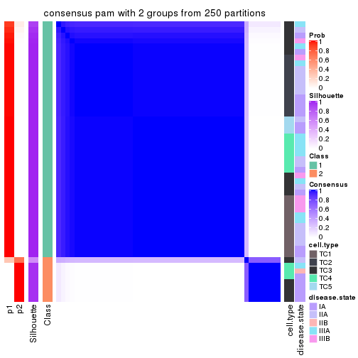</p>

</div>
<div id='tab-CV-pam-consensus-heatmap-2'>
<pre><code class="r">consensus_heatmap(res, k = 3)
</code></pre>

<p>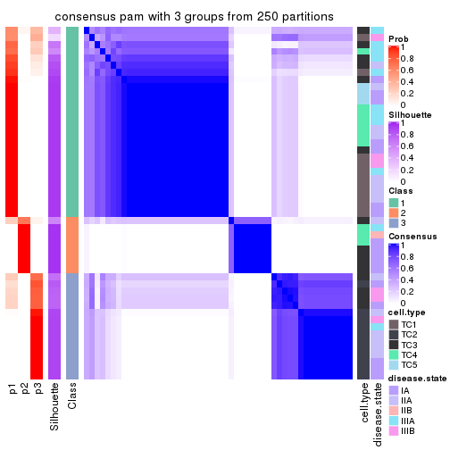</p>

</div>
<div id='tab-CV-pam-consensus-heatmap-3'>
<pre><code class="r">consensus_heatmap(res, k = 4)
</code></pre>

<p>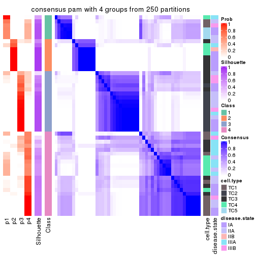</p>

</div>
<div id='tab-CV-pam-consensus-heatmap-4'>
<pre><code class="r">consensus_heatmap(res, k = 5)
</code></pre>

<p>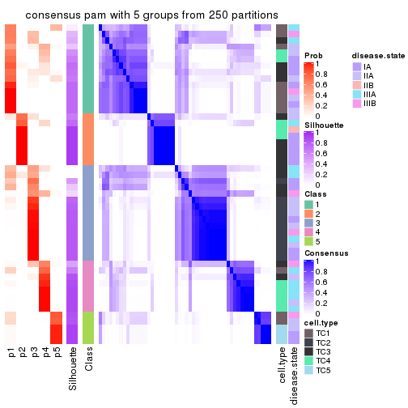</p>

</div>
<div id='tab-CV-pam-consensus-heatmap-5'>
<pre><code class="r">consensus_heatmap(res, k = 6)
</code></pre>

<p>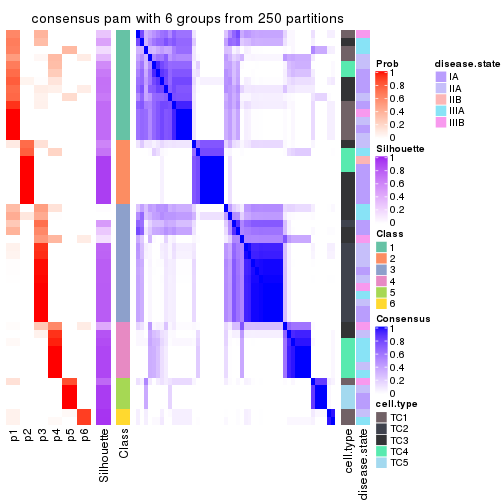</p>

</div>
</div>

Heatmaps for the membership of samples in all partitions to see how consistent they are:


<script>
$( function() {
	$( '#tabs-CV-pam-membership-heatmap' ).tabs();
} );
</script>
<div id='tabs-CV-pam-membership-heatmap'>
<ul>
<li><a href='#tab-CV-pam-membership-heatmap-1'>k = 2</a></li>
<li><a href='#tab-CV-pam-membership-heatmap-2'>k = 3</a></li>
<li><a href='#tab-CV-pam-membership-heatmap-3'>k = 4</a></li>
<li><a href='#tab-CV-pam-membership-heatmap-4'>k = 5</a></li>
<li><a href='#tab-CV-pam-membership-heatmap-5'>k = 6</a></li>
</ul>
<div id='tab-CV-pam-membership-heatmap-1'>
<pre><code class="r">membership_heatmap(res, k = 2)
</code></pre>

<p>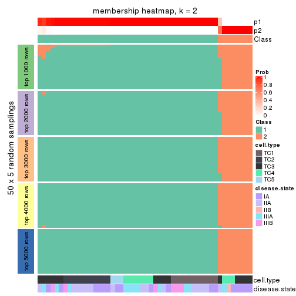</p>

</div>
<div id='tab-CV-pam-membership-heatmap-2'>
<pre><code class="r">membership_heatmap(res, k = 3)
</code></pre>

<p>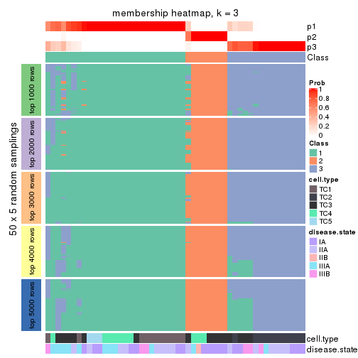</p>

</div>
<div id='tab-CV-pam-membership-heatmap-3'>
<pre><code class="r">membership_heatmap(res, k = 4)
</code></pre>

<p>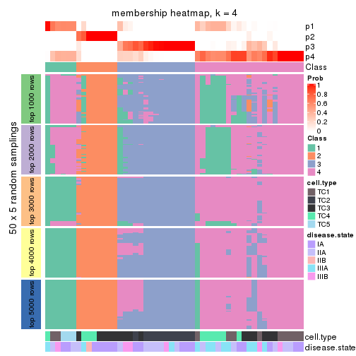</p>

</div>
<div id='tab-CV-pam-membership-heatmap-4'>
<pre><code class="r">membership_heatmap(res, k = 5)
</code></pre>

<p>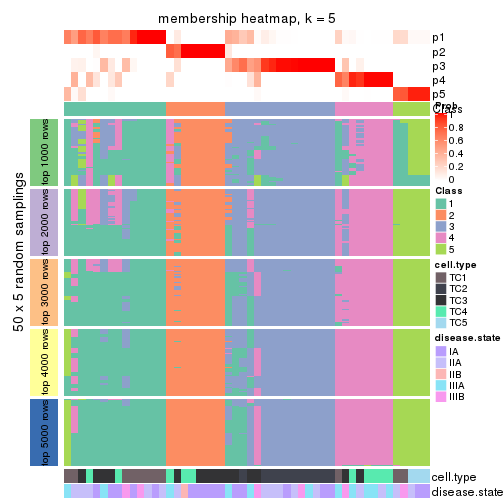</p>

</div>
<div id='tab-CV-pam-membership-heatmap-5'>
<pre><code class="r">membership_heatmap(res, k = 6)
</code></pre>

<p>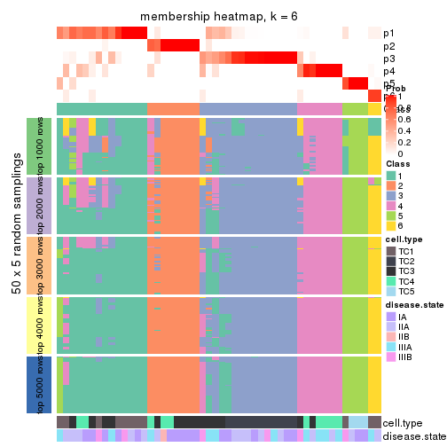</p>

</div>
</div>

As soon as we have had the classes for columns, we can look for signatures
which are significantly different between classes which can be candidate marks
for certain classes. Following are the heatmaps for signatures.


Signature heatmaps where rows are scaled:


<script>
$( function() {
	$( '#tabs-CV-pam-get-signatures' ).tabs();
} );
</script>
<div id='tabs-CV-pam-get-signatures'>
<ul>
<li><a href='#tab-CV-pam-get-signatures-1'>k = 2</a></li>
<li><a href='#tab-CV-pam-get-signatures-2'>k = 3</a></li>
<li><a href='#tab-CV-pam-get-signatures-3'>k = 4</a></li>
<li><a href='#tab-CV-pam-get-signatures-4'>k = 5</a></li>
<li><a href='#tab-CV-pam-get-signatures-5'>k = 6</a></li>
</ul>
<div id='tab-CV-pam-get-signatures-1'>
<pre><code class="r">get_signatures(res, k = 2)
</code></pre>

<p>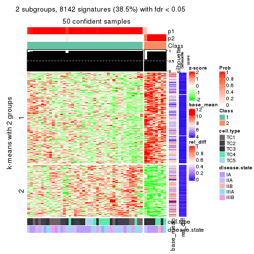</p>

</div>
<div id='tab-CV-pam-get-signatures-2'>
<pre><code class="r">get_signatures(res, k = 3)
</code></pre>

<p>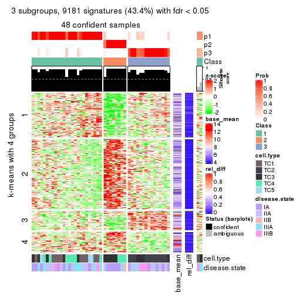</p>

</div>
<div id='tab-CV-pam-get-signatures-3'>
<pre><code class="r">get_signatures(res, k = 4)
</code></pre>

<p>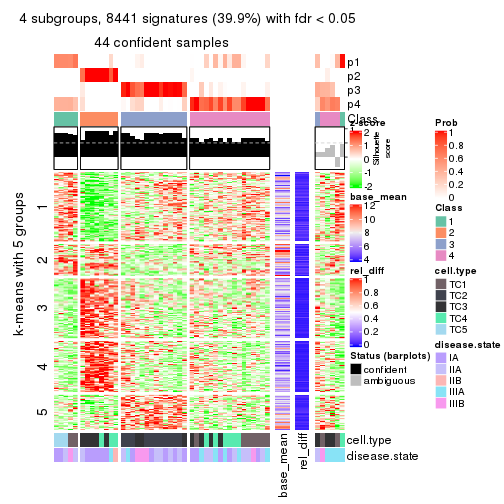</p>

</div>
<div id='tab-CV-pam-get-signatures-4'>
<pre><code class="r">get_signatures(res, k = 5)
</code></pre>

<p>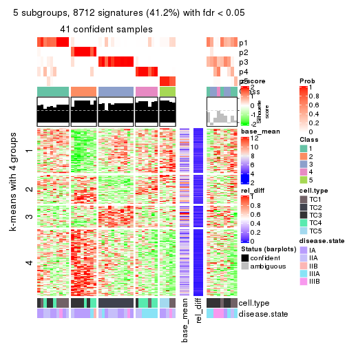</p>

</div>
<div id='tab-CV-pam-get-signatures-5'>
<pre><code class="r">get_signatures(res, k = 6)
</code></pre>

<p>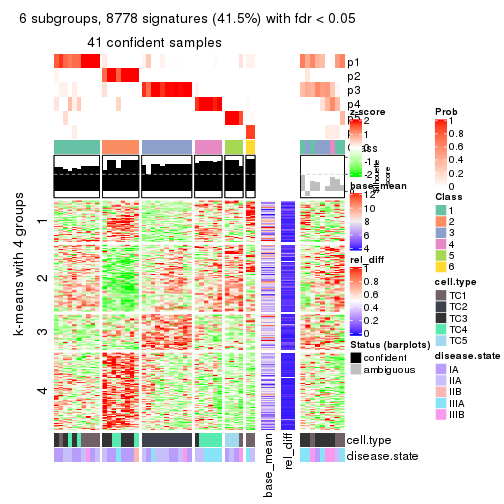</p>

</div>
</div>


Signature heatmaps where rows are not scaled:


<script>
$( function() {
	$( '#tabs-CV-pam-get-signatures-no-scale' ).tabs();
} );
</script>
<div id='tabs-CV-pam-get-signatures-no-scale'>
<ul>
<li><a href='#tab-CV-pam-get-signatures-no-scale-1'>k = 2</a></li>
<li><a href='#tab-CV-pam-get-signatures-no-scale-2'>k = 3</a></li>
<li><a href='#tab-CV-pam-get-signatures-no-scale-3'>k = 4</a></li>
<li><a href='#tab-CV-pam-get-signatures-no-scale-4'>k = 5</a></li>
<li><a href='#tab-CV-pam-get-signatures-no-scale-5'>k = 6</a></li>
</ul>
<div id='tab-CV-pam-get-signatures-no-scale-1'>
<pre><code class="r">get_signatures(res, k = 2, scale_rows = FALSE)
</code></pre>

<p>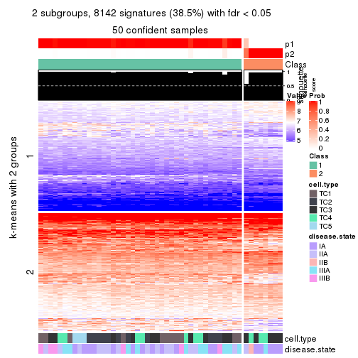</p>

</div>
<div id='tab-CV-pam-get-signatures-no-scale-2'>
<pre><code class="r">get_signatures(res, k = 3, scale_rows = FALSE)
</code></pre>

<p>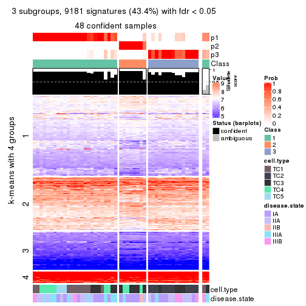</p>

</div>
<div id='tab-CV-pam-get-signatures-no-scale-3'>
<pre><code class="r">get_signatures(res, k = 4, scale_rows = FALSE)
</code></pre>

<p>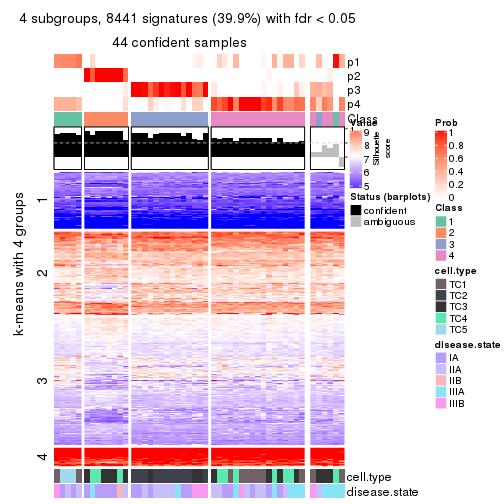</p>

</div>
<div id='tab-CV-pam-get-signatures-no-scale-4'>
<pre><code class="r">get_signatures(res, k = 5, scale_rows = FALSE)
</code></pre>

<p>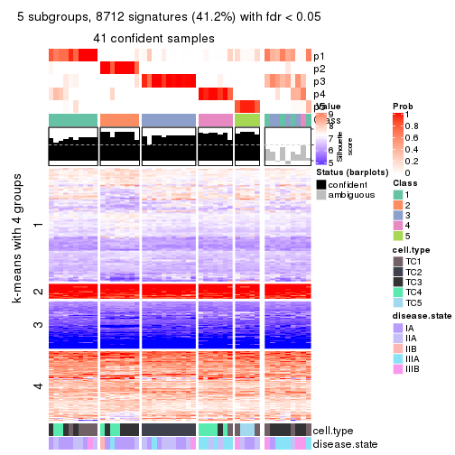</p>

</div>
<div id='tab-CV-pam-get-signatures-no-scale-5'>
<pre><code class="r">get_signatures(res, k = 6, scale_rows = FALSE)
</code></pre>

<p>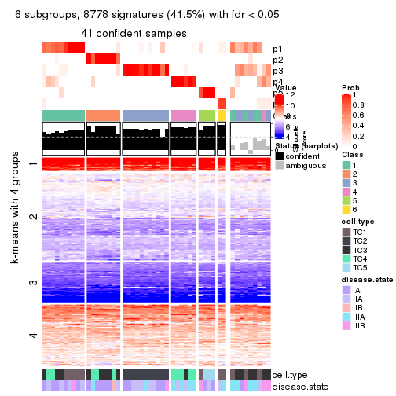</p>

</div>
</div>


Compare the overlap of signatures from different k:

```r
compare_signatures(res)
```

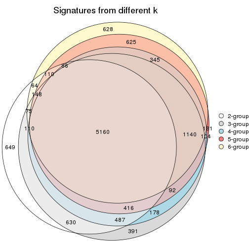

`get_signature()` returns a data frame invisibly. TO get the list of signatures, the function
call should be assigned to a variable explicitly. In following code, if `plot` argument is set
to `FALSE`, no heatmap is plotted while only the differential analysis is performed.

```r
# code only for demonstration
tb = get_signature(res, k = ..., plot = FALSE)
```

An example of the output of `tb` is:

```
#>   which_row         fdr    mean_1    mean_2 scaled_mean_1 scaled_mean_2 km
#> 1        38 0.042760348  8.373488  9.131774    -0.5533452     0.5164555  1
#> 2        40 0.018707592  7.106213  8.469186    -0.6173731     0.5762149  1
#> 3        55 0.019134737 10.221463 11.207825    -0.6159697     0.5749050  1
#> 4        59 0.006059896  5.921854  7.869574    -0.6899429     0.6439467  1
#> 5        60 0.018055526  8.928898 10.211722    -0.6204761     0.5791110  1
#> 6        98 0.009384629 15.714769 14.887706     0.6635654    -0.6193277  2
...
```

The columns in `tb` are:

1. `which_row`: row indices corresponding to the input matrix.
2. `fdr`: FDR for the differential test. 
3. `mean_x`: The mean value in group x.
4. `scaled_mean_x`: The mean value in group x after rows are scaled.
5. `km`: Row groups if k-means clustering is applied to rows.


UMAP plot which shows how samples are separated.


<script>
$( function() {
	$( '#tabs-CV-pam-dimension-reduction' ).tabs();
} );
</script>
<div id='tabs-CV-pam-dimension-reduction'>
<ul>
<li><a href='#tab-CV-pam-dimension-reduction-1'>k = 2</a></li>
<li><a href='#tab-CV-pam-dimension-reduction-2'>k = 3</a></li>
<li><a href='#tab-CV-pam-dimension-reduction-3'>k = 4</a></li>
<li><a href='#tab-CV-pam-dimension-reduction-4'>k = 5</a></li>
<li><a href='#tab-CV-pam-dimension-reduction-5'>k = 6</a></li>
</ul>
<div id='tab-CV-pam-dimension-reduction-1'>
<pre><code class="r">dimension_reduction(res, k = 2, method = &quot;UMAP&quot;)
</code></pre>

<p>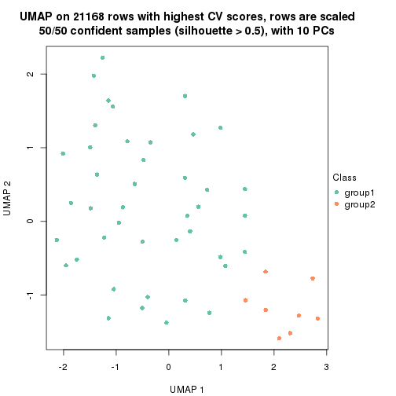</p>

</div>
<div id='tab-CV-pam-dimension-reduction-2'>
<pre><code class="r">dimension_reduction(res, k = 3, method = &quot;UMAP&quot;)
</code></pre>

<p>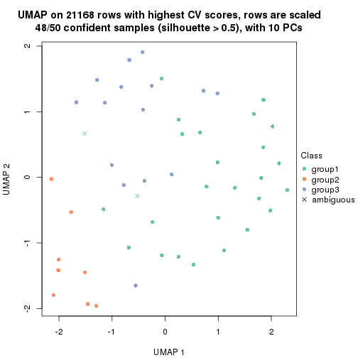</p>

</div>
<div id='tab-CV-pam-dimension-reduction-3'>
<pre><code class="r">dimension_reduction(res, k = 4, method = &quot;UMAP&quot;)
</code></pre>

<p>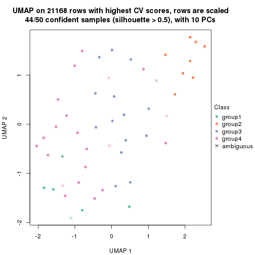</p>

</div>
<div id='tab-CV-pam-dimension-reduction-4'>
<pre><code class="r">dimension_reduction(res, k = 5, method = &quot;UMAP&quot;)
</code></pre>

<p>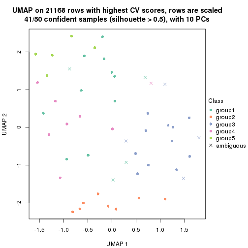</p>

</div>
<div id='tab-CV-pam-dimension-reduction-5'>
<pre><code class="r">dimension_reduction(res, k = 6, method = &quot;UMAP&quot;)
</code></pre>

<p>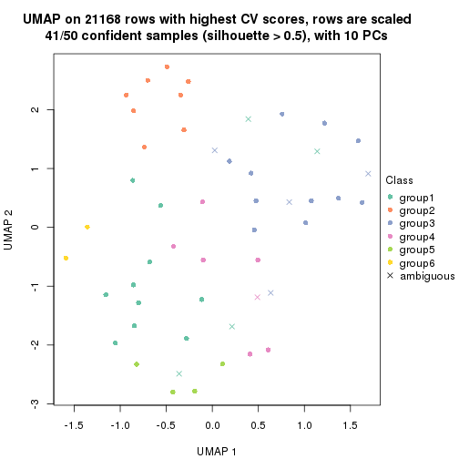</p>

</div>
</div>


Following heatmap shows how subgroups are split when increasing `k`:

```r
collect_classes(res)
```

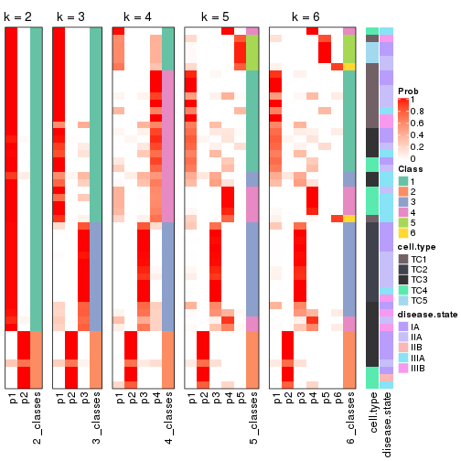


Test correlation between subgroups and known annotations. If the known
annotation is numeric, one-way ANOVA test is applied, and if the known
annotation is discrete, chi-squared contingency table test is applied.

```r
test_to_known_factors(res)
```

```
#>         n cell.type(p) disease.state(p) k
#> CV:pam 50     4.83e-02           0.0399 2
#> CV:pam 48     4.07e-07           0.0860 3
#> CV:pam 44     7.27e-10           0.3219 4
#> CV:pam 41     6.87e-11           0.0356 5
#> CV:pam 41     3.48e-12           0.1492 6
```


If matrix rows can be associated to genes, consider to use `functional_enrichment(res,
...)` to perform function enrichment for the signature genes. See [this vignette](http://bioconductor.org/packages/devel/bioc/vignettes/cola/inst/doc/functional_enrichment.html) for more detailed explanations.


 

---------------------------------------------------


### CV:mclust


The object with results only for a single top-value method and a single partition method 
can be extracted as:

```r
res = res_list["CV", "mclust"]
# you can also extract it by
# res = res_list["CV:mclust"]
```

A summary of `res` and all the functions that can be applied to it:

```r
res
```

```
#> A 'ConsensusPartition' object with k = 2, 3, 4, 5, 6.
#>   On a matrix with 21168 rows and 50 columns.
#>   Top rows (1000, 2000, 3000, 4000, 5000) are extracted by 'CV' method.
#>   Subgroups are detected by 'mclust' method.
#>   Performed in total 1250 partitions by row resampling.
#>   Best k for subgroups seems to be 4.
#> 
#> Following methods can be applied to this 'ConsensusPartition' object:
#>  [1] "cola_report"             "collect_classes"         "collect_plots"          
#>  [4] "collect_stats"           "colnames"                "compare_signatures"     
#>  [7] "consensus_heatmap"       "dimension_reduction"     "functional_enrichment"  
#> [10] "get_anno_col"            "get_anno"                "get_classes"            
#> [13] "get_consensus"           "get_matrix"              "get_membership"         
#> [16] "get_param"               "get_signatures"          "get_stats"              
#> [19] "is_best_k"               "is_stable_k"             "membership_heatmap"     
#> [22] "ncol"                    "nrow"                    "plot_ecdf"              
#> [25] "rownames"                "select_partition_number" "show"                   
#> [28] "suggest_best_k"          "test_to_known_factors"
```

`collect_plots()` function collects all the plots made from `res` for all `k` (number of partitions)
into one single page to provide an easy and fast comparison between different `k`.

```r
collect_plots(res)
```

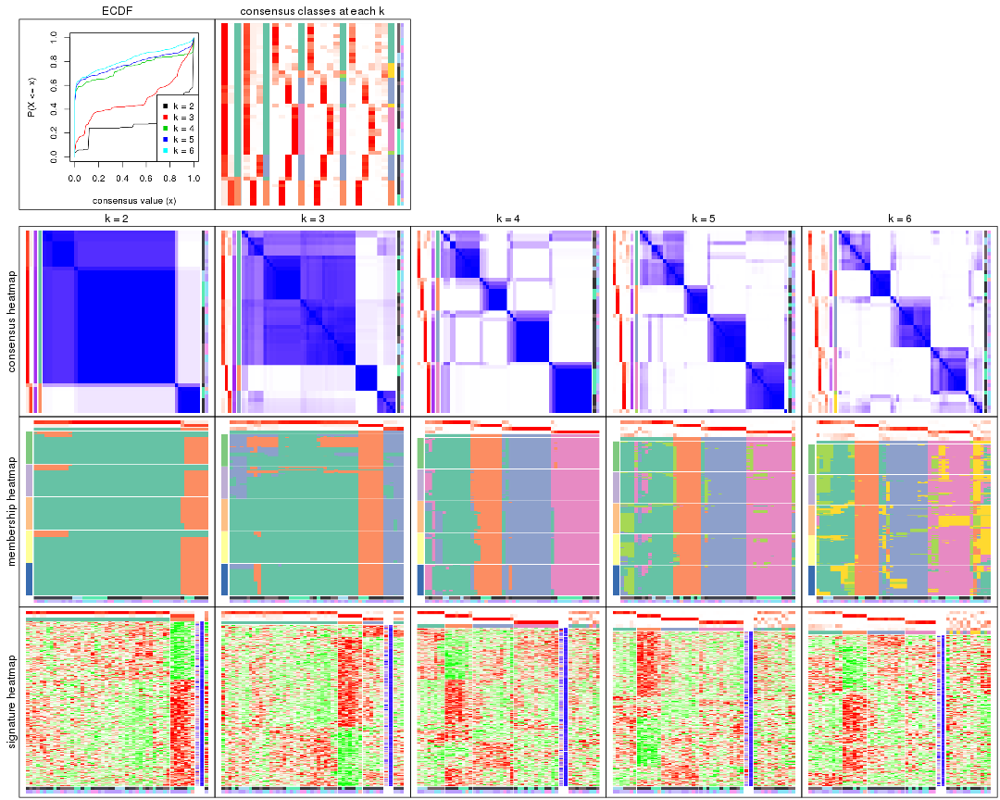

The plots are:

- The first row: a plot of the ECDF (empirical cumulative distribution
  function) curves of the consensus matrix for each `k` and the heatmap of
  predicted classes for each `k`.
- The second row: heatmaps of the consensus matrix for each `k`.
- The third row: heatmaps of the membership matrix for each `k`.
- The fouth row: heatmaps of the signatures for each `k`.

All the plots in panels can be made by individual functions and they are
plotted later in this section.

`select_partition_number()` produces several plots showing different
statistics for choosing "optimized" `k`. There are following statistics:

- ECDF curves of the consensus matrix for each `k`;
- 1-PAC. [The PAC
  score](https://en.wikipedia.org/wiki/Consensus_clustering#Over-interpretation_potential_of_consensus_clustering)
  measures the proportion of the ambiguous subgrouping.
- Mean silhouette score.
- Concordance. The mean probability of fiting the consensus class ids in all
  partitions.
- Area increased. Denote $A_k$ as the area under the ECDF curve for current
  `k`, the area increased is defined as $A_k - A_{k-1}$.
- Rand index. The percent of pairs of samples that are both in a same cluster
  or both are not in a same cluster in the partition of k and k-1.
- Jaccard index. The ratio of pairs of samples are both in a same cluster in
  the partition of k and k-1 and the pairs of samples are both in a same
  cluster in the partition k or k-1.

The detailed explanations of these statistics can be found in [the _cola_
vignette](http://bioconductor.org/packages/devel/bioc/vignettes/cola/inst/doc/cola.html#toc_13).

Generally speaking, lower PAC score, higher mean silhouette score or higher
concordance corresponds to better partition. Rand index and Jaccard index
measure how similar the current partition is compared to partition with `k-1`.
If they are too similar, we won't accept `k` is better than `k-1`.

```r
select_partition_number(res)
```

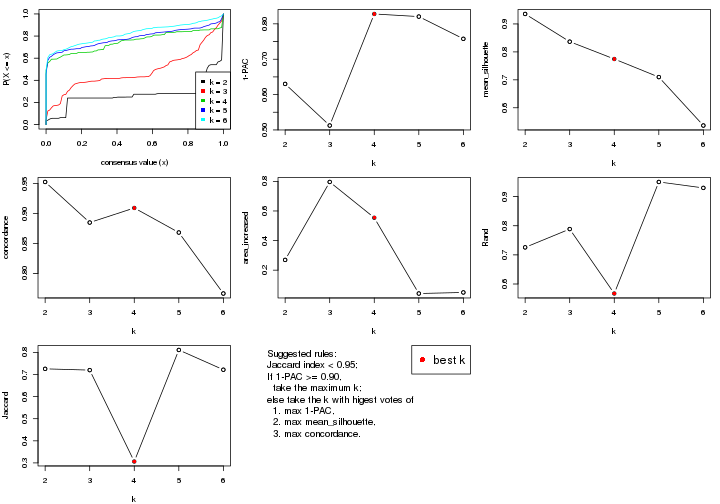

The numeric values for all these statistics can be obtained by `get_stats()`.

```r
get_stats(res)
```

```
#>   k 1-PAC mean_silhouette concordance area_increased  Rand Jaccard
#> 2 2 0.630           0.936       0.953         0.2692 0.726   0.726
#> 3 3 0.512           0.837       0.885         0.7960 0.789   0.720
#> 4 4 0.828           0.774       0.909         0.5541 0.567   0.306
#> 5 5 0.821           0.710       0.868         0.0420 0.950   0.811
#> 6 6 0.758           0.536       0.767         0.0492 0.930   0.722
```

`suggest_best_k()` suggests the best $k$ based on these statistics. The rules are as follows:

- All $k$ with Jaccard index larger than 0.95 are removed because increasing
  $k$ does not provide enough extra information. If all $k$ are removed, it is
  marked as no subgroup is detected.
- For all $k$ with 1-PAC score larger than 0.9, the maximal $k$ is taken as
  the best $k$, and other $k$ are marked as optional $k$.
- If it does not fit the second rule. The $k$ with the maximal vote of the
  highest 1-PAC score, highest mean silhouette, and highest concordance is
  taken as the best $k$.

```r
suggest_best_k(res)
```

```
#> [1] 4
```


Following shows the table of the partitions (You need to click the **show/hide
code output** link to see it). The membership matrix (columns with name `p*`)
is inferred by
[`clue::cl_consensus()`](https://www.rdocumentation.org/link/cl_consensus?package=clue)
function with the `SE` method. Basically the value in the membership matrix
represents the probability to belong to a certain group. The finall class
label for an item is determined with the group with highest probability it
belongs to.

In `get_classes()` function, the entropy is calculated from the membership
matrix and the silhouette score is calculated from the consensus matrix.


<script>
$( function() {
	$( '#tabs-CV-mclust-get-classes' ).tabs();
} );
</script>
<div id='tabs-CV-mclust-get-classes'>
<ul>
<li><a href='#tab-CV-mclust-get-classes-1'>k = 2</a></li>
<li><a href='#tab-CV-mclust-get-classes-2'>k = 3</a></li>
<li><a href='#tab-CV-mclust-get-classes-3'>k = 4</a></li>
<li><a href='#tab-CV-mclust-get-classes-4'>k = 5</a></li>
<li><a href='#tab-CV-mclust-get-classes-5'>k = 6</a></li>
</ul>

<div id='tab-CV-mclust-get-classes-1'>
<p><a id='tab-CV-mclust-get-classes-1-a' style='color:#0366d6' href='#'>show/hide code output</a></p>
<pre><code class="r">cbind(get_classes(res, k = 2), get_membership(res, k = 2))
</code></pre>

<pre><code>#&gt;          class entropy silhouette    p1    p2
#&gt; GSM63448     1   0.000      0.969 1.000 0.000
#&gt; GSM63449     1   0.000      0.969 1.000 0.000
#&gt; GSM63423     1   0.000      0.969 1.000 0.000
#&gt; GSM63425     1   0.000      0.969 1.000 0.000
#&gt; GSM63437     1   0.000      0.969 1.000 0.000
#&gt; GSM63453     1   0.000      0.969 1.000 0.000
#&gt; GSM63431     1   0.000      0.969 1.000 0.000
#&gt; GSM63450     1   0.000      0.969 1.000 0.000
#&gt; GSM63428     1   0.000      0.969 1.000 0.000
#&gt; GSM63432     1   0.000      0.969 1.000 0.000
#&gt; GSM63458     1   0.000      0.969 1.000 0.000
#&gt; GSM63434     1   0.443      0.909 0.908 0.092
#&gt; GSM63435     1   0.506      0.894 0.888 0.112
#&gt; GSM63442     1   0.242      0.944 0.960 0.040
#&gt; GSM63451     1   0.443      0.909 0.908 0.092
#&gt; GSM63422     1   0.506      0.894 0.888 0.112
#&gt; GSM63438     1   0.506      0.894 0.888 0.112
#&gt; GSM63439     1   0.506      0.894 0.888 0.112
#&gt; GSM63461     1   0.506      0.894 0.888 0.112
#&gt; GSM63463     1   0.506      0.894 0.888 0.112
#&gt; GSM63430     1   0.506      0.894 0.888 0.112
#&gt; GSM63446     1   0.416      0.914 0.916 0.084
#&gt; GSM63429     1   0.000      0.969 1.000 0.000
#&gt; GSM63445     1   0.000      0.969 1.000 0.000
#&gt; GSM63447     1   0.000      0.969 1.000 0.000
#&gt; GSM63459     2   0.506      0.938 0.112 0.888
#&gt; GSM63464     2   0.506      0.938 0.112 0.888
#&gt; GSM63469     2   0.506      0.938 0.112 0.888
#&gt; GSM63470     2   0.506      0.938 0.112 0.888
#&gt; GSM63436     1   0.000      0.969 1.000 0.000
#&gt; GSM63443     2   1.000      0.260 0.488 0.512
#&gt; GSM63465     1   0.000      0.969 1.000 0.000
#&gt; GSM63444     1   0.000      0.969 1.000 0.000
#&gt; GSM63456     1   0.000      0.969 1.000 0.000
#&gt; GSM63462     1   0.000      0.969 1.000 0.000
#&gt; GSM63424     1   0.000      0.969 1.000 0.000
#&gt; GSM63440     1   0.000      0.969 1.000 0.000
#&gt; GSM63433     1   0.000      0.969 1.000 0.000
#&gt; GSM63466     2   0.506      0.938 0.112 0.888
#&gt; GSM63426     1   0.000      0.969 1.000 0.000
#&gt; GSM63468     1   0.000      0.969 1.000 0.000
#&gt; GSM63452     2   0.518      0.935 0.116 0.884
#&gt; GSM63441     1   0.000      0.969 1.000 0.000
#&gt; GSM63454     1   0.000      0.969 1.000 0.000
#&gt; GSM63455     1   0.000      0.969 1.000 0.000
#&gt; GSM63460     2   0.506      0.938 0.112 0.888
#&gt; GSM63467     1   0.000      0.969 1.000 0.000
#&gt; GSM63421     1   0.000      0.969 1.000 0.000
#&gt; GSM63427     1   0.000      0.969 1.000 0.000
#&gt; GSM63457     1   0.000      0.969 1.000 0.000
</code></pre>

<script>
$('#tab-CV-mclust-get-classes-1-a').parent().next().next().hide();
$('#tab-CV-mclust-get-classes-1-a').click(function(){
  $('#tab-CV-mclust-get-classes-1-a').parent().next().next().toggle();
  return(false);
});
</script>
</div>

<div id='tab-CV-mclust-get-classes-2'>
<p><a id='tab-CV-mclust-get-classes-2-a' style='color:#0366d6' href='#'>show/hide code output</a></p>
<pre><code class="r">cbind(get_classes(res, k = 3), get_membership(res, k = 3))
</code></pre>

<pre><code>#&gt;          class entropy silhouette    p1    p2    p3
#&gt; GSM63448     1  0.3043      0.871 0.908 0.084 0.008
#&gt; GSM63449     1  0.5096      0.855 0.836 0.084 0.080
#&gt; GSM63423     1  0.4737      0.861 0.852 0.084 0.064
#&gt; GSM63425     1  0.0848      0.857 0.984 0.008 0.008
#&gt; GSM63437     1  0.4544      0.863 0.860 0.084 0.056
#&gt; GSM63453     1  0.3889      0.868 0.884 0.084 0.032
#&gt; GSM63431     1  0.3889      0.868 0.884 0.084 0.032
#&gt; GSM63450     1  0.3889      0.868 0.884 0.084 0.032
#&gt; GSM63428     1  0.5096      0.855 0.836 0.084 0.080
#&gt; GSM63432     1  0.5423      0.833 0.820 0.084 0.096
#&gt; GSM63458     1  0.3141      0.871 0.912 0.068 0.020
#&gt; GSM63434     3  0.3686      0.878 0.140 0.000 0.860
#&gt; GSM63435     1  0.6095      0.469 0.608 0.000 0.392
#&gt; GSM63442     1  0.5497      0.648 0.708 0.000 0.292
#&gt; GSM63451     3  0.3941      0.867 0.156 0.000 0.844
#&gt; GSM63422     1  0.5706      0.608 0.680 0.000 0.320
#&gt; GSM63438     1  0.6126      0.449 0.600 0.000 0.400
#&gt; GSM63439     3  0.1289      0.841 0.032 0.000 0.968
#&gt; GSM63461     1  0.6062      0.481 0.616 0.000 0.384
#&gt; GSM63463     3  0.3482      0.831 0.128 0.000 0.872
#&gt; GSM63430     3  0.1289      0.841 0.032 0.000 0.968
#&gt; GSM63446     3  0.3879      0.867 0.152 0.000 0.848
#&gt; GSM63429     1  0.0848      0.857 0.984 0.008 0.008
#&gt; GSM63445     1  0.4121      0.864 0.876 0.084 0.040
#&gt; GSM63447     1  0.3116      0.869 0.892 0.108 0.000
#&gt; GSM63459     2  0.0237      0.999 0.004 0.996 0.000
#&gt; GSM63464     2  0.0237      0.999 0.004 0.996 0.000
#&gt; GSM63469     2  0.0237      0.999 0.004 0.996 0.000
#&gt; GSM63470     2  0.0237      0.999 0.004 0.996 0.000
#&gt; GSM63436     1  0.2860      0.871 0.912 0.084 0.004
#&gt; GSM63443     1  0.8044      0.557 0.600 0.312 0.088
#&gt; GSM63465     1  0.1315      0.859 0.972 0.020 0.008
#&gt; GSM63444     1  0.5560      0.692 0.700 0.300 0.000
#&gt; GSM63456     1  0.5804      0.828 0.800 0.112 0.088
#&gt; GSM63462     1  0.2356      0.872 0.928 0.072 0.000
#&gt; GSM63424     1  0.1585      0.852 0.964 0.008 0.028
#&gt; GSM63440     1  0.1170      0.856 0.976 0.008 0.016
#&gt; GSM63433     1  0.0848      0.857 0.984 0.008 0.008
#&gt; GSM63466     2  0.0237      0.999 0.004 0.996 0.000
#&gt; GSM63426     1  0.0848      0.857 0.984 0.008 0.008
#&gt; GSM63468     1  0.0848      0.857 0.984 0.008 0.008
#&gt; GSM63452     2  0.0424      0.993 0.008 0.992 0.000
#&gt; GSM63441     1  0.0848      0.857 0.984 0.008 0.008
#&gt; GSM63454     1  0.0848      0.857 0.984 0.008 0.008
#&gt; GSM63455     1  0.0848      0.857 0.984 0.008 0.008
#&gt; GSM63460     2  0.0237      0.999 0.004 0.996 0.000
#&gt; GSM63467     1  0.1289      0.868 0.968 0.032 0.000
#&gt; GSM63421     1  0.3637      0.868 0.892 0.084 0.024
#&gt; GSM63427     1  0.3889      0.868 0.884 0.084 0.032
#&gt; GSM63457     1  0.3637      0.868 0.892 0.084 0.024
</code></pre>

<script>
$('#tab-CV-mclust-get-classes-2-a').parent().next().next().hide();
$('#tab-CV-mclust-get-classes-2-a').click(function(){
  $('#tab-CV-mclust-get-classes-2-a').parent().next().next().toggle();
  return(false);
});
</script>
</div>

<div id='tab-CV-mclust-get-classes-3'>
<p><a id='tab-CV-mclust-get-classes-3-a' style='color:#0366d6' href='#'>show/hide code output</a></p>
<pre><code class="r">cbind(get_classes(res, k = 4), get_membership(res, k = 4))
</code></pre>

<pre><code>#&gt;          class entropy silhouette    p1    p2    p3    p4
#&gt; GSM63448     1  0.6653      0.332 0.548 0.000 0.096 0.356
#&gt; GSM63449     1  0.4720      0.422 0.672 0.000 0.324 0.004
#&gt; GSM63423     1  0.0188      0.776 0.996 0.000 0.000 0.004
#&gt; GSM63425     4  0.0000      0.958 0.000 0.000 0.000 1.000
#&gt; GSM63437     1  0.0188      0.776 0.996 0.000 0.000 0.004
#&gt; GSM63453     1  0.0000      0.775 1.000 0.000 0.000 0.000
#&gt; GSM63431     1  0.0469      0.776 0.988 0.000 0.000 0.012
#&gt; GSM63450     1  0.0000      0.775 1.000 0.000 0.000 0.000
#&gt; GSM63428     1  0.4720      0.422 0.672 0.000 0.324 0.004
#&gt; GSM63432     3  0.4564      0.439 0.328 0.000 0.672 0.000
#&gt; GSM63458     1  0.4888      0.315 0.588 0.000 0.000 0.412
#&gt; GSM63434     3  0.0000      0.916 0.000 0.000 1.000 0.000
#&gt; GSM63435     3  0.0000      0.916 0.000 0.000 1.000 0.000
#&gt; GSM63442     3  0.0000      0.916 0.000 0.000 1.000 0.000
#&gt; GSM63451     3  0.0000      0.916 0.000 0.000 1.000 0.000
#&gt; GSM63422     3  0.0000      0.916 0.000 0.000 1.000 0.000
#&gt; GSM63438     3  0.0000      0.916 0.000 0.000 1.000 0.000
#&gt; GSM63439     3  0.0000      0.916 0.000 0.000 1.000 0.000
#&gt; GSM63461     3  0.0000      0.916 0.000 0.000 1.000 0.000
#&gt; GSM63463     3  0.0000      0.916 0.000 0.000 1.000 0.000
#&gt; GSM63430     3  0.0000      0.916 0.000 0.000 1.000 0.000
#&gt; GSM63446     3  0.0000      0.916 0.000 0.000 1.000 0.000
#&gt; GSM63429     4  0.0000      0.958 0.000 0.000 0.000 1.000
#&gt; GSM63445     3  0.5236      0.172 0.432 0.000 0.560 0.008
#&gt; GSM63447     4  0.1867      0.887 0.000 0.072 0.000 0.928
#&gt; GSM63459     2  0.0000      0.869 0.000 1.000 0.000 0.000
#&gt; GSM63464     2  0.2814      0.784 0.132 0.868 0.000 0.000
#&gt; GSM63469     2  0.0000      0.869 0.000 1.000 0.000 0.000
#&gt; GSM63470     2  0.0000      0.869 0.000 1.000 0.000 0.000
#&gt; GSM63436     1  0.6638      0.180 0.496 0.000 0.084 0.420
#&gt; GSM63443     3  0.3356      0.724 0.000 0.176 0.824 0.000
#&gt; GSM63465     4  0.0000      0.958 0.000 0.000 0.000 1.000
#&gt; GSM63444     2  0.4193      0.630 0.268 0.732 0.000 0.000
#&gt; GSM63456     2  0.7887      0.151 0.332 0.376 0.292 0.000
#&gt; GSM63462     4  0.6106      0.290 0.332 0.000 0.064 0.604
#&gt; GSM63424     4  0.0000      0.958 0.000 0.000 0.000 1.000
#&gt; GSM63440     4  0.0000      0.958 0.000 0.000 0.000 1.000
#&gt; GSM63433     4  0.0000      0.958 0.000 0.000 0.000 1.000
#&gt; GSM63466     2  0.0000      0.869 0.000 1.000 0.000 0.000
#&gt; GSM63426     4  0.0000      0.958 0.000 0.000 0.000 1.000
#&gt; GSM63468     4  0.0000      0.958 0.000 0.000 0.000 1.000
#&gt; GSM63452     2  0.0000      0.869 0.000 1.000 0.000 0.000
#&gt; GSM63441     4  0.0000      0.958 0.000 0.000 0.000 1.000
#&gt; GSM63454     4  0.0000      0.958 0.000 0.000 0.000 1.000
#&gt; GSM63455     4  0.0000      0.958 0.000 0.000 0.000 1.000
#&gt; GSM63460     2  0.0000      0.869 0.000 1.000 0.000 0.000
#&gt; GSM63467     4  0.0000      0.958 0.000 0.000 0.000 1.000
#&gt; GSM63421     1  0.0188      0.776 0.996 0.000 0.000 0.004
#&gt; GSM63427     1  0.0817      0.770 0.976 0.000 0.000 0.024
#&gt; GSM63457     1  0.0921      0.770 0.972 0.000 0.000 0.028
</code></pre>

<script>
$('#tab-CV-mclust-get-classes-3-a').parent().next().next().hide();
$('#tab-CV-mclust-get-classes-3-a').click(function(){
  $('#tab-CV-mclust-get-classes-3-a').parent().next().next().toggle();
  return(false);
});
</script>
</div>

<div id='tab-CV-mclust-get-classes-4'>
<p><a id='tab-CV-mclust-get-classes-4-a' style='color:#0366d6' href='#'>show/hide code output</a></p>
<pre><code class="r">cbind(get_classes(res, k = 5), get_membership(res, k = 5))
</code></pre>

<pre><code>#&gt;          class entropy silhouette    p1    p2    p3    p4    p5
#&gt; GSM63448     1  0.4524    0.45879 0.692 0.000 0.008 0.280 0.020
#&gt; GSM63449     1  0.5675    0.40564 0.556 0.000 0.092 0.000 0.352
#&gt; GSM63423     1  0.0290    0.65150 0.992 0.000 0.000 0.000 0.008
#&gt; GSM63425     4  0.2011    0.91440 0.004 0.000 0.000 0.908 0.088
#&gt; GSM63437     1  0.0290    0.65150 0.992 0.000 0.000 0.000 0.008
#&gt; GSM63453     1  0.4249    0.45508 0.568 0.000 0.000 0.000 0.432
#&gt; GSM63431     1  0.1043    0.65220 0.960 0.000 0.000 0.000 0.040
#&gt; GSM63450     1  0.4242    0.45775 0.572 0.000 0.000 0.000 0.428
#&gt; GSM63428     1  0.6003    0.34240 0.584 0.000 0.192 0.000 0.224
#&gt; GSM63432     3  0.4380    0.00407 0.376 0.000 0.616 0.000 0.008
#&gt; GSM63458     1  0.4591    0.55955 0.748 0.000 0.000 0.132 0.120
#&gt; GSM63434     3  0.0290    0.88702 0.000 0.000 0.992 0.000 0.008
#&gt; GSM63435     3  0.0162    0.89137 0.000 0.000 0.996 0.000 0.004
#&gt; GSM63442     3  0.0451    0.88367 0.008 0.000 0.988 0.000 0.004
#&gt; GSM63451     3  0.0880    0.86167 0.000 0.000 0.968 0.000 0.032
#&gt; GSM63422     3  0.0162    0.89137 0.000 0.000 0.996 0.000 0.004
#&gt; GSM63438     3  0.0162    0.89137 0.000 0.000 0.996 0.000 0.004
#&gt; GSM63439     3  0.0000    0.89120 0.000 0.000 1.000 0.000 0.000
#&gt; GSM63461     3  0.0162    0.89137 0.000 0.000 0.996 0.000 0.004
#&gt; GSM63463     3  0.0000    0.89120 0.000 0.000 1.000 0.000 0.000
#&gt; GSM63430     3  0.0000    0.89120 0.000 0.000 1.000 0.000 0.000
#&gt; GSM63446     3  0.0290    0.88743 0.000 0.000 0.992 0.000 0.008
#&gt; GSM63429     4  0.0000    0.94103 0.000 0.000 0.000 1.000 0.000
#&gt; GSM63445     1  0.5008   -0.23529 0.500 0.000 0.476 0.012 0.012
#&gt; GSM63447     4  0.3394    0.81121 0.004 0.020 0.000 0.824 0.152
#&gt; GSM63459     2  0.0000    0.91423 0.000 1.000 0.000 0.000 0.000
#&gt; GSM63464     2  0.1992    0.85900 0.032 0.924 0.000 0.000 0.044
#&gt; GSM63469     2  0.0000    0.91423 0.000 1.000 0.000 0.000 0.000
#&gt; GSM63470     2  0.0162    0.91442 0.000 0.996 0.000 0.000 0.004
#&gt; GSM63436     1  0.4755    0.43762 0.672 0.000 0.008 0.292 0.028
#&gt; GSM63443     3  0.4578    0.29854 0.004 0.048 0.724 0.000 0.224
#&gt; GSM63465     4  0.2497    0.86550 0.004 0.004 0.000 0.880 0.112
#&gt; GSM63444     2  0.5666    0.23985 0.060 0.524 0.000 0.008 0.408
#&gt; GSM63456     5  0.8188    0.00000 0.120 0.092 0.352 0.032 0.404
#&gt; GSM63462     1  0.6078    0.17359 0.492 0.000 0.004 0.396 0.108
#&gt; GSM63424     4  0.0000    0.94103 0.000 0.000 0.000 1.000 0.000
#&gt; GSM63440     4  0.0000    0.94103 0.000 0.000 0.000 1.000 0.000
#&gt; GSM63433     4  0.1831    0.91863 0.004 0.000 0.000 0.920 0.076
#&gt; GSM63466     2  0.0162    0.91442 0.000 0.996 0.000 0.000 0.004
#&gt; GSM63426     4  0.2233    0.90263 0.004 0.000 0.000 0.892 0.104
#&gt; GSM63468     4  0.0671    0.93926 0.004 0.000 0.000 0.980 0.016
#&gt; GSM63452     2  0.0451    0.90866 0.000 0.988 0.000 0.008 0.004
#&gt; GSM63441     4  0.0000    0.94103 0.000 0.000 0.000 1.000 0.000
#&gt; GSM63454     4  0.0162    0.94024 0.004 0.000 0.000 0.996 0.000
#&gt; GSM63455     4  0.2439    0.89585 0.004 0.000 0.000 0.876 0.120
#&gt; GSM63460     2  0.0162    0.91442 0.000 0.996 0.000 0.000 0.004
#&gt; GSM63467     4  0.0566    0.93745 0.012 0.000 0.000 0.984 0.004
#&gt; GSM63421     1  0.1544    0.64836 0.932 0.000 0.000 0.000 0.068
#&gt; GSM63427     1  0.0290    0.65239 0.992 0.000 0.000 0.000 0.008
#&gt; GSM63457     1  0.1768    0.64726 0.924 0.000 0.000 0.004 0.072
</code></pre>

<script>
$('#tab-CV-mclust-get-classes-4-a').parent().next().next().hide();
$('#tab-CV-mclust-get-classes-4-a').click(function(){
  $('#tab-CV-mclust-get-classes-4-a').parent().next().next().toggle();
  return(false);
});
</script>
</div>

<div id='tab-CV-mclust-get-classes-5'>
<p><a id='tab-CV-mclust-get-classes-5-a' style='color:#0366d6' href='#'>show/hide code output</a></p>
<pre><code class="r">cbind(get_classes(res, k = 6), get_membership(res, k = 6))
</code></pre>

<pre><code>#&gt;          class entropy silhouette    p1    p2    p3    p4    p5    p6
#&gt; GSM63448     6  0.7552    0.32350 0.272 0.000 0.004 0.264 0.124 0.336
#&gt; GSM63449     1  0.5980    0.52562 0.460 0.000 0.004 0.000 0.328 0.208
#&gt; GSM63423     1  0.5195    0.54002 0.616 0.000 0.000 0.000 0.208 0.176
#&gt; GSM63425     4  0.3670    0.00179 0.024 0.000 0.000 0.736 0.240 0.000
#&gt; GSM63437     1  0.5170    0.54032 0.620 0.000 0.000 0.000 0.204 0.176
#&gt; GSM63453     1  0.4587    0.53922 0.596 0.000 0.000 0.000 0.356 0.048
#&gt; GSM63431     1  0.0547    0.55125 0.980 0.000 0.000 0.000 0.020 0.000
#&gt; GSM63450     1  0.4703    0.54351 0.544 0.000 0.000 0.000 0.408 0.048
#&gt; GSM63428     1  0.6575    0.50745 0.472 0.000 0.044 0.000 0.252 0.232
#&gt; GSM63432     3  0.6918    0.12877 0.200 0.000 0.492 0.000 0.188 0.120
#&gt; GSM63458     1  0.4381   -0.05446 0.524 0.000 0.000 0.004 0.456 0.016
#&gt; GSM63434     3  0.1644    0.79952 0.000 0.000 0.932 0.000 0.028 0.040
#&gt; GSM63435     3  0.1926    0.80015 0.000 0.000 0.912 0.000 0.020 0.068
#&gt; GSM63442     3  0.3004    0.76753 0.012 0.000 0.848 0.000 0.028 0.112
#&gt; GSM63451     3  0.2088    0.78643 0.000 0.000 0.904 0.000 0.028 0.068
#&gt; GSM63422     3  0.2009    0.79971 0.000 0.000 0.908 0.000 0.024 0.068
#&gt; GSM63438     3  0.0146    0.80982 0.000 0.000 0.996 0.000 0.004 0.000
#&gt; GSM63439     3  0.0858    0.80822 0.000 0.000 0.968 0.000 0.028 0.004
#&gt; GSM63461     3  0.2152    0.79879 0.004 0.000 0.904 0.000 0.024 0.068
#&gt; GSM63463     3  0.1674    0.80314 0.004 0.000 0.924 0.000 0.004 0.068
#&gt; GSM63430     3  0.0858    0.80822 0.000 0.000 0.968 0.000 0.028 0.004
#&gt; GSM63446     3  0.1421    0.80368 0.000 0.000 0.944 0.000 0.028 0.028
#&gt; GSM63429     4  0.0146    0.69236 0.000 0.000 0.000 0.996 0.000 0.004
#&gt; GSM63445     3  0.7575   -0.19442 0.248 0.000 0.340 0.004 0.132 0.276
#&gt; GSM63447     4  0.3837    0.50049 0.000 0.016 0.000 0.744 0.016 0.224
#&gt; GSM63459     2  0.0000    0.98597 0.000 1.000 0.000 0.000 0.000 0.000
#&gt; GSM63464     2  0.1075    0.94739 0.000 0.952 0.000 0.000 0.000 0.048
#&gt; GSM63469     2  0.0000    0.98597 0.000 1.000 0.000 0.000 0.000 0.000
#&gt; GSM63470     2  0.0146    0.98599 0.000 0.996 0.000 0.004 0.000 0.000
#&gt; GSM63436     6  0.7358    0.32783 0.272 0.000 0.000 0.264 0.112 0.352
#&gt; GSM63443     3  0.5461    0.36204 0.008 0.096 0.556 0.000 0.004 0.336
#&gt; GSM63465     4  0.3037    0.58292 0.000 0.004 0.000 0.820 0.016 0.160
#&gt; GSM63444     6  0.4923   -0.01467 0.048 0.384 0.000 0.004 0.004 0.560
#&gt; GSM63456     6  0.4565    0.32538 0.012 0.132 0.116 0.004 0.000 0.736
#&gt; GSM63462     6  0.6005    0.36051 0.172 0.000 0.000 0.340 0.012 0.476
#&gt; GSM63424     4  0.0146    0.69236 0.000 0.000 0.000 0.996 0.000 0.004
#&gt; GSM63440     4  0.0146    0.69236 0.000 0.000 0.000 0.996 0.000 0.004
#&gt; GSM63433     4  0.4542   -0.68962 0.028 0.000 0.000 0.556 0.412 0.004
#&gt; GSM63466     2  0.0146    0.98599 0.000 0.996 0.000 0.004 0.000 0.000
#&gt; GSM63426     4  0.4820   -0.86261 0.036 0.000 0.000 0.492 0.464 0.008
#&gt; GSM63468     4  0.0622    0.68399 0.000 0.000 0.000 0.980 0.012 0.008
#&gt; GSM63452     2  0.0260    0.98300 0.000 0.992 0.000 0.000 0.008 0.000
#&gt; GSM63441     4  0.0000    0.68941 0.000 0.000 0.000 1.000 0.000 0.000
#&gt; GSM63454     4  0.0692    0.68623 0.000 0.000 0.000 0.976 0.004 0.020
#&gt; GSM63455     5  0.5339    0.00000 0.080 0.000 0.000 0.448 0.464 0.008
#&gt; GSM63460     2  0.0405    0.98044 0.000 0.988 0.000 0.004 0.000 0.008
#&gt; GSM63467     4  0.2572    0.61095 0.000 0.000 0.000 0.852 0.012 0.136
#&gt; GSM63421     1  0.2019    0.51250 0.900 0.000 0.000 0.000 0.088 0.012
#&gt; GSM63427     1  0.4148    0.57138 0.744 0.000 0.000 0.000 0.108 0.148
#&gt; GSM63457     1  0.2006    0.50184 0.892 0.000 0.000 0.000 0.104 0.004
</code></pre>

<script>
$('#tab-CV-mclust-get-classes-5-a').parent().next().next().hide();
$('#tab-CV-mclust-get-classes-5-a').click(function(){
  $('#tab-CV-mclust-get-classes-5-a').parent().next().next().toggle();
  return(false);
});
</script>
</div>
</div>

Heatmaps for the consensus matrix. It visualizes the probability of two
samples to be in a same group.


<script>
$( function() {
	$( '#tabs-CV-mclust-consensus-heatmap' ).tabs();
} );
</script>
<div id='tabs-CV-mclust-consensus-heatmap'>
<ul>
<li><a href='#tab-CV-mclust-consensus-heatmap-1'>k = 2</a></li>
<li><a href='#tab-CV-mclust-consensus-heatmap-2'>k = 3</a></li>
<li><a href='#tab-CV-mclust-consensus-heatmap-3'>k = 4</a></li>
<li><a href='#tab-CV-mclust-consensus-heatmap-4'>k = 5</a></li>
<li><a href='#tab-CV-mclust-consensus-heatmap-5'>k = 6</a></li>
</ul>
<div id='tab-CV-mclust-consensus-heatmap-1'>
<pre><code class="r">consensus_heatmap(res, k = 2)
</code></pre>

<p>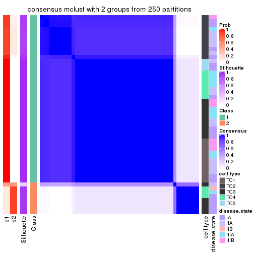</p>

</div>
<div id='tab-CV-mclust-consensus-heatmap-2'>
<pre><code class="r">consensus_heatmap(res, k = 3)
</code></pre>

<p>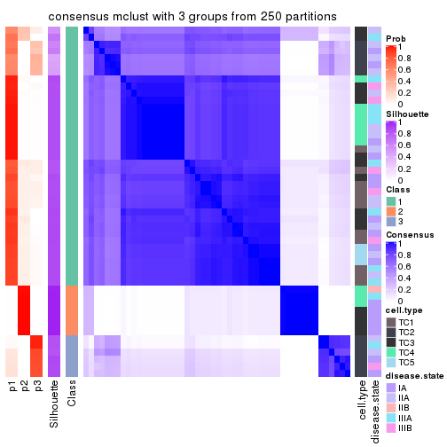</p>

</div>
<div id='tab-CV-mclust-consensus-heatmap-3'>
<pre><code class="r">consensus_heatmap(res, k = 4)
</code></pre>

<p>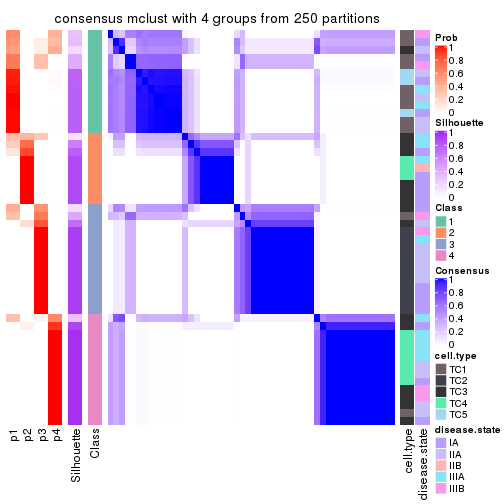</p>

</div>
<div id='tab-CV-mclust-consensus-heatmap-4'>
<pre><code class="r">consensus_heatmap(res, k = 5)
</code></pre>

<p>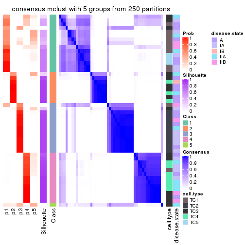</p>

</div>
<div id='tab-CV-mclust-consensus-heatmap-5'>
<pre><code class="r">consensus_heatmap(res, k = 6)
</code></pre>

<p>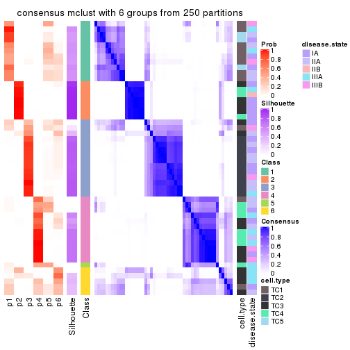</p>

</div>
</div>

Heatmaps for the membership of samples in all partitions to see how consistent they are:


<script>
$( function() {
	$( '#tabs-CV-mclust-membership-heatmap' ).tabs();
} );
</script>
<div id='tabs-CV-mclust-membership-heatmap'>
<ul>
<li><a href='#tab-CV-mclust-membership-heatmap-1'>k = 2</a></li>
<li><a href='#tab-CV-mclust-membership-heatmap-2'>k = 3</a></li>
<li><a href='#tab-CV-mclust-membership-heatmap-3'>k = 4</a></li>
<li><a href='#tab-CV-mclust-membership-heatmap-4'>k = 5</a></li>
<li><a href='#tab-CV-mclust-membership-heatmap-5'>k = 6</a></li>
</ul>
<div id='tab-CV-mclust-membership-heatmap-1'>
<pre><code class="r">membership_heatmap(res, k = 2)
</code></pre>

<p>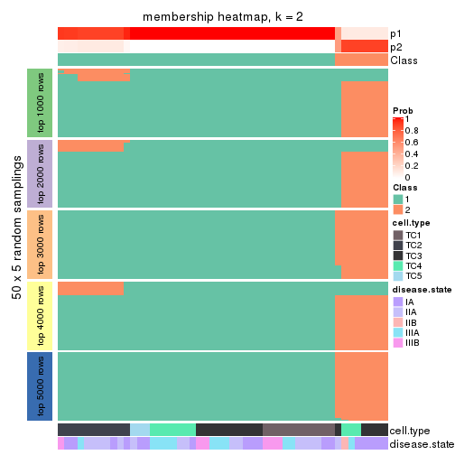</p>

</div>
<div id='tab-CV-mclust-membership-heatmap-2'>
<pre><code class="r">membership_heatmap(res, k = 3)
</code></pre>

<p>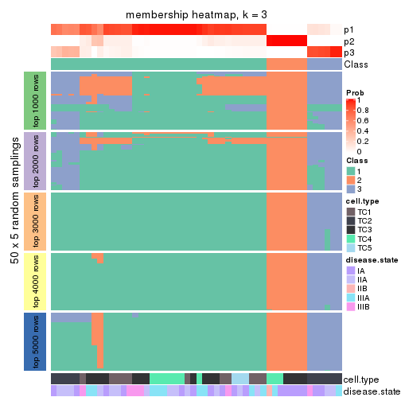</p>

</div>
<div id='tab-CV-mclust-membership-heatmap-3'>
<pre><code class="r">membership_heatmap(res, k = 4)
</code></pre>

<p>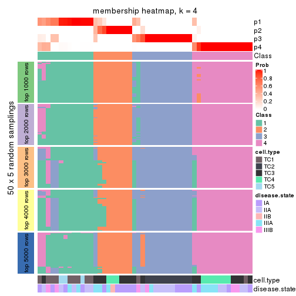</p>

</div>
<div id='tab-CV-mclust-membership-heatmap-4'>
<pre><code class="r">membership_heatmap(res, k = 5)
</code></pre>

<p>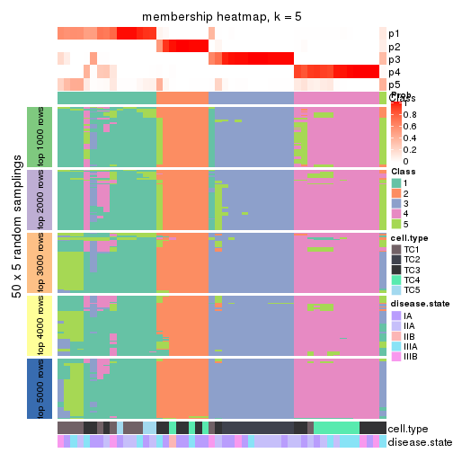</p>

</div>
<div id='tab-CV-mclust-membership-heatmap-5'>
<pre><code class="r">membership_heatmap(res, k = 6)
</code></pre>

<p>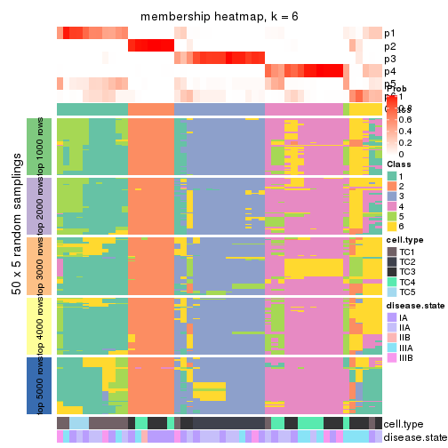</p>

</div>
</div>

As soon as we have had the classes for columns, we can look for signatures
which are significantly different between classes which can be candidate marks
for certain classes. Following are the heatmaps for signatures.


Signature heatmaps where rows are scaled:


<script>
$( function() {
	$( '#tabs-CV-mclust-get-signatures' ).tabs();
} );
</script>
<div id='tabs-CV-mclust-get-signatures'>
<ul>
<li><a href='#tab-CV-mclust-get-signatures-1'>k = 2</a></li>
<li><a href='#tab-CV-mclust-get-signatures-2'>k = 3</a></li>
<li><a href='#tab-CV-mclust-get-signatures-3'>k = 4</a></li>
<li><a href='#tab-CV-mclust-get-signatures-4'>k = 5</a></li>
<li><a href='#tab-CV-mclust-get-signatures-5'>k = 6</a></li>
</ul>
<div id='tab-CV-mclust-get-signatures-1'>
<pre><code class="r">get_signatures(res, k = 2)
</code></pre>

<p>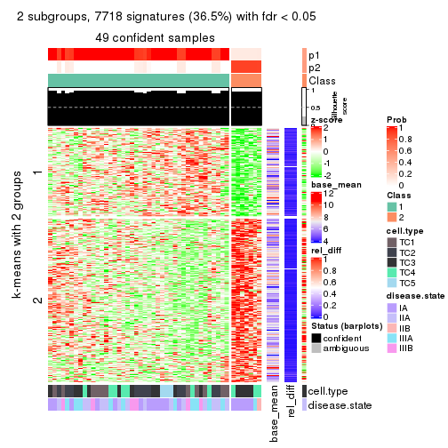</p>

</div>
<div id='tab-CV-mclust-get-signatures-2'>
<pre><code class="r">get_signatures(res, k = 3)
</code></pre>

<p>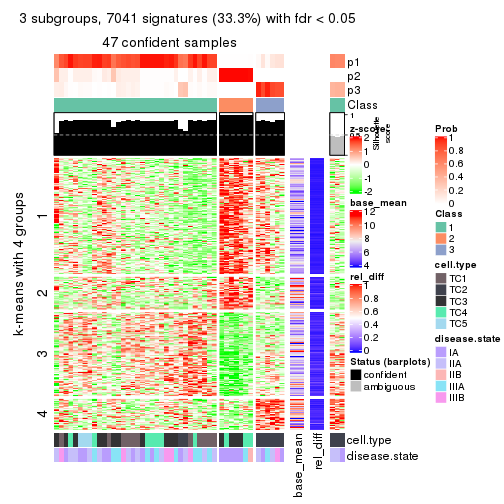</p>

</div>
<div id='tab-CV-mclust-get-signatures-3'>
<pre><code class="r">get_signatures(res, k = 4)
</code></pre>

<p>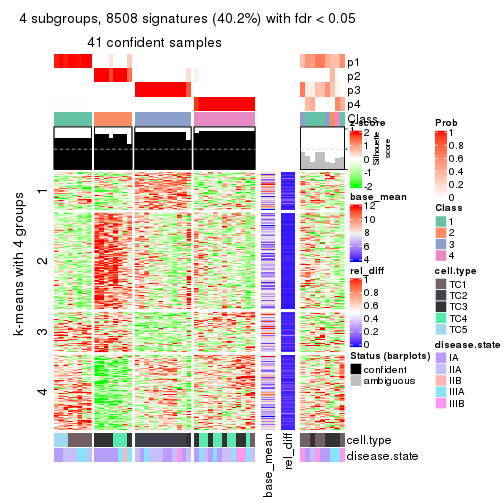</p>

</div>
<div id='tab-CV-mclust-get-signatures-4'>
<pre><code class="r">get_signatures(res, k = 5)
</code></pre>

<p>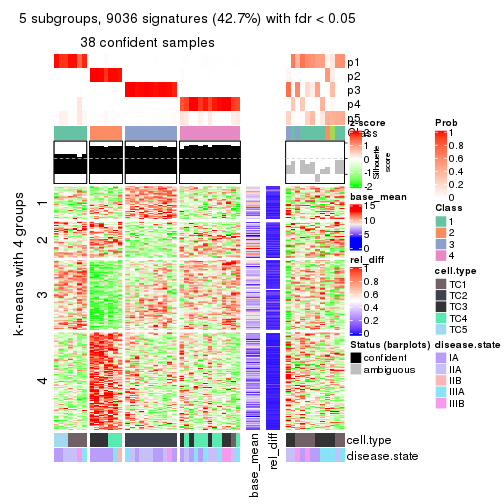</p>

</div>
<div id='tab-CV-mclust-get-signatures-5'>
<pre><code class="r">get_signatures(res, k = 6)
</code></pre>

<p>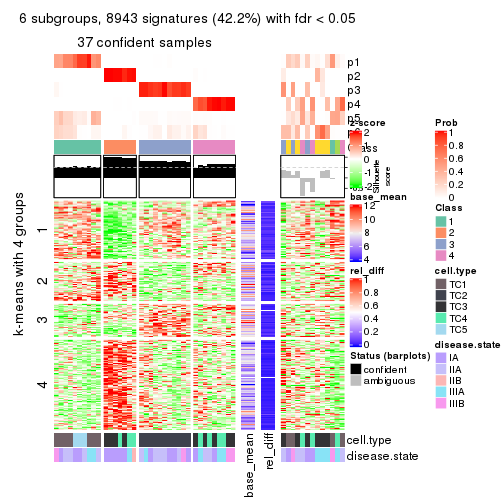</p>

</div>
</div>


Signature heatmaps where rows are not scaled:


<script>
$( function() {
	$( '#tabs-CV-mclust-get-signatures-no-scale' ).tabs();
} );
</script>
<div id='tabs-CV-mclust-get-signatures-no-scale'>
<ul>
<li><a href='#tab-CV-mclust-get-signatures-no-scale-1'>k = 2</a></li>
<li><a href='#tab-CV-mclust-get-signatures-no-scale-2'>k = 3</a></li>
<li><a href='#tab-CV-mclust-get-signatures-no-scale-3'>k = 4</a></li>
<li><a href='#tab-CV-mclust-get-signatures-no-scale-4'>k = 5</a></li>
<li><a href='#tab-CV-mclust-get-signatures-no-scale-5'>k = 6</a></li>
</ul>
<div id='tab-CV-mclust-get-signatures-no-scale-1'>
<pre><code class="r">get_signatures(res, k = 2, scale_rows = FALSE)
</code></pre>

<p>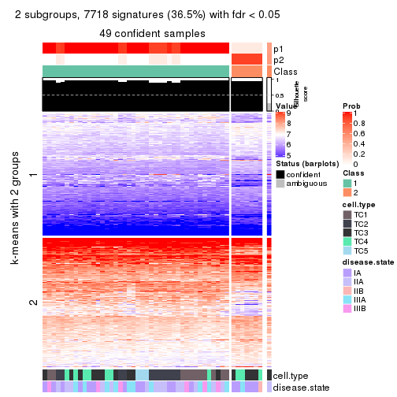</p>

</div>
<div id='tab-CV-mclust-get-signatures-no-scale-2'>
<pre><code class="r">get_signatures(res, k = 3, scale_rows = FALSE)
</code></pre>

<p>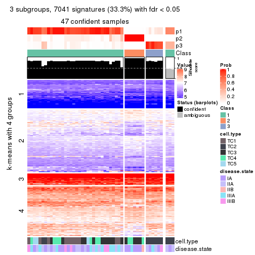</p>

</div>
<div id='tab-CV-mclust-get-signatures-no-scale-3'>
<pre><code class="r">get_signatures(res, k = 4, scale_rows = FALSE)
</code></pre>

<p>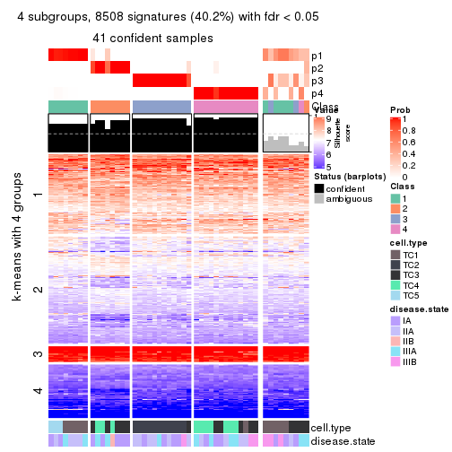</p>

</div>
<div id='tab-CV-mclust-get-signatures-no-scale-4'>
<pre><code class="r">get_signatures(res, k = 5, scale_rows = FALSE)
</code></pre>

<p>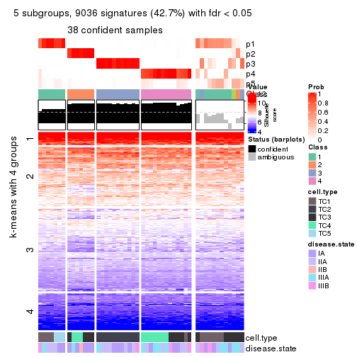</p>

</div>
<div id='tab-CV-mclust-get-signatures-no-scale-5'>
<pre><code class="r">get_signatures(res, k = 6, scale_rows = FALSE)
</code></pre>

<p>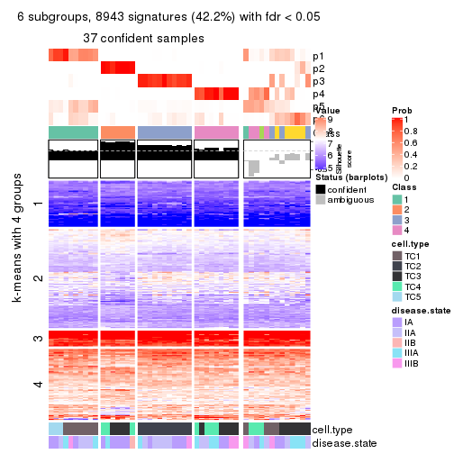</p>

</div>
</div>


Compare the overlap of signatures from different k:

```r
compare_signatures(res)
```

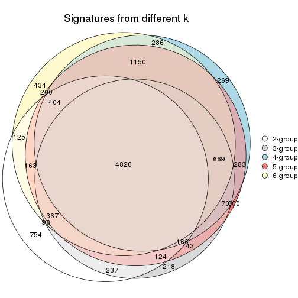

`get_signature()` returns a data frame invisibly. TO get the list of signatures, the function
call should be assigned to a variable explicitly. In following code, if `plot` argument is set
to `FALSE`, no heatmap is plotted while only the differential analysis is performed.

```r
# code only for demonstration
tb = get_signature(res, k = ..., plot = FALSE)
```

An example of the output of `tb` is:

```
#>   which_row         fdr    mean_1    mean_2 scaled_mean_1 scaled_mean_2 km
#> 1        38 0.042760348  8.373488  9.131774    -0.5533452     0.5164555  1
#> 2        40 0.018707592  7.106213  8.469186    -0.6173731     0.5762149  1
#> 3        55 0.019134737 10.221463 11.207825    -0.6159697     0.5749050  1
#> 4        59 0.006059896  5.921854  7.869574    -0.6899429     0.6439467  1
#> 5        60 0.018055526  8.928898 10.211722    -0.6204761     0.5791110  1
#> 6        98 0.009384629 15.714769 14.887706     0.6635654    -0.6193277  2
...
```

The columns in `tb` are:

1. `which_row`: row indices corresponding to the input matrix.
2. `fdr`: FDR for the differential test. 
3. `mean_x`: The mean value in group x.
4. `scaled_mean_x`: The mean value in group x after rows are scaled.
5. `km`: Row groups if k-means clustering is applied to rows.


UMAP plot which shows how samples are separated.


<script>
$( function() {
	$( '#tabs-CV-mclust-dimension-reduction' ).tabs();
} );
</script>
<div id='tabs-CV-mclust-dimension-reduction'>
<ul>
<li><a href='#tab-CV-mclust-dimension-reduction-1'>k = 2</a></li>
<li><a href='#tab-CV-mclust-dimension-reduction-2'>k = 3</a></li>
<li><a href='#tab-CV-mclust-dimension-reduction-3'>k = 4</a></li>
<li><a href='#tab-CV-mclust-dimension-reduction-4'>k = 5</a></li>
<li><a href='#tab-CV-mclust-dimension-reduction-5'>k = 6</a></li>
</ul>
<div id='tab-CV-mclust-dimension-reduction-1'>
<pre><code class="r">dimension_reduction(res, k = 2, method = &quot;UMAP&quot;)
</code></pre>

<p>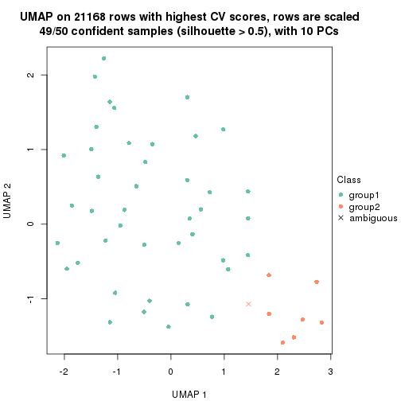</p>

</div>
<div id='tab-CV-mclust-dimension-reduction-2'>
<pre><code class="r">dimension_reduction(res, k = 3, method = &quot;UMAP&quot;)
</code></pre>

<p>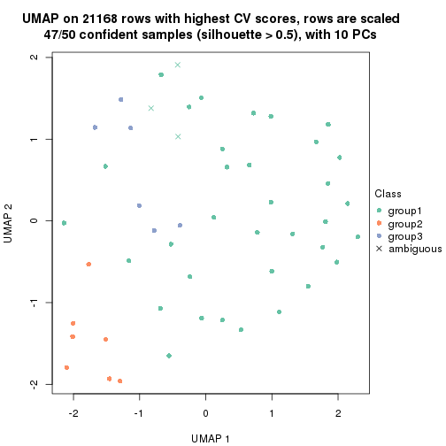</p>

</div>
<div id='tab-CV-mclust-dimension-reduction-3'>
<pre><code class="r">dimension_reduction(res, k = 4, method = &quot;UMAP&quot;)
</code></pre>

<p>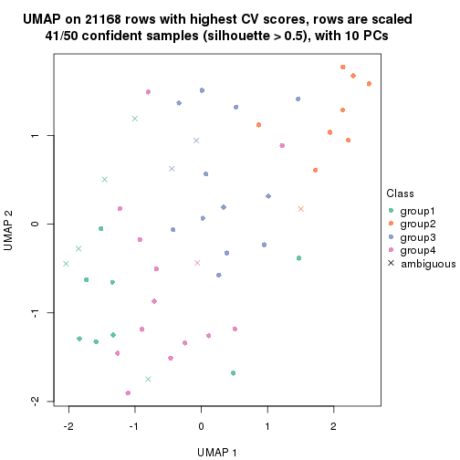</p>

</div>
<div id='tab-CV-mclust-dimension-reduction-4'>
<pre><code class="r">dimension_reduction(res, k = 5, method = &quot;UMAP&quot;)
</code></pre>

<p>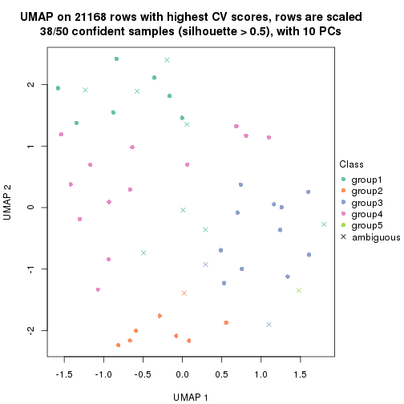</p>

</div>
<div id='tab-CV-mclust-dimension-reduction-5'>
<pre><code class="r">dimension_reduction(res, k = 6, method = &quot;UMAP&quot;)
</code></pre>

<p>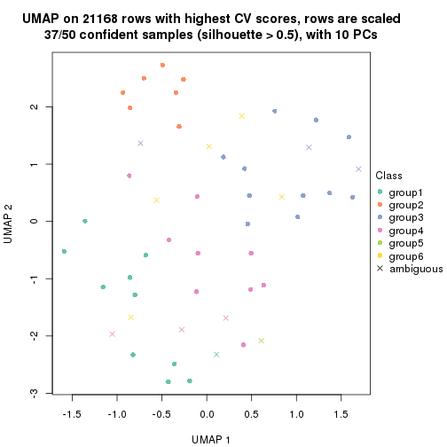</p>

</div>
</div>


Following heatmap shows how subgroups are split when increasing `k`:

```r
collect_classes(res)
```

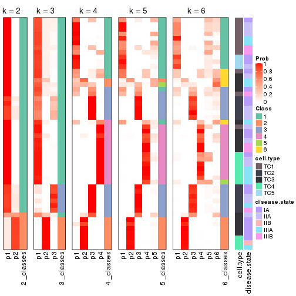


Test correlation between subgroups and known annotations. If the known
annotation is numeric, one-way ANOVA test is applied, and if the known
annotation is discrete, chi-squared contingency table test is applied.

```r
test_to_known_factors(res)
```

```
#>            n cell.type(p) disease.state(p) k
#> CV:mclust 49     7.44e-02           0.0126 2
#> CV:mclust 47     4.10e-06           0.1117 3
#> CV:mclust 41     8.64e-11           0.2522 4
#> CV:mclust 38     1.89e-10           0.3313 5
#> CV:mclust 37     5.65e-11           0.2909 6
```


If matrix rows can be associated to genes, consider to use `functional_enrichment(res,
...)` to perform function enrichment for the signature genes. See [this vignette](http://bioconductor.org/packages/devel/bioc/vignettes/cola/inst/doc/functional_enrichment.html) for more detailed explanations.


 

---------------------------------------------------


### CV:NMF**


The object with results only for a single top-value method and a single partition method 
can be extracted as:

```r
res = res_list["CV", "NMF"]
# you can also extract it by
# res = res_list["CV:NMF"]
```

A summary of `res` and all the functions that can be applied to it:

```r
res
```

```
#> A 'ConsensusPartition' object with k = 2, 3, 4, 5, 6.
#>   On a matrix with 21168 rows and 50 columns.
#>   Top rows (1000, 2000, 3000, 4000, 5000) are extracted by 'CV' method.
#>   Subgroups are detected by 'NMF' method.
#>   Performed in total 1250 partitions by row resampling.
#>   Best k for subgroups seems to be 4.
#> 
#> Following methods can be applied to this 'ConsensusPartition' object:
#>  [1] "cola_report"             "collect_classes"         "collect_plots"          
#>  [4] "collect_stats"           "colnames"                "compare_signatures"     
#>  [7] "consensus_heatmap"       "dimension_reduction"     "functional_enrichment"  
#> [10] "get_anno_col"            "get_anno"                "get_classes"            
#> [13] "get_consensus"           "get_matrix"              "get_membership"         
#> [16] "get_param"               "get_signatures"          "get_stats"              
#> [19] "is_best_k"               "is_stable_k"             "membership_heatmap"     
#> [22] "ncol"                    "nrow"                    "plot_ecdf"              
#> [25] "rownames"                "select_partition_number" "show"                   
#> [28] "suggest_best_k"          "test_to_known_factors"
```

`collect_plots()` function collects all the plots made from `res` for all `k` (number of partitions)
into one single page to provide an easy and fast comparison between different `k`.

```r
collect_plots(res)
```

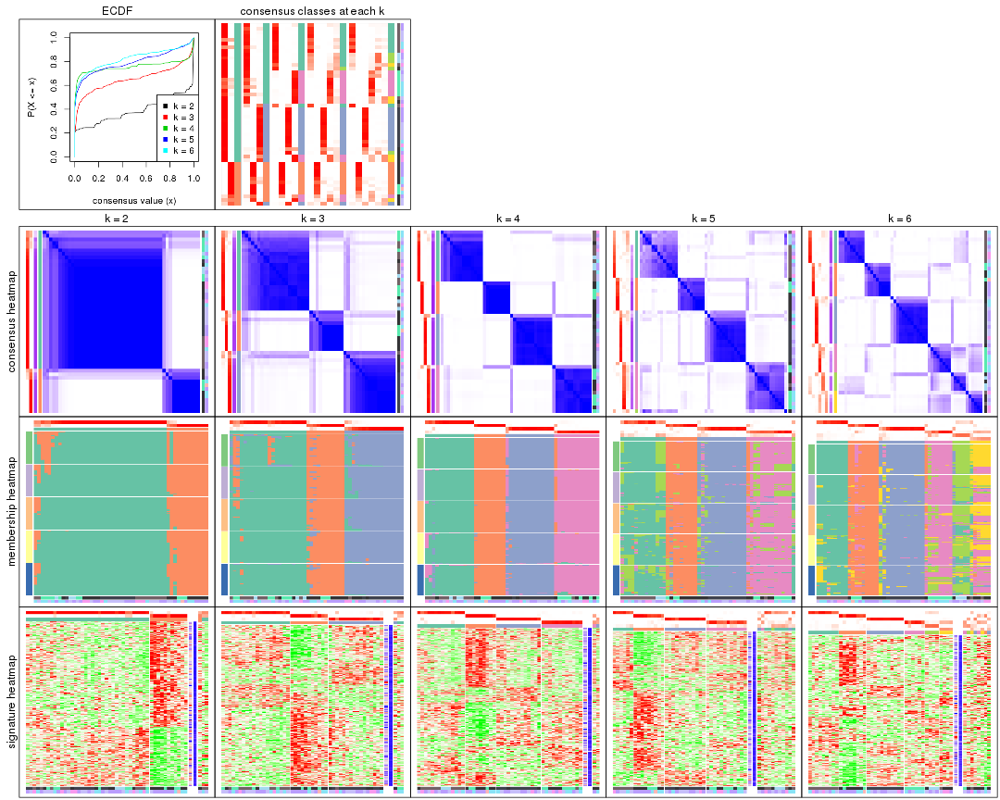

The plots are:

- The first row: a plot of the ECDF (empirical cumulative distribution
  function) curves of the consensus matrix for each `k` and the heatmap of
  predicted classes for each `k`.
- The second row: heatmaps of the consensus matrix for each `k`.
- The third row: heatmaps of the membership matrix for each `k`.
- The fouth row: heatmaps of the signatures for each `k`.

All the plots in panels can be made by individual functions and they are
plotted later in this section.

`select_partition_number()` produces several plots showing different
statistics for choosing "optimized" `k`. There are following statistics:

- ECDF curves of the consensus matrix for each `k`;
- 1-PAC. [The PAC
  score](https://en.wikipedia.org/wiki/Consensus_clustering#Over-interpretation_potential_of_consensus_clustering)
  measures the proportion of the ambiguous subgrouping.
- Mean silhouette score.
- Concordance. The mean probability of fiting the consensus class ids in all
  partitions.
- Area increased. Denote $A_k$ as the area under the ECDF curve for current
  `k`, the area increased is defined as $A_k - A_{k-1}$.
- Rand index. The percent of pairs of samples that are both in a same cluster
  or both are not in a same cluster in the partition of k and k-1.
- Jaccard index. The ratio of pairs of samples are both in a same cluster in
  the partition of k and k-1 and the pairs of samples are both in a same
  cluster in the partition k or k-1.

The detailed explanations of these statistics can be found in [the _cola_
vignette](http://bioconductor.org/packages/devel/bioc/vignettes/cola/inst/doc/cola.html#toc_13).

Generally speaking, lower PAC score, higher mean silhouette score or higher
concordance corresponds to better partition. Rand index and Jaccard index
measure how similar the current partition is compared to partition with `k-1`.
If they are too similar, we won't accept `k` is better than `k-1`.

```r
select_partition_number(res)
```

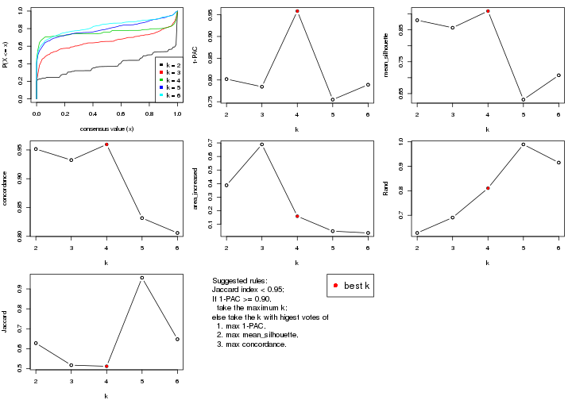

The numeric values for all these statistics can be obtained by `get_stats()`.

```r
get_stats(res)
```

```
#>   k 1-PAC mean_silhouette concordance area_increased  Rand Jaccard
#> 2 2 0.802           0.880       0.952         0.3875 0.628   0.628
#> 3 3 0.784           0.857       0.932         0.6889 0.691   0.517
#> 4 4 0.958           0.909       0.960         0.1593 0.811   0.512
#> 5 5 0.755           0.631       0.832         0.0493 0.989   0.956
#> 6 6 0.789           0.707       0.806         0.0360 0.915   0.647
```

`suggest_best_k()` suggests the best $k$ based on these statistics. The rules are as follows:

- All $k$ with Jaccard index larger than 0.95 are removed because increasing
  $k$ does not provide enough extra information. If all $k$ are removed, it is
  marked as no subgroup is detected.
- For all $k$ with 1-PAC score larger than 0.9, the maximal $k$ is taken as
  the best $k$, and other $k$ are marked as optional $k$.
- If it does not fit the second rule. The $k$ with the maximal vote of the
  highest 1-PAC score, highest mean silhouette, and highest concordance is
  taken as the best $k$.

```r
suggest_best_k(res)
```

```
#> [1] 4
```


Following shows the table of the partitions (You need to click the **show/hide
code output** link to see it). The membership matrix (columns with name `p*`)
is inferred by
[`clue::cl_consensus()`](https://www.rdocumentation.org/link/cl_consensus?package=clue)
function with the `SE` method. Basically the value in the membership matrix
represents the probability to belong to a certain group. The finall class
label for an item is determined with the group with highest probability it
belongs to.

In `get_classes()` function, the entropy is calculated from the membership
matrix and the silhouette score is calculated from the consensus matrix.


<script>
$( function() {
	$( '#tabs-CV-NMF-get-classes' ).tabs();
} );
</script>
<div id='tabs-CV-NMF-get-classes'>
<ul>
<li><a href='#tab-CV-NMF-get-classes-1'>k = 2</a></li>
<li><a href='#tab-CV-NMF-get-classes-2'>k = 3</a></li>
<li><a href='#tab-CV-NMF-get-classes-3'>k = 4</a></li>
<li><a href='#tab-CV-NMF-get-classes-4'>k = 5</a></li>
<li><a href='#tab-CV-NMF-get-classes-5'>k = 6</a></li>
</ul>

<div id='tab-CV-NMF-get-classes-1'>
<p><a id='tab-CV-NMF-get-classes-1-a' style='color:#0366d6' href='#'>show/hide code output</a></p>
<pre><code class="r">cbind(get_classes(res, k = 2), get_membership(res, k = 2))
</code></pre>

<pre><code>#&gt;          class entropy silhouette    p1    p2
#&gt; GSM63448     1  0.0000      0.951 1.000 0.000
#&gt; GSM63449     1  0.0000      0.951 1.000 0.000
#&gt; GSM63423     1  0.0000      0.951 1.000 0.000
#&gt; GSM63425     1  0.0000      0.951 1.000 0.000
#&gt; GSM63437     1  0.0000      0.951 1.000 0.000
#&gt; GSM63453     1  0.9815      0.243 0.580 0.420
#&gt; GSM63431     1  0.0000      0.951 1.000 0.000
#&gt; GSM63450     1  0.9710      0.280 0.600 0.400
#&gt; GSM63428     1  0.0000      0.951 1.000 0.000
#&gt; GSM63432     1  0.0000      0.951 1.000 0.000
#&gt; GSM63458     1  0.0000      0.951 1.000 0.000
#&gt; GSM63434     1  0.0000      0.951 1.000 0.000
#&gt; GSM63435     1  0.0000      0.951 1.000 0.000
#&gt; GSM63442     1  0.0000      0.951 1.000 0.000
#&gt; GSM63451     1  0.0376      0.948 0.996 0.004
#&gt; GSM63422     1  0.0000      0.951 1.000 0.000
#&gt; GSM63438     1  0.0000      0.951 1.000 0.000
#&gt; GSM63439     1  0.0000      0.951 1.000 0.000
#&gt; GSM63461     1  0.0000      0.951 1.000 0.000
#&gt; GSM63463     1  0.0000      0.951 1.000 0.000
#&gt; GSM63430     1  0.0000      0.951 1.000 0.000
#&gt; GSM63446     1  0.0000      0.951 1.000 0.000
#&gt; GSM63429     1  0.0000      0.951 1.000 0.000
#&gt; GSM63445     1  0.0000      0.951 1.000 0.000
#&gt; GSM63447     2  0.6531      0.772 0.168 0.832
#&gt; GSM63459     2  0.0000      0.923 0.000 1.000
#&gt; GSM63464     2  0.0000      0.923 0.000 1.000
#&gt; GSM63469     2  0.0000      0.923 0.000 1.000
#&gt; GSM63470     2  0.0000      0.923 0.000 1.000
#&gt; GSM63436     1  0.0000      0.951 1.000 0.000
#&gt; GSM63443     2  0.7528      0.715 0.216 0.784
#&gt; GSM63465     2  0.9635      0.339 0.388 0.612
#&gt; GSM63444     2  0.0000      0.923 0.000 1.000
#&gt; GSM63456     2  0.0000      0.923 0.000 1.000
#&gt; GSM63462     1  0.0376      0.949 0.996 0.004
#&gt; GSM63424     1  0.0000      0.951 1.000 0.000
#&gt; GSM63440     1  0.0000      0.951 1.000 0.000
#&gt; GSM63433     1  0.0000      0.951 1.000 0.000
#&gt; GSM63466     2  0.0000      0.923 0.000 1.000
#&gt; GSM63426     1  0.0000      0.951 1.000 0.000
#&gt; GSM63468     1  0.8386      0.634 0.732 0.268
#&gt; GSM63452     2  0.0000      0.923 0.000 1.000
#&gt; GSM63441     1  0.6623      0.776 0.828 0.172
#&gt; GSM63454     1  0.8144      0.661 0.748 0.252
#&gt; GSM63455     1  0.1414      0.937 0.980 0.020
#&gt; GSM63460     2  0.0000      0.923 0.000 1.000
#&gt; GSM63467     1  0.3584      0.895 0.932 0.068
#&gt; GSM63421     1  0.0000      0.951 1.000 0.000
#&gt; GSM63427     1  0.2423      0.921 0.960 0.040
#&gt; GSM63457     1  0.0000      0.951 1.000 0.000
</code></pre>

<script>
$('#tab-CV-NMF-get-classes-1-a').parent().next().next().hide();
$('#tab-CV-NMF-get-classes-1-a').click(function(){
  $('#tab-CV-NMF-get-classes-1-a').parent().next().next().toggle();
  return(false);
});
</script>
</div>

<div id='tab-CV-NMF-get-classes-2'>
<p><a id='tab-CV-NMF-get-classes-2-a' style='color:#0366d6' href='#'>show/hide code output</a></p>
<pre><code class="r">cbind(get_classes(res, k = 3), get_membership(res, k = 3))
</code></pre>

<pre><code>#&gt;          class entropy silhouette    p1    p2    p3
#&gt; GSM63448     1  0.0747      0.923 0.984 0.000 0.016
#&gt; GSM63449     1  0.3752      0.818 0.856 0.000 0.144
#&gt; GSM63423     1  0.1289      0.915 0.968 0.000 0.032
#&gt; GSM63425     1  0.1031      0.920 0.976 0.000 0.024
#&gt; GSM63437     1  0.0592      0.923 0.988 0.000 0.012
#&gt; GSM63453     1  0.0848      0.923 0.984 0.008 0.008
#&gt; GSM63431     1  0.0424      0.924 0.992 0.000 0.008
#&gt; GSM63450     1  0.3500      0.841 0.880 0.116 0.004
#&gt; GSM63428     1  0.0747      0.922 0.984 0.000 0.016
#&gt; GSM63432     3  0.5650      0.591 0.312 0.000 0.688
#&gt; GSM63458     1  0.0000      0.924 1.000 0.000 0.000
#&gt; GSM63434     3  0.0000      0.921 0.000 0.000 1.000
#&gt; GSM63435     3  0.0237      0.921 0.004 0.000 0.996
#&gt; GSM63442     3  0.0892      0.917 0.020 0.000 0.980
#&gt; GSM63451     3  0.0000      0.921 0.000 0.000 1.000
#&gt; GSM63422     3  0.0237      0.921 0.004 0.000 0.996
#&gt; GSM63438     3  0.0000      0.921 0.000 0.000 1.000
#&gt; GSM63439     3  0.0000      0.921 0.000 0.000 1.000
#&gt; GSM63461     3  0.0424      0.919 0.008 0.000 0.992
#&gt; GSM63463     3  0.0237      0.921 0.004 0.000 0.996
#&gt; GSM63430     3  0.0000      0.921 0.000 0.000 1.000
#&gt; GSM63446     3  0.0000      0.921 0.000 0.000 1.000
#&gt; GSM63429     1  0.1289      0.916 0.968 0.000 0.032
#&gt; GSM63445     3  0.1643      0.904 0.044 0.000 0.956
#&gt; GSM63447     2  0.5201      0.639 0.236 0.760 0.004
#&gt; GSM63459     2  0.0000      0.922 0.000 1.000 0.000
#&gt; GSM63464     2  0.0000      0.922 0.000 1.000 0.000
#&gt; GSM63469     2  0.0000      0.922 0.000 1.000 0.000
#&gt; GSM63470     2  0.0000      0.922 0.000 1.000 0.000
#&gt; GSM63436     1  0.0237      0.924 0.996 0.000 0.004
#&gt; GSM63443     3  0.1620      0.904 0.012 0.024 0.964
#&gt; GSM63465     2  0.2550      0.893 0.024 0.936 0.040
#&gt; GSM63444     2  0.4002      0.804 0.000 0.840 0.160
#&gt; GSM63456     2  0.5327      0.641 0.000 0.728 0.272
#&gt; GSM63462     3  0.4095      0.843 0.064 0.056 0.880
#&gt; GSM63424     3  0.6260      0.259 0.448 0.000 0.552
#&gt; GSM63440     3  0.2711      0.865 0.088 0.000 0.912
#&gt; GSM63433     1  0.0829      0.923 0.984 0.004 0.012
#&gt; GSM63466     2  0.0000      0.922 0.000 1.000 0.000
#&gt; GSM63426     1  0.0592      0.923 0.988 0.000 0.012
#&gt; GSM63468     1  0.4840      0.782 0.816 0.168 0.016
#&gt; GSM63452     2  0.0000      0.922 0.000 1.000 0.000
#&gt; GSM63441     1  0.3276      0.880 0.908 0.068 0.024
#&gt; GSM63454     1  0.6608      0.462 0.628 0.356 0.016
#&gt; GSM63455     1  0.0829      0.923 0.984 0.004 0.012
#&gt; GSM63460     2  0.0000      0.922 0.000 1.000 0.000
#&gt; GSM63467     1  0.8352      0.370 0.568 0.332 0.100
#&gt; GSM63421     1  0.0000      0.924 1.000 0.000 0.000
#&gt; GSM63427     1  0.0475      0.924 0.992 0.004 0.004
#&gt; GSM63457     1  0.0000      0.924 1.000 0.000 0.000
</code></pre>

<script>
$('#tab-CV-NMF-get-classes-2-a').parent().next().next().hide();
$('#tab-CV-NMF-get-classes-2-a').click(function(){
  $('#tab-CV-NMF-get-classes-2-a').parent().next().next().toggle();
  return(false);
});
</script>
</div>

<div id='tab-CV-NMF-get-classes-3'>
<p><a id='tab-CV-NMF-get-classes-3-a' style='color:#0366d6' href='#'>show/hide code output</a></p>
<pre><code class="r">cbind(get_classes(res, k = 4), get_membership(res, k = 4))
</code></pre>

<pre><code>#&gt;          class entropy silhouette    p1    p2    p3    p4
#&gt; GSM63448     1  0.2530      0.872 0.888 0.000 0.000 0.112
#&gt; GSM63449     1  0.0524      0.941 0.988 0.000 0.008 0.004
#&gt; GSM63423     1  0.0000      0.947 1.000 0.000 0.000 0.000
#&gt; GSM63425     4  0.0469      0.942 0.012 0.000 0.000 0.988
#&gt; GSM63437     1  0.0188      0.948 0.996 0.000 0.000 0.004
#&gt; GSM63453     1  0.0188      0.948 0.996 0.000 0.000 0.004
#&gt; GSM63431     1  0.0469      0.948 0.988 0.000 0.000 0.012
#&gt; GSM63450     1  0.0376      0.948 0.992 0.004 0.000 0.004
#&gt; GSM63428     1  0.0188      0.945 0.996 0.000 0.004 0.000
#&gt; GSM63432     1  0.4188      0.674 0.752 0.000 0.244 0.004
#&gt; GSM63458     1  0.3649      0.757 0.796 0.000 0.000 0.204
#&gt; GSM63434     3  0.0336      0.952 0.000 0.000 0.992 0.008
#&gt; GSM63435     3  0.0000      0.951 0.000 0.000 1.000 0.000
#&gt; GSM63442     3  0.0188      0.950 0.004 0.000 0.996 0.000
#&gt; GSM63451     3  0.0000      0.951 0.000 0.000 1.000 0.000
#&gt; GSM63422     3  0.0336      0.952 0.000 0.000 0.992 0.008
#&gt; GSM63438     3  0.0469      0.951 0.000 0.000 0.988 0.012
#&gt; GSM63439     3  0.0336      0.952 0.000 0.000 0.992 0.008
#&gt; GSM63461     3  0.0336      0.952 0.000 0.000 0.992 0.008
#&gt; GSM63463     3  0.0000      0.951 0.000 0.000 1.000 0.000
#&gt; GSM63430     3  0.0188      0.952 0.000 0.000 0.996 0.004
#&gt; GSM63446     3  0.0592      0.948 0.000 0.000 0.984 0.016
#&gt; GSM63429     4  0.0188      0.944 0.000 0.000 0.004 0.996
#&gt; GSM63445     3  0.0376      0.952 0.004 0.000 0.992 0.004
#&gt; GSM63447     4  0.4985      0.129 0.000 0.468 0.000 0.532
#&gt; GSM63459     2  0.0000      0.992 0.000 1.000 0.000 0.000
#&gt; GSM63464     2  0.0000      0.992 0.000 1.000 0.000 0.000
#&gt; GSM63469     2  0.0000      0.992 0.000 1.000 0.000 0.000
#&gt; GSM63470     2  0.0000      0.992 0.000 1.000 0.000 0.000
#&gt; GSM63436     1  0.0921      0.941 0.972 0.000 0.000 0.028
#&gt; GSM63443     3  0.2040      0.902 0.012 0.048 0.936 0.004
#&gt; GSM63465     4  0.0937      0.935 0.000 0.012 0.012 0.976
#&gt; GSM63444     2  0.0188      0.989 0.000 0.996 0.004 0.000
#&gt; GSM63456     2  0.1474      0.943 0.000 0.948 0.052 0.000
#&gt; GSM63462     3  0.5682      0.137 0.000 0.024 0.520 0.456
#&gt; GSM63424     4  0.0469      0.940 0.000 0.000 0.012 0.988
#&gt; GSM63440     4  0.0469      0.940 0.000 0.000 0.012 0.988
#&gt; GSM63433     4  0.1211      0.928 0.040 0.000 0.000 0.960
#&gt; GSM63466     2  0.0000      0.992 0.000 1.000 0.000 0.000
#&gt; GSM63426     4  0.1118      0.931 0.036 0.000 0.000 0.964
#&gt; GSM63468     4  0.0376      0.944 0.004 0.000 0.004 0.992
#&gt; GSM63452     2  0.0000      0.992 0.000 1.000 0.000 0.000
#&gt; GSM63441     4  0.0188      0.944 0.000 0.000 0.004 0.996
#&gt; GSM63454     4  0.0188      0.944 0.000 0.000 0.004 0.996
#&gt; GSM63455     4  0.0921      0.936 0.028 0.000 0.000 0.972
#&gt; GSM63460     2  0.0000      0.992 0.000 1.000 0.000 0.000
#&gt; GSM63467     4  0.0927      0.940 0.016 0.008 0.000 0.976
#&gt; GSM63421     1  0.0469      0.948 0.988 0.000 0.000 0.012
#&gt; GSM63427     1  0.0336      0.949 0.992 0.000 0.000 0.008
#&gt; GSM63457     1  0.0469      0.948 0.988 0.000 0.000 0.012
</code></pre>

<script>
$('#tab-CV-NMF-get-classes-3-a').parent().next().next().hide();
$('#tab-CV-NMF-get-classes-3-a').click(function(){
  $('#tab-CV-NMF-get-classes-3-a').parent().next().next().toggle();
  return(false);
});
</script>
</div>

<div id='tab-CV-NMF-get-classes-4'>
<p><a id='tab-CV-NMF-get-classes-4-a' style='color:#0366d6' href='#'>show/hide code output</a></p>
<pre><code class="r">cbind(get_classes(res, k = 5), get_membership(res, k = 5))
</code></pre>

<pre><code>#&gt;          class entropy silhouette    p1    p2    p3    p4    p5
#&gt; GSM63448     1  0.3731      0.365 0.816 0.000 0.000 0.112 0.072
#&gt; GSM63449     1  0.1270      0.566 0.948 0.000 0.000 0.000 0.052
#&gt; GSM63423     1  0.1043      0.562 0.960 0.000 0.000 0.000 0.040
#&gt; GSM63425     4  0.3550      0.761 0.000 0.000 0.020 0.796 0.184
#&gt; GSM63437     1  0.0609      0.578 0.980 0.000 0.000 0.000 0.020
#&gt; GSM63453     1  0.3612      0.509 0.764 0.008 0.000 0.000 0.228
#&gt; GSM63431     1  0.2612      0.559 0.868 0.000 0.000 0.008 0.124
#&gt; GSM63450     1  0.4431      0.480 0.732 0.052 0.000 0.000 0.216
#&gt; GSM63428     1  0.0404      0.574 0.988 0.000 0.000 0.000 0.012
#&gt; GSM63432     1  0.2464      0.495 0.888 0.000 0.096 0.000 0.016
#&gt; GSM63458     1  0.6362     -0.062 0.464 0.000 0.000 0.168 0.368
#&gt; GSM63434     3  0.0703      0.904 0.000 0.000 0.976 0.000 0.024
#&gt; GSM63435     3  0.0404      0.904 0.000 0.000 0.988 0.000 0.012
#&gt; GSM63442     3  0.0451      0.906 0.004 0.000 0.988 0.000 0.008
#&gt; GSM63451     3  0.0290      0.905 0.000 0.000 0.992 0.000 0.008
#&gt; GSM63422     3  0.0000      0.906 0.000 0.000 1.000 0.000 0.000
#&gt; GSM63438     3  0.0451      0.904 0.000 0.000 0.988 0.004 0.008
#&gt; GSM63439     3  0.0566      0.903 0.000 0.000 0.984 0.004 0.012
#&gt; GSM63461     3  0.0451      0.905 0.004 0.000 0.988 0.000 0.008
#&gt; GSM63463     3  0.0404      0.904 0.000 0.000 0.988 0.000 0.012
#&gt; GSM63430     3  0.1571      0.880 0.004 0.000 0.936 0.000 0.060
#&gt; GSM63446     3  0.0771      0.900 0.000 0.000 0.976 0.004 0.020
#&gt; GSM63429     4  0.3203      0.768 0.000 0.000 0.012 0.820 0.168
#&gt; GSM63445     3  0.3419      0.759 0.016 0.000 0.804 0.000 0.180
#&gt; GSM63447     4  0.5476      0.151 0.008 0.440 0.000 0.508 0.044
#&gt; GSM63459     2  0.0000      0.916 0.000 1.000 0.000 0.000 0.000
#&gt; GSM63464     2  0.0404      0.915 0.000 0.988 0.000 0.000 0.012
#&gt; GSM63469     2  0.0000      0.916 0.000 1.000 0.000 0.000 0.000
#&gt; GSM63470     2  0.0000      0.916 0.000 1.000 0.000 0.000 0.000
#&gt; GSM63436     5  0.6273      0.000 0.416 0.000 0.000 0.148 0.436
#&gt; GSM63443     3  0.7069      0.313 0.164 0.048 0.516 0.000 0.272
#&gt; GSM63465     4  0.5624      0.685 0.000 0.108 0.040 0.700 0.152
#&gt; GSM63444     2  0.1893      0.895 0.000 0.928 0.048 0.024 0.000
#&gt; GSM63456     2  0.4522      0.691 0.000 0.736 0.196 0.000 0.068
#&gt; GSM63462     3  0.6089      0.450 0.000 0.004 0.584 0.244 0.168
#&gt; GSM63424     4  0.4066      0.750 0.000 0.000 0.044 0.768 0.188
#&gt; GSM63440     4  0.3995      0.751 0.000 0.000 0.044 0.776 0.180
#&gt; GSM63433     4  0.3877      0.601 0.024 0.000 0.000 0.764 0.212
#&gt; GSM63466     2  0.2149      0.889 0.000 0.916 0.000 0.048 0.036
#&gt; GSM63426     4  0.4276      0.549 0.032 0.000 0.000 0.724 0.244
#&gt; GSM63468     4  0.0609      0.787 0.000 0.000 0.000 0.980 0.020
#&gt; GSM63452     2  0.2074      0.872 0.000 0.896 0.000 0.000 0.104
#&gt; GSM63441     4  0.0162      0.786 0.000 0.000 0.000 0.996 0.004
#&gt; GSM63454     4  0.0671      0.784 0.000 0.004 0.000 0.980 0.016
#&gt; GSM63455     4  0.1851      0.763 0.000 0.000 0.000 0.912 0.088
#&gt; GSM63460     2  0.2625      0.856 0.000 0.876 0.000 0.108 0.016
#&gt; GSM63467     4  0.1430      0.772 0.000 0.000 0.004 0.944 0.052
#&gt; GSM63421     1  0.4812     -0.274 0.600 0.000 0.000 0.028 0.372
#&gt; GSM63427     1  0.5439     -0.672 0.484 0.004 0.000 0.048 0.464
#&gt; GSM63457     1  0.5352     -0.345 0.536 0.000 0.000 0.056 0.408
</code></pre>

<script>
$('#tab-CV-NMF-get-classes-4-a').parent().next().next().hide();
$('#tab-CV-NMF-get-classes-4-a').click(function(){
  $('#tab-CV-NMF-get-classes-4-a').parent().next().next().toggle();
  return(false);
});
</script>
</div>

<div id='tab-CV-NMF-get-classes-5'>
<p><a id='tab-CV-NMF-get-classes-5-a' style='color:#0366d6' href='#'>show/hide code output</a></p>
<pre><code class="r">cbind(get_classes(res, k = 6), get_membership(res, k = 6))
</code></pre>

<pre><code>#&gt;          class entropy silhouette    p1    p2    p3    p4    p5    p6
#&gt; GSM63448     1  0.2570   8.46e-01 0.892 0.000 0.000 0.036 0.032 0.040
#&gt; GSM63449     1  0.1168   8.92e-01 0.956 0.000 0.000 0.000 0.028 0.016
#&gt; GSM63423     1  0.1168   8.92e-01 0.956 0.000 0.000 0.000 0.028 0.016
#&gt; GSM63425     6  0.4860   6.89e-01 0.008 0.000 0.004 0.388 0.036 0.564
#&gt; GSM63437     1  0.0405   8.97e-01 0.988 0.000 0.000 0.004 0.008 0.000
#&gt; GSM63453     1  0.4117   7.59e-01 0.752 0.004 0.000 0.000 0.160 0.084
#&gt; GSM63431     1  0.1478   8.84e-01 0.944 0.000 0.000 0.004 0.032 0.020
#&gt; GSM63450     1  0.4225   7.56e-01 0.748 0.008 0.000 0.000 0.160 0.084
#&gt; GSM63428     1  0.0291   8.97e-01 0.992 0.000 0.000 0.000 0.004 0.004
#&gt; GSM63432     1  0.0909   8.93e-01 0.968 0.000 0.020 0.000 0.012 0.000
#&gt; GSM63458     6  0.7062   8.91e-02 0.328 0.000 0.000 0.072 0.240 0.360
#&gt; GSM63434     3  0.0665   8.96e-01 0.000 0.000 0.980 0.008 0.004 0.008
#&gt; GSM63435     3  0.0508   8.97e-01 0.000 0.000 0.984 0.004 0.000 0.012
#&gt; GSM63442     3  0.0798   8.95e-01 0.004 0.000 0.976 0.004 0.004 0.012
#&gt; GSM63451     3  0.0146   8.99e-01 0.000 0.000 0.996 0.000 0.000 0.004
#&gt; GSM63422     3  0.0717   8.94e-01 0.000 0.000 0.976 0.000 0.008 0.016
#&gt; GSM63438     3  0.0508   8.97e-01 0.000 0.000 0.984 0.004 0.000 0.012
#&gt; GSM63439     3  0.0405   8.99e-01 0.000 0.000 0.988 0.000 0.004 0.008
#&gt; GSM63461     3  0.0146   8.99e-01 0.000 0.000 0.996 0.000 0.000 0.004
#&gt; GSM63463     3  0.0146   8.99e-01 0.000 0.000 0.996 0.000 0.000 0.004
#&gt; GSM63430     3  0.2331   8.30e-01 0.000 0.000 0.888 0.000 0.032 0.080
#&gt; GSM63446     3  0.0363   8.98e-01 0.000 0.000 0.988 0.000 0.000 0.012
#&gt; GSM63429     6  0.4814   6.20e-01 0.000 0.000 0.008 0.452 0.036 0.504
#&gt; GSM63445     5  0.4540   9.92e-02 0.008 0.000 0.452 0.008 0.524 0.008
#&gt; GSM63447     4  0.6242  -8.72e-05 0.024 0.388 0.000 0.476 0.028 0.084
#&gt; GSM63459     2  0.0000   8.80e-01 0.000 1.000 0.000 0.000 0.000 0.000
#&gt; GSM63464     2  0.0146   8.79e-01 0.000 0.996 0.000 0.000 0.000 0.004
#&gt; GSM63469     2  0.0000   8.80e-01 0.000 1.000 0.000 0.000 0.000 0.000
#&gt; GSM63470     2  0.0000   8.80e-01 0.000 1.000 0.000 0.000 0.000 0.000
#&gt; GSM63436     5  0.4811   7.23e-01 0.152 0.000 0.000 0.092 0.720 0.036
#&gt; GSM63443     3  0.7402   1.27e-01 0.080 0.028 0.392 0.000 0.156 0.344
#&gt; GSM63465     6  0.6382   4.54e-01 0.000 0.168 0.024 0.388 0.004 0.416
#&gt; GSM63444     2  0.2796   8.37e-01 0.000 0.872 0.056 0.064 0.004 0.004
#&gt; GSM63456     2  0.3219   7.91e-01 0.000 0.840 0.104 0.000 0.016 0.040
#&gt; GSM63462     3  0.5995   4.60e-01 0.000 0.004 0.620 0.088 0.192 0.096
#&gt; GSM63424     6  0.5073   6.89e-01 0.000 0.000 0.036 0.368 0.028 0.568
#&gt; GSM63440     6  0.4840   6.94e-01 0.000 0.000 0.020 0.384 0.028 0.568
#&gt; GSM63433     4  0.3629   5.43e-01 0.000 0.000 0.000 0.712 0.276 0.012
#&gt; GSM63466     2  0.2613   8.06e-01 0.000 0.848 0.000 0.140 0.000 0.012
#&gt; GSM63426     4  0.4392   1.39e-01 0.004 0.000 0.000 0.504 0.476 0.016
#&gt; GSM63468     4  0.1010   6.04e-01 0.000 0.000 0.000 0.960 0.004 0.036
#&gt; GSM63452     2  0.2350   8.35e-01 0.000 0.888 0.000 0.000 0.076 0.036
#&gt; GSM63441     4  0.0603   6.21e-01 0.000 0.000 0.000 0.980 0.004 0.016
#&gt; GSM63454     4  0.0508   6.15e-01 0.000 0.004 0.000 0.984 0.000 0.012
#&gt; GSM63455     4  0.3178   5.96e-01 0.004 0.000 0.000 0.804 0.176 0.016
#&gt; GSM63460     2  0.3945   4.56e-01 0.000 0.612 0.000 0.380 0.000 0.008
#&gt; GSM63467     4  0.0862   6.32e-01 0.000 0.004 0.000 0.972 0.016 0.008
#&gt; GSM63421     5  0.4133   7.37e-01 0.236 0.000 0.000 0.032 0.720 0.012
#&gt; GSM63427     5  0.4588   7.43e-01 0.172 0.004 0.000 0.056 0.736 0.032
#&gt; GSM63457     5  0.4292   7.37e-01 0.188 0.000 0.000 0.052 0.740 0.020
</code></pre>

<script>
$('#tab-CV-NMF-get-classes-5-a').parent().next().next().hide();
$('#tab-CV-NMF-get-classes-5-a').click(function(){
  $('#tab-CV-NMF-get-classes-5-a').parent().next().next().toggle();
  return(false);
});
</script>
</div>
</div>

Heatmaps for the consensus matrix. It visualizes the probability of two
samples to be in a same group.


<script>
$( function() {
	$( '#tabs-CV-NMF-consensus-heatmap' ).tabs();
} );
</script>
<div id='tabs-CV-NMF-consensus-heatmap'>
<ul>
<li><a href='#tab-CV-NMF-consensus-heatmap-1'>k = 2</a></li>
<li><a href='#tab-CV-NMF-consensus-heatmap-2'>k = 3</a></li>
<li><a href='#tab-CV-NMF-consensus-heatmap-3'>k = 4</a></li>
<li><a href='#tab-CV-NMF-consensus-heatmap-4'>k = 5</a></li>
<li><a href='#tab-CV-NMF-consensus-heatmap-5'>k = 6</a></li>
</ul>
<div id='tab-CV-NMF-consensus-heatmap-1'>
<pre><code class="r">consensus_heatmap(res, k = 2)
</code></pre>

<p>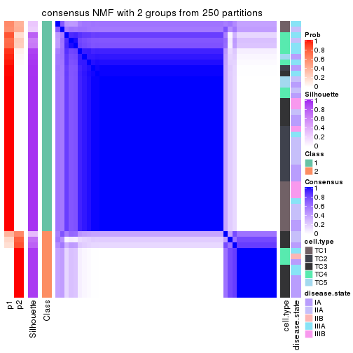</p>

</div>
<div id='tab-CV-NMF-consensus-heatmap-2'>
<pre><code class="r">consensus_heatmap(res, k = 3)
</code></pre>

<p>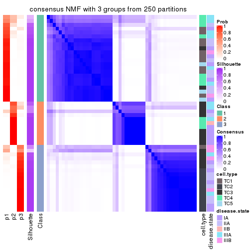</p>

</div>
<div id='tab-CV-NMF-consensus-heatmap-3'>
<pre><code class="r">consensus_heatmap(res, k = 4)
</code></pre>

<p>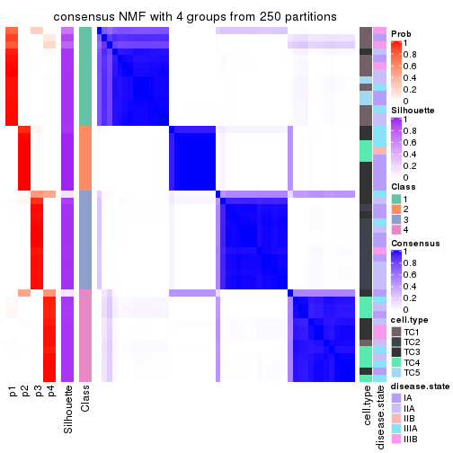</p>

</div>
<div id='tab-CV-NMF-consensus-heatmap-4'>
<pre><code class="r">consensus_heatmap(res, k = 5)
</code></pre>

<p>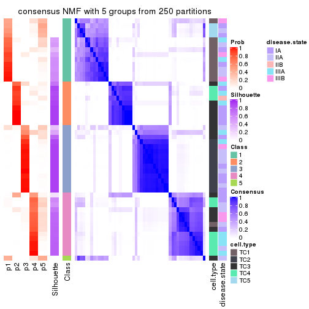</p>

</div>
<div id='tab-CV-NMF-consensus-heatmap-5'>
<pre><code class="r">consensus_heatmap(res, k = 6)
</code></pre>

<p>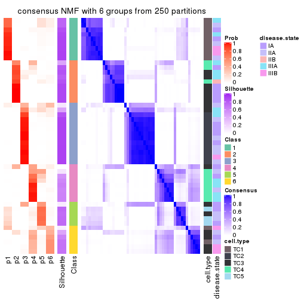</p>

</div>
</div>

Heatmaps for the membership of samples in all partitions to see how consistent they are:


<script>
$( function() {
	$( '#tabs-CV-NMF-membership-heatmap' ).tabs();
} );
</script>
<div id='tabs-CV-NMF-membership-heatmap'>
<ul>
<li><a href='#tab-CV-NMF-membership-heatmap-1'>k = 2</a></li>
<li><a href='#tab-CV-NMF-membership-heatmap-2'>k = 3</a></li>
<li><a href='#tab-CV-NMF-membership-heatmap-3'>k = 4</a></li>
<li><a href='#tab-CV-NMF-membership-heatmap-4'>k = 5</a></li>
<li><a href='#tab-CV-NMF-membership-heatmap-5'>k = 6</a></li>
</ul>
<div id='tab-CV-NMF-membership-heatmap-1'>
<pre><code class="r">membership_heatmap(res, k = 2)
</code></pre>

<p>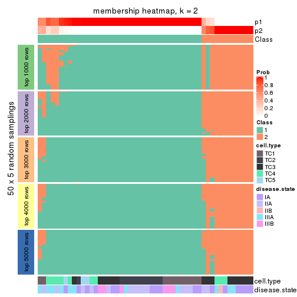</p>

</div>
<div id='tab-CV-NMF-membership-heatmap-2'>
<pre><code class="r">membership_heatmap(res, k = 3)
</code></pre>

<p>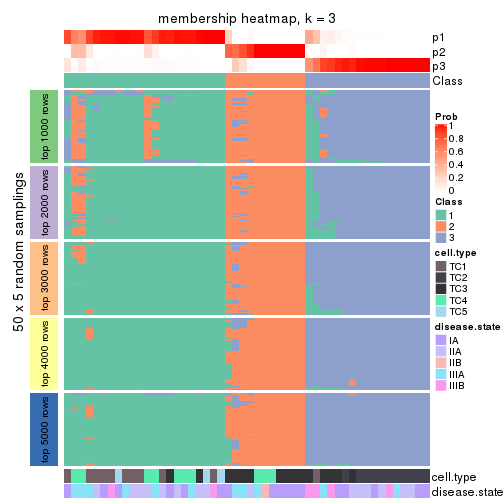</p>

</div>
<div id='tab-CV-NMF-membership-heatmap-3'>
<pre><code class="r">membership_heatmap(res, k = 4)
</code></pre>

<p>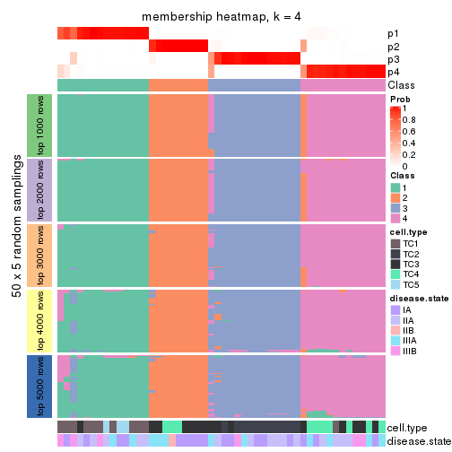</p>

</div>
<div id='tab-CV-NMF-membership-heatmap-4'>
<pre><code class="r">membership_heatmap(res, k = 5)
</code></pre>

<p>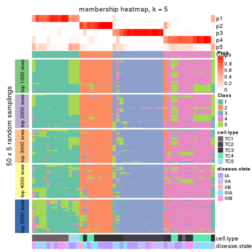</p>

</div>
<div id='tab-CV-NMF-membership-heatmap-5'>
<pre><code class="r">membership_heatmap(res, k = 6)
</code></pre>

<p>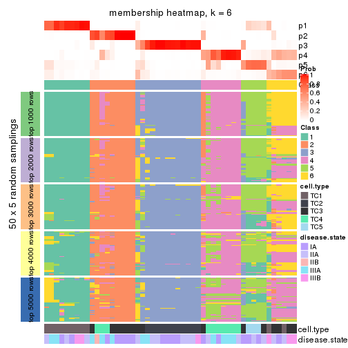</p>

</div>
</div>

As soon as we have had the classes for columns, we can look for signatures
which are significantly different between classes which can be candidate marks
for certain classes. Following are the heatmaps for signatures.


Signature heatmaps where rows are scaled:


<script>
$( function() {
	$( '#tabs-CV-NMF-get-signatures' ).tabs();
} );
</script>
<div id='tabs-CV-NMF-get-signatures'>
<ul>
<li><a href='#tab-CV-NMF-get-signatures-1'>k = 2</a></li>
<li><a href='#tab-CV-NMF-get-signatures-2'>k = 3</a></li>
<li><a href='#tab-CV-NMF-get-signatures-3'>k = 4</a></li>
<li><a href='#tab-CV-NMF-get-signatures-4'>k = 5</a></li>
<li><a href='#tab-CV-NMF-get-signatures-5'>k = 6</a></li>
</ul>
<div id='tab-CV-NMF-get-signatures-1'>
<pre><code class="r">get_signatures(res, k = 2)
</code></pre>

<p>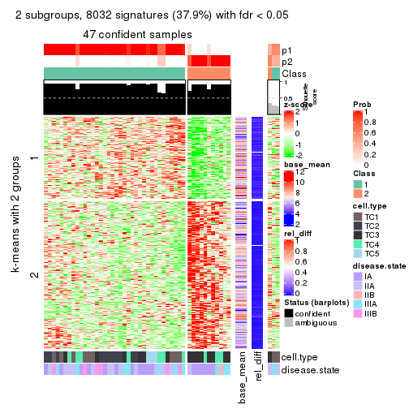</p>

</div>
<div id='tab-CV-NMF-get-signatures-2'>
<pre><code class="r">get_signatures(res, k = 3)
</code></pre>

<p>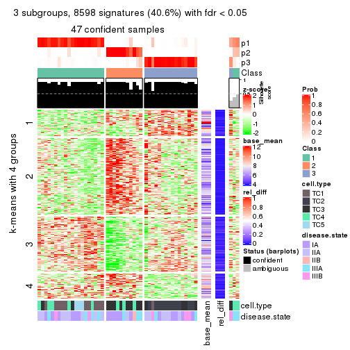</p>

</div>
<div id='tab-CV-NMF-get-signatures-3'>
<pre><code class="r">get_signatures(res, k = 4)
</code></pre>

<p>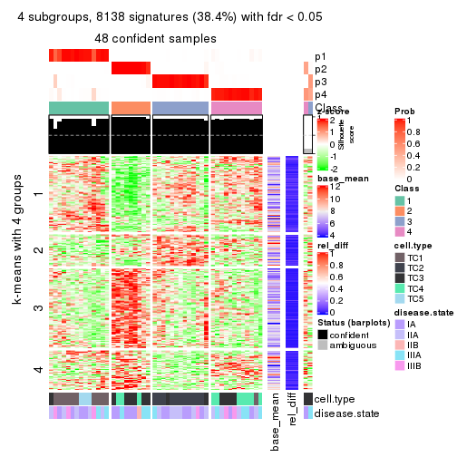</p>

</div>
<div id='tab-CV-NMF-get-signatures-4'>
<pre><code class="r">get_signatures(res, k = 5)
</code></pre>

<p>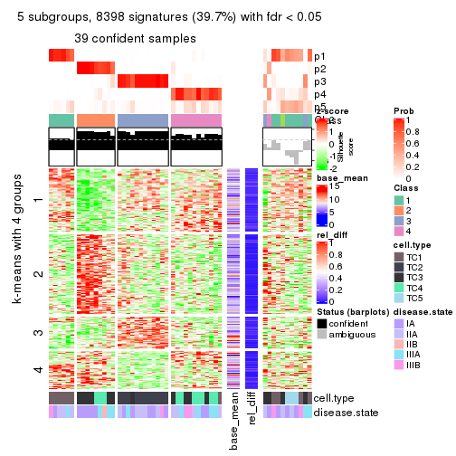</p>

</div>
<div id='tab-CV-NMF-get-signatures-5'>
<pre><code class="r">get_signatures(res, k = 6)
</code></pre>

<p>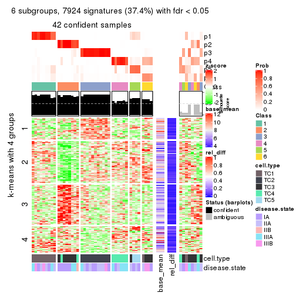</p>

</div>
</div>


Signature heatmaps where rows are not scaled:


<script>
$( function() {
	$( '#tabs-CV-NMF-get-signatures-no-scale' ).tabs();
} );
</script>
<div id='tabs-CV-NMF-get-signatures-no-scale'>
<ul>
<li><a href='#tab-CV-NMF-get-signatures-no-scale-1'>k = 2</a></li>
<li><a href='#tab-CV-NMF-get-signatures-no-scale-2'>k = 3</a></li>
<li><a href='#tab-CV-NMF-get-signatures-no-scale-3'>k = 4</a></li>
<li><a href='#tab-CV-NMF-get-signatures-no-scale-4'>k = 5</a></li>
<li><a href='#tab-CV-NMF-get-signatures-no-scale-5'>k = 6</a></li>
</ul>
<div id='tab-CV-NMF-get-signatures-no-scale-1'>
<pre><code class="r">get_signatures(res, k = 2, scale_rows = FALSE)
</code></pre>

<p>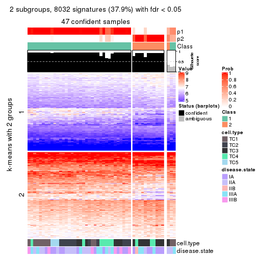</p>

</div>
<div id='tab-CV-NMF-get-signatures-no-scale-2'>
<pre><code class="r">get_signatures(res, k = 3, scale_rows = FALSE)
</code></pre>

<p>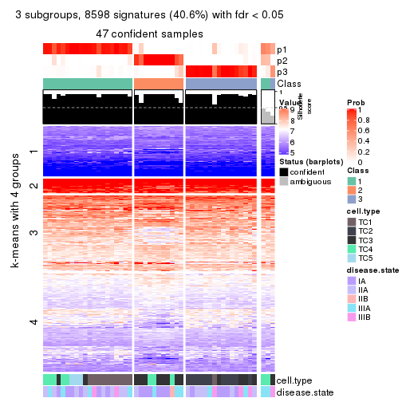</p>

</div>
<div id='tab-CV-NMF-get-signatures-no-scale-3'>
<pre><code class="r">get_signatures(res, k = 4, scale_rows = FALSE)
</code></pre>

<p>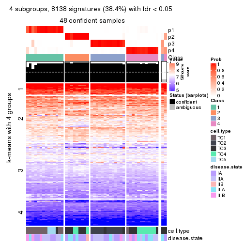</p>

</div>
<div id='tab-CV-NMF-get-signatures-no-scale-4'>
<pre><code class="r">get_signatures(res, k = 5, scale_rows = FALSE)
</code></pre>

<p>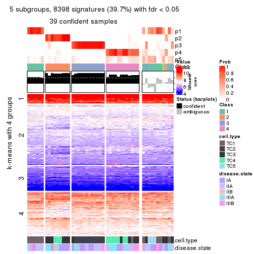</p>

</div>
<div id='tab-CV-NMF-get-signatures-no-scale-5'>
<pre><code class="r">get_signatures(res, k = 6, scale_rows = FALSE)
</code></pre>

<p>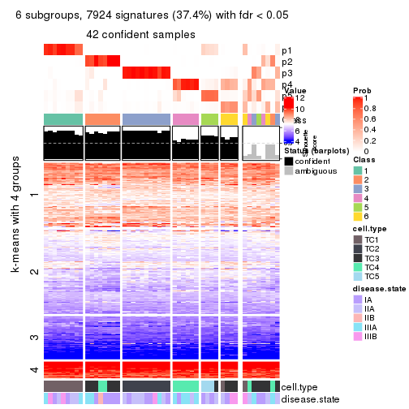</p>

</div>
</div>


Compare the overlap of signatures from different k:

```r
compare_signatures(res)
```

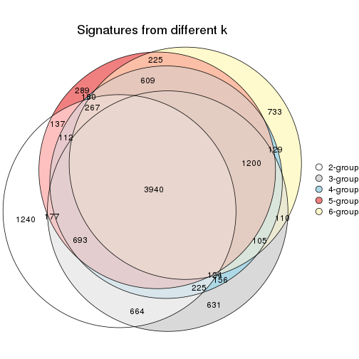

`get_signature()` returns a data frame invisibly. TO get the list of signatures, the function
call should be assigned to a variable explicitly. In following code, if `plot` argument is set
to `FALSE`, no heatmap is plotted while only the differential analysis is performed.

```r
# code only for demonstration
tb = get_signature(res, k = ..., plot = FALSE)
```

An example of the output of `tb` is:

```
#>   which_row         fdr    mean_1    mean_2 scaled_mean_1 scaled_mean_2 km
#> 1        38 0.042760348  8.373488  9.131774    -0.5533452     0.5164555  1
#> 2        40 0.018707592  7.106213  8.469186    -0.6173731     0.5762149  1
#> 3        55 0.019134737 10.221463 11.207825    -0.6159697     0.5749050  1
#> 4        59 0.006059896  5.921854  7.869574    -0.6899429     0.6439467  1
#> 5        60 0.018055526  8.928898 10.211722    -0.6204761     0.5791110  1
#> 6        98 0.009384629 15.714769 14.887706     0.6635654    -0.6193277  2
...
```

The columns in `tb` are:

1. `which_row`: row indices corresponding to the input matrix.
2. `fdr`: FDR for the differential test. 
3. `mean_x`: The mean value in group x.
4. `scaled_mean_x`: The mean value in group x after rows are scaled.
5. `km`: Row groups if k-means clustering is applied to rows.


UMAP plot which shows how samples are separated.


<script>
$( function() {
	$( '#tabs-CV-NMF-dimension-reduction' ).tabs();
} );
</script>
<div id='tabs-CV-NMF-dimension-reduction'>
<ul>
<li><a href='#tab-CV-NMF-dimension-reduction-1'>k = 2</a></li>
<li><a href='#tab-CV-NMF-dimension-reduction-2'>k = 3</a></li>
<li><a href='#tab-CV-NMF-dimension-reduction-3'>k = 4</a></li>
<li><a href='#tab-CV-NMF-dimension-reduction-4'>k = 5</a></li>
<li><a href='#tab-CV-NMF-dimension-reduction-5'>k = 6</a></li>
</ul>
<div id='tab-CV-NMF-dimension-reduction-1'>
<pre><code class="r">dimension_reduction(res, k = 2, method = &quot;UMAP&quot;)
</code></pre>

<p>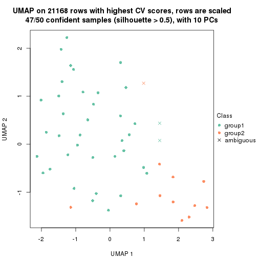</p>

</div>
<div id='tab-CV-NMF-dimension-reduction-2'>
<pre><code class="r">dimension_reduction(res, k = 3, method = &quot;UMAP&quot;)
</code></pre>

<p>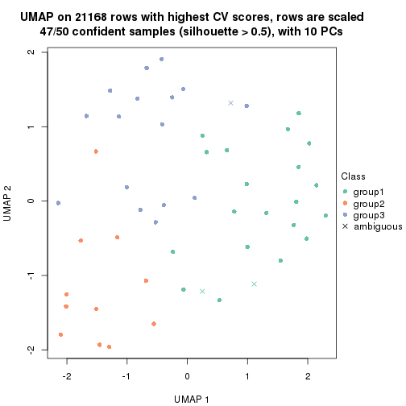</p>

</div>
<div id='tab-CV-NMF-dimension-reduction-3'>
<pre><code class="r">dimension_reduction(res, k = 4, method = &quot;UMAP&quot;)
</code></pre>

<p>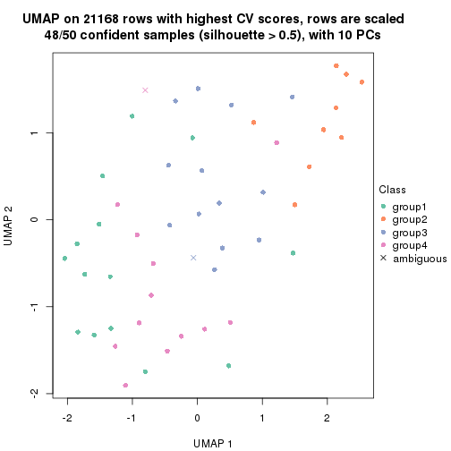</p>

</div>
<div id='tab-CV-NMF-dimension-reduction-4'>
<pre><code class="r">dimension_reduction(res, k = 5, method = &quot;UMAP&quot;)
</code></pre>

<p>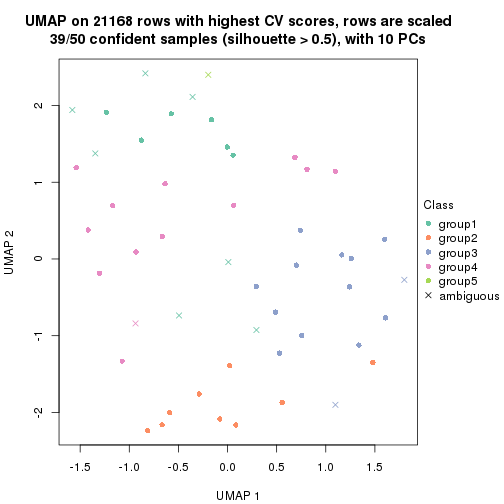</p>

</div>
<div id='tab-CV-NMF-dimension-reduction-5'>
<pre><code class="r">dimension_reduction(res, k = 6, method = &quot;UMAP&quot;)
</code></pre>

<p>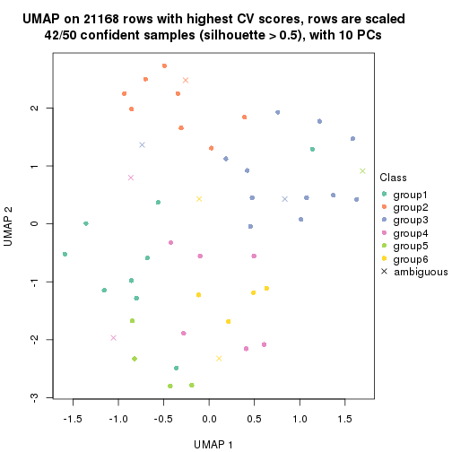</p>

</div>
</div>


Following heatmap shows how subgroups are split when increasing `k`:

```r
collect_classes(res)
```

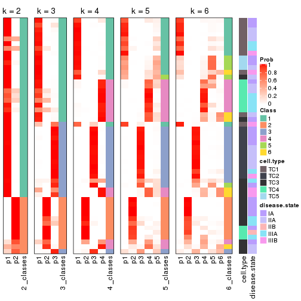


Test correlation between subgroups and known annotations. If the known
annotation is numeric, one-way ANOVA test is applied, and if the known
annotation is discrete, chi-squared contingency table test is applied.

```r
test_to_known_factors(res)
```

```
#>         n cell.type(p) disease.state(p) k
#> CV:NMF 47     2.81e-03           0.0755 2
#> CV:NMF 47     4.66e-08           0.2720 3
#> CV:NMF 48     4.26e-12           0.1879 4
#> CV:NMF 39     1.77e-11           0.2833 5
#> CV:NMF 42     7.28e-19           0.1125 6
```


If matrix rows can be associated to genes, consider to use `functional_enrichment(res,
...)` to perform function enrichment for the signature genes. See [this vignette](http://bioconductor.org/packages/devel/bioc/vignettes/cola/inst/doc/functional_enrichment.html) for more detailed explanations.


 

---------------------------------------------------


### MAD:hclust**


The object with results only for a single top-value method and a single partition method 
can be extracted as:

```r
res = res_list["MAD", "hclust"]
# you can also extract it by
# res = res_list["MAD:hclust"]
```

A summary of `res` and all the functions that can be applied to it:

```r
res
```

```
#> A 'ConsensusPartition' object with k = 2, 3, 4, 5, 6.
#>   On a matrix with 21168 rows and 50 columns.
#>   Top rows (1000, 2000, 3000, 4000, 5000) are extracted by 'MAD' method.
#>   Subgroups are detected by 'hclust' method.
#>   Performed in total 1250 partitions by row resampling.
#>   Best k for subgroups seems to be 2.
#> 
#> Following methods can be applied to this 'ConsensusPartition' object:
#>  [1] "cola_report"             "collect_classes"         "collect_plots"          
#>  [4] "collect_stats"           "colnames"                "compare_signatures"     
#>  [7] "consensus_heatmap"       "dimension_reduction"     "functional_enrichment"  
#> [10] "get_anno_col"            "get_anno"                "get_classes"            
#> [13] "get_consensus"           "get_matrix"              "get_membership"         
#> [16] "get_param"               "get_signatures"          "get_stats"              
#> [19] "is_best_k"               "is_stable_k"             "membership_heatmap"     
#> [22] "ncol"                    "nrow"                    "plot_ecdf"              
#> [25] "rownames"                "select_partition_number" "show"                   
#> [28] "suggest_best_k"          "test_to_known_factors"
```

`collect_plots()` function collects all the plots made from `res` for all `k` (number of partitions)
into one single page to provide an easy and fast comparison between different `k`.

```r
collect_plots(res)
```

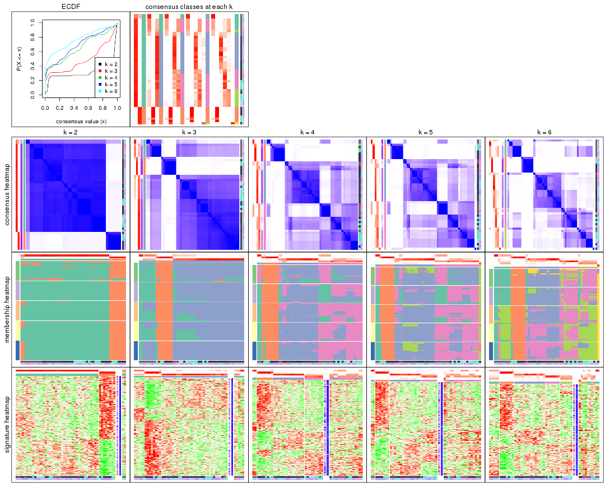

The plots are:

- The first row: a plot of the ECDF (empirical cumulative distribution
  function) curves of the consensus matrix for each `k` and the heatmap of
  predicted classes for each `k`.
- The second row: heatmaps of the consensus matrix for each `k`.
- The third row: heatmaps of the membership matrix for each `k`.
- The fouth row: heatmaps of the signatures for each `k`.

All the plots in panels can be made by individual functions and they are
plotted later in this section.

`select_partition_number()` produces several plots showing different
statistics for choosing "optimized" `k`. There are following statistics:

- ECDF curves of the consensus matrix for each `k`;
- 1-PAC. [The PAC
  score](https://en.wikipedia.org/wiki/Consensus_clustering#Over-interpretation_potential_of_consensus_clustering)
  measures the proportion of the ambiguous subgrouping.
- Mean silhouette score.
- Concordance. The mean probability of fiting the consensus class ids in all
  partitions.
- Area increased. Denote $A_k$ as the area under the ECDF curve for current
  `k`, the area increased is defined as $A_k - A_{k-1}$.
- Rand index. The percent of pairs of samples that are both in a same cluster
  or both are not in a same cluster in the partition of k and k-1.
- Jaccard index. The ratio of pairs of samples are both in a same cluster in
  the partition of k and k-1 and the pairs of samples are both in a same
  cluster in the partition k or k-1.

The detailed explanations of these statistics can be found in [the _cola_
vignette](http://bioconductor.org/packages/devel/bioc/vignettes/cola/inst/doc/cola.html#toc_13).

Generally speaking, lower PAC score, higher mean silhouette score or higher
concordance corresponds to better partition. Rand index and Jaccard index
measure how similar the current partition is compared to partition with `k-1`.
If they are too similar, we won't accept `k` is better than `k-1`.

```r
select_partition_number(res)
```

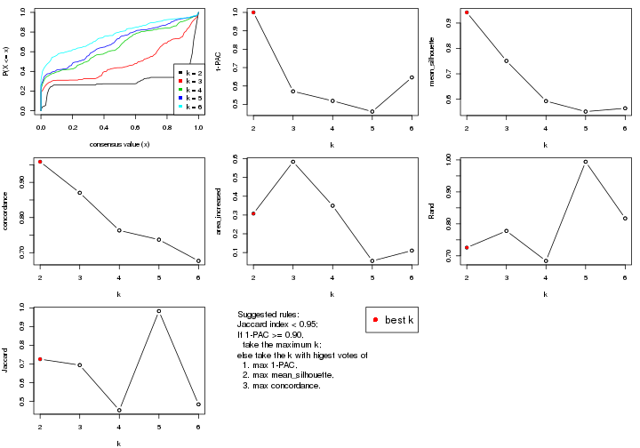

The numeric values for all these statistics can be obtained by `get_stats()`.

```r
get_stats(res)
```

```
#>   k 1-PAC mean_silhouette concordance area_increased  Rand Jaccard
#> 2 2 1.000           0.942       0.959         0.3075 0.726   0.726
#> 3 3 0.571           0.751       0.870         0.5837 0.778   0.694
#> 4 4 0.519           0.592       0.763         0.3495 0.684   0.453
#> 5 5 0.461           0.551       0.737         0.0555 0.994   0.983
#> 6 6 0.647           0.564       0.677         0.1105 0.817   0.484
```

`suggest_best_k()` suggests the best $k$ based on these statistics. The rules are as follows:

- All $k$ with Jaccard index larger than 0.95 are removed because increasing
  $k$ does not provide enough extra information. If all $k$ are removed, it is
  marked as no subgroup is detected.
- For all $k$ with 1-PAC score larger than 0.9, the maximal $k$ is taken as
  the best $k$, and other $k$ are marked as optional $k$.
- If it does not fit the second rule. The $k$ with the maximal vote of the
  highest 1-PAC score, highest mean silhouette, and highest concordance is
  taken as the best $k$.

```r
suggest_best_k(res)
```

```
#> [1] 2
```


Following shows the table of the partitions (You need to click the **show/hide
code output** link to see it). The membership matrix (columns with name `p*`)
is inferred by
[`clue::cl_consensus()`](https://www.rdocumentation.org/link/cl_consensus?package=clue)
function with the `SE` method. Basically the value in the membership matrix
represents the probability to belong to a certain group. The finall class
label for an item is determined with the group with highest probability it
belongs to.

In `get_classes()` function, the entropy is calculated from the membership
matrix and the silhouette score is calculated from the consensus matrix.


<script>
$( function() {
	$( '#tabs-MAD-hclust-get-classes' ).tabs();
} );
</script>
<div id='tabs-MAD-hclust-get-classes'>
<ul>
<li><a href='#tab-MAD-hclust-get-classes-1'>k = 2</a></li>
<li><a href='#tab-MAD-hclust-get-classes-2'>k = 3</a></li>
<li><a href='#tab-MAD-hclust-get-classes-3'>k = 4</a></li>
<li><a href='#tab-MAD-hclust-get-classes-4'>k = 5</a></li>
<li><a href='#tab-MAD-hclust-get-classes-5'>k = 6</a></li>
</ul>

<div id='tab-MAD-hclust-get-classes-1'>
<p><a id='tab-MAD-hclust-get-classes-1-a' style='color:#0366d6' href='#'>show/hide code output</a></p>
<pre><code class="r">cbind(get_classes(res, k = 2), get_membership(res, k = 2))
</code></pre>

<pre><code>#&gt;          class entropy silhouette    p1    p2
#&gt; GSM63448     1  0.2423      0.952 0.960 0.040
#&gt; GSM63449     1  0.2778      0.944 0.952 0.048
#&gt; GSM63423     1  0.2778      0.944 0.952 0.048
#&gt; GSM63425     1  0.2236      0.957 0.964 0.036
#&gt; GSM63437     1  0.2778      0.944 0.952 0.048
#&gt; GSM63453     1  0.9393      0.479 0.644 0.356
#&gt; GSM63431     1  0.2778      0.944 0.952 0.048
#&gt; GSM63450     1  0.9393      0.479 0.644 0.356
#&gt; GSM63428     1  0.2778      0.944 0.952 0.048
#&gt; GSM63432     1  0.2423      0.952 0.960 0.040
#&gt; GSM63458     1  0.2236      0.954 0.964 0.036
#&gt; GSM63434     1  0.1843      0.961 0.972 0.028
#&gt; GSM63435     1  0.1633      0.955 0.976 0.024
#&gt; GSM63442     1  0.1184      0.958 0.984 0.016
#&gt; GSM63451     1  0.0938      0.961 0.988 0.012
#&gt; GSM63422     1  0.1633      0.955 0.976 0.024
#&gt; GSM63438     1  0.2043      0.956 0.968 0.032
#&gt; GSM63439     1  0.2043      0.956 0.968 0.032
#&gt; GSM63461     1  0.1633      0.958 0.976 0.024
#&gt; GSM63463     1  0.1843      0.956 0.972 0.028
#&gt; GSM63430     1  0.2043      0.956 0.968 0.032
#&gt; GSM63446     1  0.1633      0.959 0.976 0.024
#&gt; GSM63429     1  0.1843      0.960 0.972 0.028
#&gt; GSM63445     1  0.1184      0.960 0.984 0.016
#&gt; GSM63447     1  0.1843      0.960 0.972 0.028
#&gt; GSM63459     2  0.1633      0.992 0.024 0.976
#&gt; GSM63464     2  0.1633      0.992 0.024 0.976
#&gt; GSM63469     2  0.1633      0.992 0.024 0.976
#&gt; GSM63470     2  0.1633      0.992 0.024 0.976
#&gt; GSM63436     1  0.0938      0.961 0.988 0.012
#&gt; GSM63443     2  0.2603      0.953 0.044 0.956
#&gt; GSM63465     1  0.1843      0.960 0.972 0.028
#&gt; GSM63444     1  0.2778      0.948 0.952 0.048
#&gt; GSM63456     1  0.2236      0.955 0.964 0.036
#&gt; GSM63462     1  0.1843      0.958 0.972 0.028
#&gt; GSM63424     1  0.2423      0.956 0.960 0.040
#&gt; GSM63440     1  0.1843      0.960 0.972 0.028
#&gt; GSM63433     1  0.0938      0.961 0.988 0.012
#&gt; GSM63466     2  0.1633      0.992 0.024 0.976
#&gt; GSM63426     1  0.0938      0.961 0.988 0.012
#&gt; GSM63468     1  0.1843      0.960 0.972 0.028
#&gt; GSM63452     2  0.2043      0.986 0.032 0.968
#&gt; GSM63441     1  0.1843      0.960 0.972 0.028
#&gt; GSM63454     1  0.1843      0.960 0.972 0.028
#&gt; GSM63455     1  0.0938      0.961 0.988 0.012
#&gt; GSM63460     2  0.1633      0.992 0.024 0.976
#&gt; GSM63467     1  0.1414      0.960 0.980 0.020
#&gt; GSM63421     1  0.0938      0.961 0.988 0.012
#&gt; GSM63427     1  0.0938      0.961 0.988 0.012
#&gt; GSM63457     1  0.0938      0.961 0.988 0.012
</code></pre>

<script>
$('#tab-MAD-hclust-get-classes-1-a').parent().next().next().hide();
$('#tab-MAD-hclust-get-classes-1-a').click(function(){
  $('#tab-MAD-hclust-get-classes-1-a').parent().next().next().toggle();
  return(false);
});
</script>
</div>

<div id='tab-MAD-hclust-get-classes-2'>
<p><a id='tab-MAD-hclust-get-classes-2-a' style='color:#0366d6' href='#'>show/hide code output</a></p>
<pre><code class="r">cbind(get_classes(res, k = 3), get_membership(res, k = 3))
</code></pre>

<pre><code>#&gt;          class entropy silhouette    p1    p2    p3
#&gt; GSM63448     3  0.5988     0.0663 0.368 0.000 0.632
#&gt; GSM63449     1  0.5988     0.7462 0.632 0.000 0.368
#&gt; GSM63423     1  0.5988     0.7462 0.632 0.000 0.368
#&gt; GSM63425     3  0.4605     0.6942 0.204 0.000 0.796
#&gt; GSM63437     1  0.5988     0.7462 0.632 0.000 0.368
#&gt; GSM63453     1  0.1399     0.4169 0.968 0.004 0.028
#&gt; GSM63431     1  0.5988     0.7462 0.632 0.000 0.368
#&gt; GSM63450     1  0.1399     0.4169 0.968 0.004 0.028
#&gt; GSM63428     1  0.5988     0.7462 0.632 0.000 0.368
#&gt; GSM63432     3  0.5810     0.1925 0.336 0.000 0.664
#&gt; GSM63458     1  0.6302     0.4802 0.520 0.000 0.480
#&gt; GSM63434     3  0.1015     0.8306 0.012 0.008 0.980
#&gt; GSM63435     3  0.1529     0.8262 0.040 0.000 0.960
#&gt; GSM63442     3  0.1643     0.8294 0.044 0.000 0.956
#&gt; GSM63451     3  0.1482     0.8306 0.020 0.012 0.968
#&gt; GSM63422     3  0.1643     0.8257 0.044 0.000 0.956
#&gt; GSM63438     3  0.1529     0.8232 0.040 0.000 0.960
#&gt; GSM63439     3  0.1529     0.8232 0.040 0.000 0.960
#&gt; GSM63461     3  0.1289     0.8265 0.032 0.000 0.968
#&gt; GSM63463     3  0.1411     0.8250 0.036 0.000 0.964
#&gt; GSM63430     3  0.1529     0.8232 0.040 0.000 0.960
#&gt; GSM63446     3  0.1170     0.8287 0.008 0.016 0.976
#&gt; GSM63429     3  0.2066     0.8232 0.060 0.000 0.940
#&gt; GSM63445     3  0.1529     0.8306 0.040 0.000 0.960
#&gt; GSM63447     3  0.2066     0.8227 0.060 0.000 0.940
#&gt; GSM63459     2  0.0000     0.9629 0.000 1.000 0.000
#&gt; GSM63464     2  0.0000     0.9629 0.000 1.000 0.000
#&gt; GSM63469     2  0.0000     0.9629 0.000 1.000 0.000
#&gt; GSM63470     2  0.0000     0.9629 0.000 1.000 0.000
#&gt; GSM63436     3  0.5098     0.6098 0.248 0.000 0.752
#&gt; GSM63443     2  0.2806     0.9085 0.040 0.928 0.032
#&gt; GSM63465     3  0.1964     0.8244 0.056 0.000 0.944
#&gt; GSM63444     3  0.1999     0.8184 0.012 0.036 0.952
#&gt; GSM63456     3  0.1620     0.8251 0.012 0.024 0.964
#&gt; GSM63462     3  0.1781     0.8296 0.020 0.020 0.960
#&gt; GSM63424     3  0.1163     0.8234 0.028 0.000 0.972
#&gt; GSM63440     3  0.0592     0.8299 0.012 0.000 0.988
#&gt; GSM63433     3  0.4750     0.6677 0.216 0.000 0.784
#&gt; GSM63466     2  0.0000     0.9629 0.000 1.000 0.000
#&gt; GSM63426     3  0.4796     0.6613 0.220 0.000 0.780
#&gt; GSM63468     3  0.1964     0.8244 0.056 0.000 0.944
#&gt; GSM63452     2  0.5216     0.7949 0.260 0.740 0.000
#&gt; GSM63441     3  0.2537     0.8111 0.080 0.000 0.920
#&gt; GSM63454     3  0.1964     0.8244 0.056 0.000 0.944
#&gt; GSM63455     3  0.4796     0.6613 0.220 0.000 0.780
#&gt; GSM63460     2  0.0000     0.9629 0.000 1.000 0.000
#&gt; GSM63467     3  0.5406     0.6508 0.224 0.012 0.764
#&gt; GSM63421     3  0.5098     0.6098 0.248 0.000 0.752
#&gt; GSM63427     3  0.5098     0.6098 0.248 0.000 0.752
#&gt; GSM63457     3  0.5098     0.6098 0.248 0.000 0.752
</code></pre>

<script>
$('#tab-MAD-hclust-get-classes-2-a').parent().next().next().hide();
$('#tab-MAD-hclust-get-classes-2-a').click(function(){
  $('#tab-MAD-hclust-get-classes-2-a').parent().next().next().toggle();
  return(false);
});
</script>
</div>

<div id='tab-MAD-hclust-get-classes-3'>
<p><a id='tab-MAD-hclust-get-classes-3-a' style='color:#0366d6' href='#'>show/hide code output</a></p>
<pre><code class="r">cbind(get_classes(res, k = 4), get_membership(res, k = 4))
</code></pre>

<pre><code>#&gt;          class entropy silhouette    p1    p2    p3    p4
#&gt; GSM63448     3  0.7357     0.1822 0.320 0.000 0.500 0.180
#&gt; GSM63449     4  0.4977     0.0996 0.460 0.000 0.000 0.540
#&gt; GSM63423     4  0.4977     0.0996 0.460 0.000 0.000 0.540
#&gt; GSM63425     4  0.2796     0.5240 0.016 0.000 0.092 0.892
#&gt; GSM63437     4  0.4977     0.0996 0.460 0.000 0.000 0.540
#&gt; GSM63453     1  0.1398     1.0000 0.956 0.004 0.000 0.040
#&gt; GSM63431     4  0.4977     0.0996 0.460 0.000 0.000 0.540
#&gt; GSM63450     1  0.1398     1.0000 0.956 0.004 0.000 0.040
#&gt; GSM63428     4  0.4977     0.0996 0.460 0.000 0.000 0.540
#&gt; GSM63432     3  0.6801     0.3377 0.308 0.000 0.568 0.124
#&gt; GSM63458     4  0.6123     0.3176 0.336 0.000 0.064 0.600
#&gt; GSM63434     3  0.2602     0.8116 0.008 0.008 0.908 0.076
#&gt; GSM63435     3  0.1716     0.8124 0.000 0.000 0.936 0.064
#&gt; GSM63442     3  0.2271     0.8069 0.008 0.000 0.916 0.076
#&gt; GSM63451     3  0.1771     0.8235 0.004 0.012 0.948 0.036
#&gt; GSM63422     3  0.1792     0.8108 0.000 0.000 0.932 0.068
#&gt; GSM63438     3  0.1489     0.8237 0.004 0.000 0.952 0.044
#&gt; GSM63439     3  0.1305     0.8245 0.004 0.000 0.960 0.036
#&gt; GSM63461     3  0.0921     0.8228 0.000 0.000 0.972 0.028
#&gt; GSM63463     3  0.0817     0.8213 0.000 0.000 0.976 0.024
#&gt; GSM63430     3  0.1489     0.8239 0.004 0.000 0.952 0.044
#&gt; GSM63446     3  0.2725     0.8046 0.016 0.016 0.912 0.056
#&gt; GSM63429     4  0.5138     0.3150 0.008 0.000 0.392 0.600
#&gt; GSM63445     3  0.2174     0.8218 0.020 0.000 0.928 0.052
#&gt; GSM63447     4  0.4955     0.1903 0.000 0.000 0.444 0.556
#&gt; GSM63459     2  0.0000     0.9443 0.000 1.000 0.000 0.000
#&gt; GSM63464     2  0.0000     0.9443 0.000 1.000 0.000 0.000
#&gt; GSM63469     2  0.0000     0.9443 0.000 1.000 0.000 0.000
#&gt; GSM63470     2  0.0000     0.9443 0.000 1.000 0.000 0.000
#&gt; GSM63436     4  0.5498     0.5864 0.048 0.000 0.272 0.680
#&gt; GSM63443     2  0.3896     0.8381 0.016 0.860 0.068 0.056
#&gt; GSM63465     4  0.4996     0.0723 0.000 0.000 0.484 0.516
#&gt; GSM63444     3  0.3353     0.7947 0.020 0.036 0.888 0.056
#&gt; GSM63456     3  0.3058     0.8011 0.020 0.024 0.900 0.056
#&gt; GSM63462     3  0.3363     0.7958 0.024 0.020 0.884 0.072
#&gt; GSM63424     3  0.5506     0.2393 0.016 0.000 0.512 0.472
#&gt; GSM63440     3  0.5183     0.2740 0.008 0.000 0.584 0.408
#&gt; GSM63433     4  0.4420     0.5800 0.012 0.000 0.240 0.748
#&gt; GSM63466     2  0.0000     0.9443 0.000 1.000 0.000 0.000
#&gt; GSM63426     4  0.3895     0.6150 0.012 0.000 0.184 0.804
#&gt; GSM63468     4  0.4996     0.0723 0.000 0.000 0.484 0.516
#&gt; GSM63452     2  0.4134     0.6902 0.260 0.740 0.000 0.000
#&gt; GSM63441     4  0.4761     0.3614 0.000 0.000 0.372 0.628
#&gt; GSM63454     4  0.4996     0.0723 0.000 0.000 0.484 0.516
#&gt; GSM63455     4  0.3895     0.6150 0.012 0.000 0.184 0.804
#&gt; GSM63460     2  0.0000     0.9443 0.000 1.000 0.000 0.000
#&gt; GSM63467     4  0.4376     0.6160 0.016 0.012 0.176 0.796
#&gt; GSM63421     4  0.5498     0.5864 0.048 0.000 0.272 0.680
#&gt; GSM63427     4  0.5498     0.5864 0.048 0.000 0.272 0.680
#&gt; GSM63457     4  0.5498     0.5864 0.048 0.000 0.272 0.680
</code></pre>

<script>
$('#tab-MAD-hclust-get-classes-3-a').parent().next().next().hide();
$('#tab-MAD-hclust-get-classes-3-a').click(function(){
  $('#tab-MAD-hclust-get-classes-3-a').parent().next().next().toggle();
  return(false);
});
</script>
</div>

<div id='tab-MAD-hclust-get-classes-4'>
<p><a id='tab-MAD-hclust-get-classes-4-a' style='color:#0366d6' href='#'>show/hide code output</a></p>
<pre><code class="r">cbind(get_classes(res, k = 5), get_membership(res, k = 5))
</code></pre>

<pre><code>#&gt;          class entropy silhouette    p1    p2    p3    p4    p5
#&gt; GSM63448     3  0.6205     0.1575 0.332 0.000 0.512 0.156 0.000
#&gt; GSM63449     4  0.4449     0.0926 0.484 0.000 0.004 0.512 0.000
#&gt; GSM63423     4  0.4449     0.0926 0.484 0.000 0.004 0.512 0.000
#&gt; GSM63425     4  0.3052     0.4434 0.008 0.000 0.032 0.868 0.092
#&gt; GSM63437     4  0.4449     0.0926 0.484 0.000 0.004 0.512 0.000
#&gt; GSM63453     1  0.0771     1.0000 0.976 0.000 0.000 0.020 0.004
#&gt; GSM63431     4  0.4449     0.0926 0.484 0.000 0.004 0.512 0.000
#&gt; GSM63450     1  0.0771     1.0000 0.976 0.000 0.000 0.020 0.004
#&gt; GSM63428     4  0.4449     0.0926 0.484 0.000 0.004 0.512 0.000
#&gt; GSM63432     3  0.5615     0.3146 0.320 0.000 0.584 0.096 0.000
#&gt; GSM63458     4  0.5745     0.2992 0.352 0.000 0.068 0.568 0.012
#&gt; GSM63434     3  0.1764     0.7474 0.000 0.008 0.928 0.064 0.000
#&gt; GSM63435     3  0.3779     0.7336 0.004 0.000 0.812 0.048 0.136
#&gt; GSM63442     3  0.4167     0.7301 0.008 0.000 0.792 0.064 0.136
#&gt; GSM63451     3  0.3620     0.7519 0.000 0.012 0.828 0.032 0.128
#&gt; GSM63422     3  0.3849     0.7314 0.004 0.000 0.808 0.052 0.136
#&gt; GSM63438     3  0.1041     0.7599 0.000 0.000 0.964 0.032 0.004
#&gt; GSM63439     3  0.0865     0.7613 0.000 0.000 0.972 0.024 0.004
#&gt; GSM63461     3  0.3193     0.7515 0.000 0.000 0.840 0.028 0.132
#&gt; GSM63463     3  0.3106     0.7503 0.000 0.000 0.844 0.024 0.132
#&gt; GSM63430     3  0.1041     0.7603 0.000 0.000 0.964 0.032 0.004
#&gt; GSM63446     3  0.4655     0.7346 0.012 0.016 0.780 0.060 0.132
#&gt; GSM63429     4  0.4777     0.3700 0.008 0.000 0.356 0.620 0.016
#&gt; GSM63445     3  0.1408     0.7584 0.008 0.000 0.948 0.044 0.000
#&gt; GSM63447     4  0.4736     0.2833 0.000 0.000 0.404 0.576 0.020
#&gt; GSM63459     2  0.0000     0.9396 0.000 1.000 0.000 0.000 0.000
#&gt; GSM63464     2  0.0000     0.9396 0.000 1.000 0.000 0.000 0.000
#&gt; GSM63469     2  0.0000     0.9396 0.000 1.000 0.000 0.000 0.000
#&gt; GSM63470     2  0.0000     0.9396 0.000 1.000 0.000 0.000 0.000
#&gt; GSM63436     4  0.4689     0.5513 0.048 0.000 0.264 0.688 0.000
#&gt; GSM63443     5  0.4238     0.0000 0.000 0.164 0.068 0.000 0.768
#&gt; GSM63465     4  0.4803     0.1943 0.000 0.000 0.444 0.536 0.020
#&gt; GSM63444     3  0.3365     0.7405 0.012 0.028 0.872 0.060 0.028
#&gt; GSM63456     3  0.3098     0.7439 0.012 0.024 0.884 0.060 0.020
#&gt; GSM63462     3  0.3602     0.7392 0.016 0.020 0.856 0.080 0.028
#&gt; GSM63424     3  0.5945     0.1124 0.008 0.000 0.460 0.452 0.080
#&gt; GSM63440     3  0.5184     0.1249 0.008 0.000 0.544 0.420 0.028
#&gt; GSM63433     4  0.3398     0.5713 0.004 0.000 0.216 0.780 0.000
#&gt; GSM63466     2  0.0290     0.9357 0.000 0.992 0.000 0.000 0.008
#&gt; GSM63426     4  0.3256     0.5984 0.004 0.000 0.148 0.832 0.016
#&gt; GSM63468     4  0.4803     0.1943 0.000 0.000 0.444 0.536 0.020
#&gt; GSM63452     2  0.3689     0.6011 0.256 0.740 0.000 0.000 0.004
#&gt; GSM63441     4  0.4435     0.4059 0.000 0.000 0.336 0.648 0.016
#&gt; GSM63454     4  0.4803     0.1943 0.000 0.000 0.444 0.536 0.020
#&gt; GSM63455     4  0.3256     0.5984 0.004 0.000 0.148 0.832 0.016
#&gt; GSM63460     2  0.0290     0.9357 0.000 0.992 0.000 0.000 0.008
#&gt; GSM63467     4  0.3635     0.5969 0.008 0.004 0.140 0.824 0.024
#&gt; GSM63421     4  0.4689     0.5513 0.048 0.000 0.264 0.688 0.000
#&gt; GSM63427     4  0.4689     0.5513 0.048 0.000 0.264 0.688 0.000
#&gt; GSM63457     4  0.4689     0.5513 0.048 0.000 0.264 0.688 0.000
</code></pre>

<script>
$('#tab-MAD-hclust-get-classes-4-a').parent().next().next().hide();
$('#tab-MAD-hclust-get-classes-4-a').click(function(){
  $('#tab-MAD-hclust-get-classes-4-a').parent().next().next().toggle();
  return(false);
});
</script>
</div>

<div id='tab-MAD-hclust-get-classes-5'>
<p><a id='tab-MAD-hclust-get-classes-5-a' style='color:#0366d6' href='#'>show/hide code output</a></p>
<pre><code class="r">cbind(get_classes(res, k = 6), get_membership(res, k = 6))
</code></pre>

<pre><code>#&gt;          class entropy silhouette    p1    p2    p3    p4    p5    p6
#&gt; GSM63448     1  0.7566     -0.110 0.320 0.000 0.288 0.264 0.124 0.004
#&gt; GSM63449     1  0.5745      0.516 0.460 0.000 0.004 0.148 0.388 0.000
#&gt; GSM63423     1  0.5745      0.516 0.460 0.000 0.004 0.148 0.388 0.000
#&gt; GSM63425     5  0.4743      0.229 0.000 0.000 0.056 0.280 0.652 0.012
#&gt; GSM63437     1  0.5745      0.516 0.460 0.000 0.004 0.148 0.388 0.000
#&gt; GSM63453     1  0.0000      0.155 1.000 0.000 0.000 0.000 0.000 0.000
#&gt; GSM63431     1  0.5745      0.516 0.460 0.000 0.004 0.148 0.388 0.000
#&gt; GSM63450     1  0.0000      0.155 1.000 0.000 0.000 0.000 0.000 0.000
#&gt; GSM63428     1  0.5745      0.516 0.460 0.000 0.004 0.148 0.388 0.000
#&gt; GSM63432     3  0.7333      0.134 0.308 0.000 0.328 0.276 0.084 0.004
#&gt; GSM63458     5  0.5590     -0.232 0.328 0.000 0.008 0.128 0.536 0.000
#&gt; GSM63434     3  0.4833      0.705 0.000 0.000 0.668 0.256 0.032 0.044
#&gt; GSM63435     3  0.1075      0.660 0.000 0.000 0.952 0.000 0.048 0.000
#&gt; GSM63442     3  0.1674      0.652 0.004 0.000 0.924 0.004 0.068 0.000
#&gt; GSM63451     3  0.1390      0.685 0.000 0.000 0.948 0.004 0.016 0.032
#&gt; GSM63422     3  0.1141      0.658 0.000 0.000 0.948 0.000 0.052 0.000
#&gt; GSM63438     3  0.3834      0.715 0.000 0.000 0.728 0.244 0.024 0.004
#&gt; GSM63439     3  0.3979      0.715 0.000 0.000 0.720 0.244 0.032 0.004
#&gt; GSM63461     3  0.0146      0.686 0.000 0.000 0.996 0.000 0.004 0.000
#&gt; GSM63463     3  0.0000      0.685 0.000 0.000 1.000 0.000 0.000 0.000
#&gt; GSM63430     3  0.3834      0.715 0.000 0.000 0.728 0.244 0.024 0.004
#&gt; GSM63446     3  0.3128      0.648 0.000 0.000 0.848 0.012 0.088 0.052
#&gt; GSM63429     4  0.2066      0.635 0.000 0.000 0.024 0.904 0.072 0.000
#&gt; GSM63445     3  0.4607      0.703 0.004 0.000 0.680 0.256 0.052 0.008
#&gt; GSM63447     4  0.0363      0.701 0.000 0.000 0.012 0.988 0.000 0.000
#&gt; GSM63459     2  0.0000      0.949 0.000 1.000 0.000 0.000 0.000 0.000
#&gt; GSM63464     2  0.0146      0.947 0.000 0.996 0.000 0.000 0.004 0.000
#&gt; GSM63469     2  0.0000      0.949 0.000 1.000 0.000 0.000 0.000 0.000
#&gt; GSM63470     2  0.0000      0.949 0.000 1.000 0.000 0.000 0.000 0.000
#&gt; GSM63436     5  0.5119      0.639 0.008 0.000 0.064 0.396 0.532 0.000
#&gt; GSM63443     6  0.1327      0.000 0.000 0.000 0.064 0.000 0.000 0.936
#&gt; GSM63465     4  0.1141      0.728 0.000 0.000 0.052 0.948 0.000 0.000
#&gt; GSM63444     3  0.6421      0.630 0.000 0.008 0.536 0.280 0.112 0.064
#&gt; GSM63456     3  0.6221      0.638 0.000 0.004 0.548 0.280 0.112 0.056
#&gt; GSM63462     3  0.6199      0.628 0.004 0.000 0.544 0.288 0.112 0.052
#&gt; GSM63424     4  0.5583      0.350 0.000 0.000 0.192 0.596 0.200 0.012
#&gt; GSM63440     4  0.3487      0.604 0.000 0.000 0.168 0.788 0.044 0.000
#&gt; GSM63433     4  0.3819     -0.324 0.000 0.000 0.008 0.652 0.340 0.000
#&gt; GSM63466     2  0.0260      0.946 0.000 0.992 0.000 0.000 0.000 0.008
#&gt; GSM63426     5  0.4089      0.510 0.000 0.000 0.008 0.468 0.524 0.000
#&gt; GSM63468     4  0.1141      0.728 0.000 0.000 0.052 0.948 0.000 0.000
#&gt; GSM63452     2  0.3198      0.665 0.260 0.740 0.000 0.000 0.000 0.000
#&gt; GSM63441     4  0.1858      0.590 0.000 0.000 0.012 0.912 0.076 0.000
#&gt; GSM63454     4  0.1141      0.728 0.000 0.000 0.052 0.948 0.000 0.000
#&gt; GSM63455     5  0.4089      0.510 0.000 0.000 0.008 0.468 0.524 0.000
#&gt; GSM63460     2  0.0260      0.946 0.000 0.992 0.000 0.000 0.000 0.008
#&gt; GSM63467     5  0.4855      0.496 0.004 0.000 0.016 0.456 0.504 0.020
#&gt; GSM63421     5  0.5119      0.639 0.008 0.000 0.064 0.396 0.532 0.000
#&gt; GSM63427     5  0.5119      0.639 0.008 0.000 0.064 0.396 0.532 0.000
#&gt; GSM63457     5  0.5119      0.639 0.008 0.000 0.064 0.396 0.532 0.000
</code></pre>

<script>
$('#tab-MAD-hclust-get-classes-5-a').parent().next().next().hide();
$('#tab-MAD-hclust-get-classes-5-a').click(function(){
  $('#tab-MAD-hclust-get-classes-5-a').parent().next().next().toggle();
  return(false);
});
</script>
</div>
</div>

Heatmaps for the consensus matrix. It visualizes the probability of two
samples to be in a same group.


<script>
$( function() {
	$( '#tabs-MAD-hclust-consensus-heatmap' ).tabs();
} );
</script>
<div id='tabs-MAD-hclust-consensus-heatmap'>
<ul>
<li><a href='#tab-MAD-hclust-consensus-heatmap-1'>k = 2</a></li>
<li><a href='#tab-MAD-hclust-consensus-heatmap-2'>k = 3</a></li>
<li><a href='#tab-MAD-hclust-consensus-heatmap-3'>k = 4</a></li>
<li><a href='#tab-MAD-hclust-consensus-heatmap-4'>k = 5</a></li>
<li><a href='#tab-MAD-hclust-consensus-heatmap-5'>k = 6</a></li>
</ul>
<div id='tab-MAD-hclust-consensus-heatmap-1'>
<pre><code class="r">consensus_heatmap(res, k = 2)
</code></pre>

<p>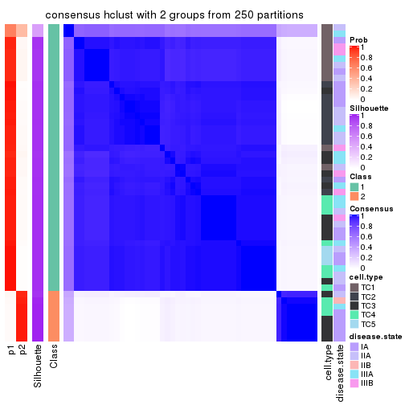</p>

</div>
<div id='tab-MAD-hclust-consensus-heatmap-2'>
<pre><code class="r">consensus_heatmap(res, k = 3)
</code></pre>

<p>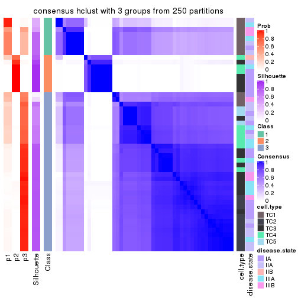</p>

</div>
<div id='tab-MAD-hclust-consensus-heatmap-3'>
<pre><code class="r">consensus_heatmap(res, k = 4)
</code></pre>

<p>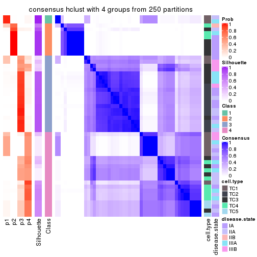</p>

</div>
<div id='tab-MAD-hclust-consensus-heatmap-4'>
<pre><code class="r">consensus_heatmap(res, k = 5)
</code></pre>

<p>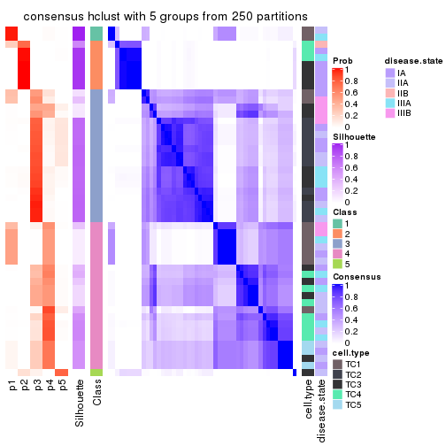</p>

</div>
<div id='tab-MAD-hclust-consensus-heatmap-5'>
<pre><code class="r">consensus_heatmap(res, k = 6)
</code></pre>

<p>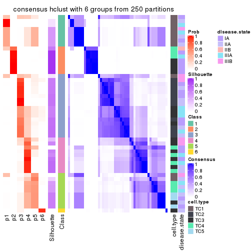</p>

</div>
</div>

Heatmaps for the membership of samples in all partitions to see how consistent they are:


<script>
$( function() {
	$( '#tabs-MAD-hclust-membership-heatmap' ).tabs();
} );
</script>
<div id='tabs-MAD-hclust-membership-heatmap'>
<ul>
<li><a href='#tab-MAD-hclust-membership-heatmap-1'>k = 2</a></li>
<li><a href='#tab-MAD-hclust-membership-heatmap-2'>k = 3</a></li>
<li><a href='#tab-MAD-hclust-membership-heatmap-3'>k = 4</a></li>
<li><a href='#tab-MAD-hclust-membership-heatmap-4'>k = 5</a></li>
<li><a href='#tab-MAD-hclust-membership-heatmap-5'>k = 6</a></li>
</ul>
<div id='tab-MAD-hclust-membership-heatmap-1'>
<pre><code class="r">membership_heatmap(res, k = 2)
</code></pre>

<p>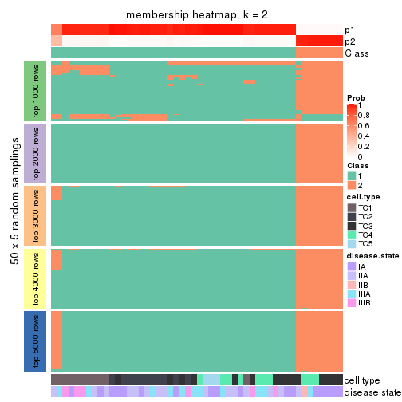</p>

</div>
<div id='tab-MAD-hclust-membership-heatmap-2'>
<pre><code class="r">membership_heatmap(res, k = 3)
</code></pre>

<p>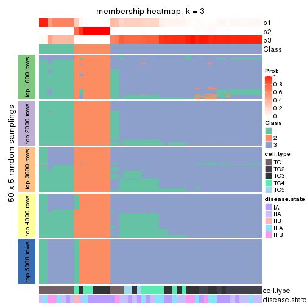</p>

</div>
<div id='tab-MAD-hclust-membership-heatmap-3'>
<pre><code class="r">membership_heatmap(res, k = 4)
</code></pre>

<p>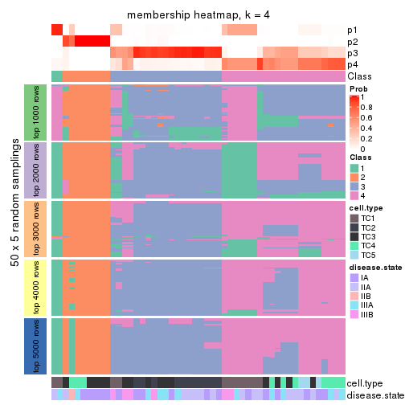</p>

</div>
<div id='tab-MAD-hclust-membership-heatmap-4'>
<pre><code class="r">membership_heatmap(res, k = 5)
</code></pre>

<p>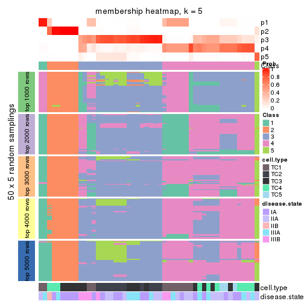</p>

</div>
<div id='tab-MAD-hclust-membership-heatmap-5'>
<pre><code class="r">membership_heatmap(res, k = 6)
</code></pre>

<p>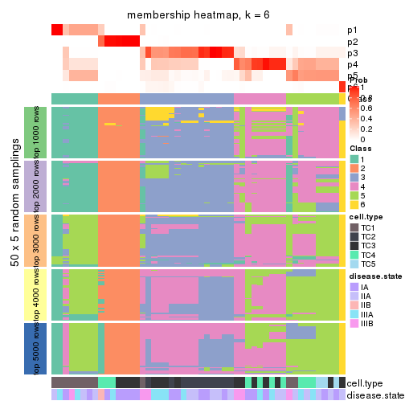</p>

</div>
</div>

As soon as we have had the classes for columns, we can look for signatures
which are significantly different between classes which can be candidate marks
for certain classes. Following are the heatmaps for signatures.


Signature heatmaps where rows are scaled:


<script>
$( function() {
	$( '#tabs-MAD-hclust-get-signatures' ).tabs();
} );
</script>
<div id='tabs-MAD-hclust-get-signatures'>
<ul>
<li><a href='#tab-MAD-hclust-get-signatures-1'>k = 2</a></li>
<li><a href='#tab-MAD-hclust-get-signatures-2'>k = 3</a></li>
<li><a href='#tab-MAD-hclust-get-signatures-3'>k = 4</a></li>
<li><a href='#tab-MAD-hclust-get-signatures-4'>k = 5</a></li>
<li><a href='#tab-MAD-hclust-get-signatures-5'>k = 6</a></li>
</ul>
<div id='tab-MAD-hclust-get-signatures-1'>
<pre><code class="r">get_signatures(res, k = 2)
</code></pre>

<p>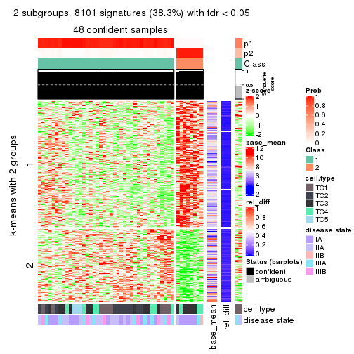</p>

</div>
<div id='tab-MAD-hclust-get-signatures-2'>
<pre><code class="r">get_signatures(res, k = 3)
</code></pre>

<p>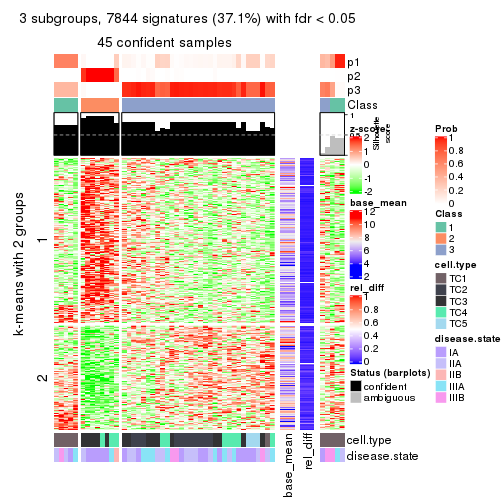</p>

</div>
<div id='tab-MAD-hclust-get-signatures-3'>
<pre><code class="r">get_signatures(res, k = 4)
</code></pre>

<p>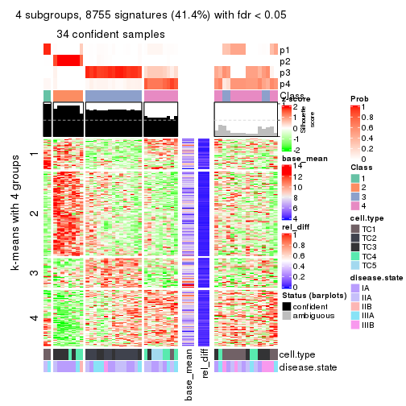</p>

</div>
<div id='tab-MAD-hclust-get-signatures-4'>
<pre><code class="r">get_signatures(res, k = 5)
</code></pre>

<p>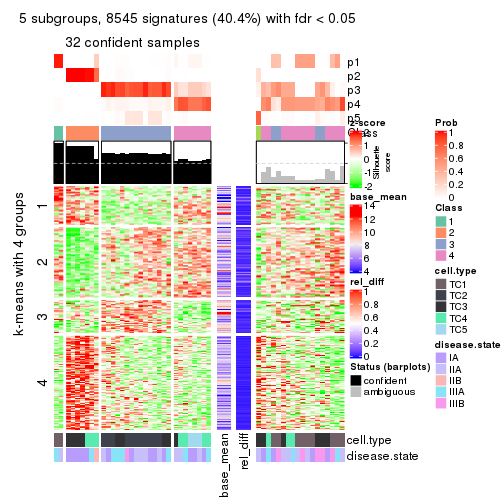</p>

</div>
<div id='tab-MAD-hclust-get-signatures-5'>
<pre><code class="r">get_signatures(res, k = 6)
</code></pre>

<p>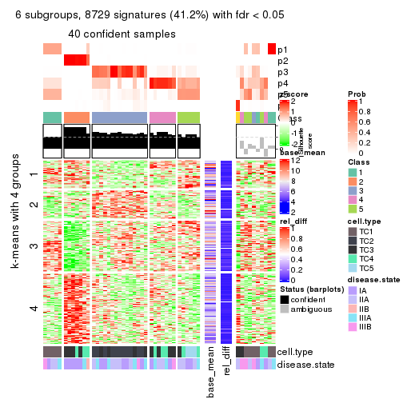</p>

</div>
</div>


Signature heatmaps where rows are not scaled:


<script>
$( function() {
	$( '#tabs-MAD-hclust-get-signatures-no-scale' ).tabs();
} );
</script>
<div id='tabs-MAD-hclust-get-signatures-no-scale'>
<ul>
<li><a href='#tab-MAD-hclust-get-signatures-no-scale-1'>k = 2</a></li>
<li><a href='#tab-MAD-hclust-get-signatures-no-scale-2'>k = 3</a></li>
<li><a href='#tab-MAD-hclust-get-signatures-no-scale-3'>k = 4</a></li>
<li><a href='#tab-MAD-hclust-get-signatures-no-scale-4'>k = 5</a></li>
<li><a href='#tab-MAD-hclust-get-signatures-no-scale-5'>k = 6</a></li>
</ul>
<div id='tab-MAD-hclust-get-signatures-no-scale-1'>
<pre><code class="r">get_signatures(res, k = 2, scale_rows = FALSE)
</code></pre>

<p>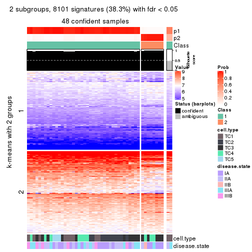</p>

</div>
<div id='tab-MAD-hclust-get-signatures-no-scale-2'>
<pre><code class="r">get_signatures(res, k = 3, scale_rows = FALSE)
</code></pre>

<p>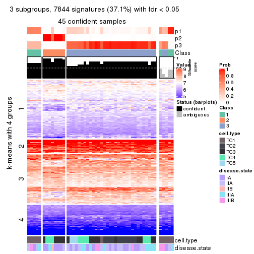</p>

</div>
<div id='tab-MAD-hclust-get-signatures-no-scale-3'>
<pre><code class="r">get_signatures(res, k = 4, scale_rows = FALSE)
</code></pre>

<p>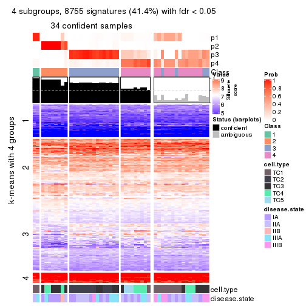</p>

</div>
<div id='tab-MAD-hclust-get-signatures-no-scale-4'>
<pre><code class="r">get_signatures(res, k = 5, scale_rows = FALSE)
</code></pre>

<p>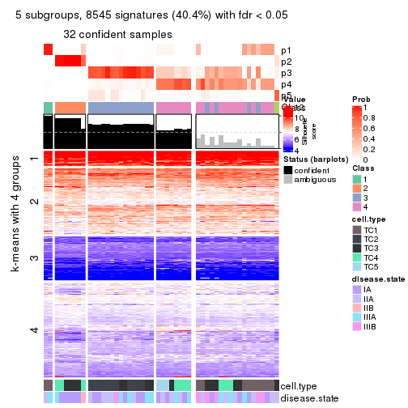</p>

</div>
<div id='tab-MAD-hclust-get-signatures-no-scale-5'>
<pre><code class="r">get_signatures(res, k = 6, scale_rows = FALSE)
</code></pre>

<p>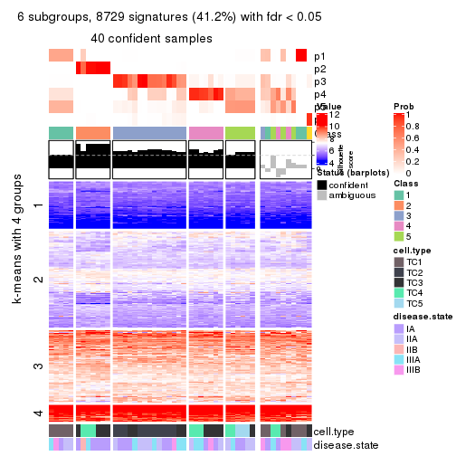</p>

</div>
</div>


Compare the overlap of signatures from different k:

```r
compare_signatures(res)
```

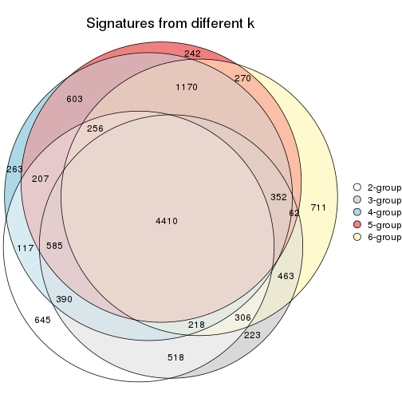

`get_signature()` returns a data frame invisibly. TO get the list of signatures, the function
call should be assigned to a variable explicitly. In following code, if `plot` argument is set
to `FALSE`, no heatmap is plotted while only the differential analysis is performed.

```r
# code only for demonstration
tb = get_signature(res, k = ..., plot = FALSE)
```

An example of the output of `tb` is:

```
#>   which_row         fdr    mean_1    mean_2 scaled_mean_1 scaled_mean_2 km
#> 1        38 0.042760348  8.373488  9.131774    -0.5533452     0.5164555  1
#> 2        40 0.018707592  7.106213  8.469186    -0.6173731     0.5762149  1
#> 3        55 0.019134737 10.221463 11.207825    -0.6159697     0.5749050  1
#> 4        59 0.006059896  5.921854  7.869574    -0.6899429     0.6439467  1
#> 5        60 0.018055526  8.928898 10.211722    -0.6204761     0.5791110  1
#> 6        98 0.009384629 15.714769 14.887706     0.6635654    -0.6193277  2
...
```

The columns in `tb` are:

1. `which_row`: row indices corresponding to the input matrix.
2. `fdr`: FDR for the differential test. 
3. `mean_x`: The mean value in group x.
4. `scaled_mean_x`: The mean value in group x after rows are scaled.
5. `km`: Row groups if k-means clustering is applied to rows.


UMAP plot which shows how samples are separated.


<script>
$( function() {
	$( '#tabs-MAD-hclust-dimension-reduction' ).tabs();
} );
</script>
<div id='tabs-MAD-hclust-dimension-reduction'>
<ul>
<li><a href='#tab-MAD-hclust-dimension-reduction-1'>k = 2</a></li>
<li><a href='#tab-MAD-hclust-dimension-reduction-2'>k = 3</a></li>
<li><a href='#tab-MAD-hclust-dimension-reduction-3'>k = 4</a></li>
<li><a href='#tab-MAD-hclust-dimension-reduction-4'>k = 5</a></li>
<li><a href='#tab-MAD-hclust-dimension-reduction-5'>k = 6</a></li>
</ul>
<div id='tab-MAD-hclust-dimension-reduction-1'>
<pre><code class="r">dimension_reduction(res, k = 2, method = &quot;UMAP&quot;)
</code></pre>

<p>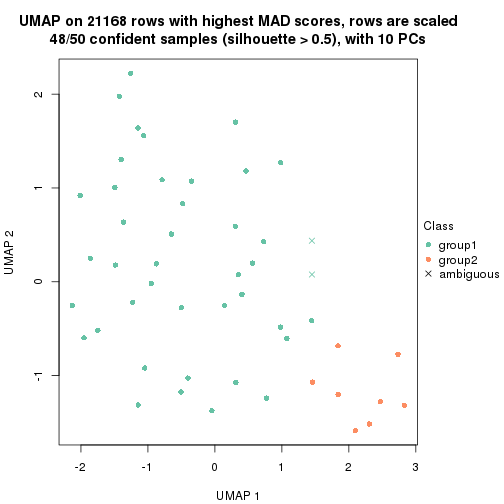</p>

</div>
<div id='tab-MAD-hclust-dimension-reduction-2'>
<pre><code class="r">dimension_reduction(res, k = 3, method = &quot;UMAP&quot;)
</code></pre>

<p>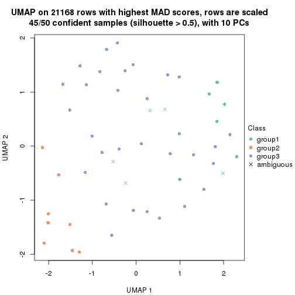</p>

</div>
<div id='tab-MAD-hclust-dimension-reduction-3'>
<pre><code class="r">dimension_reduction(res, k = 4, method = &quot;UMAP&quot;)
</code></pre>

<p>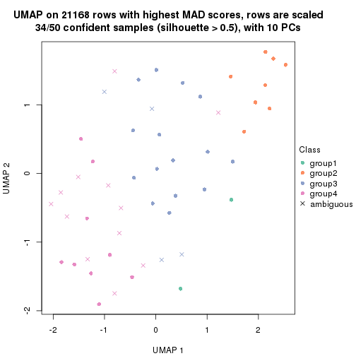</p>

</div>
<div id='tab-MAD-hclust-dimension-reduction-4'>
<pre><code class="r">dimension_reduction(res, k = 5, method = &quot;UMAP&quot;)
</code></pre>

<p>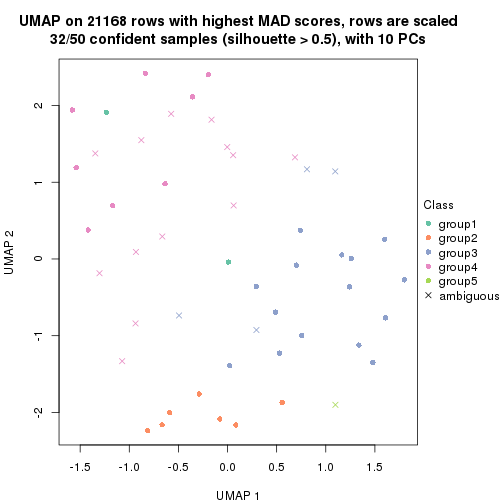</p>

</div>
<div id='tab-MAD-hclust-dimension-reduction-5'>
<pre><code class="r">dimension_reduction(res, k = 6, method = &quot;UMAP&quot;)
</code></pre>

<p>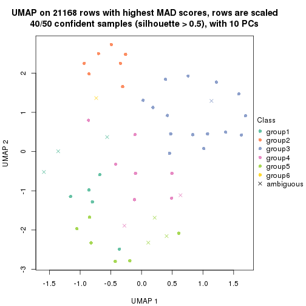</p>

</div>
</div>


Following heatmap shows how subgroups are split when increasing `k`:

```r
collect_classes(res)
```

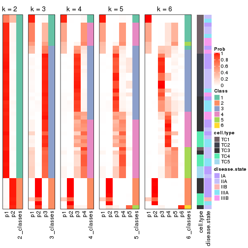


Test correlation between subgroups and known annotations. If the known
annotation is numeric, one-way ANOVA test is applied, and if the known
annotation is discrete, chi-squared contingency table test is applied.

```r
test_to_known_factors(res)
```

```
#>             n cell.type(p) disease.state(p) k
#> MAD:hclust 48     6.42e-02           0.0514 2
#> MAD:hclust 45     8.32e-07           0.2816 3
#> MAD:hclust 34     1.87e-07           0.6753 4
#> MAD:hclust 32     6.79e-09           0.5367 5
#> MAD:hclust 40     4.06e-11           0.6248 6
```


If matrix rows can be associated to genes, consider to use `functional_enrichment(res,
...)` to perform function enrichment for the signature genes. See [this vignette](http://bioconductor.org/packages/devel/bioc/vignettes/cola/inst/doc/functional_enrichment.html) for more detailed explanations.


 

---------------------------------------------------


### MAD:kmeans


The object with results only for a single top-value method and a single partition method 
can be extracted as:

```r
res = res_list["MAD", "kmeans"]
# you can also extract it by
# res = res_list["MAD:kmeans"]
```

A summary of `res` and all the functions that can be applied to it:

```r
res
```

```
#> A 'ConsensusPartition' object with k = 2, 3, 4, 5, 6.
#>   On a matrix with 21168 rows and 50 columns.
#>   Top rows (1000, 2000, 3000, 4000, 5000) are extracted by 'MAD' method.
#>   Subgroups are detected by 'kmeans' method.
#>   Performed in total 1250 partitions by row resampling.
#>   Best k for subgroups seems to be 3.
#> 
#> Following methods can be applied to this 'ConsensusPartition' object:
#>  [1] "cola_report"             "collect_classes"         "collect_plots"          
#>  [4] "collect_stats"           "colnames"                "compare_signatures"     
#>  [7] "consensus_heatmap"       "dimension_reduction"     "functional_enrichment"  
#> [10] "get_anno_col"            "get_anno"                "get_classes"            
#> [13] "get_consensus"           "get_matrix"              "get_membership"         
#> [16] "get_param"               "get_signatures"          "get_stats"              
#> [19] "is_best_k"               "is_stable_k"             "membership_heatmap"     
#> [22] "ncol"                    "nrow"                    "plot_ecdf"              
#> [25] "rownames"                "select_partition_number" "show"                   
#> [28] "suggest_best_k"          "test_to_known_factors"
```

`collect_plots()` function collects all the plots made from `res` for all `k` (number of partitions)
into one single page to provide an easy and fast comparison between different `k`.

```r
collect_plots(res)
```

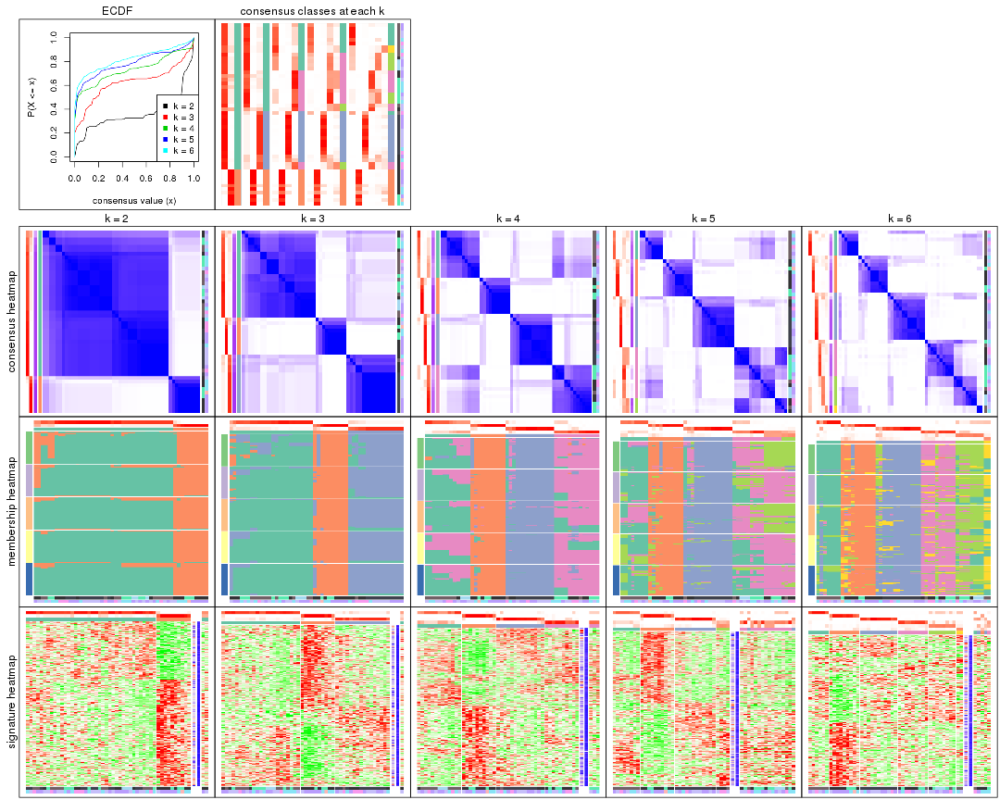

The plots are:

- The first row: a plot of the ECDF (empirical cumulative distribution
  function) curves of the consensus matrix for each `k` and the heatmap of
  predicted classes for each `k`.
- The second row: heatmaps of the consensus matrix for each `k`.
- The third row: heatmaps of the membership matrix for each `k`.
- The fouth row: heatmaps of the signatures for each `k`.

All the plots in panels can be made by individual functions and they are
plotted later in this section.

`select_partition_number()` produces several plots showing different
statistics for choosing "optimized" `k`. There are following statistics:

- ECDF curves of the consensus matrix for each `k`;
- 1-PAC. [The PAC
  score](https://en.wikipedia.org/wiki/Consensus_clustering#Over-interpretation_potential_of_consensus_clustering)
  measures the proportion of the ambiguous subgrouping.
- Mean silhouette score.
- Concordance. The mean probability of fiting the consensus class ids in all
  partitions.
- Area increased. Denote $A_k$ as the area under the ECDF curve for current
  `k`, the area increased is defined as $A_k - A_{k-1}$.
- Rand index. The percent of pairs of samples that are both in a same cluster
  or both are not in a same cluster in the partition of k and k-1.
- Jaccard index. The ratio of pairs of samples are both in a same cluster in
  the partition of k and k-1 and the pairs of samples are both in a same
  cluster in the partition k or k-1.

The detailed explanations of these statistics can be found in [the _cola_
vignette](http://bioconductor.org/packages/devel/bioc/vignettes/cola/inst/doc/cola.html#toc_13).

Generally speaking, lower PAC score, higher mean silhouette score or higher
concordance corresponds to better partition. Rand index and Jaccard index
measure how similar the current partition is compared to partition with `k-1`.
If they are too similar, we won't accept `k` is better than `k-1`.

```r
select_partition_number(res)
```

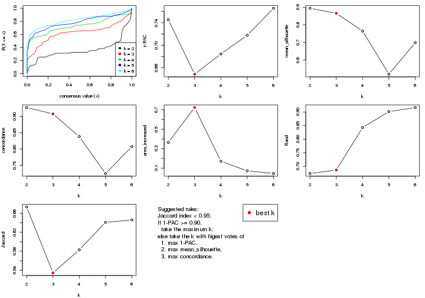

The numeric values for all these statistics can be obtained by `get_stats()`.

```r
get_stats(res)
```

```
#>   k 1-PAC mean_silhouette concordance area_increased  Rand Jaccard
#> 2 2 0.746           0.894       0.927         0.3640 0.673   0.673
#> 3 3 0.648           0.866       0.907         0.7228 0.687   0.535
#> 4 4 0.685           0.765       0.838         0.1700 0.842   0.583
#> 5 5 0.718           0.520       0.725         0.0722 0.901   0.641
#> 6 6 0.766           0.699       0.807         0.0441 0.916   0.646
```

`suggest_best_k()` suggests the best $k$ based on these statistics. The rules are as follows:

- All $k$ with Jaccard index larger than 0.95 are removed because increasing
  $k$ does not provide enough extra information. If all $k$ are removed, it is
  marked as no subgroup is detected.
- For all $k$ with 1-PAC score larger than 0.9, the maximal $k$ is taken as
  the best $k$, and other $k$ are marked as optional $k$.
- If it does not fit the second rule. The $k$ with the maximal vote of the
  highest 1-PAC score, highest mean silhouette, and highest concordance is
  taken as the best $k$.

```r
suggest_best_k(res)
```

```
#> [1] 3
```


Following shows the table of the partitions (You need to click the **show/hide
code output** link to see it). The membership matrix (columns with name `p*`)
is inferred by
[`clue::cl_consensus()`](https://www.rdocumentation.org/link/cl_consensus?package=clue)
function with the `SE` method. Basically the value in the membership matrix
represents the probability to belong to a certain group. The finall class
label for an item is determined with the group with highest probability it
belongs to.

In `get_classes()` function, the entropy is calculated from the membership
matrix and the silhouette score is calculated from the consensus matrix.


<script>
$( function() {
	$( '#tabs-MAD-kmeans-get-classes' ).tabs();
} );
</script>
<div id='tabs-MAD-kmeans-get-classes'>
<ul>
<li><a href='#tab-MAD-kmeans-get-classes-1'>k = 2</a></li>
<li><a href='#tab-MAD-kmeans-get-classes-2'>k = 3</a></li>
<li><a href='#tab-MAD-kmeans-get-classes-3'>k = 4</a></li>
<li><a href='#tab-MAD-kmeans-get-classes-4'>k = 5</a></li>
<li><a href='#tab-MAD-kmeans-get-classes-5'>k = 6</a></li>
</ul>

<div id='tab-MAD-kmeans-get-classes-1'>
<p><a id='tab-MAD-kmeans-get-classes-1-a' style='color:#0366d6' href='#'>show/hide code output</a></p>
<pre><code class="r">cbind(get_classes(res, k = 2), get_membership(res, k = 2))
</code></pre>

<pre><code>#&gt;          class entropy silhouette    p1    p2
#&gt; GSM63448     1  0.4298      0.919 0.912 0.088
#&gt; GSM63449     1  0.4431      0.920 0.908 0.092
#&gt; GSM63423     1  0.4431      0.920 0.908 0.092
#&gt; GSM63425     1  0.2236      0.921 0.964 0.036
#&gt; GSM63437     1  0.4431      0.920 0.908 0.092
#&gt; GSM63453     1  0.6973      0.853 0.812 0.188
#&gt; GSM63431     1  0.4298      0.919 0.912 0.088
#&gt; GSM63450     1  0.6973      0.853 0.812 0.188
#&gt; GSM63428     1  0.4431      0.920 0.908 0.092
#&gt; GSM63432     1  0.0376      0.915 0.996 0.004
#&gt; GSM63458     1  0.2043      0.921 0.968 0.032
#&gt; GSM63434     1  0.0938      0.914 0.988 0.012
#&gt; GSM63435     1  0.0376      0.915 0.996 0.004
#&gt; GSM63442     1  0.0376      0.915 0.996 0.004
#&gt; GSM63451     1  0.0938      0.914 0.988 0.012
#&gt; GSM63422     1  0.0376      0.915 0.996 0.004
#&gt; GSM63438     1  0.0376      0.915 0.996 0.004
#&gt; GSM63439     1  0.0376      0.915 0.996 0.004
#&gt; GSM63461     1  0.0376      0.915 0.996 0.004
#&gt; GSM63463     1  0.0376      0.915 0.996 0.004
#&gt; GSM63430     1  0.0376      0.915 0.996 0.004
#&gt; GSM63446     1  0.0938      0.914 0.988 0.012
#&gt; GSM63429     1  0.3879      0.921 0.924 0.076
#&gt; GSM63445     1  0.0672      0.916 0.992 0.008
#&gt; GSM63447     1  0.9795      0.475 0.584 0.416
#&gt; GSM63459     2  0.0000      0.964 0.000 1.000
#&gt; GSM63464     2  0.0000      0.964 0.000 1.000
#&gt; GSM63469     2  0.0000      0.964 0.000 1.000
#&gt; GSM63470     2  0.0000      0.964 0.000 1.000
#&gt; GSM63436     1  0.4298      0.919 0.912 0.088
#&gt; GSM63443     2  0.7376      0.732 0.208 0.792
#&gt; GSM63465     1  0.9795      0.475 0.584 0.416
#&gt; GSM63444     2  0.0938      0.956 0.012 0.988
#&gt; GSM63456     2  0.4022      0.896 0.080 0.920
#&gt; GSM63462     1  0.2236      0.917 0.964 0.036
#&gt; GSM63424     1  0.1184      0.913 0.984 0.016
#&gt; GSM63440     1  0.1184      0.913 0.984 0.016
#&gt; GSM63433     1  0.4431      0.919 0.908 0.092
#&gt; GSM63466     2  0.0000      0.964 0.000 1.000
#&gt; GSM63426     1  0.4431      0.919 0.908 0.092
#&gt; GSM63468     1  0.8144      0.775 0.748 0.252
#&gt; GSM63452     2  0.0000      0.964 0.000 1.000
#&gt; GSM63441     1  0.5059      0.911 0.888 0.112
#&gt; GSM63454     1  0.8144      0.775 0.748 0.252
#&gt; GSM63455     1  0.4562      0.917 0.904 0.096
#&gt; GSM63460     2  0.0000      0.964 0.000 1.000
#&gt; GSM63467     1  0.4690      0.916 0.900 0.100
#&gt; GSM63421     1  0.4298      0.919 0.912 0.088
#&gt; GSM63427     1  0.4562      0.917 0.904 0.096
#&gt; GSM63457     1  0.4431      0.919 0.908 0.092
</code></pre>

<script>
$('#tab-MAD-kmeans-get-classes-1-a').parent().next().next().hide();
$('#tab-MAD-kmeans-get-classes-1-a').click(function(){
  $('#tab-MAD-kmeans-get-classes-1-a').parent().next().next().toggle();
  return(false);
});
</script>
</div>

<div id='tab-MAD-kmeans-get-classes-2'>
<p><a id='tab-MAD-kmeans-get-classes-2-a' style='color:#0366d6' href='#'>show/hide code output</a></p>
<pre><code class="r">cbind(get_classes(res, k = 3), get_membership(res, k = 3))
</code></pre>

<pre><code>#&gt;          class entropy silhouette    p1    p2    p3
#&gt; GSM63448     1  0.1289      0.897 0.968 0.000 0.032
#&gt; GSM63449     1  0.2711      0.874 0.912 0.000 0.088
#&gt; GSM63423     1  0.2711      0.874 0.912 0.000 0.088
#&gt; GSM63425     1  0.2261      0.876 0.932 0.000 0.068
#&gt; GSM63437     1  0.2711      0.874 0.912 0.000 0.088
#&gt; GSM63453     1  0.3670      0.855 0.888 0.020 0.092
#&gt; GSM63431     1  0.1163      0.896 0.972 0.000 0.028
#&gt; GSM63450     1  0.3670      0.855 0.888 0.020 0.092
#&gt; GSM63428     1  0.2711      0.874 0.912 0.000 0.088
#&gt; GSM63432     3  0.4399      0.838 0.188 0.000 0.812
#&gt; GSM63458     1  0.1289      0.897 0.968 0.000 0.032
#&gt; GSM63434     3  0.1964      0.947 0.056 0.000 0.944
#&gt; GSM63435     3  0.1964      0.947 0.056 0.000 0.944
#&gt; GSM63442     3  0.1964      0.947 0.056 0.000 0.944
#&gt; GSM63451     3  0.1964      0.947 0.056 0.000 0.944
#&gt; GSM63422     3  0.1964      0.947 0.056 0.000 0.944
#&gt; GSM63438     3  0.1964      0.947 0.056 0.000 0.944
#&gt; GSM63439     3  0.1964      0.947 0.056 0.000 0.944
#&gt; GSM63461     3  0.1964      0.947 0.056 0.000 0.944
#&gt; GSM63463     3  0.1964      0.947 0.056 0.000 0.944
#&gt; GSM63430     3  0.1964      0.947 0.056 0.000 0.944
#&gt; GSM63446     3  0.1964      0.947 0.056 0.000 0.944
#&gt; GSM63429     1  0.4002      0.802 0.840 0.000 0.160
#&gt; GSM63445     3  0.5016      0.767 0.240 0.000 0.760
#&gt; GSM63447     1  0.6986      0.707 0.724 0.180 0.096
#&gt; GSM63459     2  0.0000      0.935 0.000 1.000 0.000
#&gt; GSM63464     2  0.0000      0.935 0.000 1.000 0.000
#&gt; GSM63469     2  0.0000      0.935 0.000 1.000 0.000
#&gt; GSM63470     2  0.0000      0.935 0.000 1.000 0.000
#&gt; GSM63436     1  0.1411      0.897 0.964 0.000 0.036
#&gt; GSM63443     2  0.4654      0.741 0.000 0.792 0.208
#&gt; GSM63465     1  0.9371      0.191 0.488 0.188 0.324
#&gt; GSM63444     2  0.0237      0.933 0.000 0.996 0.004
#&gt; GSM63456     2  0.5882      0.520 0.000 0.652 0.348
#&gt; GSM63462     3  0.5461      0.762 0.244 0.008 0.748
#&gt; GSM63424     3  0.3619      0.892 0.136 0.000 0.864
#&gt; GSM63440     3  0.3619      0.892 0.136 0.000 0.864
#&gt; GSM63433     1  0.0747      0.891 0.984 0.000 0.016
#&gt; GSM63466     2  0.0000      0.935 0.000 1.000 0.000
#&gt; GSM63426     1  0.0747      0.891 0.984 0.000 0.016
#&gt; GSM63468     1  0.5235      0.789 0.812 0.036 0.152
#&gt; GSM63452     2  0.1529      0.917 0.000 0.960 0.040
#&gt; GSM63441     1  0.4514      0.800 0.832 0.012 0.156
#&gt; GSM63454     1  0.5235      0.789 0.812 0.036 0.152
#&gt; GSM63455     1  0.0747      0.891 0.984 0.000 0.016
#&gt; GSM63460     2  0.0000      0.935 0.000 1.000 0.000
#&gt; GSM63467     1  0.2173      0.881 0.944 0.008 0.048
#&gt; GSM63421     1  0.1289      0.897 0.968 0.000 0.032
#&gt; GSM63427     1  0.1289      0.897 0.968 0.000 0.032
#&gt; GSM63457     1  0.1289      0.897 0.968 0.000 0.032
</code></pre>

<script>
$('#tab-MAD-kmeans-get-classes-2-a').parent().next().next().hide();
$('#tab-MAD-kmeans-get-classes-2-a').click(function(){
  $('#tab-MAD-kmeans-get-classes-2-a').parent().next().next().toggle();
  return(false);
});
</script>
</div>

<div id='tab-MAD-kmeans-get-classes-3'>
<p><a id='tab-MAD-kmeans-get-classes-3-a' style='color:#0366d6' href='#'>show/hide code output</a></p>
<pre><code class="r">cbind(get_classes(res, k = 4), get_membership(res, k = 4))
</code></pre>

<pre><code>#&gt;          class entropy silhouette    p1    p2    p3    p4
#&gt; GSM63448     1  0.5476      0.657 0.584 0.000 0.020 0.396
#&gt; GSM63449     1  0.4245      0.757 0.784 0.000 0.020 0.196
#&gt; GSM63423     1  0.4214      0.760 0.780 0.000 0.016 0.204
#&gt; GSM63425     4  0.1388      0.770 0.012 0.000 0.028 0.960
#&gt; GSM63437     1  0.4214      0.760 0.780 0.000 0.016 0.204
#&gt; GSM63453     1  0.2002      0.627 0.936 0.020 0.000 0.044
#&gt; GSM63431     1  0.3649      0.757 0.796 0.000 0.000 0.204
#&gt; GSM63450     1  0.2002      0.627 0.936 0.020 0.000 0.044
#&gt; GSM63428     1  0.4245      0.757 0.784 0.000 0.020 0.196
#&gt; GSM63432     3  0.4673      0.634 0.292 0.000 0.700 0.008
#&gt; GSM63458     1  0.4585      0.710 0.668 0.000 0.000 0.332
#&gt; GSM63434     3  0.0000      0.927 0.000 0.000 1.000 0.000
#&gt; GSM63435     3  0.0657      0.927 0.012 0.000 0.984 0.004
#&gt; GSM63442     3  0.0657      0.927 0.012 0.000 0.984 0.004
#&gt; GSM63451     3  0.0000      0.927 0.000 0.000 1.000 0.000
#&gt; GSM63422     3  0.0657      0.927 0.012 0.000 0.984 0.004
#&gt; GSM63438     3  0.0376      0.928 0.004 0.000 0.992 0.004
#&gt; GSM63439     3  0.0188      0.928 0.000 0.000 0.996 0.004
#&gt; GSM63461     3  0.0524      0.927 0.008 0.000 0.988 0.004
#&gt; GSM63463     3  0.0376      0.928 0.004 0.000 0.992 0.004
#&gt; GSM63430     3  0.0188      0.928 0.000 0.000 0.996 0.004
#&gt; GSM63446     3  0.0000      0.927 0.000 0.000 1.000 0.000
#&gt; GSM63429     4  0.0524      0.775 0.004 0.000 0.008 0.988
#&gt; GSM63445     3  0.4426      0.781 0.096 0.000 0.812 0.092
#&gt; GSM63447     4  0.1004      0.771 0.000 0.024 0.004 0.972
#&gt; GSM63459     2  0.0000      0.938 0.000 1.000 0.000 0.000
#&gt; GSM63464     2  0.0000      0.938 0.000 1.000 0.000 0.000
#&gt; GSM63469     2  0.0000      0.938 0.000 1.000 0.000 0.000
#&gt; GSM63470     2  0.0000      0.938 0.000 1.000 0.000 0.000
#&gt; GSM63436     1  0.4996      0.535 0.516 0.000 0.000 0.484
#&gt; GSM63443     2  0.4728      0.710 0.032 0.752 0.216 0.000
#&gt; GSM63465     4  0.3274      0.717 0.004 0.056 0.056 0.884
#&gt; GSM63444     2  0.0844      0.931 0.004 0.980 0.012 0.004
#&gt; GSM63456     2  0.5486      0.717 0.076 0.732 0.188 0.004
#&gt; GSM63462     3  0.5822      0.502 0.048 0.004 0.652 0.296
#&gt; GSM63424     4  0.3907      0.587 0.000 0.000 0.232 0.768
#&gt; GSM63440     4  0.3649      0.622 0.000 0.000 0.204 0.796
#&gt; GSM63433     4  0.4008      0.489 0.244 0.000 0.000 0.756
#&gt; GSM63466     2  0.0000      0.938 0.000 1.000 0.000 0.000
#&gt; GSM63426     4  0.4008      0.489 0.244 0.000 0.000 0.756
#&gt; GSM63468     4  0.0712      0.778 0.004 0.004 0.008 0.984
#&gt; GSM63452     2  0.1792      0.908 0.068 0.932 0.000 0.000
#&gt; GSM63441     4  0.0524      0.778 0.000 0.004 0.008 0.988
#&gt; GSM63454     4  0.0712      0.778 0.004 0.004 0.008 0.984
#&gt; GSM63455     4  0.4072      0.482 0.252 0.000 0.000 0.748
#&gt; GSM63460     2  0.0000      0.938 0.000 1.000 0.000 0.000
#&gt; GSM63467     4  0.4198      0.521 0.224 0.004 0.004 0.768
#&gt; GSM63421     1  0.4977      0.577 0.540 0.000 0.000 0.460
#&gt; GSM63427     1  0.4981      0.570 0.536 0.000 0.000 0.464
#&gt; GSM63457     1  0.4981      0.570 0.536 0.000 0.000 0.464
</code></pre>

<script>
$('#tab-MAD-kmeans-get-classes-3-a').parent().next().next().hide();
$('#tab-MAD-kmeans-get-classes-3-a').click(function(){
  $('#tab-MAD-kmeans-get-classes-3-a').parent().next().next().toggle();
  return(false);
});
</script>
</div>

<div id='tab-MAD-kmeans-get-classes-4'>
<p><a id='tab-MAD-kmeans-get-classes-4-a' style='color:#0366d6' href='#'>show/hide code output</a></p>
<pre><code class="r">cbind(get_classes(res, k = 5), get_membership(res, k = 5))
</code></pre>

<pre><code>#&gt;          class entropy silhouette    p1    p2    p3    p4    p5
#&gt; GSM63448     1  0.5905     0.5853 0.612 0.000 0.012 0.264 0.112
#&gt; GSM63449     1  0.3778     0.7907 0.788 0.000 0.012 0.188 0.012
#&gt; GSM63423     1  0.3778     0.7907 0.788 0.000 0.012 0.188 0.012
#&gt; GSM63425     5  0.5126     0.7982 0.008 0.000 0.024 0.432 0.536
#&gt; GSM63437     1  0.3778     0.7907 0.788 0.000 0.012 0.188 0.012
#&gt; GSM63453     1  0.5086     0.5501 0.688 0.004 0.000 0.080 0.228
#&gt; GSM63431     1  0.3707     0.7043 0.716 0.000 0.000 0.284 0.000
#&gt; GSM63450     1  0.5113     0.5472 0.684 0.004 0.000 0.080 0.232
#&gt; GSM63428     1  0.3778     0.7907 0.788 0.000 0.012 0.188 0.012
#&gt; GSM63432     3  0.5455     0.3541 0.372 0.000 0.572 0.012 0.044
#&gt; GSM63458     4  0.4876    -0.1382 0.396 0.000 0.000 0.576 0.028
#&gt; GSM63434     3  0.1671     0.8723 0.000 0.000 0.924 0.000 0.076
#&gt; GSM63435     3  0.0290     0.8849 0.000 0.000 0.992 0.000 0.008
#&gt; GSM63442     3  0.0290     0.8849 0.000 0.000 0.992 0.000 0.008
#&gt; GSM63451     3  0.1341     0.8742 0.000 0.000 0.944 0.000 0.056
#&gt; GSM63422     3  0.0290     0.8849 0.000 0.000 0.992 0.000 0.008
#&gt; GSM63438     3  0.0162     0.8853 0.000 0.000 0.996 0.000 0.004
#&gt; GSM63439     3  0.1043     0.8793 0.000 0.000 0.960 0.000 0.040
#&gt; GSM63461     3  0.0000     0.8854 0.000 0.000 1.000 0.000 0.000
#&gt; GSM63463     3  0.0000     0.8854 0.000 0.000 1.000 0.000 0.000
#&gt; GSM63430     3  0.0963     0.8802 0.000 0.000 0.964 0.000 0.036
#&gt; GSM63446     3  0.1732     0.8638 0.000 0.000 0.920 0.000 0.080
#&gt; GSM63429     4  0.4562    -0.7533 0.000 0.000 0.008 0.500 0.492
#&gt; GSM63445     3  0.5788     0.5781 0.040 0.000 0.648 0.248 0.064
#&gt; GSM63447     4  0.4913    -0.7488 0.000 0.012 0.008 0.492 0.488
#&gt; GSM63459     2  0.0566     0.8939 0.004 0.984 0.000 0.000 0.012
#&gt; GSM63464     2  0.0404     0.8935 0.000 0.988 0.000 0.000 0.012
#&gt; GSM63469     2  0.0566     0.8939 0.004 0.984 0.000 0.000 0.012
#&gt; GSM63470     2  0.0566     0.8939 0.004 0.984 0.000 0.000 0.012
#&gt; GSM63436     4  0.5104     0.1434 0.284 0.000 0.000 0.648 0.068
#&gt; GSM63443     2  0.5155     0.6744 0.016 0.716 0.204 0.008 0.056
#&gt; GSM63465     5  0.5049     0.7786 0.000 0.016 0.012 0.424 0.548
#&gt; GSM63444     2  0.2548     0.8494 0.000 0.876 0.004 0.004 0.116
#&gt; GSM63456     2  0.6969     0.6151 0.072 0.580 0.128 0.004 0.216
#&gt; GSM63462     3  0.6605     0.3953 0.020 0.004 0.516 0.340 0.120
#&gt; GSM63424     5  0.5343     0.8428 0.000 0.000 0.068 0.340 0.592
#&gt; GSM63440     5  0.5353     0.8600 0.000 0.000 0.064 0.360 0.576
#&gt; GSM63433     4  0.1399     0.3377 0.028 0.000 0.000 0.952 0.020
#&gt; GSM63466     2  0.0290     0.8935 0.000 0.992 0.000 0.000 0.008
#&gt; GSM63426     4  0.1399     0.3377 0.028 0.000 0.000 0.952 0.020
#&gt; GSM63468     4  0.4704    -0.7346 0.000 0.004 0.008 0.508 0.480
#&gt; GSM63452     2  0.3590     0.8136 0.080 0.828 0.000 0.000 0.092
#&gt; GSM63441     4  0.4704    -0.7346 0.000 0.004 0.008 0.508 0.480
#&gt; GSM63454     4  0.4705    -0.7350 0.000 0.004 0.008 0.504 0.484
#&gt; GSM63455     4  0.0963     0.3452 0.036 0.000 0.000 0.964 0.000
#&gt; GSM63460     2  0.0510     0.8928 0.000 0.984 0.000 0.000 0.016
#&gt; GSM63467     4  0.3127     0.1710 0.020 0.004 0.000 0.848 0.128
#&gt; GSM63421     4  0.4891     0.0964 0.316 0.000 0.000 0.640 0.044
#&gt; GSM63427     4  0.4866     0.1350 0.284 0.000 0.000 0.664 0.052
#&gt; GSM63457     4  0.4873     0.1034 0.312 0.000 0.000 0.644 0.044
</code></pre>

<script>
$('#tab-MAD-kmeans-get-classes-4-a').parent().next().next().hide();
$('#tab-MAD-kmeans-get-classes-4-a').click(function(){
  $('#tab-MAD-kmeans-get-classes-4-a').parent().next().next().toggle();
  return(false);
});
</script>
</div>

<div id='tab-MAD-kmeans-get-classes-5'>
<p><a id='tab-MAD-kmeans-get-classes-5-a' style='color:#0366d6' href='#'>show/hide code output</a></p>
<pre><code class="r">cbind(get_classes(res, k = 6), get_membership(res, k = 6))
</code></pre>

<pre><code>#&gt;          class entropy silhouette    p1    p2    p3    p4    p5    p6
#&gt; GSM63448     1  0.3225     0.6178 0.856 0.000 0.012 0.080 0.024 0.028
#&gt; GSM63449     1  0.0363     0.7323 0.988 0.000 0.012 0.000 0.000 0.000
#&gt; GSM63423     1  0.0363     0.7323 0.988 0.000 0.012 0.000 0.000 0.000
#&gt; GSM63425     4  0.4768     0.7177 0.004 0.000 0.004 0.700 0.160 0.132
#&gt; GSM63437     1  0.0363     0.7323 0.988 0.000 0.012 0.000 0.000 0.000
#&gt; GSM63453     6  0.5438     1.0000 0.308 0.000 0.000 0.024 0.084 0.584
#&gt; GSM63431     1  0.2703     0.5211 0.824 0.000 0.000 0.000 0.172 0.004
#&gt; GSM63450     6  0.5438     1.0000 0.308 0.000 0.000 0.024 0.084 0.584
#&gt; GSM63428     1  0.0363     0.7323 0.988 0.000 0.012 0.000 0.000 0.000
#&gt; GSM63432     1  0.5245    -0.0513 0.472 0.000 0.464 0.008 0.012 0.044
#&gt; GSM63458     5  0.4897     0.5877 0.312 0.000 0.000 0.036 0.624 0.028
#&gt; GSM63434     3  0.3224     0.8076 0.000 0.000 0.828 0.008 0.036 0.128
#&gt; GSM63435     3  0.0820     0.8521 0.000 0.000 0.972 0.000 0.016 0.012
#&gt; GSM63442     3  0.0820     0.8521 0.000 0.000 0.972 0.000 0.016 0.012
#&gt; GSM63451     3  0.2373     0.8216 0.000 0.000 0.888 0.004 0.024 0.084
#&gt; GSM63422     3  0.0820     0.8521 0.000 0.000 0.972 0.000 0.016 0.012
#&gt; GSM63438     3  0.0603     0.8531 0.000 0.000 0.980 0.000 0.004 0.016
#&gt; GSM63439     3  0.1692     0.8415 0.000 0.000 0.932 0.008 0.012 0.048
#&gt; GSM63461     3  0.0000     0.8546 0.000 0.000 1.000 0.000 0.000 0.000
#&gt; GSM63463     3  0.0000     0.8546 0.000 0.000 1.000 0.000 0.000 0.000
#&gt; GSM63430     3  0.1757     0.8411 0.000 0.000 0.928 0.008 0.012 0.052
#&gt; GSM63446     3  0.3327     0.7862 0.000 0.000 0.832 0.020 0.036 0.112
#&gt; GSM63429     4  0.2822     0.7891 0.008 0.000 0.000 0.868 0.056 0.068
#&gt; GSM63445     3  0.5342     0.3607 0.004 0.000 0.528 0.004 0.380 0.084
#&gt; GSM63447     4  0.1994     0.7937 0.004 0.008 0.000 0.920 0.052 0.016
#&gt; GSM63459     2  0.0520     0.8389 0.000 0.984 0.000 0.000 0.008 0.008
#&gt; GSM63464     2  0.1218     0.8363 0.000 0.956 0.000 0.004 0.028 0.012
#&gt; GSM63469     2  0.0520     0.8389 0.000 0.984 0.000 0.000 0.008 0.008
#&gt; GSM63470     2  0.0520     0.8389 0.000 0.984 0.000 0.000 0.008 0.008
#&gt; GSM63436     5  0.5242     0.6962 0.280 0.000 0.000 0.060 0.624 0.036
#&gt; GSM63443     2  0.5795     0.5505 0.000 0.644 0.176 0.004 0.096 0.080
#&gt; GSM63465     4  0.2546     0.7665 0.004 0.012 0.008 0.900 0.032 0.044
#&gt; GSM63444     2  0.4791     0.6931 0.000 0.732 0.016 0.020 0.076 0.156
#&gt; GSM63456     2  0.6887     0.3853 0.000 0.476 0.128 0.020 0.064 0.312
#&gt; GSM63462     3  0.7290     0.1594 0.000 0.000 0.384 0.148 0.308 0.160
#&gt; GSM63424     4  0.4239     0.7101 0.004 0.000 0.012 0.760 0.072 0.152
#&gt; GSM63440     4  0.4019     0.7237 0.004 0.000 0.012 0.780 0.064 0.140
#&gt; GSM63433     5  0.4959     0.5492 0.072 0.000 0.000 0.304 0.616 0.008
#&gt; GSM63466     2  0.0653     0.8391 0.000 0.980 0.000 0.004 0.004 0.012
#&gt; GSM63426     5  0.4943     0.5552 0.072 0.000 0.000 0.300 0.620 0.008
#&gt; GSM63468     4  0.1901     0.7917 0.004 0.000 0.000 0.912 0.076 0.008
#&gt; GSM63452     2  0.2664     0.7324 0.000 0.816 0.000 0.000 0.000 0.184
#&gt; GSM63441     4  0.1788     0.7924 0.004 0.000 0.000 0.916 0.076 0.004
#&gt; GSM63454     4  0.1956     0.7913 0.004 0.000 0.000 0.908 0.080 0.008
#&gt; GSM63455     5  0.4797     0.5728 0.060 0.000 0.000 0.280 0.648 0.012
#&gt; GSM63460     2  0.0964     0.8383 0.000 0.968 0.000 0.004 0.016 0.012
#&gt; GSM63467     4  0.5754    -0.1464 0.068 0.004 0.000 0.488 0.408 0.032
#&gt; GSM63421     5  0.4778     0.6987 0.284 0.000 0.000 0.028 0.652 0.036
#&gt; GSM63427     5  0.4744     0.6970 0.264 0.000 0.000 0.028 0.668 0.040
#&gt; GSM63457     5  0.4778     0.6987 0.284 0.000 0.000 0.028 0.652 0.036
</code></pre>

<script>
$('#tab-MAD-kmeans-get-classes-5-a').parent().next().next().hide();
$('#tab-MAD-kmeans-get-classes-5-a').click(function(){
  $('#tab-MAD-kmeans-get-classes-5-a').parent().next().next().toggle();
  return(false);
});
</script>
</div>
</div>

Heatmaps for the consensus matrix. It visualizes the probability of two
samples to be in a same group.


<script>
$( function() {
	$( '#tabs-MAD-kmeans-consensus-heatmap' ).tabs();
} );
</script>
<div id='tabs-MAD-kmeans-consensus-heatmap'>
<ul>
<li><a href='#tab-MAD-kmeans-consensus-heatmap-1'>k = 2</a></li>
<li><a href='#tab-MAD-kmeans-consensus-heatmap-2'>k = 3</a></li>
<li><a href='#tab-MAD-kmeans-consensus-heatmap-3'>k = 4</a></li>
<li><a href='#tab-MAD-kmeans-consensus-heatmap-4'>k = 5</a></li>
<li><a href='#tab-MAD-kmeans-consensus-heatmap-5'>k = 6</a></li>
</ul>
<div id='tab-MAD-kmeans-consensus-heatmap-1'>
<pre><code class="r">consensus_heatmap(res, k = 2)
</code></pre>

<p>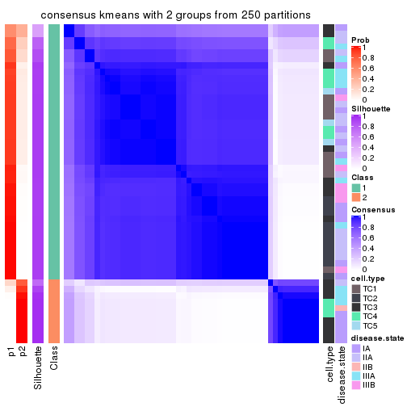</p>

</div>
<div id='tab-MAD-kmeans-consensus-heatmap-2'>
<pre><code class="r">consensus_heatmap(res, k = 3)
</code></pre>

<p>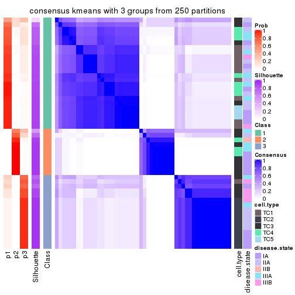</p>

</div>
<div id='tab-MAD-kmeans-consensus-heatmap-3'>
<pre><code class="r">consensus_heatmap(res, k = 4)
</code></pre>

<p>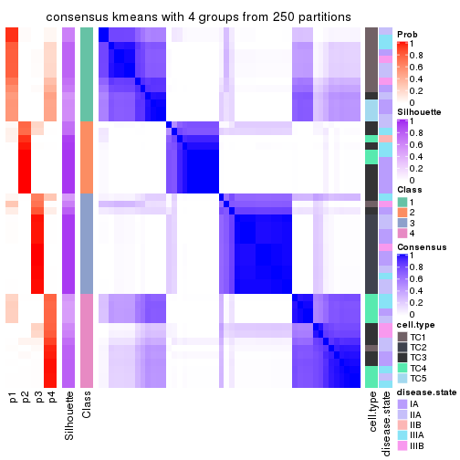</p>

</div>
<div id='tab-MAD-kmeans-consensus-heatmap-4'>
<pre><code class="r">consensus_heatmap(res, k = 5)
</code></pre>

<p>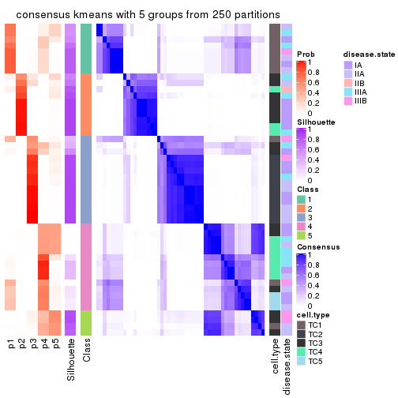</p>

</div>
<div id='tab-MAD-kmeans-consensus-heatmap-5'>
<pre><code class="r">consensus_heatmap(res, k = 6)
</code></pre>

<p>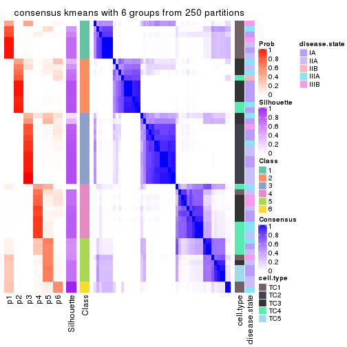</p>

</div>
</div>

Heatmaps for the membership of samples in all partitions to see how consistent they are:


<script>
$( function() {
	$( '#tabs-MAD-kmeans-membership-heatmap' ).tabs();
} );
</script>
<div id='tabs-MAD-kmeans-membership-heatmap'>
<ul>
<li><a href='#tab-MAD-kmeans-membership-heatmap-1'>k = 2</a></li>
<li><a href='#tab-MAD-kmeans-membership-heatmap-2'>k = 3</a></li>
<li><a href='#tab-MAD-kmeans-membership-heatmap-3'>k = 4</a></li>
<li><a href='#tab-MAD-kmeans-membership-heatmap-4'>k = 5</a></li>
<li><a href='#tab-MAD-kmeans-membership-heatmap-5'>k = 6</a></li>
</ul>
<div id='tab-MAD-kmeans-membership-heatmap-1'>
<pre><code class="r">membership_heatmap(res, k = 2)
</code></pre>

<p>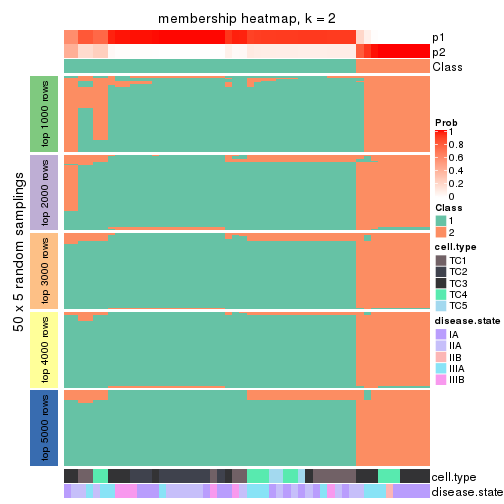</p>

</div>
<div id='tab-MAD-kmeans-membership-heatmap-2'>
<pre><code class="r">membership_heatmap(res, k = 3)
</code></pre>

<p>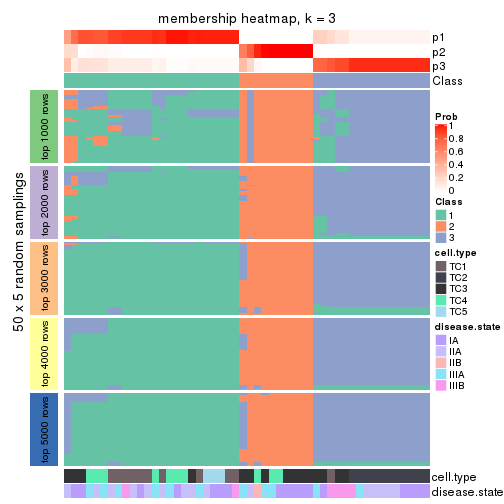</p>

</div>
<div id='tab-MAD-kmeans-membership-heatmap-3'>
<pre><code class="r">membership_heatmap(res, k = 4)
</code></pre>

<p>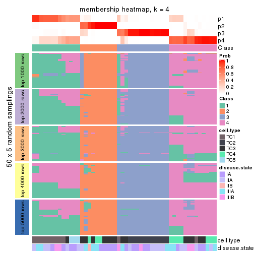</p>

</div>
<div id='tab-MAD-kmeans-membership-heatmap-4'>
<pre><code class="r">membership_heatmap(res, k = 5)
</code></pre>

<p>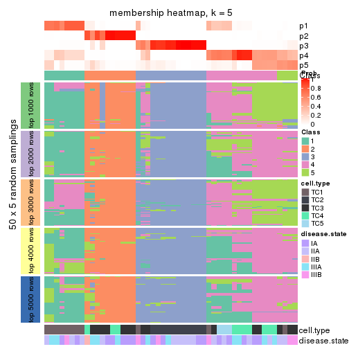</p>

</div>
<div id='tab-MAD-kmeans-membership-heatmap-5'>
<pre><code class="r">membership_heatmap(res, k = 6)
</code></pre>

<p>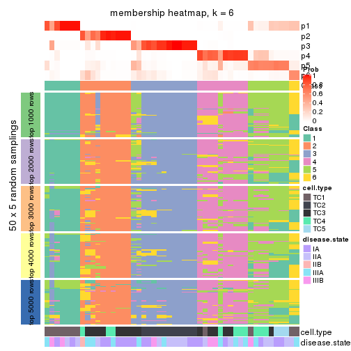</p>

</div>
</div>

As soon as we have had the classes for columns, we can look for signatures
which are significantly different between classes which can be candidate marks
for certain classes. Following are the heatmaps for signatures.


Signature heatmaps where rows are scaled:


<script>
$( function() {
	$( '#tabs-MAD-kmeans-get-signatures' ).tabs();
} );
</script>
<div id='tabs-MAD-kmeans-get-signatures'>
<ul>
<li><a href='#tab-MAD-kmeans-get-signatures-1'>k = 2</a></li>
<li><a href='#tab-MAD-kmeans-get-signatures-2'>k = 3</a></li>
<li><a href='#tab-MAD-kmeans-get-signatures-3'>k = 4</a></li>
<li><a href='#tab-MAD-kmeans-get-signatures-4'>k = 5</a></li>
<li><a href='#tab-MAD-kmeans-get-signatures-5'>k = 6</a></li>
</ul>
<div id='tab-MAD-kmeans-get-signatures-1'>
<pre><code class="r">get_signatures(res, k = 2)
</code></pre>

<p>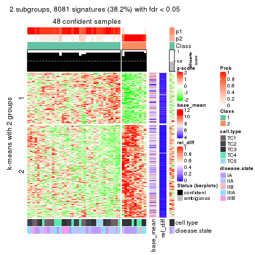</p>

</div>
<div id='tab-MAD-kmeans-get-signatures-2'>
<pre><code class="r">get_signatures(res, k = 3)
</code></pre>

<p>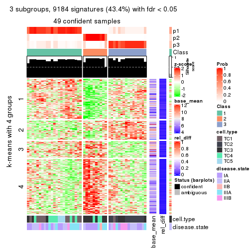</p>

</div>
<div id='tab-MAD-kmeans-get-signatures-3'>
<pre><code class="r">get_signatures(res, k = 4)
</code></pre>

<p>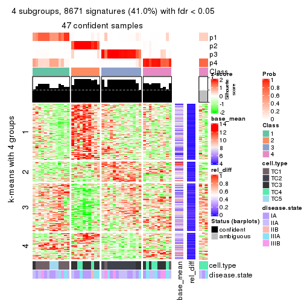</p>

</div>
<div id='tab-MAD-kmeans-get-signatures-4'>
<pre><code class="r">get_signatures(res, k = 5)
</code></pre>

<p>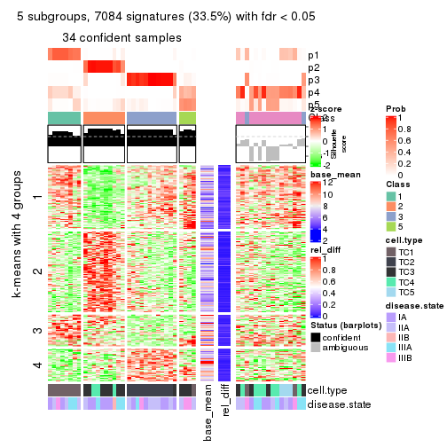</p>

</div>
<div id='tab-MAD-kmeans-get-signatures-5'>
<pre><code class="r">get_signatures(res, k = 6)
</code></pre>

<p>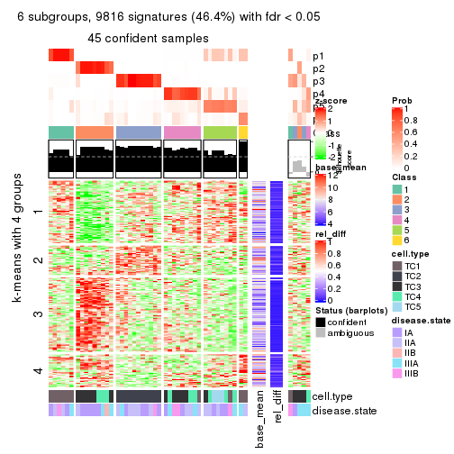</p>

</div>
</div>


Signature heatmaps where rows are not scaled:


<script>
$( function() {
	$( '#tabs-MAD-kmeans-get-signatures-no-scale' ).tabs();
} );
</script>
<div id='tabs-MAD-kmeans-get-signatures-no-scale'>
<ul>
<li><a href='#tab-MAD-kmeans-get-signatures-no-scale-1'>k = 2</a></li>
<li><a href='#tab-MAD-kmeans-get-signatures-no-scale-2'>k = 3</a></li>
<li><a href='#tab-MAD-kmeans-get-signatures-no-scale-3'>k = 4</a></li>
<li><a href='#tab-MAD-kmeans-get-signatures-no-scale-4'>k = 5</a></li>
<li><a href='#tab-MAD-kmeans-get-signatures-no-scale-5'>k = 6</a></li>
</ul>
<div id='tab-MAD-kmeans-get-signatures-no-scale-1'>
<pre><code class="r">get_signatures(res, k = 2, scale_rows = FALSE)
</code></pre>

<p>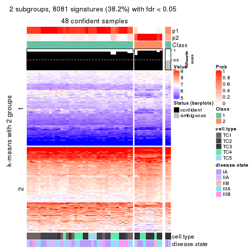</p>

</div>
<div id='tab-MAD-kmeans-get-signatures-no-scale-2'>
<pre><code class="r">get_signatures(res, k = 3, scale_rows = FALSE)
</code></pre>

<p>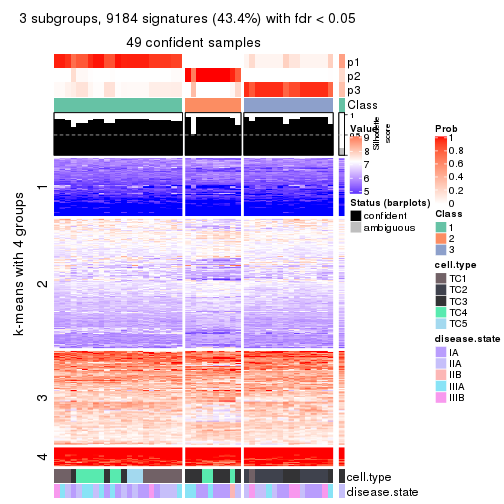</p>

</div>
<div id='tab-MAD-kmeans-get-signatures-no-scale-3'>
<pre><code class="r">get_signatures(res, k = 4, scale_rows = FALSE)
</code></pre>

<p>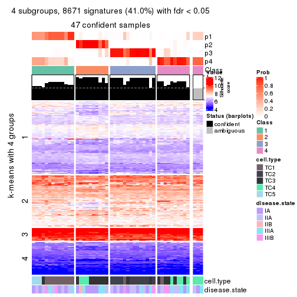</p>

</div>
<div id='tab-MAD-kmeans-get-signatures-no-scale-4'>
<pre><code class="r">get_signatures(res, k = 5, scale_rows = FALSE)
</code></pre>

<p>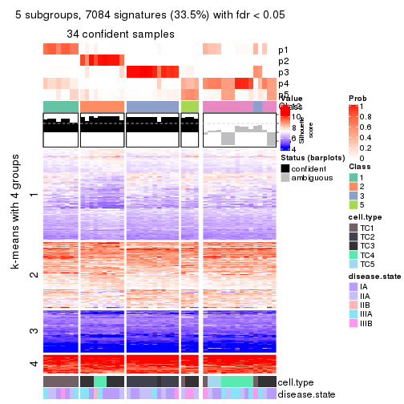</p>

</div>
<div id='tab-MAD-kmeans-get-signatures-no-scale-5'>
<pre><code class="r">get_signatures(res, k = 6, scale_rows = FALSE)
</code></pre>

<p>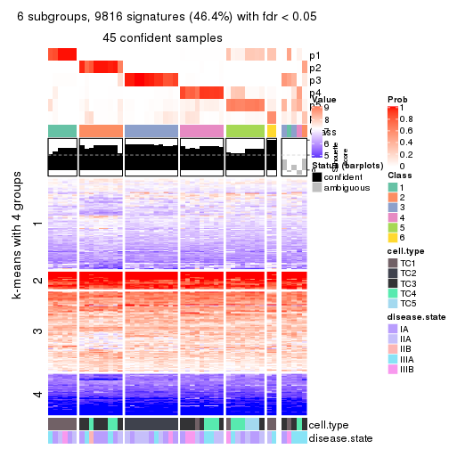</p>

</div>
</div>


Compare the overlap of signatures from different k:

```r
compare_signatures(res)
```

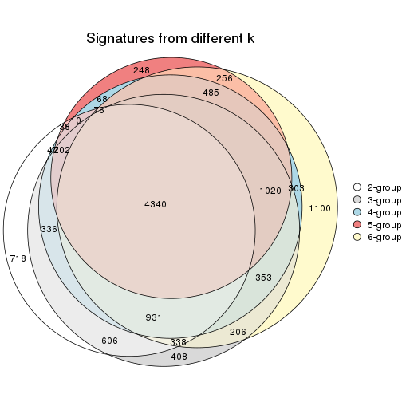

`get_signature()` returns a data frame invisibly. TO get the list of signatures, the function
call should be assigned to a variable explicitly. In following code, if `plot` argument is set
to `FALSE`, no heatmap is plotted while only the differential analysis is performed.

```r
# code only for demonstration
tb = get_signature(res, k = ..., plot = FALSE)
```

An example of the output of `tb` is:

```
#>   which_row         fdr    mean_1    mean_2 scaled_mean_1 scaled_mean_2 km
#> 1        38 0.042760348  8.373488  9.131774    -0.5533452     0.5164555  1
#> 2        40 0.018707592  7.106213  8.469186    -0.6173731     0.5762149  1
#> 3        55 0.019134737 10.221463 11.207825    -0.6159697     0.5749050  1
#> 4        59 0.006059896  5.921854  7.869574    -0.6899429     0.6439467  1
#> 5        60 0.018055526  8.928898 10.211722    -0.6204761     0.5791110  1
#> 6        98 0.009384629 15.714769 14.887706     0.6635654    -0.6193277  2
...
```

The columns in `tb` are:

1. `which_row`: row indices corresponding to the input matrix.
2. `fdr`: FDR for the differential test. 
3. `mean_x`: The mean value in group x.
4. `scaled_mean_x`: The mean value in group x after rows are scaled.
5. `km`: Row groups if k-means clustering is applied to rows.


UMAP plot which shows how samples are separated.


<script>
$( function() {
	$( '#tabs-MAD-kmeans-dimension-reduction' ).tabs();
} );
</script>
<div id='tabs-MAD-kmeans-dimension-reduction'>
<ul>
<li><a href='#tab-MAD-kmeans-dimension-reduction-1'>k = 2</a></li>
<li><a href='#tab-MAD-kmeans-dimension-reduction-2'>k = 3</a></li>
<li><a href='#tab-MAD-kmeans-dimension-reduction-3'>k = 4</a></li>
<li><a href='#tab-MAD-kmeans-dimension-reduction-4'>k = 5</a></li>
<li><a href='#tab-MAD-kmeans-dimension-reduction-5'>k = 6</a></li>
</ul>
<div id='tab-MAD-kmeans-dimension-reduction-1'>
<pre><code class="r">dimension_reduction(res, k = 2, method = &quot;UMAP&quot;)
</code></pre>

<p>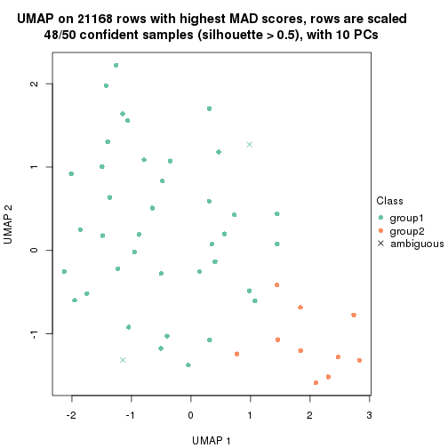</p>

</div>
<div id='tab-MAD-kmeans-dimension-reduction-2'>
<pre><code class="r">dimension_reduction(res, k = 3, method = &quot;UMAP&quot;)
</code></pre>

<p>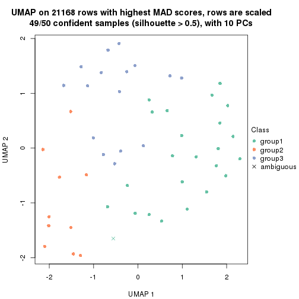</p>

</div>
<div id='tab-MAD-kmeans-dimension-reduction-3'>
<pre><code class="r">dimension_reduction(res, k = 4, method = &quot;UMAP&quot;)
</code></pre>

<p>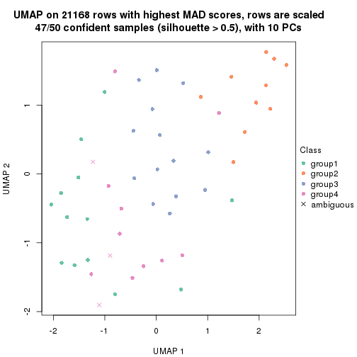</p>

</div>
<div id='tab-MAD-kmeans-dimension-reduction-4'>
<pre><code class="r">dimension_reduction(res, k = 5, method = &quot;UMAP&quot;)
</code></pre>

<p>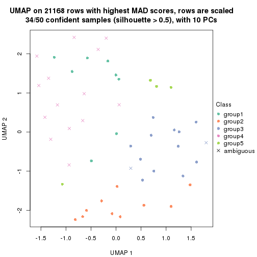</p>

</div>
<div id='tab-MAD-kmeans-dimension-reduction-5'>
<pre><code class="r">dimension_reduction(res, k = 6, method = &quot;UMAP&quot;)
</code></pre>

<p>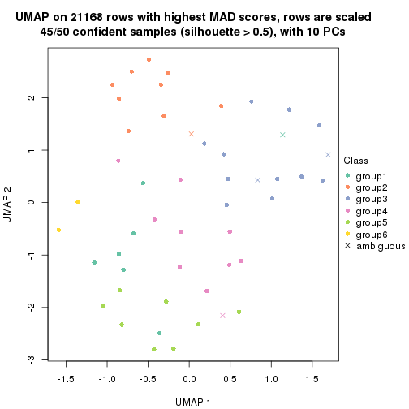</p>

</div>
</div>


Following heatmap shows how subgroups are split when increasing `k`:

```r
collect_classes(res)
```

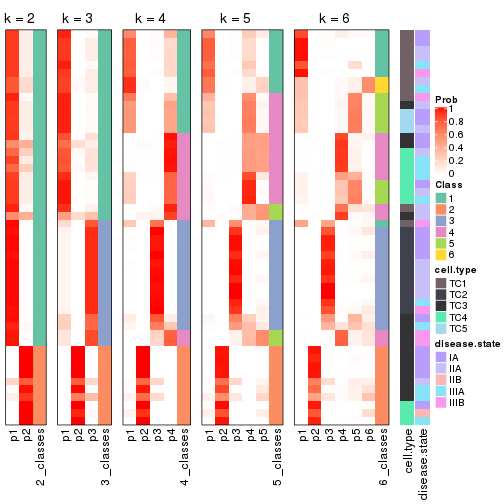


Test correlation between subgroups and known annotations. If the known
annotation is numeric, one-way ANOVA test is applied, and if the known
annotation is discrete, chi-squared contingency table test is applied.

```r
test_to_known_factors(res)
```

```
#>             n cell.type(p) disease.state(p) k
#> MAD:kmeans 48     3.48e-03           0.0812 2
#> MAD:kmeans 49     1.18e-07           0.2023 3
#> MAD:kmeans 47     4.45e-10           0.6231 4
#> MAD:kmeans 34     9.03e-10           0.2008 5
#> MAD:kmeans 45     8.15e-12           0.8928 6
```


If matrix rows can be associated to genes, consider to use `functional_enrichment(res,
...)` to perform function enrichment for the signature genes. See [this vignette](http://bioconductor.org/packages/devel/bioc/vignettes/cola/inst/doc/functional_enrichment.html) for more detailed explanations.


 

---------------------------------------------------


### MAD:skmeans


The object with results only for a single top-value method and a single partition method 
can be extracted as:

```r
res = res_list["MAD", "skmeans"]
# you can also extract it by
# res = res_list["MAD:skmeans"]
```

A summary of `res` and all the functions that can be applied to it:

```r
res
```

```
#> A 'ConsensusPartition' object with k = 2, 3, 4, 5, 6.
#>   On a matrix with 21168 rows and 50 columns.
#>   Top rows (1000, 2000, 3000, 4000, 5000) are extracted by 'MAD' method.
#>   Subgroups are detected by 'skmeans' method.
#>   Performed in total 1250 partitions by row resampling.
#>   Best k for subgroups seems to be 3.
#> 
#> Following methods can be applied to this 'ConsensusPartition' object:
#>  [1] "cola_report"             "collect_classes"         "collect_plots"          
#>  [4] "collect_stats"           "colnames"                "compare_signatures"     
#>  [7] "consensus_heatmap"       "dimension_reduction"     "functional_enrichment"  
#> [10] "get_anno_col"            "get_anno"                "get_classes"            
#> [13] "get_consensus"           "get_matrix"              "get_membership"         
#> [16] "get_param"               "get_signatures"          "get_stats"              
#> [19] "is_best_k"               "is_stable_k"             "membership_heatmap"     
#> [22] "ncol"                    "nrow"                    "plot_ecdf"              
#> [25] "rownames"                "select_partition_number" "show"                   
#> [28] "suggest_best_k"          "test_to_known_factors"
```

`collect_plots()` function collects all the plots made from `res` for all `k` (number of partitions)
into one single page to provide an easy and fast comparison between different `k`.

```r
collect_plots(res)
```

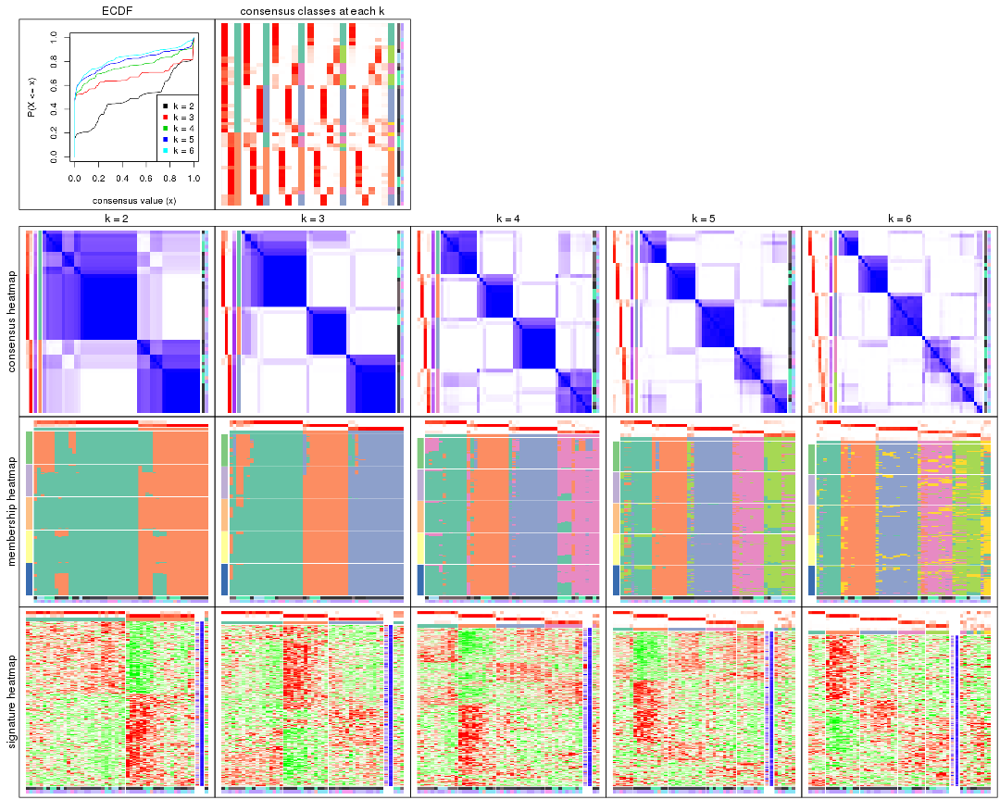

The plots are:

- The first row: a plot of the ECDF (empirical cumulative distribution
  function) curves of the consensus matrix for each `k` and the heatmap of
  predicted classes for each `k`.
- The second row: heatmaps of the consensus matrix for each `k`.
- The third row: heatmaps of the membership matrix for each `k`.
- The fouth row: heatmaps of the signatures for each `k`.

All the plots in panels can be made by individual functions and they are
plotted later in this section.

`select_partition_number()` produces several plots showing different
statistics for choosing "optimized" `k`. There are following statistics:

- ECDF curves of the consensus matrix for each `k`;
- 1-PAC. [The PAC
  score](https://en.wikipedia.org/wiki/Consensus_clustering#Over-interpretation_potential_of_consensus_clustering)
  measures the proportion of the ambiguous subgrouping.
- Mean silhouette score.
- Concordance. The mean probability of fiting the consensus class ids in all
  partitions.
- Area increased. Denote $A_k$ as the area under the ECDF curve for current
  `k`, the area increased is defined as $A_k - A_{k-1}$.
- Rand index. The percent of pairs of samples that are both in a same cluster
  or both are not in a same cluster in the partition of k and k-1.
- Jaccard index. The ratio of pairs of samples are both in a same cluster in
  the partition of k and k-1 and the pairs of samples are both in a same
  cluster in the partition k or k-1.

The detailed explanations of these statistics can be found in [the _cola_
vignette](http://bioconductor.org/packages/devel/bioc/vignettes/cola/inst/doc/cola.html#toc_13).

Generally speaking, lower PAC score, higher mean silhouette score or higher
concordance corresponds to better partition. Rand index and Jaccard index
measure how similar the current partition is compared to partition with `k-1`.
If they are too similar, we won't accept `k` is better than `k-1`.

```r
select_partition_number(res)
```

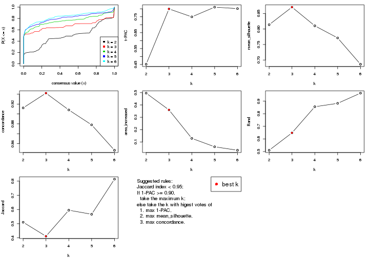

The numeric values for all these statistics can be obtained by `get_stats()`.

```r
get_stats(res)
```

```
#>   k 1-PAC mean_silhouette concordance area_increased  Rand Jaccard
#> 2 2 0.451           0.814       0.912         0.4956 0.510   0.510
#> 3 3 0.799           0.871       0.942         0.3598 0.648   0.411
#> 4 4 0.749           0.810       0.908         0.1290 0.856   0.595
#> 5 5 0.810           0.771       0.878         0.0608 0.882   0.566
#> 6 6 0.801           0.686       0.827         0.0327 0.963   0.814
```

`suggest_best_k()` suggests the best $k$ based on these statistics. The rules are as follows:

- All $k$ with Jaccard index larger than 0.95 are removed because increasing
  $k$ does not provide enough extra information. If all $k$ are removed, it is
  marked as no subgroup is detected.
- For all $k$ with 1-PAC score larger than 0.9, the maximal $k$ is taken as
  the best $k$, and other $k$ are marked as optional $k$.
- If it does not fit the second rule. The $k$ with the maximal vote of the
  highest 1-PAC score, highest mean silhouette, and highest concordance is
  taken as the best $k$.

```r
suggest_best_k(res)
```

```
#> [1] 3
```


Following shows the table of the partitions (You need to click the **show/hide
code output** link to see it). The membership matrix (columns with name `p*`)
is inferred by
[`clue::cl_consensus()`](https://www.rdocumentation.org/link/cl_consensus?package=clue)
function with the `SE` method. Basically the value in the membership matrix
represents the probability to belong to a certain group. The finall class
label for an item is determined with the group with highest probability it
belongs to.

In `get_classes()` function, the entropy is calculated from the membership
matrix and the silhouette score is calculated from the consensus matrix.


<script>
$( function() {
	$( '#tabs-MAD-skmeans-get-classes' ).tabs();
} );
</script>
<div id='tabs-MAD-skmeans-get-classes'>
<ul>
<li><a href='#tab-MAD-skmeans-get-classes-1'>k = 2</a></li>
<li><a href='#tab-MAD-skmeans-get-classes-2'>k = 3</a></li>
<li><a href='#tab-MAD-skmeans-get-classes-3'>k = 4</a></li>
<li><a href='#tab-MAD-skmeans-get-classes-4'>k = 5</a></li>
<li><a href='#tab-MAD-skmeans-get-classes-5'>k = 6</a></li>
</ul>

<div id='tab-MAD-skmeans-get-classes-1'>
<p><a id='tab-MAD-skmeans-get-classes-1-a' style='color:#0366d6' href='#'>show/hide code output</a></p>
<pre><code class="r">cbind(get_classes(res, k = 2), get_membership(res, k = 2))
</code></pre>

<pre><code>#&gt;          class entropy silhouette    p1    p2
#&gt; GSM63448     1  0.0000      0.890 1.000 0.000
#&gt; GSM63449     1  0.0000      0.890 1.000 0.000
#&gt; GSM63423     1  0.0000      0.890 1.000 0.000
#&gt; GSM63425     1  0.0000      0.890 1.000 0.000
#&gt; GSM63437     1  0.0000      0.890 1.000 0.000
#&gt; GSM63453     2  0.7056      0.740 0.192 0.808
#&gt; GSM63431     1  0.0000      0.890 1.000 0.000
#&gt; GSM63450     2  0.0376      0.888 0.004 0.996
#&gt; GSM63428     1  0.0000      0.890 1.000 0.000
#&gt; GSM63432     1  0.0000      0.890 1.000 0.000
#&gt; GSM63458     1  0.0000      0.890 1.000 0.000
#&gt; GSM63434     2  0.8443      0.647 0.272 0.728
#&gt; GSM63435     1  0.0000      0.890 1.000 0.000
#&gt; GSM63442     1  0.0000      0.890 1.000 0.000
#&gt; GSM63451     2  0.8144      0.673 0.252 0.748
#&gt; GSM63422     1  0.0000      0.890 1.000 0.000
#&gt; GSM63438     1  0.0000      0.890 1.000 0.000
#&gt; GSM63439     1  0.6887      0.731 0.816 0.184
#&gt; GSM63461     1  0.0000      0.890 1.000 0.000
#&gt; GSM63463     1  0.7139      0.717 0.804 0.196
#&gt; GSM63430     1  0.6712      0.740 0.824 0.176
#&gt; GSM63446     2  0.8386      0.653 0.268 0.732
#&gt; GSM63429     1  0.6048      0.795 0.852 0.148
#&gt; GSM63445     1  0.0000      0.890 1.000 0.000
#&gt; GSM63447     2  0.0000      0.890 0.000 1.000
#&gt; GSM63459     2  0.0000      0.890 0.000 1.000
#&gt; GSM63464     2  0.0000      0.890 0.000 1.000
#&gt; GSM63469     2  0.0000      0.890 0.000 1.000
#&gt; GSM63470     2  0.0000      0.890 0.000 1.000
#&gt; GSM63436     1  0.0000      0.890 1.000 0.000
#&gt; GSM63443     2  0.7376      0.724 0.208 0.792
#&gt; GSM63465     2  0.0000      0.890 0.000 1.000
#&gt; GSM63444     2  0.0000      0.890 0.000 1.000
#&gt; GSM63456     2  0.0000      0.890 0.000 1.000
#&gt; GSM63462     1  0.9944      0.258 0.544 0.456
#&gt; GSM63424     1  0.5842      0.782 0.860 0.140
#&gt; GSM63440     1  0.0672      0.886 0.992 0.008
#&gt; GSM63433     1  0.8081      0.691 0.752 0.248
#&gt; GSM63466     2  0.0000      0.890 0.000 1.000
#&gt; GSM63426     1  0.5059      0.824 0.888 0.112
#&gt; GSM63468     2  0.6623      0.762 0.172 0.828
#&gt; GSM63452     2  0.0000      0.890 0.000 1.000
#&gt; GSM63441     1  0.8207      0.682 0.744 0.256
#&gt; GSM63454     2  0.6438      0.771 0.164 0.836
#&gt; GSM63455     1  0.8081      0.691 0.752 0.248
#&gt; GSM63460     2  0.0000      0.890 0.000 1.000
#&gt; GSM63467     2  0.7056      0.739 0.192 0.808
#&gt; GSM63421     1  0.0000      0.890 1.000 0.000
#&gt; GSM63427     1  0.8443      0.658 0.728 0.272
#&gt; GSM63457     1  0.7602      0.723 0.780 0.220
</code></pre>

<script>
$('#tab-MAD-skmeans-get-classes-1-a').parent().next().next().hide();
$('#tab-MAD-skmeans-get-classes-1-a').click(function(){
  $('#tab-MAD-skmeans-get-classes-1-a').parent().next().next().toggle();
  return(false);
});
</script>
</div>

<div id='tab-MAD-skmeans-get-classes-2'>
<p><a id='tab-MAD-skmeans-get-classes-2-a' style='color:#0366d6' href='#'>show/hide code output</a></p>
<pre><code class="r">cbind(get_classes(res, k = 3), get_membership(res, k = 3))
</code></pre>

<pre><code>#&gt;          class entropy silhouette    p1    p2    p3
#&gt; GSM63448     1  0.0000      0.897 1.000 0.000 0.000
#&gt; GSM63449     1  0.0000      0.897 1.000 0.000 0.000
#&gt; GSM63423     1  0.0000      0.897 1.000 0.000 0.000
#&gt; GSM63425     1  0.3340      0.813 0.880 0.000 0.120
#&gt; GSM63437     1  0.0000      0.897 1.000 0.000 0.000
#&gt; GSM63453     1  0.6252      0.226 0.556 0.444 0.000
#&gt; GSM63431     1  0.0000      0.897 1.000 0.000 0.000
#&gt; GSM63450     2  0.3038      0.855 0.104 0.896 0.000
#&gt; GSM63428     1  0.0000      0.897 1.000 0.000 0.000
#&gt; GSM63432     3  0.4178      0.810 0.172 0.000 0.828
#&gt; GSM63458     1  0.0000      0.897 1.000 0.000 0.000
#&gt; GSM63434     3  0.0000      0.960 0.000 0.000 1.000
#&gt; GSM63435     3  0.0000      0.960 0.000 0.000 1.000
#&gt; GSM63442     3  0.0000      0.960 0.000 0.000 1.000
#&gt; GSM63451     3  0.0000      0.960 0.000 0.000 1.000
#&gt; GSM63422     3  0.0000      0.960 0.000 0.000 1.000
#&gt; GSM63438     3  0.0000      0.960 0.000 0.000 1.000
#&gt; GSM63439     3  0.0000      0.960 0.000 0.000 1.000
#&gt; GSM63461     3  0.0000      0.960 0.000 0.000 1.000
#&gt; GSM63463     3  0.0000      0.960 0.000 0.000 1.000
#&gt; GSM63430     3  0.0000      0.960 0.000 0.000 1.000
#&gt; GSM63446     3  0.0000      0.960 0.000 0.000 1.000
#&gt; GSM63429     1  0.3183      0.846 0.908 0.076 0.016
#&gt; GSM63445     3  0.4235      0.805 0.176 0.000 0.824
#&gt; GSM63447     2  0.0000      0.967 0.000 1.000 0.000
#&gt; GSM63459     2  0.0000      0.967 0.000 1.000 0.000
#&gt; GSM63464     2  0.0000      0.967 0.000 1.000 0.000
#&gt; GSM63469     2  0.0000      0.967 0.000 1.000 0.000
#&gt; GSM63470     2  0.0000      0.967 0.000 1.000 0.000
#&gt; GSM63436     1  0.0000      0.897 1.000 0.000 0.000
#&gt; GSM63443     2  0.5138      0.660 0.000 0.748 0.252
#&gt; GSM63465     2  0.0000      0.967 0.000 1.000 0.000
#&gt; GSM63444     2  0.0000      0.967 0.000 1.000 0.000
#&gt; GSM63456     2  0.0000      0.967 0.000 1.000 0.000
#&gt; GSM63462     3  0.4733      0.743 0.004 0.196 0.800
#&gt; GSM63424     3  0.0424      0.955 0.000 0.008 0.992
#&gt; GSM63440     3  0.0424      0.955 0.000 0.008 0.992
#&gt; GSM63433     1  0.0000      0.897 1.000 0.000 0.000
#&gt; GSM63466     2  0.0000      0.967 0.000 1.000 0.000
#&gt; GSM63426     1  0.0000      0.897 1.000 0.000 0.000
#&gt; GSM63468     1  0.6267      0.321 0.548 0.452 0.000
#&gt; GSM63452     2  0.0000      0.967 0.000 1.000 0.000
#&gt; GSM63441     1  0.4555      0.749 0.800 0.200 0.000
#&gt; GSM63454     1  0.6274      0.311 0.544 0.456 0.000
#&gt; GSM63455     1  0.0000      0.897 1.000 0.000 0.000
#&gt; GSM63460     2  0.0000      0.967 0.000 1.000 0.000
#&gt; GSM63467     1  0.4702      0.736 0.788 0.212 0.000
#&gt; GSM63421     1  0.0000      0.897 1.000 0.000 0.000
#&gt; GSM63427     1  0.0000      0.897 1.000 0.000 0.000
#&gt; GSM63457     1  0.0000      0.897 1.000 0.000 0.000
</code></pre>

<script>
$('#tab-MAD-skmeans-get-classes-2-a').parent().next().next().hide();
$('#tab-MAD-skmeans-get-classes-2-a').click(function(){
  $('#tab-MAD-skmeans-get-classes-2-a').parent().next().next().toggle();
  return(false);
});
</script>
</div>

<div id='tab-MAD-skmeans-get-classes-3'>
<p><a id='tab-MAD-skmeans-get-classes-3-a' style='color:#0366d6' href='#'>show/hide code output</a></p>
<pre><code class="r">cbind(get_classes(res, k = 4), get_membership(res, k = 4))
</code></pre>

<pre><code>#&gt;          class entropy silhouette    p1    p2    p3    p4
#&gt; GSM63448     1  0.0469      0.907 0.988 0.000 0.000 0.012
#&gt; GSM63449     1  0.0000      0.911 1.000 0.000 0.000 0.000
#&gt; GSM63423     1  0.0000      0.911 1.000 0.000 0.000 0.000
#&gt; GSM63425     4  0.2489      0.782 0.068 0.000 0.020 0.912
#&gt; GSM63437     1  0.0000      0.911 1.000 0.000 0.000 0.000
#&gt; GSM63453     1  0.3494      0.739 0.824 0.172 0.000 0.004
#&gt; GSM63431     1  0.0188      0.911 0.996 0.000 0.000 0.004
#&gt; GSM63450     2  0.4655      0.534 0.312 0.684 0.000 0.004
#&gt; GSM63428     1  0.0000      0.911 1.000 0.000 0.000 0.000
#&gt; GSM63432     3  0.4543      0.560 0.324 0.000 0.676 0.000
#&gt; GSM63458     1  0.2589      0.861 0.884 0.000 0.000 0.116
#&gt; GSM63434     3  0.0000      0.943 0.000 0.000 1.000 0.000
#&gt; GSM63435     3  0.0000      0.943 0.000 0.000 1.000 0.000
#&gt; GSM63442     3  0.0000      0.943 0.000 0.000 1.000 0.000
#&gt; GSM63451     3  0.0000      0.943 0.000 0.000 1.000 0.000
#&gt; GSM63422     3  0.0000      0.943 0.000 0.000 1.000 0.000
#&gt; GSM63438     3  0.0000      0.943 0.000 0.000 1.000 0.000
#&gt; GSM63439     3  0.0000      0.943 0.000 0.000 1.000 0.000
#&gt; GSM63461     3  0.0000      0.943 0.000 0.000 1.000 0.000
#&gt; GSM63463     3  0.0000      0.943 0.000 0.000 1.000 0.000
#&gt; GSM63430     3  0.0000      0.943 0.000 0.000 1.000 0.000
#&gt; GSM63446     3  0.0000      0.943 0.000 0.000 1.000 0.000
#&gt; GSM63429     4  0.0188      0.788 0.004 0.000 0.000 0.996
#&gt; GSM63445     3  0.3312      0.845 0.052 0.000 0.876 0.072
#&gt; GSM63447     4  0.4981      0.040 0.000 0.464 0.000 0.536
#&gt; GSM63459     2  0.0000      0.904 0.000 1.000 0.000 0.000
#&gt; GSM63464     2  0.0000      0.904 0.000 1.000 0.000 0.000
#&gt; GSM63469     2  0.0000      0.904 0.000 1.000 0.000 0.000
#&gt; GSM63470     2  0.0000      0.904 0.000 1.000 0.000 0.000
#&gt; GSM63436     1  0.2921      0.863 0.860 0.000 0.000 0.140
#&gt; GSM63443     2  0.3400      0.735 0.000 0.820 0.180 0.000
#&gt; GSM63465     2  0.4916      0.216 0.000 0.576 0.000 0.424
#&gt; GSM63444     2  0.0000      0.904 0.000 1.000 0.000 0.000
#&gt; GSM63456     2  0.0188      0.903 0.000 0.996 0.000 0.004
#&gt; GSM63462     3  0.5759      0.666 0.000 0.112 0.708 0.180
#&gt; GSM63424     4  0.3400      0.698 0.000 0.000 0.180 0.820
#&gt; GSM63440     4  0.2408      0.761 0.000 0.000 0.104 0.896
#&gt; GSM63433     4  0.4193      0.614 0.268 0.000 0.000 0.732
#&gt; GSM63466     2  0.0000      0.904 0.000 1.000 0.000 0.000
#&gt; GSM63426     4  0.4277      0.595 0.280 0.000 0.000 0.720
#&gt; GSM63468     4  0.1637      0.780 0.000 0.060 0.000 0.940
#&gt; GSM63452     2  0.0188      0.903 0.000 0.996 0.000 0.004
#&gt; GSM63441     4  0.0524      0.790 0.004 0.008 0.000 0.988
#&gt; GSM63454     4  0.1978      0.777 0.004 0.068 0.000 0.928
#&gt; GSM63455     4  0.4072      0.635 0.252 0.000 0.000 0.748
#&gt; GSM63460     2  0.0000      0.904 0.000 1.000 0.000 0.000
#&gt; GSM63467     4  0.5247      0.676 0.228 0.052 0.000 0.720
#&gt; GSM63421     1  0.2760      0.873 0.872 0.000 0.000 0.128
#&gt; GSM63427     1  0.3787      0.854 0.840 0.036 0.000 0.124
#&gt; GSM63457     1  0.2760      0.873 0.872 0.000 0.000 0.128
</code></pre>

<script>
$('#tab-MAD-skmeans-get-classes-3-a').parent().next().next().hide();
$('#tab-MAD-skmeans-get-classes-3-a').click(function(){
  $('#tab-MAD-skmeans-get-classes-3-a').parent().next().next().toggle();
  return(false);
});
</script>
</div>

<div id='tab-MAD-skmeans-get-classes-4'>
<p><a id='tab-MAD-skmeans-get-classes-4-a' style='color:#0366d6' href='#'>show/hide code output</a></p>
<pre><code class="r">cbind(get_classes(res, k = 5), get_membership(res, k = 5))
</code></pre>

<pre><code>#&gt;          class entropy silhouette    p1    p2    p3    p4    p5
#&gt; GSM63448     1  0.1442      0.761 0.952 0.000 0.004 0.012 0.032
#&gt; GSM63449     1  0.0703      0.774 0.976 0.000 0.000 0.000 0.024
#&gt; GSM63423     1  0.0703      0.774 0.976 0.000 0.000 0.000 0.024
#&gt; GSM63425     4  0.2864      0.773 0.012 0.000 0.000 0.852 0.136
#&gt; GSM63437     1  0.0703      0.774 0.976 0.000 0.000 0.000 0.024
#&gt; GSM63453     1  0.5690      0.567 0.636 0.112 0.000 0.008 0.244
#&gt; GSM63431     1  0.3884      0.458 0.708 0.000 0.000 0.004 0.288
#&gt; GSM63450     1  0.6132      0.481 0.576 0.276 0.000 0.008 0.140
#&gt; GSM63428     1  0.0703      0.774 0.976 0.000 0.000 0.000 0.024
#&gt; GSM63432     1  0.4288      0.317 0.612 0.000 0.384 0.004 0.000
#&gt; GSM63458     5  0.4382      0.528 0.276 0.000 0.004 0.020 0.700
#&gt; GSM63434     3  0.0451      0.906 0.000 0.000 0.988 0.008 0.004
#&gt; GSM63435     3  0.0162      0.908 0.004 0.000 0.996 0.000 0.000
#&gt; GSM63442     3  0.0451      0.904 0.004 0.000 0.988 0.000 0.008
#&gt; GSM63451     3  0.0486      0.906 0.004 0.000 0.988 0.004 0.004
#&gt; GSM63422     3  0.0162      0.908 0.004 0.000 0.996 0.000 0.000
#&gt; GSM63438     3  0.0000      0.908 0.000 0.000 1.000 0.000 0.000
#&gt; GSM63439     3  0.0290      0.907 0.000 0.000 0.992 0.008 0.000
#&gt; GSM63461     3  0.0000      0.908 0.000 0.000 1.000 0.000 0.000
#&gt; GSM63463     3  0.0000      0.908 0.000 0.000 1.000 0.000 0.000
#&gt; GSM63430     3  0.0451      0.907 0.004 0.000 0.988 0.008 0.000
#&gt; GSM63446     3  0.0727      0.902 0.004 0.000 0.980 0.004 0.012
#&gt; GSM63429     4  0.1410      0.852 0.000 0.000 0.000 0.940 0.060
#&gt; GSM63445     3  0.4774      0.282 0.020 0.000 0.556 0.000 0.424
#&gt; GSM63447     4  0.4208      0.679 0.004 0.248 0.000 0.728 0.020
#&gt; GSM63459     2  0.0000      0.962 0.000 1.000 0.000 0.000 0.000
#&gt; GSM63464     2  0.0000      0.962 0.000 1.000 0.000 0.000 0.000
#&gt; GSM63469     2  0.0000      0.962 0.000 1.000 0.000 0.000 0.000
#&gt; GSM63470     2  0.0000      0.962 0.000 1.000 0.000 0.000 0.000
#&gt; GSM63436     5  0.3563      0.709 0.208 0.000 0.000 0.012 0.780
#&gt; GSM63443     2  0.3475      0.747 0.012 0.804 0.180 0.000 0.004
#&gt; GSM63465     4  0.3768      0.700 0.004 0.228 0.000 0.760 0.008
#&gt; GSM63444     2  0.0451      0.958 0.004 0.988 0.000 0.000 0.008
#&gt; GSM63456     2  0.2037      0.910 0.012 0.920 0.000 0.004 0.064
#&gt; GSM63462     3  0.8016      0.123 0.016 0.132 0.416 0.096 0.340
#&gt; GSM63424     4  0.1740      0.833 0.000 0.000 0.056 0.932 0.012
#&gt; GSM63440     4  0.0798      0.862 0.000 0.000 0.008 0.976 0.016
#&gt; GSM63433     5  0.3496      0.714 0.012 0.000 0.000 0.200 0.788
#&gt; GSM63466     2  0.0000      0.962 0.000 1.000 0.000 0.000 0.000
#&gt; GSM63426     5  0.3355      0.724 0.012 0.000 0.000 0.184 0.804
#&gt; GSM63468     4  0.1197      0.865 0.000 0.000 0.000 0.952 0.048
#&gt; GSM63452     2  0.0771      0.951 0.004 0.976 0.000 0.000 0.020
#&gt; GSM63441     4  0.1571      0.862 0.004 0.000 0.000 0.936 0.060
#&gt; GSM63454     4  0.1282      0.865 0.004 0.000 0.000 0.952 0.044
#&gt; GSM63455     5  0.3210      0.698 0.000 0.000 0.000 0.212 0.788
#&gt; GSM63460     2  0.0000      0.962 0.000 1.000 0.000 0.000 0.000
#&gt; GSM63467     5  0.6454      0.306 0.044 0.072 0.000 0.376 0.508
#&gt; GSM63421     5  0.3010      0.730 0.172 0.000 0.000 0.004 0.824
#&gt; GSM63427     5  0.3087      0.735 0.152 0.008 0.000 0.004 0.836
#&gt; GSM63457     5  0.2848      0.736 0.156 0.000 0.000 0.004 0.840
</code></pre>

<script>
$('#tab-MAD-skmeans-get-classes-4-a').parent().next().next().hide();
$('#tab-MAD-skmeans-get-classes-4-a').click(function(){
  $('#tab-MAD-skmeans-get-classes-4-a').parent().next().next().toggle();
  return(false);
});
</script>
</div>

<div id='tab-MAD-skmeans-get-classes-5'>
<p><a id='tab-MAD-skmeans-get-classes-5-a' style='color:#0366d6' href='#'>show/hide code output</a></p>
<pre><code class="r">cbind(get_classes(res, k = 6), get_membership(res, k = 6))
</code></pre>

<pre><code>#&gt;          class entropy silhouette    p1    p2    p3    p4    p5    p6
#&gt; GSM63448     1  0.1844      0.748 0.928 0.000 0.000 0.016 0.016 0.040
#&gt; GSM63449     1  0.0260      0.794 0.992 0.000 0.000 0.000 0.008 0.000
#&gt; GSM63423     1  0.0405      0.792 0.988 0.000 0.000 0.000 0.008 0.004
#&gt; GSM63425     4  0.4943      0.637 0.016 0.000 0.004 0.680 0.080 0.220
#&gt; GSM63437     1  0.0260      0.794 0.992 0.000 0.000 0.000 0.008 0.000
#&gt; GSM63453     6  0.6458      0.444 0.336 0.068 0.000 0.000 0.120 0.476
#&gt; GSM63431     1  0.4094      0.329 0.652 0.000 0.000 0.000 0.324 0.024
#&gt; GSM63450     6  0.6417      0.452 0.336 0.140 0.000 0.000 0.052 0.472
#&gt; GSM63428     1  0.0260      0.794 0.992 0.000 0.000 0.000 0.008 0.000
#&gt; GSM63432     1  0.4598      0.306 0.656 0.000 0.280 0.000 0.004 0.060
#&gt; GSM63458     5  0.6527      0.324 0.224 0.000 0.008 0.048 0.532 0.188
#&gt; GSM63434     3  0.2020      0.866 0.008 0.000 0.896 0.000 0.000 0.096
#&gt; GSM63435     3  0.0713      0.886 0.000 0.000 0.972 0.000 0.000 0.028
#&gt; GSM63442     3  0.1501      0.859 0.000 0.000 0.924 0.000 0.000 0.076
#&gt; GSM63451     3  0.1267      0.878 0.000 0.000 0.940 0.000 0.000 0.060
#&gt; GSM63422     3  0.0632      0.887 0.000 0.000 0.976 0.000 0.000 0.024
#&gt; GSM63438     3  0.0458      0.891 0.000 0.000 0.984 0.000 0.000 0.016
#&gt; GSM63439     3  0.1606      0.878 0.008 0.000 0.932 0.000 0.004 0.056
#&gt; GSM63461     3  0.0146      0.891 0.000 0.000 0.996 0.000 0.000 0.004
#&gt; GSM63463     3  0.0260      0.891 0.000 0.000 0.992 0.000 0.000 0.008
#&gt; GSM63430     3  0.1668      0.876 0.008 0.000 0.928 0.000 0.004 0.060
#&gt; GSM63446     3  0.1556      0.871 0.000 0.000 0.920 0.000 0.000 0.080
#&gt; GSM63429     4  0.3983      0.681 0.000 0.000 0.000 0.736 0.056 0.208
#&gt; GSM63445     3  0.6924     -0.183 0.036 0.000 0.352 0.008 0.352 0.252
#&gt; GSM63447     4  0.5066      0.427 0.000 0.336 0.000 0.588 0.012 0.064
#&gt; GSM63459     2  0.0000      0.917 0.000 1.000 0.000 0.000 0.000 0.000
#&gt; GSM63464     2  0.0000      0.917 0.000 1.000 0.000 0.000 0.000 0.000
#&gt; GSM63469     2  0.0000      0.917 0.000 1.000 0.000 0.000 0.000 0.000
#&gt; GSM63470     2  0.0000      0.917 0.000 1.000 0.000 0.000 0.000 0.000
#&gt; GSM63436     5  0.2637      0.676 0.096 0.000 0.000 0.008 0.872 0.024
#&gt; GSM63443     2  0.3899      0.733 0.020 0.804 0.120 0.000 0.012 0.044
#&gt; GSM63465     4  0.4518      0.544 0.000 0.236 0.000 0.688 0.004 0.072
#&gt; GSM63444     2  0.1285      0.889 0.004 0.944 0.000 0.000 0.000 0.052
#&gt; GSM63456     2  0.3448      0.637 0.000 0.716 0.004 0.000 0.000 0.280
#&gt; GSM63462     6  0.7623      0.229 0.000 0.068 0.240 0.088 0.136 0.468
#&gt; GSM63424     4  0.4554      0.638 0.000 0.000 0.056 0.688 0.012 0.244
#&gt; GSM63440     4  0.3543      0.679 0.000 0.000 0.016 0.756 0.004 0.224
#&gt; GSM63433     5  0.4685      0.627 0.000 0.000 0.000 0.240 0.664 0.096
#&gt; GSM63466     2  0.0146      0.916 0.000 0.996 0.000 0.004 0.000 0.000
#&gt; GSM63426     5  0.4638      0.642 0.000 0.000 0.000 0.232 0.672 0.096
#&gt; GSM63468     4  0.1745      0.697 0.000 0.000 0.000 0.924 0.020 0.056
#&gt; GSM63452     2  0.2135      0.829 0.000 0.872 0.000 0.000 0.000 0.128
#&gt; GSM63441     4  0.1644      0.700 0.000 0.000 0.000 0.932 0.028 0.040
#&gt; GSM63454     4  0.1320      0.696 0.000 0.000 0.000 0.948 0.016 0.036
#&gt; GSM63455     5  0.5202      0.615 0.000 0.000 0.000 0.224 0.612 0.164
#&gt; GSM63460     2  0.0146      0.916 0.000 0.996 0.000 0.004 0.000 0.000
#&gt; GSM63467     4  0.7546     -0.150 0.088 0.028 0.000 0.404 0.296 0.184
#&gt; GSM63421     5  0.1584      0.703 0.064 0.000 0.000 0.000 0.928 0.008
#&gt; GSM63427     5  0.1152      0.709 0.044 0.000 0.000 0.000 0.952 0.004
#&gt; GSM63457     5  0.1367      0.708 0.044 0.000 0.000 0.000 0.944 0.012
</code></pre>

<script>
$('#tab-MAD-skmeans-get-classes-5-a').parent().next().next().hide();
$('#tab-MAD-skmeans-get-classes-5-a').click(function(){
  $('#tab-MAD-skmeans-get-classes-5-a').parent().next().next().toggle();
  return(false);
});
</script>
</div>
</div>

Heatmaps for the consensus matrix. It visualizes the probability of two
samples to be in a same group.


<script>
$( function() {
	$( '#tabs-MAD-skmeans-consensus-heatmap' ).tabs();
} );
</script>
<div id='tabs-MAD-skmeans-consensus-heatmap'>
<ul>
<li><a href='#tab-MAD-skmeans-consensus-heatmap-1'>k = 2</a></li>
<li><a href='#tab-MAD-skmeans-consensus-heatmap-2'>k = 3</a></li>
<li><a href='#tab-MAD-skmeans-consensus-heatmap-3'>k = 4</a></li>
<li><a href='#tab-MAD-skmeans-consensus-heatmap-4'>k = 5</a></li>
<li><a href='#tab-MAD-skmeans-consensus-heatmap-5'>k = 6</a></li>
</ul>
<div id='tab-MAD-skmeans-consensus-heatmap-1'>
<pre><code class="r">consensus_heatmap(res, k = 2)
</code></pre>

<p>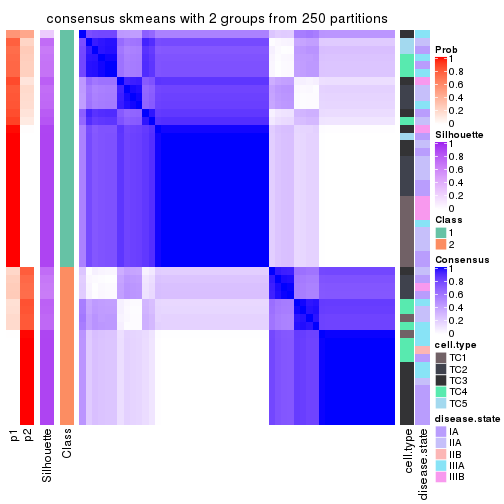</p>

</div>
<div id='tab-MAD-skmeans-consensus-heatmap-2'>
<pre><code class="r">consensus_heatmap(res, k = 3)
</code></pre>

<p>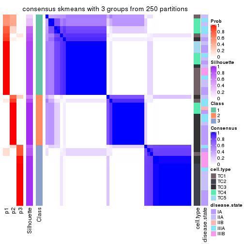</p>

</div>
<div id='tab-MAD-skmeans-consensus-heatmap-3'>
<pre><code class="r">consensus_heatmap(res, k = 4)
</code></pre>

<p>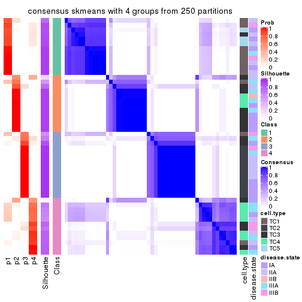</p>

</div>
<div id='tab-MAD-skmeans-consensus-heatmap-4'>
<pre><code class="r">consensus_heatmap(res, k = 5)
</code></pre>

<p>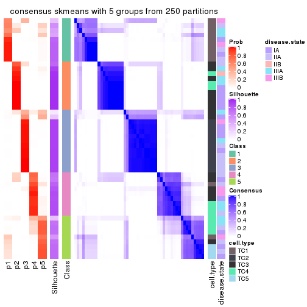</p>

</div>
<div id='tab-MAD-skmeans-consensus-heatmap-5'>
<pre><code class="r">consensus_heatmap(res, k = 6)
</code></pre>

<p>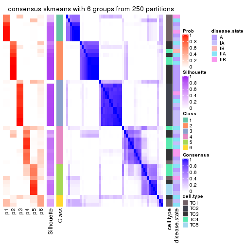</p>

</div>
</div>

Heatmaps for the membership of samples in all partitions to see how consistent they are:


<script>
$( function() {
	$( '#tabs-MAD-skmeans-membership-heatmap' ).tabs();
} );
</script>
<div id='tabs-MAD-skmeans-membership-heatmap'>
<ul>
<li><a href='#tab-MAD-skmeans-membership-heatmap-1'>k = 2</a></li>
<li><a href='#tab-MAD-skmeans-membership-heatmap-2'>k = 3</a></li>
<li><a href='#tab-MAD-skmeans-membership-heatmap-3'>k = 4</a></li>
<li><a href='#tab-MAD-skmeans-membership-heatmap-4'>k = 5</a></li>
<li><a href='#tab-MAD-skmeans-membership-heatmap-5'>k = 6</a></li>
</ul>
<div id='tab-MAD-skmeans-membership-heatmap-1'>
<pre><code class="r">membership_heatmap(res, k = 2)
</code></pre>

<p>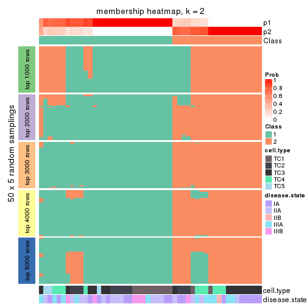</p>

</div>
<div id='tab-MAD-skmeans-membership-heatmap-2'>
<pre><code class="r">membership_heatmap(res, k = 3)
</code></pre>

<p>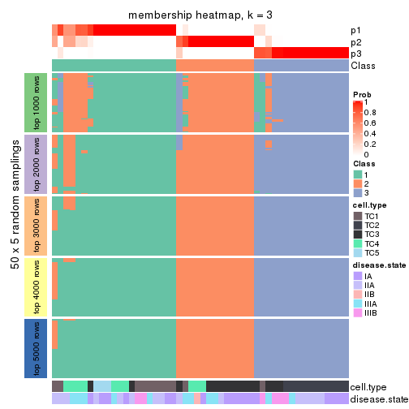</p>

</div>
<div id='tab-MAD-skmeans-membership-heatmap-3'>
<pre><code class="r">membership_heatmap(res, k = 4)
</code></pre>

<p>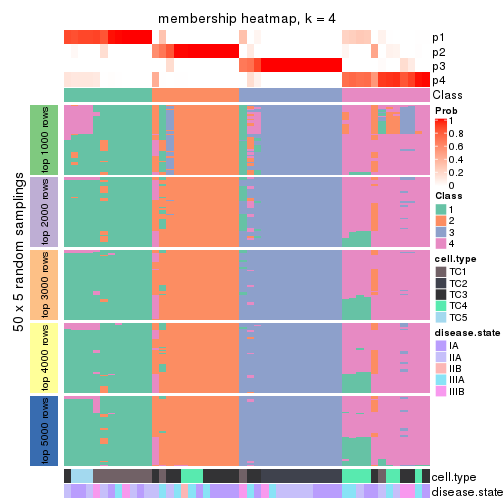</p>

</div>
<div id='tab-MAD-skmeans-membership-heatmap-4'>
<pre><code class="r">membership_heatmap(res, k = 5)
</code></pre>

<p>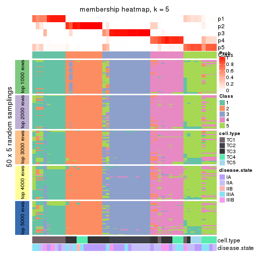</p>

</div>
<div id='tab-MAD-skmeans-membership-heatmap-5'>
<pre><code class="r">membership_heatmap(res, k = 6)
</code></pre>

<p>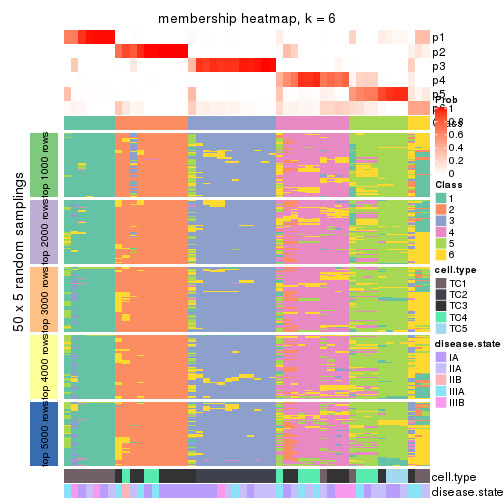</p>

</div>
</div>

As soon as we have had the classes for columns, we can look for signatures
which are significantly different between classes which can be candidate marks
for certain classes. Following are the heatmaps for signatures.


Signature heatmaps where rows are scaled:


<script>
$( function() {
	$( '#tabs-MAD-skmeans-get-signatures' ).tabs();
} );
</script>
<div id='tabs-MAD-skmeans-get-signatures'>
<ul>
<li><a href='#tab-MAD-skmeans-get-signatures-1'>k = 2</a></li>
<li><a href='#tab-MAD-skmeans-get-signatures-2'>k = 3</a></li>
<li><a href='#tab-MAD-skmeans-get-signatures-3'>k = 4</a></li>
<li><a href='#tab-MAD-skmeans-get-signatures-4'>k = 5</a></li>
<li><a href='#tab-MAD-skmeans-get-signatures-5'>k = 6</a></li>
</ul>
<div id='tab-MAD-skmeans-get-signatures-1'>
<pre><code class="r">get_signatures(res, k = 2)
</code></pre>

<p>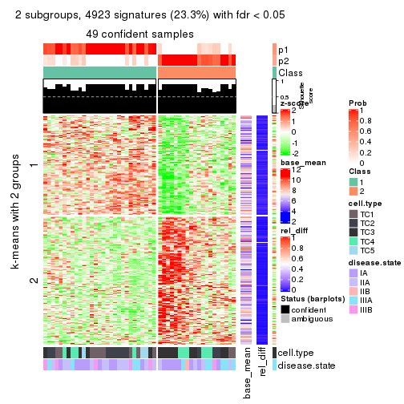</p>

</div>
<div id='tab-MAD-skmeans-get-signatures-2'>
<pre><code class="r">get_signatures(res, k = 3)
</code></pre>

<p>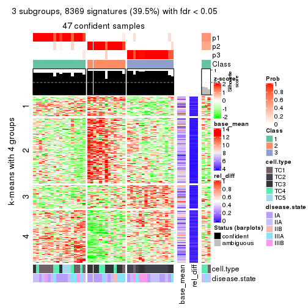</p>

</div>
<div id='tab-MAD-skmeans-get-signatures-3'>
<pre><code class="r">get_signatures(res, k = 4)
</code></pre>

<p>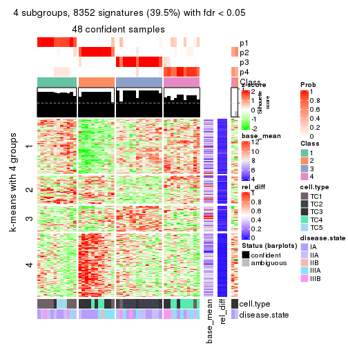</p>

</div>
<div id='tab-MAD-skmeans-get-signatures-4'>
<pre><code class="r">get_signatures(res, k = 5)
</code></pre>

<p>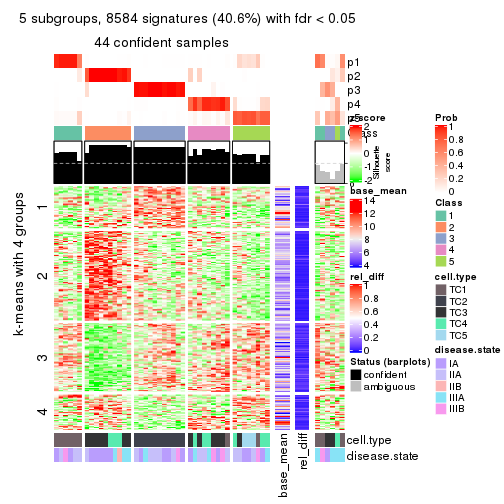</p>

</div>
<div id='tab-MAD-skmeans-get-signatures-5'>
<pre><code class="r">get_signatures(res, k = 6)
</code></pre>

<p>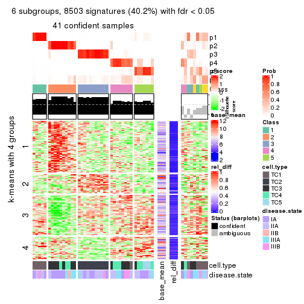</p>

</div>
</div>


Signature heatmaps where rows are not scaled:


<script>
$( function() {
	$( '#tabs-MAD-skmeans-get-signatures-no-scale' ).tabs();
} );
</script>
<div id='tabs-MAD-skmeans-get-signatures-no-scale'>
<ul>
<li><a href='#tab-MAD-skmeans-get-signatures-no-scale-1'>k = 2</a></li>
<li><a href='#tab-MAD-skmeans-get-signatures-no-scale-2'>k = 3</a></li>
<li><a href='#tab-MAD-skmeans-get-signatures-no-scale-3'>k = 4</a></li>
<li><a href='#tab-MAD-skmeans-get-signatures-no-scale-4'>k = 5</a></li>
<li><a href='#tab-MAD-skmeans-get-signatures-no-scale-5'>k = 6</a></li>
</ul>
<div id='tab-MAD-skmeans-get-signatures-no-scale-1'>
<pre><code class="r">get_signatures(res, k = 2, scale_rows = FALSE)
</code></pre>

<p>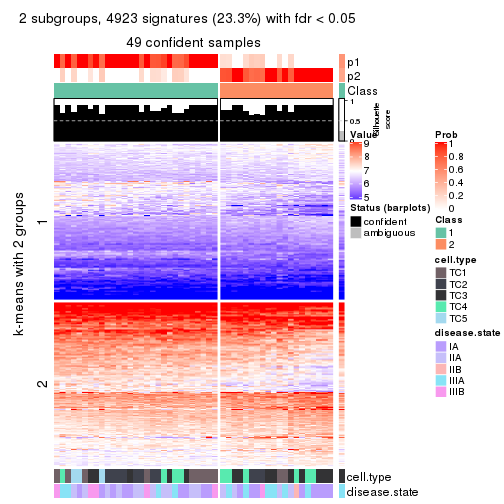</p>

</div>
<div id='tab-MAD-skmeans-get-signatures-no-scale-2'>
<pre><code class="r">get_signatures(res, k = 3, scale_rows = FALSE)
</code></pre>

<p>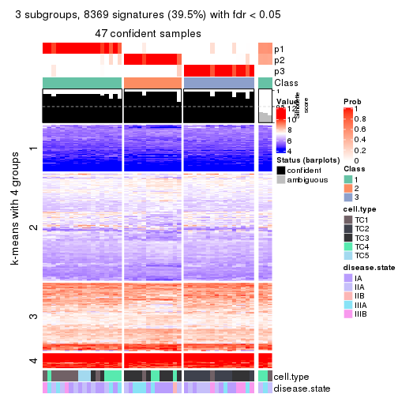</p>

</div>
<div id='tab-MAD-skmeans-get-signatures-no-scale-3'>
<pre><code class="r">get_signatures(res, k = 4, scale_rows = FALSE)
</code></pre>

<p>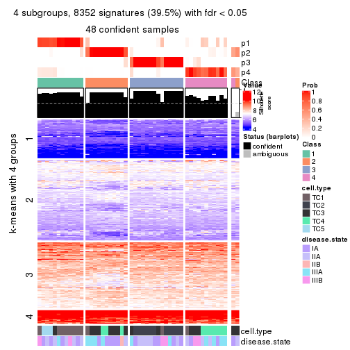</p>

</div>
<div id='tab-MAD-skmeans-get-signatures-no-scale-4'>
<pre><code class="r">get_signatures(res, k = 5, scale_rows = FALSE)
</code></pre>

<p>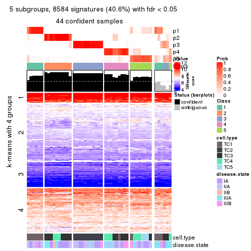</p>

</div>
<div id='tab-MAD-skmeans-get-signatures-no-scale-5'>
<pre><code class="r">get_signatures(res, k = 6, scale_rows = FALSE)
</code></pre>

<p>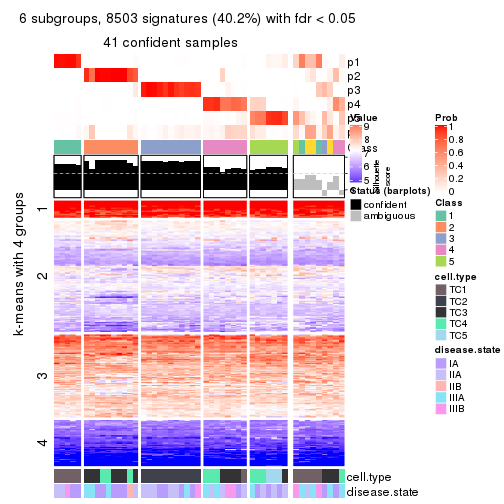</p>

</div>
</div>


Compare the overlap of signatures from different k:

```r
compare_signatures(res)
```

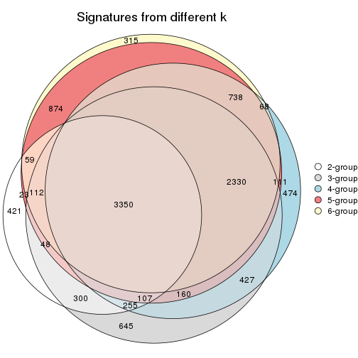

`get_signature()` returns a data frame invisibly. TO get the list of signatures, the function
call should be assigned to a variable explicitly. In following code, if `plot` argument is set
to `FALSE`, no heatmap is plotted while only the differential analysis is performed.

```r
# code only for demonstration
tb = get_signature(res, k = ..., plot = FALSE)
```

An example of the output of `tb` is:

```
#>   which_row         fdr    mean_1    mean_2 scaled_mean_1 scaled_mean_2 km
#> 1        38 0.042760348  8.373488  9.131774    -0.5533452     0.5164555  1
#> 2        40 0.018707592  7.106213  8.469186    -0.6173731     0.5762149  1
#> 3        55 0.019134737 10.221463 11.207825    -0.6159697     0.5749050  1
#> 4        59 0.006059896  5.921854  7.869574    -0.6899429     0.6439467  1
#> 5        60 0.018055526  8.928898 10.211722    -0.6204761     0.5791110  1
#> 6        98 0.009384629 15.714769 14.887706     0.6635654    -0.6193277  2
...
```

The columns in `tb` are:

1. `which_row`: row indices corresponding to the input matrix.
2. `fdr`: FDR for the differential test. 
3. `mean_x`: The mean value in group x.
4. `scaled_mean_x`: The mean value in group x after rows are scaled.
5. `km`: Row groups if k-means clustering is applied to rows.


UMAP plot which shows how samples are separated.


<script>
$( function() {
	$( '#tabs-MAD-skmeans-dimension-reduction' ).tabs();
} );
</script>
<div id='tabs-MAD-skmeans-dimension-reduction'>
<ul>
<li><a href='#tab-MAD-skmeans-dimension-reduction-1'>k = 2</a></li>
<li><a href='#tab-MAD-skmeans-dimension-reduction-2'>k = 3</a></li>
<li><a href='#tab-MAD-skmeans-dimension-reduction-3'>k = 4</a></li>
<li><a href='#tab-MAD-skmeans-dimension-reduction-4'>k = 5</a></li>
<li><a href='#tab-MAD-skmeans-dimension-reduction-5'>k = 6</a></li>
</ul>
<div id='tab-MAD-skmeans-dimension-reduction-1'>
<pre><code class="r">dimension_reduction(res, k = 2, method = &quot;UMAP&quot;)
</code></pre>

<p>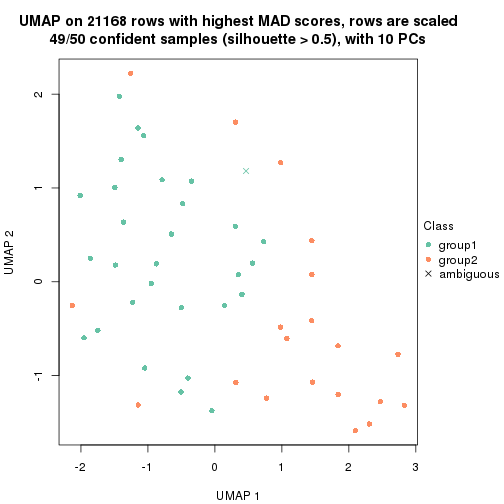</p>

</div>
<div id='tab-MAD-skmeans-dimension-reduction-2'>
<pre><code class="r">dimension_reduction(res, k = 3, method = &quot;UMAP&quot;)
</code></pre>

<p>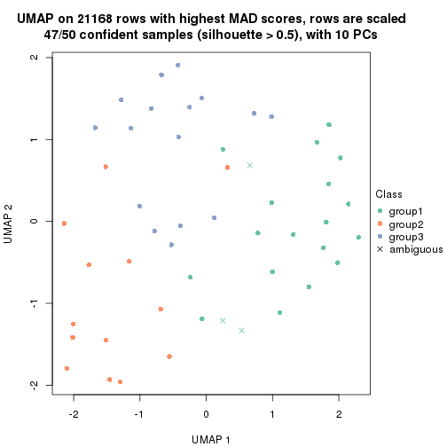</p>

</div>
<div id='tab-MAD-skmeans-dimension-reduction-3'>
<pre><code class="r">dimension_reduction(res, k = 4, method = &quot;UMAP&quot;)
</code></pre>

<p>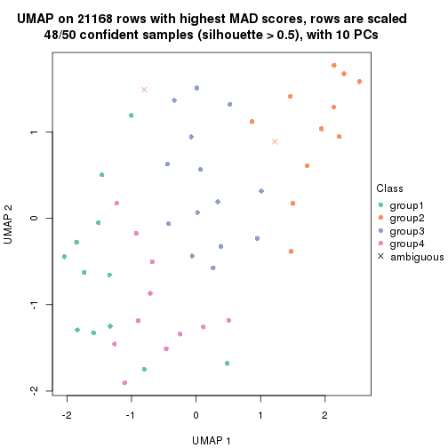</p>

</div>
<div id='tab-MAD-skmeans-dimension-reduction-4'>
<pre><code class="r">dimension_reduction(res, k = 5, method = &quot;UMAP&quot;)
</code></pre>

<p>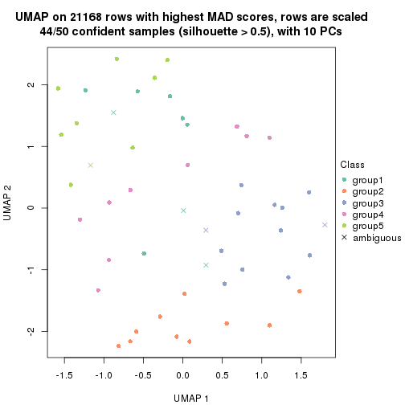</p>

</div>
<div id='tab-MAD-skmeans-dimension-reduction-5'>
<pre><code class="r">dimension_reduction(res, k = 6, method = &quot;UMAP&quot;)
</code></pre>

<p>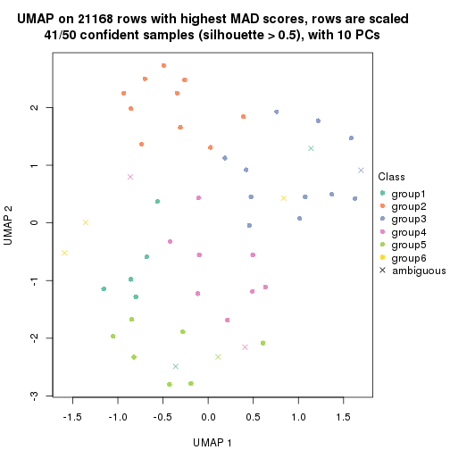</p>

</div>
</div>


Following heatmap shows how subgroups are split when increasing `k`:

```r
collect_classes(res)
```

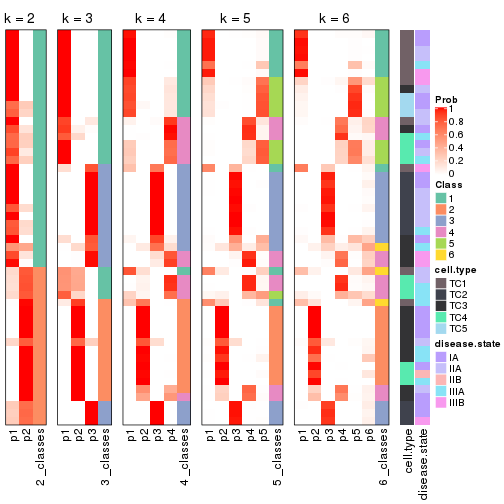


Test correlation between subgroups and known annotations. If the known
annotation is numeric, one-way ANOVA test is applied, and if the known
annotation is discrete, chi-squared contingency table test is applied.

```r
test_to_known_factors(res)
```

```
#>              n cell.type(p) disease.state(p) k
#> MAD:skmeans 49     4.12e-02            0.204 2
#> MAD:skmeans 47     2.28e-07            0.357 3
#> MAD:skmeans 48     1.22e-10            0.431 4
#> MAD:skmeans 44     1.07e-12            0.737 5
#> MAD:skmeans 41     1.20e-12            0.600 6
```


If matrix rows can be associated to genes, consider to use `functional_enrichment(res,
...)` to perform function enrichment for the signature genes. See [this vignette](http://bioconductor.org/packages/devel/bioc/vignettes/cola/inst/doc/functional_enrichment.html) for more detailed explanations.


 

---------------------------------------------------


### MAD:pam


The object with results only for a single top-value method and a single partition method 
can be extracted as:

```r
res = res_list["MAD", "pam"]
# you can also extract it by
# res = res_list["MAD:pam"]
```

A summary of `res` and all the functions that can be applied to it:

```r
res
```

```
#> A 'ConsensusPartition' object with k = 2, 3, 4, 5, 6.
#>   On a matrix with 21168 rows and 50 columns.
#>   Top rows (1000, 2000, 3000, 4000, 5000) are extracted by 'MAD' method.
#>   Subgroups are detected by 'pam' method.
#>   Performed in total 1250 partitions by row resampling.
#>   Best k for subgroups seems to be 5.
#> 
#> Following methods can be applied to this 'ConsensusPartition' object:
#>  [1] "cola_report"             "collect_classes"         "collect_plots"          
#>  [4] "collect_stats"           "colnames"                "compare_signatures"     
#>  [7] "consensus_heatmap"       "dimension_reduction"     "functional_enrichment"  
#> [10] "get_anno_col"            "get_anno"                "get_classes"            
#> [13] "get_consensus"           "get_matrix"              "get_membership"         
#> [16] "get_param"               "get_signatures"          "get_stats"              
#> [19] "is_best_k"               "is_stable_k"             "membership_heatmap"     
#> [22] "ncol"                    "nrow"                    "plot_ecdf"              
#> [25] "rownames"                "select_partition_number" "show"                   
#> [28] "suggest_best_k"          "test_to_known_factors"
```

`collect_plots()` function collects all the plots made from `res` for all `k` (number of partitions)
into one single page to provide an easy and fast comparison between different `k`.

```r
collect_plots(res)
```

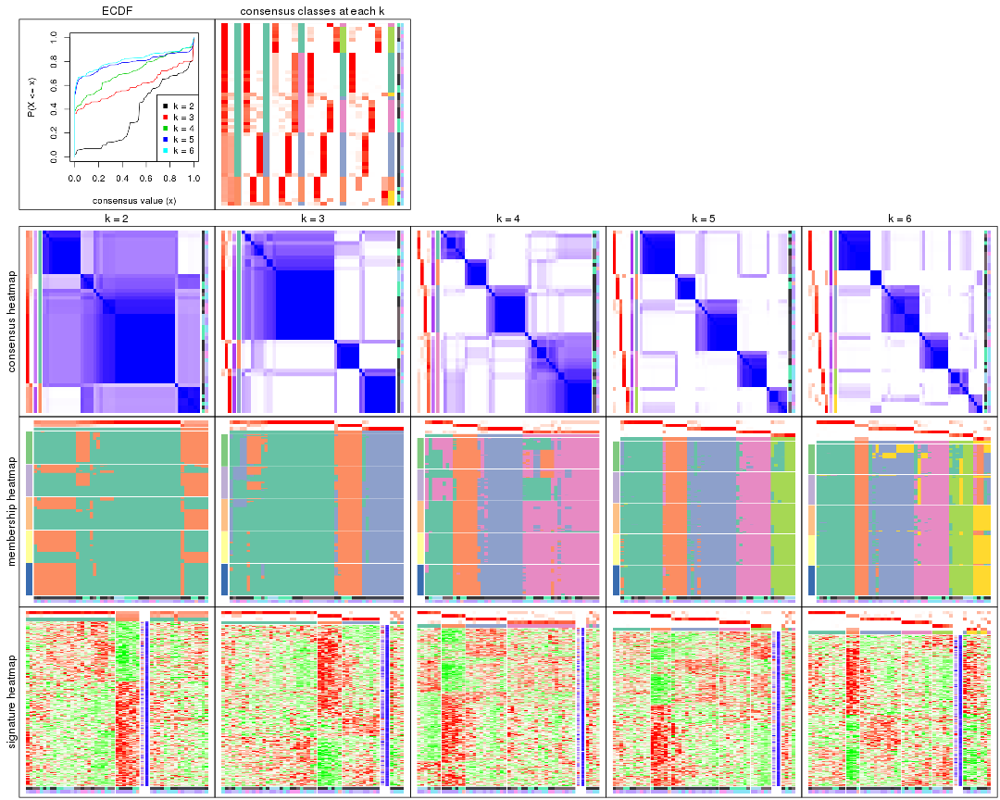

The plots are:

- The first row: a plot of the ECDF (empirical cumulative distribution
  function) curves of the consensus matrix for each `k` and the heatmap of
  predicted classes for each `k`.
- The second row: heatmaps of the consensus matrix for each `k`.
- The third row: heatmaps of the membership matrix for each `k`.
- The fouth row: heatmaps of the signatures for each `k`.

All the plots in panels can be made by individual functions and they are
plotted later in this section.

`select_partition_number()` produces several plots showing different
statistics for choosing "optimized" `k`. There are following statistics:

- ECDF curves of the consensus matrix for each `k`;
- 1-PAC. [The PAC
  score](https://en.wikipedia.org/wiki/Consensus_clustering#Over-interpretation_potential_of_consensus_clustering)
  measures the proportion of the ambiguous subgrouping.
- Mean silhouette score.
- Concordance. The mean probability of fiting the consensus class ids in all
  partitions.
- Area increased. Denote $A_k$ as the area under the ECDF curve for current
  `k`, the area increased is defined as $A_k - A_{k-1}$.
- Rand index. The percent of pairs of samples that are both in a same cluster
  or both are not in a same cluster in the partition of k and k-1.
- Jaccard index. The ratio of pairs of samples are both in a same cluster in
  the partition of k and k-1 and the pairs of samples are both in a same
  cluster in the partition k or k-1.

The detailed explanations of these statistics can be found in [the _cola_
vignette](http://bioconductor.org/packages/devel/bioc/vignettes/cola/inst/doc/cola.html#toc_13).

Generally speaking, lower PAC score, higher mean silhouette score or higher
concordance corresponds to better partition. Rand index and Jaccard index
measure how similar the current partition is compared to partition with `k-1`.
If they are too similar, we won't accept `k` is better than `k-1`.

```r
select_partition_number(res)
```

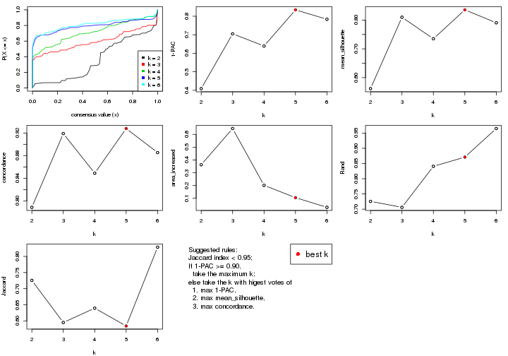

The numeric values for all these statistics can be obtained by `get_stats()`.

```r
get_stats(res)
```

```
#>   k 1-PAC mean_silhouette concordance area_increased  Rand Jaccard
#> 2 2 0.409           0.562       0.789         0.3627 0.726   0.726
#> 3 3 0.705           0.810       0.919         0.6461 0.706   0.595
#> 4 4 0.639           0.735       0.849         0.2012 0.841   0.640
#> 5 5 0.834           0.836       0.928         0.1048 0.871   0.584
#> 6 6 0.784           0.791       0.885         0.0292 0.965   0.829
```

`suggest_best_k()` suggests the best $k$ based on these statistics. The rules are as follows:

- All $k$ with Jaccard index larger than 0.95 are removed because increasing
  $k$ does not provide enough extra information. If all $k$ are removed, it is
  marked as no subgroup is detected.
- For all $k$ with 1-PAC score larger than 0.9, the maximal $k$ is taken as
  the best $k$, and other $k$ are marked as optional $k$.
- If it does not fit the second rule. The $k$ with the maximal vote of the
  highest 1-PAC score, highest mean silhouette, and highest concordance is
  taken as the best $k$.

```r
suggest_best_k(res)
```

```
#> [1] 5
```


Following shows the table of the partitions (You need to click the **show/hide
code output** link to see it). The membership matrix (columns with name `p*`)
is inferred by
[`clue::cl_consensus()`](https://www.rdocumentation.org/link/cl_consensus?package=clue)
function with the `SE` method. Basically the value in the membership matrix
represents the probability to belong to a certain group. The finall class
label for an item is determined with the group with highest probability it
belongs to.

In `get_classes()` function, the entropy is calculated from the membership
matrix and the silhouette score is calculated from the consensus matrix.


<script>
$( function() {
	$( '#tabs-MAD-pam-get-classes' ).tabs();
} );
</script>
<div id='tabs-MAD-pam-get-classes'>
<ul>
<li><a href='#tab-MAD-pam-get-classes-1'>k = 2</a></li>
<li><a href='#tab-MAD-pam-get-classes-2'>k = 3</a></li>
<li><a href='#tab-MAD-pam-get-classes-3'>k = 4</a></li>
<li><a href='#tab-MAD-pam-get-classes-4'>k = 5</a></li>
<li><a href='#tab-MAD-pam-get-classes-5'>k = 6</a></li>
</ul>

<div id='tab-MAD-pam-get-classes-1'>
<p><a id='tab-MAD-pam-get-classes-1-a' style='color:#0366d6' href='#'>show/hide code output</a></p>
<pre><code class="r">cbind(get_classes(res, k = 2), get_membership(res, k = 2))
</code></pre>

<pre><code>#&gt;          class entropy silhouette    p1    p2
#&gt; GSM63448     1   0.000     0.6769 1.000 0.000
#&gt; GSM63449     1   0.000     0.6769 1.000 0.000
#&gt; GSM63423     1   0.000     0.6769 1.000 0.000
#&gt; GSM63425     1   0.000     0.6769 1.000 0.000
#&gt; GSM63437     1   0.000     0.6769 1.000 0.000
#&gt; GSM63453     1   0.000     0.6769 1.000 0.000
#&gt; GSM63431     1   0.000     0.6769 1.000 0.000
#&gt; GSM63450     1   0.584     0.5874 0.860 0.140
#&gt; GSM63428     1   0.000     0.6769 1.000 0.000
#&gt; GSM63432     1   0.224     0.6667 0.964 0.036
#&gt; GSM63458     1   0.000     0.6769 1.000 0.000
#&gt; GSM63434     1   0.966     0.4806 0.608 0.392
#&gt; GSM63435     1   0.995     0.4520 0.540 0.460
#&gt; GSM63442     1   0.995     0.4520 0.540 0.460
#&gt; GSM63451     1   0.997     0.4436 0.532 0.468
#&gt; GSM63422     1   0.995     0.4520 0.540 0.460
#&gt; GSM63438     1   0.995     0.4520 0.540 0.460
#&gt; GSM63439     1   0.995     0.4520 0.540 0.460
#&gt; GSM63461     1   0.995     0.4520 0.540 0.460
#&gt; GSM63463     1   0.995     0.4520 0.540 0.460
#&gt; GSM63430     1   0.995     0.4520 0.540 0.460
#&gt; GSM63446     1   0.995     0.4520 0.540 0.460
#&gt; GSM63429     1   0.000     0.6769 1.000 0.000
#&gt; GSM63445     1   0.260     0.6639 0.956 0.044
#&gt; GSM63447     1   0.000     0.6769 1.000 0.000
#&gt; GSM63459     2   0.995     0.8605 0.460 0.540
#&gt; GSM63464     2   0.990     0.8633 0.440 0.560
#&gt; GSM63469     2   0.992     0.8675 0.448 0.552
#&gt; GSM63470     2   0.994     0.8644 0.456 0.544
#&gt; GSM63436     1   0.000     0.6769 1.000 0.000
#&gt; GSM63443     1   0.745     0.5434 0.788 0.212
#&gt; GSM63465     1   0.871    -0.1397 0.708 0.292
#&gt; GSM63444     1   0.939    -0.3725 0.644 0.356
#&gt; GSM63456     2   0.767     0.0887 0.224 0.776
#&gt; GSM63462     1   0.973     0.4674 0.596 0.404
#&gt; GSM63424     1   0.260     0.6638 0.956 0.044
#&gt; GSM63440     1   0.224     0.6667 0.964 0.036
#&gt; GSM63433     1   0.000     0.6769 1.000 0.000
#&gt; GSM63466     2   0.995     0.8605 0.460 0.540
#&gt; GSM63426     1   0.000     0.6769 1.000 0.000
#&gt; GSM63468     1   0.850    -0.1056 0.724 0.276
#&gt; GSM63452     2   0.992     0.8674 0.448 0.552
#&gt; GSM63441     1   0.000     0.6769 1.000 0.000
#&gt; GSM63454     1   0.844    -0.0878 0.728 0.272
#&gt; GSM63455     1   0.000     0.6769 1.000 0.000
#&gt; GSM63460     2   0.990     0.8633 0.440 0.560
#&gt; GSM63467     1   0.416     0.5431 0.916 0.084
#&gt; GSM63421     1   0.000     0.6769 1.000 0.000
#&gt; GSM63427     1   0.000     0.6769 1.000 0.000
#&gt; GSM63457     1   0.000     0.6769 1.000 0.000
</code></pre>

<script>
$('#tab-MAD-pam-get-classes-1-a').parent().next().next().hide();
$('#tab-MAD-pam-get-classes-1-a').click(function(){
  $('#tab-MAD-pam-get-classes-1-a').parent().next().next().toggle();
  return(false);
});
</script>
</div>

<div id='tab-MAD-pam-get-classes-2'>
<p><a id='tab-MAD-pam-get-classes-2-a' style='color:#0366d6' href='#'>show/hide code output</a></p>
<pre><code class="r">cbind(get_classes(res, k = 3), get_membership(res, k = 3))
</code></pre>

<pre><code>#&gt;          class entropy silhouette    p1    p2    p3
#&gt; GSM63448     1  0.0000     0.8916 1.000 0.000 0.000
#&gt; GSM63449     1  0.0000     0.8916 1.000 0.000 0.000
#&gt; GSM63423     1  0.0000     0.8916 1.000 0.000 0.000
#&gt; GSM63425     1  0.0000     0.8916 1.000 0.000 0.000
#&gt; GSM63437     1  0.0000     0.8916 1.000 0.000 0.000
#&gt; GSM63453     1  0.0000     0.8916 1.000 0.000 0.000
#&gt; GSM63431     1  0.0000     0.8916 1.000 0.000 0.000
#&gt; GSM63450     1  0.5263     0.7823 0.828 0.088 0.084
#&gt; GSM63428     1  0.0000     0.8916 1.000 0.000 0.000
#&gt; GSM63432     1  0.3482     0.8056 0.872 0.000 0.128
#&gt; GSM63458     1  0.0000     0.8916 1.000 0.000 0.000
#&gt; GSM63434     3  0.4750     0.6389 0.216 0.000 0.784
#&gt; GSM63435     3  0.0000     0.9250 0.000 0.000 1.000
#&gt; GSM63442     3  0.0000     0.9250 0.000 0.000 1.000
#&gt; GSM63451     3  0.0000     0.9250 0.000 0.000 1.000
#&gt; GSM63422     3  0.0000     0.9250 0.000 0.000 1.000
#&gt; GSM63438     3  0.0000     0.9250 0.000 0.000 1.000
#&gt; GSM63439     3  0.0000     0.9250 0.000 0.000 1.000
#&gt; GSM63461     3  0.0000     0.9250 0.000 0.000 1.000
#&gt; GSM63463     3  0.0000     0.9250 0.000 0.000 1.000
#&gt; GSM63430     3  0.0000     0.9250 0.000 0.000 1.000
#&gt; GSM63446     3  0.0000     0.9250 0.000 0.000 1.000
#&gt; GSM63429     1  0.0000     0.8916 1.000 0.000 0.000
#&gt; GSM63445     1  0.3551     0.8024 0.868 0.000 0.132
#&gt; GSM63447     1  0.0000     0.8916 1.000 0.000 0.000
#&gt; GSM63459     2  0.0000     0.9222 0.000 1.000 0.000
#&gt; GSM63464     2  0.0747     0.9069 0.016 0.984 0.000
#&gt; GSM63469     2  0.0000     0.9222 0.000 1.000 0.000
#&gt; GSM63470     2  0.0000     0.9222 0.000 1.000 0.000
#&gt; GSM63436     1  0.0000     0.8916 1.000 0.000 0.000
#&gt; GSM63443     1  0.7685     0.2187 0.564 0.052 0.384
#&gt; GSM63465     1  0.6388     0.6147 0.692 0.284 0.024
#&gt; GSM63444     1  0.7063     0.1992 0.516 0.464 0.020
#&gt; GSM63456     2  0.8211     0.0607 0.072 0.464 0.464
#&gt; GSM63462     3  0.5835     0.4753 0.340 0.000 0.660
#&gt; GSM63424     1  0.5733     0.5602 0.676 0.000 0.324
#&gt; GSM63440     1  0.5621     0.5866 0.692 0.000 0.308
#&gt; GSM63433     1  0.0000     0.8916 1.000 0.000 0.000
#&gt; GSM63466     2  0.0000     0.9222 0.000 1.000 0.000
#&gt; GSM63426     1  0.0000     0.8916 1.000 0.000 0.000
#&gt; GSM63468     1  0.5397     0.6411 0.720 0.280 0.000
#&gt; GSM63452     2  0.0000     0.9222 0.000 1.000 0.000
#&gt; GSM63441     1  0.0000     0.8916 1.000 0.000 0.000
#&gt; GSM63454     1  0.5397     0.6411 0.720 0.280 0.000
#&gt; GSM63455     1  0.0000     0.8916 1.000 0.000 0.000
#&gt; GSM63460     2  0.0000     0.9222 0.000 1.000 0.000
#&gt; GSM63467     1  0.2711     0.8391 0.912 0.088 0.000
#&gt; GSM63421     1  0.0000     0.8916 1.000 0.000 0.000
#&gt; GSM63427     1  0.0000     0.8916 1.000 0.000 0.000
#&gt; GSM63457     1  0.0000     0.8916 1.000 0.000 0.000
</code></pre>

<script>
$('#tab-MAD-pam-get-classes-2-a').parent().next().next().hide();
$('#tab-MAD-pam-get-classes-2-a').click(function(){
  $('#tab-MAD-pam-get-classes-2-a').parent().next().next().toggle();
  return(false);
});
</script>
</div>

<div id='tab-MAD-pam-get-classes-3'>
<p><a id='tab-MAD-pam-get-classes-3-a' style='color:#0366d6' href='#'>show/hide code output</a></p>
<pre><code class="r">cbind(get_classes(res, k = 4), get_membership(res, k = 4))
</code></pre>

<pre><code>#&gt;          class entropy silhouette    p1    p2    p3    p4
#&gt; GSM63448     4  0.3907    0.72636 0.232 0.000 0.000 0.768
#&gt; GSM63449     4  0.3907    0.72636 0.232 0.000 0.000 0.768
#&gt; GSM63423     4  0.3907    0.72636 0.232 0.000 0.000 0.768
#&gt; GSM63425     4  0.2760    0.71677 0.128 0.000 0.000 0.872
#&gt; GSM63437     4  0.3907    0.72636 0.232 0.000 0.000 0.768
#&gt; GSM63453     1  0.3444    0.79062 0.816 0.000 0.000 0.184
#&gt; GSM63431     1  0.2760    0.78708 0.872 0.000 0.000 0.128
#&gt; GSM63450     4  0.4452    0.63587 0.032 0.056 0.076 0.836
#&gt; GSM63428     4  0.3907    0.72636 0.232 0.000 0.000 0.768
#&gt; GSM63432     4  0.5995    0.67634 0.232 0.000 0.096 0.672
#&gt; GSM63458     1  0.2149    0.81654 0.912 0.000 0.000 0.088
#&gt; GSM63434     3  0.4832    0.62908 0.056 0.000 0.768 0.176
#&gt; GSM63435     3  0.0000    0.90652 0.000 0.000 1.000 0.000
#&gt; GSM63442     3  0.0000    0.90652 0.000 0.000 1.000 0.000
#&gt; GSM63451     3  0.0000    0.90652 0.000 0.000 1.000 0.000
#&gt; GSM63422     3  0.0000    0.90652 0.000 0.000 1.000 0.000
#&gt; GSM63438     3  0.0000    0.90652 0.000 0.000 1.000 0.000
#&gt; GSM63439     3  0.0000    0.90652 0.000 0.000 1.000 0.000
#&gt; GSM63461     3  0.0000    0.90652 0.000 0.000 1.000 0.000
#&gt; GSM63463     3  0.0000    0.90652 0.000 0.000 1.000 0.000
#&gt; GSM63430     3  0.0000    0.90652 0.000 0.000 1.000 0.000
#&gt; GSM63446     3  0.0188    0.90348 0.004 0.000 0.996 0.000
#&gt; GSM63429     4  0.3907    0.72636 0.232 0.000 0.000 0.768
#&gt; GSM63445     4  0.6019    0.67591 0.228 0.000 0.100 0.672
#&gt; GSM63447     4  0.3907    0.72636 0.232 0.000 0.000 0.768
#&gt; GSM63459     2  0.0000    0.96112 0.000 1.000 0.000 0.000
#&gt; GSM63464     2  0.0592    0.94726 0.000 0.984 0.000 0.016
#&gt; GSM63469     2  0.0000    0.96112 0.000 1.000 0.000 0.000
#&gt; GSM63470     2  0.0000    0.96112 0.000 1.000 0.000 0.000
#&gt; GSM63436     1  0.4331    0.43739 0.712 0.000 0.000 0.288
#&gt; GSM63443     4  0.6719   -0.00348 0.016 0.052 0.460 0.472
#&gt; GSM63465     4  0.3311    0.59176 0.000 0.172 0.000 0.828
#&gt; GSM63444     4  0.8765    0.37082 0.160 0.352 0.072 0.416
#&gt; GSM63456     3  0.6680    0.30244 0.032 0.356 0.572 0.040
#&gt; GSM63462     3  0.5833    0.52801 0.096 0.000 0.692 0.212
#&gt; GSM63424     4  0.3873    0.53953 0.000 0.000 0.228 0.772
#&gt; GSM63440     4  0.4319    0.54560 0.012 0.000 0.228 0.760
#&gt; GSM63433     4  0.4103    0.70556 0.256 0.000 0.000 0.744
#&gt; GSM63466     2  0.0000    0.96112 0.000 1.000 0.000 0.000
#&gt; GSM63426     4  0.3907    0.72636 0.232 0.000 0.000 0.768
#&gt; GSM63468     4  0.3266    0.59490 0.000 0.168 0.000 0.832
#&gt; GSM63452     2  0.0000    0.96112 0.000 1.000 0.000 0.000
#&gt; GSM63441     4  0.0000    0.67592 0.000 0.000 0.000 1.000
#&gt; GSM63454     4  0.3266    0.59490 0.000 0.168 0.000 0.832
#&gt; GSM63455     1  0.3907    0.57670 0.768 0.000 0.000 0.232
#&gt; GSM63460     2  0.3569    0.77498 0.000 0.804 0.000 0.196
#&gt; GSM63467     4  0.1970    0.66218 0.008 0.060 0.000 0.932
#&gt; GSM63421     1  0.0000    0.83418 1.000 0.000 0.000 0.000
#&gt; GSM63427     1  0.0000    0.83418 1.000 0.000 0.000 0.000
#&gt; GSM63457     1  0.0000    0.83418 1.000 0.000 0.000 0.000
</code></pre>

<script>
$('#tab-MAD-pam-get-classes-3-a').parent().next().next().hide();
$('#tab-MAD-pam-get-classes-3-a').click(function(){
  $('#tab-MAD-pam-get-classes-3-a').parent().next().next().toggle();
  return(false);
});
</script>
</div>

<div id='tab-MAD-pam-get-classes-4'>
<p><a id='tab-MAD-pam-get-classes-4-a' style='color:#0366d6' href='#'>show/hide code output</a></p>
<pre><code class="r">cbind(get_classes(res, k = 5), get_membership(res, k = 5))
</code></pre>

<pre><code>#&gt;          class entropy silhouette    p1    p2    p3    p4    p5
#&gt; GSM63448     1  0.0000      0.955 1.000 0.000 0.000 0.000 0.000
#&gt; GSM63449     1  0.0000      0.955 1.000 0.000 0.000 0.000 0.000
#&gt; GSM63423     1  0.0000      0.955 1.000 0.000 0.000 0.000 0.000
#&gt; GSM63425     4  0.4074      0.445 0.364 0.000 0.000 0.636 0.000
#&gt; GSM63437     1  0.0000      0.955 1.000 0.000 0.000 0.000 0.000
#&gt; GSM63453     5  0.3074      0.806 0.196 0.000 0.000 0.000 0.804
#&gt; GSM63431     5  0.3242      0.790 0.216 0.000 0.000 0.000 0.784
#&gt; GSM63450     4  0.2629      0.804 0.136 0.000 0.004 0.860 0.000
#&gt; GSM63428     1  0.0000      0.955 1.000 0.000 0.000 0.000 0.000
#&gt; GSM63432     1  0.0162      0.952 0.996 0.000 0.004 0.000 0.000
#&gt; GSM63458     5  0.2690      0.821 0.156 0.000 0.000 0.000 0.844
#&gt; GSM63434     3  0.3752      0.594 0.292 0.000 0.708 0.000 0.000
#&gt; GSM63435     3  0.0000      0.900 0.000 0.000 1.000 0.000 0.000
#&gt; GSM63442     3  0.0000      0.900 0.000 0.000 1.000 0.000 0.000
#&gt; GSM63451     3  0.0000      0.900 0.000 0.000 1.000 0.000 0.000
#&gt; GSM63422     3  0.0000      0.900 0.000 0.000 1.000 0.000 0.000
#&gt; GSM63438     3  0.0609      0.889 0.020 0.000 0.980 0.000 0.000
#&gt; GSM63439     3  0.0162      0.899 0.004 0.000 0.996 0.000 0.000
#&gt; GSM63461     3  0.0000      0.900 0.000 0.000 1.000 0.000 0.000
#&gt; GSM63463     3  0.0000      0.900 0.000 0.000 1.000 0.000 0.000
#&gt; GSM63430     3  0.0000      0.900 0.000 0.000 1.000 0.000 0.000
#&gt; GSM63446     3  0.0162      0.899 0.004 0.000 0.996 0.000 0.000
#&gt; GSM63429     1  0.0000      0.955 1.000 0.000 0.000 0.000 0.000
#&gt; GSM63445     1  0.0404      0.945 0.988 0.000 0.012 0.000 0.000
#&gt; GSM63447     1  0.0000      0.955 1.000 0.000 0.000 0.000 0.000
#&gt; GSM63459     2  0.0000      0.904 0.000 1.000 0.000 0.000 0.000
#&gt; GSM63464     2  0.0510      0.890 0.016 0.984 0.000 0.000 0.000
#&gt; GSM63469     2  0.0000      0.904 0.000 1.000 0.000 0.000 0.000
#&gt; GSM63470     2  0.0000      0.904 0.000 1.000 0.000 0.000 0.000
#&gt; GSM63436     5  0.4150      0.457 0.388 0.000 0.000 0.000 0.612
#&gt; GSM63443     3  0.5026      0.571 0.280 0.064 0.656 0.000 0.000
#&gt; GSM63465     4  0.0000      0.916 0.000 0.000 0.000 1.000 0.000
#&gt; GSM63444     1  0.5605      0.492 0.640 0.168 0.192 0.000 0.000
#&gt; GSM63456     3  0.4382      0.702 0.060 0.176 0.760 0.004 0.000
#&gt; GSM63462     3  0.3424      0.660 0.240 0.000 0.760 0.000 0.000
#&gt; GSM63424     4  0.0880      0.900 0.000 0.000 0.032 0.968 0.000
#&gt; GSM63440     4  0.1195      0.901 0.012 0.000 0.028 0.960 0.000
#&gt; GSM63433     1  0.0703      0.933 0.976 0.000 0.000 0.000 0.024
#&gt; GSM63466     2  0.0000      0.904 0.000 1.000 0.000 0.000 0.000
#&gt; GSM63426     1  0.0162      0.952 0.996 0.000 0.000 0.004 0.000
#&gt; GSM63468     4  0.0000      0.916 0.000 0.000 0.000 1.000 0.000
#&gt; GSM63452     2  0.0000      0.904 0.000 1.000 0.000 0.000 0.000
#&gt; GSM63441     4  0.0000      0.916 0.000 0.000 0.000 1.000 0.000
#&gt; GSM63454     4  0.0000      0.916 0.000 0.000 0.000 1.000 0.000
#&gt; GSM63455     4  0.0000      0.916 0.000 0.000 0.000 1.000 0.000
#&gt; GSM63460     2  0.4304      0.083 0.000 0.516 0.000 0.484 0.000
#&gt; GSM63467     4  0.0703      0.906 0.024 0.000 0.000 0.976 0.000
#&gt; GSM63421     5  0.0000      0.801 0.000 0.000 0.000 0.000 1.000
#&gt; GSM63427     5  0.0000      0.801 0.000 0.000 0.000 0.000 1.000
#&gt; GSM63457     5  0.0000      0.801 0.000 0.000 0.000 0.000 1.000
</code></pre>

<script>
$('#tab-MAD-pam-get-classes-4-a').parent().next().next().hide();
$('#tab-MAD-pam-get-classes-4-a').click(function(){
  $('#tab-MAD-pam-get-classes-4-a').parent().next().next().toggle();
  return(false);
});
</script>
</div>

<div id='tab-MAD-pam-get-classes-5'>
<p><a id='tab-MAD-pam-get-classes-5-a' style='color:#0366d6' href='#'>show/hide code output</a></p>
<pre><code class="r">cbind(get_classes(res, k = 6), get_membership(res, k = 6))
</code></pre>

<pre><code>#&gt;          class entropy silhouette    p1    p2    p3    p4    p5    p6
#&gt; GSM63448     1  0.0000      0.990 1.000 0.000 0.000 0.000 0.000 0.000
#&gt; GSM63449     1  0.0000      0.990 1.000 0.000 0.000 0.000 0.000 0.000
#&gt; GSM63423     1  0.0000      0.990 1.000 0.000 0.000 0.000 0.000 0.000
#&gt; GSM63425     4  0.3659      0.451 0.364 0.000 0.000 0.636 0.000 0.000
#&gt; GSM63437     1  0.0000      0.990 1.000 0.000 0.000 0.000 0.000 0.000
#&gt; GSM63453     5  0.5030      0.619 0.096 0.316 0.000 0.000 0.588 0.000
#&gt; GSM63431     5  0.2941      0.727 0.220 0.000 0.000 0.000 0.780 0.000
#&gt; GSM63450     4  0.5123      0.503 0.092 0.316 0.004 0.588 0.000 0.000
#&gt; GSM63428     1  0.0000      0.990 1.000 0.000 0.000 0.000 0.000 0.000
#&gt; GSM63432     1  0.0508      0.980 0.984 0.004 0.012 0.000 0.000 0.000
#&gt; GSM63458     5  0.2416      0.761 0.156 0.000 0.000 0.000 0.844 0.000
#&gt; GSM63434     3  0.4845      0.523 0.280 0.092 0.628 0.000 0.000 0.000
#&gt; GSM63435     3  0.1444      0.854 0.000 0.072 0.928 0.000 0.000 0.000
#&gt; GSM63442     3  0.0146      0.852 0.000 0.004 0.996 0.000 0.000 0.000
#&gt; GSM63451     3  0.0000      0.853 0.000 0.000 1.000 0.000 0.000 0.000
#&gt; GSM63422     3  0.0260      0.852 0.000 0.008 0.992 0.000 0.000 0.000
#&gt; GSM63438     3  0.2121      0.845 0.012 0.096 0.892 0.000 0.000 0.000
#&gt; GSM63439     3  0.1814      0.848 0.000 0.100 0.900 0.000 0.000 0.000
#&gt; GSM63461     3  0.1765      0.848 0.000 0.096 0.904 0.000 0.000 0.000
#&gt; GSM63463     3  0.0146      0.852 0.000 0.004 0.996 0.000 0.000 0.000
#&gt; GSM63430     3  0.1814      0.848 0.000 0.100 0.900 0.000 0.000 0.000
#&gt; GSM63446     3  0.0000      0.853 0.000 0.000 1.000 0.000 0.000 0.000
#&gt; GSM63429     1  0.0146      0.989 0.996 0.000 0.000 0.004 0.000 0.000
#&gt; GSM63445     1  0.0692      0.971 0.976 0.004 0.020 0.000 0.000 0.000
#&gt; GSM63447     1  0.0146      0.989 0.996 0.000 0.000 0.004 0.000 0.000
#&gt; GSM63459     2  0.3797      1.000 0.000 0.580 0.000 0.000 0.000 0.420
#&gt; GSM63464     6  0.0000      0.360 0.000 0.000 0.000 0.000 0.000 1.000
#&gt; GSM63469     2  0.3797      1.000 0.000 0.580 0.000 0.000 0.000 0.420
#&gt; GSM63470     2  0.3797      1.000 0.000 0.580 0.000 0.000 0.000 0.420
#&gt; GSM63436     5  0.3727      0.447 0.388 0.000 0.000 0.000 0.612 0.000
#&gt; GSM63443     3  0.4971      0.465 0.212 0.128 0.656 0.000 0.000 0.004
#&gt; GSM63465     4  0.0000      0.864 0.000 0.000 0.000 1.000 0.000 0.000
#&gt; GSM63444     6  0.5419      0.495 0.200 0.000 0.220 0.000 0.000 0.580
#&gt; GSM63456     6  0.4362      0.395 0.028 0.000 0.388 0.000 0.000 0.584
#&gt; GSM63462     3  0.3354      0.630 0.240 0.004 0.752 0.004 0.000 0.000
#&gt; GSM63424     4  0.2350      0.800 0.000 0.100 0.020 0.880 0.000 0.000
#&gt; GSM63440     4  0.2163      0.812 0.004 0.096 0.008 0.892 0.000 0.000
#&gt; GSM63433     1  0.0713      0.967 0.972 0.000 0.000 0.000 0.028 0.000
#&gt; GSM63466     6  0.0000      0.360 0.000 0.000 0.000 0.000 0.000 1.000
#&gt; GSM63426     1  0.0291      0.987 0.992 0.000 0.000 0.004 0.004 0.000
#&gt; GSM63468     4  0.0000      0.864 0.000 0.000 0.000 1.000 0.000 0.000
#&gt; GSM63452     2  0.3797      1.000 0.000 0.580 0.000 0.000 0.000 0.420
#&gt; GSM63441     4  0.0000      0.864 0.000 0.000 0.000 1.000 0.000 0.000
#&gt; GSM63454     4  0.0000      0.864 0.000 0.000 0.000 1.000 0.000 0.000
#&gt; GSM63455     4  0.0000      0.864 0.000 0.000 0.000 1.000 0.000 0.000
#&gt; GSM63460     6  0.3647      0.371 0.000 0.000 0.000 0.360 0.000 0.640
#&gt; GSM63467     4  0.0632      0.854 0.024 0.000 0.000 0.976 0.000 0.000
#&gt; GSM63421     5  0.0000      0.767 0.000 0.000 0.000 0.000 1.000 0.000
#&gt; GSM63427     5  0.0000      0.767 0.000 0.000 0.000 0.000 1.000 0.000
#&gt; GSM63457     5  0.0000      0.767 0.000 0.000 0.000 0.000 1.000 0.000
</code></pre>

<script>
$('#tab-MAD-pam-get-classes-5-a').parent().next().next().hide();
$('#tab-MAD-pam-get-classes-5-a').click(function(){
  $('#tab-MAD-pam-get-classes-5-a').parent().next().next().toggle();
  return(false);
});
</script>
</div>
</div>

Heatmaps for the consensus matrix. It visualizes the probability of two
samples to be in a same group.


<script>
$( function() {
	$( '#tabs-MAD-pam-consensus-heatmap' ).tabs();
} );
</script>
<div id='tabs-MAD-pam-consensus-heatmap'>
<ul>
<li><a href='#tab-MAD-pam-consensus-heatmap-1'>k = 2</a></li>
<li><a href='#tab-MAD-pam-consensus-heatmap-2'>k = 3</a></li>
<li><a href='#tab-MAD-pam-consensus-heatmap-3'>k = 4</a></li>
<li><a href='#tab-MAD-pam-consensus-heatmap-4'>k = 5</a></li>
<li><a href='#tab-MAD-pam-consensus-heatmap-5'>k = 6</a></li>
</ul>
<div id='tab-MAD-pam-consensus-heatmap-1'>
<pre><code class="r">consensus_heatmap(res, k = 2)
</code></pre>

<p>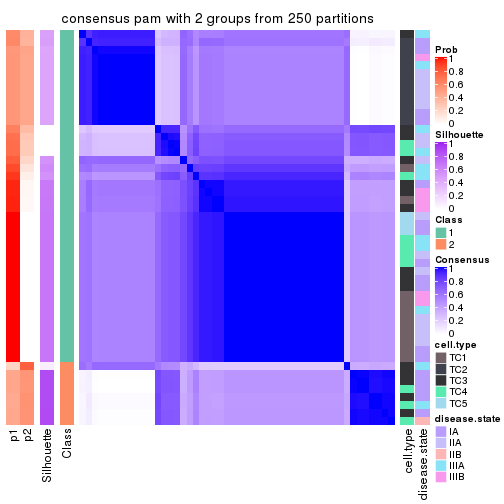</p>

</div>
<div id='tab-MAD-pam-consensus-heatmap-2'>
<pre><code class="r">consensus_heatmap(res, k = 3)
</code></pre>

<p>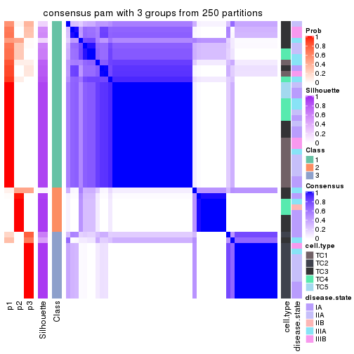</p>

</div>
<div id='tab-MAD-pam-consensus-heatmap-3'>
<pre><code class="r">consensus_heatmap(res, k = 4)
</code></pre>

<p>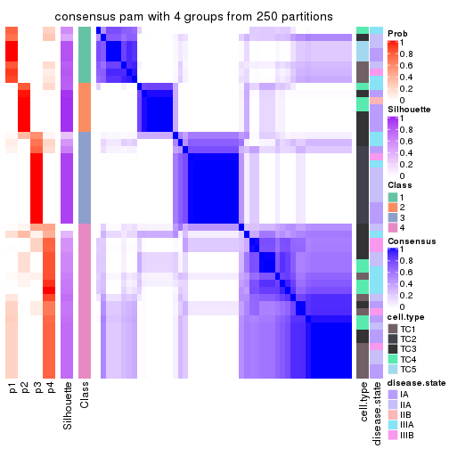</p>

</div>
<div id='tab-MAD-pam-consensus-heatmap-4'>
<pre><code class="r">consensus_heatmap(res, k = 5)
</code></pre>

<p>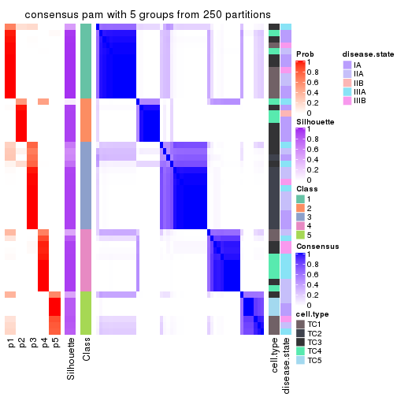</p>

</div>
<div id='tab-MAD-pam-consensus-heatmap-5'>
<pre><code class="r">consensus_heatmap(res, k = 6)
</code></pre>

<p>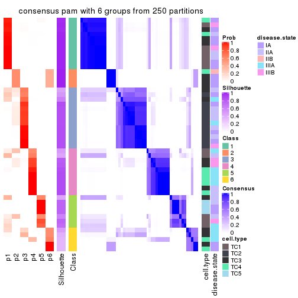</p>

</div>
</div>

Heatmaps for the membership of samples in all partitions to see how consistent they are:


<script>
$( function() {
	$( '#tabs-MAD-pam-membership-heatmap' ).tabs();
} );
</script>
<div id='tabs-MAD-pam-membership-heatmap'>
<ul>
<li><a href='#tab-MAD-pam-membership-heatmap-1'>k = 2</a></li>
<li><a href='#tab-MAD-pam-membership-heatmap-2'>k = 3</a></li>
<li><a href='#tab-MAD-pam-membership-heatmap-3'>k = 4</a></li>
<li><a href='#tab-MAD-pam-membership-heatmap-4'>k = 5</a></li>
<li><a href='#tab-MAD-pam-membership-heatmap-5'>k = 6</a></li>
</ul>
<div id='tab-MAD-pam-membership-heatmap-1'>
<pre><code class="r">membership_heatmap(res, k = 2)
</code></pre>

<p>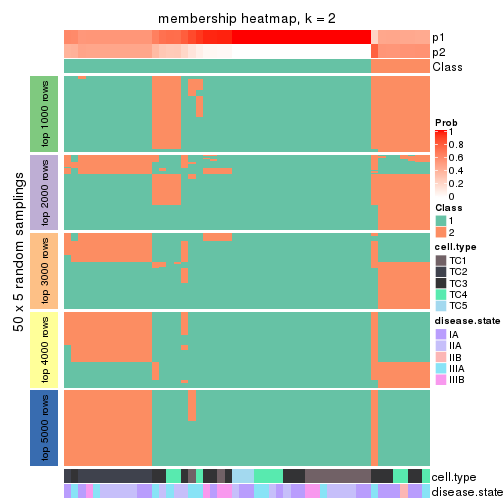</p>

</div>
<div id='tab-MAD-pam-membership-heatmap-2'>
<pre><code class="r">membership_heatmap(res, k = 3)
</code></pre>

<p>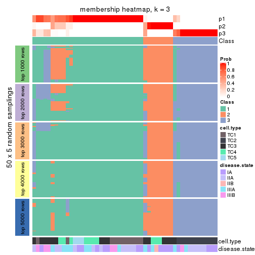</p>

</div>
<div id='tab-MAD-pam-membership-heatmap-3'>
<pre><code class="r">membership_heatmap(res, k = 4)
</code></pre>

<p>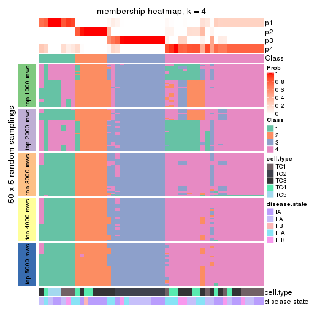</p>

</div>
<div id='tab-MAD-pam-membership-heatmap-4'>
<pre><code class="r">membership_heatmap(res, k = 5)
</code></pre>

<p>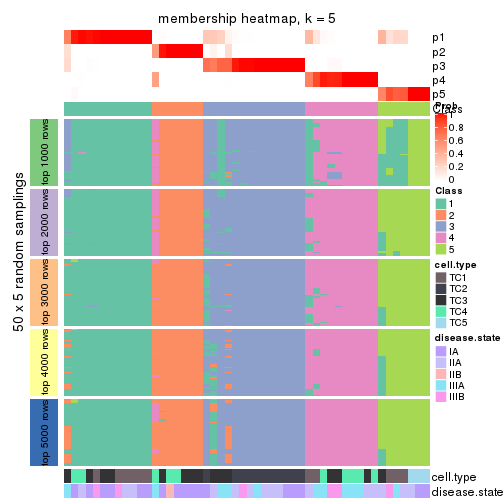</p>

</div>
<div id='tab-MAD-pam-membership-heatmap-5'>
<pre><code class="r">membership_heatmap(res, k = 6)
</code></pre>

<p>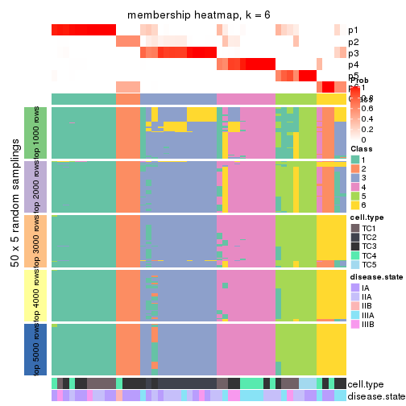</p>

</div>
</div>

As soon as we have had the classes for columns, we can look for signatures
which are significantly different between classes which can be candidate marks
for certain classes. Following are the heatmaps for signatures.


Signature heatmaps where rows are scaled:


<script>
$( function() {
	$( '#tabs-MAD-pam-get-signatures' ).tabs();
} );
</script>
<div id='tabs-MAD-pam-get-signatures'>
<ul>
<li><a href='#tab-MAD-pam-get-signatures-1'>k = 2</a></li>
<li><a href='#tab-MAD-pam-get-signatures-2'>k = 3</a></li>
<li><a href='#tab-MAD-pam-get-signatures-3'>k = 4</a></li>
<li><a href='#tab-MAD-pam-get-signatures-4'>k = 5</a></li>
<li><a href='#tab-MAD-pam-get-signatures-5'>k = 6</a></li>
</ul>
<div id='tab-MAD-pam-get-signatures-1'>
<pre><code class="r">get_signatures(res, k = 2)
</code></pre>

<p>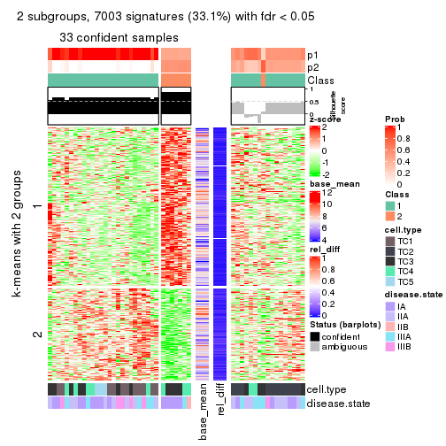</p>

</div>
<div id='tab-MAD-pam-get-signatures-2'>
<pre><code class="r">get_signatures(res, k = 3)
</code></pre>

<p>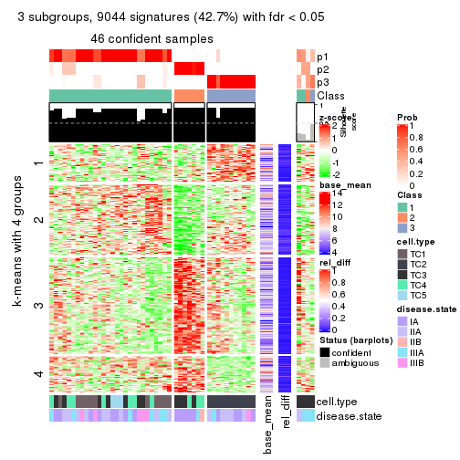</p>

</div>
<div id='tab-MAD-pam-get-signatures-3'>
<pre><code class="r">get_signatures(res, k = 4)
</code></pre>

<p>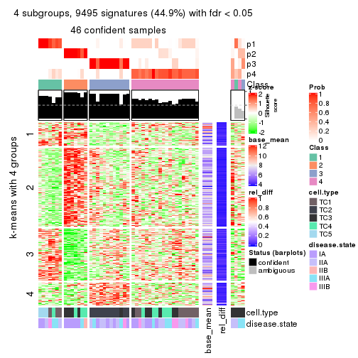</p>

</div>
<div id='tab-MAD-pam-get-signatures-4'>
<pre><code class="r">get_signatures(res, k = 5)
</code></pre>

<p>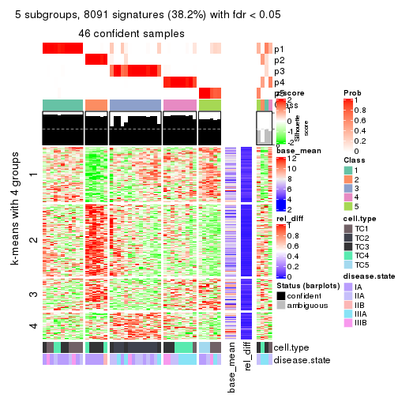</p>

</div>
<div id='tab-MAD-pam-get-signatures-5'>
<pre><code class="r">get_signatures(res, k = 6)
</code></pre>

<p>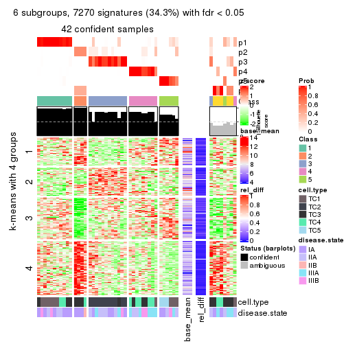</p>

</div>
</div>


Signature heatmaps where rows are not scaled:


<script>
$( function() {
	$( '#tabs-MAD-pam-get-signatures-no-scale' ).tabs();
} );
</script>
<div id='tabs-MAD-pam-get-signatures-no-scale'>
<ul>
<li><a href='#tab-MAD-pam-get-signatures-no-scale-1'>k = 2</a></li>
<li><a href='#tab-MAD-pam-get-signatures-no-scale-2'>k = 3</a></li>
<li><a href='#tab-MAD-pam-get-signatures-no-scale-3'>k = 4</a></li>
<li><a href='#tab-MAD-pam-get-signatures-no-scale-4'>k = 5</a></li>
<li><a href='#tab-MAD-pam-get-signatures-no-scale-5'>k = 6</a></li>
</ul>
<div id='tab-MAD-pam-get-signatures-no-scale-1'>
<pre><code class="r">get_signatures(res, k = 2, scale_rows = FALSE)
</code></pre>

<p>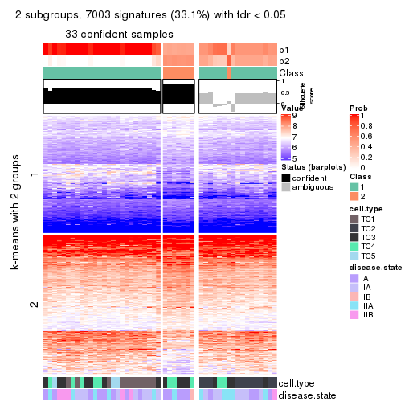</p>

</div>
<div id='tab-MAD-pam-get-signatures-no-scale-2'>
<pre><code class="r">get_signatures(res, k = 3, scale_rows = FALSE)
</code></pre>

<p>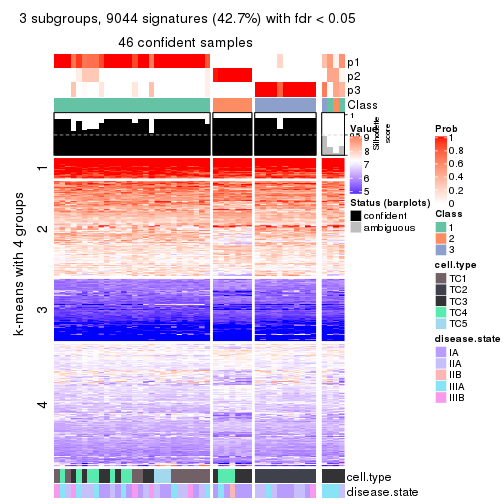</p>

</div>
<div id='tab-MAD-pam-get-signatures-no-scale-3'>
<pre><code class="r">get_signatures(res, k = 4, scale_rows = FALSE)
</code></pre>

<p>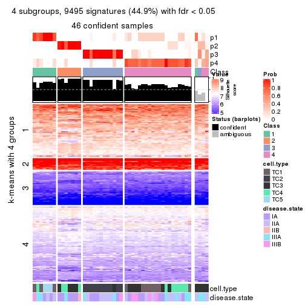</p>

</div>
<div id='tab-MAD-pam-get-signatures-no-scale-4'>
<pre><code class="r">get_signatures(res, k = 5, scale_rows = FALSE)
</code></pre>

<p>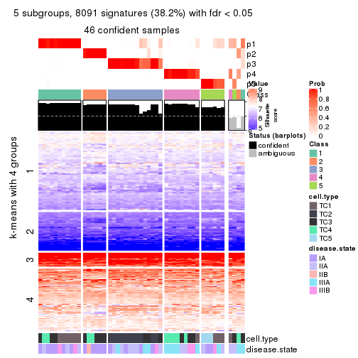</p>

</div>
<div id='tab-MAD-pam-get-signatures-no-scale-5'>
<pre><code class="r">get_signatures(res, k = 6, scale_rows = FALSE)
</code></pre>

<p>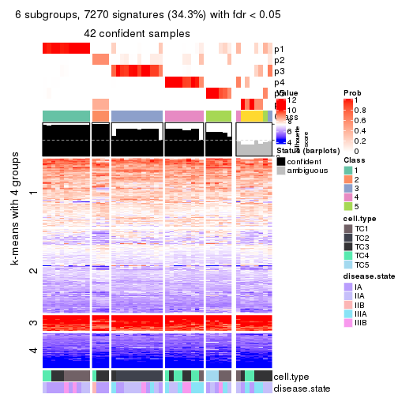</p>

</div>
</div>


Compare the overlap of signatures from different k:

```r
compare_signatures(res)
```

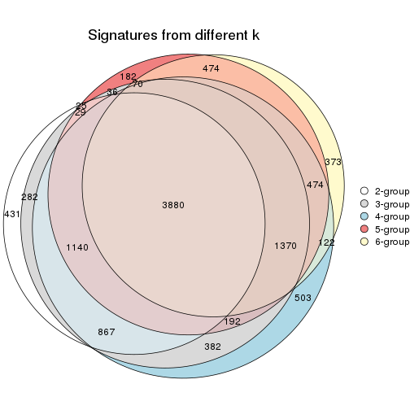

`get_signature()` returns a data frame invisibly. TO get the list of signatures, the function
call should be assigned to a variable explicitly. In following code, if `plot` argument is set
to `FALSE`, no heatmap is plotted while only the differential analysis is performed.

```r
# code only for demonstration
tb = get_signature(res, k = ..., plot = FALSE)
```

An example of the output of `tb` is:

```
#>   which_row         fdr    mean_1    mean_2 scaled_mean_1 scaled_mean_2 km
#> 1        38 0.042760348  8.373488  9.131774    -0.5533452     0.5164555  1
#> 2        40 0.018707592  7.106213  8.469186    -0.6173731     0.5762149  1
#> 3        55 0.019134737 10.221463 11.207825    -0.6159697     0.5749050  1
#> 4        59 0.006059896  5.921854  7.869574    -0.6899429     0.6439467  1
#> 5        60 0.018055526  8.928898 10.211722    -0.6204761     0.5791110  1
#> 6        98 0.009384629 15.714769 14.887706     0.6635654    -0.6193277  2
...
```

The columns in `tb` are:

1. `which_row`: row indices corresponding to the input matrix.
2. `fdr`: FDR for the differential test. 
3. `mean_x`: The mean value in group x.
4. `scaled_mean_x`: The mean value in group x after rows are scaled.
5. `km`: Row groups if k-means clustering is applied to rows.


UMAP plot which shows how samples are separated.


<script>
$( function() {
	$( '#tabs-MAD-pam-dimension-reduction' ).tabs();
} );
</script>
<div id='tabs-MAD-pam-dimension-reduction'>
<ul>
<li><a href='#tab-MAD-pam-dimension-reduction-1'>k = 2</a></li>
<li><a href='#tab-MAD-pam-dimension-reduction-2'>k = 3</a></li>
<li><a href='#tab-MAD-pam-dimension-reduction-3'>k = 4</a></li>
<li><a href='#tab-MAD-pam-dimension-reduction-4'>k = 5</a></li>
<li><a href='#tab-MAD-pam-dimension-reduction-5'>k = 6</a></li>
</ul>
<div id='tab-MAD-pam-dimension-reduction-1'>
<pre><code class="r">dimension_reduction(res, k = 2, method = &quot;UMAP&quot;)
</code></pre>

<p>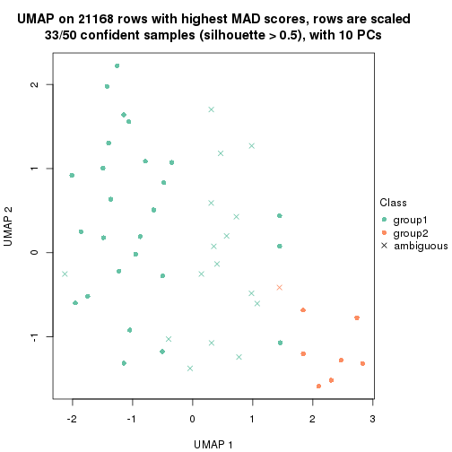</p>

</div>
<div id='tab-MAD-pam-dimension-reduction-2'>
<pre><code class="r">dimension_reduction(res, k = 3, method = &quot;UMAP&quot;)
</code></pre>

<p>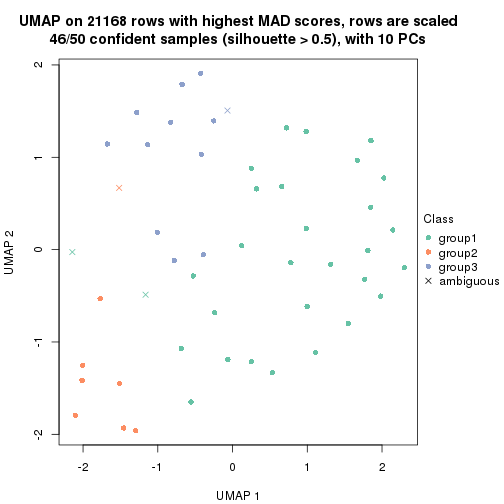</p>

</div>
<div id='tab-MAD-pam-dimension-reduction-3'>
<pre><code class="r">dimension_reduction(res, k = 4, method = &quot;UMAP&quot;)
</code></pre>

<p>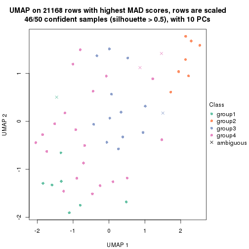</p>

</div>
<div id='tab-MAD-pam-dimension-reduction-4'>
<pre><code class="r">dimension_reduction(res, k = 5, method = &quot;UMAP&quot;)
</code></pre>

<p>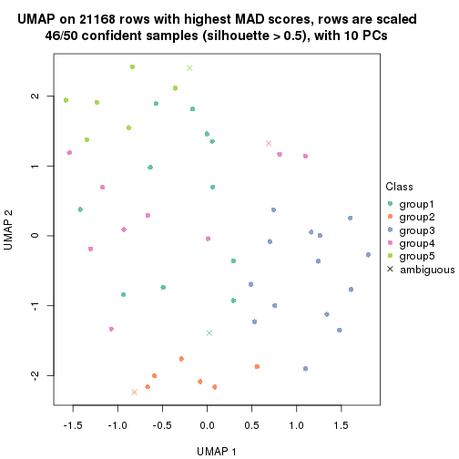</p>

</div>
<div id='tab-MAD-pam-dimension-reduction-5'>
<pre><code class="r">dimension_reduction(res, k = 6, method = &quot;UMAP&quot;)
</code></pre>

<p>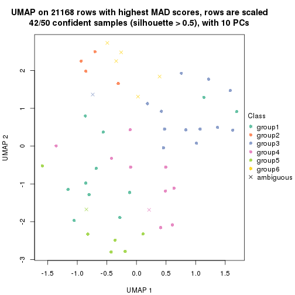</p>

</div>
</div>


Following heatmap shows how subgroups are split when increasing `k`:

```r
collect_classes(res)
```

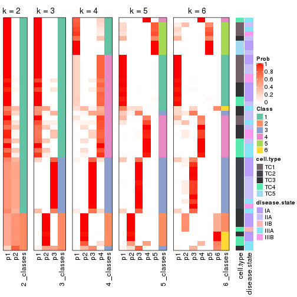


Test correlation between subgroups and known annotations. If the known
annotation is numeric, one-way ANOVA test is applied, and if the known
annotation is discrete, chi-squared contingency table test is applied.

```r
test_to_known_factors(res)
```

```
#>          n cell.type(p) disease.state(p) k
#> MAD:pam 33     8.77e-02           0.0477 2
#> MAD:pam 46     7.41e-09           0.0926 3
#> MAD:pam 46     1.20e-09           0.3453 4
#> MAD:pam 46     2.71e-09           0.0241 5
#> MAD:pam 42     2.67e-09           0.0297 6
```


If matrix rows can be associated to genes, consider to use `functional_enrichment(res,
...)` to perform function enrichment for the signature genes. See [this vignette](http://bioconductor.org/packages/devel/bioc/vignettes/cola/inst/doc/functional_enrichment.html) for more detailed explanations.


 

---------------------------------------------------


### MAD:mclust


The object with results only for a single top-value method and a single partition method 
can be extracted as:

```r
res = res_list["MAD", "mclust"]
# you can also extract it by
# res = res_list["MAD:mclust"]
```

A summary of `res` and all the functions that can be applied to it:

```r
res
```

```
#> A 'ConsensusPartition' object with k = 2, 3, 4, 5, 6.
#>   On a matrix with 21168 rows and 50 columns.
#>   Top rows (1000, 2000, 3000, 4000, 5000) are extracted by 'MAD' method.
#>   Subgroups are detected by 'mclust' method.
#>   Performed in total 1250 partitions by row resampling.
#>   Best k for subgroups seems to be 4.
#> 
#> Following methods can be applied to this 'ConsensusPartition' object:
#>  [1] "cola_report"             "collect_classes"         "collect_plots"          
#>  [4] "collect_stats"           "colnames"                "compare_signatures"     
#>  [7] "consensus_heatmap"       "dimension_reduction"     "functional_enrichment"  
#> [10] "get_anno_col"            "get_anno"                "get_classes"            
#> [13] "get_consensus"           "get_matrix"              "get_membership"         
#> [16] "get_param"               "get_signatures"          "get_stats"              
#> [19] "is_best_k"               "is_stable_k"             "membership_heatmap"     
#> [22] "ncol"                    "nrow"                    "plot_ecdf"              
#> [25] "rownames"                "select_partition_number" "show"                   
#> [28] "suggest_best_k"          "test_to_known_factors"
```

`collect_plots()` function collects all the plots made from `res` for all `k` (number of partitions)
into one single page to provide an easy and fast comparison between different `k`.

```r
collect_plots(res)
```

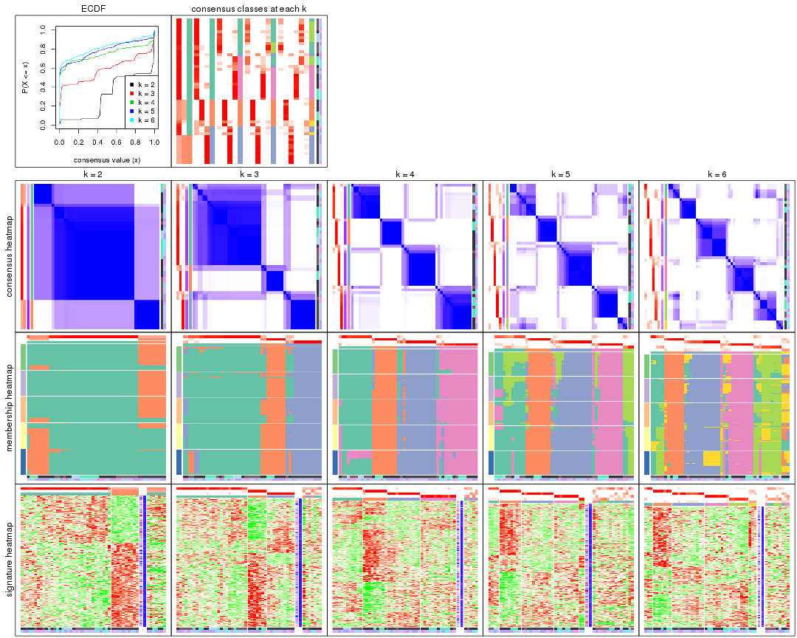

The plots are:

- The first row: a plot of the ECDF (empirical cumulative distribution
  function) curves of the consensus matrix for each `k` and the heatmap of
  predicted classes for each `k`.
- The second row: heatmaps of the consensus matrix for each `k`.
- The third row: heatmaps of the membership matrix for each `k`.
- The fouth row: heatmaps of the signatures for each `k`.

All the plots in panels can be made by individual functions and they are
plotted later in this section.

`select_partition_number()` produces several plots showing different
statistics for choosing "optimized" `k`. There are following statistics:

- ECDF curves of the consensus matrix for each `k`;
- 1-PAC. [The PAC
  score](https://en.wikipedia.org/wiki/Consensus_clustering#Over-interpretation_potential_of_consensus_clustering)
  measures the proportion of the ambiguous subgrouping.
- Mean silhouette score.
- Concordance. The mean probability of fiting the consensus class ids in all
  partitions.
- Area increased. Denote $A_k$ as the area under the ECDF curve for current
  `k`, the area increased is defined as $A_k - A_{k-1}$.
- Rand index. The percent of pairs of samples that are both in a same cluster
  or both are not in a same cluster in the partition of k and k-1.
- Jaccard index. The ratio of pairs of samples are both in a same cluster in
  the partition of k and k-1 and the pairs of samples are both in a same
  cluster in the partition k or k-1.

The detailed explanations of these statistics can be found in [the _cola_
vignette](http://bioconductor.org/packages/devel/bioc/vignettes/cola/inst/doc/cola.html#toc_13).

Generally speaking, lower PAC score, higher mean silhouette score or higher
concordance corresponds to better partition. Rand index and Jaccard index
measure how similar the current partition is compared to partition with `k-1`.
If they are too similar, we won't accept `k` is better than `k-1`.

```r
select_partition_number(res)
```

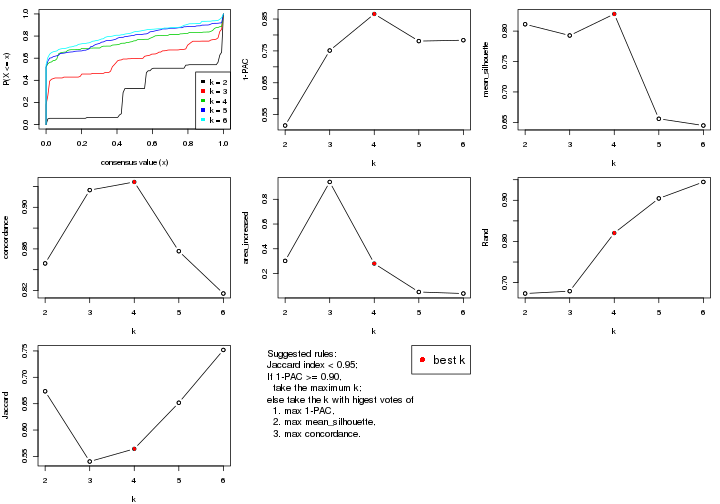

The numeric values for all these statistics can be obtained by `get_stats()`.

```r
get_stats(res)
```

```
#>   k 1-PAC mean_silhouette concordance area_increased  Rand Jaccard
#> 2 2 0.516           0.811       0.846         0.3021 0.673   0.673
#> 3 3 0.751           0.793       0.917         0.9400 0.679   0.540
#> 4 4 0.866           0.828       0.924         0.2804 0.820   0.564
#> 5 5 0.781           0.656       0.858         0.0506 0.904   0.652
#> 6 6 0.784           0.645       0.817         0.0383 0.944   0.752
```

`suggest_best_k()` suggests the best $k$ based on these statistics. The rules are as follows:

- All $k$ with Jaccard index larger than 0.95 are removed because increasing
  $k$ does not provide enough extra information. If all $k$ are removed, it is
  marked as no subgroup is detected.
- For all $k$ with 1-PAC score larger than 0.9, the maximal $k$ is taken as
  the best $k$, and other $k$ are marked as optional $k$.
- If it does not fit the second rule. The $k$ with the maximal vote of the
  highest 1-PAC score, highest mean silhouette, and highest concordance is
  taken as the best $k$.

```r
suggest_best_k(res)
```

```
#> [1] 4
```


Following shows the table of the partitions (You need to click the **show/hide
code output** link to see it). The membership matrix (columns with name `p*`)
is inferred by
[`clue::cl_consensus()`](https://www.rdocumentation.org/link/cl_consensus?package=clue)
function with the `SE` method. Basically the value in the membership matrix
represents the probability to belong to a certain group. The finall class
label for an item is determined with the group with highest probability it
belongs to.

In `get_classes()` function, the entropy is calculated from the membership
matrix and the silhouette score is calculated from the consensus matrix.


<script>
$( function() {
	$( '#tabs-MAD-mclust-get-classes' ).tabs();
} );
</script>
<div id='tabs-MAD-mclust-get-classes'>
<ul>
<li><a href='#tab-MAD-mclust-get-classes-1'>k = 2</a></li>
<li><a href='#tab-MAD-mclust-get-classes-2'>k = 3</a></li>
<li><a href='#tab-MAD-mclust-get-classes-3'>k = 4</a></li>
<li><a href='#tab-MAD-mclust-get-classes-4'>k = 5</a></li>
<li><a href='#tab-MAD-mclust-get-classes-5'>k = 6</a></li>
</ul>

<div id='tab-MAD-mclust-get-classes-1'>
<p><a id='tab-MAD-mclust-get-classes-1-a' style='color:#0366d6' href='#'>show/hide code output</a></p>
<pre><code class="r">cbind(get_classes(res, k = 2), get_membership(res, k = 2))
</code></pre>

<pre><code>#&gt;          class entropy silhouette    p1    p2
#&gt; GSM63448     1  0.0000      0.850 1.000 0.000
#&gt; GSM63449     1  0.0000      0.850 1.000 0.000
#&gt; GSM63423     1  0.0000      0.850 1.000 0.000
#&gt; GSM63425     1  0.0000      0.850 1.000 0.000
#&gt; GSM63437     1  0.0000      0.850 1.000 0.000
#&gt; GSM63453     1  0.1633      0.834 0.976 0.024
#&gt; GSM63431     1  0.0000      0.850 1.000 0.000
#&gt; GSM63450     1  0.1633      0.834 0.976 0.024
#&gt; GSM63428     1  0.0000      0.850 1.000 0.000
#&gt; GSM63432     1  0.0672      0.844 0.992 0.008
#&gt; GSM63458     1  0.0000      0.850 1.000 0.000
#&gt; GSM63434     2  0.9850      0.998 0.428 0.572
#&gt; GSM63435     2  0.9850      0.998 0.428 0.572
#&gt; GSM63442     1  0.1184      0.835 0.984 0.016
#&gt; GSM63451     2  0.9881      0.986 0.436 0.564
#&gt; GSM63422     2  0.9850      0.998 0.428 0.572
#&gt; GSM63438     2  0.9850      0.998 0.428 0.572
#&gt; GSM63439     2  0.9850      0.998 0.428 0.572
#&gt; GSM63461     2  0.9850      0.998 0.428 0.572
#&gt; GSM63463     2  0.9850      0.998 0.428 0.572
#&gt; GSM63430     2  0.9850      0.998 0.428 0.572
#&gt; GSM63446     2  0.9850      0.998 0.428 0.572
#&gt; GSM63429     1  0.0000      0.850 1.000 0.000
#&gt; GSM63445     1  0.0376      0.847 0.996 0.004
#&gt; GSM63447     1  0.0000      0.850 1.000 0.000
#&gt; GSM63459     1  0.9881      0.409 0.564 0.436
#&gt; GSM63464     1  0.9881      0.409 0.564 0.436
#&gt; GSM63469     1  0.9881      0.409 0.564 0.436
#&gt; GSM63470     1  0.9881      0.409 0.564 0.436
#&gt; GSM63436     1  0.0000      0.850 1.000 0.000
#&gt; GSM63443     1  0.7602      0.614 0.780 0.220
#&gt; GSM63465     1  0.0000      0.850 1.000 0.000
#&gt; GSM63444     1  0.2043      0.827 0.968 0.032
#&gt; GSM63456     1  0.1843      0.831 0.972 0.028
#&gt; GSM63462     1  0.0376      0.847 0.996 0.004
#&gt; GSM63424     1  0.0000      0.850 1.000 0.000
#&gt; GSM63440     1  0.0000      0.850 1.000 0.000
#&gt; GSM63433     1  0.0000      0.850 1.000 0.000
#&gt; GSM63466     1  0.9881      0.409 0.564 0.436
#&gt; GSM63426     1  0.0000      0.850 1.000 0.000
#&gt; GSM63468     1  0.0000      0.850 1.000 0.000
#&gt; GSM63452     1  0.9881      0.409 0.564 0.436
#&gt; GSM63441     1  0.0000      0.850 1.000 0.000
#&gt; GSM63454     1  0.0000      0.850 1.000 0.000
#&gt; GSM63455     1  0.0000      0.850 1.000 0.000
#&gt; GSM63460     1  0.9881      0.409 0.564 0.436
#&gt; GSM63467     1  0.0000      0.850 1.000 0.000
#&gt; GSM63421     1  0.0000      0.850 1.000 0.000
#&gt; GSM63427     1  0.0000      0.850 1.000 0.000
#&gt; GSM63457     1  0.0000      0.850 1.000 0.000
</code></pre>

<script>
$('#tab-MAD-mclust-get-classes-1-a').parent().next().next().hide();
$('#tab-MAD-mclust-get-classes-1-a').click(function(){
  $('#tab-MAD-mclust-get-classes-1-a').parent().next().next().toggle();
  return(false);
});
</script>
</div>

<div id='tab-MAD-mclust-get-classes-2'>
<p><a id='tab-MAD-mclust-get-classes-2-a' style='color:#0366d6' href='#'>show/hide code output</a></p>
<pre><code class="r">cbind(get_classes(res, k = 3), get_membership(res, k = 3))
</code></pre>

<pre><code>#&gt;          class entropy silhouette    p1    p2    p3
#&gt; GSM63448     1  0.0592     0.9208 0.988 0.012 0.000
#&gt; GSM63449     1  0.0237     0.9223 0.996 0.004 0.000
#&gt; GSM63423     1  0.0237     0.9223 0.996 0.004 0.000
#&gt; GSM63425     1  0.1129     0.9175 0.976 0.020 0.004
#&gt; GSM63437     1  0.0237     0.9223 0.996 0.004 0.000
#&gt; GSM63453     1  0.4291     0.7430 0.820 0.180 0.000
#&gt; GSM63431     1  0.0237     0.9223 0.996 0.004 0.000
#&gt; GSM63450     1  0.4575     0.7407 0.812 0.184 0.004
#&gt; GSM63428     1  0.0237     0.9223 0.996 0.004 0.000
#&gt; GSM63432     3  0.6783     0.2958 0.396 0.016 0.588
#&gt; GSM63458     1  0.0237     0.9223 0.996 0.004 0.000
#&gt; GSM63434     3  0.0000     0.8438 0.000 0.000 1.000
#&gt; GSM63435     3  0.0000     0.8438 0.000 0.000 1.000
#&gt; GSM63442     3  0.6470     0.3935 0.356 0.012 0.632
#&gt; GSM63451     3  0.0000     0.8438 0.000 0.000 1.000
#&gt; GSM63422     3  0.0000     0.8438 0.000 0.000 1.000
#&gt; GSM63438     3  0.0000     0.8438 0.000 0.000 1.000
#&gt; GSM63439     3  0.0000     0.8438 0.000 0.000 1.000
#&gt; GSM63461     3  0.0000     0.8438 0.000 0.000 1.000
#&gt; GSM63463     3  0.0000     0.8438 0.000 0.000 1.000
#&gt; GSM63430     3  0.0000     0.8438 0.000 0.000 1.000
#&gt; GSM63446     3  0.0000     0.8438 0.000 0.000 1.000
#&gt; GSM63429     1  0.1129     0.9175 0.976 0.020 0.004
#&gt; GSM63445     1  0.5167     0.7366 0.792 0.016 0.192
#&gt; GSM63447     1  0.1399     0.9118 0.968 0.028 0.004
#&gt; GSM63459     2  0.0424     0.8582 0.008 0.992 0.000
#&gt; GSM63464     2  0.0424     0.8582 0.008 0.992 0.000
#&gt; GSM63469     2  0.0424     0.8582 0.008 0.992 0.000
#&gt; GSM63470     2  0.0424     0.8582 0.008 0.992 0.000
#&gt; GSM63436     1  0.0237     0.9223 0.996 0.004 0.000
#&gt; GSM63443     2  0.8375     0.3136 0.368 0.540 0.092
#&gt; GSM63465     1  0.2599     0.8913 0.932 0.052 0.016
#&gt; GSM63444     2  0.6796     0.3682 0.368 0.612 0.020
#&gt; GSM63456     3  0.9842     0.0811 0.368 0.248 0.384
#&gt; GSM63462     1  0.5269     0.7254 0.784 0.016 0.200
#&gt; GSM63424     1  0.7004     0.1289 0.552 0.020 0.428
#&gt; GSM63440     1  0.6553     0.4472 0.656 0.020 0.324
#&gt; GSM63433     1  0.0000     0.9216 1.000 0.000 0.000
#&gt; GSM63466     2  0.0424     0.8582 0.008 0.992 0.000
#&gt; GSM63426     1  0.0000     0.9216 1.000 0.000 0.000
#&gt; GSM63468     1  0.1129     0.9175 0.976 0.020 0.004
#&gt; GSM63452     2  0.0424     0.8582 0.008 0.992 0.000
#&gt; GSM63441     1  0.1129     0.9175 0.976 0.020 0.004
#&gt; GSM63454     1  0.1129     0.9175 0.976 0.020 0.004
#&gt; GSM63455     1  0.0000     0.9216 1.000 0.000 0.000
#&gt; GSM63460     2  0.0424     0.8582 0.008 0.992 0.000
#&gt; GSM63467     1  0.0829     0.9186 0.984 0.012 0.004
#&gt; GSM63421     1  0.0237     0.9223 0.996 0.004 0.000
#&gt; GSM63427     1  0.0237     0.9223 0.996 0.004 0.000
#&gt; GSM63457     1  0.0237     0.9223 0.996 0.004 0.000
</code></pre>

<script>
$('#tab-MAD-mclust-get-classes-2-a').parent().next().next().hide();
$('#tab-MAD-mclust-get-classes-2-a').click(function(){
  $('#tab-MAD-mclust-get-classes-2-a').parent().next().next().toggle();
  return(false);
});
</script>
</div>

<div id='tab-MAD-mclust-get-classes-3'>
<p><a id='tab-MAD-mclust-get-classes-3-a' style='color:#0366d6' href='#'>show/hide code output</a></p>
<pre><code class="r">cbind(get_classes(res, k = 4), get_membership(res, k = 4))
</code></pre>

<pre><code>#&gt;          class entropy silhouette    p1    p2    p3    p4
#&gt; GSM63448     4  0.4877     0.1625 0.408 0.000 0.000 0.592
#&gt; GSM63449     1  0.1716     0.9372 0.936 0.000 0.000 0.064
#&gt; GSM63423     1  0.1792     0.9360 0.932 0.000 0.000 0.068
#&gt; GSM63425     4  0.0188     0.8949 0.004 0.000 0.000 0.996
#&gt; GSM63437     1  0.1716     0.9372 0.936 0.000 0.000 0.064
#&gt; GSM63453     1  0.0188     0.8900 0.996 0.004 0.000 0.000
#&gt; GSM63431     1  0.1716     0.9372 0.936 0.000 0.000 0.064
#&gt; GSM63450     1  0.0188     0.8900 0.996 0.004 0.000 0.000
#&gt; GSM63428     1  0.1867     0.9338 0.928 0.000 0.000 0.072
#&gt; GSM63432     3  0.3610     0.7103 0.200 0.000 0.800 0.000
#&gt; GSM63458     1  0.1792     0.9356 0.932 0.000 0.000 0.068
#&gt; GSM63434     3  0.0000     0.9048 0.000 0.000 1.000 0.000
#&gt; GSM63435     3  0.0000     0.9048 0.000 0.000 1.000 0.000
#&gt; GSM63442     3  0.0188     0.9019 0.004 0.000 0.996 0.000
#&gt; GSM63451     3  0.0000     0.9048 0.000 0.000 1.000 0.000
#&gt; GSM63422     3  0.0000     0.9048 0.000 0.000 1.000 0.000
#&gt; GSM63438     3  0.0000     0.9048 0.000 0.000 1.000 0.000
#&gt; GSM63439     3  0.0000     0.9048 0.000 0.000 1.000 0.000
#&gt; GSM63461     3  0.0000     0.9048 0.000 0.000 1.000 0.000
#&gt; GSM63463     3  0.0000     0.9048 0.000 0.000 1.000 0.000
#&gt; GSM63430     3  0.0000     0.9048 0.000 0.000 1.000 0.000
#&gt; GSM63446     3  0.0000     0.9048 0.000 0.000 1.000 0.000
#&gt; GSM63429     4  0.0000     0.8960 0.000 0.000 0.000 1.000
#&gt; GSM63445     3  0.5408     0.2734 0.408 0.000 0.576 0.016
#&gt; GSM63447     4  0.0000     0.8960 0.000 0.000 0.000 1.000
#&gt; GSM63459     2  0.0000     0.9597 0.000 1.000 0.000 0.000
#&gt; GSM63464     2  0.0000     0.9597 0.000 1.000 0.000 0.000
#&gt; GSM63469     2  0.0000     0.9597 0.000 1.000 0.000 0.000
#&gt; GSM63470     2  0.0000     0.9597 0.000 1.000 0.000 0.000
#&gt; GSM63436     1  0.4967     0.2492 0.548 0.000 0.000 0.452
#&gt; GSM63443     2  0.4454     0.5508 0.000 0.692 0.308 0.000
#&gt; GSM63465     4  0.0000     0.8960 0.000 0.000 0.000 1.000
#&gt; GSM63444     2  0.0000     0.9597 0.000 1.000 0.000 0.000
#&gt; GSM63456     3  0.4998     0.0521 0.000 0.488 0.512 0.000
#&gt; GSM63462     4  0.5673     0.3425 0.032 0.000 0.372 0.596
#&gt; GSM63424     4  0.1474     0.8525 0.000 0.000 0.052 0.948
#&gt; GSM63440     4  0.0000     0.8960 0.000 0.000 0.000 1.000
#&gt; GSM63433     4  0.1389     0.8727 0.048 0.000 0.000 0.952
#&gt; GSM63466     2  0.0000     0.9597 0.000 1.000 0.000 0.000
#&gt; GSM63426     4  0.1637     0.8642 0.060 0.000 0.000 0.940
#&gt; GSM63468     4  0.0000     0.8960 0.000 0.000 0.000 1.000
#&gt; GSM63452     2  0.0000     0.9597 0.000 1.000 0.000 0.000
#&gt; GSM63441     4  0.0000     0.8960 0.000 0.000 0.000 1.000
#&gt; GSM63454     4  0.0000     0.8960 0.000 0.000 0.000 1.000
#&gt; GSM63455     4  0.4072     0.6310 0.252 0.000 0.000 0.748
#&gt; GSM63460     2  0.0000     0.9597 0.000 1.000 0.000 0.000
#&gt; GSM63467     4  0.0817     0.8861 0.024 0.000 0.000 0.976
#&gt; GSM63421     1  0.1716     0.9372 0.936 0.000 0.000 0.064
#&gt; GSM63427     1  0.2589     0.8947 0.884 0.000 0.000 0.116
#&gt; GSM63457     1  0.1716     0.9372 0.936 0.000 0.000 0.064
</code></pre>

<script>
$('#tab-MAD-mclust-get-classes-3-a').parent().next().next().hide();
$('#tab-MAD-mclust-get-classes-3-a').click(function(){
  $('#tab-MAD-mclust-get-classes-3-a').parent().next().next().toggle();
  return(false);
});
</script>
</div>

<div id='tab-MAD-mclust-get-classes-4'>
<p><a id='tab-MAD-mclust-get-classes-4-a' style='color:#0366d6' href='#'>show/hide code output</a></p>
<pre><code class="r">cbind(get_classes(res, k = 5), get_membership(res, k = 5))
</code></pre>

<pre><code>#&gt;          class entropy silhouette    p1    p2    p3    p4    p5
#&gt; GSM63448     4  0.6810    -0.0955 0.264 0.000 0.004 0.436 0.296
#&gt; GSM63449     5  0.3983     0.4109 0.340 0.000 0.000 0.000 0.660
#&gt; GSM63423     1  0.4273     0.0161 0.552 0.000 0.000 0.000 0.448
#&gt; GSM63425     4  0.3999     0.3208 0.344 0.000 0.000 0.656 0.000
#&gt; GSM63437     1  0.4171     0.1804 0.604 0.000 0.000 0.000 0.396
#&gt; GSM63453     5  0.0609     0.6197 0.020 0.000 0.000 0.000 0.980
#&gt; GSM63431     1  0.2605     0.5608 0.852 0.000 0.000 0.000 0.148
#&gt; GSM63450     5  0.0609     0.6197 0.020 0.000 0.000 0.000 0.980
#&gt; GSM63428     5  0.4726     0.2487 0.400 0.000 0.020 0.000 0.580
#&gt; GSM63432     3  0.3305     0.6604 0.000 0.000 0.776 0.000 0.224
#&gt; GSM63458     1  0.2471     0.5654 0.864 0.000 0.000 0.000 0.136
#&gt; GSM63434     3  0.0162     0.8644 0.000 0.004 0.996 0.000 0.000
#&gt; GSM63435     3  0.0000     0.8646 0.000 0.000 1.000 0.000 0.000
#&gt; GSM63442     3  0.1671     0.8093 0.000 0.000 0.924 0.000 0.076
#&gt; GSM63451     3  0.0290     0.8630 0.000 0.008 0.992 0.000 0.000
#&gt; GSM63422     3  0.0000     0.8646 0.000 0.000 1.000 0.000 0.000
#&gt; GSM63438     3  0.0000     0.8646 0.000 0.000 1.000 0.000 0.000
#&gt; GSM63439     3  0.0162     0.8644 0.000 0.004 0.996 0.000 0.000
#&gt; GSM63461     3  0.0000     0.8646 0.000 0.000 1.000 0.000 0.000
#&gt; GSM63463     3  0.0162     0.8644 0.000 0.004 0.996 0.000 0.000
#&gt; GSM63430     3  0.0000     0.8646 0.000 0.000 1.000 0.000 0.000
#&gt; GSM63446     3  0.0290     0.8630 0.000 0.008 0.992 0.000 0.000
#&gt; GSM63429     4  0.0000     0.8762 0.000 0.000 0.000 1.000 0.000
#&gt; GSM63445     3  0.5920     0.3398 0.148 0.000 0.580 0.000 0.272
#&gt; GSM63447     4  0.0000     0.8762 0.000 0.000 0.000 1.000 0.000
#&gt; GSM63459     2  0.0000     0.9281 0.000 1.000 0.000 0.000 0.000
#&gt; GSM63464     2  0.0000     0.9281 0.000 1.000 0.000 0.000 0.000
#&gt; GSM63469     2  0.0162     0.9266 0.000 0.996 0.000 0.000 0.004
#&gt; GSM63470     2  0.0000     0.9281 0.000 1.000 0.000 0.000 0.000
#&gt; GSM63436     1  0.6570     0.1842 0.504 0.000 0.004 0.248 0.244
#&gt; GSM63443     2  0.6433     0.2994 0.000 0.504 0.268 0.000 0.228
#&gt; GSM63465     4  0.0000     0.8762 0.000 0.000 0.000 1.000 0.000
#&gt; GSM63444     2  0.1893     0.8840 0.028 0.936 0.012 0.000 0.024
#&gt; GSM63456     3  0.5829     0.3579 0.008 0.332 0.572 0.000 0.088
#&gt; GSM63462     3  0.7616     0.1404 0.224 0.000 0.408 0.312 0.056
#&gt; GSM63424     4  0.0000     0.8762 0.000 0.000 0.000 1.000 0.000
#&gt; GSM63440     4  0.0000     0.8762 0.000 0.000 0.000 1.000 0.000
#&gt; GSM63433     1  0.3452     0.4114 0.756 0.000 0.000 0.244 0.000
#&gt; GSM63466     2  0.0000     0.9281 0.000 1.000 0.000 0.000 0.000
#&gt; GSM63426     1  0.3452     0.4114 0.756 0.000 0.000 0.244 0.000
#&gt; GSM63468     4  0.0000     0.8762 0.000 0.000 0.000 1.000 0.000
#&gt; GSM63452     2  0.0162     0.9266 0.000 0.996 0.000 0.000 0.004
#&gt; GSM63441     4  0.0000     0.8762 0.000 0.000 0.000 1.000 0.000
#&gt; GSM63454     4  0.0000     0.8762 0.000 0.000 0.000 1.000 0.000
#&gt; GSM63455     1  0.3395     0.4136 0.764 0.000 0.000 0.236 0.000
#&gt; GSM63460     2  0.0000     0.9281 0.000 1.000 0.000 0.000 0.000
#&gt; GSM63467     4  0.2830     0.7639 0.080 0.000 0.000 0.876 0.044
#&gt; GSM63421     1  0.2516     0.5651 0.860 0.000 0.000 0.000 0.140
#&gt; GSM63427     1  0.3906     0.3951 0.704 0.000 0.004 0.000 0.292
#&gt; GSM63457     1  0.2471     0.5659 0.864 0.000 0.000 0.000 0.136
</code></pre>

<script>
$('#tab-MAD-mclust-get-classes-4-a').parent().next().next().hide();
$('#tab-MAD-mclust-get-classes-4-a').click(function(){
  $('#tab-MAD-mclust-get-classes-4-a').parent().next().next().toggle();
  return(false);
});
</script>
</div>

<div id='tab-MAD-mclust-get-classes-5'>
<p><a id='tab-MAD-mclust-get-classes-5-a' style='color:#0366d6' href='#'>show/hide code output</a></p>
<pre><code class="r">cbind(get_classes(res, k = 6), get_membership(res, k = 6))
</code></pre>

<pre><code>#&gt;          class entropy silhouette    p1    p2    p3    p4    p5    p6
#&gt; GSM63448     4  0.7076     0.2529 0.184 0.004 0.000 0.488 0.132 0.192
#&gt; GSM63449     1  0.3874     0.5048 0.636 0.000 0.000 0.000 0.356 0.008
#&gt; GSM63423     1  0.4096     0.3268 0.508 0.000 0.000 0.000 0.484 0.008
#&gt; GSM63425     4  0.5379     0.1412 0.000 0.000 0.000 0.536 0.336 0.128
#&gt; GSM63437     5  0.4262    -0.4383 0.476 0.000 0.000 0.000 0.508 0.016
#&gt; GSM63453     1  0.0405     0.5354 0.988 0.000 0.000 0.000 0.004 0.008
#&gt; GSM63431     5  0.1701     0.6302 0.072 0.000 0.000 0.000 0.920 0.008
#&gt; GSM63450     1  0.0777     0.5311 0.972 0.000 0.000 0.000 0.004 0.024
#&gt; GSM63428     1  0.4195     0.4181 0.548 0.000 0.000 0.004 0.440 0.008
#&gt; GSM63432     3  0.4955     0.6329 0.132 0.000 0.660 0.000 0.004 0.204
#&gt; GSM63458     5  0.1327     0.6313 0.064 0.000 0.000 0.000 0.936 0.000
#&gt; GSM63434     3  0.0000     0.8455 0.000 0.000 1.000 0.000 0.000 0.000
#&gt; GSM63435     3  0.2135     0.8412 0.000 0.000 0.872 0.000 0.000 0.128
#&gt; GSM63442     3  0.3088     0.8022 0.020 0.000 0.808 0.000 0.000 0.172
#&gt; GSM63451     3  0.0000     0.8455 0.000 0.000 1.000 0.000 0.000 0.000
#&gt; GSM63422     3  0.2135     0.8412 0.000 0.000 0.872 0.000 0.000 0.128
#&gt; GSM63438     3  0.2092     0.8418 0.000 0.000 0.876 0.000 0.000 0.124
#&gt; GSM63439     3  0.0000     0.8455 0.000 0.000 1.000 0.000 0.000 0.000
#&gt; GSM63461     3  0.2135     0.8412 0.000 0.000 0.872 0.000 0.000 0.128
#&gt; GSM63463     3  0.0000     0.8455 0.000 0.000 1.000 0.000 0.000 0.000
#&gt; GSM63430     3  0.0000     0.8455 0.000 0.000 1.000 0.000 0.000 0.000
#&gt; GSM63446     3  0.0000     0.8455 0.000 0.000 1.000 0.000 0.000 0.000
#&gt; GSM63429     4  0.0000     0.8142 0.000 0.000 0.000 1.000 0.000 0.000
#&gt; GSM63445     3  0.6986     0.3109 0.180 0.000 0.444 0.008 0.068 0.300
#&gt; GSM63447     4  0.0291     0.8127 0.000 0.004 0.000 0.992 0.000 0.004
#&gt; GSM63459     2  0.0000     0.9401 0.000 1.000 0.000 0.000 0.000 0.000
#&gt; GSM63464     2  0.2883     0.5923 0.000 0.788 0.000 0.000 0.000 0.212
#&gt; GSM63469     2  0.0260     0.9354 0.008 0.992 0.000 0.000 0.000 0.000
#&gt; GSM63470     2  0.0000     0.9401 0.000 1.000 0.000 0.000 0.000 0.000
#&gt; GSM63436     5  0.7307     0.0223 0.180 0.000 0.000 0.256 0.412 0.152
#&gt; GSM63443     6  0.6234     0.7075 0.028 0.296 0.180 0.000 0.000 0.496
#&gt; GSM63465     4  0.0405     0.8121 0.000 0.004 0.000 0.988 0.000 0.008
#&gt; GSM63444     6  0.5462     0.6094 0.000 0.376 0.128 0.000 0.000 0.496
#&gt; GSM63456     6  0.6079     0.6695 0.024 0.152 0.328 0.000 0.000 0.496
#&gt; GSM63462     4  0.7460    -0.0144 0.012 0.004 0.304 0.332 0.064 0.284
#&gt; GSM63424     4  0.0653     0.8101 0.004 0.000 0.004 0.980 0.000 0.012
#&gt; GSM63440     4  0.0653     0.8101 0.004 0.000 0.004 0.980 0.000 0.012
#&gt; GSM63433     5  0.2907     0.5801 0.000 0.000 0.000 0.020 0.828 0.152
#&gt; GSM63466     2  0.0000     0.9401 0.000 1.000 0.000 0.000 0.000 0.000
#&gt; GSM63426     5  0.2821     0.5813 0.000 0.000 0.000 0.016 0.832 0.152
#&gt; GSM63468     4  0.0146     0.8143 0.000 0.000 0.000 0.996 0.000 0.004
#&gt; GSM63452     2  0.0632     0.9190 0.024 0.976 0.000 0.000 0.000 0.000
#&gt; GSM63441     4  0.0000     0.8142 0.000 0.000 0.000 1.000 0.000 0.000
#&gt; GSM63454     4  0.0146     0.8143 0.000 0.000 0.000 0.996 0.000 0.004
#&gt; GSM63455     5  0.2783     0.5832 0.000 0.000 0.000 0.016 0.836 0.148
#&gt; GSM63460     2  0.0000     0.9401 0.000 1.000 0.000 0.000 0.000 0.000
#&gt; GSM63467     4  0.3525     0.6866 0.004 0.000 0.000 0.784 0.032 0.180
#&gt; GSM63421     5  0.1663     0.6138 0.088 0.000 0.000 0.000 0.912 0.000
#&gt; GSM63427     5  0.4874     0.1434 0.276 0.000 0.000 0.004 0.636 0.084
#&gt; GSM63457     5  0.1327     0.6307 0.064 0.000 0.000 0.000 0.936 0.000
</code></pre>

<script>
$('#tab-MAD-mclust-get-classes-5-a').parent().next().next().hide();
$('#tab-MAD-mclust-get-classes-5-a').click(function(){
  $('#tab-MAD-mclust-get-classes-5-a').parent().next().next().toggle();
  return(false);
});
</script>
</div>
</div>

Heatmaps for the consensus matrix. It visualizes the probability of two
samples to be in a same group.


<script>
$( function() {
	$( '#tabs-MAD-mclust-consensus-heatmap' ).tabs();
} );
</script>
<div id='tabs-MAD-mclust-consensus-heatmap'>
<ul>
<li><a href='#tab-MAD-mclust-consensus-heatmap-1'>k = 2</a></li>
<li><a href='#tab-MAD-mclust-consensus-heatmap-2'>k = 3</a></li>
<li><a href='#tab-MAD-mclust-consensus-heatmap-3'>k = 4</a></li>
<li><a href='#tab-MAD-mclust-consensus-heatmap-4'>k = 5</a></li>
<li><a href='#tab-MAD-mclust-consensus-heatmap-5'>k = 6</a></li>
</ul>
<div id='tab-MAD-mclust-consensus-heatmap-1'>
<pre><code class="r">consensus_heatmap(res, k = 2)
</code></pre>

<p>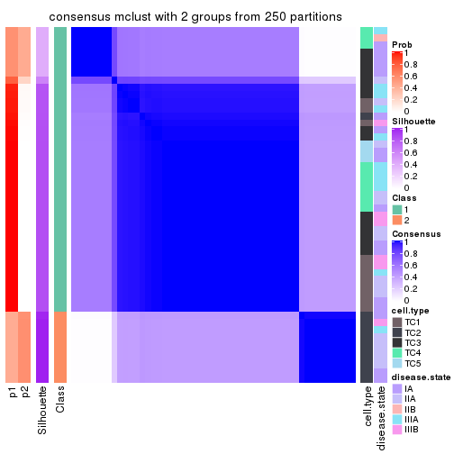</p>

</div>
<div id='tab-MAD-mclust-consensus-heatmap-2'>
<pre><code class="r">consensus_heatmap(res, k = 3)
</code></pre>

<p>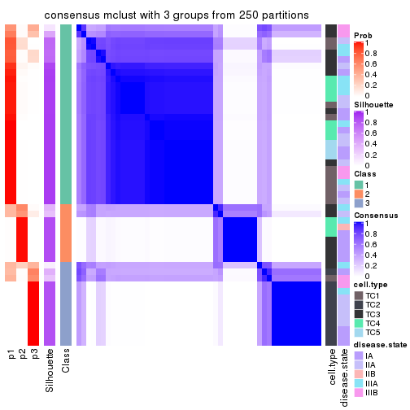</p>

</div>
<div id='tab-MAD-mclust-consensus-heatmap-3'>
<pre><code class="r">consensus_heatmap(res, k = 4)
</code></pre>

<p>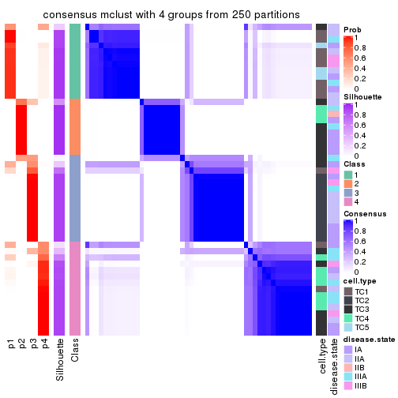</p>

</div>
<div id='tab-MAD-mclust-consensus-heatmap-4'>
<pre><code class="r">consensus_heatmap(res, k = 5)
</code></pre>

<p>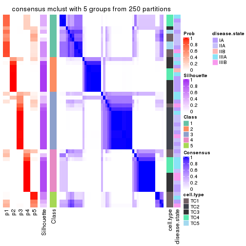</p>

</div>
<div id='tab-MAD-mclust-consensus-heatmap-5'>
<pre><code class="r">consensus_heatmap(res, k = 6)
</code></pre>

<p>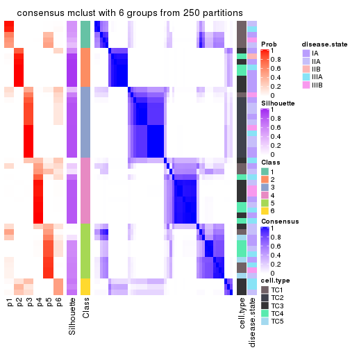</p>

</div>
</div>

Heatmaps for the membership of samples in all partitions to see how consistent they are:


<script>
$( function() {
	$( '#tabs-MAD-mclust-membership-heatmap' ).tabs();
} );
</script>
<div id='tabs-MAD-mclust-membership-heatmap'>
<ul>
<li><a href='#tab-MAD-mclust-membership-heatmap-1'>k = 2</a></li>
<li><a href='#tab-MAD-mclust-membership-heatmap-2'>k = 3</a></li>
<li><a href='#tab-MAD-mclust-membership-heatmap-3'>k = 4</a></li>
<li><a href='#tab-MAD-mclust-membership-heatmap-4'>k = 5</a></li>
<li><a href='#tab-MAD-mclust-membership-heatmap-5'>k = 6</a></li>
</ul>
<div id='tab-MAD-mclust-membership-heatmap-1'>
<pre><code class="r">membership_heatmap(res, k = 2)
</code></pre>

<p>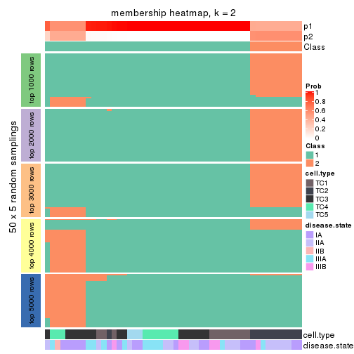</p>

</div>
<div id='tab-MAD-mclust-membership-heatmap-2'>
<pre><code class="r">membership_heatmap(res, k = 3)
</code></pre>

<p>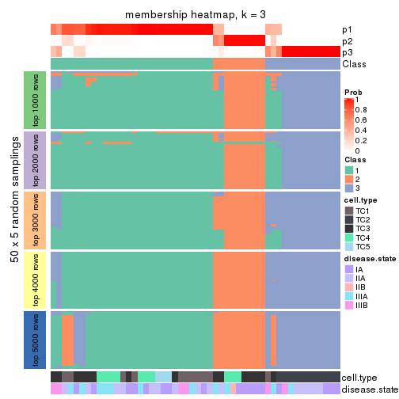</p>

</div>
<div id='tab-MAD-mclust-membership-heatmap-3'>
<pre><code class="r">membership_heatmap(res, k = 4)
</code></pre>

<p>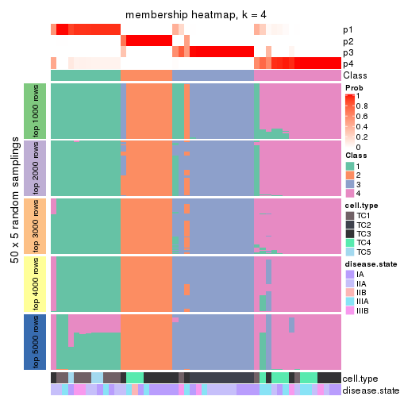</p>

</div>
<div id='tab-MAD-mclust-membership-heatmap-4'>
<pre><code class="r">membership_heatmap(res, k = 5)
</code></pre>

<p>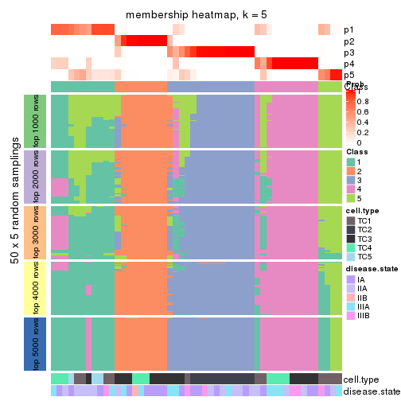</p>

</div>
<div id='tab-MAD-mclust-membership-heatmap-5'>
<pre><code class="r">membership_heatmap(res, k = 6)
</code></pre>

<p>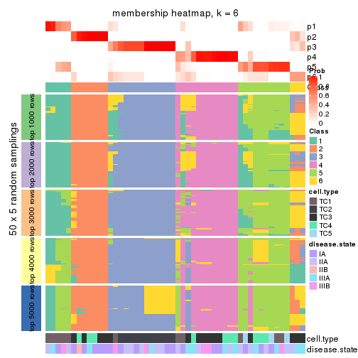</p>

</div>
</div>

As soon as we have had the classes for columns, we can look for signatures
which are significantly different between classes which can be candidate marks
for certain classes. Following are the heatmaps for signatures.


Signature heatmaps where rows are scaled:


<script>
$( function() {
	$( '#tabs-MAD-mclust-get-signatures' ).tabs();
} );
</script>
<div id='tabs-MAD-mclust-get-signatures'>
<ul>
<li><a href='#tab-MAD-mclust-get-signatures-1'>k = 2</a></li>
<li><a href='#tab-MAD-mclust-get-signatures-2'>k = 3</a></li>
<li><a href='#tab-MAD-mclust-get-signatures-3'>k = 4</a></li>
<li><a href='#tab-MAD-mclust-get-signatures-4'>k = 5</a></li>
<li><a href='#tab-MAD-mclust-get-signatures-5'>k = 6</a></li>
</ul>
<div id='tab-MAD-mclust-get-signatures-1'>
<pre><code class="r">get_signatures(res, k = 2)
</code></pre>

<p>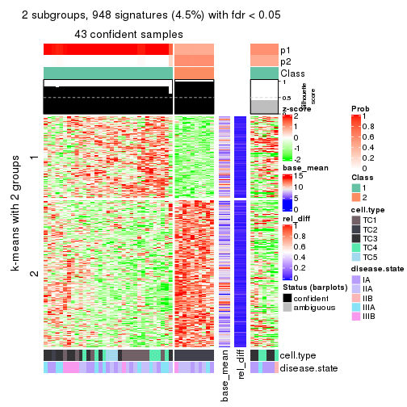</p>

</div>
<div id='tab-MAD-mclust-get-signatures-2'>
<pre><code class="r">get_signatures(res, k = 3)
</code></pre>

<p>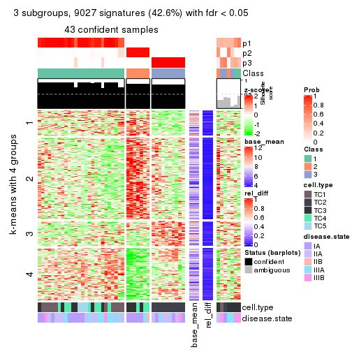</p>

</div>
<div id='tab-MAD-mclust-get-signatures-3'>
<pre><code class="r">get_signatures(res, k = 4)
</code></pre>

<p>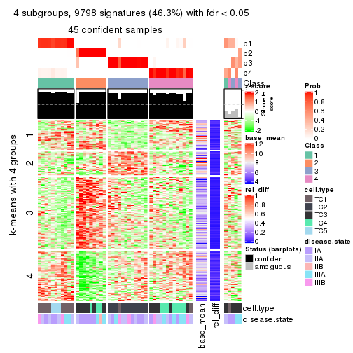</p>

</div>
<div id='tab-MAD-mclust-get-signatures-4'>
<pre><code class="r">get_signatures(res, k = 5)
</code></pre>

<p>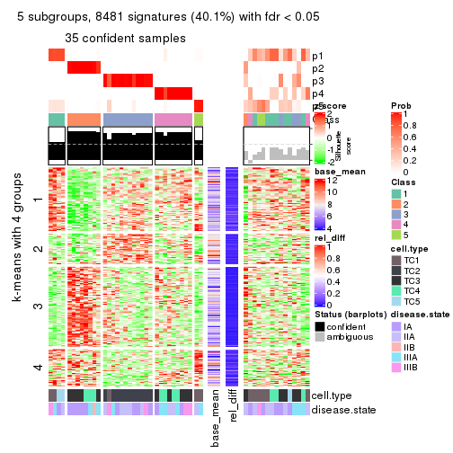</p>

</div>
<div id='tab-MAD-mclust-get-signatures-5'>
<pre><code class="r">get_signatures(res, k = 6)
</code></pre>

<p>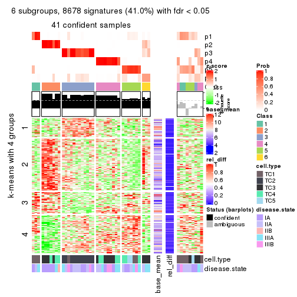</p>

</div>
</div>


Signature heatmaps where rows are not scaled:


<script>
$( function() {
	$( '#tabs-MAD-mclust-get-signatures-no-scale' ).tabs();
} );
</script>
<div id='tabs-MAD-mclust-get-signatures-no-scale'>
<ul>
<li><a href='#tab-MAD-mclust-get-signatures-no-scale-1'>k = 2</a></li>
<li><a href='#tab-MAD-mclust-get-signatures-no-scale-2'>k = 3</a></li>
<li><a href='#tab-MAD-mclust-get-signatures-no-scale-3'>k = 4</a></li>
<li><a href='#tab-MAD-mclust-get-signatures-no-scale-4'>k = 5</a></li>
<li><a href='#tab-MAD-mclust-get-signatures-no-scale-5'>k = 6</a></li>
</ul>
<div id='tab-MAD-mclust-get-signatures-no-scale-1'>
<pre><code class="r">get_signatures(res, k = 2, scale_rows = FALSE)
</code></pre>

<p>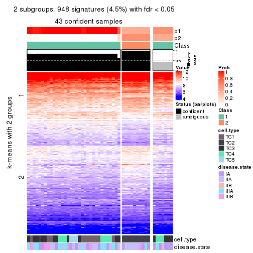</p>

</div>
<div id='tab-MAD-mclust-get-signatures-no-scale-2'>
<pre><code class="r">get_signatures(res, k = 3, scale_rows = FALSE)
</code></pre>

<p>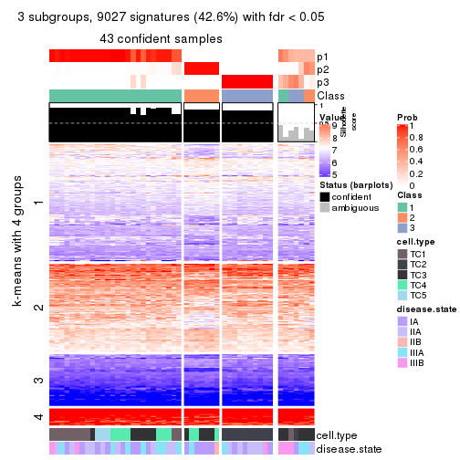</p>

</div>
<div id='tab-MAD-mclust-get-signatures-no-scale-3'>
<pre><code class="r">get_signatures(res, k = 4, scale_rows = FALSE)
</code></pre>

<p>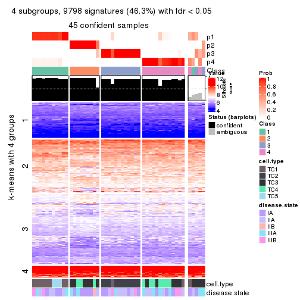</p>

</div>
<div id='tab-MAD-mclust-get-signatures-no-scale-4'>
<pre><code class="r">get_signatures(res, k = 5, scale_rows = FALSE)
</code></pre>

<p>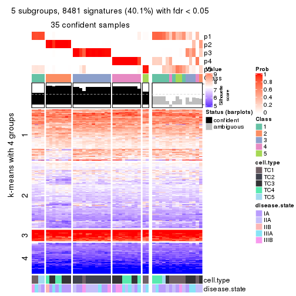</p>

</div>
<div id='tab-MAD-mclust-get-signatures-no-scale-5'>
<pre><code class="r">get_signatures(res, k = 6, scale_rows = FALSE)
</code></pre>

<p>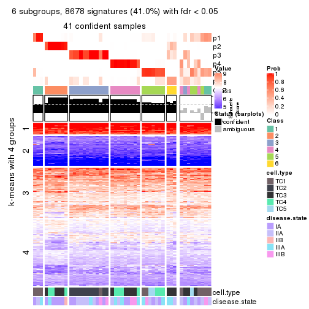</p>

</div>
</div>


Compare the overlap of signatures from different k:

```r
compare_signatures(res)
```

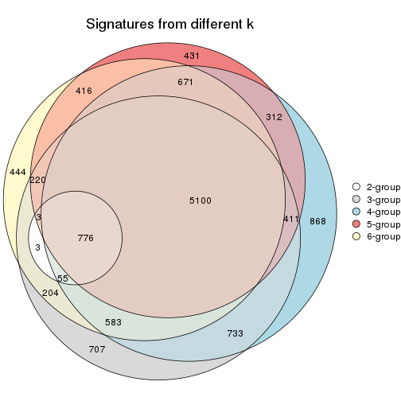

`get_signature()` returns a data frame invisibly. TO get the list of signatures, the function
call should be assigned to a variable explicitly. In following code, if `plot` argument is set
to `FALSE`, no heatmap is plotted while only the differential analysis is performed.

```r
# code only for demonstration
tb = get_signature(res, k = ..., plot = FALSE)
```

An example of the output of `tb` is:

```
#>   which_row         fdr    mean_1    mean_2 scaled_mean_1 scaled_mean_2 km
#> 1        38 0.042760348  8.373488  9.131774    -0.5533452     0.5164555  1
#> 2        40 0.018707592  7.106213  8.469186    -0.6173731     0.5762149  1
#> 3        55 0.019134737 10.221463 11.207825    -0.6159697     0.5749050  1
#> 4        59 0.006059896  5.921854  7.869574    -0.6899429     0.6439467  1
#> 5        60 0.018055526  8.928898 10.211722    -0.6204761     0.5791110  1
#> 6        98 0.009384629 15.714769 14.887706     0.6635654    -0.6193277  2
...
```

The columns in `tb` are:

1. `which_row`: row indices corresponding to the input matrix.
2. `fdr`: FDR for the differential test. 
3. `mean_x`: The mean value in group x.
4. `scaled_mean_x`: The mean value in group x after rows are scaled.
5. `km`: Row groups if k-means clustering is applied to rows.


UMAP plot which shows how samples are separated.


<script>
$( function() {
	$( '#tabs-MAD-mclust-dimension-reduction' ).tabs();
} );
</script>
<div id='tabs-MAD-mclust-dimension-reduction'>
<ul>
<li><a href='#tab-MAD-mclust-dimension-reduction-1'>k = 2</a></li>
<li><a href='#tab-MAD-mclust-dimension-reduction-2'>k = 3</a></li>
<li><a href='#tab-MAD-mclust-dimension-reduction-3'>k = 4</a></li>
<li><a href='#tab-MAD-mclust-dimension-reduction-4'>k = 5</a></li>
<li><a href='#tab-MAD-mclust-dimension-reduction-5'>k = 6</a></li>
</ul>
<div id='tab-MAD-mclust-dimension-reduction-1'>
<pre><code class="r">dimension_reduction(res, k = 2, method = &quot;UMAP&quot;)
</code></pre>

<p>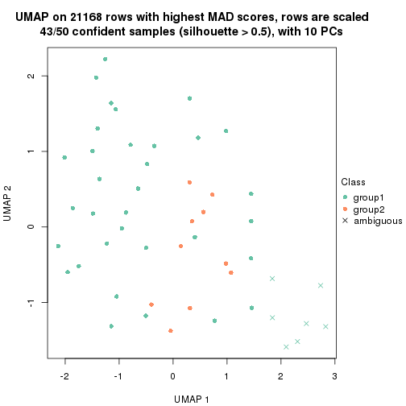</p>

</div>
<div id='tab-MAD-mclust-dimension-reduction-2'>
<pre><code class="r">dimension_reduction(res, k = 3, method = &quot;UMAP&quot;)
</code></pre>

<p>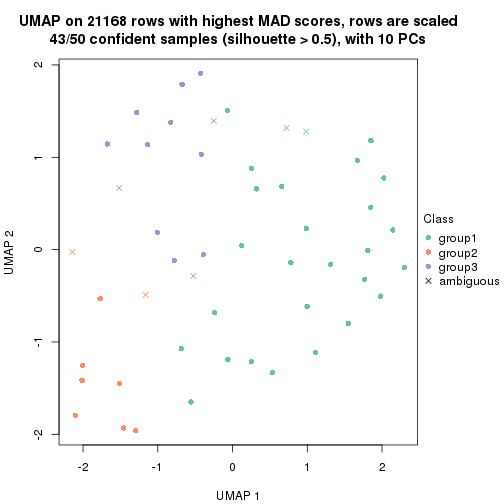</p>

</div>
<div id='tab-MAD-mclust-dimension-reduction-3'>
<pre><code class="r">dimension_reduction(res, k = 4, method = &quot;UMAP&quot;)
</code></pre>

<p>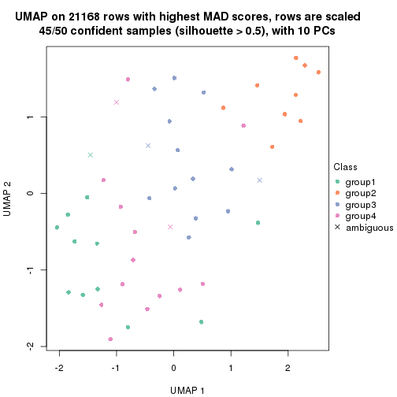</p>

</div>
<div id='tab-MAD-mclust-dimension-reduction-4'>
<pre><code class="r">dimension_reduction(res, k = 5, method = &quot;UMAP&quot;)
</code></pre>

<p>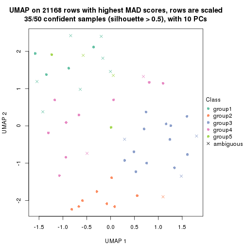</p>

</div>
<div id='tab-MAD-mclust-dimension-reduction-5'>
<pre><code class="r">dimension_reduction(res, k = 6, method = &quot;UMAP&quot;)
</code></pre>

<p>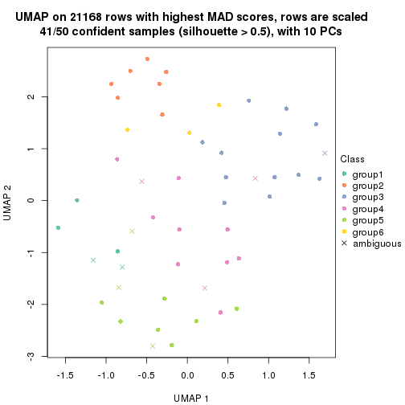</p>

</div>
</div>


Following heatmap shows how subgroups are split when increasing `k`:

```r
collect_classes(res)
```

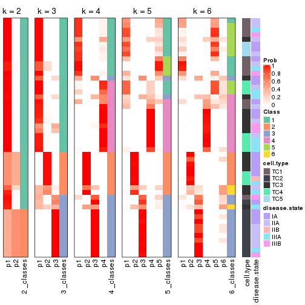


Test correlation between subgroups and known annotations. If the known
annotation is numeric, one-way ANOVA test is applied, and if the known
annotation is discrete, chi-squared contingency table test is applied.

```r
test_to_known_factors(res)
```

```
#>             n cell.type(p) disease.state(p) k
#> MAD:mclust 43     1.17e-07            0.571 2
#> MAD:mclust 43     2.73e-08            0.118 3
#> MAD:mclust 45     2.52e-12            0.555 4
#> MAD:mclust 35     5.81e-09            0.558 5
#> MAD:mclust 41     6.64e-09            0.524 6
```


If matrix rows can be associated to genes, consider to use `functional_enrichment(res,
...)` to perform function enrichment for the signature genes. See [this vignette](http://bioconductor.org/packages/devel/bioc/vignettes/cola/inst/doc/functional_enrichment.html) for more detailed explanations.


 

---------------------------------------------------


### MAD:NMF


The object with results only for a single top-value method and a single partition method 
can be extracted as:

```r
res = res_list["MAD", "NMF"]
# you can also extract it by
# res = res_list["MAD:NMF"]
```

A summary of `res` and all the functions that can be applied to it:

```r
res
```

```
#> A 'ConsensusPartition' object with k = 2, 3, 4, 5, 6.
#>   On a matrix with 21168 rows and 50 columns.
#>   Top rows (1000, 2000, 3000, 4000, 5000) are extracted by 'MAD' method.
#>   Subgroups are detected by 'NMF' method.
#>   Performed in total 1250 partitions by row resampling.
#>   Best k for subgroups seems to be 3.
#> 
#> Following methods can be applied to this 'ConsensusPartition' object:
#>  [1] "cola_report"             "collect_classes"         "collect_plots"          
#>  [4] "collect_stats"           "colnames"                "compare_signatures"     
#>  [7] "consensus_heatmap"       "dimension_reduction"     "functional_enrichment"  
#> [10] "get_anno_col"            "get_anno"                "get_classes"            
#> [13] "get_consensus"           "get_matrix"              "get_membership"         
#> [16] "get_param"               "get_signatures"          "get_stats"              
#> [19] "is_best_k"               "is_stable_k"             "membership_heatmap"     
#> [22] "ncol"                    "nrow"                    "plot_ecdf"              
#> [25] "rownames"                "select_partition_number" "show"                   
#> [28] "suggest_best_k"          "test_to_known_factors"
```

`collect_plots()` function collects all the plots made from `res` for all `k` (number of partitions)
into one single page to provide an easy and fast comparison between different `k`.

```r
collect_plots(res)
```

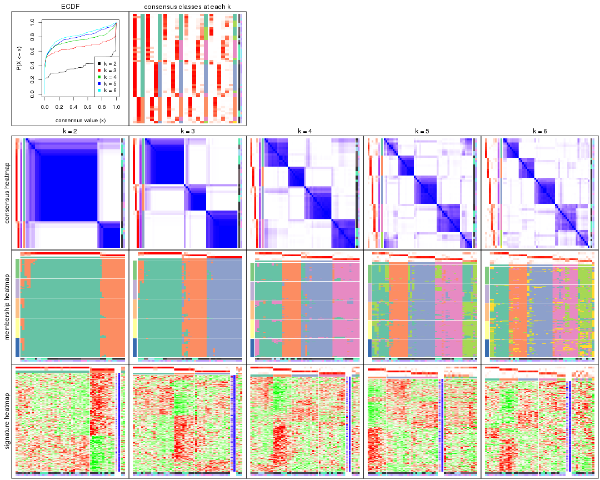

The plots are:

- The first row: a plot of the ECDF (empirical cumulative distribution
  function) curves of the consensus matrix for each `k` and the heatmap of
  predicted classes for each `k`.
- The second row: heatmaps of the consensus matrix for each `k`.
- The third row: heatmaps of the membership matrix for each `k`.
- The fouth row: heatmaps of the signatures for each `k`.

All the plots in panels can be made by individual functions and they are
plotted later in this section.

`select_partition_number()` produces several plots showing different
statistics for choosing "optimized" `k`. There are following statistics:

- ECDF curves of the consensus matrix for each `k`;
- 1-PAC. [The PAC
  score](https://en.wikipedia.org/wiki/Consensus_clustering#Over-interpretation_potential_of_consensus_clustering)
  measures the proportion of the ambiguous subgrouping.
- Mean silhouette score.
- Concordance. The mean probability of fiting the consensus class ids in all
  partitions.
- Area increased. Denote $A_k$ as the area under the ECDF curve for current
  `k`, the area increased is defined as $A_k - A_{k-1}$.
- Rand index. The percent of pairs of samples that are both in a same cluster
  or both are not in a same cluster in the partition of k and k-1.
- Jaccard index. The ratio of pairs of samples are both in a same cluster in
  the partition of k and k-1 and the pairs of samples are both in a same
  cluster in the partition k or k-1.

The detailed explanations of these statistics can be found in [the _cola_
vignette](http://bioconductor.org/packages/devel/bioc/vignettes/cola/inst/doc/cola.html#toc_13).

Generally speaking, lower PAC score, higher mean silhouette score or higher
concordance corresponds to better partition. Rand index and Jaccard index
measure how similar the current partition is compared to partition with `k-1`.
If they are too similar, we won't accept `k` is better than `k-1`.

```r
select_partition_number(res)
```

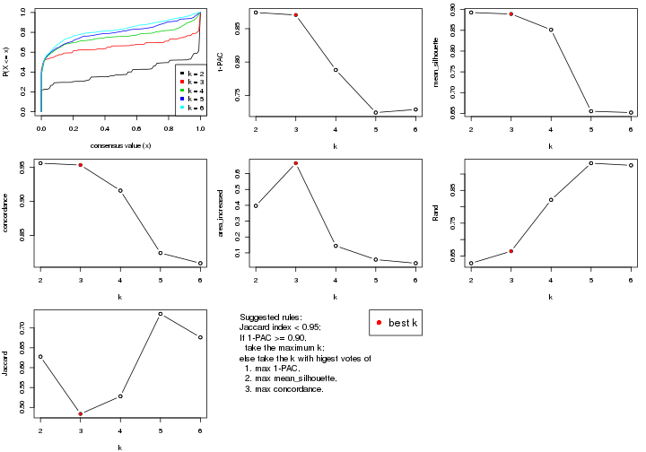

The numeric values for all these statistics can be obtained by `get_stats()`.

```r
get_stats(res)
```

```
#>   k 1-PAC mean_silhouette concordance area_increased  Rand Jaccard
#> 2 2 0.874           0.893       0.956         0.3966 0.628   0.628
#> 3 3 0.870           0.889       0.953         0.6659 0.664   0.484
#> 4 4 0.788           0.851       0.916         0.1440 0.821   0.528
#> 5 5 0.724           0.655       0.824         0.0573 0.933   0.735
#> 6 6 0.729           0.652       0.809         0.0344 0.927   0.676
```

`suggest_best_k()` suggests the best $k$ based on these statistics. The rules are as follows:

- All $k$ with Jaccard index larger than 0.95 are removed because increasing
  $k$ does not provide enough extra information. If all $k$ are removed, it is
  marked as no subgroup is detected.
- For all $k$ with 1-PAC score larger than 0.9, the maximal $k$ is taken as
  the best $k$, and other $k$ are marked as optional $k$.
- If it does not fit the second rule. The $k$ with the maximal vote of the
  highest 1-PAC score, highest mean silhouette, and highest concordance is
  taken as the best $k$.

```r
suggest_best_k(res)
```

```
#> [1] 3
```


Following shows the table of the partitions (You need to click the **show/hide
code output** link to see it). The membership matrix (columns with name `p*`)
is inferred by
[`clue::cl_consensus()`](https://www.rdocumentation.org/link/cl_consensus?package=clue)
function with the `SE` method. Basically the value in the membership matrix
represents the probability to belong to a certain group. The finall class
label for an item is determined with the group with highest probability it
belongs to.

In `get_classes()` function, the entropy is calculated from the membership
matrix and the silhouette score is calculated from the consensus matrix.


<script>
$( function() {
	$( '#tabs-MAD-NMF-get-classes' ).tabs();
} );
</script>
<div id='tabs-MAD-NMF-get-classes'>
<ul>
<li><a href='#tab-MAD-NMF-get-classes-1'>k = 2</a></li>
<li><a href='#tab-MAD-NMF-get-classes-2'>k = 3</a></li>
<li><a href='#tab-MAD-NMF-get-classes-3'>k = 4</a></li>
<li><a href='#tab-MAD-NMF-get-classes-4'>k = 5</a></li>
<li><a href='#tab-MAD-NMF-get-classes-5'>k = 6</a></li>
</ul>

<div id='tab-MAD-NMF-get-classes-1'>
<p><a id='tab-MAD-NMF-get-classes-1-a' style='color:#0366d6' href='#'>show/hide code output</a></p>
<pre><code class="r">cbind(get_classes(res, k = 2), get_membership(res, k = 2))
</code></pre>

<pre><code>#&gt;          class entropy silhouette    p1    p2
#&gt; GSM63448     1   0.000      0.950 1.000 0.000
#&gt; GSM63449     1   0.000      0.950 1.000 0.000
#&gt; GSM63423     1   0.000      0.950 1.000 0.000
#&gt; GSM63425     1   0.000      0.950 1.000 0.000
#&gt; GSM63437     1   0.000      0.950 1.000 0.000
#&gt; GSM63453     1   0.985      0.277 0.572 0.428
#&gt; GSM63431     1   0.000      0.950 1.000 0.000
#&gt; GSM63450     1   0.994      0.126 0.544 0.456
#&gt; GSM63428     1   0.000      0.950 1.000 0.000
#&gt; GSM63432     1   0.000      0.950 1.000 0.000
#&gt; GSM63458     1   0.000      0.950 1.000 0.000
#&gt; GSM63434     1   0.000      0.950 1.000 0.000
#&gt; GSM63435     1   0.000      0.950 1.000 0.000
#&gt; GSM63442     1   0.000      0.950 1.000 0.000
#&gt; GSM63451     1   0.000      0.950 1.000 0.000
#&gt; GSM63422     1   0.000      0.950 1.000 0.000
#&gt; GSM63438     1   0.000      0.950 1.000 0.000
#&gt; GSM63439     1   0.000      0.950 1.000 0.000
#&gt; GSM63461     1   0.000      0.950 1.000 0.000
#&gt; GSM63463     1   0.000      0.950 1.000 0.000
#&gt; GSM63430     1   0.000      0.950 1.000 0.000
#&gt; GSM63446     1   0.000      0.950 1.000 0.000
#&gt; GSM63429     1   0.000      0.950 1.000 0.000
#&gt; GSM63445     1   0.000      0.950 1.000 0.000
#&gt; GSM63447     2   0.295      0.922 0.052 0.948
#&gt; GSM63459     2   0.000      0.958 0.000 1.000
#&gt; GSM63464     2   0.000      0.958 0.000 1.000
#&gt; GSM63469     2   0.000      0.958 0.000 1.000
#&gt; GSM63470     2   0.000      0.958 0.000 1.000
#&gt; GSM63436     1   0.000      0.950 1.000 0.000
#&gt; GSM63443     2   0.895      0.546 0.312 0.688
#&gt; GSM63465     2   0.373      0.903 0.072 0.928
#&gt; GSM63444     2   0.000      0.958 0.000 1.000
#&gt; GSM63456     2   0.000      0.958 0.000 1.000
#&gt; GSM63462     1   0.118      0.938 0.984 0.016
#&gt; GSM63424     1   0.000      0.950 1.000 0.000
#&gt; GSM63440     1   0.000      0.950 1.000 0.000
#&gt; GSM63433     1   0.000      0.950 1.000 0.000
#&gt; GSM63466     2   0.000      0.958 0.000 1.000
#&gt; GSM63426     1   0.000      0.950 1.000 0.000
#&gt; GSM63468     1   0.850      0.633 0.724 0.276
#&gt; GSM63452     2   0.000      0.958 0.000 1.000
#&gt; GSM63441     1   0.260      0.916 0.956 0.044
#&gt; GSM63454     1   0.876      0.599 0.704 0.296
#&gt; GSM63455     1   0.000      0.950 1.000 0.000
#&gt; GSM63460     2   0.000      0.958 0.000 1.000
#&gt; GSM63467     1   0.295      0.909 0.948 0.052
#&gt; GSM63421     1   0.000      0.950 1.000 0.000
#&gt; GSM63427     1   0.706      0.756 0.808 0.192
#&gt; GSM63457     1   0.000      0.950 1.000 0.000
</code></pre>

<script>
$('#tab-MAD-NMF-get-classes-1-a').parent().next().next().hide();
$('#tab-MAD-NMF-get-classes-1-a').click(function(){
  $('#tab-MAD-NMF-get-classes-1-a').parent().next().next().toggle();
  return(false);
});
</script>
</div>

<div id='tab-MAD-NMF-get-classes-2'>
<p><a id='tab-MAD-NMF-get-classes-2-a' style='color:#0366d6' href='#'>show/hide code output</a></p>
<pre><code class="r">cbind(get_classes(res, k = 3), get_membership(res, k = 3))
</code></pre>

<pre><code>#&gt;          class entropy silhouette    p1    p2    p3
#&gt; GSM63448     1  0.0000      0.955 1.000 0.000 0.000
#&gt; GSM63449     1  0.0000      0.955 1.000 0.000 0.000
#&gt; GSM63423     1  0.0000      0.955 1.000 0.000 0.000
#&gt; GSM63425     1  0.0592      0.946 0.988 0.000 0.012
#&gt; GSM63437     1  0.0000      0.955 1.000 0.000 0.000
#&gt; GSM63453     1  0.1163      0.935 0.972 0.028 0.000
#&gt; GSM63431     1  0.0000      0.955 1.000 0.000 0.000
#&gt; GSM63450     2  0.6154      0.310 0.408 0.592 0.000
#&gt; GSM63428     1  0.0000      0.955 1.000 0.000 0.000
#&gt; GSM63432     3  0.2711      0.895 0.088 0.000 0.912
#&gt; GSM63458     1  0.0000      0.955 1.000 0.000 0.000
#&gt; GSM63434     3  0.0000      0.975 0.000 0.000 1.000
#&gt; GSM63435     3  0.0000      0.975 0.000 0.000 1.000
#&gt; GSM63442     3  0.0424      0.971 0.008 0.000 0.992
#&gt; GSM63451     3  0.0000      0.975 0.000 0.000 1.000
#&gt; GSM63422     3  0.0000      0.975 0.000 0.000 1.000
#&gt; GSM63438     3  0.0000      0.975 0.000 0.000 1.000
#&gt; GSM63439     3  0.0000      0.975 0.000 0.000 1.000
#&gt; GSM63461     3  0.0000      0.975 0.000 0.000 1.000
#&gt; GSM63463     3  0.0000      0.975 0.000 0.000 1.000
#&gt; GSM63430     3  0.0000      0.975 0.000 0.000 1.000
#&gt; GSM63446     3  0.0000      0.975 0.000 0.000 1.000
#&gt; GSM63429     1  0.0000      0.955 1.000 0.000 0.000
#&gt; GSM63445     3  0.3551      0.841 0.132 0.000 0.868
#&gt; GSM63447     2  0.4555      0.694 0.200 0.800 0.000
#&gt; GSM63459     2  0.0000      0.889 0.000 1.000 0.000
#&gt; GSM63464     2  0.0000      0.889 0.000 1.000 0.000
#&gt; GSM63469     2  0.0000      0.889 0.000 1.000 0.000
#&gt; GSM63470     2  0.0000      0.889 0.000 1.000 0.000
#&gt; GSM63436     1  0.0000      0.955 1.000 0.000 0.000
#&gt; GSM63443     3  0.1964      0.928 0.000 0.056 0.944
#&gt; GSM63465     2  0.0424      0.885 0.000 0.992 0.008
#&gt; GSM63444     2  0.3038      0.813 0.000 0.896 0.104
#&gt; GSM63456     2  0.6252      0.194 0.000 0.556 0.444
#&gt; GSM63462     3  0.2116      0.939 0.012 0.040 0.948
#&gt; GSM63424     3  0.0237      0.973 0.004 0.000 0.996
#&gt; GSM63440     3  0.0237      0.973 0.004 0.000 0.996
#&gt; GSM63433     1  0.0000      0.955 1.000 0.000 0.000
#&gt; GSM63466     2  0.0000      0.889 0.000 1.000 0.000
#&gt; GSM63426     1  0.0000      0.955 1.000 0.000 0.000
#&gt; GSM63468     1  0.4931      0.698 0.768 0.232 0.000
#&gt; GSM63452     2  0.0000      0.889 0.000 1.000 0.000
#&gt; GSM63441     1  0.0000      0.955 1.000 0.000 0.000
#&gt; GSM63454     1  0.5905      0.467 0.648 0.352 0.000
#&gt; GSM63455     1  0.0000      0.955 1.000 0.000 0.000
#&gt; GSM63460     2  0.0000      0.889 0.000 1.000 0.000
#&gt; GSM63467     1  0.4452      0.754 0.808 0.192 0.000
#&gt; GSM63421     1  0.0000      0.955 1.000 0.000 0.000
#&gt; GSM63427     1  0.0424      0.950 0.992 0.008 0.000
#&gt; GSM63457     1  0.0000      0.955 1.000 0.000 0.000
</code></pre>

<script>
$('#tab-MAD-NMF-get-classes-2-a').parent().next().next().hide();
$('#tab-MAD-NMF-get-classes-2-a').click(function(){
  $('#tab-MAD-NMF-get-classes-2-a').parent().next().next().toggle();
  return(false);
});
</script>
</div>

<div id='tab-MAD-NMF-get-classes-3'>
<p><a id='tab-MAD-NMF-get-classes-3-a' style='color:#0366d6' href='#'>show/hide code output</a></p>
<pre><code class="r">cbind(get_classes(res, k = 4), get_membership(res, k = 4))
</code></pre>

<pre><code>#&gt;          class entropy silhouette    p1    p2    p3    p4
#&gt; GSM63448     1  0.4804      0.492 0.616 0.000 0.000 0.384
#&gt; GSM63449     1  0.0779      0.867 0.980 0.000 0.016 0.004
#&gt; GSM63423     1  0.0336      0.876 0.992 0.000 0.000 0.008
#&gt; GSM63425     4  0.1151      0.912 0.024 0.000 0.008 0.968
#&gt; GSM63437     1  0.0817      0.880 0.976 0.000 0.000 0.024
#&gt; GSM63453     1  0.1520      0.876 0.956 0.020 0.000 0.024
#&gt; GSM63431     1  0.2345      0.876 0.900 0.000 0.000 0.100
#&gt; GSM63450     1  0.2011      0.836 0.920 0.080 0.000 0.000
#&gt; GSM63428     1  0.0657      0.870 0.984 0.000 0.012 0.004
#&gt; GSM63432     3  0.4804      0.456 0.384 0.000 0.616 0.000
#&gt; GSM63458     1  0.2814      0.861 0.868 0.000 0.000 0.132
#&gt; GSM63434     3  0.0188      0.896 0.000 0.000 0.996 0.004
#&gt; GSM63435     3  0.1022      0.888 0.032 0.000 0.968 0.000
#&gt; GSM63442     3  0.2647      0.842 0.120 0.000 0.880 0.000
#&gt; GSM63451     3  0.0000      0.896 0.000 0.000 1.000 0.000
#&gt; GSM63422     3  0.0895      0.893 0.020 0.000 0.976 0.004
#&gt; GSM63438     3  0.0707      0.892 0.000 0.000 0.980 0.020
#&gt; GSM63439     3  0.0817      0.890 0.000 0.000 0.976 0.024
#&gt; GSM63461     3  0.0000      0.896 0.000 0.000 1.000 0.000
#&gt; GSM63463     3  0.0524      0.895 0.008 0.000 0.988 0.004
#&gt; GSM63430     3  0.0188      0.896 0.000 0.000 0.996 0.004
#&gt; GSM63446     3  0.0336      0.895 0.000 0.000 0.992 0.008
#&gt; GSM63429     4  0.0804      0.914 0.012 0.000 0.008 0.980
#&gt; GSM63445     3  0.4428      0.650 0.276 0.000 0.720 0.004
#&gt; GSM63447     4  0.4088      0.717 0.004 0.232 0.000 0.764
#&gt; GSM63459     2  0.0000      0.971 0.000 1.000 0.000 0.000
#&gt; GSM63464     2  0.0188      0.972 0.000 0.996 0.000 0.004
#&gt; GSM63469     2  0.0336      0.973 0.000 0.992 0.000 0.008
#&gt; GSM63470     2  0.0336      0.973 0.000 0.992 0.000 0.008
#&gt; GSM63436     1  0.4855      0.463 0.600 0.000 0.000 0.400
#&gt; GSM63443     3  0.6791      0.372 0.100 0.332 0.564 0.004
#&gt; GSM63465     4  0.3009      0.865 0.000 0.056 0.052 0.892
#&gt; GSM63444     2  0.1182      0.962 0.000 0.968 0.016 0.016
#&gt; GSM63456     2  0.3340      0.815 0.004 0.848 0.144 0.004
#&gt; GSM63462     3  0.3266      0.832 0.004 0.032 0.880 0.084
#&gt; GSM63424     4  0.2345      0.863 0.000 0.000 0.100 0.900
#&gt; GSM63440     4  0.2814      0.838 0.000 0.000 0.132 0.868
#&gt; GSM63433     4  0.2281      0.872 0.096 0.000 0.000 0.904
#&gt; GSM63466     2  0.0336      0.973 0.000 0.992 0.000 0.008
#&gt; GSM63426     4  0.2281      0.872 0.096 0.000 0.000 0.904
#&gt; GSM63468     4  0.0376      0.913 0.000 0.004 0.004 0.992
#&gt; GSM63452     2  0.0469      0.966 0.012 0.988 0.000 0.000
#&gt; GSM63441     4  0.0376      0.914 0.004 0.000 0.004 0.992
#&gt; GSM63454     4  0.0524      0.913 0.000 0.008 0.004 0.988
#&gt; GSM63455     4  0.1940      0.888 0.076 0.000 0.000 0.924
#&gt; GSM63460     2  0.0592      0.969 0.000 0.984 0.000 0.016
#&gt; GSM63467     4  0.1888      0.904 0.044 0.016 0.000 0.940
#&gt; GSM63421     1  0.2081      0.880 0.916 0.000 0.000 0.084
#&gt; GSM63427     1  0.2675      0.876 0.892 0.008 0.000 0.100
#&gt; GSM63457     1  0.2760      0.862 0.872 0.000 0.000 0.128
</code></pre>

<script>
$('#tab-MAD-NMF-get-classes-3-a').parent().next().next().hide();
$('#tab-MAD-NMF-get-classes-3-a').click(function(){
  $('#tab-MAD-NMF-get-classes-3-a').parent().next().next().toggle();
  return(false);
});
</script>
</div>

<div id='tab-MAD-NMF-get-classes-4'>
<p><a id='tab-MAD-NMF-get-classes-4-a' style='color:#0366d6' href='#'>show/hide code output</a></p>
<pre><code class="r">cbind(get_classes(res, k = 5), get_membership(res, k = 5))
</code></pre>

<pre><code>#&gt;          class entropy silhouette    p1    p2    p3    p4    p5
#&gt; GSM63448     5  0.6417      0.340 0.348 0.004 0.000 0.160 0.488
#&gt; GSM63449     5  0.4446      0.342 0.476 0.000 0.004 0.000 0.520
#&gt; GSM63423     5  0.4446      0.343 0.476 0.000 0.000 0.004 0.520
#&gt; GSM63425     4  0.1405      0.854 0.020 0.000 0.008 0.956 0.016
#&gt; GSM63437     1  0.4473     -0.308 0.580 0.000 0.000 0.008 0.412
#&gt; GSM63453     1  0.1310      0.452 0.956 0.020 0.000 0.000 0.024
#&gt; GSM63431     1  0.4263      0.278 0.760 0.000 0.000 0.060 0.180
#&gt; GSM63450     1  0.1341      0.427 0.944 0.056 0.000 0.000 0.000
#&gt; GSM63428     5  0.4450      0.319 0.488 0.000 0.004 0.000 0.508
#&gt; GSM63432     1  0.6732     -0.237 0.392 0.000 0.256 0.000 0.352
#&gt; GSM63458     1  0.4119      0.446 0.780 0.000 0.000 0.068 0.152
#&gt; GSM63434     3  0.0609      0.899 0.000 0.000 0.980 0.000 0.020
#&gt; GSM63435     3  0.0703      0.898 0.000 0.000 0.976 0.000 0.024
#&gt; GSM63442     3  0.2727      0.830 0.116 0.000 0.868 0.000 0.016
#&gt; GSM63451     3  0.0404      0.901 0.000 0.000 0.988 0.000 0.012
#&gt; GSM63422     3  0.0609      0.902 0.000 0.000 0.980 0.000 0.020
#&gt; GSM63438     3  0.0162      0.901 0.000 0.000 0.996 0.000 0.004
#&gt; GSM63439     3  0.0510      0.900 0.000 0.000 0.984 0.000 0.016
#&gt; GSM63461     3  0.0290      0.901 0.000 0.000 0.992 0.000 0.008
#&gt; GSM63463     3  0.0404      0.901 0.000 0.000 0.988 0.000 0.012
#&gt; GSM63430     3  0.3395      0.728 0.000 0.000 0.764 0.000 0.236
#&gt; GSM63446     3  0.0771      0.897 0.004 0.000 0.976 0.000 0.020
#&gt; GSM63429     4  0.0968      0.855 0.012 0.000 0.004 0.972 0.012
#&gt; GSM63445     3  0.5889      0.387 0.116 0.000 0.544 0.000 0.340
#&gt; GSM63447     4  0.2911      0.794 0.004 0.136 0.000 0.852 0.008
#&gt; GSM63459     2  0.0000      0.934 0.000 1.000 0.000 0.000 0.000
#&gt; GSM63464     2  0.0162      0.933 0.000 0.996 0.000 0.000 0.004
#&gt; GSM63469     2  0.0000      0.934 0.000 1.000 0.000 0.000 0.000
#&gt; GSM63470     2  0.0162      0.934 0.004 0.996 0.000 0.000 0.000
#&gt; GSM63436     5  0.4119      0.260 0.068 0.000 0.000 0.152 0.780
#&gt; GSM63443     5  0.5064      0.216 0.032 0.032 0.240 0.000 0.696
#&gt; GSM63465     4  0.4612      0.690 0.000 0.196 0.056 0.740 0.008
#&gt; GSM63444     2  0.1460      0.925 0.008 0.956 0.012 0.020 0.004
#&gt; GSM63456     2  0.4943      0.674 0.076 0.716 0.200 0.000 0.008
#&gt; GSM63462     3  0.5592      0.672 0.136 0.016 0.712 0.016 0.120
#&gt; GSM63424     4  0.4083      0.677 0.000 0.000 0.228 0.744 0.028
#&gt; GSM63440     4  0.2723      0.795 0.000 0.000 0.124 0.864 0.012
#&gt; GSM63433     4  0.3492      0.763 0.016 0.000 0.000 0.796 0.188
#&gt; GSM63466     2  0.1116      0.923 0.004 0.964 0.000 0.028 0.004
#&gt; GSM63426     4  0.3961      0.729 0.028 0.000 0.000 0.760 0.212
#&gt; GSM63468     4  0.0162      0.856 0.000 0.004 0.000 0.996 0.000
#&gt; GSM63452     2  0.2727      0.856 0.116 0.868 0.000 0.000 0.016
#&gt; GSM63441     4  0.0162      0.856 0.000 0.000 0.004 0.996 0.000
#&gt; GSM63454     4  0.0932      0.854 0.004 0.020 0.004 0.972 0.000
#&gt; GSM63455     4  0.3953      0.756 0.048 0.000 0.000 0.784 0.168
#&gt; GSM63460     2  0.1041      0.924 0.004 0.964 0.000 0.032 0.000
#&gt; GSM63467     4  0.1314      0.854 0.016 0.012 0.000 0.960 0.012
#&gt; GSM63421     1  0.5345      0.297 0.540 0.000 0.000 0.056 0.404
#&gt; GSM63427     5  0.5159      0.142 0.188 0.000 0.000 0.124 0.688
#&gt; GSM63457     1  0.5373      0.357 0.632 0.000 0.000 0.092 0.276
</code></pre>

<script>
$('#tab-MAD-NMF-get-classes-4-a').parent().next().next().hide();
$('#tab-MAD-NMF-get-classes-4-a').click(function(){
  $('#tab-MAD-NMF-get-classes-4-a').parent().next().next().toggle();
  return(false);
});
</script>
</div>

<div id='tab-MAD-NMF-get-classes-5'>
<p><a id='tab-MAD-NMF-get-classes-5-a' style='color:#0366d6' href='#'>show/hide code output</a></p>
<pre><code class="r">cbind(get_classes(res, k = 6), get_membership(res, k = 6))
</code></pre>

<pre><code>#&gt;          class entropy silhouette    p1    p2    p3    p4    p5    p6
#&gt; GSM63448     1  0.2989      0.672 0.864 0.000 0.000 0.072 0.028 0.036
#&gt; GSM63449     1  0.0146      0.757 0.996 0.000 0.000 0.000 0.000 0.004
#&gt; GSM63423     1  0.0520      0.759 0.984 0.000 0.000 0.000 0.008 0.008
#&gt; GSM63425     4  0.4170      0.684 0.056 0.000 0.000 0.780 0.120 0.044
#&gt; GSM63437     1  0.1257      0.762 0.952 0.000 0.000 0.000 0.020 0.028
#&gt; GSM63453     1  0.6219      0.344 0.448 0.016 0.000 0.000 0.200 0.336
#&gt; GSM63431     1  0.3227      0.713 0.840 0.000 0.000 0.012 0.096 0.052
#&gt; GSM63450     1  0.6202      0.368 0.468 0.024 0.000 0.000 0.168 0.340
#&gt; GSM63428     1  0.0363      0.762 0.988 0.000 0.000 0.000 0.012 0.000
#&gt; GSM63432     1  0.1957      0.707 0.912 0.000 0.072 0.000 0.008 0.008
#&gt; GSM63458     5  0.6502      0.254 0.236 0.000 0.000 0.068 0.524 0.172
#&gt; GSM63434     3  0.1768      0.850 0.008 0.000 0.932 0.004 0.012 0.044
#&gt; GSM63435     3  0.1124      0.861 0.000 0.000 0.956 0.000 0.008 0.036
#&gt; GSM63442     3  0.3285      0.744 0.000 0.000 0.820 0.000 0.116 0.064
#&gt; GSM63451     3  0.0547      0.867 0.000 0.000 0.980 0.000 0.000 0.020
#&gt; GSM63422     3  0.1049      0.866 0.000 0.000 0.960 0.000 0.008 0.032
#&gt; GSM63438     3  0.0717      0.868 0.000 0.000 0.976 0.000 0.008 0.016
#&gt; GSM63439     3  0.1049      0.865 0.000 0.000 0.960 0.000 0.008 0.032
#&gt; GSM63461     3  0.0790      0.863 0.000 0.000 0.968 0.000 0.000 0.032
#&gt; GSM63463     3  0.0547      0.867 0.000 0.000 0.980 0.000 0.000 0.020
#&gt; GSM63430     3  0.4547      0.357 0.020 0.000 0.628 0.000 0.020 0.332
#&gt; GSM63446     3  0.1124      0.858 0.000 0.000 0.956 0.008 0.000 0.036
#&gt; GSM63429     4  0.3187      0.676 0.004 0.000 0.000 0.796 0.188 0.012
#&gt; GSM63445     5  0.4233      0.431 0.016 0.000 0.192 0.008 0.748 0.036
#&gt; GSM63447     4  0.4339      0.670 0.000 0.148 0.000 0.752 0.080 0.020
#&gt; GSM63459     2  0.0508      0.849 0.000 0.984 0.000 0.000 0.004 0.012
#&gt; GSM63464     2  0.0984      0.848 0.000 0.968 0.000 0.008 0.012 0.012
#&gt; GSM63469     2  0.0146      0.851 0.000 0.996 0.000 0.004 0.000 0.000
#&gt; GSM63470     2  0.0717      0.850 0.000 0.976 0.000 0.008 0.000 0.016
#&gt; GSM63436     5  0.5378      0.601 0.100 0.000 0.004 0.088 0.696 0.112
#&gt; GSM63443     6  0.6898      0.000 0.208 0.048 0.120 0.000 0.068 0.556
#&gt; GSM63465     4  0.5195      0.550 0.000 0.188 0.064 0.696 0.020 0.032
#&gt; GSM63444     2  0.3379      0.806 0.000 0.836 0.020 0.112 0.016 0.016
#&gt; GSM63456     2  0.4804      0.620 0.000 0.700 0.140 0.000 0.012 0.148
#&gt; GSM63462     3  0.5937      0.348 0.000 0.016 0.564 0.004 0.220 0.196
#&gt; GSM63424     4  0.5695      0.460 0.000 0.000 0.288 0.584 0.080 0.048
#&gt; GSM63440     4  0.3952      0.691 0.000 0.000 0.096 0.800 0.064 0.040
#&gt; GSM63433     4  0.3975      0.208 0.000 0.000 0.000 0.544 0.452 0.004
#&gt; GSM63466     2  0.3095      0.806 0.000 0.840 0.000 0.116 0.008 0.036
#&gt; GSM63426     5  0.3969      0.291 0.008 0.000 0.000 0.344 0.644 0.004
#&gt; GSM63468     4  0.1148      0.727 0.000 0.000 0.004 0.960 0.020 0.016
#&gt; GSM63452     2  0.4094      0.681 0.000 0.744 0.000 0.000 0.088 0.168
#&gt; GSM63441     4  0.1700      0.726 0.000 0.000 0.000 0.916 0.080 0.004
#&gt; GSM63454     4  0.1346      0.721 0.000 0.016 0.000 0.952 0.024 0.008
#&gt; GSM63455     4  0.4517      0.131 0.000 0.000 0.000 0.524 0.444 0.032
#&gt; GSM63460     2  0.3277      0.786 0.000 0.812 0.000 0.156 0.008 0.024
#&gt; GSM63467     4  0.3271      0.697 0.012 0.020 0.000 0.856 0.048 0.064
#&gt; GSM63421     5  0.3777      0.663 0.124 0.000 0.000 0.084 0.788 0.004
#&gt; GSM63427     5  0.5094      0.611 0.092 0.012 0.008 0.052 0.740 0.096
#&gt; GSM63457     5  0.3039      0.657 0.052 0.000 0.000 0.068 0.860 0.020
</code></pre>

<script>
$('#tab-MAD-NMF-get-classes-5-a').parent().next().next().hide();
$('#tab-MAD-NMF-get-classes-5-a').click(function(){
  $('#tab-MAD-NMF-get-classes-5-a').parent().next().next().toggle();
  return(false);
});
</script>
</div>
</div>

Heatmaps for the consensus matrix. It visualizes the probability of two
samples to be in a same group.


<script>
$( function() {
	$( '#tabs-MAD-NMF-consensus-heatmap' ).tabs();
} );
</script>
<div id='tabs-MAD-NMF-consensus-heatmap'>
<ul>
<li><a href='#tab-MAD-NMF-consensus-heatmap-1'>k = 2</a></li>
<li><a href='#tab-MAD-NMF-consensus-heatmap-2'>k = 3</a></li>
<li><a href='#tab-MAD-NMF-consensus-heatmap-3'>k = 4</a></li>
<li><a href='#tab-MAD-NMF-consensus-heatmap-4'>k = 5</a></li>
<li><a href='#tab-MAD-NMF-consensus-heatmap-5'>k = 6</a></li>
</ul>
<div id='tab-MAD-NMF-consensus-heatmap-1'>
<pre><code class="r">consensus_heatmap(res, k = 2)
</code></pre>

<p>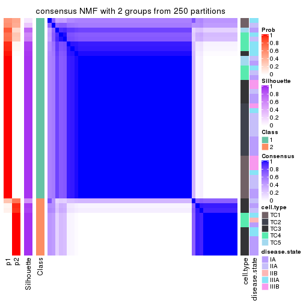</p>

</div>
<div id='tab-MAD-NMF-consensus-heatmap-2'>
<pre><code class="r">consensus_heatmap(res, k = 3)
</code></pre>

<p>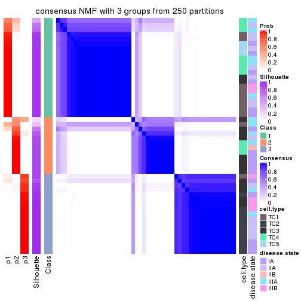</p>

</div>
<div id='tab-MAD-NMF-consensus-heatmap-3'>
<pre><code class="r">consensus_heatmap(res, k = 4)
</code></pre>

<p>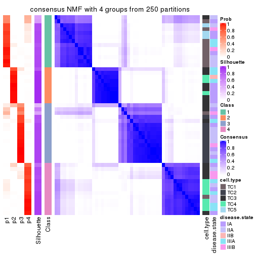</p>

</div>
<div id='tab-MAD-NMF-consensus-heatmap-4'>
<pre><code class="r">consensus_heatmap(res, k = 5)
</code></pre>

<p>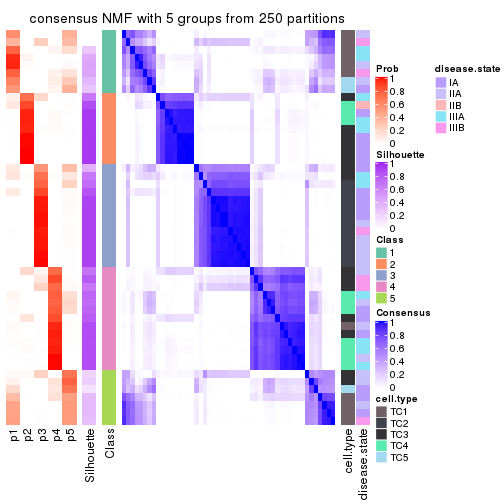</p>

</div>
<div id='tab-MAD-NMF-consensus-heatmap-5'>
<pre><code class="r">consensus_heatmap(res, k = 6)
</code></pre>

<p>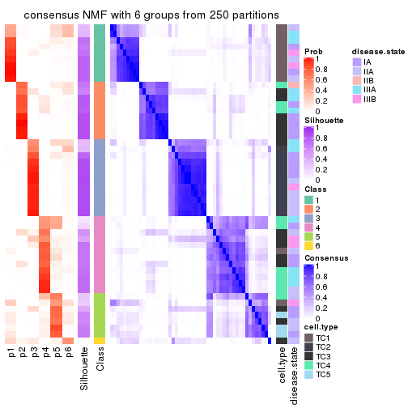</p>

</div>
</div>

Heatmaps for the membership of samples in all partitions to see how consistent they are:


<script>
$( function() {
	$( '#tabs-MAD-NMF-membership-heatmap' ).tabs();
} );
</script>
<div id='tabs-MAD-NMF-membership-heatmap'>
<ul>
<li><a href='#tab-MAD-NMF-membership-heatmap-1'>k = 2</a></li>
<li><a href='#tab-MAD-NMF-membership-heatmap-2'>k = 3</a></li>
<li><a href='#tab-MAD-NMF-membership-heatmap-3'>k = 4</a></li>
<li><a href='#tab-MAD-NMF-membership-heatmap-4'>k = 5</a></li>
<li><a href='#tab-MAD-NMF-membership-heatmap-5'>k = 6</a></li>
</ul>
<div id='tab-MAD-NMF-membership-heatmap-1'>
<pre><code class="r">membership_heatmap(res, k = 2)
</code></pre>

<p>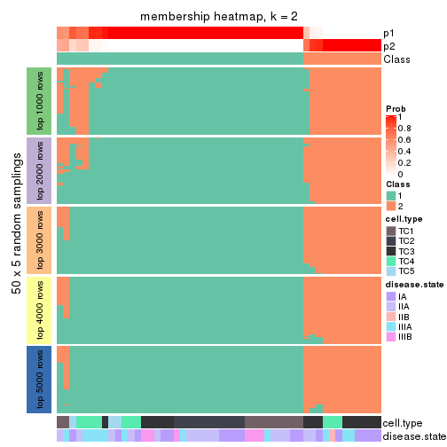</p>

</div>
<div id='tab-MAD-NMF-membership-heatmap-2'>
<pre><code class="r">membership_heatmap(res, k = 3)
</code></pre>

<p>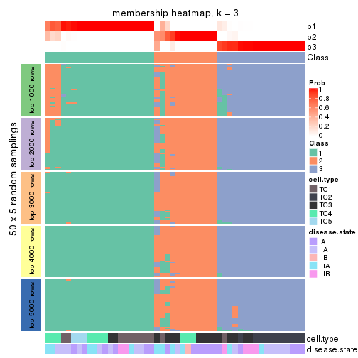</p>

</div>
<div id='tab-MAD-NMF-membership-heatmap-3'>
<pre><code class="r">membership_heatmap(res, k = 4)
</code></pre>

<p>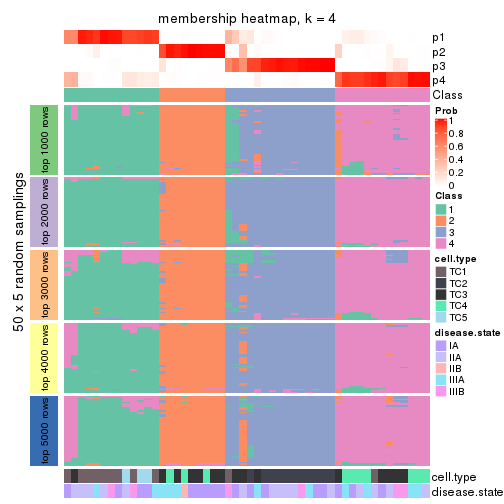</p>

</div>
<div id='tab-MAD-NMF-membership-heatmap-4'>
<pre><code class="r">membership_heatmap(res, k = 5)
</code></pre>

<p>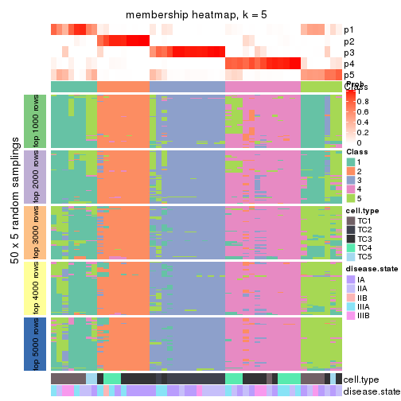</p>

</div>
<div id='tab-MAD-NMF-membership-heatmap-5'>
<pre><code class="r">membership_heatmap(res, k = 6)
</code></pre>

<p>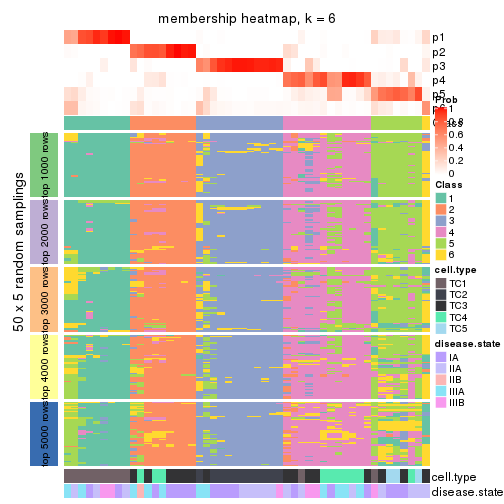</p>

</div>
</div>

As soon as we have had the classes for columns, we can look for signatures
which are significantly different between classes which can be candidate marks
for certain classes. Following are the heatmaps for signatures.


Signature heatmaps where rows are scaled:


<script>
$( function() {
	$( '#tabs-MAD-NMF-get-signatures' ).tabs();
} );
</script>
<div id='tabs-MAD-NMF-get-signatures'>
<ul>
<li><a href='#tab-MAD-NMF-get-signatures-1'>k = 2</a></li>
<li><a href='#tab-MAD-NMF-get-signatures-2'>k = 3</a></li>
<li><a href='#tab-MAD-NMF-get-signatures-3'>k = 4</a></li>
<li><a href='#tab-MAD-NMF-get-signatures-4'>k = 5</a></li>
<li><a href='#tab-MAD-NMF-get-signatures-5'>k = 6</a></li>
</ul>
<div id='tab-MAD-NMF-get-signatures-1'>
<pre><code class="r">get_signatures(res, k = 2)
</code></pre>

<p>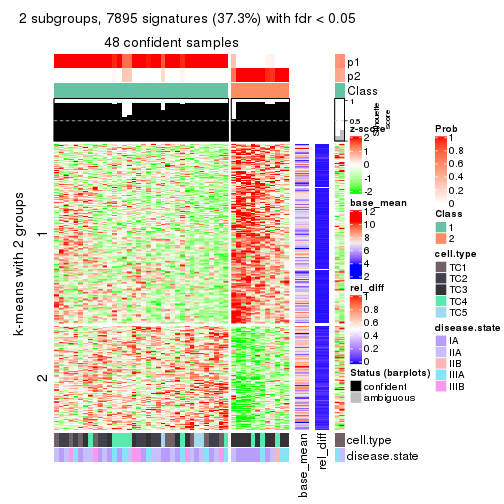</p>

</div>
<div id='tab-MAD-NMF-get-signatures-2'>
<pre><code class="r">get_signatures(res, k = 3)
</code></pre>

<p>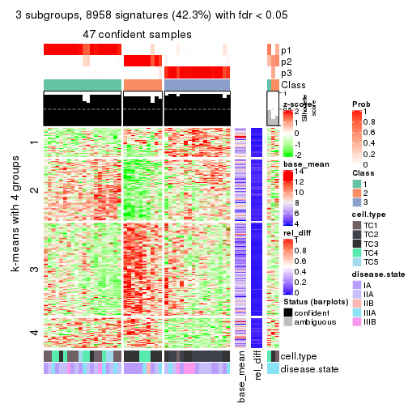</p>

</div>
<div id='tab-MAD-NMF-get-signatures-3'>
<pre><code class="r">get_signatures(res, k = 4)
</code></pre>

<p>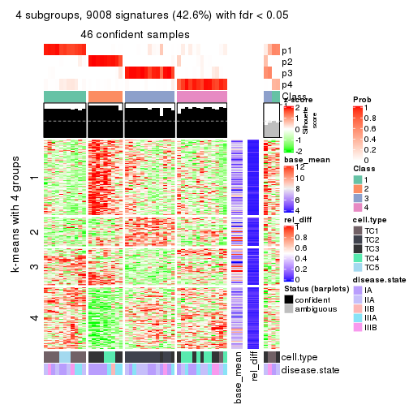</p>

</div>
<div id='tab-MAD-NMF-get-signatures-4'>
<pre><code class="r">get_signatures(res, k = 5)
</code></pre>

<p>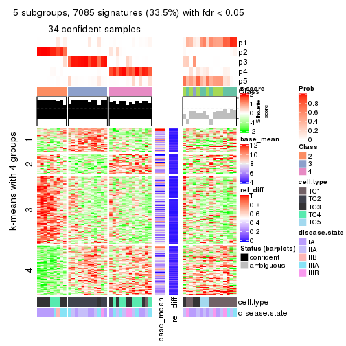</p>

</div>
<div id='tab-MAD-NMF-get-signatures-5'>
<pre><code class="r">get_signatures(res, k = 6)
</code></pre>

<p>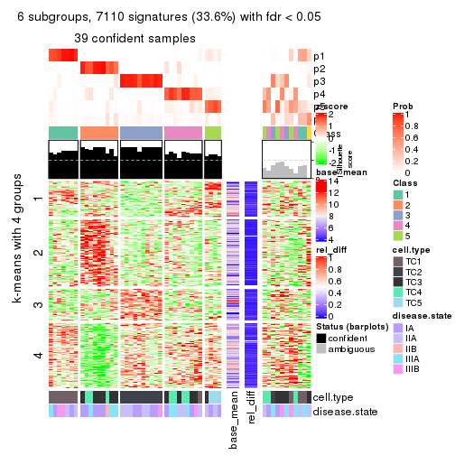</p>

</div>
</div>


Signature heatmaps where rows are not scaled:


<script>
$( function() {
	$( '#tabs-MAD-NMF-get-signatures-no-scale' ).tabs();
} );
</script>
<div id='tabs-MAD-NMF-get-signatures-no-scale'>
<ul>
<li><a href='#tab-MAD-NMF-get-signatures-no-scale-1'>k = 2</a></li>
<li><a href='#tab-MAD-NMF-get-signatures-no-scale-2'>k = 3</a></li>
<li><a href='#tab-MAD-NMF-get-signatures-no-scale-3'>k = 4</a></li>
<li><a href='#tab-MAD-NMF-get-signatures-no-scale-4'>k = 5</a></li>
<li><a href='#tab-MAD-NMF-get-signatures-no-scale-5'>k = 6</a></li>
</ul>
<div id='tab-MAD-NMF-get-signatures-no-scale-1'>
<pre><code class="r">get_signatures(res, k = 2, scale_rows = FALSE)
</code></pre>

<p>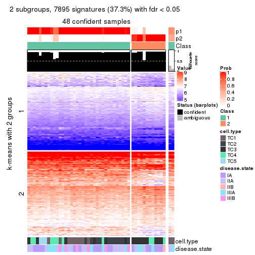</p>

</div>
<div id='tab-MAD-NMF-get-signatures-no-scale-2'>
<pre><code class="r">get_signatures(res, k = 3, scale_rows = FALSE)
</code></pre>

<p>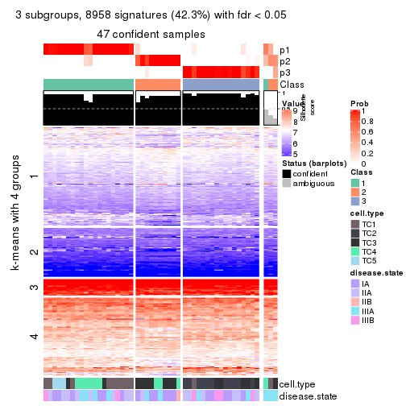</p>

</div>
<div id='tab-MAD-NMF-get-signatures-no-scale-3'>
<pre><code class="r">get_signatures(res, k = 4, scale_rows = FALSE)
</code></pre>

<p>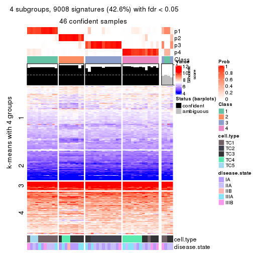</p>

</div>
<div id='tab-MAD-NMF-get-signatures-no-scale-4'>
<pre><code class="r">get_signatures(res, k = 5, scale_rows = FALSE)
</code></pre>

<p>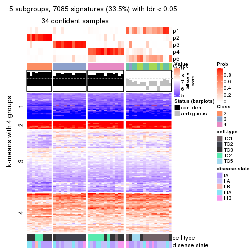</p>

</div>
<div id='tab-MAD-NMF-get-signatures-no-scale-5'>
<pre><code class="r">get_signatures(res, k = 6, scale_rows = FALSE)
</code></pre>

<p>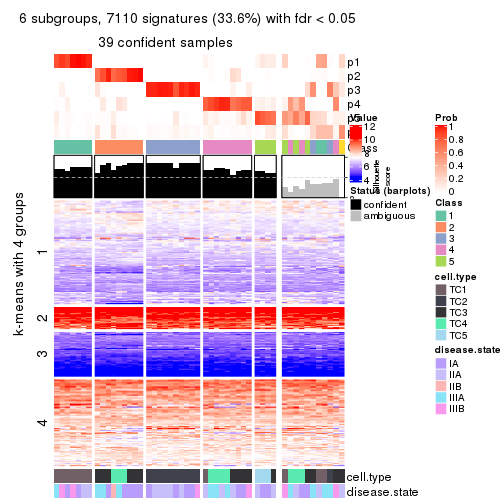</p>

</div>
</div>


Compare the overlap of signatures from different k:

```r
compare_signatures(res)
```

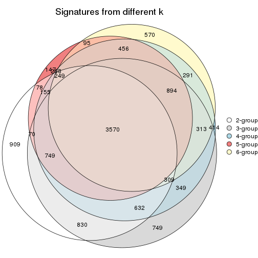

`get_signature()` returns a data frame invisibly. TO get the list of signatures, the function
call should be assigned to a variable explicitly. In following code, if `plot` argument is set
to `FALSE`, no heatmap is plotted while only the differential analysis is performed.

```r
# code only for demonstration
tb = get_signature(res, k = ..., plot = FALSE)
```

An example of the output of `tb` is:

```
#>   which_row         fdr    mean_1    mean_2 scaled_mean_1 scaled_mean_2 km
#> 1        38 0.042760348  8.373488  9.131774    -0.5533452     0.5164555  1
#> 2        40 0.018707592  7.106213  8.469186    -0.6173731     0.5762149  1
#> 3        55 0.019134737 10.221463 11.207825    -0.6159697     0.5749050  1
#> 4        59 0.006059896  5.921854  7.869574    -0.6899429     0.6439467  1
#> 5        60 0.018055526  8.928898 10.211722    -0.6204761     0.5791110  1
#> 6        98 0.009384629 15.714769 14.887706     0.6635654    -0.6193277  2
...
```

The columns in `tb` are:

1. `which_row`: row indices corresponding to the input matrix.
2. `fdr`: FDR for the differential test. 
3. `mean_x`: The mean value in group x.
4. `scaled_mean_x`: The mean value in group x after rows are scaled.
5. `km`: Row groups if k-means clustering is applied to rows.


UMAP plot which shows how samples are separated.


<script>
$( function() {
	$( '#tabs-MAD-NMF-dimension-reduction' ).tabs();
} );
</script>
<div id='tabs-MAD-NMF-dimension-reduction'>
<ul>
<li><a href='#tab-MAD-NMF-dimension-reduction-1'>k = 2</a></li>
<li><a href='#tab-MAD-NMF-dimension-reduction-2'>k = 3</a></li>
<li><a href='#tab-MAD-NMF-dimension-reduction-3'>k = 4</a></li>
<li><a href='#tab-MAD-NMF-dimension-reduction-4'>k = 5</a></li>
<li><a href='#tab-MAD-NMF-dimension-reduction-5'>k = 6</a></li>
</ul>
<div id='tab-MAD-NMF-dimension-reduction-1'>
<pre><code class="r">dimension_reduction(res, k = 2, method = &quot;UMAP&quot;)
</code></pre>

<p>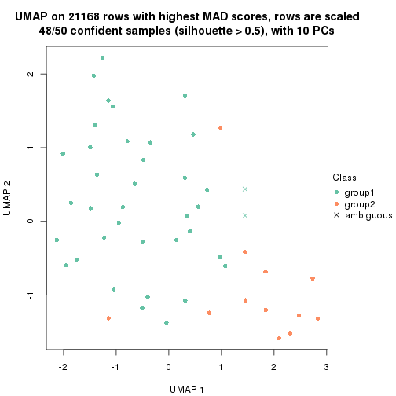</p>

</div>
<div id='tab-MAD-NMF-dimension-reduction-2'>
<pre><code class="r">dimension_reduction(res, k = 3, method = &quot;UMAP&quot;)
</code></pre>

<p>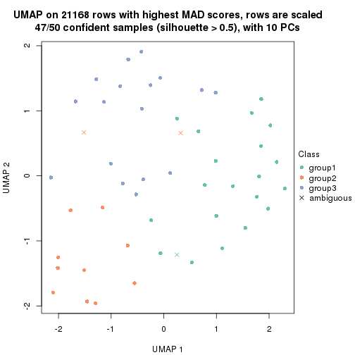</p>

</div>
<div id='tab-MAD-NMF-dimension-reduction-3'>
<pre><code class="r">dimension_reduction(res, k = 4, method = &quot;UMAP&quot;)
</code></pre>

<p>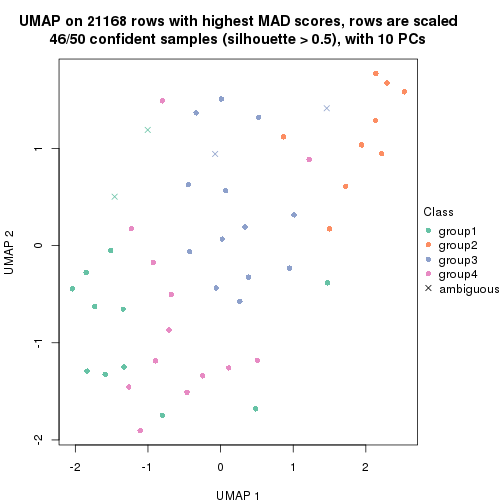</p>

</div>
<div id='tab-MAD-NMF-dimension-reduction-4'>
<pre><code class="r">dimension_reduction(res, k = 5, method = &quot;UMAP&quot;)
</code></pre>

<p>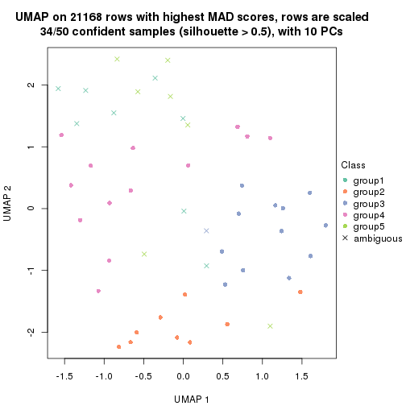</p>

</div>
<div id='tab-MAD-NMF-dimension-reduction-5'>
<pre><code class="r">dimension_reduction(res, k = 6, method = &quot;UMAP&quot;)
</code></pre>

<p>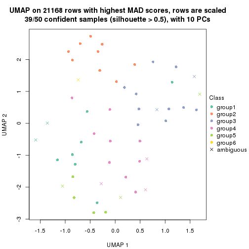</p>

</div>
</div>


Following heatmap shows how subgroups are split when increasing `k`:

```r
collect_classes(res)
```

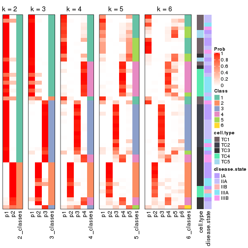


Test correlation between subgroups and known annotations. If the known
annotation is numeric, one-way ANOVA test is applied, and if the known
annotation is discrete, chi-squared contingency table test is applied.

```r
test_to_known_factors(res)
```

```
#>          n cell.type(p) disease.state(p) k
#> MAD:NMF 48     1.48e-03            0.138 2
#> MAD:NMF 47     2.45e-07            0.199 3
#> MAD:NMF 46     4.95e-12            0.422 4
#> MAD:NMF 34     1.04e-05            0.263 5
#> MAD:NMF 39     2.49e-14            0.323 6
```


If matrix rows can be associated to genes, consider to use `functional_enrichment(res,
...)` to perform function enrichment for the signature genes. See [this vignette](http://bioconductor.org/packages/devel/bioc/vignettes/cola/inst/doc/functional_enrichment.html) for more detailed explanations.


 

---------------------------------------------------


### ATC:hclust


The object with results only for a single top-value method and a single partition method 
can be extracted as:

```r
res = res_list["ATC", "hclust"]
# you can also extract it by
# res = res_list["ATC:hclust"]
```

A summary of `res` and all the functions that can be applied to it:

```r
res
```

```
#> A 'ConsensusPartition' object with k = 2, 3, 4, 5, 6.
#>   On a matrix with 21168 rows and 50 columns.
#>   Top rows (1000, 2000, 3000, 4000, 5000) are extracted by 'ATC' method.
#>   Subgroups are detected by 'hclust' method.
#>   Performed in total 1250 partitions by row resampling.
#>   Best k for subgroups seems to be 5.
#> 
#> Following methods can be applied to this 'ConsensusPartition' object:
#>  [1] "cola_report"             "collect_classes"         "collect_plots"          
#>  [4] "collect_stats"           "colnames"                "compare_signatures"     
#>  [7] "consensus_heatmap"       "dimension_reduction"     "functional_enrichment"  
#> [10] "get_anno_col"            "get_anno"                "get_classes"            
#> [13] "get_consensus"           "get_matrix"              "get_membership"         
#> [16] "get_param"               "get_signatures"          "get_stats"              
#> [19] "is_best_k"               "is_stable_k"             "membership_heatmap"     
#> [22] "ncol"                    "nrow"                    "plot_ecdf"              
#> [25] "rownames"                "select_partition_number" "show"                   
#> [28] "suggest_best_k"          "test_to_known_factors"
```

`collect_plots()` function collects all the plots made from `res` for all `k` (number of partitions)
into one single page to provide an easy and fast comparison between different `k`.

```r
collect_plots(res)
```

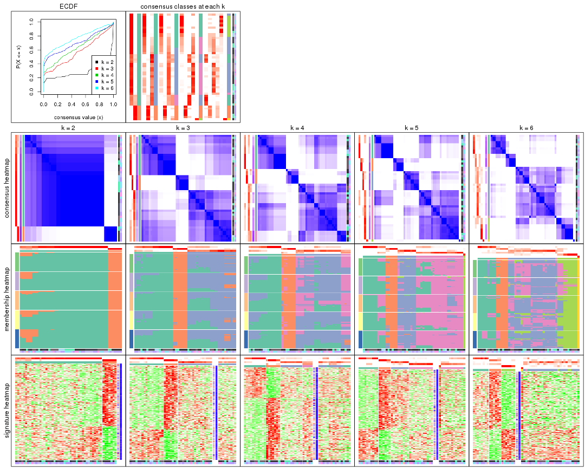

The plots are:

- The first row: a plot of the ECDF (empirical cumulative distribution
  function) curves of the consensus matrix for each `k` and the heatmap of
  predicted classes for each `k`.
- The second row: heatmaps of the consensus matrix for each `k`.
- The third row: heatmaps of the membership matrix for each `k`.
- The fouth row: heatmaps of the signatures for each `k`.

All the plots in panels can be made by individual functions and they are
plotted later in this section.

`select_partition_number()` produces several plots showing different
statistics for choosing "optimized" `k`. There are following statistics:

- ECDF curves of the consensus matrix for each `k`;
- 1-PAC. [The PAC
  score](https://en.wikipedia.org/wiki/Consensus_clustering#Over-interpretation_potential_of_consensus_clustering)
  measures the proportion of the ambiguous subgrouping.
- Mean silhouette score.
- Concordance. The mean probability of fiting the consensus class ids in all
  partitions.
- Area increased. Denote $A_k$ as the area under the ECDF curve for current
  `k`, the area increased is defined as $A_k - A_{k-1}$.
- Rand index. The percent of pairs of samples that are both in a same cluster
  or both are not in a same cluster in the partition of k and k-1.
- Jaccard index. The ratio of pairs of samples are both in a same cluster in
  the partition of k and k-1 and the pairs of samples are both in a same
  cluster in the partition k or k-1.

The detailed explanations of these statistics can be found in [the _cola_
vignette](http://bioconductor.org/packages/devel/bioc/vignettes/cola/inst/doc/cola.html#toc_13).

Generally speaking, lower PAC score, higher mean silhouette score or higher
concordance corresponds to better partition. Rand index and Jaccard index
measure how similar the current partition is compared to partition with `k-1`.
If they are too similar, we won't accept `k` is better than `k-1`.

```r
select_partition_number(res)
```

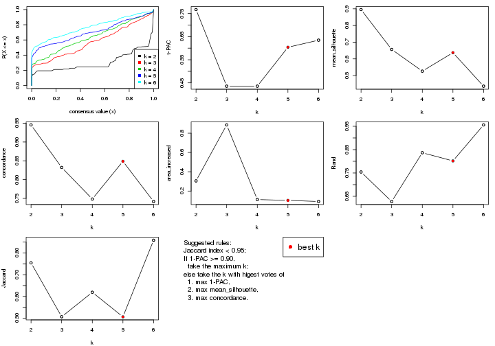

The numeric values for all these statistics can be obtained by `get_stats()`.

```r
get_stats(res)
```

```
#>   k 1-PAC mean_silhouette concordance area_increased  Rand Jaccard
#> 2 2 0.767           0.895       0.945         0.3053 0.754   0.754
#> 3 3 0.436           0.657       0.832         0.8859 0.628   0.506
#> 4 4 0.436           0.527       0.748         0.1119 0.837   0.619
#> 5 5 0.604           0.637       0.849         0.1033 0.802   0.506
#> 6 6 0.635           0.437       0.742         0.0915 0.956   0.858
```

`suggest_best_k()` suggests the best $k$ based on these statistics. The rules are as follows:

- All $k$ with Jaccard index larger than 0.95 are removed because increasing
  $k$ does not provide enough extra information. If all $k$ are removed, it is
  marked as no subgroup is detected.
- For all $k$ with 1-PAC score larger than 0.9, the maximal $k$ is taken as
  the best $k$, and other $k$ are marked as optional $k$.
- If it does not fit the second rule. The $k$ with the maximal vote of the
  highest 1-PAC score, highest mean silhouette, and highest concordance is
  taken as the best $k$.

```r
suggest_best_k(res)
```

```
#> [1] 5
```


Following shows the table of the partitions (You need to click the **show/hide
code output** link to see it). The membership matrix (columns with name `p*`)
is inferred by
[`clue::cl_consensus()`](https://www.rdocumentation.org/link/cl_consensus?package=clue)
function with the `SE` method. Basically the value in the membership matrix
represents the probability to belong to a certain group. The finall class
label for an item is determined with the group with highest probability it
belongs to.

In `get_classes()` function, the entropy is calculated from the membership
matrix and the silhouette score is calculated from the consensus matrix.


<script>
$( function() {
	$( '#tabs-ATC-hclust-get-classes' ).tabs();
} );
</script>
<div id='tabs-ATC-hclust-get-classes'>
<ul>
<li><a href='#tab-ATC-hclust-get-classes-1'>k = 2</a></li>
<li><a href='#tab-ATC-hclust-get-classes-2'>k = 3</a></li>
<li><a href='#tab-ATC-hclust-get-classes-3'>k = 4</a></li>
<li><a href='#tab-ATC-hclust-get-classes-4'>k = 5</a></li>
<li><a href='#tab-ATC-hclust-get-classes-5'>k = 6</a></li>
</ul>

<div id='tab-ATC-hclust-get-classes-1'>
<p><a id='tab-ATC-hclust-get-classes-1-a' style='color:#0366d6' href='#'>show/hide code output</a></p>
<pre><code class="r">cbind(get_classes(res, k = 2), get_membership(res, k = 2))
</code></pre>

<pre><code>#&gt;          class entropy silhouette    p1    p2
#&gt; GSM63448     1  0.6712      0.809 0.824 0.176
#&gt; GSM63449     1  0.0376      0.933 0.996 0.004
#&gt; GSM63423     1  0.0376      0.933 0.996 0.004
#&gt; GSM63425     1  0.0000      0.934 1.000 0.000
#&gt; GSM63437     1  0.2423      0.918 0.960 0.040
#&gt; GSM63453     1  0.0000      0.934 1.000 0.000
#&gt; GSM63431     1  0.0000      0.934 1.000 0.000
#&gt; GSM63450     1  0.0000      0.934 1.000 0.000
#&gt; GSM63428     1  0.2423      0.918 0.960 0.040
#&gt; GSM63432     1  0.6438      0.820 0.836 0.164
#&gt; GSM63458     1  0.0000      0.934 1.000 0.000
#&gt; GSM63434     1  0.9393      0.565 0.644 0.356
#&gt; GSM63435     1  0.0000      0.934 1.000 0.000
#&gt; GSM63442     1  0.0000      0.934 1.000 0.000
#&gt; GSM63451     1  0.1633      0.926 0.976 0.024
#&gt; GSM63422     1  0.0000      0.934 1.000 0.000
#&gt; GSM63438     1  0.0000      0.934 1.000 0.000
#&gt; GSM63439     1  0.8207      0.718 0.744 0.256
#&gt; GSM63461     1  0.0000      0.934 1.000 0.000
#&gt; GSM63463     1  0.0000      0.934 1.000 0.000
#&gt; GSM63430     1  0.6712      0.809 0.824 0.176
#&gt; GSM63446     1  0.1633      0.926 0.976 0.024
#&gt; GSM63429     1  0.0000      0.934 1.000 0.000
#&gt; GSM63445     1  0.0000      0.934 1.000 0.000
#&gt; GSM63447     1  0.8909      0.646 0.692 0.308
#&gt; GSM63459     2  0.0000      0.998 0.000 1.000
#&gt; GSM63464     2  0.0000      0.998 0.000 1.000
#&gt; GSM63469     2  0.0000      0.998 0.000 1.000
#&gt; GSM63470     2  0.0000      0.998 0.000 1.000
#&gt; GSM63436     1  0.2236      0.920 0.964 0.036
#&gt; GSM63443     2  0.0000      0.998 0.000 1.000
#&gt; GSM63465     1  0.8909      0.646 0.692 0.308
#&gt; GSM63444     1  0.9393      0.565 0.644 0.356
#&gt; GSM63456     1  0.1633      0.926 0.976 0.024
#&gt; GSM63462     1  0.0000      0.934 1.000 0.000
#&gt; GSM63424     1  0.0000      0.934 1.000 0.000
#&gt; GSM63440     1  0.0000      0.934 1.000 0.000
#&gt; GSM63433     1  0.0000      0.934 1.000 0.000
#&gt; GSM63466     2  0.0000      0.998 0.000 1.000
#&gt; GSM63426     1  0.2236      0.920 0.964 0.036
#&gt; GSM63468     1  0.0000      0.934 1.000 0.000
#&gt; GSM63452     1  0.9460      0.549 0.636 0.364
#&gt; GSM63441     1  0.1633      0.926 0.976 0.024
#&gt; GSM63454     1  0.0000      0.934 1.000 0.000
#&gt; GSM63455     1  0.0000      0.934 1.000 0.000
#&gt; GSM63460     2  0.0672      0.991 0.008 0.992
#&gt; GSM63467     1  0.0000      0.934 1.000 0.000
#&gt; GSM63421     1  0.0000      0.934 1.000 0.000
#&gt; GSM63427     1  0.0000      0.934 1.000 0.000
#&gt; GSM63457     1  0.0000      0.934 1.000 0.000
</code></pre>

<script>
$('#tab-ATC-hclust-get-classes-1-a').parent().next().next().hide();
$('#tab-ATC-hclust-get-classes-1-a').click(function(){
  $('#tab-ATC-hclust-get-classes-1-a').parent().next().next().toggle();
  return(false);
});
</script>
</div>

<div id='tab-ATC-hclust-get-classes-2'>
<p><a id='tab-ATC-hclust-get-classes-2-a' style='color:#0366d6' href='#'>show/hide code output</a></p>
<pre><code class="r">cbind(get_classes(res, k = 3), get_membership(res, k = 3))
</code></pre>

<pre><code>#&gt;          class entropy silhouette    p1    p2    p3
#&gt; GSM63448     3  0.0000      0.647 0.000 0.000 1.000
#&gt; GSM63449     3  0.6154      0.454 0.408 0.000 0.592
#&gt; GSM63423     3  0.6267      0.345 0.452 0.000 0.548
#&gt; GSM63425     1  0.0000      0.801 1.000 0.000 0.000
#&gt; GSM63437     3  0.3879      0.660 0.152 0.000 0.848
#&gt; GSM63453     1  0.0000      0.801 1.000 0.000 0.000
#&gt; GSM63431     1  0.0000      0.801 1.000 0.000 0.000
#&gt; GSM63450     1  0.0000      0.801 1.000 0.000 0.000
#&gt; GSM63428     3  0.3879      0.660 0.152 0.000 0.848
#&gt; GSM63432     3  0.0592      0.650 0.012 0.000 0.988
#&gt; GSM63458     1  0.0000      0.801 1.000 0.000 0.000
#&gt; GSM63434     3  0.4291      0.520 0.000 0.180 0.820
#&gt; GSM63435     1  0.1289      0.804 0.968 0.000 0.032
#&gt; GSM63442     1  0.4504      0.723 0.804 0.000 0.196
#&gt; GSM63451     3  0.5948      0.522 0.360 0.000 0.640
#&gt; GSM63422     1  0.0000      0.801 1.000 0.000 0.000
#&gt; GSM63438     1  0.5733      0.498 0.676 0.000 0.324
#&gt; GSM63439     3  0.2537      0.608 0.000 0.080 0.920
#&gt; GSM63461     1  0.4702      0.705 0.788 0.000 0.212
#&gt; GSM63463     1  0.4702      0.705 0.788 0.000 0.212
#&gt; GSM63430     3  0.0000      0.647 0.000 0.000 1.000
#&gt; GSM63446     3  0.5948      0.522 0.360 0.000 0.640
#&gt; GSM63429     1  0.5706      0.509 0.680 0.000 0.320
#&gt; GSM63445     1  0.6295     -0.113 0.528 0.000 0.472
#&gt; GSM63447     3  0.3551      0.566 0.000 0.132 0.868
#&gt; GSM63459     2  0.0000      0.979 0.000 1.000 0.000
#&gt; GSM63464     2  0.2066      0.951 0.000 0.940 0.060
#&gt; GSM63469     2  0.0000      0.979 0.000 1.000 0.000
#&gt; GSM63470     2  0.0000      0.979 0.000 1.000 0.000
#&gt; GSM63436     3  0.3686      0.662 0.140 0.000 0.860
#&gt; GSM63443     2  0.0000      0.979 0.000 1.000 0.000
#&gt; GSM63465     3  0.3551      0.566 0.000 0.132 0.868
#&gt; GSM63444     3  0.4291      0.520 0.000 0.180 0.820
#&gt; GSM63456     3  0.5948      0.522 0.360 0.000 0.640
#&gt; GSM63462     1  0.3192      0.775 0.888 0.000 0.112
#&gt; GSM63424     3  0.6180      0.430 0.416 0.000 0.584
#&gt; GSM63440     3  0.6180      0.430 0.416 0.000 0.584
#&gt; GSM63433     3  0.6215      0.411 0.428 0.000 0.572
#&gt; GSM63466     2  0.0000      0.979 0.000 1.000 0.000
#&gt; GSM63426     3  0.3686      0.662 0.140 0.000 0.860
#&gt; GSM63468     1  0.4702      0.705 0.788 0.000 0.212
#&gt; GSM63452     3  0.4399      0.509 0.000 0.188 0.812
#&gt; GSM63441     3  0.5254      0.603 0.264 0.000 0.736
#&gt; GSM63454     3  0.6215      0.413 0.428 0.000 0.572
#&gt; GSM63455     1  0.0000      0.801 1.000 0.000 0.000
#&gt; GSM63460     2  0.2625      0.931 0.000 0.916 0.084
#&gt; GSM63467     1  0.5497      0.566 0.708 0.000 0.292
#&gt; GSM63421     1  0.1163      0.804 0.972 0.000 0.028
#&gt; GSM63427     3  0.6192      0.430 0.420 0.000 0.580
#&gt; GSM63457     1  0.1163      0.804 0.972 0.000 0.028
</code></pre>

<script>
$('#tab-ATC-hclust-get-classes-2-a').parent().next().next().hide();
$('#tab-ATC-hclust-get-classes-2-a').click(function(){
  $('#tab-ATC-hclust-get-classes-2-a').parent().next().next().toggle();
  return(false);
});
</script>
</div>

<div id='tab-ATC-hclust-get-classes-3'>
<p><a id='tab-ATC-hclust-get-classes-3-a' style='color:#0366d6' href='#'>show/hide code output</a></p>
<pre><code class="r">cbind(get_classes(res, k = 4), get_membership(res, k = 4))
</code></pre>

<pre><code>#&gt;          class entropy silhouette    p1    p2    p3    p4
#&gt; GSM63448     3   0.480     -0.621 0.000 0.000 0.616 0.384
#&gt; GSM63449     3   0.379      0.634 0.200 0.000 0.796 0.004
#&gt; GSM63423     3   0.419      0.585 0.244 0.000 0.752 0.004
#&gt; GSM63425     1   0.000      0.728 1.000 0.000 0.000 0.000
#&gt; GSM63437     3   0.359      0.413 0.040 0.000 0.856 0.104
#&gt; GSM63453     1   0.000      0.728 1.000 0.000 0.000 0.000
#&gt; GSM63431     1   0.000      0.728 1.000 0.000 0.000 0.000
#&gt; GSM63450     1   0.000      0.728 1.000 0.000 0.000 0.000
#&gt; GSM63428     3   0.359      0.413 0.040 0.000 0.856 0.104
#&gt; GSM63432     3   0.448     -0.437 0.000 0.000 0.688 0.312
#&gt; GSM63458     1   0.000      0.728 1.000 0.000 0.000 0.000
#&gt; GSM63434     4   0.609      0.954 0.000 0.048 0.412 0.540
#&gt; GSM63435     1   0.353      0.707 0.808 0.000 0.192 0.000
#&gt; GSM63442     1   0.484      0.481 0.604 0.000 0.396 0.000
#&gt; GSM63451     3   0.302      0.655 0.148 0.000 0.852 0.000
#&gt; GSM63422     1   0.000      0.728 1.000 0.000 0.000 0.000
#&gt; GSM63438     3   0.499     -0.138 0.472 0.000 0.528 0.000
#&gt; GSM63439     3   0.499     -0.821 0.000 0.000 0.532 0.468
#&gt; GSM63461     1   0.491      0.441 0.580 0.000 0.420 0.000
#&gt; GSM63463     1   0.491      0.441 0.580 0.000 0.420 0.000
#&gt; GSM63430     3   0.480     -0.621 0.000 0.000 0.616 0.384
#&gt; GSM63446     3   0.302      0.655 0.148 0.000 0.852 0.000
#&gt; GSM63429     3   0.499     -0.152 0.476 0.000 0.524 0.000
#&gt; GSM63445     3   0.450      0.422 0.316 0.000 0.684 0.000
#&gt; GSM63447     4   0.498      0.930 0.000 0.000 0.460 0.540
#&gt; GSM63459     2   0.000      0.881 0.000 1.000 0.000 0.000
#&gt; GSM63464     2   0.353      0.789 0.000 0.808 0.000 0.192
#&gt; GSM63469     2   0.000      0.881 0.000 1.000 0.000 0.000
#&gt; GSM63470     2   0.000      0.881 0.000 1.000 0.000 0.000
#&gt; GSM63436     3   0.373      0.375 0.036 0.000 0.844 0.120
#&gt; GSM63443     2   0.498      0.627 0.000 0.540 0.000 0.460
#&gt; GSM63465     4   0.498      0.930 0.000 0.000 0.460 0.540
#&gt; GSM63444     4   0.609      0.954 0.000 0.048 0.412 0.540
#&gt; GSM63456     3   0.302      0.655 0.148 0.000 0.852 0.000
#&gt; GSM63462     1   0.441      0.616 0.700 0.000 0.300 0.000
#&gt; GSM63424     3   0.365      0.626 0.204 0.000 0.796 0.000
#&gt; GSM63440     3   0.365      0.626 0.204 0.000 0.796 0.000
#&gt; GSM63433     3   0.376      0.617 0.216 0.000 0.784 0.000
#&gt; GSM63466     2   0.000      0.881 0.000 1.000 0.000 0.000
#&gt; GSM63426     3   0.373      0.375 0.036 0.000 0.844 0.120
#&gt; GSM63468     1   0.491      0.441 0.580 0.000 0.420 0.000
#&gt; GSM63452     4   0.621      0.943 0.000 0.056 0.404 0.540
#&gt; GSM63441     3   0.308      0.573 0.084 0.000 0.884 0.032
#&gt; GSM63454     3   0.376      0.618 0.216 0.000 0.784 0.000
#&gt; GSM63455     1   0.000      0.728 1.000 0.000 0.000 0.000
#&gt; GSM63460     2   0.376      0.767 0.000 0.784 0.000 0.216
#&gt; GSM63467     1   0.500      0.193 0.500 0.000 0.500 0.000
#&gt; GSM63421     1   0.349      0.709 0.812 0.000 0.188 0.000
#&gt; GSM63427     3   0.391      0.624 0.212 0.000 0.784 0.004
#&gt; GSM63457     1   0.349      0.709 0.812 0.000 0.188 0.000
</code></pre>

<script>
$('#tab-ATC-hclust-get-classes-3-a').parent().next().next().hide();
$('#tab-ATC-hclust-get-classes-3-a').click(function(){
  $('#tab-ATC-hclust-get-classes-3-a').parent().next().next().toggle();
  return(false);
});
</script>
</div>

<div id='tab-ATC-hclust-get-classes-4'>
<p><a id='tab-ATC-hclust-get-classes-4-a' style='color:#0366d6' href='#'>show/hide code output</a></p>
<pre><code class="r">cbind(get_classes(res, k = 5), get_membership(res, k = 5))
</code></pre>

<pre><code>#&gt;          class entropy silhouette    p1    p2    p3    p4    p5
#&gt; GSM63448     3  0.3577     0.7854 0.000 0.000 0.808 0.160 0.032
#&gt; GSM63449     4  0.1331     0.7355 0.040 0.000 0.008 0.952 0.000
#&gt; GSM63423     4  0.2237     0.7250 0.084 0.000 0.008 0.904 0.004
#&gt; GSM63425     1  0.0000     0.7648 1.000 0.000 0.000 0.000 0.000
#&gt; GSM63437     4  0.3878     0.4880 0.000 0.000 0.236 0.748 0.016
#&gt; GSM63453     1  0.0000     0.7648 1.000 0.000 0.000 0.000 0.000
#&gt; GSM63431     1  0.0000     0.7648 1.000 0.000 0.000 0.000 0.000
#&gt; GSM63450     1  0.0000     0.7648 1.000 0.000 0.000 0.000 0.000
#&gt; GSM63428     4  0.3779     0.4928 0.000 0.000 0.236 0.752 0.012
#&gt; GSM63432     3  0.4623     0.6042 0.000 0.000 0.664 0.304 0.032
#&gt; GSM63458     1  0.0000     0.7648 1.000 0.000 0.000 0.000 0.000
#&gt; GSM63434     3  0.0566     0.8157 0.000 0.012 0.984 0.000 0.004
#&gt; GSM63435     1  0.4066     0.5194 0.672 0.000 0.000 0.324 0.004
#&gt; GSM63442     4  0.4517     0.1791 0.436 0.000 0.000 0.556 0.008
#&gt; GSM63451     4  0.0671     0.7272 0.000 0.000 0.016 0.980 0.004
#&gt; GSM63422     1  0.0000     0.7648 1.000 0.000 0.000 0.000 0.000
#&gt; GSM63438     4  0.4193     0.4923 0.304 0.000 0.000 0.684 0.012
#&gt; GSM63439     3  0.2233     0.8286 0.000 0.000 0.892 0.104 0.004
#&gt; GSM63461     4  0.4359     0.2727 0.412 0.000 0.000 0.584 0.004
#&gt; GSM63463     4  0.4359     0.2727 0.412 0.000 0.000 0.584 0.004
#&gt; GSM63430     3  0.3656     0.7789 0.000 0.000 0.800 0.168 0.032
#&gt; GSM63446     4  0.0671     0.7272 0.000 0.000 0.016 0.980 0.004
#&gt; GSM63429     4  0.4213     0.4858 0.308 0.000 0.000 0.680 0.012
#&gt; GSM63445     4  0.2763     0.6747 0.148 0.000 0.000 0.848 0.004
#&gt; GSM63447     3  0.0963     0.8415 0.000 0.000 0.964 0.036 0.000
#&gt; GSM63459     2  0.0162     0.8667 0.000 0.996 0.000 0.000 0.004
#&gt; GSM63464     2  0.3336     0.7300 0.000 0.772 0.228 0.000 0.000
#&gt; GSM63469     2  0.0162     0.8667 0.000 0.996 0.000 0.000 0.004
#&gt; GSM63470     2  0.0000     0.8658 0.000 1.000 0.000 0.000 0.000
#&gt; GSM63436     4  0.4498     0.3945 0.000 0.000 0.280 0.688 0.032
#&gt; GSM63443     5  0.1197     0.0000 0.000 0.048 0.000 0.000 0.952
#&gt; GSM63465     3  0.0963     0.8415 0.000 0.000 0.964 0.036 0.000
#&gt; GSM63444     3  0.0807     0.8114 0.000 0.012 0.976 0.000 0.012
#&gt; GSM63456     4  0.0671     0.7272 0.000 0.000 0.016 0.980 0.004
#&gt; GSM63462     1  0.4437     0.0783 0.532 0.000 0.000 0.464 0.004
#&gt; GSM63424     4  0.1043     0.7359 0.040 0.000 0.000 0.960 0.000
#&gt; GSM63440     4  0.1043     0.7359 0.040 0.000 0.000 0.960 0.000
#&gt; GSM63433     4  0.1502     0.7342 0.056 0.000 0.004 0.940 0.000
#&gt; GSM63466     2  0.0162     0.8667 0.000 0.996 0.000 0.000 0.004
#&gt; GSM63426     4  0.4498     0.3945 0.000 0.000 0.280 0.688 0.032
#&gt; GSM63468     4  0.4359     0.2727 0.412 0.000 0.000 0.584 0.004
#&gt; GSM63452     3  0.1012     0.8056 0.000 0.020 0.968 0.000 0.012
#&gt; GSM63441     4  0.2548     0.6617 0.004 0.000 0.116 0.876 0.004
#&gt; GSM63454     4  0.1697     0.7350 0.060 0.000 0.008 0.932 0.000
#&gt; GSM63455     1  0.0000     0.7648 1.000 0.000 0.000 0.000 0.000
#&gt; GSM63460     2  0.3807     0.7074 0.000 0.748 0.240 0.000 0.012
#&gt; GSM63467     4  0.4101     0.4414 0.332 0.000 0.000 0.664 0.004
#&gt; GSM63421     1  0.4047     0.5274 0.676 0.000 0.000 0.320 0.004
#&gt; GSM63427     4  0.1557     0.7357 0.052 0.000 0.008 0.940 0.000
#&gt; GSM63457     1  0.4047     0.5274 0.676 0.000 0.000 0.320 0.004
</code></pre>

<script>
$('#tab-ATC-hclust-get-classes-4-a').parent().next().next().hide();
$('#tab-ATC-hclust-get-classes-4-a').click(function(){
  $('#tab-ATC-hclust-get-classes-4-a').parent().next().next().toggle();
  return(false);
});
</script>
</div>

<div id='tab-ATC-hclust-get-classes-5'>
<p><a id='tab-ATC-hclust-get-classes-5-a' style='color:#0366d6' href='#'>show/hide code output</a></p>
<pre><code class="r">cbind(get_classes(res, k = 6), get_membership(res, k = 6))
</code></pre>

<pre><code>#&gt;          class entropy silhouette    p1    p2    p3    p4    p5    p6
#&gt; GSM63448     1  0.3138     0.7608 0.832 0.000 0.060 0.108 0.000 0.000
#&gt; GSM63449     3  0.1625     0.3978 0.000 0.000 0.928 0.060 0.012 0.000
#&gt; GSM63423     3  0.2867     0.4193 0.000 0.040 0.872 0.064 0.024 0.000
#&gt; GSM63425     5  0.0000     0.6509 0.000 0.000 0.000 0.000 1.000 0.000
#&gt; GSM63437     3  0.5029    -0.4839 0.072 0.000 0.484 0.444 0.000 0.000
#&gt; GSM63453     5  0.2340     0.6338 0.000 0.148 0.000 0.000 0.852 0.000
#&gt; GSM63431     5  0.0000     0.6509 0.000 0.000 0.000 0.000 1.000 0.000
#&gt; GSM63450     5  0.2340     0.6338 0.000 0.148 0.000 0.000 0.852 0.000
#&gt; GSM63428     3  0.5002    -0.4903 0.072 0.000 0.516 0.412 0.000 0.000
#&gt; GSM63432     1  0.4828     0.4275 0.668 0.000 0.176 0.156 0.000 0.000
#&gt; GSM63458     5  0.0000     0.6509 0.000 0.000 0.000 0.000 1.000 0.000
#&gt; GSM63434     1  0.1663     0.8082 0.912 0.000 0.000 0.088 0.000 0.000
#&gt; GSM63435     5  0.6446     0.1788 0.000 0.292 0.304 0.016 0.388 0.000
#&gt; GSM63442     3  0.7177     0.2687 0.000 0.292 0.416 0.140 0.152 0.000
#&gt; GSM63451     3  0.2871     0.3490 0.004 0.000 0.804 0.192 0.000 0.000
#&gt; GSM63422     5  0.0000     0.6509 0.000 0.000 0.000 0.000 1.000 0.000
#&gt; GSM63438     3  0.6690     0.3770 0.000 0.188 0.532 0.156 0.124 0.000
#&gt; GSM63439     1  0.1643     0.8229 0.924 0.000 0.008 0.068 0.000 0.000
#&gt; GSM63461     3  0.5613     0.3808 0.000 0.292 0.568 0.016 0.124 0.000
#&gt; GSM63463     3  0.5613     0.3808 0.000 0.292 0.568 0.016 0.124 0.000
#&gt; GSM63430     1  0.3252     0.7516 0.824 0.000 0.068 0.108 0.000 0.000
#&gt; GSM63446     3  0.2871     0.3490 0.004 0.000 0.804 0.192 0.000 0.000
#&gt; GSM63429     3  0.6713     0.3765 0.000 0.192 0.528 0.156 0.124 0.000
#&gt; GSM63445     3  0.3278     0.4434 0.000 0.056 0.848 0.032 0.064 0.000
#&gt; GSM63447     1  0.0146     0.8355 0.996 0.000 0.004 0.000 0.000 0.000
#&gt; GSM63459     2  0.3595     0.8616 0.000 0.704 0.000 0.288 0.000 0.008
#&gt; GSM63464     2  0.5731     0.7119 0.156 0.496 0.000 0.344 0.000 0.004
#&gt; GSM63469     2  0.3595     0.8616 0.000 0.704 0.000 0.288 0.000 0.008
#&gt; GSM63470     2  0.3489     0.8608 0.000 0.708 0.000 0.288 0.000 0.004
#&gt; GSM63436     3  0.5703    -1.0000 0.160 0.000 0.420 0.420 0.000 0.000
#&gt; GSM63443     6  0.0000     0.0000 0.000 0.000 0.000 0.000 0.000 1.000
#&gt; GSM63465     1  0.0146     0.8355 0.996 0.000 0.004 0.000 0.000 0.000
#&gt; GSM63444     1  0.1765     0.8035 0.904 0.000 0.000 0.096 0.000 0.000
#&gt; GSM63456     3  0.2871     0.3490 0.004 0.000 0.804 0.192 0.000 0.000
#&gt; GSM63462     3  0.7043     0.0992 0.000 0.292 0.388 0.072 0.248 0.000
#&gt; GSM63424     3  0.2191     0.4307 0.000 0.004 0.876 0.120 0.000 0.000
#&gt; GSM63440     3  0.2191     0.4307 0.000 0.004 0.876 0.120 0.000 0.000
#&gt; GSM63433     3  0.1297     0.4177 0.000 0.000 0.948 0.040 0.012 0.000
#&gt; GSM63466     2  0.3595     0.8616 0.000 0.704 0.000 0.288 0.000 0.008
#&gt; GSM63426     4  0.5703     0.0000 0.160 0.000 0.420 0.420 0.000 0.000
#&gt; GSM63468     3  0.5530     0.3824 0.000 0.292 0.572 0.012 0.124 0.000
#&gt; GSM63452     1  0.1863     0.7973 0.896 0.000 0.000 0.104 0.000 0.000
#&gt; GSM63441     3  0.3694    -0.0408 0.028 0.000 0.740 0.232 0.000 0.000
#&gt; GSM63454     3  0.1616     0.4201 0.000 0.000 0.932 0.048 0.020 0.000
#&gt; GSM63455     5  0.0000     0.6509 0.000 0.000 0.000 0.000 1.000 0.000
#&gt; GSM63460     2  0.5690     0.6892 0.168 0.480 0.000 0.352 0.000 0.000
#&gt; GSM63467     3  0.6127     0.3956 0.000 0.256 0.568 0.088 0.088 0.000
#&gt; GSM63421     5  0.6440     0.1871 0.000 0.292 0.300 0.016 0.392 0.000
#&gt; GSM63427     3  0.1434     0.4105 0.000 0.000 0.940 0.048 0.012 0.000
#&gt; GSM63457     5  0.6440     0.1871 0.000 0.292 0.300 0.016 0.392 0.000
</code></pre>

<script>
$('#tab-ATC-hclust-get-classes-5-a').parent().next().next().hide();
$('#tab-ATC-hclust-get-classes-5-a').click(function(){
  $('#tab-ATC-hclust-get-classes-5-a').parent().next().next().toggle();
  return(false);
});
</script>
</div>
</div>

Heatmaps for the consensus matrix. It visualizes the probability of two
samples to be in a same group.


<script>
$( function() {
	$( '#tabs-ATC-hclust-consensus-heatmap' ).tabs();
} );
</script>
<div id='tabs-ATC-hclust-consensus-heatmap'>
<ul>
<li><a href='#tab-ATC-hclust-consensus-heatmap-1'>k = 2</a></li>
<li><a href='#tab-ATC-hclust-consensus-heatmap-2'>k = 3</a></li>
<li><a href='#tab-ATC-hclust-consensus-heatmap-3'>k = 4</a></li>
<li><a href='#tab-ATC-hclust-consensus-heatmap-4'>k = 5</a></li>
<li><a href='#tab-ATC-hclust-consensus-heatmap-5'>k = 6</a></li>
</ul>
<div id='tab-ATC-hclust-consensus-heatmap-1'>
<pre><code class="r">consensus_heatmap(res, k = 2)
</code></pre>

<p>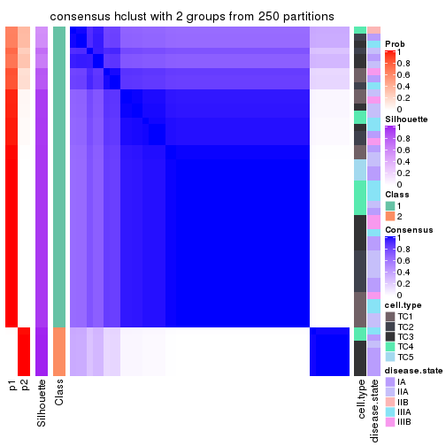</p>

</div>
<div id='tab-ATC-hclust-consensus-heatmap-2'>
<pre><code class="r">consensus_heatmap(res, k = 3)
</code></pre>

<p>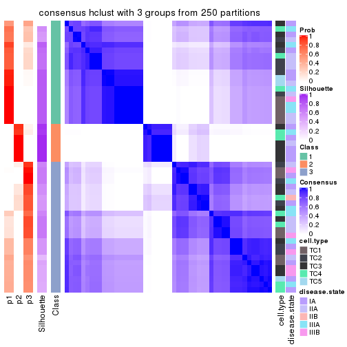</p>

</div>
<div id='tab-ATC-hclust-consensus-heatmap-3'>
<pre><code class="r">consensus_heatmap(res, k = 4)
</code></pre>

<p>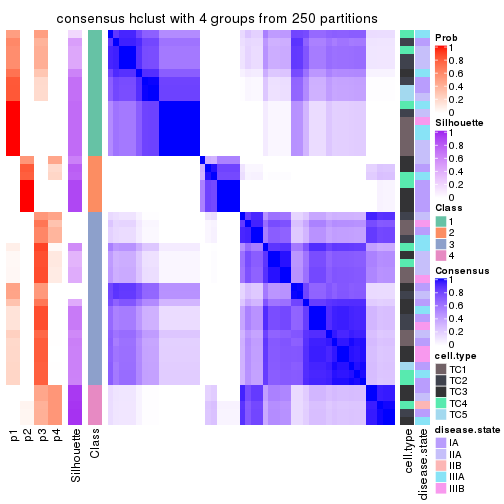</p>

</div>
<div id='tab-ATC-hclust-consensus-heatmap-4'>
<pre><code class="r">consensus_heatmap(res, k = 5)
</code></pre>

<p>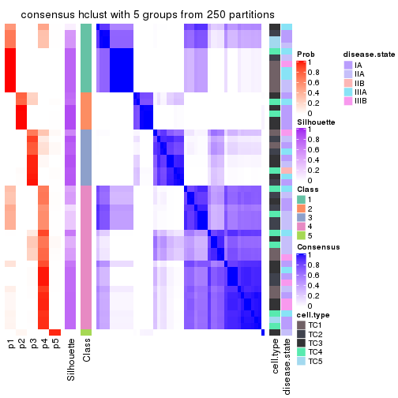</p>

</div>
<div id='tab-ATC-hclust-consensus-heatmap-5'>
<pre><code class="r">consensus_heatmap(res, k = 6)
</code></pre>

<p>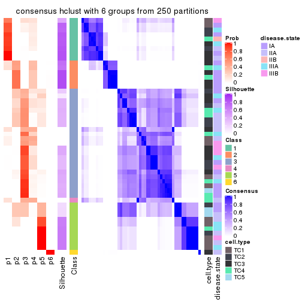</p>

</div>
</div>

Heatmaps for the membership of samples in all partitions to see how consistent they are:


<script>
$( function() {
	$( '#tabs-ATC-hclust-membership-heatmap' ).tabs();
} );
</script>
<div id='tabs-ATC-hclust-membership-heatmap'>
<ul>
<li><a href='#tab-ATC-hclust-membership-heatmap-1'>k = 2</a></li>
<li><a href='#tab-ATC-hclust-membership-heatmap-2'>k = 3</a></li>
<li><a href='#tab-ATC-hclust-membership-heatmap-3'>k = 4</a></li>
<li><a href='#tab-ATC-hclust-membership-heatmap-4'>k = 5</a></li>
<li><a href='#tab-ATC-hclust-membership-heatmap-5'>k = 6</a></li>
</ul>
<div id='tab-ATC-hclust-membership-heatmap-1'>
<pre><code class="r">membership_heatmap(res, k = 2)
</code></pre>

<p>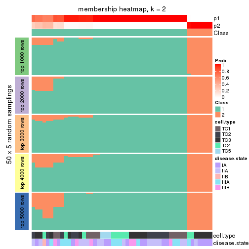</p>

</div>
<div id='tab-ATC-hclust-membership-heatmap-2'>
<pre><code class="r">membership_heatmap(res, k = 3)
</code></pre>

<p>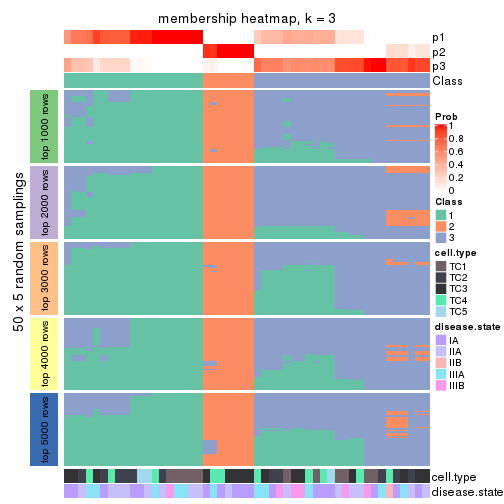</p>

</div>
<div id='tab-ATC-hclust-membership-heatmap-3'>
<pre><code class="r">membership_heatmap(res, k = 4)
</code></pre>

<p>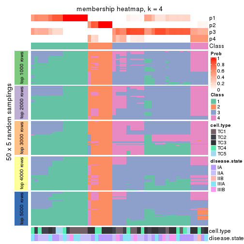</p>

</div>
<div id='tab-ATC-hclust-membership-heatmap-4'>
<pre><code class="r">membership_heatmap(res, k = 5)
</code></pre>

<p>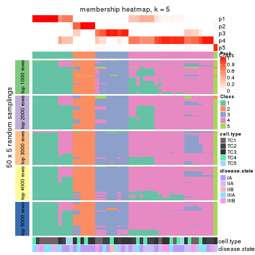</p>

</div>
<div id='tab-ATC-hclust-membership-heatmap-5'>
<pre><code class="r">membership_heatmap(res, k = 6)
</code></pre>

<p>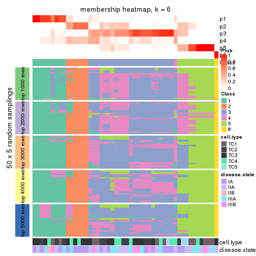</p>

</div>
</div>

As soon as we have had the classes for columns, we can look for signatures
which are significantly different between classes which can be candidate marks
for certain classes. Following are the heatmaps for signatures.


Signature heatmaps where rows are scaled:


<script>
$( function() {
	$( '#tabs-ATC-hclust-get-signatures' ).tabs();
} );
</script>
<div id='tabs-ATC-hclust-get-signatures'>
<ul>
<li><a href='#tab-ATC-hclust-get-signatures-1'>k = 2</a></li>
<li><a href='#tab-ATC-hclust-get-signatures-2'>k = 3</a></li>
<li><a href='#tab-ATC-hclust-get-signatures-3'>k = 4</a></li>
<li><a href='#tab-ATC-hclust-get-signatures-4'>k = 5</a></li>
<li><a href='#tab-ATC-hclust-get-signatures-5'>k = 6</a></li>
</ul>
<div id='tab-ATC-hclust-get-signatures-1'>
<pre><code class="r">get_signatures(res, k = 2)
</code></pre>

<p></p>

</div>
<div id='tab-ATC-hclust-get-signatures-2'>
<pre><code class="r">get_signatures(res, k = 3)
</code></pre>

<p>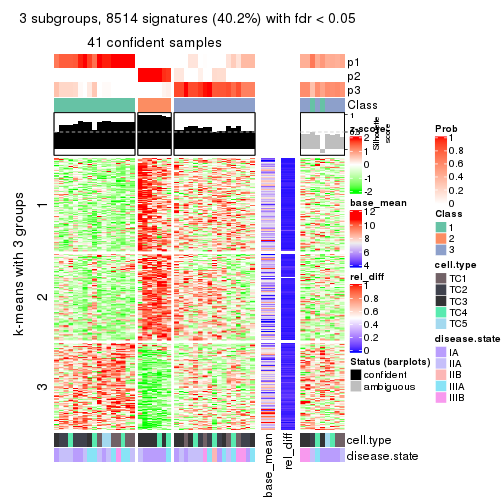</p>

</div>
<div id='tab-ATC-hclust-get-signatures-3'>
<pre><code class="r">get_signatures(res, k = 4)
</code></pre>

<p>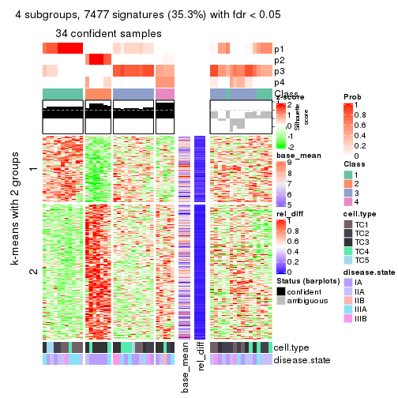</p>

</div>
<div id='tab-ATC-hclust-get-signatures-4'>
<pre><code class="r">get_signatures(res, k = 5)
</code></pre>

<p>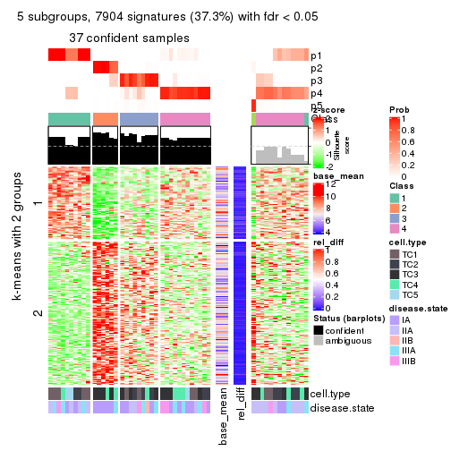</p>

</div>
<div id='tab-ATC-hclust-get-signatures-5'>
<pre><code class="r">get_signatures(res, k = 6)
</code></pre>

<p>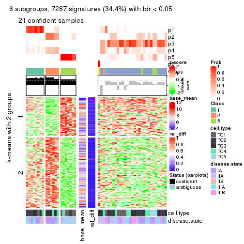</p>

</div>
</div>


Signature heatmaps where rows are not scaled:


<script>
$( function() {
	$( '#tabs-ATC-hclust-get-signatures-no-scale' ).tabs();
} );
</script>
<div id='tabs-ATC-hclust-get-signatures-no-scale'>
<ul>
<li><a href='#tab-ATC-hclust-get-signatures-no-scale-1'>k = 2</a></li>
<li><a href='#tab-ATC-hclust-get-signatures-no-scale-2'>k = 3</a></li>
<li><a href='#tab-ATC-hclust-get-signatures-no-scale-3'>k = 4</a></li>
<li><a href='#tab-ATC-hclust-get-signatures-no-scale-4'>k = 5</a></li>
<li><a href='#tab-ATC-hclust-get-signatures-no-scale-5'>k = 6</a></li>
</ul>
<div id='tab-ATC-hclust-get-signatures-no-scale-1'>
<pre><code class="r">get_signatures(res, k = 2, scale_rows = FALSE)
</code></pre>

<p>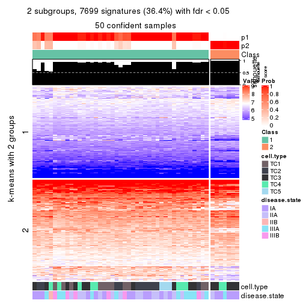</p>

</div>
<div id='tab-ATC-hclust-get-signatures-no-scale-2'>
<pre><code class="r">get_signatures(res, k = 3, scale_rows = FALSE)
</code></pre>

<p>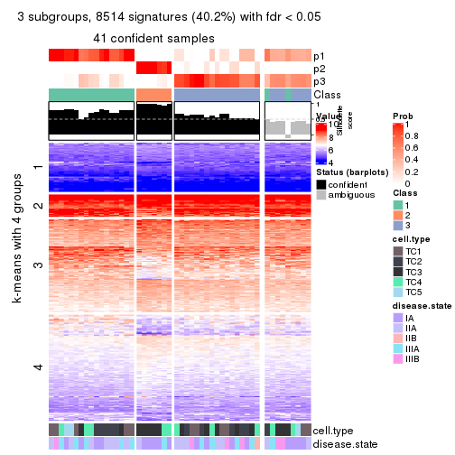</p>

</div>
<div id='tab-ATC-hclust-get-signatures-no-scale-3'>
<pre><code class="r">get_signatures(res, k = 4, scale_rows = FALSE)
</code></pre>

<p>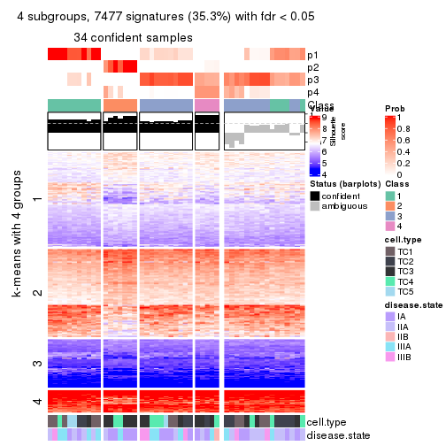</p>

</div>
<div id='tab-ATC-hclust-get-signatures-no-scale-4'>
<pre><code class="r">get_signatures(res, k = 5, scale_rows = FALSE)
</code></pre>

<p>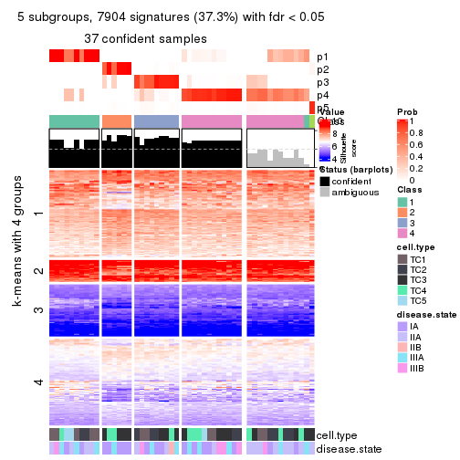</p>

</div>
<div id='tab-ATC-hclust-get-signatures-no-scale-5'>
<pre><code class="r">get_signatures(res, k = 6, scale_rows = FALSE)
</code></pre>

<p>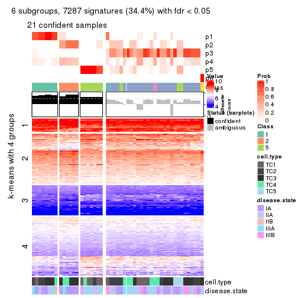</p>

</div>
</div>


Compare the overlap of signatures from different k:

```r
compare_signatures(res)
```

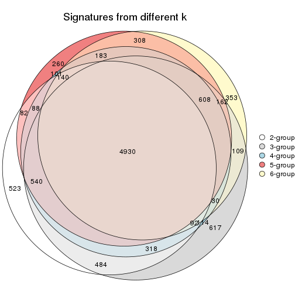

`get_signature()` returns a data frame invisibly. TO get the list of signatures, the function
call should be assigned to a variable explicitly. In following code, if `plot` argument is set
to `FALSE`, no heatmap is plotted while only the differential analysis is performed.

```r
# code only for demonstration
tb = get_signature(res, k = ..., plot = FALSE)
```

An example of the output of `tb` is:

```
#>   which_row         fdr    mean_1    mean_2 scaled_mean_1 scaled_mean_2 km
#> 1        38 0.042760348  8.373488  9.131774    -0.5533452     0.5164555  1
#> 2        40 0.018707592  7.106213  8.469186    -0.6173731     0.5762149  1
#> 3        55 0.019134737 10.221463 11.207825    -0.6159697     0.5749050  1
#> 4        59 0.006059896  5.921854  7.869574    -0.6899429     0.6439467  1
#> 5        60 0.018055526  8.928898 10.211722    -0.6204761     0.5791110  1
#> 6        98 0.009384629 15.714769 14.887706     0.6635654    -0.6193277  2
...
```

The columns in `tb` are:

1. `which_row`: row indices corresponding to the input matrix.
2. `fdr`: FDR for the differential test. 
3. `mean_x`: The mean value in group x.
4. `scaled_mean_x`: The mean value in group x after rows are scaled.
5. `km`: Row groups if k-means clustering is applied to rows.


UMAP plot which shows how samples are separated.


<script>
$( function() {
	$( '#tabs-ATC-hclust-dimension-reduction' ).tabs();
} );
</script>
<div id='tabs-ATC-hclust-dimension-reduction'>
<ul>
<li><a href='#tab-ATC-hclust-dimension-reduction-1'>k = 2</a></li>
<li><a href='#tab-ATC-hclust-dimension-reduction-2'>k = 3</a></li>
<li><a href='#tab-ATC-hclust-dimension-reduction-3'>k = 4</a></li>
<li><a href='#tab-ATC-hclust-dimension-reduction-4'>k = 5</a></li>
<li><a href='#tab-ATC-hclust-dimension-reduction-5'>k = 6</a></li>
</ul>
<div id='tab-ATC-hclust-dimension-reduction-1'>
<pre><code class="r">dimension_reduction(res, k = 2, method = &quot;UMAP&quot;)
</code></pre>

<p>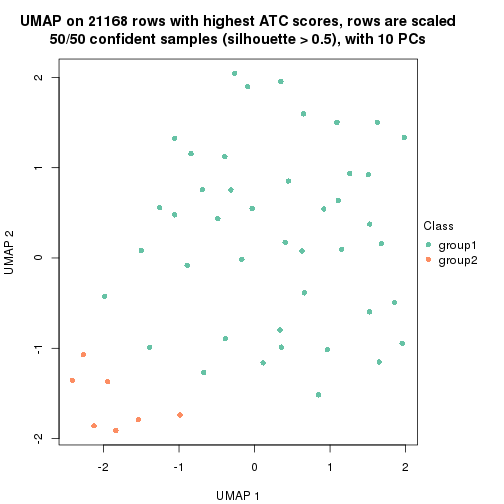</p>

</div>
<div id='tab-ATC-hclust-dimension-reduction-2'>
<pre><code class="r">dimension_reduction(res, k = 3, method = &quot;UMAP&quot;)
</code></pre>

<p>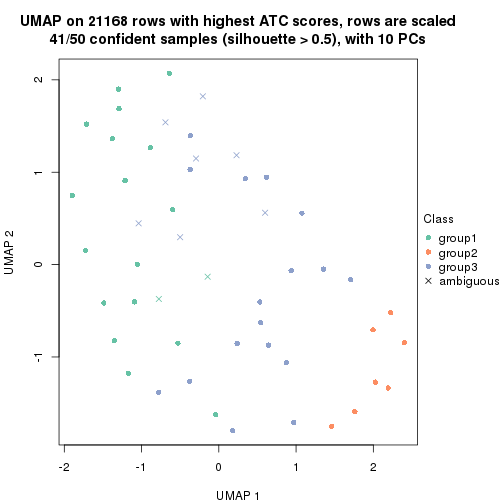</p>

</div>
<div id='tab-ATC-hclust-dimension-reduction-3'>
<pre><code class="r">dimension_reduction(res, k = 4, method = &quot;UMAP&quot;)
</code></pre>

<p>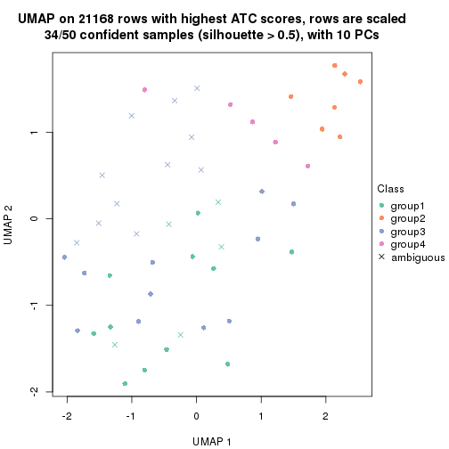</p>

</div>
<div id='tab-ATC-hclust-dimension-reduction-4'>
<pre><code class="r">dimension_reduction(res, k = 5, method = &quot;UMAP&quot;)
</code></pre>

<p></p>

</div>
<div id='tab-ATC-hclust-dimension-reduction-5'>
<pre><code class="r">dimension_reduction(res, k = 6, method = &quot;UMAP&quot;)
</code></pre>

<p>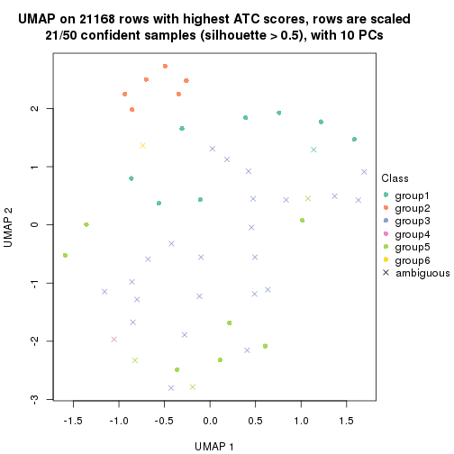</p>

</div>
</div>


Following heatmap shows how subgroups are split when increasing `k`:

```r
collect_classes(res)
```

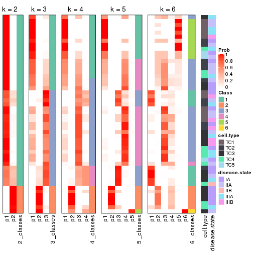


Test correlation between subgroups and known annotations. If the known
annotation is numeric, one-way ANOVA test is applied, and if the known
annotation is discrete, chi-squared contingency table test is applied.

```r
test_to_known_factors(res)
```

```
#>             n cell.type(p) disease.state(p) k
#> ATC:hclust 50       0.0605            0.250 2
#> ATC:hclust 41       0.1034            0.318 3
#> ATC:hclust 34       0.1814            0.202 4
#> ATC:hclust 37       0.1488            0.325 5
#> ATC:hclust 21       0.0213            0.117 6
```


If matrix rows can be associated to genes, consider to use `functional_enrichment(res,
...)` to perform function enrichment for the signature genes. See [this vignette](http://bioconductor.org/packages/devel/bioc/vignettes/cola/inst/doc/functional_enrichment.html) for more detailed explanations.


 

---------------------------------------------------


### ATC:kmeans**


The object with results only for a single top-value method and a single partition method 
can be extracted as:

```r
res = res_list["ATC", "kmeans"]
# you can also extract it by
# res = res_list["ATC:kmeans"]
```

A summary of `res` and all the functions that can be applied to it:

```r
res
```

```
#> A 'ConsensusPartition' object with k = 2, 3, 4, 5, 6.
#>   On a matrix with 21168 rows and 50 columns.
#>   Top rows (1000, 2000, 3000, 4000, 5000) are extracted by 'ATC' method.
#>   Subgroups are detected by 'kmeans' method.
#>   Performed in total 1250 partitions by row resampling.
#>   Best k for subgroups seems to be 4.
#> 
#> Following methods can be applied to this 'ConsensusPartition' object:
#>  [1] "cola_report"             "collect_classes"         "collect_plots"          
#>  [4] "collect_stats"           "colnames"                "compare_signatures"     
#>  [7] "consensus_heatmap"       "dimension_reduction"     "functional_enrichment"  
#> [10] "get_anno_col"            "get_anno"                "get_classes"            
#> [13] "get_consensus"           "get_matrix"              "get_membership"         
#> [16] "get_param"               "get_signatures"          "get_stats"              
#> [19] "is_best_k"               "is_stable_k"             "membership_heatmap"     
#> [22] "ncol"                    "nrow"                    "plot_ecdf"              
#> [25] "rownames"                "select_partition_number" "show"                   
#> [28] "suggest_best_k"          "test_to_known_factors"
```

`collect_plots()` function collects all the plots made from `res` for all `k` (number of partitions)
into one single page to provide an easy and fast comparison between different `k`.

```r
collect_plots(res)
```

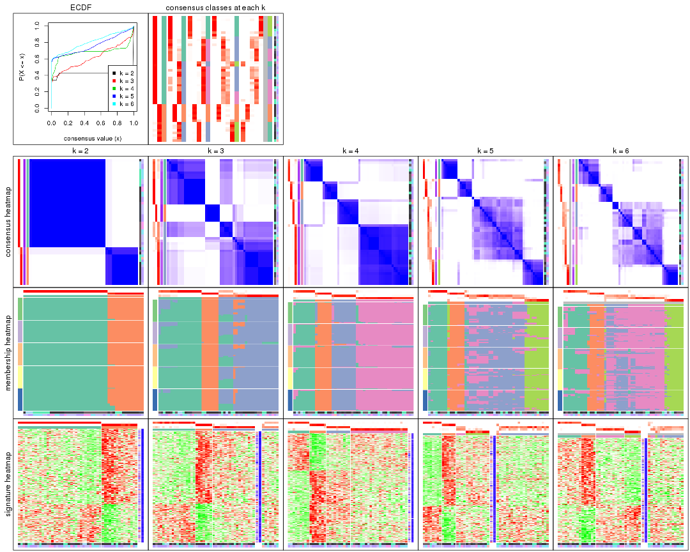

The plots are:

- The first row: a plot of the ECDF (empirical cumulative distribution
  function) curves of the consensus matrix for each `k` and the heatmap of
  predicted classes for each `k`.
- The second row: heatmaps of the consensus matrix for each `k`.
- The third row: heatmaps of the membership matrix for each `k`.
- The fouth row: heatmaps of the signatures for each `k`.

All the plots in panels can be made by individual functions and they are
plotted later in this section.

`select_partition_number()` produces several plots showing different
statistics for choosing "optimized" `k`. There are following statistics:

- ECDF curves of the consensus matrix for each `k`;
- 1-PAC. [The PAC
  score](https://en.wikipedia.org/wiki/Consensus_clustering#Over-interpretation_potential_of_consensus_clustering)
  measures the proportion of the ambiguous subgrouping.
- Mean silhouette score.
- Concordance. The mean probability of fiting the consensus class ids in all
  partitions.
- Area increased. Denote $A_k$ as the area under the ECDF curve for current
  `k`, the area increased is defined as $A_k - A_{k-1}$.
- Rand index. The percent of pairs of samples that are both in a same cluster
  or both are not in a same cluster in the partition of k and k-1.
- Jaccard index. The ratio of pairs of samples are both in a same cluster in
  the partition of k and k-1 and the pairs of samples are both in a same
  cluster in the partition k or k-1.

The detailed explanations of these statistics can be found in [the _cola_
vignette](http://bioconductor.org/packages/devel/bioc/vignettes/cola/inst/doc/cola.html#toc_13).

Generally speaking, lower PAC score, higher mean silhouette score or higher
concordance corresponds to better partition. Rand index and Jaccard index
measure how similar the current partition is compared to partition with `k-1`.
If they are too similar, we won't accept `k` is better than `k-1`.

```r
select_partition_number(res)
```

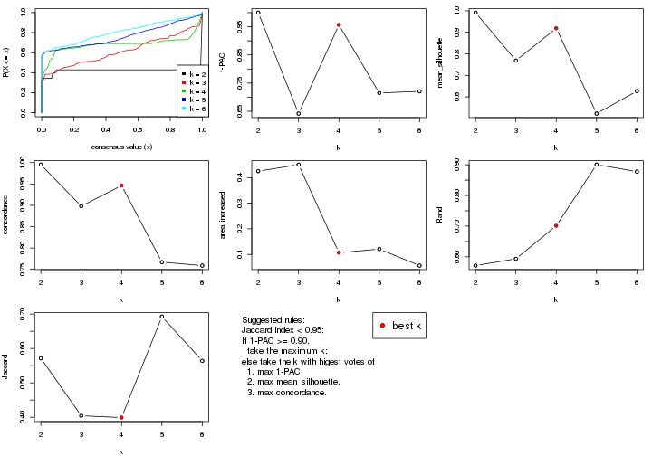

The numeric values for all these statistics can be obtained by `get_stats()`.

```r
get_stats(res)
```

```
#>   k 1-PAC mean_silhouette concordance area_increased  Rand Jaccard
#> 2 2 1.000           0.992       0.995         0.4251 0.571   0.571
#> 3 3 0.642           0.769       0.898         0.4508 0.593   0.404
#> 4 4 0.957           0.919       0.946         0.1068 0.701   0.399
#> 5 5 0.715           0.522       0.767         0.1207 0.900   0.693
#> 6 6 0.721           0.627       0.759         0.0563 0.878   0.564
```

`suggest_best_k()` suggests the best $k$ based on these statistics. The rules are as follows:

- All $k$ with Jaccard index larger than 0.95 are removed because increasing
  $k$ does not provide enough extra information. If all $k$ are removed, it is
  marked as no subgroup is detected.
- For all $k$ with 1-PAC score larger than 0.9, the maximal $k$ is taken as
  the best $k$, and other $k$ are marked as optional $k$.
- If it does not fit the second rule. The $k$ with the maximal vote of the
  highest 1-PAC score, highest mean silhouette, and highest concordance is
  taken as the best $k$.

```r
suggest_best_k(res)
```

```
#> [1] 4
#> attr(,"optional")
#> [1] 2
```

There is also optional best $k$ = 2 that is worth to check.

Following shows the table of the partitions (You need to click the **show/hide
code output** link to see it). The membership matrix (columns with name `p*`)
is inferred by
[`clue::cl_consensus()`](https://www.rdocumentation.org/link/cl_consensus?package=clue)
function with the `SE` method. Basically the value in the membership matrix
represents the probability to belong to a certain group. The finall class
label for an item is determined with the group with highest probability it
belongs to.

In `get_classes()` function, the entropy is calculated from the membership
matrix and the silhouette score is calculated from the consensus matrix.


<script>
$( function() {
	$( '#tabs-ATC-kmeans-get-classes' ).tabs();
} );
</script>
<div id='tabs-ATC-kmeans-get-classes'>
<ul>
<li><a href='#tab-ATC-kmeans-get-classes-1'>k = 2</a></li>
<li><a href='#tab-ATC-kmeans-get-classes-2'>k = 3</a></li>
<li><a href='#tab-ATC-kmeans-get-classes-3'>k = 4</a></li>
<li><a href='#tab-ATC-kmeans-get-classes-4'>k = 5</a></li>
<li><a href='#tab-ATC-kmeans-get-classes-5'>k = 6</a></li>
</ul>

<div id='tab-ATC-kmeans-get-classes-1'>
<p><a id='tab-ATC-kmeans-get-classes-1-a' style='color:#0366d6' href='#'>show/hide code output</a></p>
<pre><code class="r">cbind(get_classes(res, k = 2), get_membership(res, k = 2))
</code></pre>

<pre><code>#&gt;          class entropy silhouette    p1    p2
#&gt; GSM63448     2  0.3584      0.936 0.068 0.932
#&gt; GSM63449     1  0.0000      1.000 1.000 0.000
#&gt; GSM63423     1  0.0000      1.000 1.000 0.000
#&gt; GSM63425     1  0.0000      1.000 1.000 0.000
#&gt; GSM63437     1  0.0000      1.000 1.000 0.000
#&gt; GSM63453     1  0.0000      1.000 1.000 0.000
#&gt; GSM63431     1  0.0000      1.000 1.000 0.000
#&gt; GSM63450     1  0.0000      1.000 1.000 0.000
#&gt; GSM63428     1  0.0000      1.000 1.000 0.000
#&gt; GSM63432     1  0.0000      1.000 1.000 0.000
#&gt; GSM63458     1  0.0000      1.000 1.000 0.000
#&gt; GSM63434     2  0.0000      0.984 0.000 1.000
#&gt; GSM63435     1  0.0000      1.000 1.000 0.000
#&gt; GSM63442     1  0.0000      1.000 1.000 0.000
#&gt; GSM63451     1  0.0000      1.000 1.000 0.000
#&gt; GSM63422     1  0.0000      1.000 1.000 0.000
#&gt; GSM63438     1  0.0000      1.000 1.000 0.000
#&gt; GSM63439     2  0.0000      0.984 0.000 1.000
#&gt; GSM63461     1  0.0000      1.000 1.000 0.000
#&gt; GSM63463     1  0.0000      1.000 1.000 0.000
#&gt; GSM63430     2  0.4298      0.915 0.088 0.912
#&gt; GSM63446     1  0.0000      1.000 1.000 0.000
#&gt; GSM63429     1  0.0000      1.000 1.000 0.000
#&gt; GSM63445     1  0.0000      1.000 1.000 0.000
#&gt; GSM63447     2  0.0000      0.984 0.000 1.000
#&gt; GSM63459     2  0.0000      0.984 0.000 1.000
#&gt; GSM63464     2  0.0000      0.984 0.000 1.000
#&gt; GSM63469     2  0.0000      0.984 0.000 1.000
#&gt; GSM63470     2  0.0000      0.984 0.000 1.000
#&gt; GSM63436     1  0.0672      0.992 0.992 0.008
#&gt; GSM63443     2  0.0000      0.984 0.000 1.000
#&gt; GSM63465     2  0.3584      0.936 0.068 0.932
#&gt; GSM63444     2  0.0000      0.984 0.000 1.000
#&gt; GSM63456     1  0.0000      1.000 1.000 0.000
#&gt; GSM63462     1  0.0000      1.000 1.000 0.000
#&gt; GSM63424     1  0.0000      1.000 1.000 0.000
#&gt; GSM63440     1  0.0000      1.000 1.000 0.000
#&gt; GSM63433     1  0.0000      1.000 1.000 0.000
#&gt; GSM63466     2  0.0000      0.984 0.000 1.000
#&gt; GSM63426     1  0.0000      1.000 1.000 0.000
#&gt; GSM63468     1  0.0000      1.000 1.000 0.000
#&gt; GSM63452     2  0.0000      0.984 0.000 1.000
#&gt; GSM63441     1  0.0000      1.000 1.000 0.000
#&gt; GSM63454     1  0.0000      1.000 1.000 0.000
#&gt; GSM63455     1  0.0000      1.000 1.000 0.000
#&gt; GSM63460     2  0.0000      0.984 0.000 1.000
#&gt; GSM63467     1  0.0000      1.000 1.000 0.000
#&gt; GSM63421     1  0.0000      1.000 1.000 0.000
#&gt; GSM63427     1  0.0000      1.000 1.000 0.000
#&gt; GSM63457     1  0.0000      1.000 1.000 0.000
</code></pre>

<script>
$('#tab-ATC-kmeans-get-classes-1-a').parent().next().next().hide();
$('#tab-ATC-kmeans-get-classes-1-a').click(function(){
  $('#tab-ATC-kmeans-get-classes-1-a').parent().next().next().toggle();
  return(false);
});
</script>
</div>

<div id='tab-ATC-kmeans-get-classes-2'>
<p><a id='tab-ATC-kmeans-get-classes-2-a' style='color:#0366d6' href='#'>show/hide code output</a></p>
<pre><code class="r">cbind(get_classes(res, k = 3), get_membership(res, k = 3))
</code></pre>

<pre><code>#&gt;          class entropy silhouette    p1    p2    p3
#&gt; GSM63448     3  0.0000     0.8083 0.000 0.000 1.000
#&gt; GSM63449     3  0.0892     0.8126 0.020 0.000 0.980
#&gt; GSM63423     1  0.5760     0.5475 0.672 0.000 0.328
#&gt; GSM63425     1  0.0000     0.9016 1.000 0.000 0.000
#&gt; GSM63437     3  0.0892     0.8126 0.020 0.000 0.980
#&gt; GSM63453     1  0.0000     0.9016 1.000 0.000 0.000
#&gt; GSM63431     1  0.0000     0.9016 1.000 0.000 0.000
#&gt; GSM63450     1  0.2878     0.8735 0.904 0.000 0.096
#&gt; GSM63428     3  0.0892     0.8126 0.020 0.000 0.980
#&gt; GSM63432     3  0.0000     0.8083 0.000 0.000 1.000
#&gt; GSM63458     1  0.0000     0.9016 1.000 0.000 0.000
#&gt; GSM63434     3  0.3686     0.6958 0.000 0.140 0.860
#&gt; GSM63435     1  0.0000     0.9016 1.000 0.000 0.000
#&gt; GSM63442     1  0.4062     0.8229 0.836 0.000 0.164
#&gt; GSM63451     3  0.0892     0.8126 0.020 0.000 0.980
#&gt; GSM63422     1  0.0000     0.9016 1.000 0.000 0.000
#&gt; GSM63438     3  0.6111     0.3502 0.396 0.000 0.604
#&gt; GSM63439     3  0.3267     0.7202 0.000 0.116 0.884
#&gt; GSM63461     1  0.2448     0.8824 0.924 0.000 0.076
#&gt; GSM63463     3  0.6008     0.4039 0.372 0.000 0.628
#&gt; GSM63430     3  0.0000     0.8083 0.000 0.000 1.000
#&gt; GSM63446     3  0.0892     0.8126 0.020 0.000 0.980
#&gt; GSM63429     1  0.4654     0.7776 0.792 0.000 0.208
#&gt; GSM63445     3  0.6154     0.3182 0.408 0.000 0.592
#&gt; GSM63447     3  0.5327     0.5117 0.000 0.272 0.728
#&gt; GSM63459     2  0.0000     0.9988 0.000 1.000 0.000
#&gt; GSM63464     2  0.0000     0.9988 0.000 1.000 0.000
#&gt; GSM63469     2  0.0000     0.9988 0.000 1.000 0.000
#&gt; GSM63470     2  0.0000     0.9988 0.000 1.000 0.000
#&gt; GSM63436     3  0.0000     0.8083 0.000 0.000 1.000
#&gt; GSM63443     2  0.0000     0.9988 0.000 1.000 0.000
#&gt; GSM63465     3  0.0000     0.8083 0.000 0.000 1.000
#&gt; GSM63444     3  0.3686     0.6958 0.000 0.140 0.860
#&gt; GSM63456     3  0.0000     0.8083 0.000 0.000 1.000
#&gt; GSM63462     1  0.0000     0.9016 1.000 0.000 0.000
#&gt; GSM63424     3  0.2625     0.7772 0.084 0.000 0.916
#&gt; GSM63440     1  0.4654     0.7776 0.792 0.000 0.208
#&gt; GSM63433     1  0.4654     0.7776 0.792 0.000 0.208
#&gt; GSM63466     2  0.0000     0.9988 0.000 1.000 0.000
#&gt; GSM63426     3  0.0892     0.8126 0.020 0.000 0.980
#&gt; GSM63468     1  0.2796     0.8757 0.908 0.000 0.092
#&gt; GSM63452     3  0.6295     0.0104 0.000 0.472 0.528
#&gt; GSM63441     3  0.0892     0.8126 0.020 0.000 0.980
#&gt; GSM63454     3  0.6095     0.3599 0.392 0.000 0.608
#&gt; GSM63455     1  0.0000     0.9016 1.000 0.000 0.000
#&gt; GSM63460     2  0.0424     0.9928 0.000 0.992 0.008
#&gt; GSM63467     3  0.6008     0.4035 0.372 0.000 0.628
#&gt; GSM63421     1  0.0000     0.9016 1.000 0.000 0.000
#&gt; GSM63427     3  0.6154     0.3182 0.408 0.000 0.592
#&gt; GSM63457     1  0.0000     0.9016 1.000 0.000 0.000
</code></pre>

<script>
$('#tab-ATC-kmeans-get-classes-2-a').parent().next().next().hide();
$('#tab-ATC-kmeans-get-classes-2-a').click(function(){
  $('#tab-ATC-kmeans-get-classes-2-a').parent().next().next().toggle();
  return(false);
});
</script>
</div>

<div id='tab-ATC-kmeans-get-classes-3'>
<p><a id='tab-ATC-kmeans-get-classes-3-a' style='color:#0366d6' href='#'>show/hide code output</a></p>
<pre><code class="r">cbind(get_classes(res, k = 4), get_membership(res, k = 4))
</code></pre>

<pre><code>#&gt;          class entropy silhouette    p1    p2    p3    p4
#&gt; GSM63448     3  0.1302      0.953 0.000 0.000 0.956 0.044
#&gt; GSM63449     4  0.1489      0.944 0.004 0.000 0.044 0.952
#&gt; GSM63423     4  0.0707      0.949 0.020 0.000 0.000 0.980
#&gt; GSM63425     1  0.1302      0.931 0.956 0.000 0.000 0.044
#&gt; GSM63437     4  0.1489      0.944 0.004 0.000 0.044 0.952
#&gt; GSM63453     1  0.2319      0.903 0.924 0.000 0.036 0.040
#&gt; GSM63431     1  0.1302      0.931 0.956 0.000 0.000 0.044
#&gt; GSM63450     4  0.1677      0.935 0.012 0.000 0.040 0.948
#&gt; GSM63428     4  0.1489      0.944 0.004 0.000 0.044 0.952
#&gt; GSM63432     3  0.3688      0.727 0.000 0.000 0.792 0.208
#&gt; GSM63458     1  0.1302      0.931 0.956 0.000 0.000 0.044
#&gt; GSM63434     3  0.1674      0.953 0.004 0.012 0.952 0.032
#&gt; GSM63435     1  0.4522      0.586 0.680 0.000 0.000 0.320
#&gt; GSM63442     4  0.0921      0.945 0.028 0.000 0.000 0.972
#&gt; GSM63451     4  0.1398      0.945 0.004 0.000 0.040 0.956
#&gt; GSM63422     1  0.1302      0.931 0.956 0.000 0.000 0.044
#&gt; GSM63438     4  0.0188      0.954 0.004 0.000 0.000 0.996
#&gt; GSM63439     3  0.1488      0.953 0.000 0.012 0.956 0.032
#&gt; GSM63461     4  0.1302      0.931 0.044 0.000 0.000 0.956
#&gt; GSM63463     4  0.0188      0.954 0.000 0.000 0.004 0.996
#&gt; GSM63430     3  0.1302      0.953 0.000 0.000 0.956 0.044
#&gt; GSM63446     4  0.1398      0.945 0.004 0.000 0.040 0.956
#&gt; GSM63429     4  0.0921      0.945 0.028 0.000 0.000 0.972
#&gt; GSM63445     4  0.0188      0.954 0.004 0.000 0.000 0.996
#&gt; GSM63447     3  0.1510      0.940 0.000 0.028 0.956 0.016
#&gt; GSM63459     2  0.0592      0.949 0.016 0.984 0.000 0.000
#&gt; GSM63464     2  0.0000      0.950 0.000 1.000 0.000 0.000
#&gt; GSM63469     2  0.0592      0.949 0.016 0.984 0.000 0.000
#&gt; GSM63470     2  0.0000      0.950 0.000 1.000 0.000 0.000
#&gt; GSM63436     3  0.1302      0.953 0.000 0.000 0.956 0.044
#&gt; GSM63443     2  0.1305      0.940 0.036 0.960 0.004 0.000
#&gt; GSM63465     3  0.1489      0.953 0.004 0.000 0.952 0.044
#&gt; GSM63444     3  0.1575      0.951 0.004 0.012 0.956 0.028
#&gt; GSM63456     4  0.1489      0.943 0.004 0.000 0.044 0.952
#&gt; GSM63462     4  0.4164      0.603 0.264 0.000 0.000 0.736
#&gt; GSM63424     4  0.1118      0.947 0.000 0.000 0.036 0.964
#&gt; GSM63440     4  0.0921      0.945 0.028 0.000 0.000 0.972
#&gt; GSM63433     4  0.0921      0.945 0.028 0.000 0.000 0.972
#&gt; GSM63466     2  0.0000      0.950 0.000 1.000 0.000 0.000
#&gt; GSM63426     4  0.1489      0.944 0.004 0.000 0.044 0.952
#&gt; GSM63468     4  0.1022      0.940 0.032 0.000 0.000 0.968
#&gt; GSM63452     3  0.1585      0.925 0.004 0.040 0.952 0.004
#&gt; GSM63441     4  0.1489      0.944 0.004 0.000 0.044 0.952
#&gt; GSM63454     4  0.0376      0.954 0.004 0.000 0.004 0.992
#&gt; GSM63455     1  0.1302      0.931 0.956 0.000 0.000 0.044
#&gt; GSM63460     2  0.4008      0.676 0.000 0.756 0.244 0.000
#&gt; GSM63467     4  0.0336      0.954 0.000 0.000 0.008 0.992
#&gt; GSM63421     1  0.2530      0.868 0.888 0.000 0.000 0.112
#&gt; GSM63427     4  0.0188      0.954 0.004 0.000 0.000 0.996
#&gt; GSM63457     1  0.1302      0.931 0.956 0.000 0.000 0.044
</code></pre>

<script>
$('#tab-ATC-kmeans-get-classes-3-a').parent().next().next().hide();
$('#tab-ATC-kmeans-get-classes-3-a').click(function(){
  $('#tab-ATC-kmeans-get-classes-3-a').parent().next().next().toggle();
  return(false);
});
</script>
</div>

<div id='tab-ATC-kmeans-get-classes-4'>
<p><a id='tab-ATC-kmeans-get-classes-4-a' style='color:#0366d6' href='#'>show/hide code output</a></p>
<pre><code class="r">cbind(get_classes(res, k = 5), get_membership(res, k = 5))
</code></pre>

<pre><code>#&gt;          class entropy silhouette    p1    p2    p3    p4    p5
#&gt; GSM63448     5  0.2732    0.86621 0.000 0.000 0.000 0.160 0.840
#&gt; GSM63449     4  0.4273    0.77890 0.000 0.000 0.448 0.552 0.000
#&gt; GSM63423     3  0.4171   -0.26628 0.000 0.000 0.604 0.396 0.000
#&gt; GSM63425     1  0.0000    0.94408 1.000 0.000 0.000 0.000 0.000
#&gt; GSM63437     4  0.4182    0.77793 0.000 0.000 0.400 0.600 0.000
#&gt; GSM63453     1  0.1251    0.92248 0.956 0.000 0.008 0.036 0.000
#&gt; GSM63431     1  0.0000    0.94408 1.000 0.000 0.000 0.000 0.000
#&gt; GSM63450     3  0.2852    0.31677 0.000 0.000 0.828 0.172 0.000
#&gt; GSM63428     4  0.4273    0.77968 0.000 0.000 0.448 0.552 0.000
#&gt; GSM63432     5  0.4935    0.64380 0.000 0.000 0.040 0.344 0.616
#&gt; GSM63458     1  0.0000    0.94408 1.000 0.000 0.000 0.000 0.000
#&gt; GSM63434     5  0.0000    0.88823 0.000 0.000 0.000 0.000 1.000
#&gt; GSM63435     3  0.4557   -0.14586 0.476 0.000 0.516 0.008 0.000
#&gt; GSM63442     3  0.3837   -0.00833 0.000 0.000 0.692 0.308 0.000
#&gt; GSM63451     3  0.4420    0.08590 0.000 0.000 0.548 0.448 0.004
#&gt; GSM63422     1  0.0000    0.94408 1.000 0.000 0.000 0.000 0.000
#&gt; GSM63438     3  0.4101   -0.19663 0.000 0.000 0.628 0.372 0.000
#&gt; GSM63439     5  0.1908    0.88159 0.000 0.000 0.000 0.092 0.908
#&gt; GSM63461     3  0.0898    0.37879 0.008 0.000 0.972 0.020 0.000
#&gt; GSM63463     3  0.1544    0.36919 0.000 0.000 0.932 0.068 0.000
#&gt; GSM63430     5  0.2813    0.86310 0.000 0.000 0.000 0.168 0.832
#&gt; GSM63446     3  0.4420    0.08590 0.000 0.000 0.548 0.448 0.004
#&gt; GSM63429     3  0.3837   -0.00833 0.000 0.000 0.692 0.308 0.000
#&gt; GSM63445     3  0.3508    0.17159 0.000 0.000 0.748 0.252 0.000
#&gt; GSM63447     5  0.0290    0.88908 0.000 0.000 0.000 0.008 0.992
#&gt; GSM63459     2  0.1608    0.89836 0.000 0.928 0.000 0.072 0.000
#&gt; GSM63464     2  0.0404    0.89788 0.000 0.988 0.000 0.012 0.000
#&gt; GSM63469     2  0.1608    0.89836 0.000 0.928 0.000 0.072 0.000
#&gt; GSM63470     2  0.0000    0.90082 0.000 1.000 0.000 0.000 0.000
#&gt; GSM63436     5  0.3274    0.83013 0.000 0.000 0.000 0.220 0.780
#&gt; GSM63443     2  0.2020    0.88918 0.000 0.900 0.000 0.100 0.000
#&gt; GSM63465     5  0.0000    0.88823 0.000 0.000 0.000 0.000 1.000
#&gt; GSM63444     5  0.0000    0.88823 0.000 0.000 0.000 0.000 1.000
#&gt; GSM63456     3  0.4632    0.08164 0.000 0.000 0.540 0.448 0.012
#&gt; GSM63462     3  0.2230    0.33901 0.116 0.000 0.884 0.000 0.000
#&gt; GSM63424     3  0.4300   -0.48070 0.000 0.000 0.524 0.476 0.000
#&gt; GSM63440     3  0.4150   -0.24303 0.000 0.000 0.612 0.388 0.000
#&gt; GSM63433     3  0.3949   -0.07460 0.000 0.000 0.668 0.332 0.000
#&gt; GSM63466     2  0.0000    0.90082 0.000 1.000 0.000 0.000 0.000
#&gt; GSM63426     4  0.4227    0.47041 0.000 0.000 0.420 0.580 0.000
#&gt; GSM63468     3  0.0000    0.38083 0.000 0.000 1.000 0.000 0.000
#&gt; GSM63452     5  0.0404    0.88275 0.000 0.000 0.000 0.012 0.988
#&gt; GSM63441     4  0.4192    0.78172 0.000 0.000 0.404 0.596 0.000
#&gt; GSM63454     3  0.4088   -0.21144 0.000 0.000 0.632 0.368 0.000
#&gt; GSM63455     1  0.0000    0.94408 1.000 0.000 0.000 0.000 0.000
#&gt; GSM63460     2  0.4565    0.36034 0.000 0.580 0.000 0.012 0.408
#&gt; GSM63467     3  0.1792    0.35881 0.000 0.000 0.916 0.084 0.000
#&gt; GSM63421     1  0.3934    0.60748 0.716 0.000 0.276 0.008 0.000
#&gt; GSM63427     3  0.3636    0.13703 0.000 0.000 0.728 0.272 0.000
#&gt; GSM63457     1  0.0290    0.94072 0.992 0.000 0.008 0.000 0.000
</code></pre>

<script>
$('#tab-ATC-kmeans-get-classes-4-a').parent().next().next().hide();
$('#tab-ATC-kmeans-get-classes-4-a').click(function(){
  $('#tab-ATC-kmeans-get-classes-4-a').parent().next().next().toggle();
  return(false);
});
</script>
</div>

<div id='tab-ATC-kmeans-get-classes-5'>
<p><a id='tab-ATC-kmeans-get-classes-5-a' style='color:#0366d6' href='#'>show/hide code output</a></p>
<pre><code class="r">cbind(get_classes(res, k = 6), get_membership(res, k = 6))
</code></pre>

<pre><code>#&gt;          class entropy silhouette    p1    p2    p3    p4    p5 p6
#&gt; GSM63448     1  0.1584     0.7827 0.928 0.000 0.008 0.000 0.000 NA
#&gt; GSM63449     4  0.4190     0.5646 0.000 0.000 0.048 0.692 0.000 NA
#&gt; GSM63423     4  0.0909     0.6449 0.000 0.000 0.020 0.968 0.000 NA
#&gt; GSM63425     5  0.0000     0.9183 0.000 0.000 0.000 0.000 1.000 NA
#&gt; GSM63437     4  0.4284     0.5533 0.000 0.000 0.056 0.688 0.000 NA
#&gt; GSM63453     5  0.2852     0.8426 0.000 0.000 0.080 0.000 0.856 NA
#&gt; GSM63431     5  0.0000     0.9183 0.000 0.000 0.000 0.000 1.000 NA
#&gt; GSM63450     3  0.5746     0.4495 0.000 0.000 0.512 0.264 0.000 NA
#&gt; GSM63428     4  0.3975     0.5693 0.000 0.000 0.040 0.716 0.000 NA
#&gt; GSM63432     1  0.4576     0.5990 0.696 0.000 0.008 0.076 0.000 NA
#&gt; GSM63458     5  0.0000     0.9183 0.000 0.000 0.000 0.000 1.000 NA
#&gt; GSM63434     1  0.2883     0.8081 0.788 0.000 0.000 0.000 0.000 NA
#&gt; GSM63435     3  0.6235     0.2964 0.000 0.000 0.356 0.344 0.296 NA
#&gt; GSM63442     4  0.1858     0.5986 0.000 0.000 0.092 0.904 0.000 NA
#&gt; GSM63451     3  0.5991     0.3225 0.000 0.000 0.436 0.256 0.000 NA
#&gt; GSM63422     5  0.0000     0.9183 0.000 0.000 0.000 0.000 1.000 NA
#&gt; GSM63438     4  0.1007     0.6349 0.000 0.000 0.044 0.956 0.000 NA
#&gt; GSM63439     1  0.0000     0.7965 1.000 0.000 0.000 0.000 0.000 NA
#&gt; GSM63461     3  0.3899     0.4705 0.000 0.000 0.592 0.404 0.000 NA
#&gt; GSM63463     3  0.4057     0.4396 0.000 0.000 0.556 0.436 0.000 NA
#&gt; GSM63430     1  0.1584     0.7827 0.928 0.000 0.008 0.000 0.000 NA
#&gt; GSM63446     3  0.5991     0.3225 0.000 0.000 0.436 0.256 0.000 NA
#&gt; GSM63429     4  0.1610     0.6086 0.000 0.000 0.084 0.916 0.000 NA
#&gt; GSM63445     4  0.3984     0.0181 0.000 0.000 0.336 0.648 0.000 NA
#&gt; GSM63447     1  0.2697     0.8107 0.812 0.000 0.000 0.000 0.000 NA
#&gt; GSM63459     2  0.0632     0.8468 0.000 0.976 0.024 0.000 0.000 NA
#&gt; GSM63464     2  0.2219     0.8518 0.000 0.864 0.000 0.000 0.000 NA
#&gt; GSM63469     2  0.0632     0.8468 0.000 0.976 0.024 0.000 0.000 NA
#&gt; GSM63470     2  0.2048     0.8547 0.000 0.880 0.000 0.000 0.000 NA
#&gt; GSM63436     1  0.3341     0.6823 0.776 0.000 0.012 0.004 0.000 NA
#&gt; GSM63443     2  0.2263     0.8197 0.000 0.896 0.056 0.000 0.000 NA
#&gt; GSM63465     1  0.2883     0.8081 0.788 0.000 0.000 0.000 0.000 NA
#&gt; GSM63444     1  0.2912     0.8069 0.784 0.000 0.000 0.000 0.000 NA
#&gt; GSM63456     3  0.5969     0.3238 0.000 0.000 0.440 0.244 0.000 NA
#&gt; GSM63462     3  0.4566     0.4879 0.000 0.000 0.596 0.364 0.036 NA
#&gt; GSM63424     4  0.3055     0.5863 0.000 0.000 0.096 0.840 0.000 NA
#&gt; GSM63440     4  0.3123     0.5716 0.000 0.000 0.112 0.832 0.000 NA
#&gt; GSM63433     4  0.1549     0.6280 0.000 0.000 0.044 0.936 0.000 NA
#&gt; GSM63466     2  0.2048     0.8547 0.000 0.880 0.000 0.000 0.000 NA
#&gt; GSM63426     4  0.6235     0.4018 0.164 0.000 0.052 0.552 0.000 NA
#&gt; GSM63468     3  0.3782     0.4741 0.000 0.000 0.588 0.412 0.000 NA
#&gt; GSM63452     1  0.3023     0.7982 0.768 0.000 0.000 0.000 0.000 NA
#&gt; GSM63441     4  0.4284     0.5557 0.000 0.000 0.056 0.688 0.000 NA
#&gt; GSM63454     4  0.1082     0.6335 0.000 0.000 0.040 0.956 0.000 NA
#&gt; GSM63455     5  0.0000     0.9183 0.000 0.000 0.000 0.000 1.000 NA
#&gt; GSM63460     2  0.6054     0.1978 0.260 0.392 0.000 0.000 0.000 NA
#&gt; GSM63467     3  0.4335     0.3834 0.000 0.000 0.508 0.472 0.000 NA
#&gt; GSM63421     5  0.5054     0.4094 0.000 0.000 0.124 0.232 0.640 NA
#&gt; GSM63427     4  0.3871     0.1032 0.000 0.000 0.308 0.676 0.000 NA
#&gt; GSM63457     5  0.0858     0.9051 0.000 0.000 0.028 0.000 0.968 NA
</code></pre>

<script>
$('#tab-ATC-kmeans-get-classes-5-a').parent().next().next().hide();
$('#tab-ATC-kmeans-get-classes-5-a').click(function(){
  $('#tab-ATC-kmeans-get-classes-5-a').parent().next().next().toggle();
  return(false);
});
</script>
</div>
</div>

Heatmaps for the consensus matrix. It visualizes the probability of two
samples to be in a same group.


<script>
$( function() {
	$( '#tabs-ATC-kmeans-consensus-heatmap' ).tabs();
} );
</script>
<div id='tabs-ATC-kmeans-consensus-heatmap'>
<ul>
<li><a href='#tab-ATC-kmeans-consensus-heatmap-1'>k = 2</a></li>
<li><a href='#tab-ATC-kmeans-consensus-heatmap-2'>k = 3</a></li>
<li><a href='#tab-ATC-kmeans-consensus-heatmap-3'>k = 4</a></li>
<li><a href='#tab-ATC-kmeans-consensus-heatmap-4'>k = 5</a></li>
<li><a href='#tab-ATC-kmeans-consensus-heatmap-5'>k = 6</a></li>
</ul>
<div id='tab-ATC-kmeans-consensus-heatmap-1'>
<pre><code class="r">consensus_heatmap(res, k = 2)
</code></pre>

<p>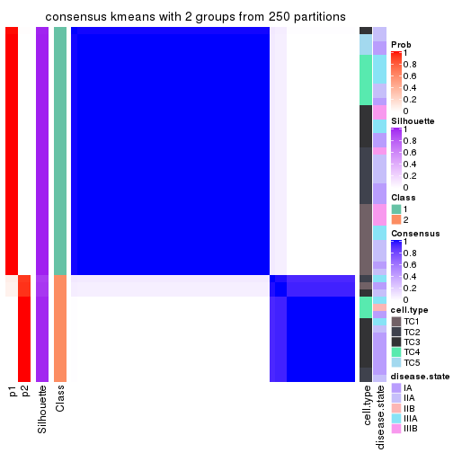</p>

</div>
<div id='tab-ATC-kmeans-consensus-heatmap-2'>
<pre><code class="r">consensus_heatmap(res, k = 3)
</code></pre>

<p>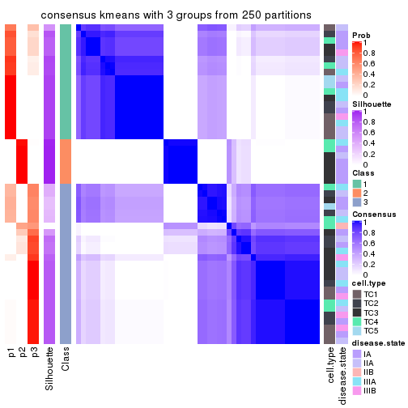</p>

</div>
<div id='tab-ATC-kmeans-consensus-heatmap-3'>
<pre><code class="r">consensus_heatmap(res, k = 4)
</code></pre>

<p>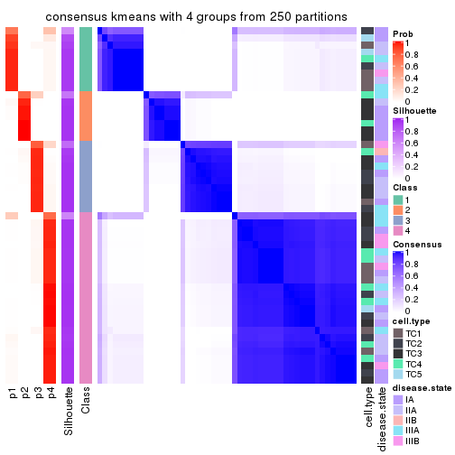</p>

</div>
<div id='tab-ATC-kmeans-consensus-heatmap-4'>
<pre><code class="r">consensus_heatmap(res, k = 5)
</code></pre>

<p>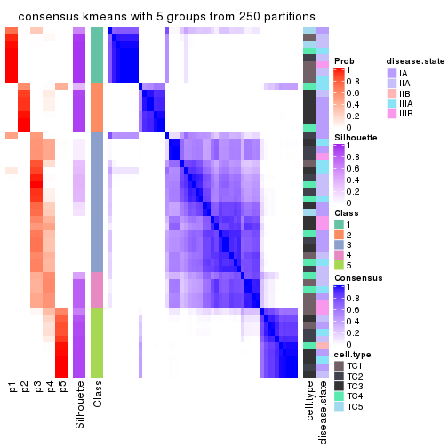</p>

</div>
<div id='tab-ATC-kmeans-consensus-heatmap-5'>
<pre><code class="r">consensus_heatmap(res, k = 6)
</code></pre>

<p>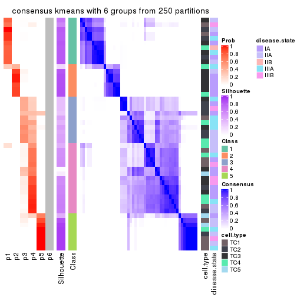</p>

</div>
</div>

Heatmaps for the membership of samples in all partitions to see how consistent they are:


<script>
$( function() {
	$( '#tabs-ATC-kmeans-membership-heatmap' ).tabs();
} );
</script>
<div id='tabs-ATC-kmeans-membership-heatmap'>
<ul>
<li><a href='#tab-ATC-kmeans-membership-heatmap-1'>k = 2</a></li>
<li><a href='#tab-ATC-kmeans-membership-heatmap-2'>k = 3</a></li>
<li><a href='#tab-ATC-kmeans-membership-heatmap-3'>k = 4</a></li>
<li><a href='#tab-ATC-kmeans-membership-heatmap-4'>k = 5</a></li>
<li><a href='#tab-ATC-kmeans-membership-heatmap-5'>k = 6</a></li>
</ul>
<div id='tab-ATC-kmeans-membership-heatmap-1'>
<pre><code class="r">membership_heatmap(res, k = 2)
</code></pre>

<p>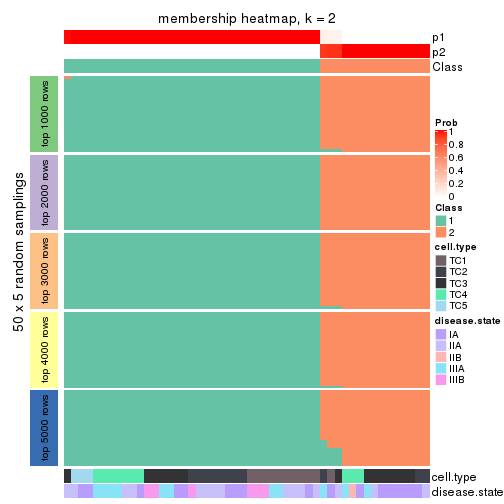</p>

</div>
<div id='tab-ATC-kmeans-membership-heatmap-2'>
<pre><code class="r">membership_heatmap(res, k = 3)
</code></pre>

<p>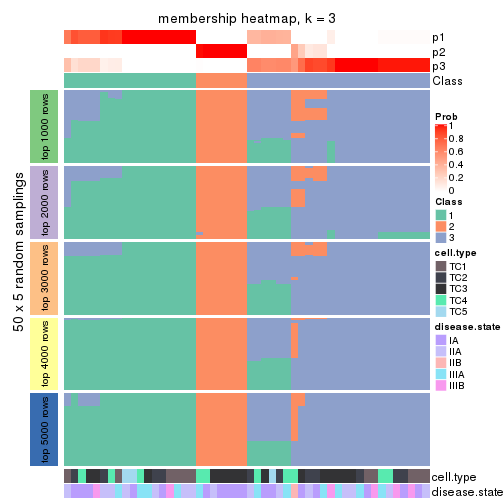</p>

</div>
<div id='tab-ATC-kmeans-membership-heatmap-3'>
<pre><code class="r">membership_heatmap(res, k = 4)
</code></pre>

<p>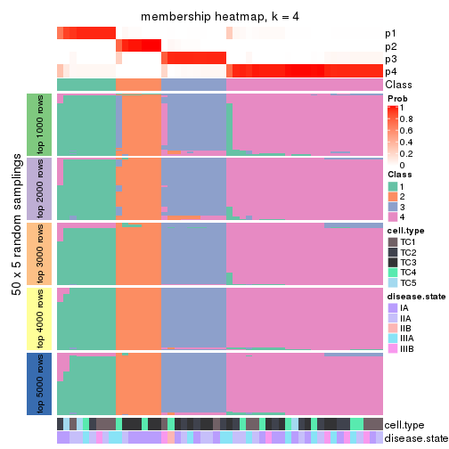</p>

</div>
<div id='tab-ATC-kmeans-membership-heatmap-4'>
<pre><code class="r">membership_heatmap(res, k = 5)
</code></pre>

<p>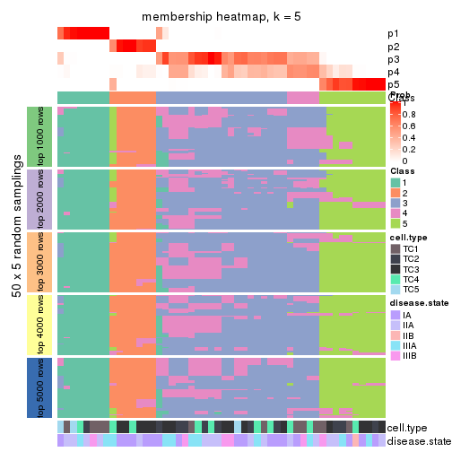</p>

</div>
<div id='tab-ATC-kmeans-membership-heatmap-5'>
<pre><code class="r">membership_heatmap(res, k = 6)
</code></pre>

<p>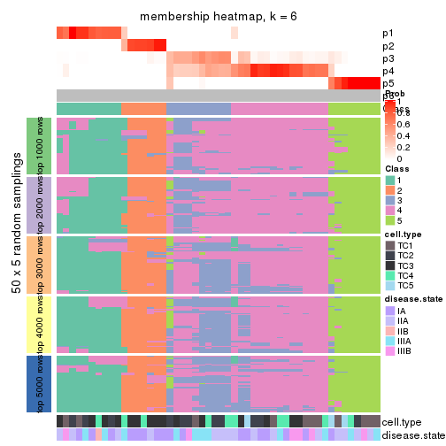</p>

</div>
</div>

As soon as we have had the classes for columns, we can look for signatures
which are significantly different between classes which can be candidate marks
for certain classes. Following are the heatmaps for signatures.


Signature heatmaps where rows are scaled:


<script>
$( function() {
	$( '#tabs-ATC-kmeans-get-signatures' ).tabs();
} );
</script>
<div id='tabs-ATC-kmeans-get-signatures'>
<ul>
<li><a href='#tab-ATC-kmeans-get-signatures-1'>k = 2</a></li>
<li><a href='#tab-ATC-kmeans-get-signatures-2'>k = 3</a></li>
<li><a href='#tab-ATC-kmeans-get-signatures-3'>k = 4</a></li>
<li><a href='#tab-ATC-kmeans-get-signatures-4'>k = 5</a></li>
<li><a href='#tab-ATC-kmeans-get-signatures-5'>k = 6</a></li>
</ul>
<div id='tab-ATC-kmeans-get-signatures-1'>
<pre><code class="r">get_signatures(res, k = 2)
</code></pre>

<p>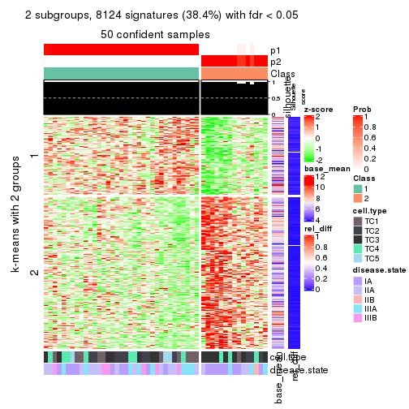</p>

</div>
<div id='tab-ATC-kmeans-get-signatures-2'>
<pre><code class="r">get_signatures(res, k = 3)
</code></pre>

<p>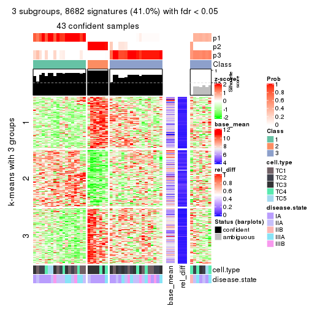</p>

</div>
<div id='tab-ATC-kmeans-get-signatures-3'>
<pre><code class="r">get_signatures(res, k = 4)
</code></pre>

<p>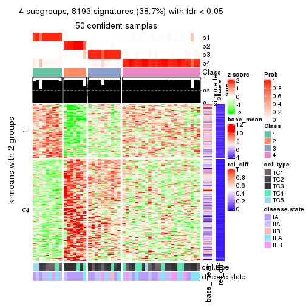</p>

</div>
<div id='tab-ATC-kmeans-get-signatures-4'>
<pre><code class="r">get_signatures(res, k = 5)
</code></pre>

<p>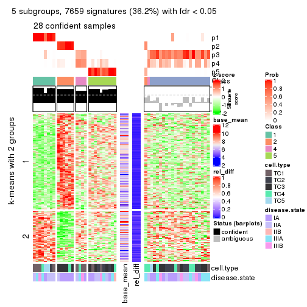</p>

</div>
<div id='tab-ATC-kmeans-get-signatures-5'>
<pre><code class="r">get_signatures(res, k = 6)
</code></pre>

<p>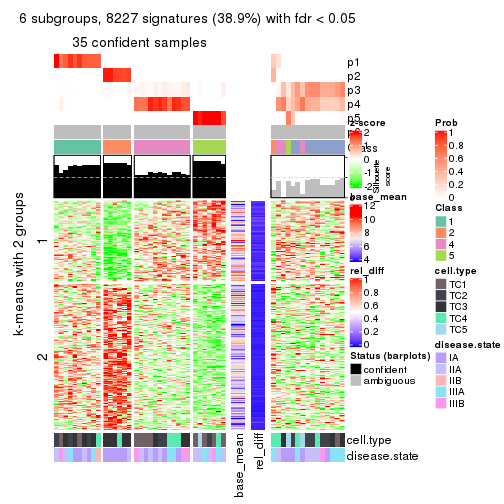</p>

</div>
</div>


Signature heatmaps where rows are not scaled:


<script>
$( function() {
	$( '#tabs-ATC-kmeans-get-signatures-no-scale' ).tabs();
} );
</script>
<div id='tabs-ATC-kmeans-get-signatures-no-scale'>
<ul>
<li><a href='#tab-ATC-kmeans-get-signatures-no-scale-1'>k = 2</a></li>
<li><a href='#tab-ATC-kmeans-get-signatures-no-scale-2'>k = 3</a></li>
<li><a href='#tab-ATC-kmeans-get-signatures-no-scale-3'>k = 4</a></li>
<li><a href='#tab-ATC-kmeans-get-signatures-no-scale-4'>k = 5</a></li>
<li><a href='#tab-ATC-kmeans-get-signatures-no-scale-5'>k = 6</a></li>
</ul>
<div id='tab-ATC-kmeans-get-signatures-no-scale-1'>
<pre><code class="r">get_signatures(res, k = 2, scale_rows = FALSE)
</code></pre>

<p>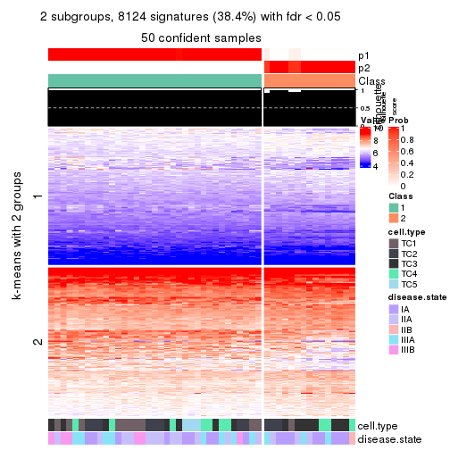</p>

</div>
<div id='tab-ATC-kmeans-get-signatures-no-scale-2'>
<pre><code class="r">get_signatures(res, k = 3, scale_rows = FALSE)
</code></pre>

<p>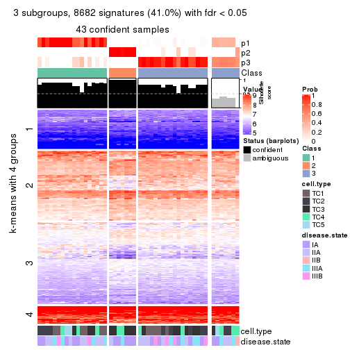</p>

</div>
<div id='tab-ATC-kmeans-get-signatures-no-scale-3'>
<pre><code class="r">get_signatures(res, k = 4, scale_rows = FALSE)
</code></pre>

<p>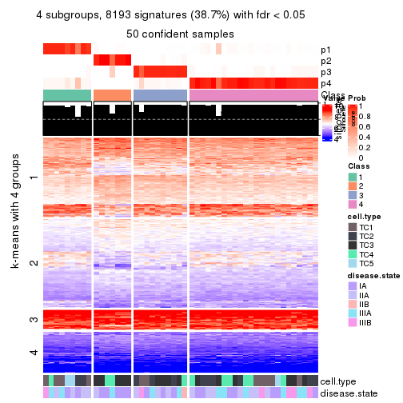</p>

</div>
<div id='tab-ATC-kmeans-get-signatures-no-scale-4'>
<pre><code class="r">get_signatures(res, k = 5, scale_rows = FALSE)
</code></pre>

<p>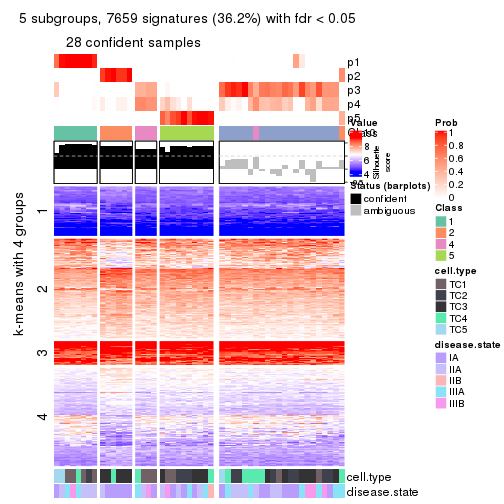</p>

</div>
<div id='tab-ATC-kmeans-get-signatures-no-scale-5'>
<pre><code class="r">get_signatures(res, k = 6, scale_rows = FALSE)
</code></pre>

<p>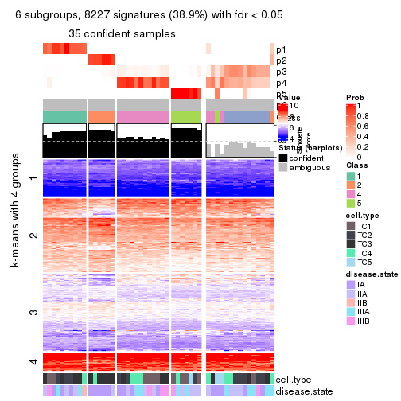</p>

</div>
</div>


Compare the overlap of signatures from different k:

```r
compare_signatures(res)
```

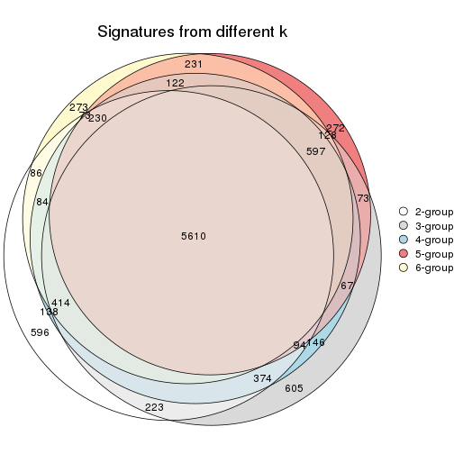

`get_signature()` returns a data frame invisibly. TO get the list of signatures, the function
call should be assigned to a variable explicitly. In following code, if `plot` argument is set
to `FALSE`, no heatmap is plotted while only the differential analysis is performed.

```r
# code only for demonstration
tb = get_signature(res, k = ..., plot = FALSE)
```

An example of the output of `tb` is:

```
#>   which_row         fdr    mean_1    mean_2 scaled_mean_1 scaled_mean_2 km
#> 1        38 0.042760348  8.373488  9.131774    -0.5533452     0.5164555  1
#> 2        40 0.018707592  7.106213  8.469186    -0.6173731     0.5762149  1
#> 3        55 0.019134737 10.221463 11.207825    -0.6159697     0.5749050  1
#> 4        59 0.006059896  5.921854  7.869574    -0.6899429     0.6439467  1
#> 5        60 0.018055526  8.928898 10.211722    -0.6204761     0.5791110  1
#> 6        98 0.009384629 15.714769 14.887706     0.6635654    -0.6193277  2
...
```

The columns in `tb` are:

1. `which_row`: row indices corresponding to the input matrix.
2. `fdr`: FDR for the differential test. 
3. `mean_x`: The mean value in group x.
4. `scaled_mean_x`: The mean value in group x after rows are scaled.
5. `km`: Row groups if k-means clustering is applied to rows.


UMAP plot which shows how samples are separated.


<script>
$( function() {
	$( '#tabs-ATC-kmeans-dimension-reduction' ).tabs();
} );
</script>
<div id='tabs-ATC-kmeans-dimension-reduction'>
<ul>
<li><a href='#tab-ATC-kmeans-dimension-reduction-1'>k = 2</a></li>
<li><a href='#tab-ATC-kmeans-dimension-reduction-2'>k = 3</a></li>
<li><a href='#tab-ATC-kmeans-dimension-reduction-3'>k = 4</a></li>
<li><a href='#tab-ATC-kmeans-dimension-reduction-4'>k = 5</a></li>
<li><a href='#tab-ATC-kmeans-dimension-reduction-5'>k = 6</a></li>
</ul>
<div id='tab-ATC-kmeans-dimension-reduction-1'>
<pre><code class="r">dimension_reduction(res, k = 2, method = &quot;UMAP&quot;)
</code></pre>

<p>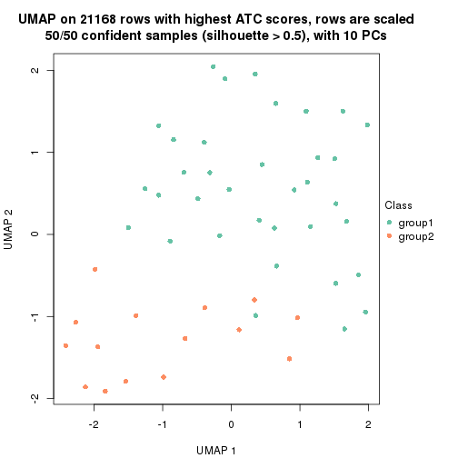</p>

</div>
<div id='tab-ATC-kmeans-dimension-reduction-2'>
<pre><code class="r">dimension_reduction(res, k = 3, method = &quot;UMAP&quot;)
</code></pre>

<p>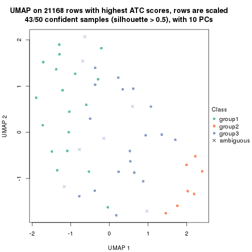</p>

</div>
<div id='tab-ATC-kmeans-dimension-reduction-3'>
<pre><code class="r">dimension_reduction(res, k = 4, method = &quot;UMAP&quot;)
</code></pre>

<p>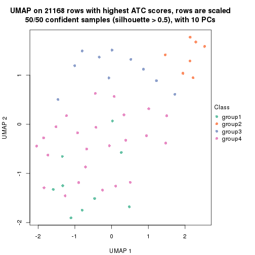</p>

</div>
<div id='tab-ATC-kmeans-dimension-reduction-4'>
<pre><code class="r">dimension_reduction(res, k = 5, method = &quot;UMAP&quot;)
</code></pre>

<p>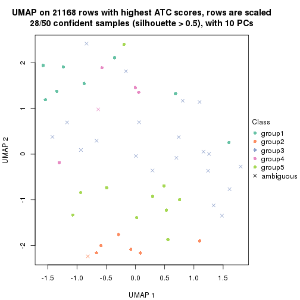</p>

</div>
<div id='tab-ATC-kmeans-dimension-reduction-5'>
<pre><code class="r">dimension_reduction(res, k = 6, method = &quot;UMAP&quot;)
</code></pre>

<p>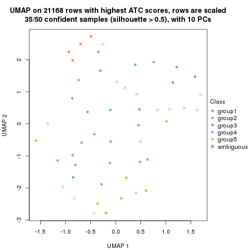</p>

</div>
</div>


Following heatmap shows how subgroups are split when increasing `k`:

```r
collect_classes(res)
```

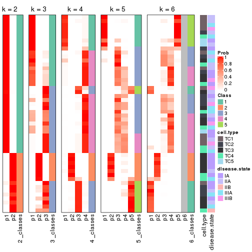


Test correlation between subgroups and known annotations. If the known
annotation is numeric, one-way ANOVA test is applied, and if the known
annotation is discrete, chi-squared contingency table test is applied.

```r
test_to_known_factors(res)
```

```
#>             n cell.type(p) disease.state(p) k
#> ATC:kmeans 50       0.1116           0.0911 2
#> ATC:kmeans 43       0.1301           0.3787 3
#> ATC:kmeans 50       0.0812           0.5904 4
#> ATC:kmeans 28       0.0271           0.5094 5
#> ATC:kmeans 35       0.1198           0.2536 6
```


If matrix rows can be associated to genes, consider to use `functional_enrichment(res,
...)` to perform function enrichment for the signature genes. See [this vignette](http://bioconductor.org/packages/devel/bioc/vignettes/cola/inst/doc/functional_enrichment.html) for more detailed explanations.


 

---------------------------------------------------


### ATC:skmeans**


The object with results only for a single top-value method and a single partition method 
can be extracted as:

```r
res = res_list["ATC", "skmeans"]
# you can also extract it by
# res = res_list["ATC:skmeans"]
```

A summary of `res` and all the functions that can be applied to it:

```r
res
```

```
#> A 'ConsensusPartition' object with k = 2, 3, 4, 5, 6.
#>   On a matrix with 21168 rows and 50 columns.
#>   Top rows (1000, 2000, 3000, 4000, 5000) are extracted by 'ATC' method.
#>   Subgroups are detected by 'skmeans' method.
#>   Performed in total 1250 partitions by row resampling.
#>   Best k for subgroups seems to be 2.
#> 
#> Following methods can be applied to this 'ConsensusPartition' object:
#>  [1] "cola_report"             "collect_classes"         "collect_plots"          
#>  [4] "collect_stats"           "colnames"                "compare_signatures"     
#>  [7] "consensus_heatmap"       "dimension_reduction"     "functional_enrichment"  
#> [10] "get_anno_col"            "get_anno"                "get_classes"            
#> [13] "get_consensus"           "get_matrix"              "get_membership"         
#> [16] "get_param"               "get_signatures"          "get_stats"              
#> [19] "is_best_k"               "is_stable_k"             "membership_heatmap"     
#> [22] "ncol"                    "nrow"                    "plot_ecdf"              
#> [25] "rownames"                "select_partition_number" "show"                   
#> [28] "suggest_best_k"          "test_to_known_factors"
```

`collect_plots()` function collects all the plots made from `res` for all `k` (number of partitions)
into one single page to provide an easy and fast comparison between different `k`.

```r
collect_plots(res)
```

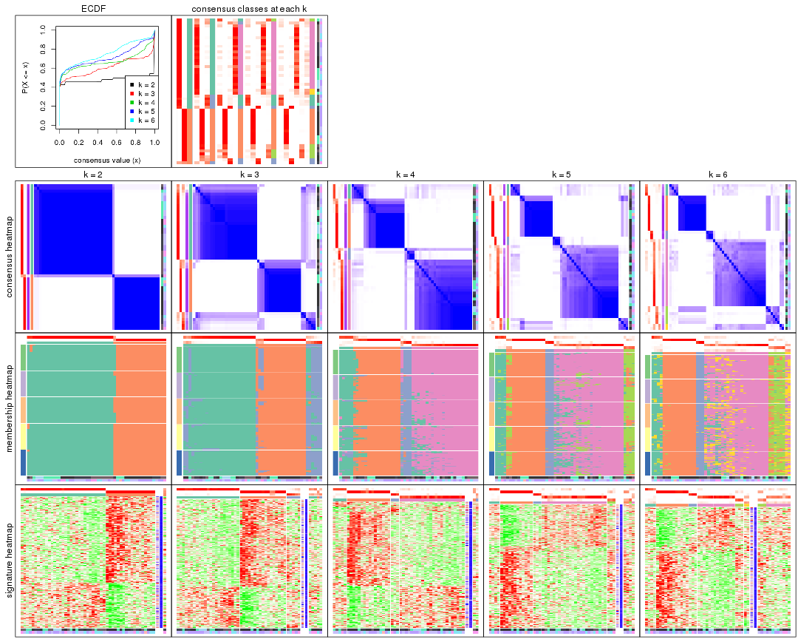

The plots are:

- The first row: a plot of the ECDF (empirical cumulative distribution
  function) curves of the consensus matrix for each `k` and the heatmap of
  predicted classes for each `k`.
- The second row: heatmaps of the consensus matrix for each `k`.
- The third row: heatmaps of the membership matrix for each `k`.
- The fouth row: heatmaps of the signatures for each `k`.

All the plots in panels can be made by individual functions and they are
plotted later in this section.

`select_partition_number()` produces several plots showing different
statistics for choosing "optimized" `k`. There are following statistics:

- ECDF curves of the consensus matrix for each `k`;
- 1-PAC. [The PAC
  score](https://en.wikipedia.org/wiki/Consensus_clustering#Over-interpretation_potential_of_consensus_clustering)
  measures the proportion of the ambiguous subgrouping.
- Mean silhouette score.
- Concordance. The mean probability of fiting the consensus class ids in all
  partitions.
- Area increased. Denote $A_k$ as the area under the ECDF curve for current
  `k`, the area increased is defined as $A_k - A_{k-1}$.
- Rand index. The percent of pairs of samples that are both in a same cluster
  or both are not in a same cluster in the partition of k and k-1.
- Jaccard index. The ratio of pairs of samples are both in a same cluster in
  the partition of k and k-1 and the pairs of samples are both in a same
  cluster in the partition k or k-1.

The detailed explanations of these statistics can be found in [the _cola_
vignette](http://bioconductor.org/packages/devel/bioc/vignettes/cola/inst/doc/cola.html#toc_13).

Generally speaking, lower PAC score, higher mean silhouette score or higher
concordance corresponds to better partition. Rand index and Jaccard index
measure how similar the current partition is compared to partition with `k-1`.
If they are too similar, we won't accept `k` is better than `k-1`.

```r
select_partition_number(res)
```

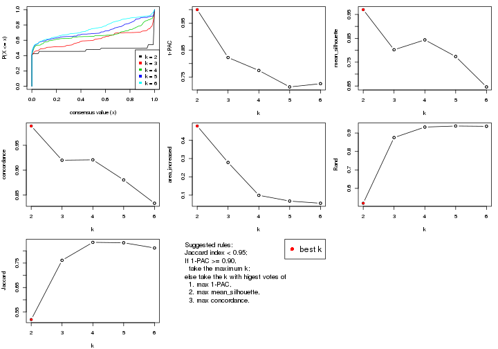

The numeric values for all these statistics can be obtained by `get_stats()`.

```r
get_stats(res)
```

```
#>   k 1-PAC mean_silhouette concordance area_increased  Rand Jaccard
#> 2 2 1.000           0.970       0.989         0.4777 0.519   0.519
#> 3 3 0.822           0.802       0.920         0.2785 0.875   0.761
#> 4 4 0.774           0.844       0.921         0.0991 0.932   0.835
#> 5 5 0.713           0.774       0.880         0.0675 0.938   0.833
#> 6 6 0.725           0.646       0.834         0.0557 0.936   0.812
```

`suggest_best_k()` suggests the best $k$ based on these statistics. The rules are as follows:

- All $k$ with Jaccard index larger than 0.95 are removed because increasing
  $k$ does not provide enough extra information. If all $k$ are removed, it is
  marked as no subgroup is detected.
- For all $k$ with 1-PAC score larger than 0.9, the maximal $k$ is taken as
  the best $k$, and other $k$ are marked as optional $k$.
- If it does not fit the second rule. The $k$ with the maximal vote of the
  highest 1-PAC score, highest mean silhouette, and highest concordance is
  taken as the best $k$.

```r
suggest_best_k(res)
```

```
#> [1] 2
```


Following shows the table of the partitions (You need to click the **show/hide
code output** link to see it). The membership matrix (columns with name `p*`)
is inferred by
[`clue::cl_consensus()`](https://www.rdocumentation.org/link/cl_consensus?package=clue)
function with the `SE` method. Basically the value in the membership matrix
represents the probability to belong to a certain group. The finall class
label for an item is determined with the group with highest probability it
belongs to.

In `get_classes()` function, the entropy is calculated from the membership
matrix and the silhouette score is calculated from the consensus matrix.


<script>
$( function() {
	$( '#tabs-ATC-skmeans-get-classes' ).tabs();
} );
</script>
<div id='tabs-ATC-skmeans-get-classes'>
<ul>
<li><a href='#tab-ATC-skmeans-get-classes-1'>k = 2</a></li>
<li><a href='#tab-ATC-skmeans-get-classes-2'>k = 3</a></li>
<li><a href='#tab-ATC-skmeans-get-classes-3'>k = 4</a></li>
<li><a href='#tab-ATC-skmeans-get-classes-4'>k = 5</a></li>
<li><a href='#tab-ATC-skmeans-get-classes-5'>k = 6</a></li>
</ul>

<div id='tab-ATC-skmeans-get-classes-1'>
<p><a id='tab-ATC-skmeans-get-classes-1-a' style='color:#0366d6' href='#'>show/hide code output</a></p>
<pre><code class="r">cbind(get_classes(res, k = 2), get_membership(res, k = 2))
</code></pre>

<pre><code>#&gt;          class entropy silhouette    p1    p2
#&gt; GSM63448     2  0.0000      0.975 0.000 1.000
#&gt; GSM63449     1  0.0000      0.996 1.000 0.000
#&gt; GSM63423     1  0.0000      0.996 1.000 0.000
#&gt; GSM63425     1  0.0000      0.996 1.000 0.000
#&gt; GSM63437     1  0.3114      0.940 0.944 0.056
#&gt; GSM63453     1  0.0000      0.996 1.000 0.000
#&gt; GSM63431     1  0.0000      0.996 1.000 0.000
#&gt; GSM63450     1  0.0000      0.996 1.000 0.000
#&gt; GSM63428     1  0.0000      0.996 1.000 0.000
#&gt; GSM63432     2  0.0000      0.975 0.000 1.000
#&gt; GSM63458     1  0.0000      0.996 1.000 0.000
#&gt; GSM63434     2  0.0000      0.975 0.000 1.000
#&gt; GSM63435     1  0.0000      0.996 1.000 0.000
#&gt; GSM63442     1  0.0000      0.996 1.000 0.000
#&gt; GSM63451     1  0.2948      0.944 0.948 0.052
#&gt; GSM63422     1  0.0000      0.996 1.000 0.000
#&gt; GSM63438     1  0.0000      0.996 1.000 0.000
#&gt; GSM63439     2  0.0000      0.975 0.000 1.000
#&gt; GSM63461     1  0.0000      0.996 1.000 0.000
#&gt; GSM63463     1  0.0000      0.996 1.000 0.000
#&gt; GSM63430     2  0.0000      0.975 0.000 1.000
#&gt; GSM63446     2  0.9909      0.198 0.444 0.556
#&gt; GSM63429     1  0.0000      0.996 1.000 0.000
#&gt; GSM63445     1  0.0000      0.996 1.000 0.000
#&gt; GSM63447     2  0.0000      0.975 0.000 1.000
#&gt; GSM63459     2  0.0000      0.975 0.000 1.000
#&gt; GSM63464     2  0.0000      0.975 0.000 1.000
#&gt; GSM63469     2  0.0000      0.975 0.000 1.000
#&gt; GSM63470     2  0.0000      0.975 0.000 1.000
#&gt; GSM63436     2  0.0000      0.975 0.000 1.000
#&gt; GSM63443     2  0.0000      0.975 0.000 1.000
#&gt; GSM63465     2  0.0000      0.975 0.000 1.000
#&gt; GSM63444     2  0.0000      0.975 0.000 1.000
#&gt; GSM63456     2  0.0000      0.975 0.000 1.000
#&gt; GSM63462     1  0.0000      0.996 1.000 0.000
#&gt; GSM63424     1  0.0000      0.996 1.000 0.000
#&gt; GSM63440     1  0.0000      0.996 1.000 0.000
#&gt; GSM63433     1  0.0000      0.996 1.000 0.000
#&gt; GSM63466     2  0.0000      0.975 0.000 1.000
#&gt; GSM63426     1  0.0000      0.996 1.000 0.000
#&gt; GSM63468     1  0.0000      0.996 1.000 0.000
#&gt; GSM63452     2  0.0000      0.975 0.000 1.000
#&gt; GSM63441     1  0.0672      0.989 0.992 0.008
#&gt; GSM63454     1  0.0000      0.996 1.000 0.000
#&gt; GSM63455     1  0.0000      0.996 1.000 0.000
#&gt; GSM63460     2  0.0000      0.975 0.000 1.000
#&gt; GSM63467     1  0.0000      0.996 1.000 0.000
#&gt; GSM63421     1  0.0000      0.996 1.000 0.000
#&gt; GSM63427     1  0.0000      0.996 1.000 0.000
#&gt; GSM63457     1  0.0000      0.996 1.000 0.000
</code></pre>

<script>
$('#tab-ATC-skmeans-get-classes-1-a').parent().next().next().hide();
$('#tab-ATC-skmeans-get-classes-1-a').click(function(){
  $('#tab-ATC-skmeans-get-classes-1-a').parent().next().next().toggle();
  return(false);
});
</script>
</div>

<div id='tab-ATC-skmeans-get-classes-2'>
<p><a id='tab-ATC-skmeans-get-classes-2-a' style='color:#0366d6' href='#'>show/hide code output</a></p>
<pre><code class="r">cbind(get_classes(res, k = 3), get_membership(res, k = 3))
</code></pre>

<pre><code>#&gt;          class entropy silhouette    p1    p2    p3
#&gt; GSM63448     2  0.0892     0.9152 0.000 0.980 0.020
#&gt; GSM63449     3  0.5363     0.6102 0.276 0.000 0.724
#&gt; GSM63423     1  0.3116     0.8151 0.892 0.000 0.108
#&gt; GSM63425     1  0.0000     0.9177 1.000 0.000 0.000
#&gt; GSM63437     3  0.1163     0.7043 0.028 0.000 0.972
#&gt; GSM63453     1  0.0000     0.9177 1.000 0.000 0.000
#&gt; GSM63431     1  0.0000     0.9177 1.000 0.000 0.000
#&gt; GSM63450     1  0.0892     0.9086 0.980 0.000 0.020
#&gt; GSM63428     3  0.3340     0.7381 0.120 0.000 0.880
#&gt; GSM63432     2  0.5968     0.5078 0.000 0.636 0.364
#&gt; GSM63458     1  0.0000     0.9177 1.000 0.000 0.000
#&gt; GSM63434     2  0.0000     0.9289 0.000 1.000 0.000
#&gt; GSM63435     1  0.0000     0.9177 1.000 0.000 0.000
#&gt; GSM63442     1  0.1529     0.8918 0.960 0.000 0.040
#&gt; GSM63451     3  0.6865     0.4445 0.384 0.020 0.596
#&gt; GSM63422     1  0.0000     0.9177 1.000 0.000 0.000
#&gt; GSM63438     1  0.1964     0.8789 0.944 0.000 0.056
#&gt; GSM63439     2  0.0000     0.9289 0.000 1.000 0.000
#&gt; GSM63461     1  0.0592     0.9128 0.988 0.000 0.012
#&gt; GSM63463     1  0.1031     0.9042 0.976 0.000 0.024
#&gt; GSM63430     2  0.0424     0.9239 0.000 0.992 0.008
#&gt; GSM63446     3  0.7727     0.5160 0.336 0.064 0.600
#&gt; GSM63429     1  0.1529     0.8924 0.960 0.000 0.040
#&gt; GSM63445     1  0.0000     0.9177 1.000 0.000 0.000
#&gt; GSM63447     2  0.0000     0.9289 0.000 1.000 0.000
#&gt; GSM63459     2  0.0000     0.9289 0.000 1.000 0.000
#&gt; GSM63464     2  0.0000     0.9289 0.000 1.000 0.000
#&gt; GSM63469     2  0.0000     0.9289 0.000 1.000 0.000
#&gt; GSM63470     2  0.0000     0.9289 0.000 1.000 0.000
#&gt; GSM63436     2  0.5733     0.5728 0.000 0.676 0.324
#&gt; GSM63443     2  0.0000     0.9289 0.000 1.000 0.000
#&gt; GSM63465     2  0.0000     0.9289 0.000 1.000 0.000
#&gt; GSM63444     2  0.0000     0.9289 0.000 1.000 0.000
#&gt; GSM63456     2  0.6432     0.2841 0.004 0.568 0.428
#&gt; GSM63462     1  0.0592     0.9128 0.988 0.000 0.012
#&gt; GSM63424     1  0.6308    -0.2435 0.508 0.000 0.492
#&gt; GSM63440     1  0.5733     0.3580 0.676 0.000 0.324
#&gt; GSM63433     1  0.0424     0.9138 0.992 0.000 0.008
#&gt; GSM63466     2  0.0000     0.9289 0.000 1.000 0.000
#&gt; GSM63426     1  0.6140     0.0991 0.596 0.000 0.404
#&gt; GSM63468     1  0.0592     0.9128 0.988 0.000 0.012
#&gt; GSM63452     2  0.0000     0.9289 0.000 1.000 0.000
#&gt; GSM63441     3  0.1964     0.7258 0.056 0.000 0.944
#&gt; GSM63454     1  0.0000     0.9177 1.000 0.000 0.000
#&gt; GSM63455     1  0.0000     0.9177 1.000 0.000 0.000
#&gt; GSM63460     2  0.0000     0.9289 0.000 1.000 0.000
#&gt; GSM63467     1  0.0592     0.9128 0.988 0.000 0.012
#&gt; GSM63421     1  0.0000     0.9177 1.000 0.000 0.000
#&gt; GSM63427     1  0.0000     0.9177 1.000 0.000 0.000
#&gt; GSM63457     1  0.0000     0.9177 1.000 0.000 0.000
</code></pre>

<script>
$('#tab-ATC-skmeans-get-classes-2-a').parent().next().next().hide();
$('#tab-ATC-skmeans-get-classes-2-a').click(function(){
  $('#tab-ATC-skmeans-get-classes-2-a').parent().next().next().toggle();
  return(false);
});
</script>
</div>

<div id='tab-ATC-skmeans-get-classes-3'>
<p><a id='tab-ATC-skmeans-get-classes-3-a' style='color:#0366d6' href='#'>show/hide code output</a></p>
<pre><code class="r">cbind(get_classes(res, k = 4), get_membership(res, k = 4))
</code></pre>

<pre><code>#&gt;          class entropy silhouette    p1    p2    p3    p4
#&gt; GSM63448     2  0.2412      0.883 0.084 0.908 0.008 0.000
#&gt; GSM63449     1  0.3617      0.842 0.860 0.000 0.064 0.076
#&gt; GSM63423     4  0.4964      0.667 0.256 0.000 0.028 0.716
#&gt; GSM63425     4  0.0000      0.922 0.000 0.000 0.000 1.000
#&gt; GSM63437     1  0.2737      0.871 0.888 0.000 0.104 0.008
#&gt; GSM63453     4  0.0000      0.922 0.000 0.000 0.000 1.000
#&gt; GSM63431     4  0.0000      0.922 0.000 0.000 0.000 1.000
#&gt; GSM63450     4  0.2149      0.879 0.000 0.000 0.088 0.912
#&gt; GSM63428     1  0.2813      0.877 0.896 0.000 0.080 0.024
#&gt; GSM63432     2  0.5508      0.231 0.476 0.508 0.016 0.000
#&gt; GSM63458     4  0.0000      0.922 0.000 0.000 0.000 1.000
#&gt; GSM63434     2  0.0000      0.933 0.000 1.000 0.000 0.000
#&gt; GSM63435     4  0.0188      0.922 0.000 0.000 0.004 0.996
#&gt; GSM63442     4  0.3032      0.854 0.124 0.000 0.008 0.868
#&gt; GSM63451     3  0.0469      0.704 0.000 0.000 0.988 0.012
#&gt; GSM63422     4  0.0000      0.922 0.000 0.000 0.000 1.000
#&gt; GSM63438     4  0.4375      0.772 0.180 0.000 0.032 0.788
#&gt; GSM63439     2  0.2179      0.893 0.064 0.924 0.012 0.000
#&gt; GSM63461     4  0.0672      0.921 0.008 0.000 0.008 0.984
#&gt; GSM63463     4  0.3863      0.803 0.028 0.000 0.144 0.828
#&gt; GSM63430     2  0.2676      0.874 0.092 0.896 0.012 0.000
#&gt; GSM63446     3  0.0524      0.704 0.000 0.004 0.988 0.008
#&gt; GSM63429     4  0.3659      0.828 0.136 0.000 0.024 0.840
#&gt; GSM63445     4  0.0592      0.920 0.016 0.000 0.000 0.984
#&gt; GSM63447     2  0.0000      0.933 0.000 1.000 0.000 0.000
#&gt; GSM63459     2  0.0000      0.933 0.000 1.000 0.000 0.000
#&gt; GSM63464     2  0.0000      0.933 0.000 1.000 0.000 0.000
#&gt; GSM63469     2  0.0000      0.933 0.000 1.000 0.000 0.000
#&gt; GSM63470     2  0.0000      0.933 0.000 1.000 0.000 0.000
#&gt; GSM63436     2  0.4936      0.606 0.316 0.672 0.012 0.000
#&gt; GSM63443     2  0.0000      0.933 0.000 1.000 0.000 0.000
#&gt; GSM63465     2  0.0000      0.933 0.000 1.000 0.000 0.000
#&gt; GSM63444     2  0.0000      0.933 0.000 1.000 0.000 0.000
#&gt; GSM63456     3  0.2345      0.645 0.000 0.100 0.900 0.000
#&gt; GSM63462     4  0.0779      0.920 0.004 0.000 0.016 0.980
#&gt; GSM63424     3  0.6854      0.234 0.120 0.000 0.548 0.332
#&gt; GSM63440     4  0.5517      0.663 0.092 0.000 0.184 0.724
#&gt; GSM63433     4  0.2342      0.887 0.080 0.000 0.008 0.912
#&gt; GSM63466     2  0.0000      0.933 0.000 1.000 0.000 0.000
#&gt; GSM63426     1  0.3142      0.716 0.860 0.000 0.008 0.132
#&gt; GSM63468     4  0.0779      0.920 0.004 0.000 0.016 0.980
#&gt; GSM63452     2  0.0000      0.933 0.000 1.000 0.000 0.000
#&gt; GSM63441     1  0.2805      0.872 0.888 0.000 0.100 0.012
#&gt; GSM63454     4  0.2742      0.880 0.076 0.000 0.024 0.900
#&gt; GSM63455     4  0.0000      0.922 0.000 0.000 0.000 1.000
#&gt; GSM63460     2  0.0000      0.933 0.000 1.000 0.000 0.000
#&gt; GSM63467     4  0.1854      0.902 0.048 0.000 0.012 0.940
#&gt; GSM63421     4  0.0000      0.922 0.000 0.000 0.000 1.000
#&gt; GSM63427     4  0.1211      0.913 0.040 0.000 0.000 0.960
#&gt; GSM63457     4  0.0000      0.922 0.000 0.000 0.000 1.000
</code></pre>

<script>
$('#tab-ATC-skmeans-get-classes-3-a').parent().next().next().hide();
$('#tab-ATC-skmeans-get-classes-3-a').click(function(){
  $('#tab-ATC-skmeans-get-classes-3-a').parent().next().next().toggle();
  return(false);
});
</script>
</div>

<div id='tab-ATC-skmeans-get-classes-4'>
<p><a id='tab-ATC-skmeans-get-classes-4-a' style='color:#0366d6' href='#'>show/hide code output</a></p>
<pre><code class="r">cbind(get_classes(res, k = 5), get_membership(res, k = 5))
</code></pre>

<pre><code>#&gt;          class entropy silhouette    p1    p2    p3    p4    p5
#&gt; GSM63448     2  0.4517    -0.0942 0.008 0.556 0.000 0.000 0.436
#&gt; GSM63449     1  0.3427     0.8307 0.844 0.000 0.004 0.056 0.096
#&gt; GSM63423     4  0.4671     0.5604 0.332 0.000 0.000 0.640 0.028
#&gt; GSM63425     4  0.0324     0.8570 0.004 0.000 0.000 0.992 0.004
#&gt; GSM63437     1  0.1243     0.8908 0.960 0.000 0.008 0.004 0.028
#&gt; GSM63453     4  0.0000     0.8574 0.000 0.000 0.000 1.000 0.000
#&gt; GSM63431     4  0.0000     0.8574 0.000 0.000 0.000 1.000 0.000
#&gt; GSM63450     4  0.2843     0.8014 0.000 0.000 0.144 0.848 0.008
#&gt; GSM63428     1  0.1704     0.8757 0.928 0.000 0.000 0.004 0.068
#&gt; GSM63432     5  0.4267     0.6741 0.092 0.120 0.004 0.000 0.784
#&gt; GSM63458     4  0.0000     0.8574 0.000 0.000 0.000 1.000 0.000
#&gt; GSM63434     2  0.0162     0.9096 0.000 0.996 0.000 0.000 0.004
#&gt; GSM63435     4  0.0324     0.8571 0.004 0.000 0.000 0.992 0.004
#&gt; GSM63442     4  0.2806     0.8045 0.152 0.000 0.000 0.844 0.004
#&gt; GSM63451     3  0.0451     0.9528 0.008 0.004 0.988 0.000 0.000
#&gt; GSM63422     4  0.0000     0.8574 0.000 0.000 0.000 1.000 0.000
#&gt; GSM63438     4  0.4393     0.7351 0.208 0.000 0.012 0.748 0.032
#&gt; GSM63439     2  0.4210     0.0412 0.000 0.588 0.000 0.000 0.412
#&gt; GSM63461     4  0.2804     0.8303 0.012 0.000 0.016 0.880 0.092
#&gt; GSM63463     4  0.5943     0.5997 0.012 0.000 0.164 0.632 0.192
#&gt; GSM63430     5  0.4088     0.5133 0.000 0.368 0.000 0.000 0.632
#&gt; GSM63446     3  0.0579     0.9554 0.008 0.008 0.984 0.000 0.000
#&gt; GSM63429     4  0.3612     0.7750 0.184 0.000 0.004 0.796 0.016
#&gt; GSM63445     4  0.3297     0.8144 0.020 0.000 0.008 0.840 0.132
#&gt; GSM63447     2  0.0162     0.9100 0.000 0.996 0.000 0.000 0.004
#&gt; GSM63459     2  0.0000     0.9127 0.000 1.000 0.000 0.000 0.000
#&gt; GSM63464     2  0.0000     0.9127 0.000 1.000 0.000 0.000 0.000
#&gt; GSM63469     2  0.0000     0.9127 0.000 1.000 0.000 0.000 0.000
#&gt; GSM63470     2  0.0000     0.9127 0.000 1.000 0.000 0.000 0.000
#&gt; GSM63436     5  0.4509     0.7096 0.044 0.224 0.004 0.000 0.728
#&gt; GSM63443     2  0.0000     0.9127 0.000 1.000 0.000 0.000 0.000
#&gt; GSM63465     2  0.0162     0.9100 0.000 0.996 0.000 0.000 0.004
#&gt; GSM63444     2  0.0000     0.9127 0.000 1.000 0.000 0.000 0.000
#&gt; GSM63456     3  0.1628     0.9158 0.000 0.056 0.936 0.000 0.008
#&gt; GSM63462     4  0.1059     0.8560 0.008 0.000 0.004 0.968 0.020
#&gt; GSM63424     4  0.7564     0.0515 0.216 0.000 0.332 0.400 0.052
#&gt; GSM63440     4  0.5080     0.7233 0.156 0.000 0.080 0.736 0.028
#&gt; GSM63433     4  0.3304     0.7867 0.168 0.000 0.000 0.816 0.016
#&gt; GSM63466     2  0.0000     0.9127 0.000 1.000 0.000 0.000 0.000
#&gt; GSM63426     5  0.4085     0.4055 0.208 0.000 0.004 0.028 0.760
#&gt; GSM63468     4  0.1547     0.8520 0.004 0.000 0.016 0.948 0.032
#&gt; GSM63452     2  0.0000     0.9127 0.000 1.000 0.000 0.000 0.000
#&gt; GSM63441     1  0.3187     0.8597 0.864 0.000 0.036 0.012 0.088
#&gt; GSM63454     4  0.2754     0.8316 0.080 0.000 0.004 0.884 0.032
#&gt; GSM63455     4  0.0000     0.8574 0.000 0.000 0.000 1.000 0.000
#&gt; GSM63460     2  0.0000     0.9127 0.000 1.000 0.000 0.000 0.000
#&gt; GSM63467     4  0.4970     0.6526 0.016 0.000 0.032 0.672 0.280
#&gt; GSM63421     4  0.0000     0.8574 0.000 0.000 0.000 1.000 0.000
#&gt; GSM63427     4  0.3658     0.8137 0.044 0.000 0.012 0.832 0.112
#&gt; GSM63457     4  0.0000     0.8574 0.000 0.000 0.000 1.000 0.000
</code></pre>

<script>
$('#tab-ATC-skmeans-get-classes-4-a').parent().next().next().hide();
$('#tab-ATC-skmeans-get-classes-4-a').click(function(){
  $('#tab-ATC-skmeans-get-classes-4-a').parent().next().next().toggle();
  return(false);
});
</script>
</div>

<div id='tab-ATC-skmeans-get-classes-5'>
<p><a id='tab-ATC-skmeans-get-classes-5-a' style='color:#0366d6' href='#'>show/hide code output</a></p>
<pre><code class="r">cbind(get_classes(res, k = 6), get_membership(res, k = 6))
</code></pre>

<pre><code>#&gt;          class entropy silhouette    p1    p2    p3    p4    p5    p6
#&gt; GSM63448     5  0.4389      0.463 0.008 0.444 0.000 0.000 0.536 0.012
#&gt; GSM63449     1  0.6247      0.614 0.580 0.000 0.012 0.100 0.064 0.244
#&gt; GSM63423     4  0.5523      0.279 0.220 0.000 0.004 0.608 0.008 0.160
#&gt; GSM63425     4  0.0622      0.669 0.008 0.000 0.000 0.980 0.000 0.012
#&gt; GSM63437     1  0.0972      0.757 0.964 0.000 0.008 0.000 0.028 0.000
#&gt; GSM63453     4  0.0865      0.659 0.000 0.000 0.000 0.964 0.000 0.036
#&gt; GSM63431     4  0.0146      0.666 0.000 0.000 0.000 0.996 0.000 0.004
#&gt; GSM63450     4  0.3356      0.538 0.000 0.000 0.100 0.824 0.004 0.072
#&gt; GSM63428     1  0.4311      0.728 0.760 0.000 0.008 0.012 0.072 0.148
#&gt; GSM63432     5  0.3141      0.553 0.028 0.064 0.000 0.000 0.856 0.052
#&gt; GSM63458     4  0.0000      0.666 0.000 0.000 0.000 1.000 0.000 0.000
#&gt; GSM63434     2  0.0713      0.967 0.000 0.972 0.000 0.000 0.028 0.000
#&gt; GSM63435     4  0.0790      0.665 0.000 0.000 0.000 0.968 0.000 0.032
#&gt; GSM63442     4  0.3880      0.553 0.120 0.000 0.004 0.780 0.000 0.096
#&gt; GSM63451     3  0.0000      0.946 0.000 0.000 1.000 0.000 0.000 0.000
#&gt; GSM63422     4  0.0260      0.666 0.000 0.000 0.000 0.992 0.000 0.008
#&gt; GSM63438     4  0.6107      0.121 0.232 0.000 0.024 0.572 0.012 0.160
#&gt; GSM63439     5  0.3986      0.420 0.000 0.464 0.000 0.000 0.532 0.004
#&gt; GSM63461     4  0.3521      0.228 0.000 0.000 0.004 0.724 0.004 0.268
#&gt; GSM63463     6  0.5828      0.695 0.000 0.000 0.088 0.408 0.032 0.472
#&gt; GSM63430     5  0.3287      0.656 0.000 0.220 0.000 0.000 0.768 0.012
#&gt; GSM63446     3  0.0146      0.945 0.000 0.000 0.996 0.000 0.000 0.004
#&gt; GSM63429     4  0.4548      0.509 0.120 0.000 0.004 0.732 0.008 0.136
#&gt; GSM63445     4  0.3934      0.215 0.000 0.000 0.000 0.676 0.020 0.304
#&gt; GSM63447     2  0.0547      0.975 0.000 0.980 0.000 0.000 0.020 0.000
#&gt; GSM63459     2  0.0000      0.991 0.000 1.000 0.000 0.000 0.000 0.000
#&gt; GSM63464     2  0.0000      0.991 0.000 1.000 0.000 0.000 0.000 0.000
#&gt; GSM63469     2  0.0000      0.991 0.000 1.000 0.000 0.000 0.000 0.000
#&gt; GSM63470     2  0.0000      0.991 0.000 1.000 0.000 0.000 0.000 0.000
#&gt; GSM63436     5  0.4018      0.624 0.024 0.160 0.000 0.000 0.772 0.044
#&gt; GSM63443     2  0.0000      0.991 0.000 1.000 0.000 0.000 0.000 0.000
#&gt; GSM63465     2  0.0806      0.968 0.000 0.972 0.000 0.000 0.020 0.008
#&gt; GSM63444     2  0.0000      0.991 0.000 1.000 0.000 0.000 0.000 0.000
#&gt; GSM63456     3  0.1707      0.896 0.004 0.056 0.928 0.000 0.000 0.012
#&gt; GSM63462     4  0.1700      0.631 0.000 0.000 0.004 0.916 0.000 0.080
#&gt; GSM63424     4  0.8164     -0.303 0.168 0.000 0.260 0.304 0.032 0.236
#&gt; GSM63440     4  0.6252      0.268 0.124 0.000 0.084 0.612 0.012 0.168
#&gt; GSM63433     4  0.4659      0.458 0.140 0.000 0.000 0.716 0.012 0.132
#&gt; GSM63466     2  0.0000      0.991 0.000 1.000 0.000 0.000 0.000 0.000
#&gt; GSM63426     5  0.4705      0.271 0.104 0.000 0.000 0.016 0.712 0.168
#&gt; GSM63468     4  0.2261      0.594 0.004 0.000 0.008 0.884 0.000 0.104
#&gt; GSM63452     2  0.0000      0.991 0.000 1.000 0.000 0.000 0.000 0.000
#&gt; GSM63441     1  0.3717      0.706 0.808 0.000 0.016 0.000 0.084 0.092
#&gt; GSM63454     4  0.5655      0.256 0.144 0.000 0.020 0.656 0.024 0.156
#&gt; GSM63455     4  0.0146      0.666 0.000 0.000 0.000 0.996 0.000 0.004
#&gt; GSM63460     2  0.0000      0.991 0.000 1.000 0.000 0.000 0.000 0.000
#&gt; GSM63467     6  0.5064      0.703 0.000 0.000 0.008 0.392 0.060 0.540
#&gt; GSM63421     4  0.0777      0.668 0.004 0.000 0.000 0.972 0.000 0.024
#&gt; GSM63427     4  0.4812      0.161 0.024 0.000 0.000 0.652 0.044 0.280
#&gt; GSM63457     4  0.0146      0.666 0.000 0.000 0.000 0.996 0.000 0.004
</code></pre>

<script>
$('#tab-ATC-skmeans-get-classes-5-a').parent().next().next().hide();
$('#tab-ATC-skmeans-get-classes-5-a').click(function(){
  $('#tab-ATC-skmeans-get-classes-5-a').parent().next().next().toggle();
  return(false);
});
</script>
</div>
</div>

Heatmaps for the consensus matrix. It visualizes the probability of two
samples to be in a same group.


<script>
$( function() {
	$( '#tabs-ATC-skmeans-consensus-heatmap' ).tabs();
} );
</script>
<div id='tabs-ATC-skmeans-consensus-heatmap'>
<ul>
<li><a href='#tab-ATC-skmeans-consensus-heatmap-1'>k = 2</a></li>
<li><a href='#tab-ATC-skmeans-consensus-heatmap-2'>k = 3</a></li>
<li><a href='#tab-ATC-skmeans-consensus-heatmap-3'>k = 4</a></li>
<li><a href='#tab-ATC-skmeans-consensus-heatmap-4'>k = 5</a></li>
<li><a href='#tab-ATC-skmeans-consensus-heatmap-5'>k = 6</a></li>
</ul>
<div id='tab-ATC-skmeans-consensus-heatmap-1'>
<pre><code class="r">consensus_heatmap(res, k = 2)
</code></pre>

<p>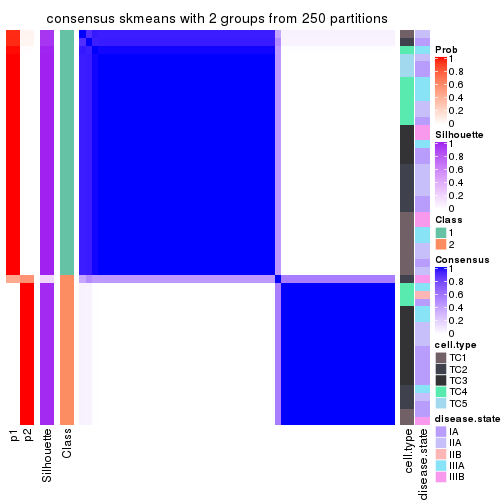</p>

</div>
<div id='tab-ATC-skmeans-consensus-heatmap-2'>
<pre><code class="r">consensus_heatmap(res, k = 3)
</code></pre>

<p>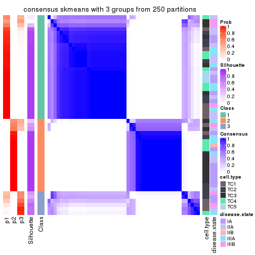</p>

</div>
<div id='tab-ATC-skmeans-consensus-heatmap-3'>
<pre><code class="r">consensus_heatmap(res, k = 4)
</code></pre>

<p>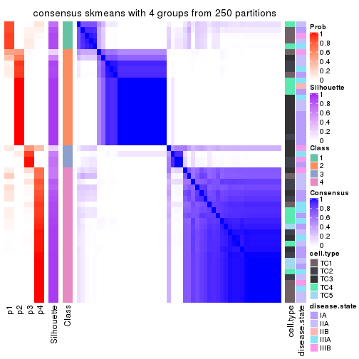</p>

</div>
<div id='tab-ATC-skmeans-consensus-heatmap-4'>
<pre><code class="r">consensus_heatmap(res, k = 5)
</code></pre>

<p>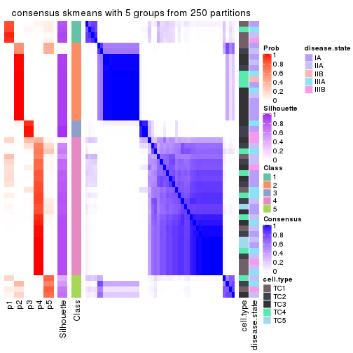</p>

</div>
<div id='tab-ATC-skmeans-consensus-heatmap-5'>
<pre><code class="r">consensus_heatmap(res, k = 6)
</code></pre>

<p>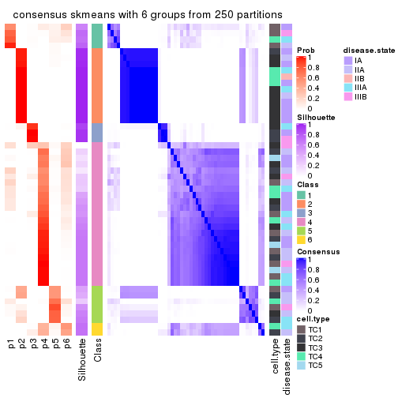</p>

</div>
</div>

Heatmaps for the membership of samples in all partitions to see how consistent they are:


<script>
$( function() {
	$( '#tabs-ATC-skmeans-membership-heatmap' ).tabs();
} );
</script>
<div id='tabs-ATC-skmeans-membership-heatmap'>
<ul>
<li><a href='#tab-ATC-skmeans-membership-heatmap-1'>k = 2</a></li>
<li><a href='#tab-ATC-skmeans-membership-heatmap-2'>k = 3</a></li>
<li><a href='#tab-ATC-skmeans-membership-heatmap-3'>k = 4</a></li>
<li><a href='#tab-ATC-skmeans-membership-heatmap-4'>k = 5</a></li>
<li><a href='#tab-ATC-skmeans-membership-heatmap-5'>k = 6</a></li>
</ul>
<div id='tab-ATC-skmeans-membership-heatmap-1'>
<pre><code class="r">membership_heatmap(res, k = 2)
</code></pre>

<p>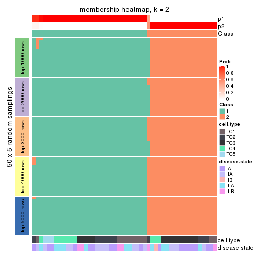</p>

</div>
<div id='tab-ATC-skmeans-membership-heatmap-2'>
<pre><code class="r">membership_heatmap(res, k = 3)
</code></pre>

<p>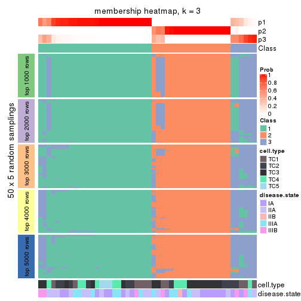</p>

</div>
<div id='tab-ATC-skmeans-membership-heatmap-3'>
<pre><code class="r">membership_heatmap(res, k = 4)
</code></pre>

<p>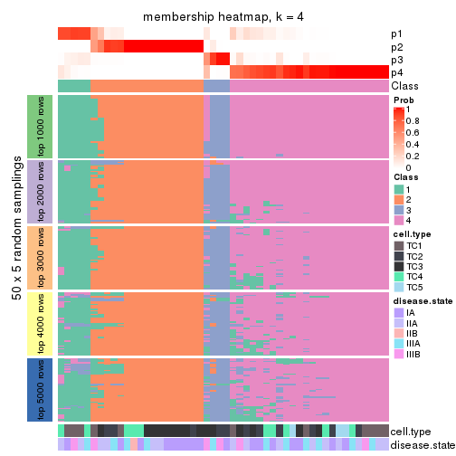</p>

</div>
<div id='tab-ATC-skmeans-membership-heatmap-4'>
<pre><code class="r">membership_heatmap(res, k = 5)
</code></pre>

<p>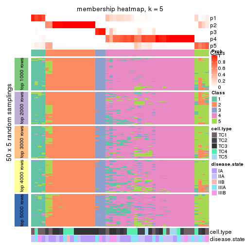</p>

</div>
<div id='tab-ATC-skmeans-membership-heatmap-5'>
<pre><code class="r">membership_heatmap(res, k = 6)
</code></pre>

<p>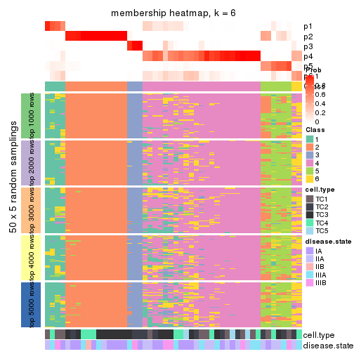</p>

</div>
</div>

As soon as we have had the classes for columns, we can look for signatures
which are significantly different between classes which can be candidate marks
for certain classes. Following are the heatmaps for signatures.


Signature heatmaps where rows are scaled:


<script>
$( function() {
	$( '#tabs-ATC-skmeans-get-signatures' ).tabs();
} );
</script>
<div id='tabs-ATC-skmeans-get-signatures'>
<ul>
<li><a href='#tab-ATC-skmeans-get-signatures-1'>k = 2</a></li>
<li><a href='#tab-ATC-skmeans-get-signatures-2'>k = 3</a></li>
<li><a href='#tab-ATC-skmeans-get-signatures-3'>k = 4</a></li>
<li><a href='#tab-ATC-skmeans-get-signatures-4'>k = 5</a></li>
<li><a href='#tab-ATC-skmeans-get-signatures-5'>k = 6</a></li>
</ul>
<div id='tab-ATC-skmeans-get-signatures-1'>
<pre><code class="r">get_signatures(res, k = 2)
</code></pre>

<p>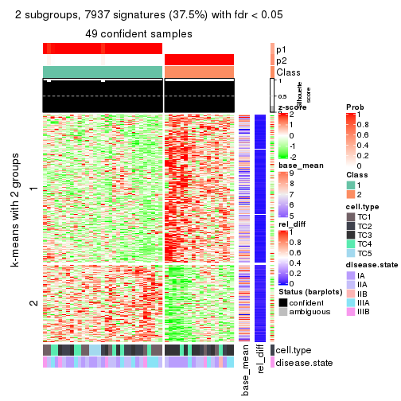</p>

</div>
<div id='tab-ATC-skmeans-get-signatures-2'>
<pre><code class="r">get_signatures(res, k = 3)
</code></pre>

<p>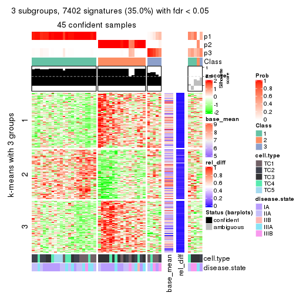</p>

</div>
<div id='tab-ATC-skmeans-get-signatures-3'>
<pre><code class="r">get_signatures(res, k = 4)
</code></pre>

<p>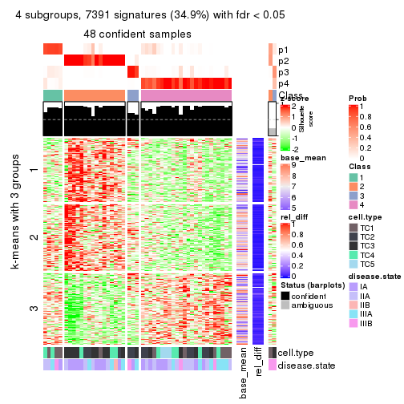</p>

</div>
<div id='tab-ATC-skmeans-get-signatures-4'>
<pre><code class="r">get_signatures(res, k = 5)
</code></pre>

<p>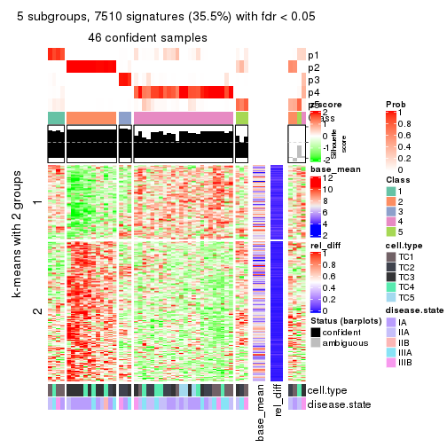</p>

</div>
<div id='tab-ATC-skmeans-get-signatures-5'>
<pre><code class="r">get_signatures(res, k = 6)
</code></pre>

<p>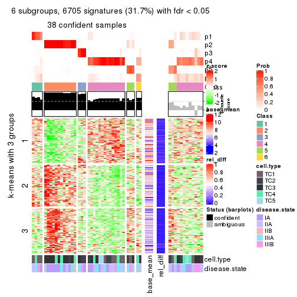</p>

</div>
</div>


Signature heatmaps where rows are not scaled:


<script>
$( function() {
	$( '#tabs-ATC-skmeans-get-signatures-no-scale' ).tabs();
} );
</script>
<div id='tabs-ATC-skmeans-get-signatures-no-scale'>
<ul>
<li><a href='#tab-ATC-skmeans-get-signatures-no-scale-1'>k = 2</a></li>
<li><a href='#tab-ATC-skmeans-get-signatures-no-scale-2'>k = 3</a></li>
<li><a href='#tab-ATC-skmeans-get-signatures-no-scale-3'>k = 4</a></li>
<li><a href='#tab-ATC-skmeans-get-signatures-no-scale-4'>k = 5</a></li>
<li><a href='#tab-ATC-skmeans-get-signatures-no-scale-5'>k = 6</a></li>
</ul>
<div id='tab-ATC-skmeans-get-signatures-no-scale-1'>
<pre><code class="r">get_signatures(res, k = 2, scale_rows = FALSE)
</code></pre>

<p>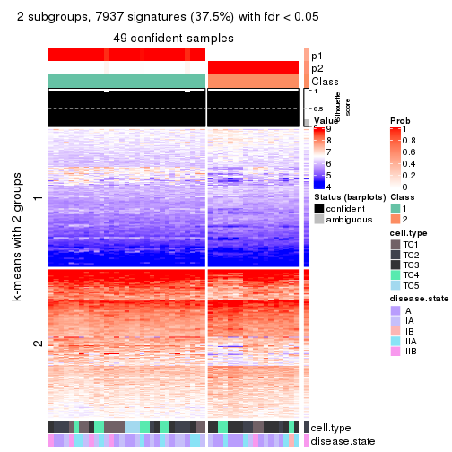</p>

</div>
<div id='tab-ATC-skmeans-get-signatures-no-scale-2'>
<pre><code class="r">get_signatures(res, k = 3, scale_rows = FALSE)
</code></pre>

<p>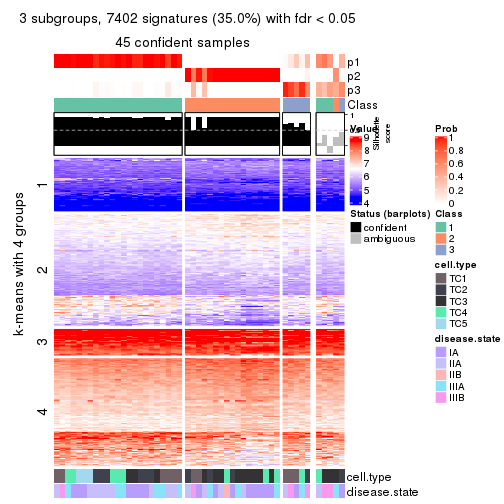</p>

</div>
<div id='tab-ATC-skmeans-get-signatures-no-scale-3'>
<pre><code class="r">get_signatures(res, k = 4, scale_rows = FALSE)
</code></pre>

<p>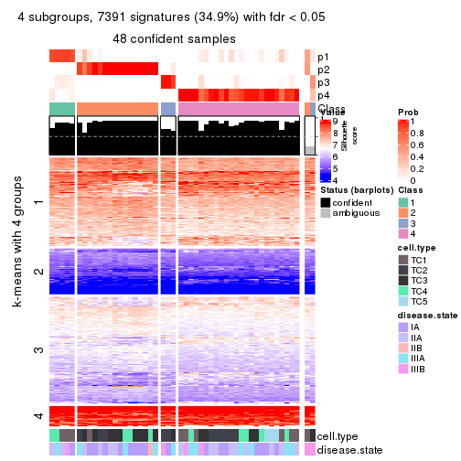</p>

</div>
<div id='tab-ATC-skmeans-get-signatures-no-scale-4'>
<pre><code class="r">get_signatures(res, k = 5, scale_rows = FALSE)
</code></pre>

<p>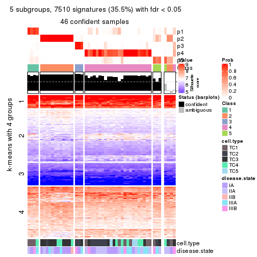</p>

</div>
<div id='tab-ATC-skmeans-get-signatures-no-scale-5'>
<pre><code class="r">get_signatures(res, k = 6, scale_rows = FALSE)
</code></pre>

<p>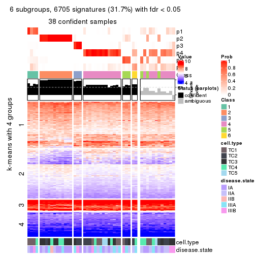</p>

</div>
</div>


Compare the overlap of signatures from different k:

```r
compare_signatures(res)
```

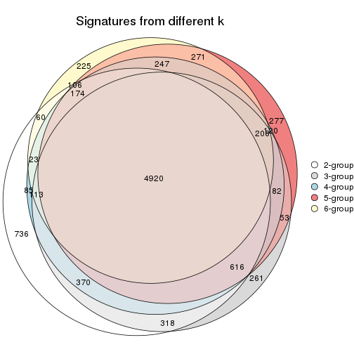

`get_signature()` returns a data frame invisibly. TO get the list of signatures, the function
call should be assigned to a variable explicitly. In following code, if `plot` argument is set
to `FALSE`, no heatmap is plotted while only the differential analysis is performed.

```r
# code only for demonstration
tb = get_signature(res, k = ..., plot = FALSE)
```

An example of the output of `tb` is:

```
#>   which_row         fdr    mean_1    mean_2 scaled_mean_1 scaled_mean_2 km
#> 1        38 0.042760348  8.373488  9.131774    -0.5533452     0.5164555  1
#> 2        40 0.018707592  7.106213  8.469186    -0.6173731     0.5762149  1
#> 3        55 0.019134737 10.221463 11.207825    -0.6159697     0.5749050  1
#> 4        59 0.006059896  5.921854  7.869574    -0.6899429     0.6439467  1
#> 5        60 0.018055526  8.928898 10.211722    -0.6204761     0.5791110  1
#> 6        98 0.009384629 15.714769 14.887706     0.6635654    -0.6193277  2
...
```

The columns in `tb` are:

1. `which_row`: row indices corresponding to the input matrix.
2. `fdr`: FDR for the differential test. 
3. `mean_x`: The mean value in group x.
4. `scaled_mean_x`: The mean value in group x after rows are scaled.
5. `km`: Row groups if k-means clustering is applied to rows.


UMAP plot which shows how samples are separated.


<script>
$( function() {
	$( '#tabs-ATC-skmeans-dimension-reduction' ).tabs();
} );
</script>
<div id='tabs-ATC-skmeans-dimension-reduction'>
<ul>
<li><a href='#tab-ATC-skmeans-dimension-reduction-1'>k = 2</a></li>
<li><a href='#tab-ATC-skmeans-dimension-reduction-2'>k = 3</a></li>
<li><a href='#tab-ATC-skmeans-dimension-reduction-3'>k = 4</a></li>
<li><a href='#tab-ATC-skmeans-dimension-reduction-4'>k = 5</a></li>
<li><a href='#tab-ATC-skmeans-dimension-reduction-5'>k = 6</a></li>
</ul>
<div id='tab-ATC-skmeans-dimension-reduction-1'>
<pre><code class="r">dimension_reduction(res, k = 2, method = &quot;UMAP&quot;)
</code></pre>

<p>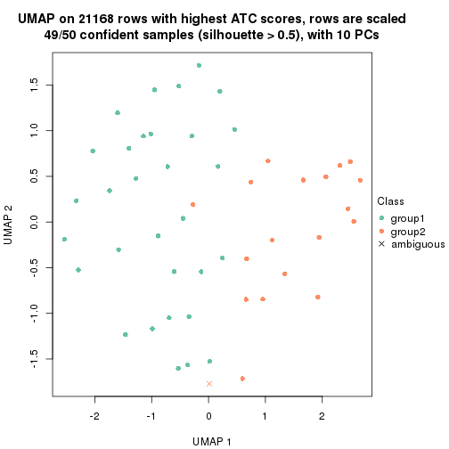</p>

</div>
<div id='tab-ATC-skmeans-dimension-reduction-2'>
<pre><code class="r">dimension_reduction(res, k = 3, method = &quot;UMAP&quot;)
</code></pre>

<p>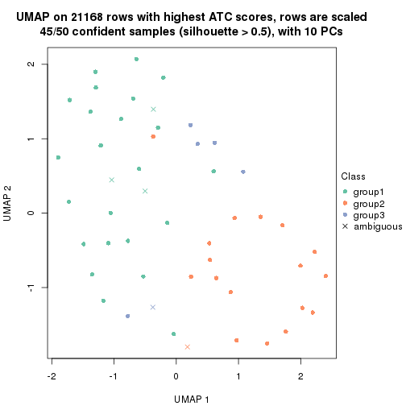</p>

</div>
<div id='tab-ATC-skmeans-dimension-reduction-3'>
<pre><code class="r">dimension_reduction(res, k = 4, method = &quot;UMAP&quot;)
</code></pre>

<p>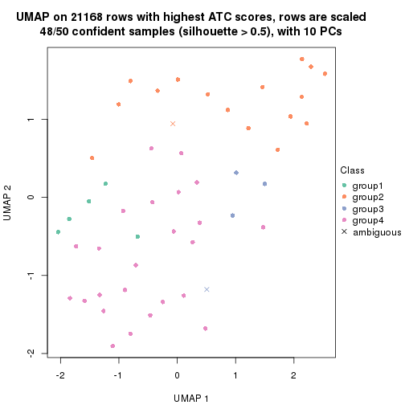</p>

</div>
<div id='tab-ATC-skmeans-dimension-reduction-4'>
<pre><code class="r">dimension_reduction(res, k = 5, method = &quot;UMAP&quot;)
</code></pre>

<p>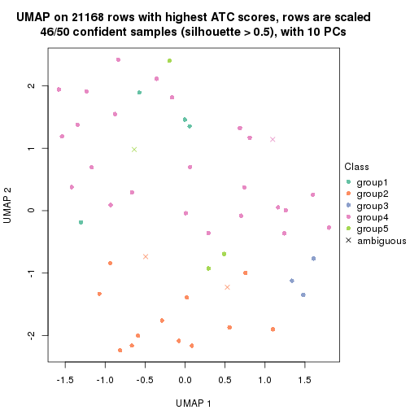</p>

</div>
<div id='tab-ATC-skmeans-dimension-reduction-5'>
<pre><code class="r">dimension_reduction(res, k = 6, method = &quot;UMAP&quot;)
</code></pre>

<p>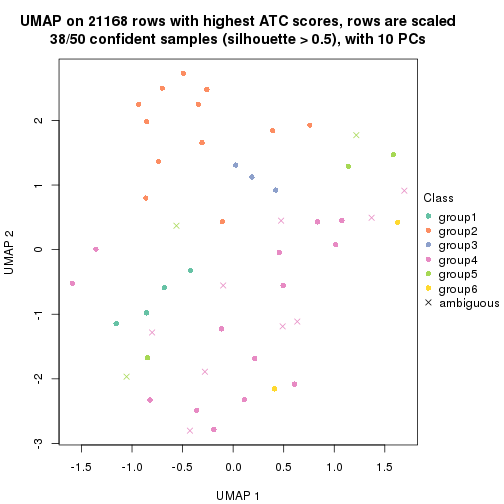</p>

</div>
</div>


Following heatmap shows how subgroups are split when increasing `k`:

```r
collect_classes(res)
```

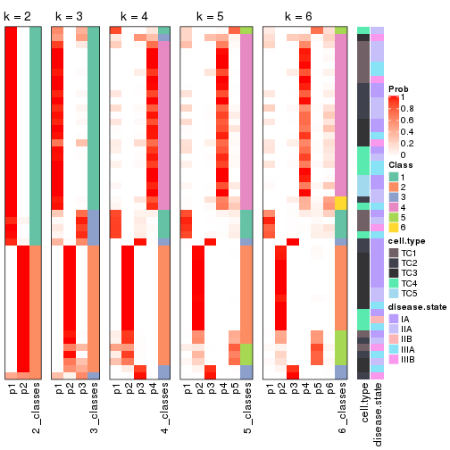


Test correlation between subgroups and known annotations. If the known
annotation is numeric, one-way ANOVA test is applied, and if the known
annotation is discrete, chi-squared contingency table test is applied.

```r
test_to_known_factors(res)
```

```
#>              n cell.type(p) disease.state(p) k
#> ATC:skmeans 49       0.0489            0.440 2
#> ATC:skmeans 45       0.0733            0.248 3
#> ATC:skmeans 48       0.0464            0.629 4
#> ATC:skmeans 46       0.0566            0.616 5
#> ATC:skmeans 38       0.0836            0.793 6
```


If matrix rows can be associated to genes, consider to use `functional_enrichment(res,
...)` to perform function enrichment for the signature genes. See [this vignette](http://bioconductor.org/packages/devel/bioc/vignettes/cola/inst/doc/functional_enrichment.html) for more detailed explanations.


 

---------------------------------------------------


### ATC:pam**


The object with results only for a single top-value method and a single partition method 
can be extracted as:

```r
res = res_list["ATC", "pam"]
# you can also extract it by
# res = res_list["ATC:pam"]
```

A summary of `res` and all the functions that can be applied to it:

```r
res
```

```
#> A 'ConsensusPartition' object with k = 2, 3, 4, 5, 6.
#>   On a matrix with 21168 rows and 50 columns.
#>   Top rows (1000, 2000, 3000, 4000, 5000) are extracted by 'ATC' method.
#>   Subgroups are detected by 'pam' method.
#>   Performed in total 1250 partitions by row resampling.
#>   Best k for subgroups seems to be 6.
#> 
#> Following methods can be applied to this 'ConsensusPartition' object:
#>  [1] "cola_report"             "collect_classes"         "collect_plots"          
#>  [4] "collect_stats"           "colnames"                "compare_signatures"     
#>  [7] "consensus_heatmap"       "dimension_reduction"     "functional_enrichment"  
#> [10] "get_anno_col"            "get_anno"                "get_classes"            
#> [13] "get_consensus"           "get_matrix"              "get_membership"         
#> [16] "get_param"               "get_signatures"          "get_stats"              
#> [19] "is_best_k"               "is_stable_k"             "membership_heatmap"     
#> [22] "ncol"                    "nrow"                    "plot_ecdf"              
#> [25] "rownames"                "select_partition_number" "show"                   
#> [28] "suggest_best_k"          "test_to_known_factors"
```

`collect_plots()` function collects all the plots made from `res` for all `k` (number of partitions)
into one single page to provide an easy and fast comparison between different `k`.

```r
collect_plots(res)
```

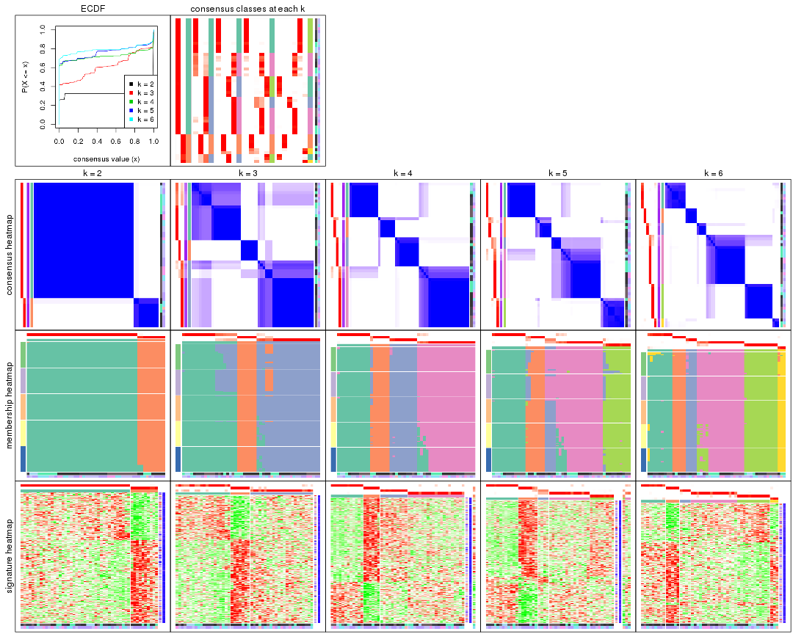

The plots are:

- The first row: a plot of the ECDF (empirical cumulative distribution
  function) curves of the consensus matrix for each `k` and the heatmap of
  predicted classes for each `k`.
- The second row: heatmaps of the consensus matrix for each `k`.
- The third row: heatmaps of the membership matrix for each `k`.
- The fouth row: heatmaps of the signatures for each `k`.

All the plots in panels can be made by individual functions and they are
plotted later in this section.

`select_partition_number()` produces several plots showing different
statistics for choosing "optimized" `k`. There are following statistics:

- ECDF curves of the consensus matrix for each `k`;
- 1-PAC. [The PAC
  score](https://en.wikipedia.org/wiki/Consensus_clustering#Over-interpretation_potential_of_consensus_clustering)
  measures the proportion of the ambiguous subgrouping.
- Mean silhouette score.
- Concordance. The mean probability of fiting the consensus class ids in all
  partitions.
- Area increased. Denote $A_k$ as the area under the ECDF curve for current
  `k`, the area increased is defined as $A_k - A_{k-1}$.
- Rand index. The percent of pairs of samples that are both in a same cluster
  or both are not in a same cluster in the partition of k and k-1.
- Jaccard index. The ratio of pairs of samples are both in a same cluster in
  the partition of k and k-1 and the pairs of samples are both in a same
  cluster in the partition k or k-1.

The detailed explanations of these statistics can be found in [the _cola_
vignette](http://bioconductor.org/packages/devel/bioc/vignettes/cola/inst/doc/cola.html#toc_13).

Generally speaking, lower PAC score, higher mean silhouette score or higher
concordance corresponds to better partition. Rand index and Jaccard index
measure how similar the current partition is compared to partition with `k-1`.
If they are too similar, we won't accept `k` is better than `k-1`.

```r
select_partition_number(res)
```

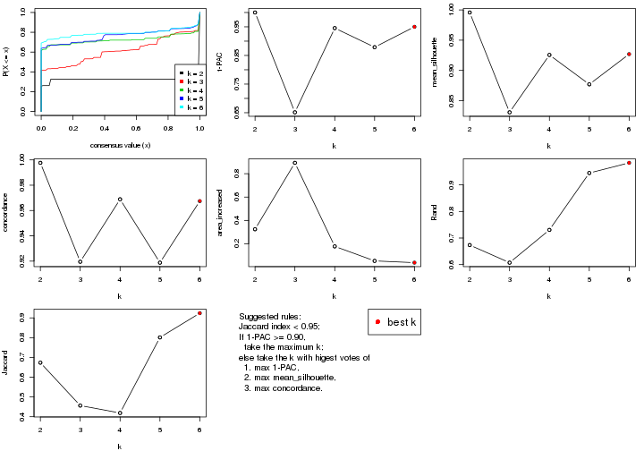

The numeric values for all these statistics can be obtained by `get_stats()`.

```r
get_stats(res)
```

```
#>   k 1-PAC mean_silhouette concordance area_increased  Rand Jaccard
#> 2 2 1.000           0.996       0.998         0.3244 0.673   0.673
#> 3 3 0.651           0.831       0.920         0.8931 0.607   0.456
#> 4 4 0.945           0.926       0.969         0.1777 0.731   0.419
#> 5 5 0.879           0.877       0.919         0.0535 0.944   0.801
#> 6 6 0.950           0.927       0.967         0.0385 0.983   0.924
```

`suggest_best_k()` suggests the best $k$ based on these statistics. The rules are as follows:

- All $k$ with Jaccard index larger than 0.95 are removed because increasing
  $k$ does not provide enough extra information. If all $k$ are removed, it is
  marked as no subgroup is detected.
- For all $k$ with 1-PAC score larger than 0.9, the maximal $k$ is taken as
  the best $k$, and other $k$ are marked as optional $k$.
- If it does not fit the second rule. The $k$ with the maximal vote of the
  highest 1-PAC score, highest mean silhouette, and highest concordance is
  taken as the best $k$.

```r
suggest_best_k(res)
```

```
#> [1] 6
#> attr(,"optional")
#> [1] 2 4
```

There is also optional best $k$ = 2 4 that is worth to check.

Following shows the table of the partitions (You need to click the **show/hide
code output** link to see it). The membership matrix (columns with name `p*`)
is inferred by
[`clue::cl_consensus()`](https://www.rdocumentation.org/link/cl_consensus?package=clue)
function with the `SE` method. Basically the value in the membership matrix
represents the probability to belong to a certain group. The finall class
label for an item is determined with the group with highest probability it
belongs to.

In `get_classes()` function, the entropy is calculated from the membership
matrix and the silhouette score is calculated from the consensus matrix.


<script>
$( function() {
	$( '#tabs-ATC-pam-get-classes' ).tabs();
} );
</script>
<div id='tabs-ATC-pam-get-classes'>
<ul>
<li><a href='#tab-ATC-pam-get-classes-1'>k = 2</a></li>
<li><a href='#tab-ATC-pam-get-classes-2'>k = 3</a></li>
<li><a href='#tab-ATC-pam-get-classes-3'>k = 4</a></li>
<li><a href='#tab-ATC-pam-get-classes-4'>k = 5</a></li>
<li><a href='#tab-ATC-pam-get-classes-5'>k = 6</a></li>
</ul>

<div id='tab-ATC-pam-get-classes-1'>
<p><a id='tab-ATC-pam-get-classes-1-a' style='color:#0366d6' href='#'>show/hide code output</a></p>
<pre><code class="r">cbind(get_classes(res, k = 2), get_membership(res, k = 2))
</code></pre>

<pre><code>#&gt;          class entropy silhouette    p1    p2
#&gt; GSM63448     1  0.0000      1.000 1.000 0.000
#&gt; GSM63449     1  0.0000      1.000 1.000 0.000
#&gt; GSM63423     1  0.0000      1.000 1.000 0.000
#&gt; GSM63425     1  0.0000      1.000 1.000 0.000
#&gt; GSM63437     1  0.0000      1.000 1.000 0.000
#&gt; GSM63453     1  0.0000      1.000 1.000 0.000
#&gt; GSM63431     1  0.0000      1.000 1.000 0.000
#&gt; GSM63450     1  0.0000      1.000 1.000 0.000
#&gt; GSM63428     1  0.0000      1.000 1.000 0.000
#&gt; GSM63432     1  0.0000      1.000 1.000 0.000
#&gt; GSM63458     1  0.0000      1.000 1.000 0.000
#&gt; GSM63434     1  0.0376      0.996 0.996 0.004
#&gt; GSM63435     1  0.0000      1.000 1.000 0.000
#&gt; GSM63442     1  0.0000      1.000 1.000 0.000
#&gt; GSM63451     1  0.0000      1.000 1.000 0.000
#&gt; GSM63422     1  0.0000      1.000 1.000 0.000
#&gt; GSM63438     1  0.0000      1.000 1.000 0.000
#&gt; GSM63439     1  0.0000      1.000 1.000 0.000
#&gt; GSM63461     1  0.0000      1.000 1.000 0.000
#&gt; GSM63463     1  0.0000      1.000 1.000 0.000
#&gt; GSM63430     1  0.0000      1.000 1.000 0.000
#&gt; GSM63446     1  0.0000      1.000 1.000 0.000
#&gt; GSM63429     1  0.0000      1.000 1.000 0.000
#&gt; GSM63445     1  0.0000      1.000 1.000 0.000
#&gt; GSM63447     2  0.3114      0.947 0.056 0.944
#&gt; GSM63459     2  0.0000      0.987 0.000 1.000
#&gt; GSM63464     2  0.0000      0.987 0.000 1.000
#&gt; GSM63469     2  0.0000      0.987 0.000 1.000
#&gt; GSM63470     2  0.0000      0.987 0.000 1.000
#&gt; GSM63436     1  0.0000      1.000 1.000 0.000
#&gt; GSM63443     2  0.0000      0.987 0.000 1.000
#&gt; GSM63465     1  0.0000      1.000 1.000 0.000
#&gt; GSM63444     2  0.3114      0.947 0.056 0.944
#&gt; GSM63456     1  0.0000      1.000 1.000 0.000
#&gt; GSM63462     1  0.0000      1.000 1.000 0.000
#&gt; GSM63424     1  0.0000      1.000 1.000 0.000
#&gt; GSM63440     1  0.0000      1.000 1.000 0.000
#&gt; GSM63433     1  0.0000      1.000 1.000 0.000
#&gt; GSM63466     2  0.0000      0.987 0.000 1.000
#&gt; GSM63426     1  0.0000      1.000 1.000 0.000
#&gt; GSM63468     1  0.0000      1.000 1.000 0.000
#&gt; GSM63452     2  0.0000      0.987 0.000 1.000
#&gt; GSM63441     1  0.0000      1.000 1.000 0.000
#&gt; GSM63454     1  0.0000      1.000 1.000 0.000
#&gt; GSM63455     1  0.0000      1.000 1.000 0.000
#&gt; GSM63460     2  0.0000      0.987 0.000 1.000
#&gt; GSM63467     1  0.0000      1.000 1.000 0.000
#&gt; GSM63421     1  0.0000      1.000 1.000 0.000
#&gt; GSM63427     1  0.0000      1.000 1.000 0.000
#&gt; GSM63457     1  0.0000      1.000 1.000 0.000
</code></pre>

<script>
$('#tab-ATC-pam-get-classes-1-a').parent().next().next().hide();
$('#tab-ATC-pam-get-classes-1-a').click(function(){
  $('#tab-ATC-pam-get-classes-1-a').parent().next().next().toggle();
  return(false);
});
</script>
</div>

<div id='tab-ATC-pam-get-classes-2'>
<p><a id='tab-ATC-pam-get-classes-2-a' style='color:#0366d6' href='#'>show/hide code output</a></p>
<pre><code class="r">cbind(get_classes(res, k = 3), get_membership(res, k = 3))
</code></pre>

<pre><code>#&gt;          class entropy silhouette    p1    p2    p3
#&gt; GSM63448     3   0.000      0.922 0.000 0.000 1.000
#&gt; GSM63449     3   0.000      0.922 0.000 0.000 1.000
#&gt; GSM63423     1   0.604      0.579 0.620 0.000 0.380
#&gt; GSM63425     1   0.000      0.825 1.000 0.000 0.000
#&gt; GSM63437     3   0.000      0.922 0.000 0.000 1.000
#&gt; GSM63453     1   0.000      0.825 1.000 0.000 0.000
#&gt; GSM63431     1   0.000      0.825 1.000 0.000 0.000
#&gt; GSM63450     1   0.506      0.738 0.756 0.000 0.244
#&gt; GSM63428     3   0.000      0.922 0.000 0.000 1.000
#&gt; GSM63432     3   0.000      0.922 0.000 0.000 1.000
#&gt; GSM63458     1   0.000      0.825 1.000 0.000 0.000
#&gt; GSM63434     3   0.000      0.922 0.000 0.000 1.000
#&gt; GSM63435     1   0.000      0.825 1.000 0.000 0.000
#&gt; GSM63442     1   0.493      0.745 0.768 0.000 0.232
#&gt; GSM63451     3   0.000      0.922 0.000 0.000 1.000
#&gt; GSM63422     1   0.000      0.825 1.000 0.000 0.000
#&gt; GSM63438     3   0.388      0.756 0.152 0.000 0.848
#&gt; GSM63439     3   0.000      0.922 0.000 0.000 1.000
#&gt; GSM63461     1   0.000      0.825 1.000 0.000 0.000
#&gt; GSM63463     3   0.000      0.922 0.000 0.000 1.000
#&gt; GSM63430     3   0.000      0.922 0.000 0.000 1.000
#&gt; GSM63446     3   0.000      0.922 0.000 0.000 1.000
#&gt; GSM63429     1   0.514      0.732 0.748 0.000 0.252
#&gt; GSM63445     3   0.529      0.522 0.268 0.000 0.732
#&gt; GSM63447     3   0.533      0.602 0.000 0.272 0.728
#&gt; GSM63459     2   0.000      1.000 0.000 1.000 0.000
#&gt; GSM63464     2   0.000      1.000 0.000 1.000 0.000
#&gt; GSM63469     2   0.000      1.000 0.000 1.000 0.000
#&gt; GSM63470     2   0.000      1.000 0.000 1.000 0.000
#&gt; GSM63436     3   0.000      0.922 0.000 0.000 1.000
#&gt; GSM63443     2   0.000      1.000 0.000 1.000 0.000
#&gt; GSM63465     3   0.000      0.922 0.000 0.000 1.000
#&gt; GSM63444     3   0.529      0.608 0.000 0.268 0.732
#&gt; GSM63456     3   0.000      0.922 0.000 0.000 1.000
#&gt; GSM63462     1   0.000      0.825 1.000 0.000 0.000
#&gt; GSM63424     3   0.000      0.922 0.000 0.000 1.000
#&gt; GSM63440     1   0.603      0.585 0.624 0.000 0.376
#&gt; GSM63433     1   0.576      0.652 0.672 0.000 0.328
#&gt; GSM63466     2   0.000      1.000 0.000 1.000 0.000
#&gt; GSM63426     3   0.000      0.922 0.000 0.000 1.000
#&gt; GSM63468     1   0.141      0.817 0.964 0.000 0.036
#&gt; GSM63452     3   0.533      0.602 0.000 0.272 0.728
#&gt; GSM63441     3   0.000      0.922 0.000 0.000 1.000
#&gt; GSM63454     1   0.604      0.579 0.620 0.000 0.380
#&gt; GSM63455     1   0.000      0.825 1.000 0.000 0.000
#&gt; GSM63460     2   0.000      1.000 0.000 1.000 0.000
#&gt; GSM63467     3   0.435      0.700 0.184 0.000 0.816
#&gt; GSM63421     1   0.000      0.825 1.000 0.000 0.000
#&gt; GSM63427     1   0.604      0.579 0.620 0.000 0.380
#&gt; GSM63457     1   0.000      0.825 1.000 0.000 0.000
</code></pre>

<script>
$('#tab-ATC-pam-get-classes-2-a').parent().next().next().hide();
$('#tab-ATC-pam-get-classes-2-a').click(function(){
  $('#tab-ATC-pam-get-classes-2-a').parent().next().next().toggle();
  return(false);
});
</script>
</div>

<div id='tab-ATC-pam-get-classes-3'>
<p><a id='tab-ATC-pam-get-classes-3-a' style='color:#0366d6' href='#'>show/hide code output</a></p>
<pre><code class="r">cbind(get_classes(res, k = 4), get_membership(res, k = 4))
</code></pre>

<pre><code>#&gt;          class entropy silhouette    p1    p2    p3    p4
#&gt; GSM63448     3  0.0000      0.984 0.000 0.000 1.000 0.000
#&gt; GSM63449     4  0.0000      0.945 0.000 0.000 0.000 1.000
#&gt; GSM63423     4  0.0000      0.945 0.000 0.000 0.000 1.000
#&gt; GSM63425     1  0.0000      0.995 1.000 0.000 0.000 0.000
#&gt; GSM63437     4  0.0000      0.945 0.000 0.000 0.000 1.000
#&gt; GSM63453     1  0.0000      0.995 1.000 0.000 0.000 0.000
#&gt; GSM63431     1  0.0000      0.995 1.000 0.000 0.000 0.000
#&gt; GSM63450     4  0.4164      0.683 0.264 0.000 0.000 0.736
#&gt; GSM63428     4  0.0000      0.945 0.000 0.000 0.000 1.000
#&gt; GSM63432     3  0.1637      0.911 0.000 0.000 0.940 0.060
#&gt; GSM63458     1  0.0000      0.995 1.000 0.000 0.000 0.000
#&gt; GSM63434     3  0.0000      0.984 0.000 0.000 1.000 0.000
#&gt; GSM63435     1  0.0000      0.995 1.000 0.000 0.000 0.000
#&gt; GSM63442     4  0.3444      0.789 0.184 0.000 0.000 0.816
#&gt; GSM63451     4  0.0000      0.945 0.000 0.000 0.000 1.000
#&gt; GSM63422     1  0.0000      0.995 1.000 0.000 0.000 0.000
#&gt; GSM63438     4  0.0000      0.945 0.000 0.000 0.000 1.000
#&gt; GSM63439     3  0.0000      0.984 0.000 0.000 1.000 0.000
#&gt; GSM63461     1  0.0000      0.995 1.000 0.000 0.000 0.000
#&gt; GSM63463     4  0.0188      0.942 0.004 0.000 0.000 0.996
#&gt; GSM63430     3  0.0000      0.984 0.000 0.000 1.000 0.000
#&gt; GSM63446     4  0.0000      0.945 0.000 0.000 0.000 1.000
#&gt; GSM63429     4  0.0000      0.945 0.000 0.000 0.000 1.000
#&gt; GSM63445     4  0.0000      0.945 0.000 0.000 0.000 1.000
#&gt; GSM63447     3  0.0000      0.984 0.000 0.000 1.000 0.000
#&gt; GSM63459     2  0.0000      0.926 0.000 1.000 0.000 0.000
#&gt; GSM63464     2  0.0000      0.926 0.000 1.000 0.000 0.000
#&gt; GSM63469     2  0.0000      0.926 0.000 1.000 0.000 0.000
#&gt; GSM63470     2  0.0000      0.926 0.000 1.000 0.000 0.000
#&gt; GSM63436     3  0.1118      0.948 0.000 0.000 0.964 0.036
#&gt; GSM63443     2  0.0000      0.926 0.000 1.000 0.000 0.000
#&gt; GSM63465     3  0.0000      0.984 0.000 0.000 1.000 0.000
#&gt; GSM63444     3  0.0000      0.984 0.000 0.000 1.000 0.000
#&gt; GSM63456     4  0.0000      0.945 0.000 0.000 0.000 1.000
#&gt; GSM63462     1  0.0000      0.995 1.000 0.000 0.000 0.000
#&gt; GSM63424     4  0.0000      0.945 0.000 0.000 0.000 1.000
#&gt; GSM63440     4  0.0000      0.945 0.000 0.000 0.000 1.000
#&gt; GSM63433     4  0.4679      0.522 0.352 0.000 0.000 0.648
#&gt; GSM63466     2  0.0000      0.926 0.000 1.000 0.000 0.000
#&gt; GSM63426     4  0.0000      0.945 0.000 0.000 0.000 1.000
#&gt; GSM63468     1  0.1211      0.945 0.960 0.000 0.000 0.040
#&gt; GSM63452     3  0.0000      0.984 0.000 0.000 1.000 0.000
#&gt; GSM63441     4  0.0000      0.945 0.000 0.000 0.000 1.000
#&gt; GSM63454     4  0.0000      0.945 0.000 0.000 0.000 1.000
#&gt; GSM63455     1  0.0000      0.995 1.000 0.000 0.000 0.000
#&gt; GSM63460     2  0.4925      0.250 0.000 0.572 0.428 0.000
#&gt; GSM63467     4  0.0000      0.945 0.000 0.000 0.000 1.000
#&gt; GSM63421     1  0.0000      0.995 1.000 0.000 0.000 0.000
#&gt; GSM63427     4  0.3486      0.786 0.188 0.000 0.000 0.812
#&gt; GSM63457     1  0.0000      0.995 1.000 0.000 0.000 0.000
</code></pre>

<script>
$('#tab-ATC-pam-get-classes-3-a').parent().next().next().hide();
$('#tab-ATC-pam-get-classes-3-a').click(function(){
  $('#tab-ATC-pam-get-classes-3-a').parent().next().next().toggle();
  return(false);
});
</script>
</div>

<div id='tab-ATC-pam-get-classes-4'>
<p><a id='tab-ATC-pam-get-classes-4-a' style='color:#0366d6' href='#'>show/hide code output</a></p>
<pre><code class="r">cbind(get_classes(res, k = 5), get_membership(res, k = 5))
</code></pre>

<pre><code>#&gt;          class entropy silhouette    p1    p2    p3    p4    p5
#&gt; GSM63448     5  0.0510      0.936 0.000 0.000 0.016 0.000 0.984
#&gt; GSM63449     4  0.0000      0.876 0.000 0.000 0.000 1.000 0.000
#&gt; GSM63423     4  0.0000      0.876 0.000 0.000 0.000 1.000 0.000
#&gt; GSM63425     1  0.0000      0.995 1.000 0.000 0.000 0.000 0.000
#&gt; GSM63437     4  0.0000      0.876 0.000 0.000 0.000 1.000 0.000
#&gt; GSM63453     1  0.0000      0.995 1.000 0.000 0.000 0.000 0.000
#&gt; GSM63431     1  0.0000      0.995 1.000 0.000 0.000 0.000 0.000
#&gt; GSM63450     4  0.3586      0.468 0.264 0.000 0.000 0.736 0.000
#&gt; GSM63428     4  0.0000      0.876 0.000 0.000 0.000 1.000 0.000
#&gt; GSM63432     5  0.0510      0.936 0.000 0.000 0.016 0.000 0.984
#&gt; GSM63458     1  0.0000      0.995 1.000 0.000 0.000 0.000 0.000
#&gt; GSM63434     5  0.0290      0.937 0.000 0.000 0.008 0.000 0.992
#&gt; GSM63435     1  0.0000      0.995 1.000 0.000 0.000 0.000 0.000
#&gt; GSM63442     4  0.2966      0.620 0.184 0.000 0.000 0.816 0.000
#&gt; GSM63451     3  0.4138      0.993 0.000 0.000 0.616 0.384 0.000
#&gt; GSM63422     1  0.0000      0.995 1.000 0.000 0.000 0.000 0.000
#&gt; GSM63438     4  0.0000      0.876 0.000 0.000 0.000 1.000 0.000
#&gt; GSM63439     5  0.0000      0.937 0.000 0.000 0.000 0.000 1.000
#&gt; GSM63461     1  0.0000      0.995 1.000 0.000 0.000 0.000 0.000
#&gt; GSM63463     3  0.4171      0.978 0.000 0.000 0.604 0.396 0.000
#&gt; GSM63430     5  0.0510      0.936 0.000 0.000 0.016 0.000 0.984
#&gt; GSM63446     3  0.4138      0.993 0.000 0.000 0.616 0.384 0.000
#&gt; GSM63429     4  0.0000      0.876 0.000 0.000 0.000 1.000 0.000
#&gt; GSM63445     4  0.0000      0.876 0.000 0.000 0.000 1.000 0.000
#&gt; GSM63447     5  0.0000      0.937 0.000 0.000 0.000 0.000 1.000
#&gt; GSM63459     2  0.0000      0.895 0.000 1.000 0.000 0.000 0.000
#&gt; GSM63464     2  0.3816      0.751 0.000 0.696 0.304 0.000 0.000
#&gt; GSM63469     2  0.0000      0.895 0.000 1.000 0.000 0.000 0.000
#&gt; GSM63470     2  0.0290      0.893 0.000 0.992 0.008 0.000 0.000
#&gt; GSM63436     5  0.1661      0.908 0.000 0.000 0.024 0.036 0.940
#&gt; GSM63443     2  0.0000      0.895 0.000 1.000 0.000 0.000 0.000
#&gt; GSM63465     5  0.0404      0.936 0.000 0.000 0.012 0.000 0.988
#&gt; GSM63444     5  0.1270      0.915 0.000 0.000 0.052 0.000 0.948
#&gt; GSM63456     3  0.4138      0.993 0.000 0.000 0.616 0.384 0.000
#&gt; GSM63462     1  0.0000      0.995 1.000 0.000 0.000 0.000 0.000
#&gt; GSM63424     4  0.0000      0.876 0.000 0.000 0.000 1.000 0.000
#&gt; GSM63440     4  0.0000      0.876 0.000 0.000 0.000 1.000 0.000
#&gt; GSM63433     4  0.4030      0.277 0.352 0.000 0.000 0.648 0.000
#&gt; GSM63466     2  0.0000      0.895 0.000 1.000 0.000 0.000 0.000
#&gt; GSM63426     4  0.0510      0.855 0.000 0.000 0.016 0.984 0.000
#&gt; GSM63468     1  0.1043      0.945 0.960 0.000 0.000 0.040 0.000
#&gt; GSM63452     5  0.4283      0.470 0.000 0.000 0.456 0.000 0.544
#&gt; GSM63441     4  0.0000      0.876 0.000 0.000 0.000 1.000 0.000
#&gt; GSM63454     4  0.0000      0.876 0.000 0.000 0.000 1.000 0.000
#&gt; GSM63455     1  0.0000      0.995 1.000 0.000 0.000 0.000 0.000
#&gt; GSM63460     2  0.5996      0.584 0.000 0.512 0.368 0.000 0.120
#&gt; GSM63467     4  0.0000      0.876 0.000 0.000 0.000 1.000 0.000
#&gt; GSM63421     1  0.0000      0.995 1.000 0.000 0.000 0.000 0.000
#&gt; GSM63427     4  0.3003      0.614 0.188 0.000 0.000 0.812 0.000
#&gt; GSM63457     1  0.0000      0.995 1.000 0.000 0.000 0.000 0.000
</code></pre>

<script>
$('#tab-ATC-pam-get-classes-4-a').parent().next().next().hide();
$('#tab-ATC-pam-get-classes-4-a').click(function(){
  $('#tab-ATC-pam-get-classes-4-a').parent().next().next().toggle();
  return(false);
});
</script>
</div>

<div id='tab-ATC-pam-get-classes-5'>
<p><a id='tab-ATC-pam-get-classes-5-a' style='color:#0366d6' href='#'>show/hide code output</a></p>
<pre><code class="r">cbind(get_classes(res, k = 6), get_membership(res, k = 6))
</code></pre>

<pre><code>#&gt;          class entropy silhouette    p1    p2    p3    p4    p5    p6
#&gt; GSM63448     1  0.0000      0.955 1.000 0.000 0.000 0.000 0.000 0.000
#&gt; GSM63449     4  0.0000      0.923 0.000 0.000 0.000 1.000 0.000 0.000
#&gt; GSM63423     4  0.0000      0.923 0.000 0.000 0.000 1.000 0.000 0.000
#&gt; GSM63425     5  0.0000      0.995 0.000 0.000 0.000 0.000 1.000 0.000
#&gt; GSM63437     4  0.0000      0.923 0.000 0.000 0.000 1.000 0.000 0.000
#&gt; GSM63453     5  0.0000      0.995 0.000 0.000 0.000 0.000 1.000 0.000
#&gt; GSM63431     5  0.0000      0.995 0.000 0.000 0.000 0.000 1.000 0.000
#&gt; GSM63450     4  0.3221      0.680 0.000 0.000 0.000 0.736 0.264 0.000
#&gt; GSM63428     4  0.0000      0.923 0.000 0.000 0.000 1.000 0.000 0.000
#&gt; GSM63432     1  0.0000      0.955 1.000 0.000 0.000 0.000 0.000 0.000
#&gt; GSM63458     5  0.0000      0.995 0.000 0.000 0.000 0.000 1.000 0.000
#&gt; GSM63434     1  0.0632      0.953 0.976 0.000 0.000 0.000 0.000 0.024
#&gt; GSM63435     5  0.0000      0.995 0.000 0.000 0.000 0.000 1.000 0.000
#&gt; GSM63442     4  0.2664      0.772 0.000 0.000 0.000 0.816 0.184 0.000
#&gt; GSM63451     3  0.0000      0.931 0.000 0.000 1.000 0.000 0.000 0.000
#&gt; GSM63422     5  0.0000      0.995 0.000 0.000 0.000 0.000 1.000 0.000
#&gt; GSM63438     4  0.0000      0.923 0.000 0.000 0.000 1.000 0.000 0.000
#&gt; GSM63439     1  0.0458      0.955 0.984 0.000 0.000 0.000 0.000 0.016
#&gt; GSM63461     5  0.0000      0.995 0.000 0.000 0.000 0.000 1.000 0.000
#&gt; GSM63463     3  0.2003      0.790 0.000 0.000 0.884 0.116 0.000 0.000
#&gt; GSM63430     1  0.0000      0.955 1.000 0.000 0.000 0.000 0.000 0.000
#&gt; GSM63446     3  0.0000      0.931 0.000 0.000 1.000 0.000 0.000 0.000
#&gt; GSM63429     4  0.0000      0.923 0.000 0.000 0.000 1.000 0.000 0.000
#&gt; GSM63445     4  0.0000      0.923 0.000 0.000 0.000 1.000 0.000 0.000
#&gt; GSM63447     1  0.0458      0.955 0.984 0.000 0.000 0.000 0.000 0.016
#&gt; GSM63459     2  0.0000      0.998 0.000 1.000 0.000 0.000 0.000 0.000
#&gt; GSM63464     6  0.1610      0.899 0.000 0.084 0.000 0.000 0.000 0.916
#&gt; GSM63469     2  0.0000      0.998 0.000 1.000 0.000 0.000 0.000 0.000
#&gt; GSM63470     2  0.0260      0.992 0.000 0.992 0.000 0.000 0.000 0.008
#&gt; GSM63436     1  0.1124      0.925 0.956 0.000 0.000 0.036 0.000 0.008
#&gt; GSM63443     2  0.0000      0.998 0.000 1.000 0.000 0.000 0.000 0.000
#&gt; GSM63465     1  0.2762      0.782 0.804 0.000 0.000 0.000 0.000 0.196
#&gt; GSM63444     1  0.1444      0.927 0.928 0.000 0.000 0.000 0.000 0.072
#&gt; GSM63456     3  0.0000      0.931 0.000 0.000 1.000 0.000 0.000 0.000
#&gt; GSM63462     5  0.0000      0.995 0.000 0.000 0.000 0.000 1.000 0.000
#&gt; GSM63424     4  0.0000      0.923 0.000 0.000 0.000 1.000 0.000 0.000
#&gt; GSM63440     4  0.0000      0.923 0.000 0.000 0.000 1.000 0.000 0.000
#&gt; GSM63433     4  0.3620      0.536 0.000 0.000 0.000 0.648 0.352 0.000
#&gt; GSM63466     2  0.0000      0.998 0.000 1.000 0.000 0.000 0.000 0.000
#&gt; GSM63426     4  0.0458      0.911 0.016 0.000 0.000 0.984 0.000 0.000
#&gt; GSM63468     5  0.0937      0.943 0.000 0.000 0.000 0.040 0.960 0.000
#&gt; GSM63452     6  0.0260      0.943 0.008 0.000 0.000 0.000 0.000 0.992
#&gt; GSM63441     4  0.0000      0.923 0.000 0.000 0.000 1.000 0.000 0.000
#&gt; GSM63454     4  0.0000      0.923 0.000 0.000 0.000 1.000 0.000 0.000
#&gt; GSM63455     5  0.0000      0.995 0.000 0.000 0.000 0.000 1.000 0.000
#&gt; GSM63460     6  0.0000      0.945 0.000 0.000 0.000 0.000 0.000 1.000
#&gt; GSM63467     4  0.0000      0.923 0.000 0.000 0.000 1.000 0.000 0.000
#&gt; GSM63421     5  0.0000      0.995 0.000 0.000 0.000 0.000 1.000 0.000
#&gt; GSM63427     4  0.2697      0.769 0.000 0.000 0.000 0.812 0.188 0.000
#&gt; GSM63457     5  0.0000      0.995 0.000 0.000 0.000 0.000 1.000 0.000
</code></pre>

<script>
$('#tab-ATC-pam-get-classes-5-a').parent().next().next().hide();
$('#tab-ATC-pam-get-classes-5-a').click(function(){
  $('#tab-ATC-pam-get-classes-5-a').parent().next().next().toggle();
  return(false);
});
</script>
</div>
</div>

Heatmaps for the consensus matrix. It visualizes the probability of two
samples to be in a same group.


<script>
$( function() {
	$( '#tabs-ATC-pam-consensus-heatmap' ).tabs();
} );
</script>
<div id='tabs-ATC-pam-consensus-heatmap'>
<ul>
<li><a href='#tab-ATC-pam-consensus-heatmap-1'>k = 2</a></li>
<li><a href='#tab-ATC-pam-consensus-heatmap-2'>k = 3</a></li>
<li><a href='#tab-ATC-pam-consensus-heatmap-3'>k = 4</a></li>
<li><a href='#tab-ATC-pam-consensus-heatmap-4'>k = 5</a></li>
<li><a href='#tab-ATC-pam-consensus-heatmap-5'>k = 6</a></li>
</ul>
<div id='tab-ATC-pam-consensus-heatmap-1'>
<pre><code class="r">consensus_heatmap(res, k = 2)
</code></pre>

<p>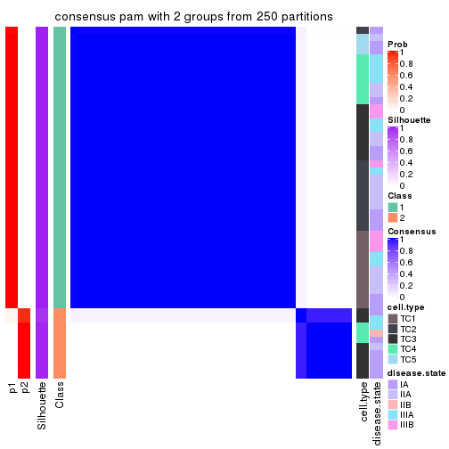</p>

</div>
<div id='tab-ATC-pam-consensus-heatmap-2'>
<pre><code class="r">consensus_heatmap(res, k = 3)
</code></pre>

<p>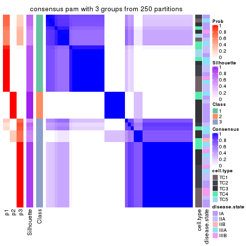</p>

</div>
<div id='tab-ATC-pam-consensus-heatmap-3'>
<pre><code class="r">consensus_heatmap(res, k = 4)
</code></pre>

<p>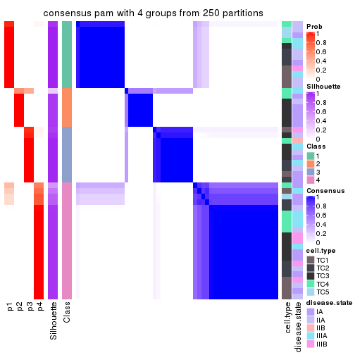</p>

</div>
<div id='tab-ATC-pam-consensus-heatmap-4'>
<pre><code class="r">consensus_heatmap(res, k = 5)
</code></pre>

<p>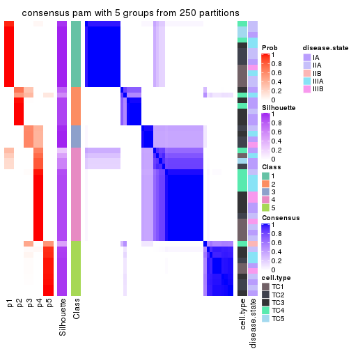</p>

</div>
<div id='tab-ATC-pam-consensus-heatmap-5'>
<pre><code class="r">consensus_heatmap(res, k = 6)
</code></pre>

<p>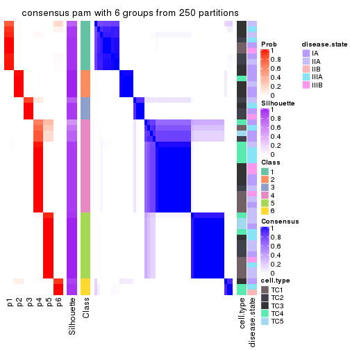</p>

</div>
</div>

Heatmaps for the membership of samples in all partitions to see how consistent they are:


<script>
$( function() {
	$( '#tabs-ATC-pam-membership-heatmap' ).tabs();
} );
</script>
<div id='tabs-ATC-pam-membership-heatmap'>
<ul>
<li><a href='#tab-ATC-pam-membership-heatmap-1'>k = 2</a></li>
<li><a href='#tab-ATC-pam-membership-heatmap-2'>k = 3</a></li>
<li><a href='#tab-ATC-pam-membership-heatmap-3'>k = 4</a></li>
<li><a href='#tab-ATC-pam-membership-heatmap-4'>k = 5</a></li>
<li><a href='#tab-ATC-pam-membership-heatmap-5'>k = 6</a></li>
</ul>
<div id='tab-ATC-pam-membership-heatmap-1'>
<pre><code class="r">membership_heatmap(res, k = 2)
</code></pre>

<p>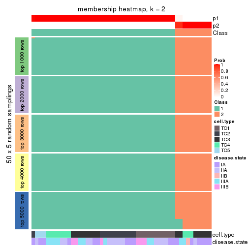</p>

</div>
<div id='tab-ATC-pam-membership-heatmap-2'>
<pre><code class="r">membership_heatmap(res, k = 3)
</code></pre>

<p>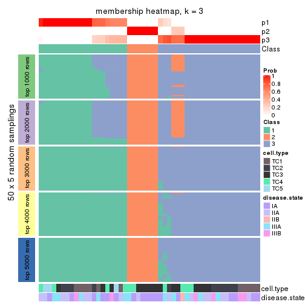</p>

</div>
<div id='tab-ATC-pam-membership-heatmap-3'>
<pre><code class="r">membership_heatmap(res, k = 4)
</code></pre>

<p>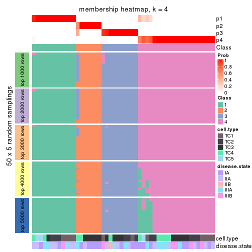</p>

</div>
<div id='tab-ATC-pam-membership-heatmap-4'>
<pre><code class="r">membership_heatmap(res, k = 5)
</code></pre>

<p>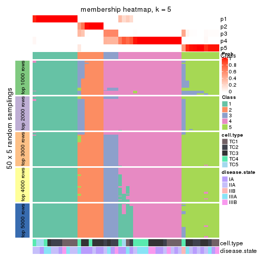</p>

</div>
<div id='tab-ATC-pam-membership-heatmap-5'>
<pre><code class="r">membership_heatmap(res, k = 6)
</code></pre>

<p>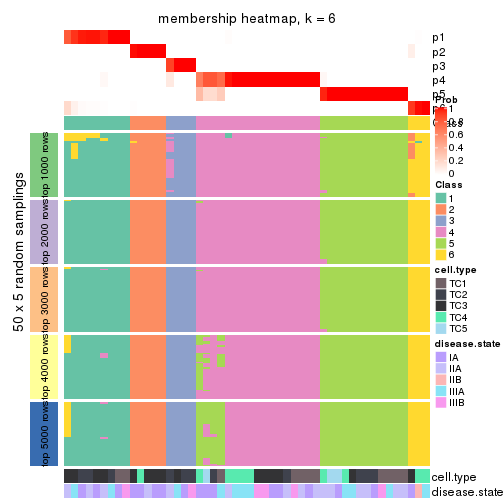</p>

</div>
</div>

As soon as we have had the classes for columns, we can look for signatures
which are significantly different between classes which can be candidate marks
for certain classes. Following are the heatmaps for signatures.


Signature heatmaps where rows are scaled:


<script>
$( function() {
	$( '#tabs-ATC-pam-get-signatures' ).tabs();
} );
</script>
<div id='tabs-ATC-pam-get-signatures'>
<ul>
<li><a href='#tab-ATC-pam-get-signatures-1'>k = 2</a></li>
<li><a href='#tab-ATC-pam-get-signatures-2'>k = 3</a></li>
<li><a href='#tab-ATC-pam-get-signatures-3'>k = 4</a></li>
<li><a href='#tab-ATC-pam-get-signatures-4'>k = 5</a></li>
<li><a href='#tab-ATC-pam-get-signatures-5'>k = 6</a></li>
</ul>
<div id='tab-ATC-pam-get-signatures-1'>
<pre><code class="r">get_signatures(res, k = 2)
</code></pre>

<p>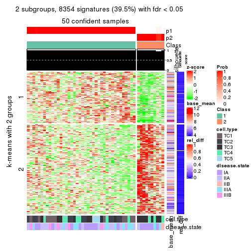</p>

</div>
<div id='tab-ATC-pam-get-signatures-2'>
<pre><code class="r">get_signatures(res, k = 3)
</code></pre>

<p>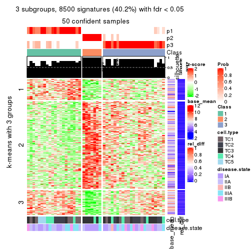</p>

</div>
<div id='tab-ATC-pam-get-signatures-3'>
<pre><code class="r">get_signatures(res, k = 4)
</code></pre>

<p>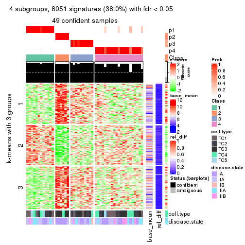</p>

</div>
<div id='tab-ATC-pam-get-signatures-4'>
<pre><code class="r">get_signatures(res, k = 5)
</code></pre>

<p>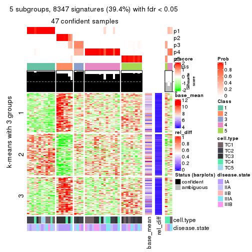</p>

</div>
<div id='tab-ATC-pam-get-signatures-5'>
<pre><code class="r">get_signatures(res, k = 6)
</code></pre>

<p>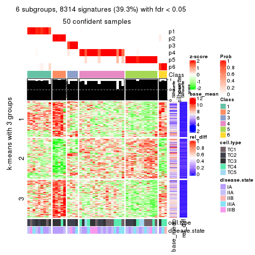</p>

</div>
</div>


Signature heatmaps where rows are not scaled:


<script>
$( function() {
	$( '#tabs-ATC-pam-get-signatures-no-scale' ).tabs();
} );
</script>
<div id='tabs-ATC-pam-get-signatures-no-scale'>
<ul>
<li><a href='#tab-ATC-pam-get-signatures-no-scale-1'>k = 2</a></li>
<li><a href='#tab-ATC-pam-get-signatures-no-scale-2'>k = 3</a></li>
<li><a href='#tab-ATC-pam-get-signatures-no-scale-3'>k = 4</a></li>
<li><a href='#tab-ATC-pam-get-signatures-no-scale-4'>k = 5</a></li>
<li><a href='#tab-ATC-pam-get-signatures-no-scale-5'>k = 6</a></li>
</ul>
<div id='tab-ATC-pam-get-signatures-no-scale-1'>
<pre><code class="r">get_signatures(res, k = 2, scale_rows = FALSE)
</code></pre>

<p>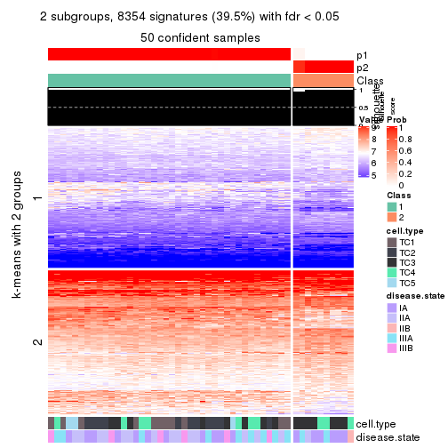</p>

</div>
<div id='tab-ATC-pam-get-signatures-no-scale-2'>
<pre><code class="r">get_signatures(res, k = 3, scale_rows = FALSE)
</code></pre>

<p>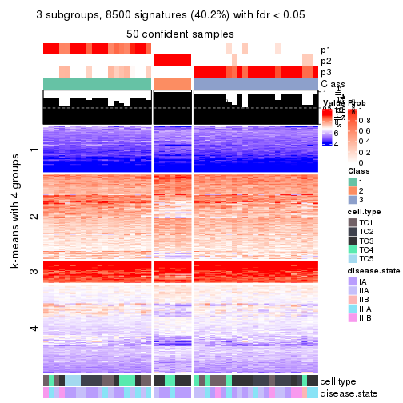</p>

</div>
<div id='tab-ATC-pam-get-signatures-no-scale-3'>
<pre><code class="r">get_signatures(res, k = 4, scale_rows = FALSE)
</code></pre>

<p>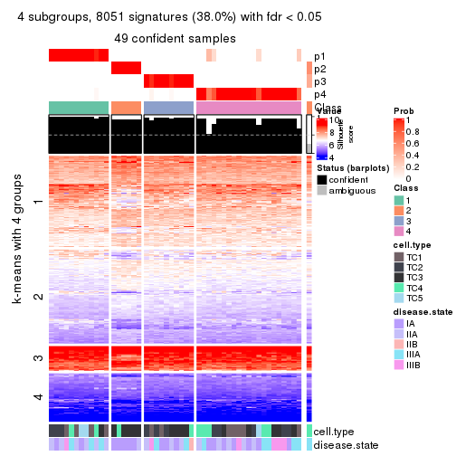</p>

</div>
<div id='tab-ATC-pam-get-signatures-no-scale-4'>
<pre><code class="r">get_signatures(res, k = 5, scale_rows = FALSE)
</code></pre>

<p>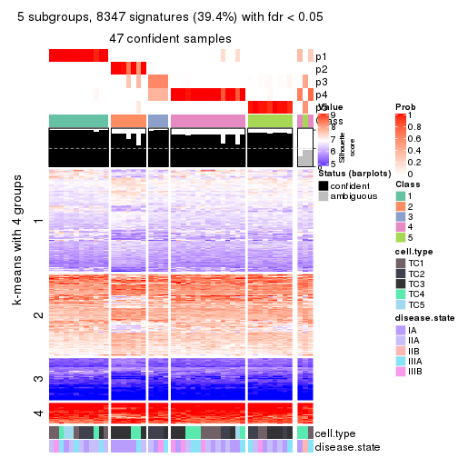</p>

</div>
<div id='tab-ATC-pam-get-signatures-no-scale-5'>
<pre><code class="r">get_signatures(res, k = 6, scale_rows = FALSE)
</code></pre>

<p>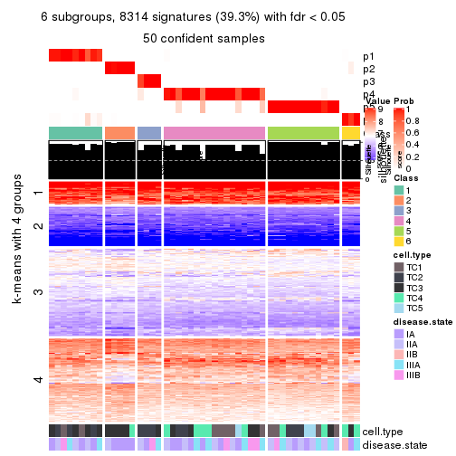</p>

</div>
</div>


Compare the overlap of signatures from different k:

```r
compare_signatures(res)
```

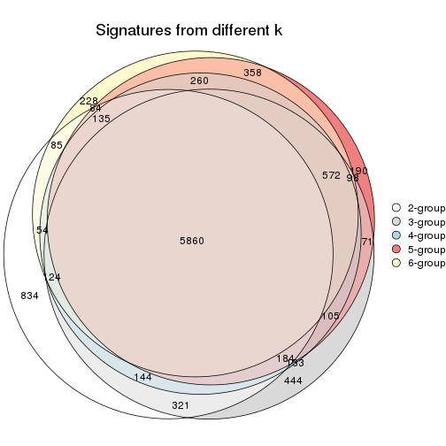

`get_signature()` returns a data frame invisibly. TO get the list of signatures, the function
call should be assigned to a variable explicitly. In following code, if `plot` argument is set
to `FALSE`, no heatmap is plotted while only the differential analysis is performed.

```r
# code only for demonstration
tb = get_signature(res, k = ..., plot = FALSE)
```

An example of the output of `tb` is:

```
#>   which_row         fdr    mean_1    mean_2 scaled_mean_1 scaled_mean_2 km
#> 1        38 0.042760348  8.373488  9.131774    -0.5533452     0.5164555  1
#> 2        40 0.018707592  7.106213  8.469186    -0.6173731     0.5762149  1
#> 3        55 0.019134737 10.221463 11.207825    -0.6159697     0.5749050  1
#> 4        59 0.006059896  5.921854  7.869574    -0.6899429     0.6439467  1
#> 5        60 0.018055526  8.928898 10.211722    -0.6204761     0.5791110  1
#> 6        98 0.009384629 15.714769 14.887706     0.6635654    -0.6193277  2
...
```

The columns in `tb` are:

1. `which_row`: row indices corresponding to the input matrix.
2. `fdr`: FDR for the differential test. 
3. `mean_x`: The mean value in group x.
4. `scaled_mean_x`: The mean value in group x after rows are scaled.
5. `km`: Row groups if k-means clustering is applied to rows.


UMAP plot which shows how samples are separated.


<script>
$( function() {
	$( '#tabs-ATC-pam-dimension-reduction' ).tabs();
} );
</script>
<div id='tabs-ATC-pam-dimension-reduction'>
<ul>
<li><a href='#tab-ATC-pam-dimension-reduction-1'>k = 2</a></li>
<li><a href='#tab-ATC-pam-dimension-reduction-2'>k = 3</a></li>
<li><a href='#tab-ATC-pam-dimension-reduction-3'>k = 4</a></li>
<li><a href='#tab-ATC-pam-dimension-reduction-4'>k = 5</a></li>
<li><a href='#tab-ATC-pam-dimension-reduction-5'>k = 6</a></li>
</ul>
<div id='tab-ATC-pam-dimension-reduction-1'>
<pre><code class="r">dimension_reduction(res, k = 2, method = &quot;UMAP&quot;)
</code></pre>

<p>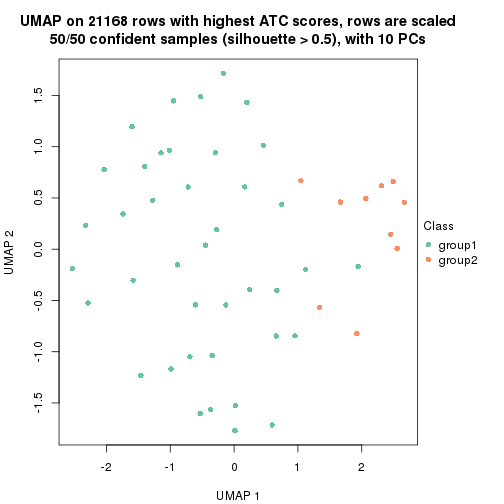</p>

</div>
<div id='tab-ATC-pam-dimension-reduction-2'>
<pre><code class="r">dimension_reduction(res, k = 3, method = &quot;UMAP&quot;)
</code></pre>

<p>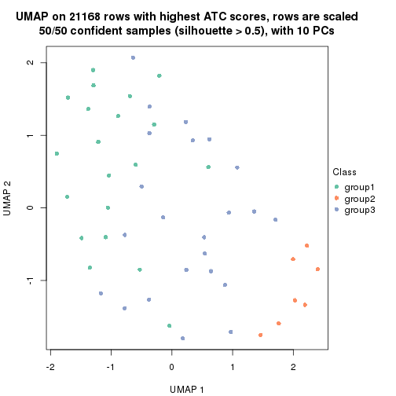</p>

</div>
<div id='tab-ATC-pam-dimension-reduction-3'>
<pre><code class="r">dimension_reduction(res, k = 4, method = &quot;UMAP&quot;)
</code></pre>

<p>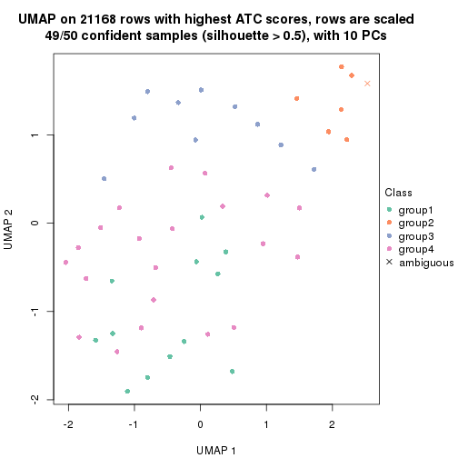</p>

</div>
<div id='tab-ATC-pam-dimension-reduction-4'>
<pre><code class="r">dimension_reduction(res, k = 5, method = &quot;UMAP&quot;)
</code></pre>

<p>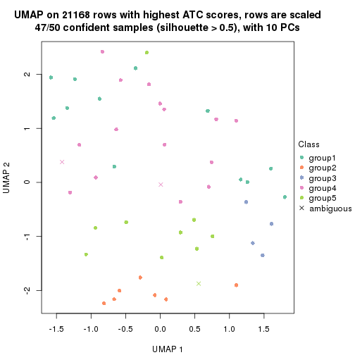</p>

</div>
<div id='tab-ATC-pam-dimension-reduction-5'>
<pre><code class="r">dimension_reduction(res, k = 6, method = &quot;UMAP&quot;)
</code></pre>

<p>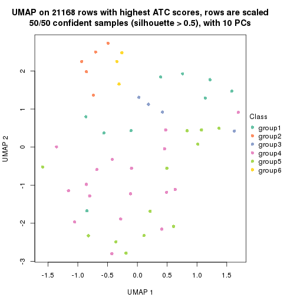</p>

</div>
</div>


Following heatmap shows how subgroups are split when increasing `k`:

```r
collect_classes(res)
```

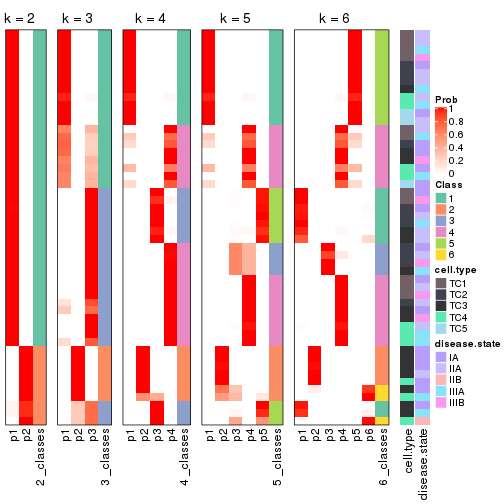


Test correlation between subgroups and known annotations. If the known
annotation is numeric, one-way ANOVA test is applied, and if the known
annotation is discrete, chi-squared contingency table test is applied.

```r
test_to_known_factors(res)
```

```
#>          n cell.type(p) disease.state(p) k
#> ATC:pam 50      0.00891           0.0463 2
#> ATC:pam 50      0.06348           0.5306 3
#> ATC:pam 49      0.20797           0.2669 4
#> ATC:pam 47      0.09872           0.7361 5
#> ATC:pam 50      0.08407           0.1533 6
```


If matrix rows can be associated to genes, consider to use `functional_enrichment(res,
...)` to perform function enrichment for the signature genes. See [this vignette](http://bioconductor.org/packages/devel/bioc/vignettes/cola/inst/doc/functional_enrichment.html) for more detailed explanations.


 

---------------------------------------------------


### ATC:mclust


The object with results only for a single top-value method and a single partition method 
can be extracted as:

```r
res = res_list["ATC", "mclust"]
# you can also extract it by
# res = res_list["ATC:mclust"]
```

A summary of `res` and all the functions that can be applied to it:

```r
res
```

```
#> A 'ConsensusPartition' object with k = 2, 3, 4, 5, 6.
#>   On a matrix with 21168 rows and 50 columns.
#>   Top rows (1000, 2000, 3000, 4000, 5000) are extracted by 'ATC' method.
#>   Subgroups are detected by 'mclust' method.
#>   Performed in total 1250 partitions by row resampling.
#>   Best k for subgroups seems to be 4.
#> 
#> Following methods can be applied to this 'ConsensusPartition' object:
#>  [1] "cola_report"             "collect_classes"         "collect_plots"          
#>  [4] "collect_stats"           "colnames"                "compare_signatures"     
#>  [7] "consensus_heatmap"       "dimension_reduction"     "functional_enrichment"  
#> [10] "get_anno_col"            "get_anno"                "get_classes"            
#> [13] "get_consensus"           "get_matrix"              "get_membership"         
#> [16] "get_param"               "get_signatures"          "get_stats"              
#> [19] "is_best_k"               "is_stable_k"             "membership_heatmap"     
#> [22] "ncol"                    "nrow"                    "plot_ecdf"              
#> [25] "rownames"                "select_partition_number" "show"                   
#> [28] "suggest_best_k"          "test_to_known_factors"
```

`collect_plots()` function collects all the plots made from `res` for all `k` (number of partitions)
into one single page to provide an easy and fast comparison between different `k`.

```r
collect_plots(res)
```

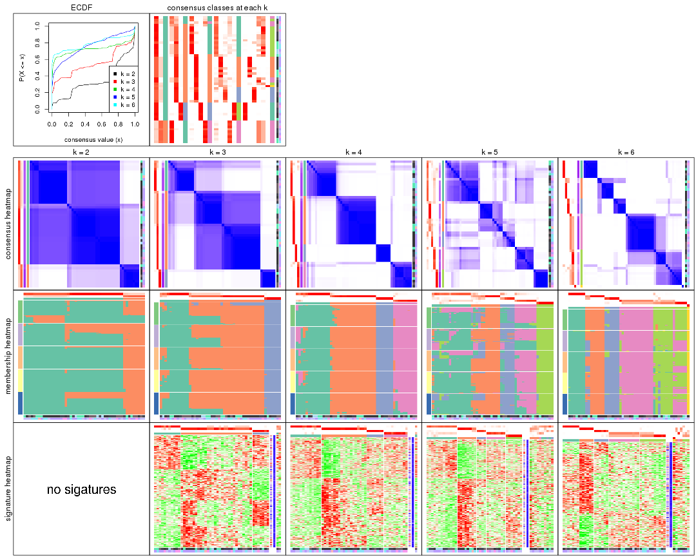

The plots are:

- The first row: a plot of the ECDF (empirical cumulative distribution
  function) curves of the consensus matrix for each `k` and the heatmap of
  predicted classes for each `k`.
- The second row: heatmaps of the consensus matrix for each `k`.
- The third row: heatmaps of the membership matrix for each `k`.
- The fouth row: heatmaps of the signatures for each `k`.

All the plots in panels can be made by individual functions and they are
plotted later in this section.

`select_partition_number()` produces several plots showing different
statistics for choosing "optimized" `k`. There are following statistics:

- ECDF curves of the consensus matrix for each `k`;
- 1-PAC. [The PAC
  score](https://en.wikipedia.org/wiki/Consensus_clustering#Over-interpretation_potential_of_consensus_clustering)
  measures the proportion of the ambiguous subgrouping.
- Mean silhouette score.
- Concordance. The mean probability of fiting the consensus class ids in all
  partitions.
- Area increased. Denote $A_k$ as the area under the ECDF curve for current
  `k`, the area increased is defined as $A_k - A_{k-1}$.
- Rand index. The percent of pairs of samples that are both in a same cluster
  or both are not in a same cluster in the partition of k and k-1.
- Jaccard index. The ratio of pairs of samples are both in a same cluster in
  the partition of k and k-1 and the pairs of samples are both in a same
  cluster in the partition k or k-1.

The detailed explanations of these statistics can be found in [the _cola_
vignette](http://bioconductor.org/packages/devel/bioc/vignettes/cola/inst/doc/cola.html#toc_13).

Generally speaking, lower PAC score, higher mean silhouette score or higher
concordance corresponds to better partition. Rand index and Jaccard index
measure how similar the current partition is compared to partition with `k-1`.
If they are too similar, we won't accept `k` is better than `k-1`.

```r
select_partition_number(res)
```

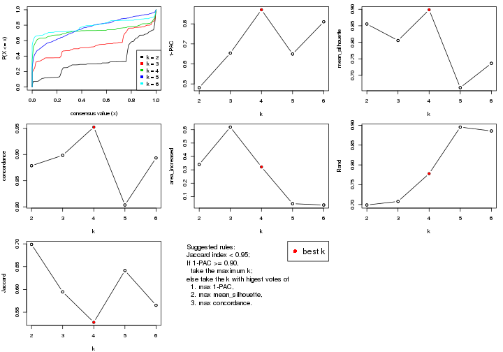

The numeric values for all these statistics can be obtained by `get_stats()`.

```r
get_stats(res)
```

```
#>   k 1-PAC mean_silhouette concordance area_increased  Rand Jaccard
#> 2 2 0.481           0.855       0.879         0.3402 0.699   0.699
#> 3 3 0.654           0.805       0.898         0.6194 0.708   0.595
#> 4 4 0.870           0.899       0.952         0.3215 0.778   0.528
#> 5 5 0.649           0.663       0.804         0.0470 0.896   0.641
#> 6 6 0.810           0.736       0.894         0.0372 0.886   0.565
```

`suggest_best_k()` suggests the best $k$ based on these statistics. The rules are as follows:

- All $k$ with Jaccard index larger than 0.95 are removed because increasing
  $k$ does not provide enough extra information. If all $k$ are removed, it is
  marked as no subgroup is detected.
- For all $k$ with 1-PAC score larger than 0.9, the maximal $k$ is taken as
  the best $k$, and other $k$ are marked as optional $k$.
- If it does not fit the second rule. The $k$ with the maximal vote of the
  highest 1-PAC score, highest mean silhouette, and highest concordance is
  taken as the best $k$.

```r
suggest_best_k(res)
```

```
#> [1] 4
```


Following shows the table of the partitions (You need to click the **show/hide
code output** link to see it). The membership matrix (columns with name `p*`)
is inferred by
[`clue::cl_consensus()`](https://www.rdocumentation.org/link/cl_consensus?package=clue)
function with the `SE` method. Basically the value in the membership matrix
represents the probability to belong to a certain group. The finall class
label for an item is determined with the group with highest probability it
belongs to.

In `get_classes()` function, the entropy is calculated from the membership
matrix and the silhouette score is calculated from the consensus matrix.


<script>
$( function() {
	$( '#tabs-ATC-mclust-get-classes' ).tabs();
} );
</script>
<div id='tabs-ATC-mclust-get-classes'>
<ul>
<li><a href='#tab-ATC-mclust-get-classes-1'>k = 2</a></li>
<li><a href='#tab-ATC-mclust-get-classes-2'>k = 3</a></li>
<li><a href='#tab-ATC-mclust-get-classes-3'>k = 4</a></li>
<li><a href='#tab-ATC-mclust-get-classes-4'>k = 5</a></li>
<li><a href='#tab-ATC-mclust-get-classes-5'>k = 6</a></li>
</ul>

<div id='tab-ATC-mclust-get-classes-1'>
<p><a id='tab-ATC-mclust-get-classes-1-a' style='color:#0366d6' href='#'>show/hide code output</a></p>
<pre><code class="r">cbind(get_classes(res, k = 2), get_membership(res, k = 2))
</code></pre>

<pre><code>#&gt;          class entropy silhouette    p1    p2
#&gt; GSM63448     1  0.0938      0.860 0.988 0.012
#&gt; GSM63449     2  0.7815      0.975 0.232 0.768
#&gt; GSM63423     2  0.7745      0.974 0.228 0.772
#&gt; GSM63425     1  0.0000      0.864 1.000 0.000
#&gt; GSM63437     1  0.0938      0.860 0.988 0.012
#&gt; GSM63453     1  0.6438      0.836 0.836 0.164
#&gt; GSM63431     1  0.0000      0.864 1.000 0.000
#&gt; GSM63450     1  0.7674      0.816 0.776 0.224
#&gt; GSM63428     2  0.7815      0.975 0.232 0.768
#&gt; GSM63432     1  0.0938      0.860 0.988 0.012
#&gt; GSM63458     1  0.0000      0.864 1.000 0.000
#&gt; GSM63434     1  0.0672      0.865 0.992 0.008
#&gt; GSM63435     1  0.6048      0.687 0.852 0.148
#&gt; GSM63442     2  0.8909      0.893 0.308 0.692
#&gt; GSM63451     1  0.7745      0.814 0.772 0.228
#&gt; GSM63422     1  0.0938      0.860 0.988 0.012
#&gt; GSM63438     2  0.7745      0.974 0.228 0.772
#&gt; GSM63439     1  0.0938      0.860 0.988 0.012
#&gt; GSM63461     1  0.0672      0.862 0.992 0.008
#&gt; GSM63463     1  0.0000      0.864 1.000 0.000
#&gt; GSM63430     1  0.0938      0.860 0.988 0.012
#&gt; GSM63446     1  0.7745      0.814 0.772 0.228
#&gt; GSM63429     2  0.7745      0.974 0.228 0.772
#&gt; GSM63445     1  0.0938      0.860 0.988 0.012
#&gt; GSM63447     1  0.0000      0.864 1.000 0.000
#&gt; GSM63459     1  0.7745      0.814 0.772 0.228
#&gt; GSM63464     1  0.7745      0.814 0.772 0.228
#&gt; GSM63469     1  0.7745      0.814 0.772 0.228
#&gt; GSM63470     1  0.7745      0.814 0.772 0.228
#&gt; GSM63436     1  0.0938      0.860 0.988 0.012
#&gt; GSM63443     1  0.7745      0.814 0.772 0.228
#&gt; GSM63465     1  0.6801      0.831 0.820 0.180
#&gt; GSM63444     1  0.7745      0.814 0.772 0.228
#&gt; GSM63456     1  0.7745      0.814 0.772 0.228
#&gt; GSM63462     1  0.6438      0.836 0.836 0.164
#&gt; GSM63424     2  0.7883      0.972 0.236 0.764
#&gt; GSM63440     1  0.7528      0.542 0.784 0.216
#&gt; GSM63433     2  0.7815      0.974 0.232 0.768
#&gt; GSM63466     1  0.7745      0.814 0.772 0.228
#&gt; GSM63426     1  0.0000      0.864 1.000 0.000
#&gt; GSM63468     1  0.5629      0.844 0.868 0.132
#&gt; GSM63452     1  0.7745      0.814 0.772 0.228
#&gt; GSM63441     2  0.8661      0.923 0.288 0.712
#&gt; GSM63454     1  0.0000      0.864 1.000 0.000
#&gt; GSM63455     1  0.0000      0.864 1.000 0.000
#&gt; GSM63460     1  0.7745      0.814 0.772 0.228
#&gt; GSM63467     1  0.1414      0.864 0.980 0.020
#&gt; GSM63421     1  0.0376      0.863 0.996 0.004
#&gt; GSM63427     1  0.0938      0.860 0.988 0.012
#&gt; GSM63457     1  0.0672      0.862 0.992 0.008
</code></pre>

<script>
$('#tab-ATC-mclust-get-classes-1-a').parent().next().next().hide();
$('#tab-ATC-mclust-get-classes-1-a').click(function(){
  $('#tab-ATC-mclust-get-classes-1-a').parent().next().next().toggle();
  return(false);
});
</script>
</div>

<div id='tab-ATC-mclust-get-classes-2'>
<p><a id='tab-ATC-mclust-get-classes-2-a' style='color:#0366d6' href='#'>show/hide code output</a></p>
<pre><code class="r">cbind(get_classes(res, k = 3), get_membership(res, k = 3))
</code></pre>

<pre><code>#&gt;          class entropy silhouette    p1    p2    p3
#&gt; GSM63448     3  0.0000      0.983 0.000 0.000 1.000
#&gt; GSM63449     1  0.0000      0.855 1.000 0.000 0.000
#&gt; GSM63423     1  0.0000      0.855 1.000 0.000 0.000
#&gt; GSM63425     2  0.6286      0.231 0.464 0.536 0.000
#&gt; GSM63437     2  0.6067      0.761 0.236 0.736 0.028
#&gt; GSM63453     2  0.0237      0.839 0.004 0.996 0.000
#&gt; GSM63431     2  0.5016      0.754 0.240 0.760 0.000
#&gt; GSM63450     2  0.1129      0.844 0.004 0.976 0.020
#&gt; GSM63428     1  0.0000      0.855 1.000 0.000 0.000
#&gt; GSM63432     3  0.0000      0.983 0.000 0.000 1.000
#&gt; GSM63458     2  0.5016      0.754 0.240 0.760 0.000
#&gt; GSM63434     2  0.5939      0.769 0.224 0.748 0.028
#&gt; GSM63435     1  0.6154      0.226 0.592 0.408 0.000
#&gt; GSM63442     1  0.2796      0.802 0.908 0.092 0.000
#&gt; GSM63451     2  0.1163      0.845 0.000 0.972 0.028
#&gt; GSM63422     2  0.5016      0.754 0.240 0.760 0.000
#&gt; GSM63438     1  0.0000      0.855 1.000 0.000 0.000
#&gt; GSM63439     3  0.0000      0.983 0.000 0.000 1.000
#&gt; GSM63461     2  0.5016      0.754 0.240 0.760 0.000
#&gt; GSM63463     2  0.4931      0.760 0.232 0.768 0.000
#&gt; GSM63430     3  0.0000      0.983 0.000 0.000 1.000
#&gt; GSM63446     2  0.1163      0.845 0.000 0.972 0.028
#&gt; GSM63429     1  0.0000      0.855 1.000 0.000 0.000
#&gt; GSM63445     2  0.5858      0.759 0.240 0.740 0.020
#&gt; GSM63447     3  0.2902      0.887 0.064 0.016 0.920
#&gt; GSM63459     2  0.1163      0.845 0.000 0.972 0.028
#&gt; GSM63464     2  0.1163      0.845 0.000 0.972 0.028
#&gt; GSM63469     2  0.1163      0.845 0.000 0.972 0.028
#&gt; GSM63470     2  0.1163      0.845 0.000 0.972 0.028
#&gt; GSM63436     3  0.0000      0.983 0.000 0.000 1.000
#&gt; GSM63443     2  0.1163      0.845 0.000 0.972 0.028
#&gt; GSM63465     2  0.1399      0.845 0.004 0.968 0.028
#&gt; GSM63444     2  0.1163      0.845 0.000 0.972 0.028
#&gt; GSM63456     2  0.1163      0.845 0.000 0.972 0.028
#&gt; GSM63462     2  0.0237      0.839 0.004 0.996 0.000
#&gt; GSM63424     1  0.0000      0.855 1.000 0.000 0.000
#&gt; GSM63440     1  0.6294      0.514 0.692 0.288 0.020
#&gt; GSM63433     1  0.0000      0.855 1.000 0.000 0.000
#&gt; GSM63466     2  0.1163      0.845 0.000 0.972 0.028
#&gt; GSM63426     3  0.0000      0.983 0.000 0.000 1.000
#&gt; GSM63468     2  0.0592      0.840 0.012 0.988 0.000
#&gt; GSM63452     2  0.1163      0.845 0.000 0.972 0.028
#&gt; GSM63441     1  0.0424      0.852 0.992 0.008 0.000
#&gt; GSM63454     2  0.5016      0.754 0.240 0.760 0.000
#&gt; GSM63455     2  0.5016      0.754 0.240 0.760 0.000
#&gt; GSM63460     2  0.1163      0.845 0.000 0.972 0.028
#&gt; GSM63467     2  0.3850      0.826 0.088 0.884 0.028
#&gt; GSM63421     1  0.5216      0.626 0.740 0.260 0.000
#&gt; GSM63427     2  0.5016      0.754 0.240 0.760 0.000
#&gt; GSM63457     2  0.5016      0.754 0.240 0.760 0.000
</code></pre>

<script>
$('#tab-ATC-mclust-get-classes-2-a').parent().next().next().hide();
$('#tab-ATC-mclust-get-classes-2-a').click(function(){
  $('#tab-ATC-mclust-get-classes-2-a').parent().next().next().toggle();
  return(false);
});
</script>
</div>

<div id='tab-ATC-mclust-get-classes-3'>
<p><a id='tab-ATC-mclust-get-classes-3-a' style='color:#0366d6' href='#'>show/hide code output</a></p>
<pre><code class="r">cbind(get_classes(res, k = 4), get_membership(res, k = 4))
</code></pre>

<pre><code>#&gt;          class entropy silhouette    p1    p2    p3    p4
#&gt; GSM63448     3  0.0000      0.998 0.000 0.000 1.000 0.000
#&gt; GSM63449     4  0.0188      0.921 0.000 0.000 0.004 0.996
#&gt; GSM63423     4  0.0921      0.925 0.028 0.000 0.000 0.972
#&gt; GSM63425     1  0.5645      0.408 0.604 0.032 0.000 0.364
#&gt; GSM63437     2  0.0895      0.952 0.020 0.976 0.004 0.000
#&gt; GSM63453     2  0.2760      0.846 0.128 0.872 0.000 0.000
#&gt; GSM63431     1  0.0000      0.902 1.000 0.000 0.000 0.000
#&gt; GSM63450     2  0.1389      0.932 0.048 0.952 0.000 0.000
#&gt; GSM63428     4  0.0188      0.921 0.000 0.000 0.004 0.996
#&gt; GSM63432     3  0.0000      0.998 0.000 0.000 1.000 0.000
#&gt; GSM63458     1  0.0000      0.902 1.000 0.000 0.000 0.000
#&gt; GSM63434     2  0.0895      0.952 0.020 0.976 0.004 0.000
#&gt; GSM63435     1  0.3837      0.701 0.776 0.000 0.000 0.224
#&gt; GSM63442     4  0.3355      0.791 0.160 0.004 0.000 0.836
#&gt; GSM63451     2  0.0188      0.963 0.004 0.996 0.000 0.000
#&gt; GSM63422     1  0.3975      0.676 0.760 0.240 0.000 0.000
#&gt; GSM63438     4  0.0921      0.925 0.028 0.000 0.000 0.972
#&gt; GSM63439     3  0.0000      0.998 0.000 0.000 1.000 0.000
#&gt; GSM63461     1  0.0000      0.902 1.000 0.000 0.000 0.000
#&gt; GSM63463     1  0.0188      0.901 0.996 0.004 0.000 0.000
#&gt; GSM63430     3  0.0000      0.998 0.000 0.000 1.000 0.000
#&gt; GSM63446     2  0.0188      0.963 0.004 0.996 0.000 0.000
#&gt; GSM63429     4  0.0817      0.926 0.024 0.000 0.000 0.976
#&gt; GSM63445     1  0.0469      0.895 0.988 0.000 0.012 0.000
#&gt; GSM63447     3  0.0524      0.986 0.004 0.008 0.988 0.000
#&gt; GSM63459     2  0.0000      0.963 0.000 1.000 0.000 0.000
#&gt; GSM63464     2  0.0000      0.963 0.000 1.000 0.000 0.000
#&gt; GSM63469     2  0.0000      0.963 0.000 1.000 0.000 0.000
#&gt; GSM63470     2  0.0000      0.963 0.000 1.000 0.000 0.000
#&gt; GSM63436     3  0.0000      0.998 0.000 0.000 1.000 0.000
#&gt; GSM63443     2  0.0188      0.963 0.000 0.996 0.000 0.004
#&gt; GSM63465     2  0.0188      0.963 0.004 0.996 0.000 0.000
#&gt; GSM63444     2  0.0000      0.963 0.000 1.000 0.000 0.000
#&gt; GSM63456     2  0.0188      0.963 0.004 0.996 0.000 0.000
#&gt; GSM63462     2  0.4522      0.514 0.320 0.680 0.000 0.000
#&gt; GSM63424     4  0.0188      0.923 0.004 0.000 0.000 0.996
#&gt; GSM63440     4  0.5599      0.604 0.052 0.276 0.000 0.672
#&gt; GSM63433     4  0.1211      0.919 0.040 0.000 0.000 0.960
#&gt; GSM63466     2  0.0000      0.963 0.000 1.000 0.000 0.000
#&gt; GSM63426     3  0.0000      0.998 0.000 0.000 1.000 0.000
#&gt; GSM63468     1  0.2530      0.822 0.888 0.112 0.000 0.000
#&gt; GSM63452     2  0.0000      0.963 0.000 1.000 0.000 0.000
#&gt; GSM63441     4  0.0376      0.920 0.000 0.004 0.004 0.992
#&gt; GSM63454     1  0.0000      0.902 1.000 0.000 0.000 0.000
#&gt; GSM63455     1  0.0000      0.902 1.000 0.000 0.000 0.000
#&gt; GSM63460     2  0.0000      0.963 0.000 1.000 0.000 0.000
#&gt; GSM63467     2  0.1118      0.944 0.036 0.964 0.000 0.000
#&gt; GSM63421     1  0.2973      0.799 0.856 0.000 0.000 0.144
#&gt; GSM63427     1  0.0000      0.902 1.000 0.000 0.000 0.000
#&gt; GSM63457     1  0.0000      0.902 1.000 0.000 0.000 0.000
</code></pre>

<script>
$('#tab-ATC-mclust-get-classes-3-a').parent().next().next().hide();
$('#tab-ATC-mclust-get-classes-3-a').click(function(){
  $('#tab-ATC-mclust-get-classes-3-a').parent().next().next().toggle();
  return(false);
});
</script>
</div>

<div id='tab-ATC-mclust-get-classes-4'>
<p><a id='tab-ATC-mclust-get-classes-4-a' style='color:#0366d6' href='#'>show/hide code output</a></p>
<pre><code class="r">cbind(get_classes(res, k = 5), get_membership(res, k = 5))
</code></pre>

<pre><code>#&gt;          class entropy silhouette    p1    p2    p3    p4    p5
#&gt; GSM63448     5  0.0162     0.9713 0.000 0.000 0.000 0.004 0.996
#&gt; GSM63449     4  0.1661     0.8368 0.036 0.000 0.000 0.940 0.024
#&gt; GSM63423     4  0.2377     0.8434 0.128 0.000 0.000 0.872 0.000
#&gt; GSM63425     1  0.3480     0.6949 0.752 0.000 0.000 0.248 0.000
#&gt; GSM63437     2  0.8741     0.0351 0.244 0.372 0.108 0.244 0.032
#&gt; GSM63453     3  0.4779     0.4783 0.448 0.004 0.536 0.000 0.012
#&gt; GSM63431     1  0.3074     0.7410 0.804 0.000 0.000 0.196 0.000
#&gt; GSM63450     3  0.2719     0.7007 0.144 0.000 0.852 0.000 0.004
#&gt; GSM63428     4  0.1668     0.8307 0.028 0.000 0.000 0.940 0.032
#&gt; GSM63432     5  0.0162     0.9713 0.000 0.000 0.000 0.004 0.996
#&gt; GSM63458     1  0.3074     0.7410 0.804 0.000 0.000 0.196 0.000
#&gt; GSM63434     2  0.7700     0.4193 0.236 0.492 0.200 0.016 0.056
#&gt; GSM63435     1  0.3480     0.6947 0.752 0.000 0.000 0.248 0.000
#&gt; GSM63442     4  0.4278     0.1367 0.452 0.000 0.000 0.548 0.000
#&gt; GSM63451     3  0.1364     0.6887 0.012 0.036 0.952 0.000 0.000
#&gt; GSM63422     1  0.3074     0.7408 0.804 0.000 0.000 0.196 0.000
#&gt; GSM63438     4  0.2516     0.8394 0.140 0.000 0.000 0.860 0.000
#&gt; GSM63439     5  0.0162     0.9713 0.000 0.000 0.000 0.004 0.996
#&gt; GSM63461     1  0.5509     0.7061 0.716 0.000 0.060 0.148 0.076
#&gt; GSM63463     1  0.3309     0.5340 0.852 0.000 0.108 0.024 0.016
#&gt; GSM63430     5  0.0162     0.9713 0.000 0.000 0.000 0.004 0.996
#&gt; GSM63446     3  0.1444     0.6861 0.012 0.040 0.948 0.000 0.000
#&gt; GSM63429     4  0.3210     0.7706 0.212 0.000 0.000 0.788 0.000
#&gt; GSM63445     1  0.4800     0.5779 0.676 0.000 0.000 0.052 0.272
#&gt; GSM63447     5  0.2856     0.8109 0.008 0.016 0.104 0.000 0.872
#&gt; GSM63459     2  0.0162     0.7175 0.004 0.996 0.000 0.000 0.000
#&gt; GSM63464     2  0.0451     0.7172 0.008 0.988 0.004 0.000 0.000
#&gt; GSM63469     2  0.0000     0.7172 0.000 1.000 0.000 0.000 0.000
#&gt; GSM63470     2  0.0162     0.7176 0.004 0.996 0.000 0.000 0.000
#&gt; GSM63436     5  0.0162     0.9713 0.000 0.000 0.000 0.004 0.996
#&gt; GSM63443     2  0.5637     0.4575 0.008 0.540 0.392 0.060 0.000
#&gt; GSM63465     2  0.6316     0.2895 0.392 0.484 0.112 0.000 0.012
#&gt; GSM63444     2  0.5297     0.5441 0.060 0.640 0.292 0.000 0.008
#&gt; GSM63456     3  0.2067     0.7018 0.044 0.028 0.924 0.000 0.004
#&gt; GSM63462     3  0.4705     0.3951 0.484 0.000 0.504 0.004 0.008
#&gt; GSM63424     4  0.1478     0.8428 0.064 0.000 0.000 0.936 0.000
#&gt; GSM63440     1  0.5329     0.1051 0.516 0.000 0.052 0.432 0.000
#&gt; GSM63433     4  0.2648     0.8266 0.152 0.000 0.000 0.848 0.000
#&gt; GSM63466     2  0.0451     0.7172 0.008 0.988 0.004 0.000 0.000
#&gt; GSM63426     5  0.0000     0.9678 0.000 0.000 0.000 0.000 1.000
#&gt; GSM63468     1  0.3492     0.3738 0.796 0.000 0.188 0.000 0.016
#&gt; GSM63452     2  0.5176     0.5526 0.056 0.656 0.280 0.000 0.008
#&gt; GSM63441     4  0.1753     0.8313 0.032 0.000 0.000 0.936 0.032
#&gt; GSM63454     1  0.5334     0.6990 0.732 0.000 0.068 0.136 0.064
#&gt; GSM63455     1  0.3039     0.7414 0.808 0.000 0.000 0.192 0.000
#&gt; GSM63460     2  0.0162     0.7176 0.004 0.996 0.000 0.000 0.000
#&gt; GSM63467     1  0.6003    -0.0252 0.588 0.280 0.124 0.000 0.008
#&gt; GSM63421     1  0.3274     0.7297 0.780 0.000 0.000 0.220 0.000
#&gt; GSM63427     1  0.5561     0.6913 0.708 0.000 0.040 0.132 0.120
#&gt; GSM63457     1  0.3074     0.7410 0.804 0.000 0.000 0.196 0.000
</code></pre>

<script>
$('#tab-ATC-mclust-get-classes-4-a').parent().next().next().hide();
$('#tab-ATC-mclust-get-classes-4-a').click(function(){
  $('#tab-ATC-mclust-get-classes-4-a').parent().next().next().toggle();
  return(false);
});
</script>
</div>

<div id='tab-ATC-mclust-get-classes-5'>
<p><a id='tab-ATC-mclust-get-classes-5-a' style='color:#0366d6' href='#'>show/hide code output</a></p>
<pre><code class="r">cbind(get_classes(res, k = 6), get_membership(res, k = 6))
</code></pre>

<pre><code>#&gt;          class entropy silhouette    p1    p2    p3    p4    p5    p6
#&gt; GSM63448     1  0.0000      0.994 1.000 0.000 0.000 0.000 0.000 0.000
#&gt; GSM63449     4  0.3695      0.950 0.000 0.000 0.000 0.624 0.376 0.000
#&gt; GSM63423     4  0.3695      0.950 0.000 0.000 0.000 0.624 0.376 0.000
#&gt; GSM63425     4  0.3695      0.942 0.000 0.000 0.000 0.624 0.376 0.000
#&gt; GSM63437     4  0.3934      0.947 0.000 0.000 0.000 0.616 0.376 0.008
#&gt; GSM63453     3  0.2257      0.827 0.000 0.000 0.876 0.008 0.116 0.000
#&gt; GSM63431     5  0.0146      0.553 0.000 0.000 0.000 0.004 0.996 0.000
#&gt; GSM63450     3  0.0000      0.927 0.000 0.000 1.000 0.000 0.000 0.000
#&gt; GSM63428     4  0.3695      0.950 0.000 0.000 0.000 0.624 0.376 0.000
#&gt; GSM63432     1  0.0146      0.991 0.996 0.000 0.000 0.004 0.000 0.000
#&gt; GSM63458     5  0.0146      0.561 0.000 0.000 0.000 0.004 0.996 0.000
#&gt; GSM63434     4  0.0912      0.314 0.008 0.004 0.000 0.972 0.004 0.012
#&gt; GSM63435     5  0.3833     -0.695 0.000 0.000 0.000 0.444 0.556 0.000
#&gt; GSM63442     4  0.3706      0.948 0.000 0.000 0.000 0.620 0.380 0.000
#&gt; GSM63451     3  0.0146      0.928 0.000 0.000 0.996 0.000 0.000 0.004
#&gt; GSM63422     5  0.0865      0.501 0.000 0.000 0.000 0.036 0.964 0.000
#&gt; GSM63438     4  0.3695      0.950 0.000 0.000 0.000 0.624 0.376 0.000
#&gt; GSM63439     1  0.0146      0.991 0.996 0.000 0.000 0.000 0.000 0.004
#&gt; GSM63461     5  0.4009      0.592 0.008 0.000 0.004 0.356 0.632 0.000
#&gt; GSM63463     5  0.4115      0.586 0.012 0.000 0.004 0.360 0.624 0.000
#&gt; GSM63430     1  0.0000      0.994 1.000 0.000 0.000 0.000 0.000 0.000
#&gt; GSM63446     3  0.0146      0.928 0.000 0.000 0.996 0.000 0.000 0.004
#&gt; GSM63429     4  0.3695      0.950 0.000 0.000 0.000 0.624 0.376 0.000
#&gt; GSM63445     5  0.5727      0.332 0.308 0.000 0.000 0.192 0.500 0.000
#&gt; GSM63447     1  0.0603      0.977 0.980 0.000 0.000 0.016 0.000 0.004
#&gt; GSM63459     2  0.0000      0.834 0.000 1.000 0.000 0.000 0.000 0.000
#&gt; GSM63464     2  0.0291      0.832 0.004 0.992 0.000 0.000 0.000 0.004
#&gt; GSM63469     2  0.0000      0.834 0.000 1.000 0.000 0.000 0.000 0.000
#&gt; GSM63470     2  0.0000      0.834 0.000 1.000 0.000 0.000 0.000 0.000
#&gt; GSM63436     1  0.0000      0.994 1.000 0.000 0.000 0.000 0.000 0.000
#&gt; GSM63443     6  0.0146      0.000 0.000 0.000 0.000 0.004 0.000 0.996
#&gt; GSM63465     5  0.5610      0.503 0.000 0.096 0.004 0.360 0.528 0.012
#&gt; GSM63444     2  0.4395      0.394 0.000 0.580 0.396 0.008 0.000 0.016
#&gt; GSM63456     3  0.0146      0.928 0.000 0.000 0.996 0.000 0.000 0.004
#&gt; GSM63462     3  0.1918      0.862 0.000 0.000 0.904 0.008 0.088 0.000
#&gt; GSM63424     4  0.3695      0.950 0.000 0.000 0.000 0.624 0.376 0.000
#&gt; GSM63440     4  0.3717      0.945 0.000 0.000 0.000 0.616 0.384 0.000
#&gt; GSM63433     4  0.3695      0.950 0.000 0.000 0.000 0.624 0.376 0.000
#&gt; GSM63466     2  0.0291      0.832 0.004 0.992 0.000 0.000 0.000 0.004
#&gt; GSM63426     1  0.0000      0.994 1.000 0.000 0.000 0.000 0.000 0.000
#&gt; GSM63468     5  0.5904      0.379 0.012 0.000 0.284 0.180 0.524 0.000
#&gt; GSM63452     2  0.4457      0.312 0.000 0.544 0.432 0.008 0.000 0.016
#&gt; GSM63441     4  0.3695      0.950 0.000 0.000 0.000 0.624 0.376 0.000
#&gt; GSM63454     5  0.4052      0.590 0.016 0.000 0.000 0.356 0.628 0.000
#&gt; GSM63455     5  0.0000      0.559 0.000 0.000 0.000 0.000 1.000 0.000
#&gt; GSM63460     2  0.0000      0.834 0.000 1.000 0.000 0.000 0.000 0.000
#&gt; GSM63467     5  0.3819      0.584 0.000 0.000 0.000 0.372 0.624 0.004
#&gt; GSM63421     4  0.3817      0.884 0.000 0.000 0.000 0.568 0.432 0.000
#&gt; GSM63427     5  0.4180      0.593 0.024 0.000 0.000 0.348 0.628 0.000
#&gt; GSM63457     5  0.0000      0.559 0.000 0.000 0.000 0.000 1.000 0.000
</code></pre>

<script>
$('#tab-ATC-mclust-get-classes-5-a').parent().next().next().hide();
$('#tab-ATC-mclust-get-classes-5-a').click(function(){
  $('#tab-ATC-mclust-get-classes-5-a').parent().next().next().toggle();
  return(false);
});
</script>
</div>
</div>

Heatmaps for the consensus matrix. It visualizes the probability of two
samples to be in a same group.


<script>
$( function() {
	$( '#tabs-ATC-mclust-consensus-heatmap' ).tabs();
} );
</script>
<div id='tabs-ATC-mclust-consensus-heatmap'>
<ul>
<li><a href='#tab-ATC-mclust-consensus-heatmap-1'>k = 2</a></li>
<li><a href='#tab-ATC-mclust-consensus-heatmap-2'>k = 3</a></li>
<li><a href='#tab-ATC-mclust-consensus-heatmap-3'>k = 4</a></li>
<li><a href='#tab-ATC-mclust-consensus-heatmap-4'>k = 5</a></li>
<li><a href='#tab-ATC-mclust-consensus-heatmap-5'>k = 6</a></li>
</ul>
<div id='tab-ATC-mclust-consensus-heatmap-1'>
<pre><code class="r">consensus_heatmap(res, k = 2)
</code></pre>

<p>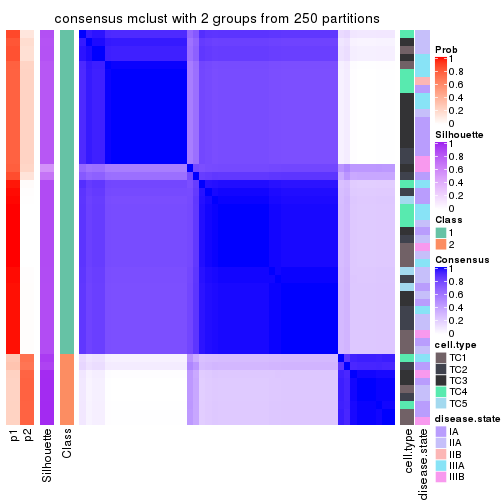</p>

</div>
<div id='tab-ATC-mclust-consensus-heatmap-2'>
<pre><code class="r">consensus_heatmap(res, k = 3)
</code></pre>

<p>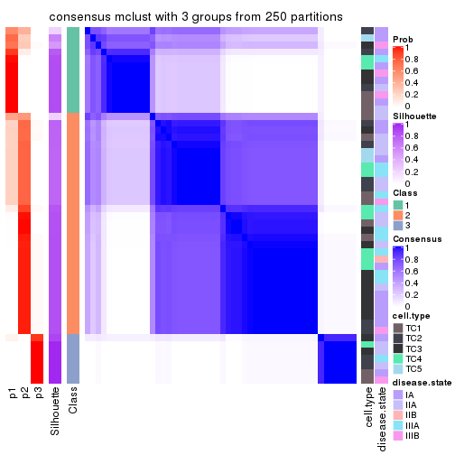</p>

</div>
<div id='tab-ATC-mclust-consensus-heatmap-3'>
<pre><code class="r">consensus_heatmap(res, k = 4)
</code></pre>

<p>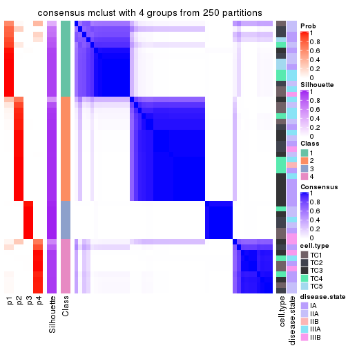</p>

</div>
<div id='tab-ATC-mclust-consensus-heatmap-4'>
<pre><code class="r">consensus_heatmap(res, k = 5)
</code></pre>

<p>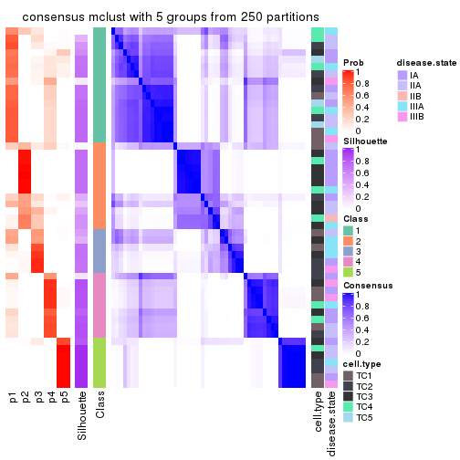</p>

</div>
<div id='tab-ATC-mclust-consensus-heatmap-5'>
<pre><code class="r">consensus_heatmap(res, k = 6)
</code></pre>

<p>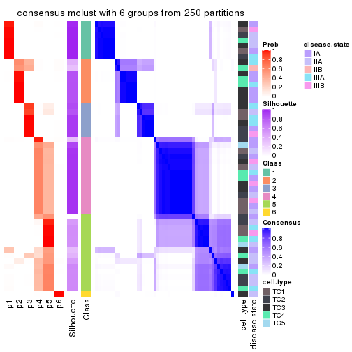</p>

</div>
</div>

Heatmaps for the membership of samples in all partitions to see how consistent they are:


<script>
$( function() {
	$( '#tabs-ATC-mclust-membership-heatmap' ).tabs();
} );
</script>
<div id='tabs-ATC-mclust-membership-heatmap'>
<ul>
<li><a href='#tab-ATC-mclust-membership-heatmap-1'>k = 2</a></li>
<li><a href='#tab-ATC-mclust-membership-heatmap-2'>k = 3</a></li>
<li><a href='#tab-ATC-mclust-membership-heatmap-3'>k = 4</a></li>
<li><a href='#tab-ATC-mclust-membership-heatmap-4'>k = 5</a></li>
<li><a href='#tab-ATC-mclust-membership-heatmap-5'>k = 6</a></li>
</ul>
<div id='tab-ATC-mclust-membership-heatmap-1'>
<pre><code class="r">membership_heatmap(res, k = 2)
</code></pre>

<p>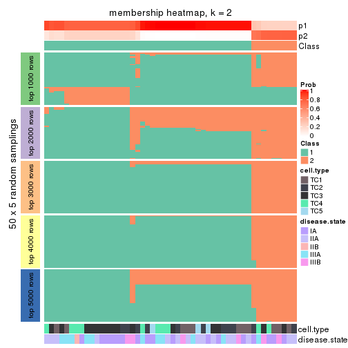</p>

</div>
<div id='tab-ATC-mclust-membership-heatmap-2'>
<pre><code class="r">membership_heatmap(res, k = 3)
</code></pre>

<p>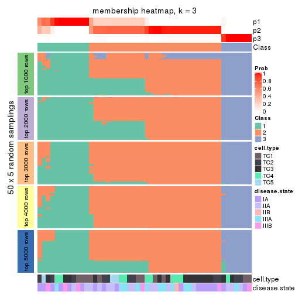</p>

</div>
<div id='tab-ATC-mclust-membership-heatmap-3'>
<pre><code class="r">membership_heatmap(res, k = 4)
</code></pre>

<p>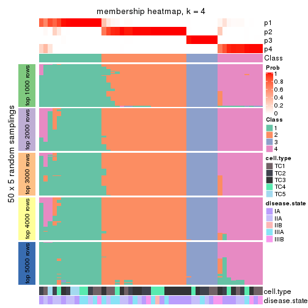</p>

</div>
<div id='tab-ATC-mclust-membership-heatmap-4'>
<pre><code class="r">membership_heatmap(res, k = 5)
</code></pre>

<p>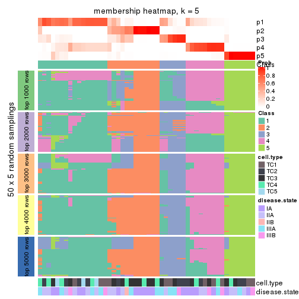</p>

</div>
<div id='tab-ATC-mclust-membership-heatmap-5'>
<pre><code class="r">membership_heatmap(res, k = 6)
</code></pre>

<p>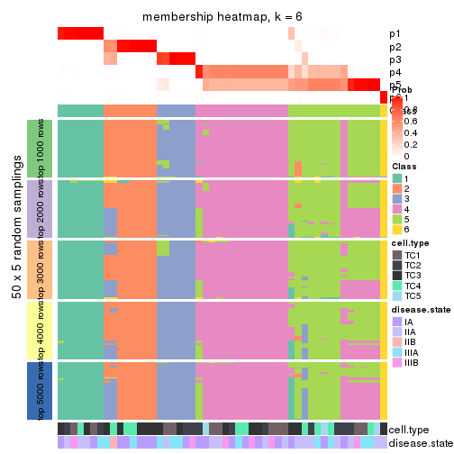</p>

</div>
</div>

As soon as we have had the classes for columns, we can look for signatures
which are significantly different between classes which can be candidate marks
for certain classes. Following are the heatmaps for signatures.


Signature heatmaps where rows are scaled:


<script>
$( function() {
	$( '#tabs-ATC-mclust-get-signatures' ).tabs();
} );
</script>
<div id='tabs-ATC-mclust-get-signatures'>
<ul>
<li><a href='#tab-ATC-mclust-get-signatures-1'>k = 2</a></li>
<li><a href='#tab-ATC-mclust-get-signatures-2'>k = 3</a></li>
<li><a href='#tab-ATC-mclust-get-signatures-3'>k = 4</a></li>
<li><a href='#tab-ATC-mclust-get-signatures-4'>k = 5</a></li>
<li><a href='#tab-ATC-mclust-get-signatures-5'>k = 6</a></li>
</ul>
<div id='tab-ATC-mclust-get-signatures-1'>
<pre><code class="r">get_signatures(res, k = 2)
</code></pre>

<p></p>

</div>
<div id='tab-ATC-mclust-get-signatures-2'>
<pre><code class="r">get_signatures(res, k = 3)
</code></pre>

<p>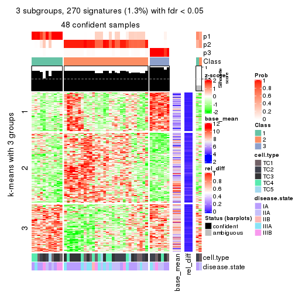</p>

</div>
<div id='tab-ATC-mclust-get-signatures-3'>
<pre><code class="r">get_signatures(res, k = 4)
</code></pre>

<p>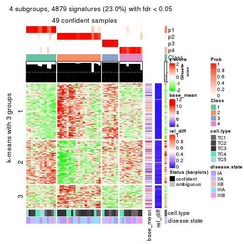</p>

</div>
<div id='tab-ATC-mclust-get-signatures-4'>
<pre><code class="r">get_signatures(res, k = 5)
</code></pre>

<p>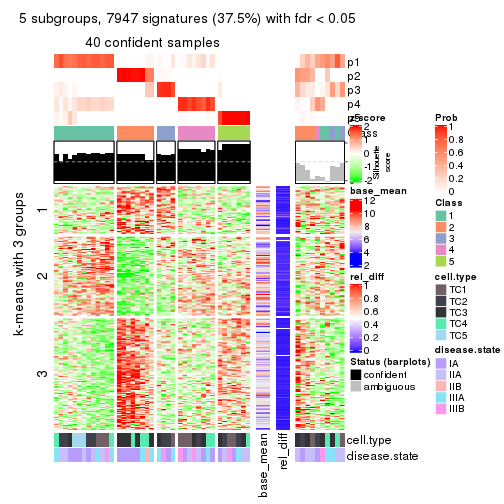</p>

</div>
<div id='tab-ATC-mclust-get-signatures-5'>
<pre><code class="r">get_signatures(res, k = 6)
</code></pre>

<p>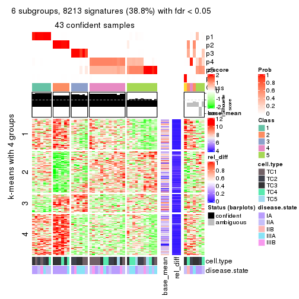</p>

</div>
</div>


Signature heatmaps where rows are not scaled:


<script>
$( function() {
	$( '#tabs-ATC-mclust-get-signatures-no-scale' ).tabs();
} );
</script>
<div id='tabs-ATC-mclust-get-signatures-no-scale'>
<ul>
<li><a href='#tab-ATC-mclust-get-signatures-no-scale-1'>k = 2</a></li>
<li><a href='#tab-ATC-mclust-get-signatures-no-scale-2'>k = 3</a></li>
<li><a href='#tab-ATC-mclust-get-signatures-no-scale-3'>k = 4</a></li>
<li><a href='#tab-ATC-mclust-get-signatures-no-scale-4'>k = 5</a></li>
<li><a href='#tab-ATC-mclust-get-signatures-no-scale-5'>k = 6</a></li>
</ul>
<div id='tab-ATC-mclust-get-signatures-no-scale-1'>
<pre><code class="r">get_signatures(res, k = 2, scale_rows = FALSE)
</code></pre>

<p></p>

</div>
<div id='tab-ATC-mclust-get-signatures-no-scale-2'>
<pre><code class="r">get_signatures(res, k = 3, scale_rows = FALSE)
</code></pre>

<p>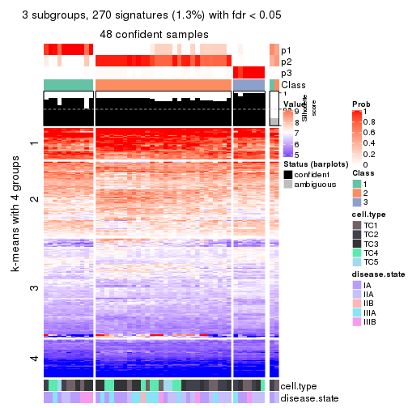</p>

</div>
<div id='tab-ATC-mclust-get-signatures-no-scale-3'>
<pre><code class="r">get_signatures(res, k = 4, scale_rows = FALSE)
</code></pre>

<p>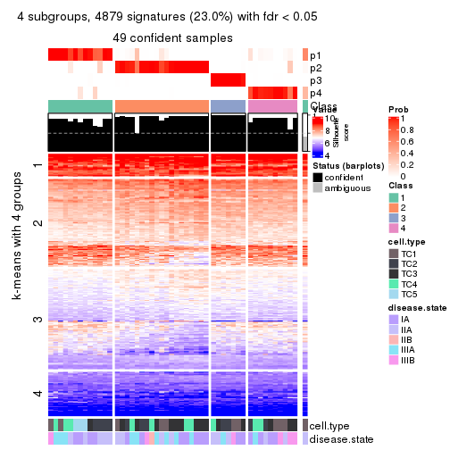</p>

</div>
<div id='tab-ATC-mclust-get-signatures-no-scale-4'>
<pre><code class="r">get_signatures(res, k = 5, scale_rows = FALSE)
</code></pre>

<p>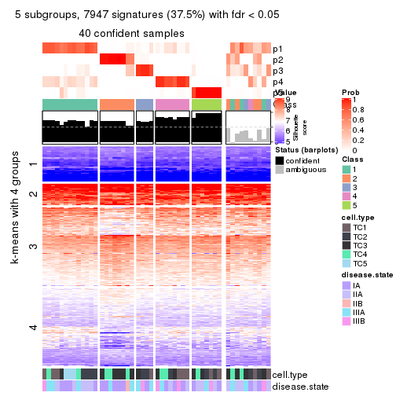</p>

</div>
<div id='tab-ATC-mclust-get-signatures-no-scale-5'>
<pre><code class="r">get_signatures(res, k = 6, scale_rows = FALSE)
</code></pre>

<p>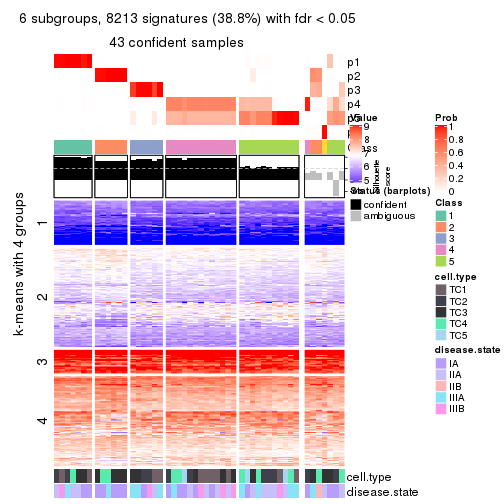</p>

</div>
</div>


Compare the overlap of signatures from different k:

```r
compare_signatures(res)
```

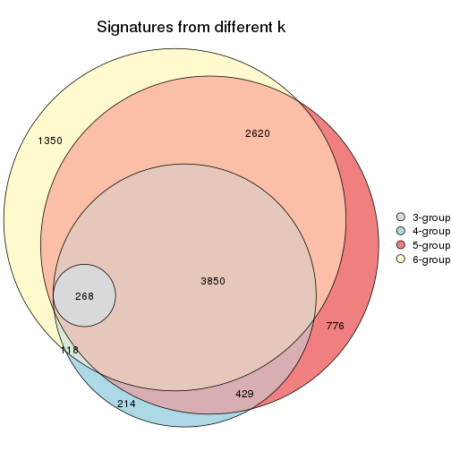

`get_signature()` returns a data frame invisibly. TO get the list of signatures, the function
call should be assigned to a variable explicitly. In following code, if `plot` argument is set
to `FALSE`, no heatmap is plotted while only the differential analysis is performed.

```r
# code only for demonstration
tb = get_signature(res, k = ..., plot = FALSE)
```

An example of the output of `tb` is:

```
#>   which_row         fdr    mean_1    mean_2 scaled_mean_1 scaled_mean_2 km
#> 1        38 0.042760348  8.373488  9.131774    -0.5533452     0.5164555  1
#> 2        40 0.018707592  7.106213  8.469186    -0.6173731     0.5762149  1
#> 3        55 0.019134737 10.221463 11.207825    -0.6159697     0.5749050  1
#> 4        59 0.006059896  5.921854  7.869574    -0.6899429     0.6439467  1
#> 5        60 0.018055526  8.928898 10.211722    -0.6204761     0.5791110  1
#> 6        98 0.009384629 15.714769 14.887706     0.6635654    -0.6193277  2
...
```

The columns in `tb` are:

1. `which_row`: row indices corresponding to the input matrix.
2. `fdr`: FDR for the differential test. 
3. `mean_x`: The mean value in group x.
4. `scaled_mean_x`: The mean value in group x after rows are scaled.
5. `km`: Row groups if k-means clustering is applied to rows.


UMAP plot which shows how samples are separated.


<script>
$( function() {
	$( '#tabs-ATC-mclust-dimension-reduction' ).tabs();
} );
</script>
<div id='tabs-ATC-mclust-dimension-reduction'>
<ul>
<li><a href='#tab-ATC-mclust-dimension-reduction-1'>k = 2</a></li>
<li><a href='#tab-ATC-mclust-dimension-reduction-2'>k = 3</a></li>
<li><a href='#tab-ATC-mclust-dimension-reduction-3'>k = 4</a></li>
<li><a href='#tab-ATC-mclust-dimension-reduction-4'>k = 5</a></li>
<li><a href='#tab-ATC-mclust-dimension-reduction-5'>k = 6</a></li>
</ul>
<div id='tab-ATC-mclust-dimension-reduction-1'>
<pre><code class="r">dimension_reduction(res, k = 2, method = &quot;UMAP&quot;)
</code></pre>

<p>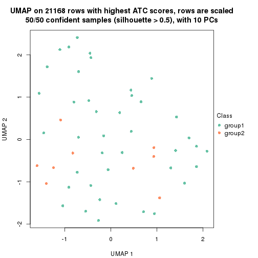</p>

</div>
<div id='tab-ATC-mclust-dimension-reduction-2'>
<pre><code class="r">dimension_reduction(res, k = 3, method = &quot;UMAP&quot;)
</code></pre>

<p>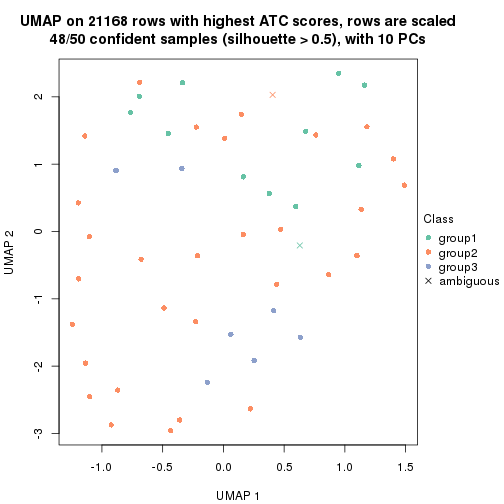</p>

</div>
<div id='tab-ATC-mclust-dimension-reduction-3'>
<pre><code class="r">dimension_reduction(res, k = 4, method = &quot;UMAP&quot;)
</code></pre>

<p>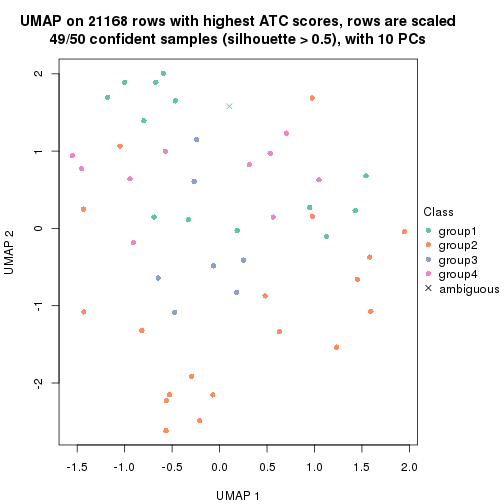</p>

</div>
<div id='tab-ATC-mclust-dimension-reduction-4'>
<pre><code class="r">dimension_reduction(res, k = 5, method = &quot;UMAP&quot;)
</code></pre>

<p>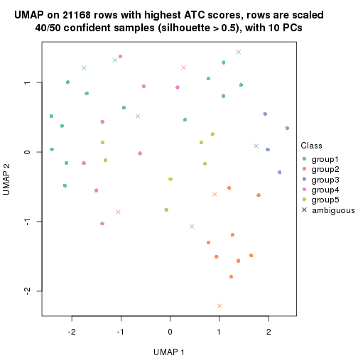</p>

</div>
<div id='tab-ATC-mclust-dimension-reduction-5'>
<pre><code class="r">dimension_reduction(res, k = 6, method = &quot;UMAP&quot;)
</code></pre>

<p>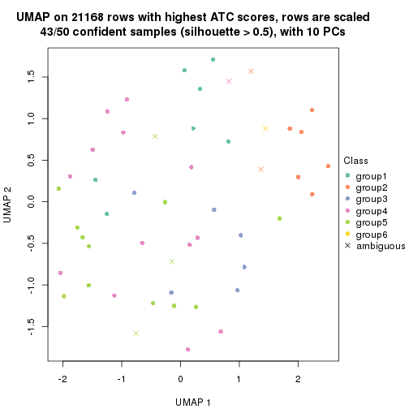</p>

</div>
</div>


Following heatmap shows how subgroups are split when increasing `k`:

```r
collect_classes(res)
```

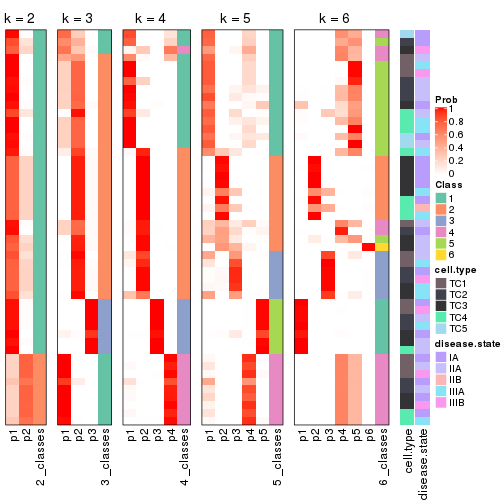


Test correlation between subgroups and known annotations. If the known
annotation is numeric, one-way ANOVA test is applied, and if the known
annotation is discrete, chi-squared contingency table test is applied.

```r
test_to_known_factors(res)
```

```
#>             n cell.type(p) disease.state(p) k
#> ATC:mclust 50        0.818            0.673 2
#> ATC:mclust 48        0.984            0.569 3
#> ATC:mclust 49        0.274            0.739 4
#> ATC:mclust 40        0.187            0.500 5
#> ATC:mclust 43        0.482            0.156 6
```


If matrix rows can be associated to genes, consider to use `functional_enrichment(res,
...)` to perform function enrichment for the signature genes. See [this vignette](http://bioconductor.org/packages/devel/bioc/vignettes/cola/inst/doc/functional_enrichment.html) for more detailed explanations.


 

---------------------------------------------------


### ATC:NMF**


The object with results only for a single top-value method and a single partition method 
can be extracted as:

```r
res = res_list["ATC", "NMF"]
# you can also extract it by
# res = res_list["ATC:NMF"]
```

A summary of `res` and all the functions that can be applied to it:

```r
res
```

```
#> A 'ConsensusPartition' object with k = 2, 3, 4, 5, 6.
#>   On a matrix with 21168 rows and 50 columns.
#>   Top rows (1000, 2000, 3000, 4000, 5000) are extracted by 'ATC' method.
#>   Subgroups are detected by 'NMF' method.
#>   Performed in total 1250 partitions by row resampling.
#>   Best k for subgroups seems to be 2.
#> 
#> Following methods can be applied to this 'ConsensusPartition' object:
#>  [1] "cola_report"             "collect_classes"         "collect_plots"          
#>  [4] "collect_stats"           "colnames"                "compare_signatures"     
#>  [7] "consensus_heatmap"       "dimension_reduction"     "functional_enrichment"  
#> [10] "get_anno_col"            "get_anno"                "get_classes"            
#> [13] "get_consensus"           "get_matrix"              "get_membership"         
#> [16] "get_param"               "get_signatures"          "get_stats"              
#> [19] "is_best_k"               "is_stable_k"             "membership_heatmap"     
#> [22] "ncol"                    "nrow"                    "plot_ecdf"              
#> [25] "rownames"                "select_partition_number" "show"                   
#> [28] "suggest_best_k"          "test_to_known_factors"
```

`collect_plots()` function collects all the plots made from `res` for all `k` (number of partitions)
into one single page to provide an easy and fast comparison between different `k`.

```r
collect_plots(res)
```

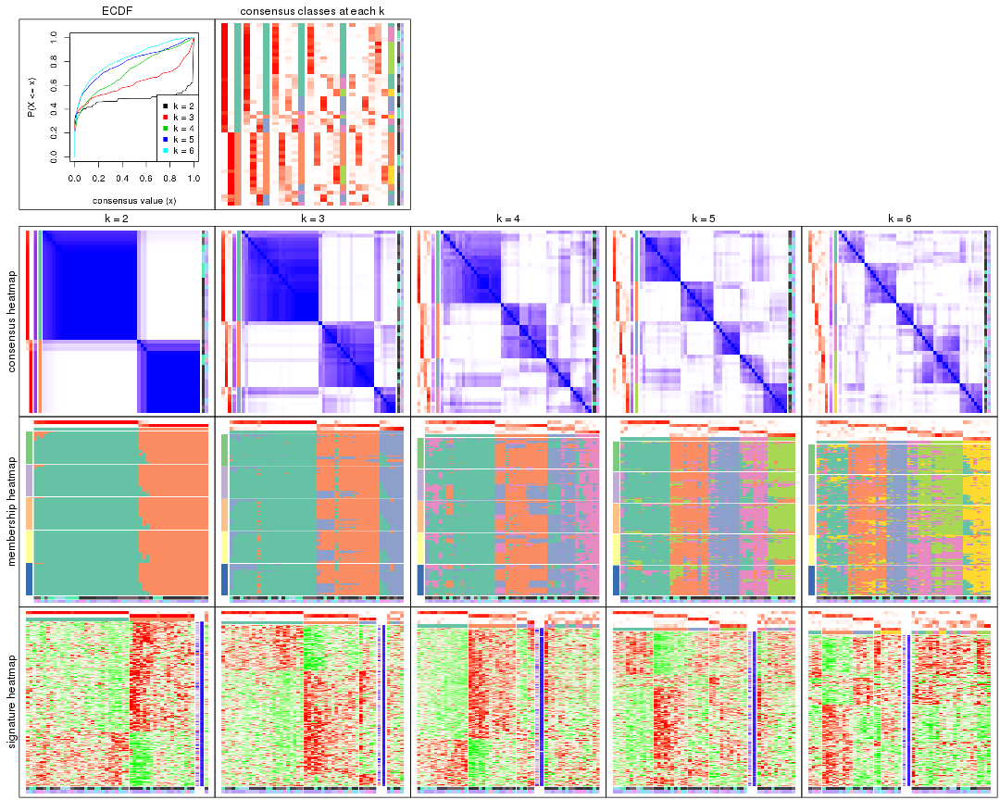

The plots are:

- The first row: a plot of the ECDF (empirical cumulative distribution
  function) curves of the consensus matrix for each `k` and the heatmap of
  predicted classes for each `k`.
- The second row: heatmaps of the consensus matrix for each `k`.
- The third row: heatmaps of the membership matrix for each `k`.
- The fouth row: heatmaps of the signatures for each `k`.

All the plots in panels can be made by individual functions and they are
plotted later in this section.

`select_partition_number()` produces several plots showing different
statistics for choosing "optimized" `k`. There are following statistics:

- ECDF curves of the consensus matrix for each `k`;
- 1-PAC. [The PAC
  score](https://en.wikipedia.org/wiki/Consensus_clustering#Over-interpretation_potential_of_consensus_clustering)
  measures the proportion of the ambiguous subgrouping.
- Mean silhouette score.
- Concordance. The mean probability of fiting the consensus class ids in all
  partitions.
- Area increased. Denote $A_k$ as the area under the ECDF curve for current
  `k`, the area increased is defined as $A_k - A_{k-1}$.
- Rand index. The percent of pairs of samples that are both in a same cluster
  or both are not in a same cluster in the partition of k and k-1.
- Jaccard index. The ratio of pairs of samples are both in a same cluster in
  the partition of k and k-1 and the pairs of samples are both in a same
  cluster in the partition k or k-1.

The detailed explanations of these statistics can be found in [the _cola_
vignette](http://bioconductor.org/packages/devel/bioc/vignettes/cola/inst/doc/cola.html#toc_13).

Generally speaking, lower PAC score, higher mean silhouette score or higher
concordance corresponds to better partition. Rand index and Jaccard index
measure how similar the current partition is compared to partition with `k-1`.
If they are too similar, we won't accept `k` is better than `k-1`.

```r
select_partition_number(res)
```

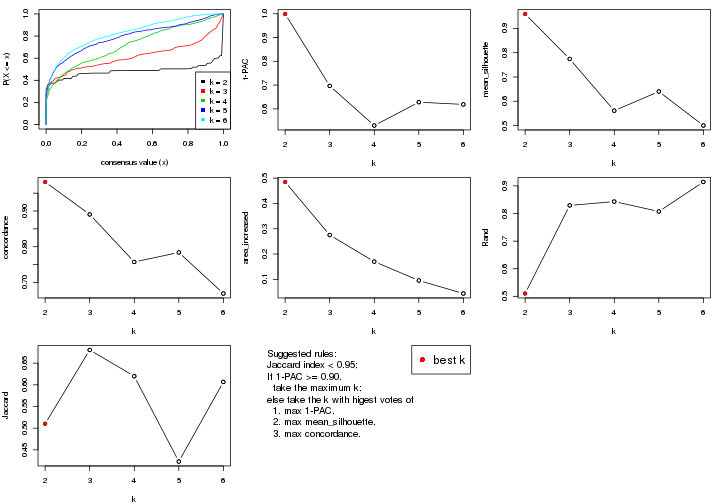

The numeric values for all these statistics can be obtained by `get_stats()`.

```r
get_stats(res)
```

```
#>   k 1-PAC mean_silhouette concordance area_increased  Rand Jaccard
#> 2 2 0.999           0.960       0.981         0.4849 0.510   0.510
#> 3 3 0.697           0.774       0.890         0.2751 0.829   0.680
#> 4 4 0.530           0.561       0.757         0.1701 0.843   0.620
#> 5 5 0.628           0.640       0.784         0.0954 0.807   0.423
#> 6 6 0.619           0.500       0.669         0.0440 0.914   0.607
```

`suggest_best_k()` suggests the best $k$ based on these statistics. The rules are as follows:

- All $k$ with Jaccard index larger than 0.95 are removed because increasing
  $k$ does not provide enough extra information. If all $k$ are removed, it is
  marked as no subgroup is detected.
- For all $k$ with 1-PAC score larger than 0.9, the maximal $k$ is taken as
  the best $k$, and other $k$ are marked as optional $k$.
- If it does not fit the second rule. The $k$ with the maximal vote of the
  highest 1-PAC score, highest mean silhouette, and highest concordance is
  taken as the best $k$.

```r
suggest_best_k(res)
```

```
#> [1] 2
```


Following shows the table of the partitions (You need to click the **show/hide
code output** link to see it). The membership matrix (columns with name `p*`)
is inferred by
[`clue::cl_consensus()`](https://www.rdocumentation.org/link/cl_consensus?package=clue)
function with the `SE` method. Basically the value in the membership matrix
represents the probability to belong to a certain group. The finall class
label for an item is determined with the group with highest probability it
belongs to.

In `get_classes()` function, the entropy is calculated from the membership
matrix and the silhouette score is calculated from the consensus matrix.


<script>
$( function() {
	$( '#tabs-ATC-NMF-get-classes' ).tabs();
} );
</script>
<div id='tabs-ATC-NMF-get-classes'>
<ul>
<li><a href='#tab-ATC-NMF-get-classes-1'>k = 2</a></li>
<li><a href='#tab-ATC-NMF-get-classes-2'>k = 3</a></li>
<li><a href='#tab-ATC-NMF-get-classes-3'>k = 4</a></li>
<li><a href='#tab-ATC-NMF-get-classes-4'>k = 5</a></li>
<li><a href='#tab-ATC-NMF-get-classes-5'>k = 6</a></li>
</ul>

<div id='tab-ATC-NMF-get-classes-1'>
<p><a id='tab-ATC-NMF-get-classes-1-a' style='color:#0366d6' href='#'>show/hide code output</a></p>
<pre><code class="r">cbind(get_classes(res, k = 2), get_membership(res, k = 2))
</code></pre>

<pre><code>#&gt;          class entropy silhouette    p1    p2
#&gt; GSM63448     2  0.0000      0.963 0.000 1.000
#&gt; GSM63449     1  0.1633      0.972 0.976 0.024
#&gt; GSM63423     1  0.0000      0.991 1.000 0.000
#&gt; GSM63425     1  0.0000      0.991 1.000 0.000
#&gt; GSM63437     1  0.4562      0.897 0.904 0.096
#&gt; GSM63453     1  0.0000      0.991 1.000 0.000
#&gt; GSM63431     1  0.0000      0.991 1.000 0.000
#&gt; GSM63450     1  0.0000      0.991 1.000 0.000
#&gt; GSM63428     1  0.2948      0.946 0.948 0.052
#&gt; GSM63432     2  0.5946      0.831 0.144 0.856
#&gt; GSM63458     1  0.0000      0.991 1.000 0.000
#&gt; GSM63434     2  0.0000      0.963 0.000 1.000
#&gt; GSM63435     1  0.0000      0.991 1.000 0.000
#&gt; GSM63442     1  0.0000      0.991 1.000 0.000
#&gt; GSM63451     2  0.9393      0.470 0.356 0.644
#&gt; GSM63422     1  0.0000      0.991 1.000 0.000
#&gt; GSM63438     1  0.0000      0.991 1.000 0.000
#&gt; GSM63439     2  0.0000      0.963 0.000 1.000
#&gt; GSM63461     1  0.0000      0.991 1.000 0.000
#&gt; GSM63463     1  0.0000      0.991 1.000 0.000
#&gt; GSM63430     2  0.0000      0.963 0.000 1.000
#&gt; GSM63446     2  0.6712      0.792 0.176 0.824
#&gt; GSM63429     1  0.0000      0.991 1.000 0.000
#&gt; GSM63445     1  0.0000      0.991 1.000 0.000
#&gt; GSM63447     2  0.0000      0.963 0.000 1.000
#&gt; GSM63459     2  0.0000      0.963 0.000 1.000
#&gt; GSM63464     2  0.0000      0.963 0.000 1.000
#&gt; GSM63469     2  0.0000      0.963 0.000 1.000
#&gt; GSM63470     2  0.0000      0.963 0.000 1.000
#&gt; GSM63436     2  0.0376      0.961 0.004 0.996
#&gt; GSM63443     2  0.0000      0.963 0.000 1.000
#&gt; GSM63465     2  0.0000      0.963 0.000 1.000
#&gt; GSM63444     2  0.0000      0.963 0.000 1.000
#&gt; GSM63456     2  0.0000      0.963 0.000 1.000
#&gt; GSM63462     1  0.0000      0.991 1.000 0.000
#&gt; GSM63424     1  0.0000      0.991 1.000 0.000
#&gt; GSM63440     1  0.0000      0.991 1.000 0.000
#&gt; GSM63433     1  0.0000      0.991 1.000 0.000
#&gt; GSM63466     2  0.0000      0.963 0.000 1.000
#&gt; GSM63426     1  0.0376      0.988 0.996 0.004
#&gt; GSM63468     1  0.0000      0.991 1.000 0.000
#&gt; GSM63452     2  0.0000      0.963 0.000 1.000
#&gt; GSM63441     1  0.3431      0.934 0.936 0.064
#&gt; GSM63454     1  0.0000      0.991 1.000 0.000
#&gt; GSM63455     1  0.0000      0.991 1.000 0.000
#&gt; GSM63460     2  0.0000      0.963 0.000 1.000
#&gt; GSM63467     1  0.0672      0.985 0.992 0.008
#&gt; GSM63421     1  0.0000      0.991 1.000 0.000
#&gt; GSM63427     1  0.0000      0.991 1.000 0.000
#&gt; GSM63457     1  0.0000      0.991 1.000 0.000
</code></pre>

<script>
$('#tab-ATC-NMF-get-classes-1-a').parent().next().next().hide();
$('#tab-ATC-NMF-get-classes-1-a').click(function(){
  $('#tab-ATC-NMF-get-classes-1-a').parent().next().next().toggle();
  return(false);
});
</script>
</div>

<div id='tab-ATC-NMF-get-classes-2'>
<p><a id='tab-ATC-NMF-get-classes-2-a' style='color:#0366d6' href='#'>show/hide code output</a></p>
<pre><code class="r">cbind(get_classes(res, k = 3), get_membership(res, k = 3))
</code></pre>

<pre><code>#&gt;          class entropy silhouette    p1    p2    p3
#&gt; GSM63448     2  0.0592     0.8292 0.000 0.988 0.012
#&gt; GSM63449     1  0.3193     0.8690 0.896 0.004 0.100
#&gt; GSM63423     1  0.2711     0.8798 0.912 0.000 0.088
#&gt; GSM63425     1  0.2165     0.8962 0.936 0.000 0.064
#&gt; GSM63437     3  0.1182     0.7271 0.012 0.012 0.976
#&gt; GSM63453     1  0.0000     0.9223 1.000 0.000 0.000
#&gt; GSM63431     1  0.0000     0.9223 1.000 0.000 0.000
#&gt; GSM63450     1  0.0000     0.9223 1.000 0.000 0.000
#&gt; GSM63428     3  0.4128     0.7090 0.132 0.012 0.856
#&gt; GSM63432     2  0.3845     0.7597 0.116 0.872 0.012
#&gt; GSM63458     1  0.0000     0.9223 1.000 0.000 0.000
#&gt; GSM63434     2  0.6274     0.4673 0.000 0.544 0.456
#&gt; GSM63435     1  0.1163     0.9182 0.972 0.000 0.028
#&gt; GSM63442     1  0.4062     0.7946 0.836 0.000 0.164
#&gt; GSM63451     3  0.0592     0.7243 0.000 0.012 0.988
#&gt; GSM63422     1  0.0592     0.9213 0.988 0.000 0.012
#&gt; GSM63438     1  0.2711     0.8823 0.912 0.000 0.088
#&gt; GSM63439     2  0.2878     0.8300 0.000 0.904 0.096
#&gt; GSM63461     1  0.1482     0.9076 0.968 0.012 0.020
#&gt; GSM63463     1  0.6016     0.5575 0.724 0.256 0.020
#&gt; GSM63430     2  0.0000     0.8257 0.000 1.000 0.000
#&gt; GSM63446     3  0.0424     0.7245 0.000 0.008 0.992
#&gt; GSM63429     1  0.3340     0.8514 0.880 0.000 0.120
#&gt; GSM63445     1  0.0424     0.9203 0.992 0.008 0.000
#&gt; GSM63447     2  0.3412     0.8243 0.000 0.876 0.124
#&gt; GSM63459     2  0.5254     0.7509 0.000 0.736 0.264
#&gt; GSM63464     2  0.0592     0.8216 0.000 0.988 0.012
#&gt; GSM63469     2  0.3941     0.8132 0.000 0.844 0.156
#&gt; GSM63470     2  0.1860     0.8327 0.000 0.948 0.052
#&gt; GSM63436     2  0.4165     0.8164 0.048 0.876 0.076
#&gt; GSM63443     3  0.3116     0.6091 0.000 0.108 0.892
#&gt; GSM63465     2  0.1031     0.8183 0.000 0.976 0.024
#&gt; GSM63444     2  0.5291     0.7482 0.000 0.732 0.268
#&gt; GSM63456     2  0.6161     0.7300 0.016 0.696 0.288
#&gt; GSM63462     1  0.1289     0.9160 0.968 0.000 0.032
#&gt; GSM63424     3  0.6307     0.0560 0.488 0.000 0.512
#&gt; GSM63440     3  0.5968     0.4244 0.364 0.000 0.636
#&gt; GSM63433     1  0.1411     0.9121 0.964 0.000 0.036
#&gt; GSM63466     2  0.0424     0.8283 0.000 0.992 0.008
#&gt; GSM63426     1  0.0747     0.9162 0.984 0.016 0.000
#&gt; GSM63468     1  0.0747     0.9162 0.984 0.000 0.016
#&gt; GSM63452     2  0.5465     0.7308 0.000 0.712 0.288
#&gt; GSM63441     1  0.6680    -0.0963 0.508 0.008 0.484
#&gt; GSM63454     1  0.0000     0.9223 1.000 0.000 0.000
#&gt; GSM63455     1  0.0000     0.9223 1.000 0.000 0.000
#&gt; GSM63460     2  0.0747     0.8208 0.000 0.984 0.016
#&gt; GSM63467     2  0.6896     0.2231 0.392 0.588 0.020
#&gt; GSM63421     1  0.0592     0.9213 0.988 0.000 0.012
#&gt; GSM63427     1  0.0000     0.9223 1.000 0.000 0.000
#&gt; GSM63457     1  0.0000     0.9223 1.000 0.000 0.000
</code></pre>

<script>
$('#tab-ATC-NMF-get-classes-2-a').parent().next().next().hide();
$('#tab-ATC-NMF-get-classes-2-a').click(function(){
  $('#tab-ATC-NMF-get-classes-2-a').parent().next().next().toggle();
  return(false);
});
</script>
</div>

<div id='tab-ATC-NMF-get-classes-3'>
<p><a id='tab-ATC-NMF-get-classes-3-a' style='color:#0366d6' href='#'>show/hide code output</a></p>
<pre><code class="r">cbind(get_classes(res, k = 4), get_membership(res, k = 4))
</code></pre>

<pre><code>#&gt;          class entropy silhouette    p1    p2    p3    p4
#&gt; GSM63448     2  0.5755     0.6445 0.000 0.624 0.332 0.044
#&gt; GSM63449     1  0.5941     0.3133 0.584 0.004 0.036 0.376
#&gt; GSM63423     1  0.5442     0.4368 0.636 0.000 0.028 0.336
#&gt; GSM63425     1  0.1724     0.7791 0.948 0.000 0.032 0.020
#&gt; GSM63437     4  0.0336     0.5726 0.000 0.008 0.000 0.992
#&gt; GSM63453     1  0.0921     0.7765 0.972 0.000 0.028 0.000
#&gt; GSM63431     1  0.0336     0.7824 0.992 0.000 0.008 0.000
#&gt; GSM63450     1  0.2174     0.7573 0.928 0.020 0.052 0.000
#&gt; GSM63428     4  0.2915     0.5904 0.088 0.004 0.016 0.892
#&gt; GSM63432     2  0.6952     0.6092 0.056 0.560 0.352 0.032
#&gt; GSM63458     1  0.0469     0.7821 0.988 0.000 0.012 0.000
#&gt; GSM63434     4  0.6522     0.3883 0.000 0.144 0.224 0.632
#&gt; GSM63435     1  0.3448     0.6455 0.828 0.000 0.168 0.004
#&gt; GSM63442     1  0.5022     0.5487 0.708 0.000 0.028 0.264
#&gt; GSM63451     3  0.7222     0.0834 0.016 0.092 0.492 0.400
#&gt; GSM63422     1  0.1792     0.7580 0.932 0.000 0.068 0.000
#&gt; GSM63438     1  0.7771    -0.0674 0.408 0.000 0.348 0.244
#&gt; GSM63439     2  0.6561     0.6253 0.000 0.564 0.344 0.092
#&gt; GSM63461     3  0.4961     0.3580 0.448 0.000 0.552 0.000
#&gt; GSM63463     3  0.4826     0.5034 0.264 0.020 0.716 0.000
#&gt; GSM63430     2  0.5057     0.6478 0.000 0.648 0.340 0.012
#&gt; GSM63446     3  0.7375     0.4413 0.036 0.228 0.608 0.128
#&gt; GSM63429     1  0.5256     0.5769 0.700 0.000 0.040 0.260
#&gt; GSM63445     1  0.5530     0.4619 0.616 0.004 0.360 0.020
#&gt; GSM63447     2  0.4756     0.7126 0.000 0.784 0.144 0.072
#&gt; GSM63459     2  0.4423     0.6311 0.000 0.788 0.036 0.176
#&gt; GSM63464     2  0.1118     0.7110 0.000 0.964 0.036 0.000
#&gt; GSM63469     2  0.2722     0.6908 0.000 0.904 0.032 0.064
#&gt; GSM63470     2  0.1488     0.6984 0.000 0.956 0.032 0.012
#&gt; GSM63436     2  0.8277     0.5590 0.084 0.512 0.300 0.104
#&gt; GSM63443     4  0.3999     0.4674 0.000 0.140 0.036 0.824
#&gt; GSM63465     3  0.4948     0.3396 0.000 0.440 0.560 0.000
#&gt; GSM63444     2  0.4267     0.6291 0.000 0.788 0.024 0.188
#&gt; GSM63456     3  0.6074     0.4065 0.008 0.376 0.580 0.036
#&gt; GSM63462     3  0.5125     0.5126 0.388 0.000 0.604 0.008
#&gt; GSM63424     4  0.6323     0.3550 0.112 0.000 0.248 0.640
#&gt; GSM63440     4  0.6808     0.3041 0.320 0.000 0.120 0.560
#&gt; GSM63433     1  0.2563     0.7577 0.908 0.000 0.020 0.072
#&gt; GSM63466     2  0.0921     0.7129 0.000 0.972 0.028 0.000
#&gt; GSM63426     1  0.7006     0.3748 0.580 0.040 0.324 0.056
#&gt; GSM63468     3  0.4817     0.5144 0.388 0.000 0.612 0.000
#&gt; GSM63452     2  0.5035     0.5961 0.000 0.744 0.052 0.204
#&gt; GSM63441     4  0.5876     0.0747 0.432 0.012 0.016 0.540
#&gt; GSM63454     1  0.0895     0.7815 0.976 0.000 0.020 0.004
#&gt; GSM63455     1  0.0469     0.7818 0.988 0.000 0.012 0.000
#&gt; GSM63460     2  0.0921     0.6998 0.000 0.972 0.028 0.000
#&gt; GSM63467     2  0.7463     0.4079 0.180 0.456 0.364 0.000
#&gt; GSM63421     1  0.0672     0.7849 0.984 0.000 0.008 0.008
#&gt; GSM63427     1  0.2940     0.7554 0.892 0.012 0.088 0.008
#&gt; GSM63457     1  0.0469     0.7818 0.988 0.000 0.012 0.000
</code></pre>

<script>
$('#tab-ATC-NMF-get-classes-3-a').parent().next().next().hide();
$('#tab-ATC-NMF-get-classes-3-a').click(function(){
  $('#tab-ATC-NMF-get-classes-3-a').parent().next().next().toggle();
  return(false);
});
</script>
</div>

<div id='tab-ATC-NMF-get-classes-4'>
<p><a id='tab-ATC-NMF-get-classes-4-a' style='color:#0366d6' href='#'>show/hide code output</a></p>
<pre><code class="r">cbind(get_classes(res, k = 5), get_membership(res, k = 5))
</code></pre>

<pre><code>#&gt;          class entropy silhouette    p1    p2    p3    p4    p5
#&gt; GSM63448     5  0.1893     0.8127 0.000 0.024 0.000 0.048 0.928
#&gt; GSM63449     4  0.5594     0.5656 0.232 0.000 0.000 0.632 0.136
#&gt; GSM63423     4  0.5953     0.4634 0.384 0.000 0.000 0.504 0.112
#&gt; GSM63425     1  0.2228     0.7784 0.920 0.000 0.028 0.040 0.012
#&gt; GSM63437     4  0.1768     0.5366 0.004 0.072 0.000 0.924 0.000
#&gt; GSM63453     1  0.3145     0.7405 0.844 0.136 0.008 0.012 0.000
#&gt; GSM63431     1  0.1369     0.7986 0.956 0.028 0.008 0.008 0.000
#&gt; GSM63450     1  0.3277     0.7335 0.832 0.148 0.008 0.012 0.000
#&gt; GSM63428     4  0.4489     0.5715 0.040 0.028 0.012 0.796 0.124
#&gt; GSM63432     5  0.2844     0.8164 0.032 0.016 0.000 0.064 0.888
#&gt; GSM63458     1  0.0510     0.7995 0.984 0.000 0.016 0.000 0.000
#&gt; GSM63434     4  0.6404     0.4813 0.000 0.060 0.128 0.632 0.180
#&gt; GSM63435     1  0.5748     0.0135 0.468 0.052 0.468 0.004 0.008
#&gt; GSM63442     1  0.6887    -0.1776 0.448 0.016 0.084 0.420 0.032
#&gt; GSM63451     3  0.2569     0.7529 0.000 0.040 0.892 0.068 0.000
#&gt; GSM63422     1  0.3203     0.7396 0.848 0.020 0.124 0.008 0.000
#&gt; GSM63438     3  0.6848     0.3649 0.060 0.004 0.564 0.268 0.104
#&gt; GSM63439     5  0.2354     0.8119 0.000 0.008 0.012 0.076 0.904
#&gt; GSM63461     3  0.2130     0.7589 0.080 0.000 0.908 0.000 0.012
#&gt; GSM63463     3  0.1087     0.7751 0.016 0.008 0.968 0.000 0.008
#&gt; GSM63430     5  0.1012     0.8065 0.000 0.012 0.000 0.020 0.968
#&gt; GSM63446     3  0.1059     0.7717 0.004 0.020 0.968 0.008 0.000
#&gt; GSM63429     4  0.6600     0.4813 0.352 0.004 0.024 0.512 0.108
#&gt; GSM63445     5  0.4793     0.5923 0.236 0.000 0.004 0.056 0.704
#&gt; GSM63447     2  0.5080     0.6722 0.000 0.604 0.000 0.048 0.348
#&gt; GSM63459     2  0.4361     0.7801 0.000 0.768 0.000 0.124 0.108
#&gt; GSM63464     2  0.4026     0.7724 0.000 0.736 0.000 0.020 0.244
#&gt; GSM63469     2  0.3794     0.7990 0.000 0.800 0.000 0.048 0.152
#&gt; GSM63470     2  0.3003     0.7976 0.000 0.812 0.000 0.000 0.188
#&gt; GSM63436     5  0.3467     0.7757 0.036 0.004 0.000 0.128 0.832
#&gt; GSM63443     4  0.3814     0.3108 0.000 0.276 0.004 0.720 0.000
#&gt; GSM63465     2  0.4497     0.3617 0.000 0.568 0.424 0.000 0.008
#&gt; GSM63444     2  0.4671     0.7713 0.000 0.740 0.000 0.144 0.116
#&gt; GSM63456     2  0.4054     0.6165 0.000 0.748 0.224 0.028 0.000
#&gt; GSM63462     3  0.0898     0.7748 0.020 0.008 0.972 0.000 0.000
#&gt; GSM63424     3  0.5904     0.4727 0.084 0.000 0.604 0.292 0.020
#&gt; GSM63440     3  0.6817     0.0827 0.184 0.000 0.404 0.400 0.012
#&gt; GSM63433     1  0.2331     0.7493 0.900 0.000 0.000 0.080 0.020
#&gt; GSM63466     2  0.4360     0.7399 0.000 0.680 0.000 0.020 0.300
#&gt; GSM63426     5  0.4786     0.6424 0.188 0.000 0.000 0.092 0.720
#&gt; GSM63468     3  0.2451     0.7589 0.056 0.036 0.904 0.004 0.000
#&gt; GSM63452     2  0.3243     0.7286 0.000 0.848 0.004 0.116 0.032
#&gt; GSM63441     4  0.5318     0.2339 0.460 0.020 0.004 0.504 0.012
#&gt; GSM63454     1  0.1659     0.7951 0.948 0.008 0.016 0.024 0.004
#&gt; GSM63455     1  0.2237     0.7814 0.904 0.084 0.004 0.008 0.000
#&gt; GSM63460     2  0.4076     0.7874 0.000 0.768 0.012 0.020 0.200
#&gt; GSM63467     5  0.3751     0.6918 0.044 0.092 0.004 0.020 0.840
#&gt; GSM63421     1  0.0880     0.7914 0.968 0.000 0.000 0.032 0.000
#&gt; GSM63427     1  0.2972     0.7387 0.876 0.004 0.004 0.032 0.084
#&gt; GSM63457     1  0.1830     0.7871 0.924 0.068 0.000 0.008 0.000
</code></pre>

<script>
$('#tab-ATC-NMF-get-classes-4-a').parent().next().next().hide();
$('#tab-ATC-NMF-get-classes-4-a').click(function(){
  $('#tab-ATC-NMF-get-classes-4-a').parent().next().next().toggle();
  return(false);
});
</script>
</div>

<div id='tab-ATC-NMF-get-classes-5'>
<p><a id='tab-ATC-NMF-get-classes-5-a' style='color:#0366d6' href='#'>show/hide code output</a></p>
<pre><code class="r">cbind(get_classes(res, k = 6), get_membership(res, k = 6))
</code></pre>

<pre><code>#&gt;          class entropy silhouette    p1    p2    p3    p4    p5    p6
#&gt; GSM63448     6  0.4362      0.662 0.068 0.060 0.000 0.100 0.000 0.772
#&gt; GSM63449     1  0.6688      0.207 0.420 0.000 0.012 0.400 0.096 0.072
#&gt; GSM63423     1  0.5071      0.547 0.704 0.000 0.000 0.148 0.096 0.052
#&gt; GSM63425     4  0.4379      0.173 0.000 0.000 0.028 0.576 0.396 0.000
#&gt; GSM63437     1  0.5673      0.501 0.632 0.148 0.004 0.192 0.008 0.016
#&gt; GSM63453     5  0.0582      0.488 0.004 0.000 0.004 0.004 0.984 0.004
#&gt; GSM63431     5  0.3765      0.285 0.000 0.000 0.000 0.404 0.596 0.000
#&gt; GSM63450     5  0.0696      0.482 0.004 0.004 0.008 0.000 0.980 0.004
#&gt; GSM63428     1  0.3137      0.542 0.864 0.004 0.004 0.044 0.020 0.064
#&gt; GSM63432     6  0.3992      0.698 0.068 0.016 0.008 0.100 0.004 0.804
#&gt; GSM63458     5  0.4072      0.160 0.000 0.000 0.008 0.448 0.544 0.000
#&gt; GSM63434     1  0.4247      0.506 0.796 0.012 0.080 0.028 0.004 0.080
#&gt; GSM63435     5  0.5939      0.204 0.080 0.000 0.256 0.052 0.600 0.012
#&gt; GSM63442     1  0.5247      0.477 0.600 0.000 0.036 0.032 0.324 0.008
#&gt; GSM63451     3  0.2796      0.817 0.052 0.024 0.884 0.032 0.000 0.008
#&gt; GSM63422     5  0.5279      0.287 0.000 0.000 0.120 0.324 0.556 0.000
#&gt; GSM63438     1  0.6026      0.424 0.592 0.000 0.272 0.064 0.036 0.036
#&gt; GSM63439     6  0.5171      0.650 0.196 0.024 0.036 0.048 0.000 0.696
#&gt; GSM63461     3  0.4235      0.706 0.000 0.000 0.756 0.168 0.032 0.044
#&gt; GSM63463     3  0.2011      0.841 0.004 0.000 0.912 0.064 0.000 0.020
#&gt; GSM63430     6  0.3066      0.695 0.056 0.024 0.000 0.060 0.000 0.860
#&gt; GSM63446     3  0.1346      0.845 0.008 0.016 0.952 0.024 0.000 0.000
#&gt; GSM63429     1  0.5397      0.492 0.632 0.000 0.012 0.264 0.068 0.024
#&gt; GSM63445     6  0.5432      0.525 0.036 0.000 0.012 0.232 0.068 0.652
#&gt; GSM63447     2  0.5993      0.606 0.048 0.580 0.000 0.136 0.000 0.236
#&gt; GSM63459     2  0.2756      0.702 0.084 0.872 0.000 0.028 0.000 0.016
#&gt; GSM63464     2  0.4959      0.685 0.024 0.696 0.004 0.064 0.004 0.208
#&gt; GSM63469     2  0.2981      0.732 0.020 0.848 0.000 0.016 0.000 0.116
#&gt; GSM63470     2  0.2468      0.741 0.008 0.884 0.004 0.012 0.000 0.092
#&gt; GSM63436     6  0.4448      0.293 0.464 0.004 0.000 0.008 0.008 0.516
#&gt; GSM63443     1  0.6050      0.208 0.508 0.336 0.012 0.132 0.000 0.012
#&gt; GSM63465     2  0.6470      0.420 0.036 0.532 0.304 0.100 0.004 0.024
#&gt; GSM63444     2  0.3845      0.692 0.072 0.816 0.004 0.068 0.000 0.040
#&gt; GSM63456     2  0.6237      0.370 0.012 0.528 0.320 0.028 0.108 0.004
#&gt; GSM63462     3  0.1793      0.838 0.004 0.016 0.932 0.040 0.008 0.000
#&gt; GSM63424     4  0.4482      0.161 0.040 0.000 0.360 0.600 0.000 0.000
#&gt; GSM63440     4  0.4595      0.396 0.056 0.000 0.228 0.700 0.012 0.004
#&gt; GSM63433     4  0.4090      0.229 0.008 0.000 0.004 0.604 0.384 0.000
#&gt; GSM63466     2  0.4167      0.602 0.000 0.612 0.000 0.020 0.000 0.368
#&gt; GSM63426     6  0.5636      0.372 0.368 0.000 0.000 0.064 0.040 0.528
#&gt; GSM63468     3  0.4884      0.720 0.028 0.032 0.724 0.188 0.020 0.008
#&gt; GSM63452     2  0.4291      0.674 0.072 0.776 0.000 0.024 0.120 0.008
#&gt; GSM63441     4  0.5195      0.381 0.088 0.060 0.016 0.744 0.076 0.016
#&gt; GSM63454     4  0.6087      0.127 0.036 0.076 0.008 0.500 0.376 0.004
#&gt; GSM63455     5  0.3081      0.529 0.000 0.000 0.000 0.220 0.776 0.004
#&gt; GSM63460     2  0.5582      0.689 0.028 0.692 0.044 0.076 0.004 0.156
#&gt; GSM63467     6  0.3073      0.576 0.004 0.072 0.012 0.032 0.012 0.868
#&gt; GSM63421     5  0.4009      0.382 0.004 0.000 0.000 0.356 0.632 0.008
#&gt; GSM63427     4  0.5415      0.120 0.000 0.000 0.008 0.504 0.396 0.092
#&gt; GSM63457     5  0.2902      0.535 0.000 0.000 0.000 0.196 0.800 0.004
</code></pre>

<script>
$('#tab-ATC-NMF-get-classes-5-a').parent().next().next().hide();
$('#tab-ATC-NMF-get-classes-5-a').click(function(){
  $('#tab-ATC-NMF-get-classes-5-a').parent().next().next().toggle();
  return(false);
});
</script>
</div>
</div>

Heatmaps for the consensus matrix. It visualizes the probability of two
samples to be in a same group.


<script>
$( function() {
	$( '#tabs-ATC-NMF-consensus-heatmap' ).tabs();
} );
</script>
<div id='tabs-ATC-NMF-consensus-heatmap'>
<ul>
<li><a href='#tab-ATC-NMF-consensus-heatmap-1'>k = 2</a></li>
<li><a href='#tab-ATC-NMF-consensus-heatmap-2'>k = 3</a></li>
<li><a href='#tab-ATC-NMF-consensus-heatmap-3'>k = 4</a></li>
<li><a href='#tab-ATC-NMF-consensus-heatmap-4'>k = 5</a></li>
<li><a href='#tab-ATC-NMF-consensus-heatmap-5'>k = 6</a></li>
</ul>
<div id='tab-ATC-NMF-consensus-heatmap-1'>
<pre><code class="r">consensus_heatmap(res, k = 2)
</code></pre>

<p>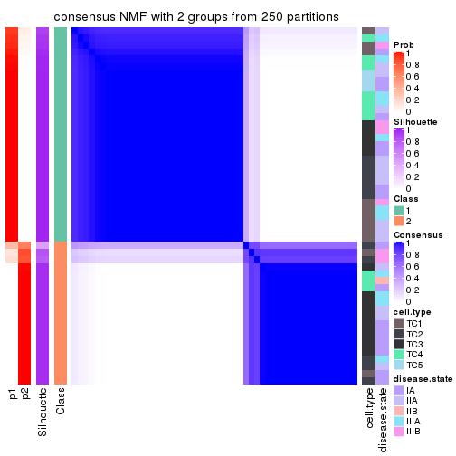</p>

</div>
<div id='tab-ATC-NMF-consensus-heatmap-2'>
<pre><code class="r">consensus_heatmap(res, k = 3)
</code></pre>

<p>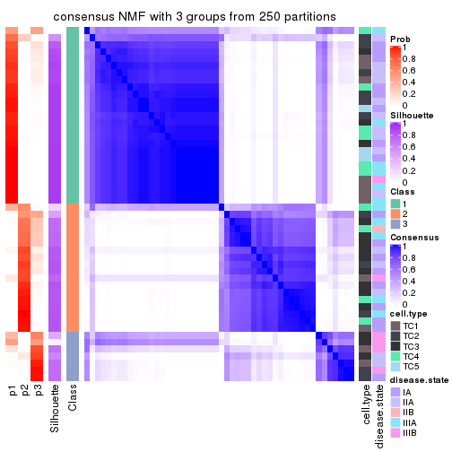</p>

</div>
<div id='tab-ATC-NMF-consensus-heatmap-3'>
<pre><code class="r">consensus_heatmap(res, k = 4)
</code></pre>

<p>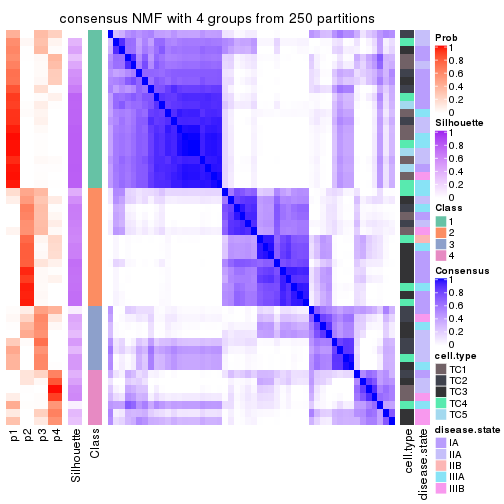</p>

</div>
<div id='tab-ATC-NMF-consensus-heatmap-4'>
<pre><code class="r">consensus_heatmap(res, k = 5)
</code></pre>

<p>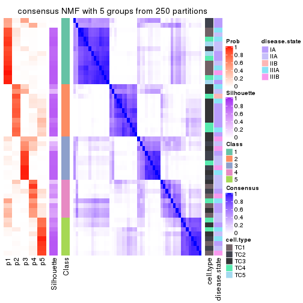</p>

</div>
<div id='tab-ATC-NMF-consensus-heatmap-5'>
<pre><code class="r">consensus_heatmap(res, k = 6)
</code></pre>

<p>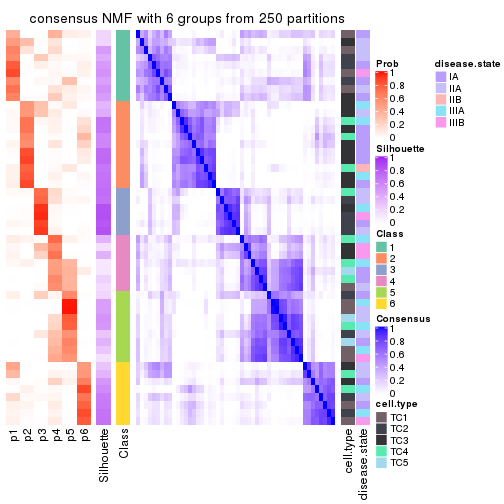</p>

</div>
</div>

Heatmaps for the membership of samples in all partitions to see how consistent they are:


<script>
$( function() {
	$( '#tabs-ATC-NMF-membership-heatmap' ).tabs();
} );
</script>
<div id='tabs-ATC-NMF-membership-heatmap'>
<ul>
<li><a href='#tab-ATC-NMF-membership-heatmap-1'>k = 2</a></li>
<li><a href='#tab-ATC-NMF-membership-heatmap-2'>k = 3</a></li>
<li><a href='#tab-ATC-NMF-membership-heatmap-3'>k = 4</a></li>
<li><a href='#tab-ATC-NMF-membership-heatmap-4'>k = 5</a></li>
<li><a href='#tab-ATC-NMF-membership-heatmap-5'>k = 6</a></li>
</ul>
<div id='tab-ATC-NMF-membership-heatmap-1'>
<pre><code class="r">membership_heatmap(res, k = 2)
</code></pre>

<p>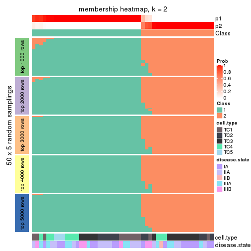</p>

</div>
<div id='tab-ATC-NMF-membership-heatmap-2'>
<pre><code class="r">membership_heatmap(res, k = 3)
</code></pre>

<p>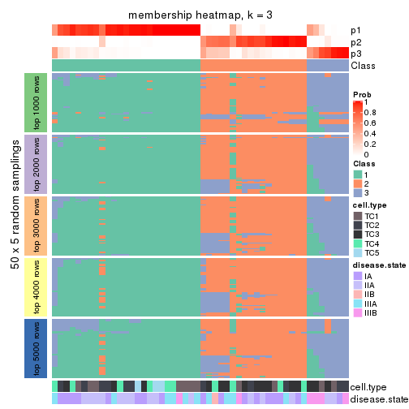</p>

</div>
<div id='tab-ATC-NMF-membership-heatmap-3'>
<pre><code class="r">membership_heatmap(res, k = 4)
</code></pre>

<p>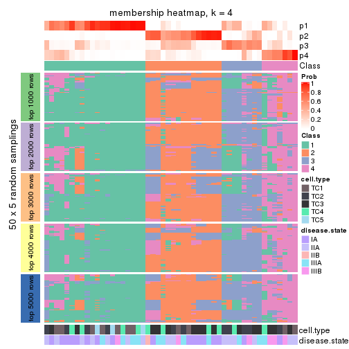</p>

</div>
<div id='tab-ATC-NMF-membership-heatmap-4'>
<pre><code class="r">membership_heatmap(res, k = 5)
</code></pre>

<p>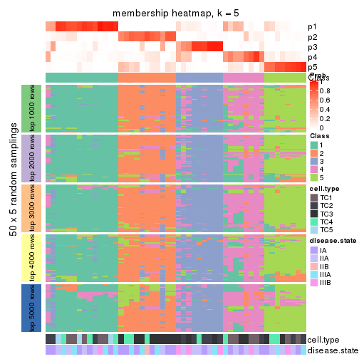</p>

</div>
<div id='tab-ATC-NMF-membership-heatmap-5'>
<pre><code class="r">membership_heatmap(res, k = 6)
</code></pre>

<p>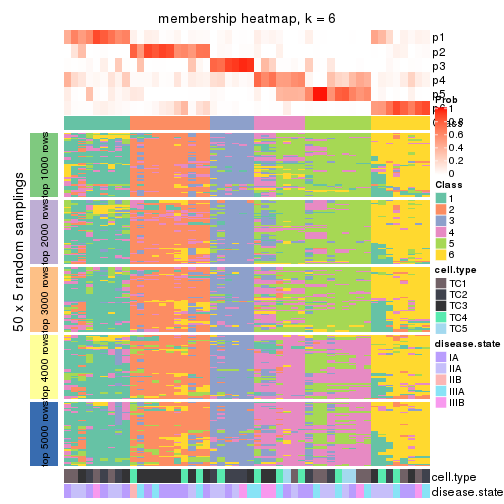</p>

</div>
</div>

As soon as we have had the classes for columns, we can look for signatures
which are significantly different between classes which can be candidate marks
for certain classes. Following are the heatmaps for signatures.


Signature heatmaps where rows are scaled:


<script>
$( function() {
	$( '#tabs-ATC-NMF-get-signatures' ).tabs();
} );
</script>
<div id='tabs-ATC-NMF-get-signatures'>
<ul>
<li><a href='#tab-ATC-NMF-get-signatures-1'>k = 2</a></li>
<li><a href='#tab-ATC-NMF-get-signatures-2'>k = 3</a></li>
<li><a href='#tab-ATC-NMF-get-signatures-3'>k = 4</a></li>
<li><a href='#tab-ATC-NMF-get-signatures-4'>k = 5</a></li>
<li><a href='#tab-ATC-NMF-get-signatures-5'>k = 6</a></li>
</ul>
<div id='tab-ATC-NMF-get-signatures-1'>
<pre><code class="r">get_signatures(res, k = 2)
</code></pre>

<p>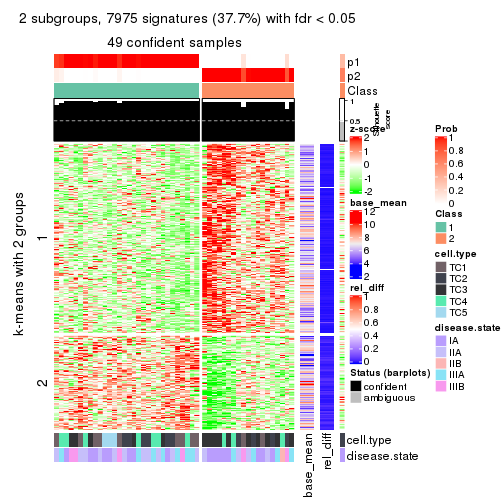</p>

</div>
<div id='tab-ATC-NMF-get-signatures-2'>
<pre><code class="r">get_signatures(res, k = 3)
</code></pre>

<p>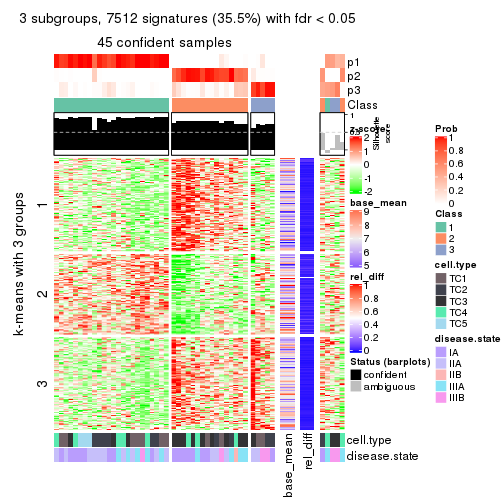</p>

</div>
<div id='tab-ATC-NMF-get-signatures-3'>
<pre><code class="r">get_signatures(res, k = 4)
</code></pre>

<p>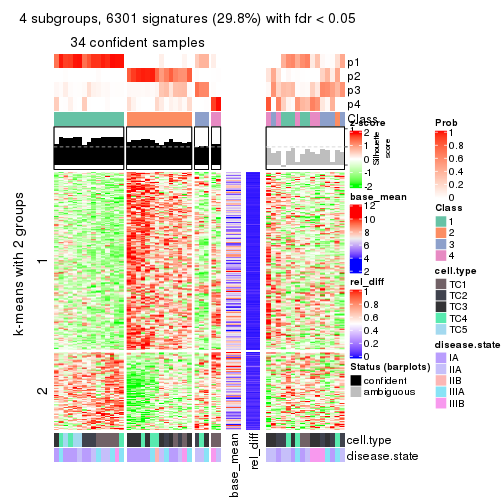</p>

</div>
<div id='tab-ATC-NMF-get-signatures-4'>
<pre><code class="r">get_signatures(res, k = 5)
</code></pre>

<p>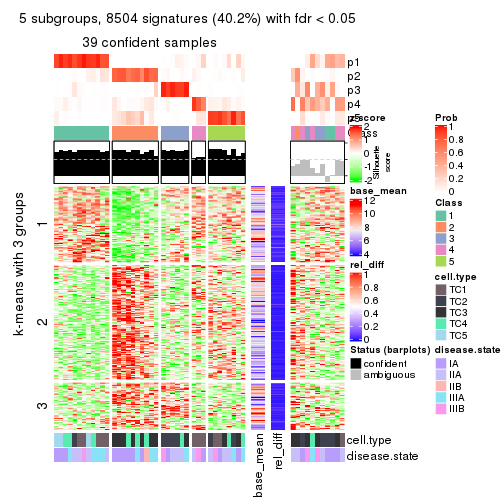</p>

</div>
<div id='tab-ATC-NMF-get-signatures-5'>
<pre><code class="r">get_signatures(res, k = 6)
</code></pre>

<p>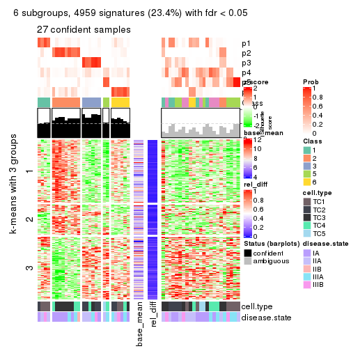</p>

</div>
</div>


Signature heatmaps where rows are not scaled:


<script>
$( function() {
	$( '#tabs-ATC-NMF-get-signatures-no-scale' ).tabs();
} );
</script>
<div id='tabs-ATC-NMF-get-signatures-no-scale'>
<ul>
<li><a href='#tab-ATC-NMF-get-signatures-no-scale-1'>k = 2</a></li>
<li><a href='#tab-ATC-NMF-get-signatures-no-scale-2'>k = 3</a></li>
<li><a href='#tab-ATC-NMF-get-signatures-no-scale-3'>k = 4</a></li>
<li><a href='#tab-ATC-NMF-get-signatures-no-scale-4'>k = 5</a></li>
<li><a href='#tab-ATC-NMF-get-signatures-no-scale-5'>k = 6</a></li>
</ul>
<div id='tab-ATC-NMF-get-signatures-no-scale-1'>
<pre><code class="r">get_signatures(res, k = 2, scale_rows = FALSE)
</code></pre>

<p>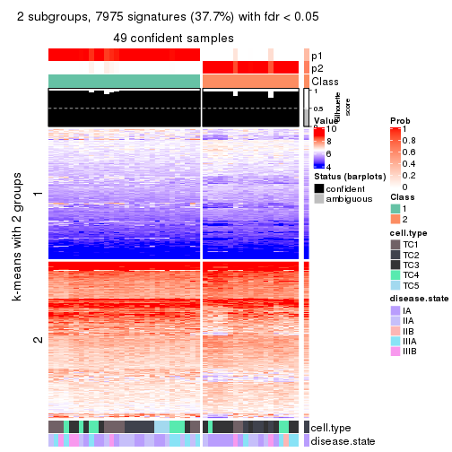</p>

</div>
<div id='tab-ATC-NMF-get-signatures-no-scale-2'>
<pre><code class="r">get_signatures(res, k = 3, scale_rows = FALSE)
</code></pre>

<p>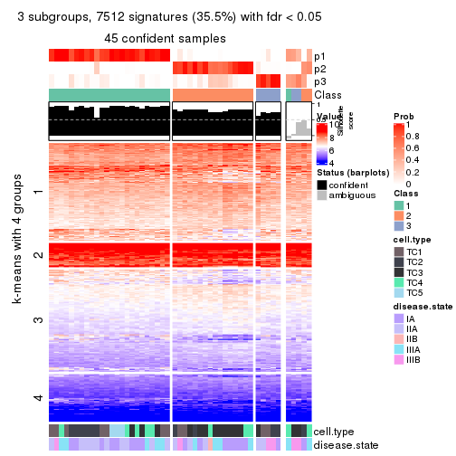</p>

</div>
<div id='tab-ATC-NMF-get-signatures-no-scale-3'>
<pre><code class="r">get_signatures(res, k = 4, scale_rows = FALSE)
</code></pre>

<p>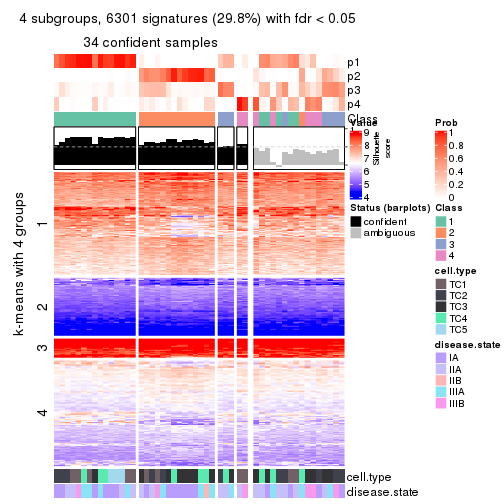</p>

</div>
<div id='tab-ATC-NMF-get-signatures-no-scale-4'>
<pre><code class="r">get_signatures(res, k = 5, scale_rows = FALSE)
</code></pre>

<p>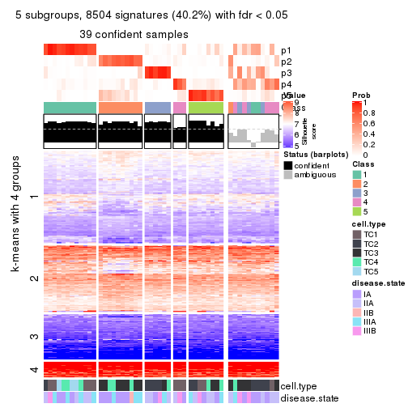</p>

</div>
<div id='tab-ATC-NMF-get-signatures-no-scale-5'>
<pre><code class="r">get_signatures(res, k = 6, scale_rows = FALSE)
</code></pre>

<p>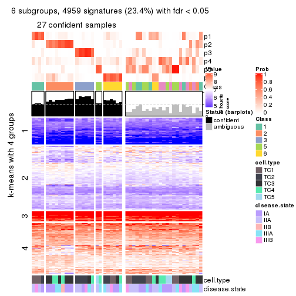</p>

</div>
</div>


Compare the overlap of signatures from different k:

```r
compare_signatures(res)
```

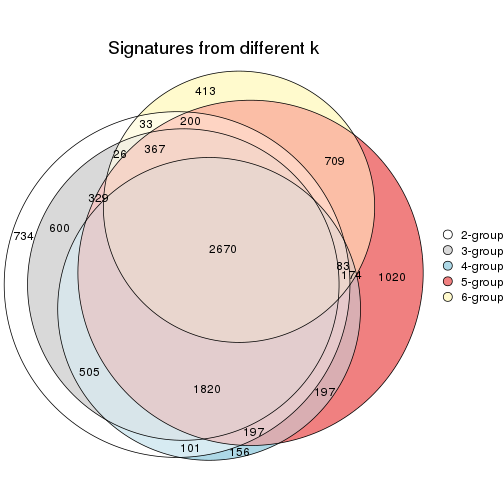

`get_signature()` returns a data frame invisibly. TO get the list of signatures, the function
call should be assigned to a variable explicitly. In following code, if `plot` argument is set
to `FALSE`, no heatmap is plotted while only the differential analysis is performed.

```r
# code only for demonstration
tb = get_signature(res, k = ..., plot = FALSE)
```

An example of the output of `tb` is:

```
#>   which_row         fdr    mean_1    mean_2 scaled_mean_1 scaled_mean_2 km
#> 1        38 0.042760348  8.373488  9.131774    -0.5533452     0.5164555  1
#> 2        40 0.018707592  7.106213  8.469186    -0.6173731     0.5762149  1
#> 3        55 0.019134737 10.221463 11.207825    -0.6159697     0.5749050  1
#> 4        59 0.006059896  5.921854  7.869574    -0.6899429     0.6439467  1
#> 5        60 0.018055526  8.928898 10.211722    -0.6204761     0.5791110  1
#> 6        98 0.009384629 15.714769 14.887706     0.6635654    -0.6193277  2
...
```

The columns in `tb` are:

1. `which_row`: row indices corresponding to the input matrix.
2. `fdr`: FDR for the differential test. 
3. `mean_x`: The mean value in group x.
4. `scaled_mean_x`: The mean value in group x after rows are scaled.
5. `km`: Row groups if k-means clustering is applied to rows.


UMAP plot which shows how samples are separated.


<script>
$( function() {
	$( '#tabs-ATC-NMF-dimension-reduction' ).tabs();
} );
</script>
<div id='tabs-ATC-NMF-dimension-reduction'>
<ul>
<li><a href='#tab-ATC-NMF-dimension-reduction-1'>k = 2</a></li>
<li><a href='#tab-ATC-NMF-dimension-reduction-2'>k = 3</a></li>
<li><a href='#tab-ATC-NMF-dimension-reduction-3'>k = 4</a></li>
<li><a href='#tab-ATC-NMF-dimension-reduction-4'>k = 5</a></li>
<li><a href='#tab-ATC-NMF-dimension-reduction-5'>k = 6</a></li>
</ul>
<div id='tab-ATC-NMF-dimension-reduction-1'>
<pre><code class="r">dimension_reduction(res, k = 2, method = &quot;UMAP&quot;)
</code></pre>

<p>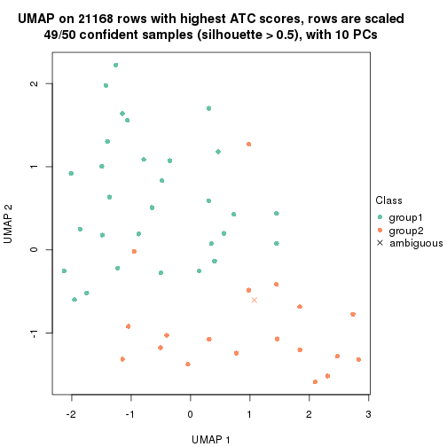</p>

</div>
<div id='tab-ATC-NMF-dimension-reduction-2'>
<pre><code class="r">dimension_reduction(res, k = 3, method = &quot;UMAP&quot;)
</code></pre>

<p>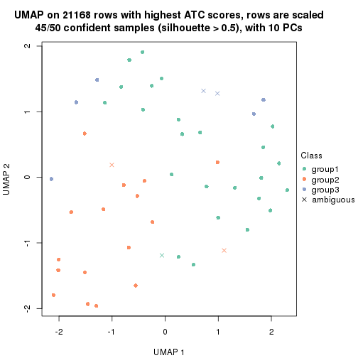</p>

</div>
<div id='tab-ATC-NMF-dimension-reduction-3'>
<pre><code class="r">dimension_reduction(res, k = 4, method = &quot;UMAP&quot;)
</code></pre>

<p>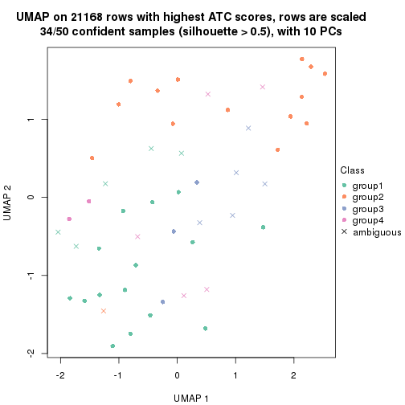</p>

</div>
<div id='tab-ATC-NMF-dimension-reduction-4'>
<pre><code class="r">dimension_reduction(res, k = 5, method = &quot;UMAP&quot;)
</code></pre>

<p>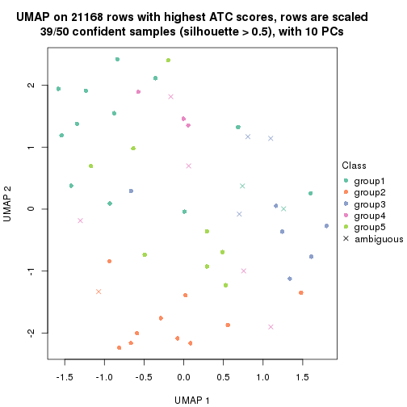</p>

</div>
<div id='tab-ATC-NMF-dimension-reduction-5'>
<pre><code class="r">dimension_reduction(res, k = 6, method = &quot;UMAP&quot;)
</code></pre>

<p>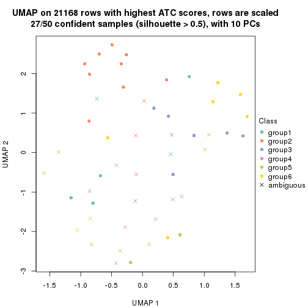</p>

</div>
</div>


Following heatmap shows how subgroups are split when increasing `k`:

```r
collect_classes(res)
```

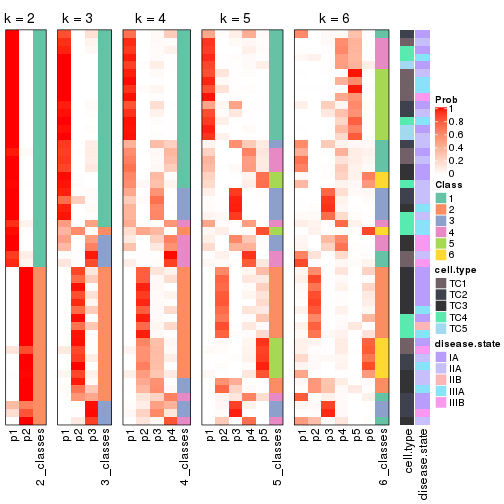


Test correlation between subgroups and known annotations. If the known
annotation is numeric, one-way ANOVA test is applied, and if the known
annotation is discrete, chi-squared contingency table test is applied.

```r
test_to_known_factors(res)
```

```
#>          n cell.type(p) disease.state(p) k
#> ATC:NMF 49     0.058385            0.485 2
#> ATC:NMF 45     0.102394            0.177 3
#> ATC:NMF 34     0.148537            0.461 4
#> ATC:NMF 39     0.000346            0.570 5
#> ATC:NMF 27     0.001107            0.511 6
```


If matrix rows can be associated to genes, consider to use `functional_enrichment(res,
...)` to perform function enrichment for the signature genes. See [this vignette](http://bioconductor.org/packages/devel/bioc/vignettes/cola/inst/doc/functional_enrichment.html) for more detailed explanations.


 

## Session info


```r
sessionInfo()
```

```
#> R version 3.6.0 (2019-04-26)
#> Platform: x86_64-pc-linux-gnu (64-bit)
#> Running under: CentOS Linux 7 (Core)
#> 
#> Matrix products: default
#> BLAS:   /usr/lib64/libblas.so.3.4.2
#> LAPACK: /usr/lib64/liblapack.so.3.4.2
#> 
#> locale:
#>  [1] LC_CTYPE=en_GB.UTF-8       LC_NUMERIC=C               LC_TIME=en_GB.UTF-8       
#>  [4] LC_COLLATE=en_GB.UTF-8     LC_MONETARY=en_GB.UTF-8    LC_MESSAGES=en_GB.UTF-8   
#>  [7] LC_PAPER=en_GB.UTF-8       LC_NAME=C                  LC_ADDRESS=C              
#> [10] LC_TELEPHONE=C             LC_MEASUREMENT=en_GB.UTF-8 LC_IDENTIFICATION=C       
#> 
#> attached base packages:
#> [1] grid      stats     graphics  grDevices utils     datasets  methods   base     
#> 
#> other attached packages:
#> [1] genefilter_1.66.0    ComplexHeatmap_2.3.1 markdown_1.1         knitr_1.26          
#> [5] GetoptLong_0.1.7     cola_1.3.2          
#> 
#> loaded via a namespace (and not attached):
#>  [1] circlize_0.4.8       shape_1.4.4          xfun_0.11            slam_0.1-46         
#>  [5] lattice_0.20-38      splines_3.6.0        colorspace_1.4-1     vctrs_0.2.0         
#>  [9] stats4_3.6.0         blob_1.2.0           XML_3.98-1.20        survival_2.44-1.1   
#> [13] rlang_0.4.2          pillar_1.4.2         DBI_1.0.0            BiocGenerics_0.30.0 
#> [17] bit64_0.9-7          RColorBrewer_1.1-2   matrixStats_0.55.0   stringr_1.4.0       
#> [21] GlobalOptions_0.1.1  evaluate_0.14        memoise_1.1.0        Biobase_2.44.0      
#> [25] IRanges_2.18.3       parallel_3.6.0       AnnotationDbi_1.46.1 highr_0.8           
#> [29] Rcpp_1.0.3           xtable_1.8-4         backports_1.1.5      S4Vectors_0.22.1    
#> [33] annotate_1.62.0      skmeans_0.2-11       bit_1.1-14           microbenchmark_1.4-7
#> [37] brew_1.0-6           impute_1.58.0        rjson_0.2.20         png_0.1-7           
#> [41] digest_0.6.23        stringi_1.4.3        polyclip_1.10-0      clue_0.3-57         
#> [45] tools_3.6.0          bitops_1.0-6         magrittr_1.5         eulerr_6.0.0        
#> [49] RCurl_1.95-4.12      RSQLite_2.1.4        tibble_2.1.3         cluster_2.1.0       
#> [53] crayon_1.3.4         pkgconfig_2.0.3      zeallot_0.1.0        Matrix_1.2-17       
#> [57] xml2_1.2.2           httr_1.4.1           R6_2.4.1             mclust_5.4.5        
#> [61] compiler_3.6.0
```


